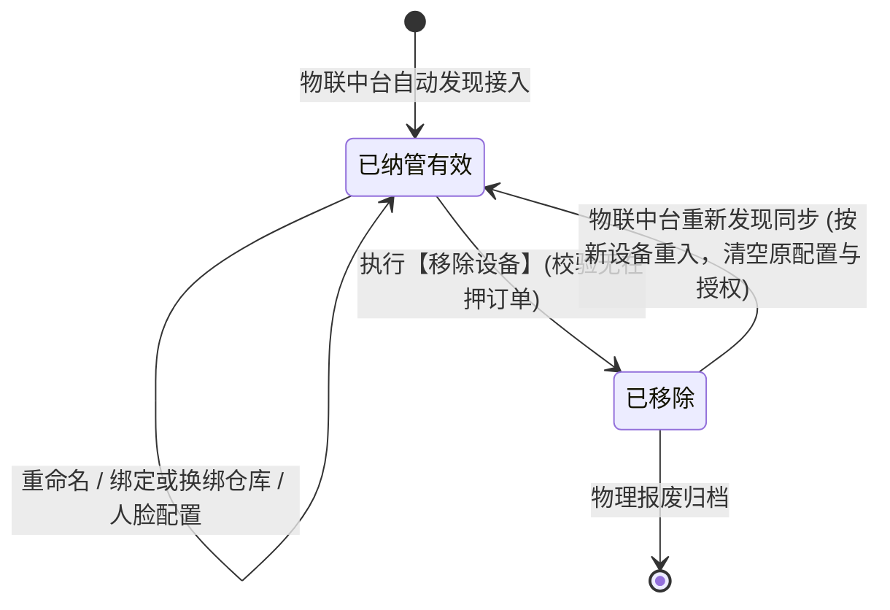
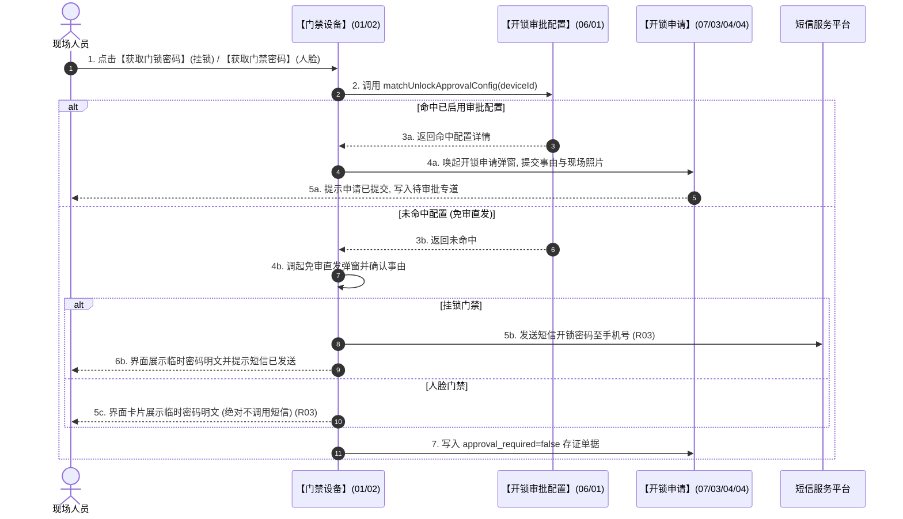

# 门禁设备 业务规则规格

> **文档定位**：**三件套核心**——状态机、动作约束、校验规则、计算联动、权限与跨模块流程的**唯一定义来源**。配套：[主PRD](./门禁设备主PRD.md)（业务与页面功能）、[字段清单](./门禁设备字段清单.md)（字段）。ASCII/Demo 为衍生，只引用本文件规则 ID，不重复定义规则本体。
>
> **统一引用规范**：
> - 本台账：【门禁设备】台账（菜单：物联网IOT管理 → 门禁设备，代号 01/02）
> - 上游策略：【开锁审批配置】策略（菜单：配置管理 → 业务流程管理 → 开锁审批，代号 06/01）
> - 协同审核：【开锁审核】台账（菜单：工作中心 → 审批中心 → 其他审批 → 开锁审核，代号 07/05/03）
> - 协同申请：【开锁申请】单据（菜单：工作中心 → 审批中心 → 业务审批 → 我的申请管理 → 开锁申请，代号 07/03/04/04）
> - 协同监控：【监控设备】台账（菜单：物联网IOT管理 → 监控设备，代号 01/01）
>
> **版本**：V4.0 基准版 | **更新时间**：2026-09-18 | **责任人**：产品架构组

---

## 一、单据与能力定位

| 维度 | 标准定位规格 | 业务解释与控制边界 |
| :--- | :--- | :--- |
| **模块层级** | 物理安全执行与门禁准入中枢（Physical Security & Access Control Layer） | 纳管全网挂锁与人脸门禁主数据，承接现场开锁请求与权限下发。 |
| **菜单路径** | `物联网IOT管理 → 门禁设备` | 系统代号为 `01/02`，为仓储出入口物理控制核心阵地。 |
| **核心职责** | 门禁物理资产管理与开锁前置控制 | 维护设备信息、仓库储位映射，驱动免审直发与审批申请智能路由，执行短信安全边界控制。 |
| **单据/数据源头** | 物联中台自动发现与手工纳管 | 设备硬件档案源自第三方门禁物联平台自动同步；业务别名与仓位由系统管理员手工维护。 |
| **上下游协同** | 策略匹配驱动与数据穿透 | 上游读取【开锁审批配置】(06/01)进行策略匹配；下游驱动【开锁申请】(07/03/04/04)入库与【人脸配置】(01/05)白名单下发。 |
| **审核与存证机制**| 业务免审直发生效应即存证 | 免审直发与审批申请双轨全量落账单据；历史关联的质押订单与出入库单据保留不可变设备快照。 |

---

## 二、数量与计算口径隔离表

| 指标/判定项 | 严格业务口径与判定公式 | 边界条件与约束控制 | 关联规则编号 |
| :--- | :--- | :--- | :--- |
| **开锁审批智能匹配路由** | 设目标门禁设备 ID 为 $d$，租户内处于生效（`ENABLED`）状态的审批配置集合为 $\mathbb{C}_{active}$。匹配函数定义为：$$\text{MatchApproval}(d) = \begin{cases} C_k, & \text{if } \exists C_k \in \mathbb{C}_{active} \text{ s.t. } d \in D(C_k) \\ \text{NULL}, & \text{otherwise} \end{cases}$$ | 1. 若返回 $C_k$，唤起【开锁申请】弹窗，写入审批流； 2. 若返回 NULL，唤起免审直发弹窗，沉淀免审存证记录。 | **R02** |
| **短信发送边界判定 (R31)** | 设设备类型为 $Type(d) \in \{\text{PADLOCK}, \text{FACE}\}$。短信发送指示函数定义为：$$\mathbb{I}_{SMS}(d) = \begin{cases} 1, & \text{if } Type(d) = \text{PADLOCK} \\ 0, & \text{if } Type(d) = \text{FACE} \end{cases}$$ | 1. 挂锁门禁支持短信发送； 2. **人脸门禁严禁为 1，绝对禁止调用短信网关发送密码**。 | **R03** |
| **在押订单移除阻断判定** | 设设备所在库房分区当前生效的抵质押在押订单集合为 $\mathbb{O}_{active}$，该设备绑定的质押监管任务集合为 $\mathbb{T}(d)$。移除允许函数定义为：$$\text{CanRemove}(d) = \begin{cases} \text{FALSE}, & \text{if } \mathbb{O}_{active} \cap \mathbb{T}(d) \neq \emptyset \\ \text{TRUE}, & \text{if } \mathbb{O}_{active} \cap \mathbb{T}(d) = \emptyset \end{cases}$$ | 若返回 FALSE，系统强制阻断移除，防止在押监管仓库脱离门禁物理防护。 | **R06** |
| **人脸通行有效期跨度** | 设申请人选择的人脸门禁有效起止为 $[T_{start}, T_{end}]$。必须满足：$$T_{end} - T_{start} \le 86400 \quad (\text{即 } 24 \text{ 小时}) \quad \land \quad T_{start} \ge T_{now}$$ | 仅限人脸门禁；超过 24 小时前端阻断并标红提示。 | **R08** |

---

## 三、单据状态机与生命周期流转

### 3.1 运行状态与生命周期
* 门禁设备为物理资产，采用**物理连接状态**与**系统纳管生命周期**双轨刻画：
  - **物理连接状态**：在线 (`ONLINE`)、离线 (`OFFLINE`)；由物联心跳网关实时维护；
  - **空间绑定状态**：已绑定 (`BOUND`)、未绑定 (`UNBOUND`)；
  - **纳管生命周期**：已纳管有效、已移除软删除 (`REMOVED`)。

### 3.2 设备生命周期流转图

### 3.3 动作控制与流转规则表

| 当前生命周期 | 触发动作 | 适用角色 | 前置业务校验条件 | 结果状态 | 联动后置影响 | 失败阻断处理与提示 |
| :--- | :--- | :--- | :--- | :--- | :--- | :--- |
| **已纳管有效** | 获取门锁密码 | 授权操作人员 | 挂锁门禁；当前用户已绑定手机号 | 生成临时密码 | 1. 挂锁下发短信通知； 2. 页面展示明文密码； 3. 写入开锁存证流水。 | 浮窗提示：「获取密码失败：当前账号未绑定手机号」 |
| **已纳管有效** | 获取门禁密码 | 授权操作人员 | 人脸门禁；有效时限 $\le 24$ 小时 | 生成临时密码 | 1. 仅在页面展示临时密码卡片； 2. 严禁发短信； 3. 写入开锁流水。 | 浮窗提示：「获取密码失败：有效时限不可超过 24 小时」 |
| **已纳管有效** | 绑定仓库 | 仓储安全管理员 (`R-WH-SEC`) | 具备目标仓库管辖权限；层级合法 | 保持有效 | 1. 建立空间拓扑映射； 2. 状态更新为已绑定； 3. 通知预警引擎更新设备池。 | 浮窗提示：「绑定失败：目标储位无效」 |
| **已纳管有效** | 移除设备 | 仓储安全管理员 (`R-WH-SEC`) | 1. 当前设备无生效在押订单； 2. 必录移除说明（$\le 200$字）。 | **已移除** | 1. 级联解绑人脸白名单授权； 2. 级联失效预警规则； 3. 写入全量审计留痕。 | 浮窗提示：「移除阻断：该设备所在库区当前存在在押订单，受风控监管限制禁止移除」 |

---

## 四、动作能力与流转控制矩阵

| 触发动作 | 操作入口 | 适用角色 | 前置业务校验条件 | 结果状态 | 联动后置影响 | 失败阻断提示 |
| :--- | :--- | :--- | :--- | :--- | :--- | :--- |
| **【获取门锁密码】**| 列表行操作【获取门锁密码】 | 现场授权人员 | 仅挂锁门禁展示；服务端强校验类型 | 弹出密码窗口 | 命中策略调起申请，未命中调起免审并下发短信 | 浮窗提示：「非法调用：该设备不是挂锁门禁」 |
| **【获取门禁密码】**| 列表行操作【获取门禁密码】 | 现场授权人员 | 仅人脸门禁展示；服务端强校验类型 | 弹出密码窗口 | 命中策略调起申请，未命中调起免审(仅界面展示) | 浮窗提示：「非法调用：该设备不是人脸门禁」 |
| **【人脸配置】** | 列表行操作【人脸配置】 | 仓储安全管理员 | 仅人脸门禁展示；设备有效 | 调起配置弹窗 | 平铺展示授权名单，可快捷穿透至人脸管理模块 | 浮窗提示：「加载授权数据失败」 |
| **【设备数据】** | 列表行操作【设备数据】 | 授权风控/监管人员 | 任意有效门禁设备均可查看 | 调出只读抽屉 | 分区展示事务记录与预警记录快照 | 浮窗提示：「数据加载异常」 |
| **【重命名】** | 列表行操作【重命名】 | 仓储安全管理员 | 具备管理权限；名称符合规范 | 更新系统名称 | 固化人工别名保护标记，防止第三方覆盖 | 浮窗提示：「名称冲突或版本过期」 |
| **【绑定仓库】** | 列表行操作【绑定仓库】 | 仓储安全管理员 | 目标仓库属于管辖权限范围 | 更新空间映射 | 热更新预警规则索引与空间拓扑 | 浮窗提示：「无权操作该仓库」 |
| **【移除设备】** | 列表行操作【移除设备】 | 仓储安全管理员 | 无在押订单占用；必录移除说明 | 移出有效列表 | 级联解绑人脸配置、预警规则与仓位映射 | 浮窗提示：「在押订单关联强阻断」 |

---

## 五、核心业务规则清单

### 5.1 介质分类与密码下发通道规则 (R01~R03)

#### 【设备类型分类与行操作矩阵】(R01)
1. **类型强隔离**：门禁设备分为「挂锁门禁」与「人脸门禁」。
2. **操作矩阵控制**：
   - 挂锁门禁：仅展示【获取门锁密码】、【设备数据】、【重命名】、【绑定仓库】、【移除设备】；
   - 人脸门禁：仅展示【获取门禁密码】、【人脸配置】、【设备数据】、【重命名】、【绑定仓库】、【移除设备】；
3. **服务端二次鉴权**：接口层强制校验设备类型，严禁通过接口伪造对人脸门禁调用门锁密码接口，或对挂锁调用人脸配置接口。

#### 【开锁审批前置决策路由规则】(R02)
1. **统一入口路由**：用户点击获取密码时，系统首先执行 `matchUnlockApprovalConfig(deviceId)`：
   - **命中已启用配置**：调起【开锁申请】(07/03/04/04)弹窗，录入事由与现场照片，单据记为 `approval_required = true`，进入审批中心流转；
   - **未命中配置**：调起免审直发弹窗，确认事由后直接下发临时密码，单据记为 `approval_required = false`，状态为「无需审核」，完成存证。

#### 【短信下发能力边界与介质隔离 (R31)】(R03)
1. **挂锁门禁双通道**：挂锁门禁无论免审还是审批通过，系统均执行「前端界面大字号展示明文密码」+「向申请人绑定手机号发送短信通知」。
2. **人脸门禁绝对约束**：人脸识别门禁生成的临时通行密码，一律**仅在前端页面展示并提供一键复制，绝对禁止调用短信网关发送短信**，防止通道滥用与资费浪费。

### 5.2 数据权限与级联解绑规则 (R04~R07)

#### 【仓库数据权限双重过滤】(R04)
1. **已绑定设备过滤**：已绑定具体仓库的设备，严格按照当前登录人员绑定的仓库数据权限范围进行查询过滤。
2. **未绑定设备隔离**：尚未绑定具体仓库的新接入设备，仅向具备租户级或所属机构总部级管理权限的用户展示。

#### 【仓库储位空间拓扑绑定】(R05)
1. **拓扑层级校验**：执行仓库绑定时，系统强制校验所选的仓库、库房、分区具备严格树形包含关系，禁止跨仓库悬挂储位。
2. **绑定状态定义**：设备绑定了仓库、库房或分区任一位置即判定为「已绑定」，三者均未绑定时为「未绑定」。

#### 【移除设备级联解绑与在押阻断】(R06)
1. **在押订单强阻断**：点击移除设备时，系统必须实时校验设备所在库区是否存在状态为「在押」或「待解押」的供应链金融订单。若存在，系统**绝对阻断移除**，弹窗提示：「阻断：该设备所在库区当前存在在押订单【订单编号】，受金融风控监管限制禁止移除」。
2. **关联级联解绑**：若无在押订单，确认移除后，系统在单个原子事务内完成：① 同步移除该设备在【人脸配置】(01/05)中的所有人脸白名单授权与凭证撤销指令；② 级联失效关联的【设备预警配置】(03/02)；③ 将设备移出有效列表，写入全量审计日志。

#### 【乐观锁版本并发防护】(R07)
1. **并发版本校验**：重命名、仓库绑定及移除设备时，前端必须携带数据当前版本戳 `version`。
2. **冲突阻断**：后台比对发现并发冲突时，终止操作并浮窗提示：「当前数据已被他人修改，请刷新页面重新操作」。

---

## 六、异常与边界控制矩阵

| 异常编号 | 异常场景 | 系统判定与控制动作 | 前端反馈与提示 |
| :--- | :--- | :--- | :--- |
| **【挂锁未绑定手机号】(C01)**| 现场人员账号未绑定手机号时尝试获取门锁密码 | 校验申请人主档手机号为空 | 浮窗提示：「获取密码失败：当前账号未绑定手机号，无法接收挂锁短信」 |
| **【在押订单移除阻断】(C02)**| 尝试移除绑定在在押质押库区的门禁设备 | 校验到 $\mathbb{O}_{active} \cap \mathbb{T}(d) \neq \emptyset$ | 错误弹窗阻断：「该设备关联在押质押订单【{订单号}】，受风控限制禁止移除」 |
| **【人脸有效期超限】(C03)** | 人脸门禁填报的通行有效期大于 24 小时 | 计算 $T_{end} - T_{start} > 86400$ | 浮窗提示：「人脸通行有效时限最长不可超过 24 小时」 |
| **【重命名名称冲突】(C04)** | 重命名为租户内已存在的门禁设备系统名称 | 租户内唯一性校验失败 | 输入框标红提示：「该设备名称已被使用，请重新输入」 |
| **【人脸门禁滥发短信】(C05)**| 异常调用短信接口尝试为人脸门禁发送短信 | 后端类型强校验拦截 $\mathbb{I}_{SMS} = 0$ | 错误代码 400：「人脸门禁不支持短信下发通道」 |
| **【设备移除级联异常】(C06)**| 移除设备时三方人脸凭证撤销指令响应超时 | 事务回滚并进入后台异步补偿队列 | 浮窗提示：「设备移除中，后台正在撤销人脸授权，请稍后刷新」 |

---

## 七、跨模块业务联动与时序推演

---

## 八、规则全景速查索引表

| 规则类别 | 规则编号 | 规则名称 | 核心约束摘要 |
| :--- | :--- | :--- | :--- |
| **分类隔离** | **R01** | 设备类型与操作能力矩阵 | 挂锁仅支持门锁密码；人脸支持门禁密码与人脸配置，服务端强鉴权。 |
| **决策路由** | **R02** | 开锁审批前置决策路由规则 | 统一入口匹配规则，命中走审批申请，未命中走免审直发，双轨存证。 |
| **短信边界** | **R03** | 短信下发能力边界规则 (R31) | 挂锁支持短信+页面；人脸门禁严格仅界面展示，绝不调用短信 API。 |
| **权限隔离** | **R04** | 仓库数据权限双重过滤规则 | 已绑设备受仓库权限过滤；未绑设备仅租户机构总部可见。 |
| **空间拓扑** | **R05** | 仓库储位空间拓扑绑定规则 | 强制校验仓库-库房-分区层级合法性，绑定任一层即为已绑定。 |
| **级联移除** | **R06** | 移除设备级联解绑与安全阻断 | 存在在押订单强阻断移除；无订单则原子解绑人脸配置与预警规则。 |
| **并发防护** | **R07** | 乐观锁版本并发控制规则 | 携带版本戳提交，并发冲突强阻断并提示刷新重试。 |
| **时效控制** | **R08** | 人脸通行有效时限跨度约束 | 人脸开锁临时有效期不得超过 24 小时，过期硬件白名单自动注销。 |

---
*版本说明：V4.0 基准版 | 责任人：产品架构组 | 2026年09月*
