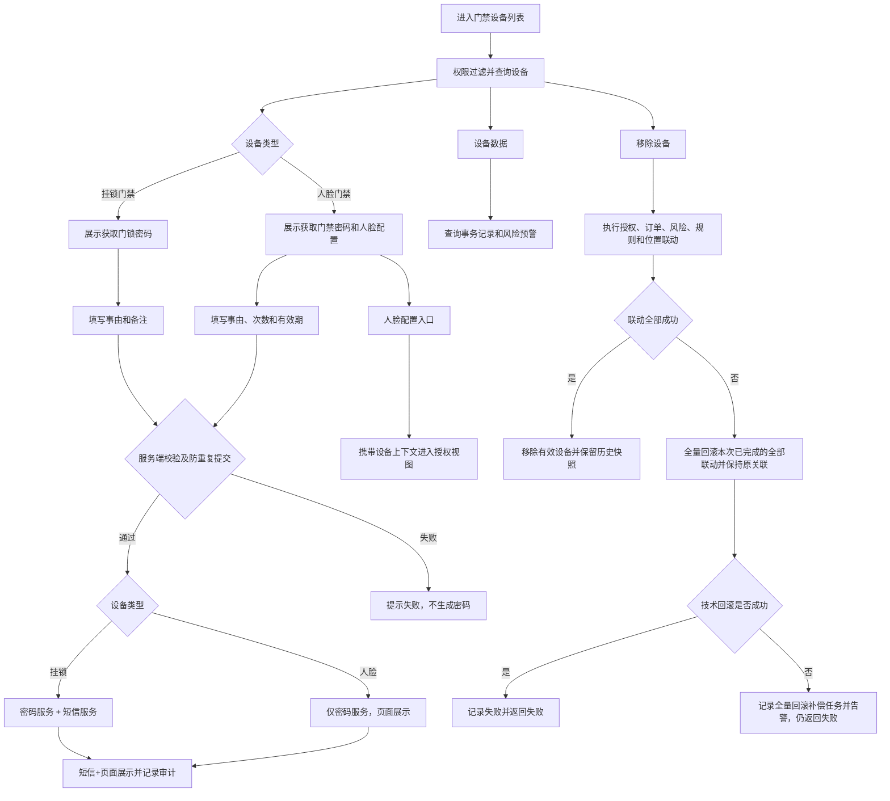

# 门禁设备业务规则规格

> **文档定位**：门禁设备状态机、动作约束、校验规则、权限与计算规则的唯一定义来源。主 PRD、字段清单只引用本文件规则 ID，不重复定义规则本体。

> **文档定位**：门禁设备类型差异、密码获取、人脸授权入口、设备数据和移除联动规则唯一来源。
> **参考文档**：[门禁设备主PRD](./门禁设备主PRD.md)、[门禁设备字段清单](./门禁设备字段清单.md)、[门禁设备业务规则规格](门禁设备业务规则规格.md)
> **版本**：V1.1 | **更新时间**：2026-08-31

## 〇、凭证下发通道（系统设计约束 · 2026-08-31 确认）

> **来源**：现有系统架构决定，非本模块可选配置。

| 设备类型 | 凭证形态 | 短信下发 | 页面展示 | 绑定手机号校验 |
| :--- | :--- | :---: | :---: | :---: |
| **挂锁门禁** | 动态门锁密码 | **✅ 必须** | ✅ 同步展示 | ✅ 提交前校验 |
| **人脸门禁** | 6 位临时开锁密码 | **❌ 不涉及** | ✅ 唯一渠道 | ❌ 不要求 |

- 挂锁「获取门锁密码」：密码服务生成后**必须**经短信网关发送至登录账号绑定手机号，页面弹窗同步展示掩码/明文。
- 人脸「获取门禁密码」：密码服务生成后**仅在页面临时密码卡片展示**并提供复制，**不调用短信服务**；UI 与字段清单不得出现「短信发送状态」等人脸侧字段。
- 审批通过后凭证下发遵循同一约束：挂锁可走短信 + 页面；人脸仅页面（详见 [07-开锁申请业务规则规格 §0.1](../../07-审批中心/03-业务审批/04-我的申请管理/04-开锁审批/开锁申请业务规则规格.md) · R27）。

## 一、设备类型与操作矩阵

| 设备类型 | 设备数据 | 获取门锁密码 | 获取门禁密码 | 人脸配置 |
| :--- | :---: | :---: | :---: | :---: |
| 挂锁门禁 | ✅ | ✅ | ❌ | ❌ |
| 人脸门禁 | ✅ | ❌ | ✅ | ✅ |

服务端必须再次校验设备类型，不能仅依赖前端隐藏按钮。

## 二、核心规则

| 规则编号 | 规则 |
| :--- | :--- |
| R01 | 设备编码是请求幂等、授权关联、事务查询和审计的主要业务键。 |
| R02 | 挂锁门禁密码操作必填事由，可填备注，密码有效期为3天；**须短信下发至绑定手机号**并在页面同步展示；密码明文不得写入日志。 |
| R03 | 人脸门禁密码操作必填事由、开锁次数和有效期；次数范围1～100，最长24小时；**仅页面展示临时密码并提供复制，不涉及短信下发**；不要求绑定手机号。 |
| R07 | 短信网关仅服务于挂锁门禁凭证下发；人脸门禁任何路径（含免审、审批通过后）均不得调用短信服务。 |
| R04 | 人脸配置只展示已完成人脸或开锁密码配置且账号启用的人员；设备模块只维护当前设备上下文。 |
| R05 | 事务记录和风险预警只读展示，处理动作归属对应业务模块。 |
| R06 | 设备移除时同步解除人脸授权、订单设备绑定、风险规则、通知规则和仓库位置绑定。 |

## 三、并发、幂等与审计

1. 密码获取使用设备编码、操作人和请求标识进行防重复提交；同一请求不得生成多份临时密码。
2. 授权分配、移除设备和仓库绑定必须执行服务端版本校验或锁控制。
3. 审计记录操作人、角色、设备编码、类型、事由、参数摘要、前后关系和最终结果；**挂锁**额外记录短信发送结果；人脸不涉及短信字段；密码明文、照片原文不得入日志。
4. 设备移除采用全量回滚；任一联动失败时恢复操作前设备状态、授权关系、风险规则、通知规则、仓库位置和订单关联，并记录各联动子结果。

---

## 业务流程与联动

> 以下内容由原《门禁设备业务流程》合并，与上文规则 ID 配合阅读；重复的状态机定义以上文为准。

> **版本**：V1.0 | **更新时间**：2026-08-14
> **适用模块**：门禁设备维护、密码获取、设备数据和人脸授权入口

## 一、流程说明

1. 系统按设备类型和数据权限加载门禁设备列表。
2. 用户进入设备数据时，系统分别查询事务记录和风险预警；任一分区失败不影响另一分区展示。
3. 用户获取密码时，系统校验设备类型、角色权限、业务参数和防重复提交，再调用密码服务；**仅挂锁**追加调用短信服务。
4. 人脸门禁授权通过当前设备上下文进入人脸配置模块，授权和下发结果由人脸配置模块维护。
5. 移除设备时执行授权、订单、风险、规则、通知和位置联动；所有关键结果写入审计。

## 二、业务流程图

## 三、异常回路

| 异常场景 | 处理结果 |
| :--- | :--- |
| 前端按钮与设备类型不一致 | 后端拒绝请求并记录安全审计 |
| 挂锁短信发送失败或超时 | 不展示为成功，不记录密码明文，按规则返回失败 |
| 人脸误调用短信服务 | 后端拒绝并记录安全审计（R07） |
| 授权下发失败 | 保留原授权关系，进度记录标记失败 |
| 事务或风险查询失败 | 分区展示失败状态，不返回无权限数据 |
| 移除设备任一联动失败 | 采用全量回滚，撤销本次请求已完成的全部联动变更并保留操作前原关联；全量回滚失败时记录内部补偿任务并告警，补偿完成前不移除有效设备 |

## 修订记录

| 日期 | 版本 | 变更 |
| :--- | :---: | :--- |
| 2026-08-20 | — | 合并原《门禁设备业务流程》至本文件「业务流程与联动」章节 |
| 2026-08-31 | V1.1 | 确认系统设计约束：短信下发仅挂锁；人脸凭证仅页面展示（§〇、R03、R07） |
