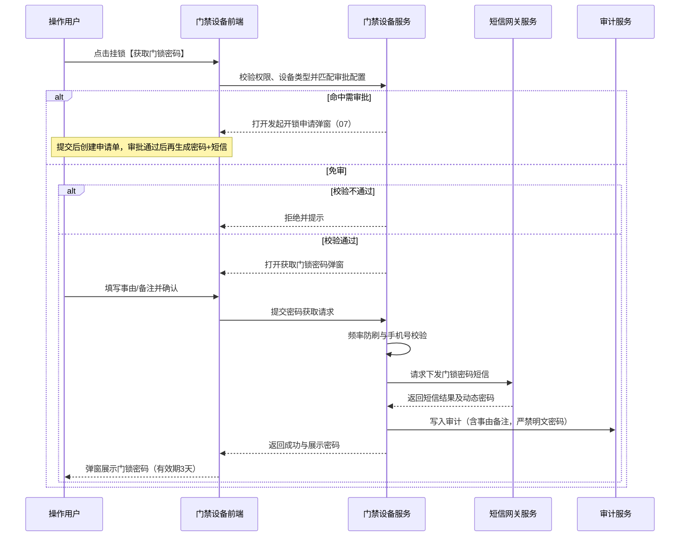
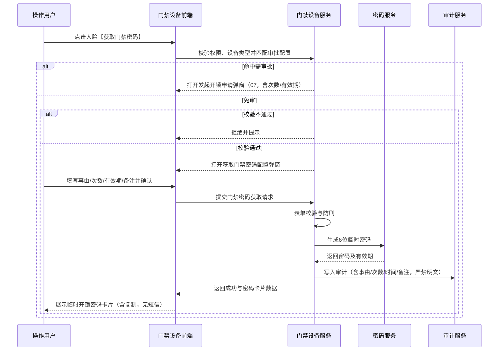
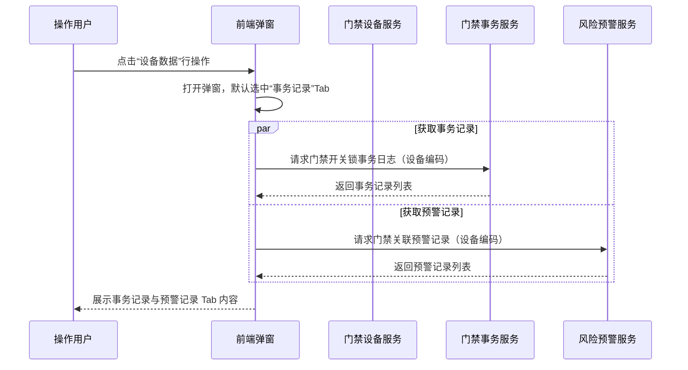
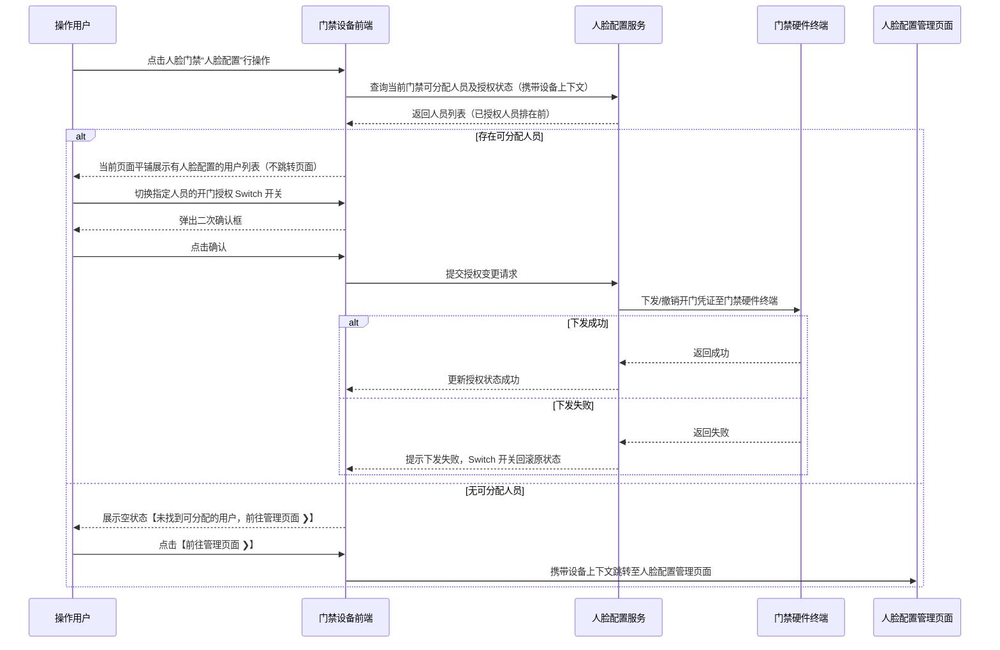

# 门禁设备主需求文档

> **版本**：V1.10 | 2026-08-31
> **读者**：研发工程师、测试工程师、产品复核
> **编写依据**：门禁设备字段清单、监控设备主 PRD、人脸配置主 PRD
> **字段基准**：[`门禁设备字段清单.md`](./门禁设备字段清单.md) 是设备主数据和系统字段的唯一基准；行操作的输入、查询、展示、返回及特有审计字段以对应操作子清单为准；人脸配置和门禁事务字段由所属模块字段清单维护。

## 1. 业务背景

门禁设备是仓储监管与质押安全控制的关键物理屏障，分为挂锁门禁与人脸门禁两类设备。挂锁门禁主要用于仓库出入口、大门或货柜的物理挂锁出入控制；人脸门禁兼具身份识别开门与视频监控监控摄像头双重能力。

系统负责维护门禁设备基础档案、仓库绑定关系，并提供“获取门锁密码”（挂锁门禁专属）、“获取门禁密码”（人脸门禁专属）、“人脸配置”（人脸门禁专属）及“设备数据”（门禁开关锁事务记录与预警记录）等操作。设备数据同时被订单、仓库管理、人脸授权和风险预警模块引用，设备移除或绑定变更会影响多个下游业务。

本菜单不承载审批单据，也不建立独立设备业务状态机。设备的“状态”（在线/离线）属于系统实时获取与维护字段，不能通过状态按钮直接驱动业务流转；重命名、仓库绑定、设备数据、获取门锁密码、获取门禁密码、人脸配置和移除设备均是独立操作。

## 2. 功能范围

**本期范围**：

- 门禁设备列表、组合筛选和字段展示（支持设备类型、设备状态、绑定仓库等组合查询）；
- 挂锁门禁与人脸门禁的分类展示、筛选与行操作差异化控制；
- 按数据权限查看已绑定位置或未绑定位置的门禁设备；
- 重命名、仓库绑定、设备数据、获取门锁密码（挂锁）、获取门禁密码（人脸）、人脸配置和移除设备行操作；
- “设备数据”弹窗只读展示门禁“事务记录”（开关锁事件日志）与“预警记录”（开锁异常/门锁超时未闭合等预警）；其中“事务记录”Tab与【物联网IOT管理 - 门禁事务记录】独立菜单共用同一数据集，前者按当前设备上下文展示，后者支持全量筛选。
- 挂锁门禁【获取门锁密码】：先匹配审批配置；**免审**时提示弹窗、事由/备注、短信下发及页面密码展示；**需审批**时切换 [07-发起开锁申请](../../07-审批中心/03-业务审批/04-我的申请管理/04-开锁审批/开锁申请主PRD.md)（§3.4、§5.5）；
- 人脸门禁【获取门禁密码】：先匹配审批配置；**免审**时配置弹窗及页面临时密码卡片（**不涉及短信**）；**需审批**时切换 07 发起开锁申请（§3.4、§5.5）；
- 人脸门禁当前页面平铺展示“人脸配置”可授权人员，无可分配人员时携带设备上下文跳转至“人脸配置”模块，并提供门禁开锁权限开关控制；
- 设备操作的权限校验、并发控制、幂等处理和审计记录。

### 2.1 移动端范围（已确认）

移动端支持门禁设备列表与筛选、重命名、仓库绑定、设备数据、移除设备，以及按设备类型获取对应密码；人脸配置入口、设备审计和独立事务查询不纳入本模块移动端范围。门禁事务记录移动端查看见独立模块。

**不在本期范围**：

- 门禁设备接入、注册和第三方门禁硬件基础档案创建；
- 人脸照片采集、开锁密码生成算法及底层硬件固件通信；
- 人脸配置模块内部的人员档案维护、密码修改和人脸特征库同步；
- 门禁预警信息的处理、解除和处置过程（由风险预警模块承载）；
- 抵质押订单审批、订单解绑等业务办理过程；
- 门禁设备独立业务状态机和独立审批流程；
- 第三方厂商门禁状态计算、短信网关及人脸识别算法内部实现。

## 3. 模块定位

### 3.1 系统位置

| 项目 | 内容 |
| :--- | :--- |
| 模块层级 | 设备基础数据与门禁安全控制层 |
| 核心职责 | 维护门禁设备名称和仓库位置，提供门锁/门禁密码下发、人脸授权配置及门禁开关锁事务与预警数据查询 |
| 数据来源 | 第三方门禁接入平台、系统设备配置、用户仓库绑定操作、人脸配置模块及风险预警模块 |
| 上游依赖 | **第三方设备接入**提供门禁设备 ID、设备类型、在线状态和门锁能力；**仓库档案**提供仓库/库房/分区 ID及绑定位置；**账号与数据权限**提供租户、机构、菜单及仓库可见范围；**人脸配置数据**提供人员授权关系和凭证下发结果。来源：[门禁设备字段清单](./门禁设备字段清单.md)、REF-WH、REF-ACCOUNT、REF-RBAC、[人脸配置字段清单](../05人脸配置/人脸配置字段清单.md)。 |
| 下游引用 | 仓库物理出入控制、人脸门禁授权管理、设备预警信息、押品预警信息、设备事务通知及订单风控规则 |
| 业务单据 | 不生成独立业务单据，不建立单据状态机 |

### 3.2 设备分类与能力差异

| 设备类型 | 物理形态/功能 | 核心行操作能力 | 菜单归属 |
| :--- | :--- | :--- | :--- |
| 挂锁门禁 | 物理挂锁/电子挂锁，用于大门或柜门 | 重命名、仓库绑定、设备数据、获取门锁密码、移除设备 | 仅门禁设备菜单 |
| 人脸门禁 | 具备人脸识别开门及监控摄像头能力 | 重命名、仓库绑定、设备数据、人脸配置、获取门禁密码、移除设备 | 可同时存在于门禁设备和监控设备菜单 |

人脸门禁因具备摄像头功能，同时属于监控设备范围。同一设备 ID 作为同一设备主数据，根据设备能力归属并展示到对应菜单：在“门禁设备”菜单承载人脸配置与门禁事务数据；在“监控设备”菜单承载直播、回放及图像锚点能力。设备分类、设备编码、名称和操作结果在两个菜单中不得出现不一致。

### 3.3 设备同步规则

移除设备成功后，设备从门禁设备有效列表中移除。当一台人脸门禁设备被“移除”时，系统自动**同步移除该设备在【人脸配置】模块中的所有用户授权分配关系**（从对应用户的“门禁数据”列表中移除该设备，解绑授权关系并下发凭证撤销指令）。系统每 5 分钟轮询三方设备接口，发现被移除设备仍存在时，按原设备 ID 重新加入有效设备列表；重入仅恢复三方返回的基础识别信息，系统内名称、仓库/库房/分区绑定、图像锚点、设备预警配置及门禁凭证/人脸授权均不恢复并清空，需由管理员重新维护。本模块不定义独立状态字段或状态流转。

### 3.4 开锁审批模式分支（6.2 扩展）

本模块仍是设备主档与密码获取**入口**；命中需审批规则时，不在本模块生成审批单据，而是创建 [07-审批中心/03-业务审批/04-我的申请管理/04-开锁审批](../../07-审批中心/03-业务审批/04-我的申请管理/04-开锁审批/开锁申请字段清单.md) 单据，待办在审批中心处理。审批规则配置见 [06-门禁开锁审批/01-审批配置](../../06-门禁开锁审批/01-审批配置/)；全链路编排见 [06-门禁开锁审批/门禁开锁审批-业务规则规格](../../06-门禁开锁审批/门禁开锁审批-业务规则规格.md)。

| 分支 | 触发条件 | 本模块行为 | 文档唯一定义 |
| :--- | :--- | :--- | :--- |
| 免审直发 | 未命中需审批配置，或全局审批开关关闭 | 沿用原有获取门锁/门禁密码流程 | 本模块操作字段清单 |
| 审批申请 | 命中需审批配置 | 切换为申请表单并提交至审批中心 | [发起开锁申请字段清单](../../07-审批中心/03-业务审批/04-我的申请管理/04-开锁审批/01-开锁申�./02-操作字段清单/01发起开锁申请字段清单.md) |

## 4. 页面与字段规则

### 4.1 字段引用

列表字段、筛选字段、字段来源、取值、展示顺序和字段级校验统一以[门禁设备字段清单](./门禁设备字段清单.md)为准；本主 PRD 不重复定义字段属性。行操作的输入、查询、展示、返回和特有审计字段统一以[门禁设备操作字段清单索引](./02-操作字段清单/操作字段清单索引.md)及其子清单为准。事务记录和预警记录字段分别由关联模块维护。

本节只保留数据权限、操作流程、业务规则和异常处理；“操作”列是页面交互列，不作为设备主数据字段。

### 4.3 数据可见范围

| 设备绑定情况 | 可见规则 |
| :--- | :--- |
| 已绑定位置 | 登录用户拥有该位置所属仓库数据权限时可见；无对应仓库权限时不返回设备数据 |
| 未绑定位置 | 当前租户内账号有效且具备门禁设备菜单查看权限的用户可见；不要求仓库数据权限；仓库、库房、分区和具体位置字段返回空值 |
| 人脸门禁设备 | 在门禁设备菜单按门禁业务权限展示；在监控设备菜单按监控分类与权限展示 |
| 已移除设备 | 有效门禁设备列表不展示；历史业务详情及追溯按快照规则保留 |

“所有用户可见”仍受租户隔离、账号有效性和菜单功能权限限制，不代表跨租户可见。

## 5. 操作功能

### 5.1 操作总览

| 操作 | 适用设备 | 入口 | 是否改变设备基础数据 | 规则来源 / 详细定义 |
| :--- | :--- | :--- | :---: | :--- |
| 重命名 | 挂锁门禁、人脸门禁 | 列表“操作”列 | 是 | 继承[监控设备主 PRD·5.2 重命名](../01监控设备/监控设备主PRD.md#52-重命名) |
| 仓库绑定 | 挂锁门禁、人脸门禁 | 列表“操作”列 | 是 | 继承[监控设备主 PRD·5.3 仓库绑定](../01监控设备/监控设备主PRD.md#53-仓库绑定) |
| 设备数据 | 挂锁门禁、人脸门禁 | 列表“操作”列 | 否 | 本文档第5.4节；其中“事务记录”Tab与【物联网IOT管理 - 门禁事务记录】独立菜单共用同一数据集，入口和展示容器不同 |
| 获取门锁密码 | 仅挂锁门禁 | 列表“操作”列 | 否 | §5.5：先匹配审批；**免审**→提示弹窗+短信（3天）；**需审批**→07 发起申请 |
| 获取门禁密码 | 仅人脸门禁 | 列表“操作”列 | 否 | §5.5：先匹配审批；**免审**→配置弹窗+页面卡片（无短信）；**需审批**→07 发起申请 |
| 人脸配置 | 仅人脸门禁 | 列表“操作”列 | 否 | 本文档第5.6节（当前页面平铺展示有人脸配置用户，无用户时点击【前往管理页面 ❯】跳转） |
| 移除设备 | 挂锁门禁、人脸门禁 | 列表“操作”列 | 是 | 继承[监控设备主 PRD·5.7 移除设备](../01监控设备/监控设备主PRD.md#57-移除设备) |

重命名、仓库绑定和移除设备的弹窗、权限、校验、并发控制、幂等和审计基础规则继承监控设备；门禁设备的跨模块移除结果处理和后续补偿以本PRD第8.4节及“后续可优化事项”为准。如监控设备基础规则发生变更，门禁设备同步继承最新版本。

### 5.2 重命名

继承[监控设备主 PRD·5.2 重命名](../01监控设备/监控设备主PRD.md#52-重命名)，重点规则如下：

- 弹窗输入“系统内名称”，最多 50 个字，不允许提交空值。
- 仅更新系统内名称、修改人员和更新时间。保存成功后，三方平台同步名称不再覆盖人工维护值。
- 保存前后端必须重新执行数据权限、名称长度及并发版本校验。

### 5.3 仓库绑定

继承[监控设备主 PRD·5.3 仓库绑定](../01监控设备/监控设备主PRD.md#53-仓库绑定)，重点规则如下：

- 支持选择仓库（单选）、库房及分区（多选）与具体位置（文本）。
- 仓库、库房、分区字段及层级归属规则以[门禁设备字段清单](./门禁设备字段清单.md)中的“绑定仓库”“绑定库房”“绑定分区”为准；设备最多绑定一个仓库，但可绑定同一仓库下多个库房和分区。
- 保存前后端必须重新校验设备是否关联有效抵质押或监管订单，若关联有效订单则阻止变更并提示：“该设备已绑定有效订单，请先解绑后再修改。”

### 5.4 设备数据

#### 5.4.1 页面进入与弹窗结构

从列表操作列点击“设备数据”，系统打开“设备数据”弹窗。弹窗包含两个 标签页 (Tab) 页签：**事务记录** 和 **预警记录**。默认选中的 Tab 为“事务记录”。

#### 5.4.2 事务记录 Tab

事务记录用于记录当前门禁设备的开关锁日志及历史操作情况。事务记录字段、枚举、分页、筛选和数据留存规则由“门禁事务记录模块”维护；本PRD只定义从门禁设备进入该模块的设备上下文、只读展示边界和设备编码关联要求。

| 页面规则 | 说明 |
| :--- | :--- |
| 数据范围 | 仅查询当前门禁设备的事务记录 |
| 交互控制 | 仅提供只读查看，不提供删除或修改事务记录的入口；具体列表字段和查询控件以门禁事务记录模块为准 |
| 关联识别 | 服务端必须使用设备编码作为唯一请求参数，禁止使用列表行号 |

#### 5.4.3 预警记录 Tab

预警记录用于展示当前门禁设备产生的预警信息。预警字段、枚举、分页、筛选、处理状态和权限规则由“风险-设备预警信息”模块维护；本PRD只定义从门禁设备进入该模块的设备上下文和只读展示边界。

| 页面规则 | 说明 |
| :--- | :--- |
| 数据范围 | 仅查询当前门禁设备关联的预警记录 |
| 交互控制 | 门禁设备端仅只读展示，不提供处理、解除或修改预警状态的入口；具体列表字段和处理状态以风险-设备预警信息模块为准 |
| 关联识别 | 服务端必须使用设备编码作为唯一请求参数，禁止使用列表行号 |

### 5.5 密码获取操作

> **入口统一**：列表行「获取门锁密码」/「获取门禁密码」为同一类操作入口；点击后**先匹配开锁审批配置**（见 §3.4），再打开对应弹窗。UI 不区分「免审/需审批」标签。
>
> **文档分工**：**免审**弹窗见本模块 [线框与 Demo 索引](./门禁设备线框与Demo索引.md) §〇，成功后落单见 [07-开锁申请 §2.7](../../07-审批中心/03-业务审批/04-我的申请管理/04-开锁审批/开锁申请业务规则规格.md)；**需审批**弹窗见 [07-开锁申请/发起申请页](../../07-审批中心/03-业务审批/04-我的申请管理/04-开锁审批/开锁申请_ASCII_发起申请页.md)（本模块不重复定义需审批表单）。
>
> **凭证下发通道**（与是否审批无关，与设备类型有关）：见 [业务规则规格 §〇](./门禁设备业务规则规格.md) — **挂锁须短信**；**人脸仅页面展示**。

#### 5.5.1 入口分流（6.2）

| 匹配结果 | 挂锁 | 人脸 | 提交后 |
| :--- | :--- | :--- | :--- |
| **免审** | [获取门锁密码](./门禁设备_ASCII_获取门锁密码.md) 弹窗 | [获取门禁密码](./门禁设备_ASCII_获取门禁密码.md) 弹窗 | 生成凭证 + 写入 `approval_required=false` 开锁记录 + 「获取密码成功」门禁事务 |
| **需审批** | [发起开锁申请 §1](../../07-审批中心/03-业务审批/04-我的申请管理/04-开锁审批/开锁申请_ASCII_发起申请页.md) | [发起开锁申请 §2](../../07-审批中心/03-业务审批/04-我的申请管理/04-开锁审批/开锁申请_ASCII_发起申请页.md) | 创建申请单，待审批；密码在审批通过后生成 |

#### 5.5.2 适用设备与能力差异（免审分支）

| 设备类型 | 行操作名称 | 免审弹窗核心交互 |
| :--- | :--- | :--- |
| **挂锁门禁** | 【获取门锁密码】 | 事由、备注 → 确认后短信下发 + 页面展示动态密码（有效期 3 天） |
| **人脸门禁** | 【获取门禁密码】 | 事由、开锁次数（1~100）、有效期（≤24h）、备注 → 确认后**仅页面**展示 6 位临时密码卡片（含复制），**不调用短信** |

需审批分支在共用字段基础上增加 **预计使用时段**；人脸需审批时另继承开锁次数、有效期（见 [01发起开锁申请字段清单](../../07-审批中心/03-业务审批/04-我的申请管理/04-开锁审批/02-操作字段清单/01发起开锁申请字段清单.md)）。

#### 5.5.3 挂锁门禁【获取门锁密码】规则

1. **入口与权限**：仅挂锁行展示【获取门锁密码】；须具备对应角色权限。
2. **免审**：未命中需审批时，打开获取门锁密码弹窗；字段与流程以 [04获取门锁密码字段清单](./02-操作字段清单/04获取门锁密码字段清单.md) 为准。
3. **需审批**：命中需审批时，**不**进入免审弹窗，切换为 [发起开锁申请](../../07-审批中心/03-业务审批/04-我的申请管理/04-开锁审批/开锁申请主PRD.md)；提交后创建 `UNLOCK_APPLY` 单据，审批通过后由 07 模块触发密码服务 + 短信下发。
4. **业务规则（免审）**：须绑定手机号；确认后向绑定手机号发送短信，成功后页面展示密码；弹窗关闭后不保留明文；**同时**创建 `approval_required=false` 开锁记录并写入「获取密码成功」门禁事务，申请人可在「我的开锁申请 / 我的申请记录」回看（有效期内）。

#### 5.5.4 人脸门禁【获取门禁密码】规则

1. **入口与权限**：仅人脸行展示【获取门禁密码】；须具备对应角色权限。
2. **免审**：未命中需审批时，打开获取门禁密码配置弹窗；字段以 [05获取门禁密码字段清单](./02-操作字段清单/05获取门禁密码字段清单.md) 为准。
3. **需审批**：命中需审批时，切换为发起开锁申请弹窗（含开锁次数、有效期 + 预计使用时段）；**不要求绑定手机号**；**任何路径均不调用短信**。
4. **业务规则（免审）**：表单校验通过后生成 6 位数字密码，**仅在页面**临时密码卡片展示并提供复制；关闭后不保留明文；**同时**创建 `approval_required=false` 开锁记录并写入「获取密码成功」门禁事务，申请人可在「我的开锁申请 / 我的申请记录」回看（有效期内）。

#### 5.5.5 密码审计与安全要求

- 具备权限的用户可在页面点击眼睛图标查看开锁密码明文；须服务端校验权限并记审计日志。
- 审计日志记录操作人、角色、设备编码、设备类型、事由、开锁次数（人脸）、生效与到期时间（人脸）、备注、请求标识、**挂锁**短信下发结果及操作时间；**人脸不含短信字段**；严禁记录密码明文或短信具体内容。
- 密码追溯使用受权限保护的密码凭证及操作记录匹配，不以列表行号作为关联键。

#### 5.5.6 待补充事项

| 编号 | 待补充内容 | 影响范围 |
| :--- | :--- | :--- |
| 1 | 设备编码生成方、格式、长度及接口字段编码 | 门禁设备基础字段、维护接口和幂等关联 |
| 2 | **挂锁**门锁动态密码短信模板配置 | 挂锁密码有效期固定 3 天；人脸为 6 位系统唯一数字且有效期最大 24 小时（**无短信模板**） |
| 3 | 门禁设备平铺授权的终端失败处理 | 已确认：下发失败即最终失败，Switch 回滚，不离线等待或自动重试 |
| 4 | 门禁设备实时状态（在线/离线）的轮询或推送机制 | 设备状态显示与筛选 |
| 5 | 跨模块移除的回滚任务状态与失败告警 | 业务结果按原子语义处理 |
| 6 | 人脸门禁移除时人脸配置授权关联处理 | 已确认：同步删除授权关系 |

### 5.6 人脸配置入口（人脸门禁专属）

#### 5.6.1 页面交互与结构定位

- **适用设备**：仅设备类型为“人脸门禁”的行展示“人脸配置”操作；“挂锁门禁”行隐去该操作。
- **当前页面平铺展示**：点击“人脸配置”后，**当前页面不进行页面跳转**，直接在当前页面展开平铺视图（或抽屉弹窗），顶部标题展示为“人脸管理”。
- **顶部管理跳转**：页面左上方标题右侧提供红字引导提示：“❓ 未找到可分配的用户 前往管理页面 ❯”。仅在此处点击【前往管理页面 ❯】按钮/链接时，才真正携带当前设备上下文跳转至 [设备管理/人脸配置/人脸管理](../05人脸配置/人脸配置主PRD.md) 主页面。
- **筛选区**：提供“人员名称”输入框以及【查询】和【重置】按钮，支持按人员姓名进行模糊搜索。

#### 5.6.2 列表字段与展示规则

平铺视图的列表、筛选、账号脱敏、授权状态和操作结果字段统一以[`人脸配置字段清单.md`](../05人脸配置/人脸配置字段清单.md)为准；本主 PRD 仅定义当前设备上下文下的授权准入、排序、权限、确认、下发和失败回滚规则。

#### 5.6.3 过滤、排序与授权控制规则

原型图中右侧核心规则明确如下：

1. **排序规则**：已授权给当前门禁的人员（开关 (Switch) 为“开”）固定排在列表最前面。
2. **准入与勾选条件**：该页面只管理可以分配授权的角色账号。人员必须完成“人脸状态”或“开锁密码”其中一类凭证采集（即人脸状态为已录入 或 开锁密码为已录入），才允许出现在该列表进行授权分配；两者均未录入的账号在此页面不展示；被禁用的账号不展示。
3. **授权开关交互**：鼠标悬停操作列问号图标展示提示气泡：“开启/关闭 用户用于开门的权限”。切换 开关 (Switch)时弹窗二次确认，确认后发起下发/撤销凭证请求。下发结果为直接返回（下发失败即最终失败，设备离线或下发异常直接返回失败，系统不进行持续离线等待与上线自动重试），失败时 开关 (Switch) 状态自动回滚并提示：“授权下发失败，请检查门禁设备网络”。用户如需重新授权需手动重新点击切换。
4. **常规分页**：列表底部提供完整的分页控件（支持总条数、页码切换、每页条数下拉及跳页）。
5. **权限边界**：人员列表按登录账号所属机构数据权限过滤；当前门禁设备的授权开关和分配操作按设备绑定仓库数据权限过滤。两类权限均需由服务端独立校验。

### 5.7 移除设备

继承[监控设备主 PRD·5.7 移除设备](../01监控设备/监控设备主PRD.md#57-移除设备)，重点规则如下：

- **弹窗与交互**：确认弹窗标题为“提示”，提示内容明确设备移除后未处理风险失效、订单解绑、预警规则及通知规则解绑。弹窗提示风险影响，用户填写必填说明并确认后仍可继续移除设备（系统不执行硬拦截阻断）。
- **说明字段**：必填文本域。
- **跨模块同步解绑**：移除成功后，设备从有效列表中移除；同时**同步移除该设备在【人脸配置】模块中的所有用户授权分配关系**（更新对应用户的“门禁数据”数量并清空已分配列表），并下发凭证撤销指令。
- **历史快照与重入**：历史详情及审计数据按快照规则保留。系统每 5 分钟轮询三方接口，若设备仍存在则按原设备 ID 自动重新加入；重入仅恢复三方基础识别信息，系统内名称、仓库/库房/分区绑定、图像锚点、设备预警配置及人脸授权/门禁凭证均清空，需管理员重新维护。

## 6. 权限、并发与审计

### 6.1 权限原则与矩阵

1. 所有列表查询和操作接口必须同时校验菜单功能权限、操作权限、租户权限、机构权限和仓库数据权限。
2. 前端隐藏按钮只用于交互优化，后端必须独立执行权限校验。
3. 已绑定位置设备按所属仓库数据权限控制；未绑定位置设备按租户、账号有效性和菜单查看权限控制。

| 操作 | 具备门禁设备查看权限 | 具备对应仓库数据权限 | 具备操作权限 | 结果 |
| :--- | :---: | :---: | :---: | :--- |
| 查看未绑定设备 | 是 | 不适用 | 不要求 | 可查看 |
| 查看已绑定设备 | 是 | 是 | 不要求 | 可查看 |
| 重命名 | 是 | 按设备绑定规则 | 是 | 可操作 |
| 仓库绑定 | 是 | 目标仓库有权限 | 是 | 可操作 |
| 设备数据 | 是 | 按设备绑定规则 | 是 | 可查看事务/预警记录 |
| 获取门锁密码 | 是 | 按设备绑定规则 | 专属角色权限（挂锁门禁） | 免审：直发密码+短信；需审批：提交申请（见 §3.4、§5.5） |
| 获取门禁密码 | 是 | 按设备绑定规则 | 专属角色权限（人脸门禁） | 免审：页面临时密码卡片（无短信）；需审批：提交申请（见 §3.4、§5.5） |
| 人脸配置 | 是 | 当前设备绑定仓库数据权限 | 人脸配置入口/授权操作权限，且人员列表需具备所属机构数据权限 | 可查看并操作当前人脸门禁的开门授权；人员列表按机构数据权限过滤，设备授权按仓库数据权限控制 |
| 移除设备 | 是 | 按设备绑定规则 | 是 | 可操作 |

### 6.2 并发与幂等控制

- 重命名、仓库绑定和移除设备继承监控设备的版本校验与锁机制。
- 挂锁门禁与人脸门禁的“获取密码”操作均使用设备编码 + 操作人账号 + 请求时间戳进行防重复提交拦截；同一操作人在 60 秒内禁止对同一门禁设备重复发起密码获取请求。
- 所有设备维护及查询请求必须使用设备编码作为唯一键，禁止使用列表行号作为请求条件。

### 6.3 审计规则

以下操作必须记录操作人、角色、所属机构、操作时间、设备编码、设备类型、请求标识、操作前后数据、操作结果和失败原因：

- 重命名；
- 仓库绑定或清空绑定；
- 查询设备数据（事务记录与预警记录）；
- 获取门锁密码（挂锁门禁：记录事由、备注及短信发送结果，**严禁记录密码明文**）；
- 获取门禁密码（人脸门禁：记录事由、开锁次数、生效时间、到期时间、备注及凭证生成结果，**不含短信**，**严禁记录密码明文**）；
- 人脸配置授权开关变更；
- 移除设备及其必填说明；
- 第三方门禁接口调用失败。

## 7. 数据溯源与审计字段

### 7.1 数据溯源

| 数据 | 来源 | 处理规则 |
| :--- | :--- | :--- |
| 设备原名称、设备编码、设备类型、状态 | 设备接入 / 第三方门禁平台 | 设备原名称使用三方返回值；设备编码作为跨模块幂等关联键；状态由三方实时接口返回（在线/离线） |
| 系统内名称 | 物联网IOT管理配置 / 用户维护 | 首次默认继承设备原名称；人工重命名后保存当前值，三方名称变化不得覆盖 |
| 绑定仓库、绑定库房、绑定分区、具体位置 | 仓库档案和用户绑定操作 | 保存各层级绑定标识和展示快照，按数据权限返回；层级关系和多选规则继承门禁设备字段清单 |
| 开锁事务记录 | 门禁事务记录模块（数据接入第三方门禁平台） | 门禁设备按设备编码只读引用；字段、枚举、分页和筛选规则由事务记录模块维护 |
| 预警记录 | 风险-设备预警信息模块 | 门禁设备按设备编码只读引用；字段、枚举、处理状态和权限规则由风险模块维护 |
| 挂锁门锁密码 | 密码服务 / 短信网关 | 动态生成下发，不存储明文，页面弹窗展示具备安全时效（固定有效期3天） |
| 人脸门禁临时密码 | 密码服务 | 根据配置的开锁次数（最大100次）与有效期（最大24小时）动态生成6位系统唯一数字密码，**仅页面**展示与一键复制，**不调用短信**；数据库及日志严禁存储明文 |

### 7.2 审计要求

审计日志必须包含：操作人、角色、所属租户、所属机构、操作时间、客户端 IP、请求标识、设备编码、操作前后数据版本、操作结果和失败原因。

获取门锁密码（挂锁门禁）时记录事由与备注；获取门禁密码（人脸门禁）时记录事由、开锁次数、生效与到期时间及备注；人脸配置变更时记录授权目标人员与开门权限状态镜像。

## 8. 边界与异常处理

### 8.1 密码获取异常

- **审批路由**：点击获取密码后先匹配配置；命中需审批时打开 07「发起开锁申请」弹窗，**不**进入免审获取密码弹窗（§5.5）。
- **短信发送失败**（**仅挂锁 · 免审直发**）：提示：“密码发送失败，请稍后重试或联系管理员”，不展示明文，不更新成功状态。
- **未绑定手机号**（**仅挂锁**；人脸不要求）：提交时阻止，提示：“当前登录账号未绑定手机号，无法获取开锁密码”。
- **人脸门禁表单校验失败**（免审或需审批均适用人脸字段）：事由未选、次数非 1~100、有效期超 24h 或备注超 50 字时前端阻断。
- **频率限制**：60 秒内重复提交，提示：“请求过于频繁，请稍后再试”（免审与需审批均适用）。

### 8.2 人脸配置授权异常

- **下发门禁终端失败**：人脸配置切换授权开关时，若三方门禁终端下发失败（包括设备离线、网络超时、鉴权失败等），下发直接判定为失败，开关状态自动回滚为原状态，并提示：“授权下发失败，请检查门禁设备网络”。系统不会进行离线等待或上线自动重试。
- **人员无有效凭证**：尝试给无有效人脸且无有效开锁密码的人员授权时，系统阻止操作并提示：“该人员未录入有效人脸或密码，无法授权”。

### 8.3 设备数据查询异常

- **事务记录或预警记录接口失败**：“事务记录”与“预警记录”Tab 区域独立加载；任一接口失败时，对应 Tab 内展示错误重试提示，不影响另一 Tab 的数据展示。
- **设备已移除**：进入设备数据弹窗时若设备已被他人移除，提示：“当前设备已被移除”，并自动关闭弹窗刷新列表。

### 8.4 移除设备一致性

移除设备按业务原子语义和全量回滚处理，范围包括订单解绑、风险失效、规则解绑、仓库解绑及**【人脸配置】模块授权关系的同步解绑与移除**。任一子操作失败时，必须撤销本次请求已完成的全部联动变更，按操作前快照恢复设备原状态和原关联，提示“移除设备失败，请联系管理员”；分布式事务或补偿任务仅用于实现后端全量回滚，不代表用户可见的成功状态。若全量回滚失败，设备仍不得进入移除成功状态，系统必须标记联动异常、告警并保留可重放的补偿记录。

## 9. 操作时序

### 9.1 密码获取操作时序

#### 9.1.1 挂锁门禁【获取门锁密码】时序

> 下图描述 **免审直发** 路径；命中需审批时，校验通过后打开「发起开锁申请」弹窗，后续见 [07-开锁申请业务规则规格](../../07-审批中心/03-业务审批/04-我的申请管理/04-开锁审批/开锁申请业务规则规格.md) 与 §9.1.3。

#### 9.1.2 人脸门禁【获取门禁密码】时序

> **免审**路径；命中需审批时切换发起申请弹窗。人脸**任何路径均不调用短信**（§〇）。

### 9.2 设备数据查询时序

### 9.3 人脸配置开门授权交互时序

---

## 4. 功能清单

> 功能能力矩阵由原《门禁设备功能清单》合并；规则细节见《门禁设备业务规则规格》。

## 一、功能清单矩阵

| 功能编号 | 功能名称 | 适用角色 | PC端能力 | 移动端能力 | 关键控制与规则 |
| :--- | :--- | :--- | :--- | :--- | :--- |
| G-01 | 门禁设备列表与筛选 | 设备管理员、监管人员 | 类型、状态、仓库和绑定状态筛选 | 查看列表与筛选 | 按租户、机构和仓库数据权限返回 |
| G-02 | 重命名与仓库绑定 | 设备管理员 | 修改名称、仓库、库房、分区和位置 | 重命名、仓库绑定 | 服务端版本校验和审计 |
| G-03 | 设备数据 | 监管、风控 | 事务记录、风险预警 Tab只读查看 | 查看设备数据 | 事务字段复用门禁事务记录模块 |
| G-04 | 获取门锁密码 | 有对应敏感权限的人员 | **免审**：挂锁事由/备注/短信/密码展示；**需审批**：转 07 发起开锁申请 | 获取密码（含审批路由） | 先匹配审批配置（§5.5）；免审有效期3天+短信；禁止记录明文 |
| G-05 | 获取门禁密码 | 有对应敏感权限的人员 | **免审**：人脸事由/次数/有效期/页面临时密码（**无短信**）；**需审批**：转 07 发起申请 | 获取密码（含审批路由） | 先匹配审批配置；人脸任何路径不短信；禁止记录明文 |
| G-06 | 人脸配置入口 | 设备管理员、人脸配置人员 | 当前设备下平铺账号授权状态 | 未纳入本次移动端范围 | 完整人员和授权字段由人脸配置模块维护 |
| G-07 | 移除设备 | 设备管理员 | 设备移除及跨模块联动 | 移除设备 | 同步解除授权、订单、风险和位置关联 |
| G-08 | 事务记录与审计 | 审计、监管 | 全量查询、设备上下文查看和日志追溯 | 未纳入本次移动端范围 | 设备编码作为关联键，敏感信息脱敏；门禁事务记录移动端查看见独立模块 |

## 二、端侧能力说明

- 门禁设备按挂锁门禁、人脸门禁区分按钮和字段，不能将两种密码操作合并。
- 获取门锁/门禁密码**先匹配审批配置**：未命中走 §5.5 免审弹窗；命中走 [07-发起开锁申请](../../07-审批中心/03-业务审批/04-我的申请管理/04-开锁审批/开锁申请主PRD.md)（本模块不承载申请单据）。
- “设备数据”是只读查询入口；门禁事务记录和风险预警不在设备主数据中落库覆盖。
- 移动端已确认支持：设备列表与筛选、重命名、仓库绑定、设备数据、移除设备及按设备类型获取对应密码；人脸配置入口、设备审计和独立事务查询不纳入本模块移动端范围。
- 行操作字段见[操作字段清单索引](./02-操作字段清单/操作字段清单索引.md)，人脸授权完整规则见[人脸配置主PRD](../05人脸配置/人脸配置主PRD.md)。

## 11. 验收重点

| 编号 | 验收项 |
| :--- | :--- |
| A01 | 列表字段及顺序以《门禁设备字段清单》为准；绑定状态仅作为筛选项 |
| A02 | 页面“设备名称”仅查询“系统内名称”，模糊匹配；“设备状态”筛选精确匹配在线/离线状态 |
| A03 | 挂锁门禁展示“获取门锁密码”行操作，不展示“人脸配置”与“获取门禁密码”；人脸门禁同时展示“人脸配置”与“获取门禁密码”行操作，不展示“获取门锁密码” |
| A04 | 人脸门禁可同时存在于门禁设备与监控设备菜单，基础数据与仓库绑定保持双向一致 |
| A05 | 重命名、仓库绑定和移除设备完整继承监控设备对应规则，不产生独立分叉逻辑 |
| A06 | 点击“设备数据”打开包含“事务记录”与“预警记录”两个 Tab 的弹窗；预警记录只读展示，不提供处置修改入口 |
| A07 | 事务记录与预警记录接口独立处理，任一接口失败不影响另一个 Tab 的正常展示 |
| A08 | **免审**：挂锁弹出获取门锁密码弹窗（事由+权限+手机号）；人脸弹出获取门禁密码配置弹窗（事由/次数/有效期/权限，无短信）。**需审批**：两类设备均打开 07 发起开锁申请弹窗（挂锁含预计时段；人脸另含次数/有效期） |
| A09 | 挂锁门禁与人脸门禁备注最多均只允许输入 50 个字，超过时前端拦截并提示 |
| A10 | 人脸门禁（**免审**）点击确认后**不发送短信**，仅在页面弹出“临时开锁密码”卡片展示6位密码、开锁次数与有效期，并提供一键【复制】功能 |
| A11 | 获取密码审计日志按设备类型分别记录参数，严禁记录门锁/门禁密码明文 |
| A12 | 点击“人脸配置”行操作在当前页面平铺展示有人脸配置用户（已授权排在未授权之前），不离门禁设备页面 |
| A13 | 仅在平铺视图无分配人员时展示【未找到可分配的用户，前往管理页面 ❯】，点击后才跳转至人脸配置管理页面 |
| A14 | 人脸配置开门授权开关切换时弹出确认框；终端下发失败时开关状态自动回滚 |
| A15 | 已绑定位置门禁设备按所属仓库数据权限可见；未绑定位置设备按租户、账号有效性和菜单权限可见 |
| A16 | 移除门禁设备说明必填，订单/风险/规则/仓库解绑，并记录审计 |
| A17 | 移除设备成功后有效设备列表不展示，每 5 分钟轮询三方接口发现设备仍存在时按原设备 ID 自动重新加入 |
| A18 | 移除设备任一子操作失败时，提示“移除设备失败，请联系管理员”，执行全量回滚恢复原状态和原关联；全量回滚失败时进入内部补偿任务并告警，仍不得返回成功 |
| A19 | 门禁设备维护与查询请求均采用设备编码作为幂等关联键，禁止使用列表行号 |
| A20 | 操作失败、接口失败和并发冲突均有明确提示且不产生错误部分结果 |
| A22 | 点击「获取门锁/门禁密码」先匹配审批配置：未命中打开免审弹窗；命中打开「发起开锁申请」弹窗（见 §3.4、§5.5） |
| A21 | 仓库绑定支持单仓库、多库房、多分区；库房必须归属所选仓库，分区必须归属所选库房；绑定状态按仓库、库房或分区任一层级是否存在计算 |

## 12. 待补充与可优化事项

| 编号 | 待补充内容 | 影响范围 |
| :--- | :--- | :--- |
| 1 | 设备编码生成方、编码格式、长度及接口字段编码 | 门禁设备基础字段、维护接口和幂等关联 |
| 2 | **挂锁**门锁动态密码短信模板配置 | 可优化项；挂锁密码有效期固定为3天；人脸为6位数字且有效期最大24小时（**无短信模板**） |
| 3 | 门禁设备平铺授权的终端超时处理与重试机制 | 可优化项；当前版本允许发起并由终端直接返回成功/失败，失败回滚 开关 (Switch)；不改变人脸配置模块其他异步分配流程 |
| 4 | 门禁设备实时状态（在线/离线）的轮询或推送机制 | 设备状态显示与设备状态筛选 |
| 5 | 跨模块移除的全量回滚任务状态与失败告警 | 业务结果按原子语义处理；补偿任务仅作为全量回滚失败时的内部实现，设备保持原状态且不得返回成功 |
| 6 | 移除后设备重入时名称、仓库/库房/分区绑定、人脸授权及门禁凭证的恢复策略 | 已确认：仅恢复三方基础识别信息，其余系统配置和授权凭证均清空 |

## 修订记录

| 日期 | 版本 | 变更内容 | 影响范围 |
| :--- | :--- | :--- | :--- |
| 2026-08-20 | — | 合并原《门禁设备功能清单》至本文件 第4章 功能清单 |
| 2026-08-07 | V1.0 | 新增门禁设备主需求文档，定义挂锁与人脸门禁差异、设备数据弹窗（事务与预警）、获取门锁密码规则、人脸配置入口规则、权限、审计及验收标准 | 门禁设备列表、挂锁密码获取、人脸配置入口及门禁设备维护操作 |
| 2026-08-07 | V1.1 | 明确“获取门锁密码”提示弹窗的事由下拉选项枚举为：出库、入库、移库、参观、其他 | 挂锁门禁行操作、获取门锁密码提示弹窗 |
| 2026-08-07 | V1.2 | 明确“人脸配置”行操作点击后在当前页面平铺展示有人脸配置用户（不跳转），仅当空状态点击【未找到可分配的用户，前往管理页面 ❯】时才真正跳转至人脸配置管理页面 | 人脸门禁行操作、人脸配置平铺展示与跳转规则 |
| 2026-08-07 | V1.3 | 补齐仓库/库房/分区字段；明确事务与预警模块分别维护设备数据；固定门锁密码有效期3天；将跨模块回滚和移除后重入列为可优化项；明确人脸授权按机构权限和仓库权限分层过滤并同步直接返回成功/失败 | 门禁设备字段、设备数据、门锁密码、人脸授权和移除设备闭环 |
| 2026-08-31 | V1.10 | 同步 G-04/G-05、A08、§5.1/§8.1 与审批路由及人脸无短信约束 |
| 2026-08-31 | V1.9 | §5.5 补免审/需审批分叉；人脸去除短信旧描述；时序图同步（6.2 审批扩展） |
| 2026-08-10 | V1.4 | 人脸门禁设备新增【获取门禁密码】行操作；明确挂锁门禁【获取门锁密码】（保留原3天门锁密码提示弹窗）与人脸门禁【获取门禁密码】的前端展示页面与配置参数差异（人脸门禁包含开锁次数最大100次、有效期区间默认当前且最大24小时、生成6位系统唯一数字密码，并提供带【复制】按钮的“临时开锁密码”卡片弹窗） | 挂锁/人脸门禁行操作、密码获取差异化流程与弹窗交互 |
| 2026-08-13 | V1.5 | 根据走查确认：明确移除设备弹窗提示风险影响，用户确认后仍可继续移除；明确人脸门禁移除时【人脸配置】授权关系同步移除；明确平铺授权与凭证下发失败即最终失败，不进行离线等待与上线自动重试 | 门禁设备移除、人脸配置同步解绑、平铺授权与下发失败处理 |
| 2026-08-13 | V1.6 | 统一设备数据事务记录的双入口同源规则；明确移除失败保持原状态和原关联；明确设备重入仅恢复三方基础识别信息，其余系统配置清空；按现行系统允许权限内查看密码明文并补充审计约束 | 设备数据入口、移除一致性、设备重入、密码查看与审计 |
| 2026-08-14 | V1.7 | 统一未绑定设备的租户、机构和菜单权限；明确跨模块移除按业务原子语义处理，补偿任务仅作为技术回滚手段；修复事务查询时序参与者定义 | 未绑定设备可见范围、移除一致性、设备数据查询时序 |
| 2026-08-14 | V1.8 | 统一移除设备全量回滚口径；明确未绑定设备仓库字段返回空值；确认移动端支持范围 | 移除一致性、数据权限、移动端范围 |
