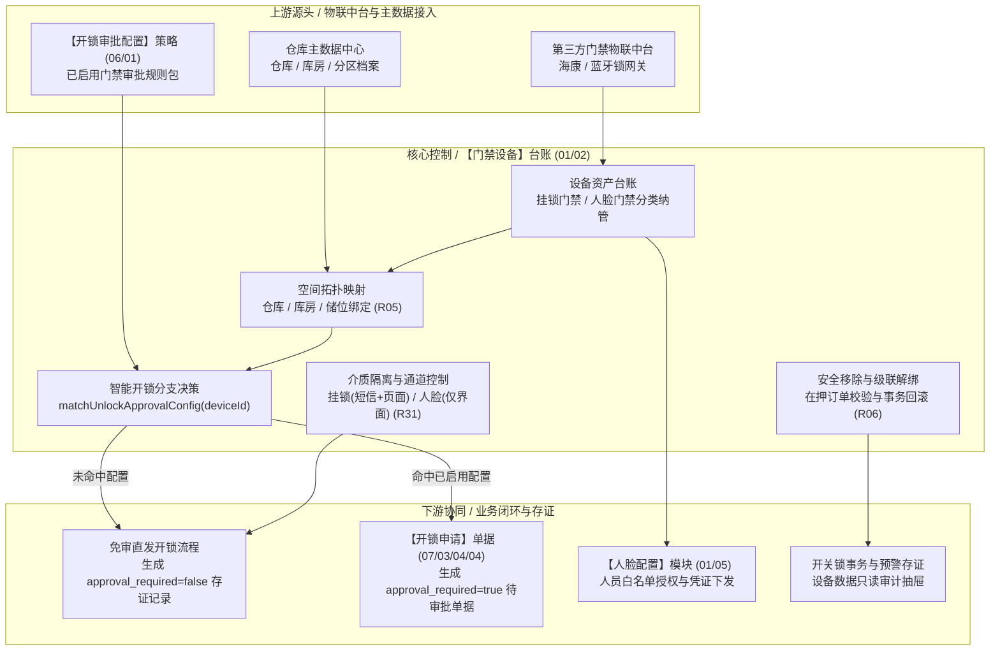

# 门禁设备 主PRD

> **文档体系（三件套为核心）**：
>
> | 层级 | 文档 | 职责 | 真源 |
> | :--- | :--- | :--- | :---: |
> | **核心** | 本文（主 PRD） | 业务背景、痛点、功能范围、模块架构、**页面功能说明**、业务场景、状态机摘要、规则摘要、验收 | ✅ |
> | **核心** | [门禁设备字段清单](./门禁设备字段清单.md) | 字段定义、筛选/列表/行操作弹窗、展示顺序、必填性与控件规格 | ✅ |
> | **核心** | [门禁设备业务规则规格](./门禁设备业务规则规格.md) | 状态机本体、R/C/P 规则、计算口径、动作矩阵、异常矩阵、时序图 | ✅ |
> | *衍生* | ASCII 线框 / Demo 文档 | 由三件套派生的可视化与原型输入，**非独立真源** | ❌ |
>
> **版本**：V4.0 基准版 | **更新时间**：2026-09-18 | **责任人**：产品架构组
>
> **统一引用规范**：
> - 本台账：【门禁设备】台账（菜单：物联网IOT管理 → 门禁设备，代号 01/02）
> - 上游策略：【开锁审批配置】策略（菜单：配置管理 → 业务流程管理 → 开锁审批，代号 06/01）
> - 协同审核：【开锁审核】台账（菜单：工作中心 → 审批中心 → 其他审批 → 开锁审核，代号 07/05/03）
> - 协同申请：【开锁申请】单据（菜单：工作中心 → 审批中心 → 业务审批 → 我的申请管理 → 开锁申请，代号 07/03/04/04）
> - 协同监控：【监控设备】台账（菜单：物联网IOT管理 → 监控设备，代号 01/01）
> - 状态机与业务规则本体 → [《门禁设备业务规则规格》](./门禁设备业务规则规格.md)
> - 字段层级与属性 → [《门禁设备字段清单》](./门禁设备字段清单.md)

---

## 一、业务背景与业务痛点

### 1.1 业务背景
在 SYZC 供应链金融仓储监管场景中，仓库门禁系统是控制抵质押品物理货权接触与流转的“第一实体道闸”。门禁设备主要涵盖两类形态：① **挂锁门禁**（智能蓝牙/无线电子挂锁，安装于监管仓大门、库房栅栏门或重点垛位）；② **人脸门禁**（安装于库区主通道、人员进出口的人脸识别闸机或门禁一体机，同时兼备安防摄像头视觉能力）。

【门禁设备】台账（菜单：物联网IOT管理 → 门禁设备，代号 01/02）是全网门禁物理资产的管理中枢。系统负责纳管设备基础档案、维护仓库储位空间映射，并作为行操作“获取门锁密码”（挂锁）、“获取门禁密码”（人脸）、“人脸配置”及“设备数据（开关锁事务与预警）”的统一业务发起阵地。通过与【开锁审批配置】策略(06/01)深度联动，系统实现免审与需审的智能分支决策。

### 1.2 核心业务痛点
* **【物理门禁准入无序与凭证漫游】**：传统仓库挂锁密码长期固定或靠微信口头传达，开锁责任难以追溯到具体人，在质押品丢失纠纷时缺乏司法鉴定的开锁排他证据。
* **【介质混淆引发合规与成本风险】**：挂锁与人脸门禁安防机理截然不同，若对人脸通行滥发短信通知不仅增加短信资费，且违背人脸权限以设备端特征库授权为主的安防逻辑。
* **【现场紧急作业与前置审批脱节】**：一线作业人员在门禁现场缺乏统一交互入口，需在多个菜单中来回切换判断是否需要审批，严重影响出入库周转时效。
* **【设备变更脱节导致安防与规则架空】**：门禁拆卸或移机若未联动解绑对应库位质押订单与预警规则，极易形成“库房已空但系统预警仍虚假在线”或“质押品无门禁守护”的风控真空。

---

## 二、功能范围

| 包含功能范围 (In Scope) | 不包含功能范围 (Out of Scope) |
| :--- | :--- |
| **【门禁台账与分类管理】**：集中展示挂锁门禁与人脸门禁设备列表，支持设备名称、编码、类型、状态、仓库与更新时间组合筛选。 | **【硬件底层驱动协议开发】**：设备私有协议对接与固件升级由底层物联中间件承接。 |
| **【双路径智能获取密码】**：点击行操作后调用 `matchUnlockApprovalConfig(deviceId)`，命中策略跳转审批申请，未命中调起免审直发。 | **【开锁审批流程编排】**：配置哪些设备需审批及审批链，属于【开锁审批配置】策略（代号 06/01）。 |
| **【挂锁与人脸通道差异化交付】**：挂锁门禁支持短信发送+页面展示；人脸门禁严格限定前端展示，绝对不调用短信网关 (R31)。 | **【审批人审批流转】**：审批人在工作中心执行通过/驳回，属于【开锁审核】台账（代号 07/05/03）。 |
| **【人脸配置平铺与穿透授权】**：人脸门禁支持行操作【人脸配置】，当前页平铺展示授权人员并支持快捷跳转至人脸管理模块。 | **【人脸生物特征底库建模】**：人脸特征提取、比对算法及照片建模由人脸算法引擎承接。 |
| **【设备数据穿透审验】**：支持行操作【设备数据】，以抽屉形式只读调阅该设备的“开关锁事务记录”与“设备预警记录”。 | **【监控摄像头视觉分析】**：人脸门禁的直播、回放与图像锚点能力，在【监控设备】(01/01) 台账统一承载。 |
| **【设备级联解绑与安全移除】**：支持行操作【移除设备】，校验在押订单关联，安全联动解绑人脸授权、预警规则与仓位。 | **【质押订单业务审批】**：订单抵质押合同与额度审批属于信贷风控模块。 |

---

## 三、模块定位与系统链路

### 3.1 模块定位
【门禁设备】台账（菜单：物联网IOT管理 → 门禁设备，代号 01/02）属于系统**物理安全执行与门禁准入中枢（Physical Security & Access Control Layer）**。它向上衔接第三方门禁物联平台与仓库拓扑主数据，向内执行智能策略分支匹配与通道能力隔离，向下驱动开锁申请生成与现场通行凭证的安全交付。

### 3.2 系统链路图

---

## 四、业务场景与用户故事

| 场景编号与名称 | 触发角色 | 核心交互与风控约束 | 业务价值 |
| :--- | :--- | :--- | :--- |
| **【SC-01 挂锁门禁免审直发通行】** | 现场普通库管 (`R-WH-USER`) | 在普通大宗商品原料库大门前，库管员在移动端打开门禁列表，点击某电子挂锁的【获取门锁密码】。系统匹配该设备未配置审批策略，弹出免审直发窗口。库管员选择事由「出入库理货」，点击确认。系统向其绑定手机号发送短信密码，同时在界面展示密码，后台沉淀免审开锁流水。 | 兼顾一线操作高周转率与后台审计完备性。 |
| **【SC-02 人脸门禁审批流转授权】** | 外来查验人员 (`R-GUEST-USER`) | 查验员到达保税高危库房，点击人脸门禁的【获取门禁密码】。系统判定命中已启用审批配置，自动切入【开锁申请】(07/03/04/04)弹窗。查验员选择通行有效起止时间（8小时）并拍照提交，进入专道待审批池。通过后凭证仅在页面展示，严禁发短信。 | 杜绝短信通道越权滥用，实现时效性闭环。 |
| **【SC-03 人脸白名单平铺配置】** | 仓储安全管理员 (`R-WH-SEC`) | 针对库房新换防的人脸门禁机，管理员在列表点击行操作【人脸配置】。弹窗内平铺展示已授权人员名单与下发进度；点击【+ 添加授权人员】直接调起人脸授权分配抽屉，勾选新到岗仓管员并提交下发。 | 权限分配直观可视，极大降低配置门槛。 |
| **【SC-04 开锁异常事件设备回溯】** | 质押风控专员 (`R-RISK-AUDIT`) | 收到某库房门锁未及时闭合预警，风控人员在门禁设备列表点击【设备数据】。抽屉中即时展示该锁近 7 天的所有开锁记录（开锁人、时间、方式）及关联的预警事件快照，迅速锁定现场开锁责任人。 | 打造设备全生命周期证据链，排查无死角。 |

---

## 五、状态机与动作能力矩阵

### 5.1 状态定义
* 门禁设备本身属于物联基础设施，不设审批状态机，通过**物理在线状态**与**空间绑定状态**双重定义：
  - **物理在线状态**：在线 (`ONLINE`)、离线 (`OFFLINE`)；由物联心跳实时推送；
  - **空间绑定状态**：已绑定 (`BOUND`)、未绑定 (`UNBOUND`)；
  - **生命周期状态**：正常纳管、已移除软删除 (`REMOVED`)。

### 5.2 动作能力矩阵

| 动作名称 | 挂锁门禁 (在线/离线) | 人脸门禁 (在线/离线) | 未绑定仓位设备 | 已移除软删除设备 |
| :--- | :---: | :---: | :---: | :---: |
| **重命名系统名称** | ✅ | ✅ | ✅ | ❌ |
| **绑定 / 换绑仓库** | ✅ | ✅ | ✅ | ❌ |
| **设备数据调阅** | ✅ | ✅ | ✅ | ❌ |
| **获取门锁密码** | ✅ (短信+页面) | ❌ (不具备该操作) | ✅ (若已联网) | ❌ |
| **获取门禁密码** | ❌ (不具备该操作) | ✅ (仅页面展示) | ✅ (若已联网) | ❌ |
| **人脸配置入口** | ❌ (不具备该操作) | ✅ | ✅ | ❌ |
| **移除设备** | ✅ (校验在押订单) | ✅ (校验在押与人脸) | ✅ (直接移除) | ❌ |

---

## 六、页面交互规格索引

### 6.1 PC 端列表页交互规格
* **菜单路径**：`物联网IOT管理 → 门禁设备`（`/iot/access-devices`）
* **指标卡区**：顶部展示「门禁设备总数」、「挂锁门禁数」、「人脸门禁数」、「在线率」指标统计；
* **组合筛选区**：
  - 设备名称（模糊搜索系统内名称）；
  - 设备类型（下拉单选：全部、挂锁门禁、人脸门禁）；
  - 设备状态（下拉单选：全部、在线、离线）；
  - 绑定仓库（当前管辖仓库下拉单选）；
  - 绑定状态（下拉单选：全部、已绑定、未绑定）；
  - 更新时间（日期时间范围选择器）。
* **数据表格区**：
  - 列定义：序号、设备原名称、系统内名称、设备编码、设备类型、状态、绑定仓库、具体位置、更新人/时间、操作列；
  - **行操作区分化控制**：
    - 挂锁门禁行展示：【获取门锁密码】、【设备数据】、【重命名】、【绑定仓库】、【移除设备】；
    - 人脸门禁行展示：【获取门禁密码】、【人脸配置】、【设备数据】、【重命名】、【绑定仓库】、【移除设备】。

### 6.2 密码获取与分支交互规格
* **【获取门锁密码】(挂锁专属)**：
  - 点击后系统前置执行 `matchUnlockApprovalConfig(deviceId)`：
    - **命中需审批**：系统平滑切入【开锁申请】(07/03/04/04)弹窗，录入事由与现场抓拍照片后提交审批；
    - **未命中/免审**：弹出免审直发弹窗，校验当前账号绑定手机号，录入事由（必填）与备注后确认，系统下发短信并在界面同步展示 6 位临时密码；
* **【获取门禁密码】(人脸专属)**：
  - 点击后同样执行分支匹配：
    - **命中需审批**：调起开锁申请弹窗，必填事由、现场照片及通行有效时间区间（最长24h）；
    - **未命中/免审**：调起免审直发弹窗，录入事由、通行次数与有效期（最长24h），确认后系统**仅在页面展示临时密码卡片并提供一键复制，绝对不调用短信发送**。

### 6.3 设备数据只读抽屉规格
* **抽屉架构**：右侧滑出抽屉，顶部展示设备基本信息卡片；
* **双标签页切换**：
  - **事务记录**：展示开关锁事件流水（事件时间、事件类型、操作人员、开锁方式、鉴权结论）；
  - **预警记录**：展示门锁未闭合、防拆报警、强行开门等告警事件快照及关联的处置状态。

---

## 七、核心业务规则索引与非功能需求

### 7.1 核心规则映射索引
| 规则类别 | 规则编号 | 规则名称 | 核心控制摘要 |
| :--- | :--- | :--- | :--- |
| **设备分类** | R01 | 设备类型与操作能力矩阵 | 挂锁仅支持获取门锁密码；人脸支持获取门禁密码与人脸配置。 |
| **双轨分支** | R02 | 开锁审批前置决策路由规则 | 统一入口匹配规则，命中走申请，未命中走免审，双轨全量落账。 |
| **短信边界** | R03 | R31 短信下发能力边界规则 | 挂锁支持短信与页面；人脸门禁严格仅页面展示，绝不调用短信 API。 |
| **数据权限** | R04 | 仓库数据权限双重过滤规则 | 已绑设备受仓库管辖权限过滤；未绑设备仅租户机构总部可见。 |
| **空间绑定** | R05 | 仓库储位空间拓扑绑定规则 | 强制校验仓库-库房-分区层级合法性，绑定任一层即为已绑定。 |
| **级联解绑** | R06 | 移除设备级联解绑与安全阻断 | 存在在押订单时强阻断移除；其余关联人脸授权与规则原子解绑。 |
| **并发防护** | R07 | 乐观锁版本并发控制规则 | 携带版本戳提交，并发冲突强阻断并提示刷新重试。 |

### 7.2 非功能性需求
* **接口性能**：开锁密码生成端到端耗时 $\le 1.2\text{s}$，设备数据抽屉列表加载 $\le 800\text{ms}$；
* **数据安全**：开锁密码在日志中脱敏，严禁明文打印；短信网关调用带防刷频次限流保护；
* **审计完备**：密码获取（含需审与免审）、人脸配置变更、设备移除操作 100% 写入不可变操作审计日志。

---
*版本说明：V4.0 基准版 | 责任人：产品架构组 | 2026年09月*
