# 物联设备业务规则规格

> **文档定位**：物联设备状态机、动作约束、校验规则、权限与计算规则的唯一定义来源。主 PRD、字段清单只引用本文件规则 ID，不重复定义规则本体。

> **文档定位**：物联设备分类、实时数据、预警展示、权限、操作和第三方接口规则唯一来源。
> **参考文档**：[物联设备主PRD](./物联设备主PRD.md)、[物联设备字段清单](./物联设备字段清单.md)、[物联设备业务规则规格](物联设备业务规则规格.md)
> **版本**：V1.1 | **更新时间**：2026-08-14

## 一、数据与设备类型规则

| 规则编号 | 规则 |
| :--- | :--- |
| R01 | 设备类型决定实时指标展示范围：温度、湿度、二氧化碳、氧气、烟感；多功能设备可返回其中两种及以上指标，最终以本次第三方返回结果为准。 |
| R02 | 多功能设备只展示第三方本次实际返回的指标，未返回指标不得使用历史值冒充。 |
| R03 | 设备数据进入页面时请求一次；本期不持续轮询、不自动刷新，手动刷新能力另行定义。 |
| R04 | 当前数据和订单温湿度预警分区加载、分区报错，任一区域失败不影响另一区域；当前数据支持温度、湿度、二氧化碳、氧气、烟感，预警当前已确认覆盖温度和湿度。 |
| R05 | 预警处理由风险模块负责，物联设备只读展示预警类型、监测值、阈值、状态和处理信息。 |

## 二、指标口径、异常值与预警边界

| 指标范围 | 单位与精度 | 更新时间 | 异常值处理 | 风险预警规则 | 责任人/确认时点 |
| :--- | :--- | :--- | :--- | :--- | :--- |
| 温度、湿度、二氧化碳、氧气 | 由第三方返回；单位、精度和字段格式待接口确认 | 优先使用第三方采集时间；时间字段待接口确认 | 空值、NaN、格式非法、越界值或时间无效时标记数据异常，不使用历史值，不参与风险计算 | 温度、湿度继承风险模块已确认规则；二氧化碳、氧气当前只展示，不生成预警 | 物联设备对接研发、风险规则负责人；接口联调/风险规则评审前 |
| 烟感 | 由第三方返回；单位、精度或枚举格式待接口确认 | 优先使用第三方采集时间；时间字段待接口确认 | 空值、非法枚举、异常码或时间无效时标记数据异常 | 当前只展示，不生成预警；正常值、异常值、阈值和处置动作待确认 | 物联设备对接研发、风险规则负责人；接口联调/风险规则评审前 |

## 二、操作规则

| 操作 | 前置条件 | 后置影响 | 失败处理 |
| :--- | :--- | :--- | :--- |
| 重命名 | 名称非空且有设备权限 | 更新系统内名称 | 保留原名称 |
| 仓库绑定 | 位置层级正确、权限和版本有效 | 更新设备位置关系 | 不产生部分更新 |
| 设备数据 | 有设备数据查看权限、设备有效 | 只读请求第三方数据和预警 | 展示当前分区错误，不修改业务数据 |
| 移除设备 | 有移除权限、说明必填 | 解绑订单、风险规则、通知和位置 | 保留原关联并记录失败 |

## 三、安全与审计

1. 设备编码是请求、关联和幂等键；列表序号和设备名称不能作为唯一关联条件。
2. 第三方返回设备编码与请求设备编码不一致时，丢弃结果并记录接口异常。
3. 所有查询、第三方调用、维护操作和失败请求均记录操作审计；敏感数据按角色脱敏。

---

## 业务流程与联动

> 以下内容由原《物联设备业务流程》合并，与上文规则 ID 配合阅读；重复的状态机定义以上文为准。

> **版本**：V1.0 | **更新时间**：2026-08-14
> **适用模块**：物联设备列表、设备维护、实时数据和温湿度预警查看

## 一、流程说明

1. 用户进入物联设备列表，系统按租户、机构、菜单和仓库数据权限加载设备。
2. 用户点击“设备数据”后，系统根据设备类型请求对应实时指标，同时查询关联订单温湿度预警。
3. 当前数据和预警记录分别展示加载、空数据和错误状态，任何接口失败不得修改设备主数据。
4. 用户执行重命名、仓库绑定或移除设备时，系统重新校验权限、设备版本和关联业务后执行。

## 二、业务流程图

```mermaid
flowchart TD
    A[进入物联设备列表] --> B[权限过滤并查询设备]
    B --> C{选择操作}
    C -->|设备数据| D[识别设备类型]
    D --> E[请求当前实时采集指标]
    D --> F[查询关联温湿度预警]
    E --> G[展示实时数据或数据异常]
    F --> H[展示预警列表或预警异常]
    C -->|重命名/仓库绑定| I[填写操作字段]
    I --> J[权限、版本和关联校验]
    J -->|通过| K[更新设备主数据并审计]
    J -->|失败| L[保留原值并提示]
    C -->|移除设备| M[填写移除说明并确认]
    M --> N[执行订单、风险、规则和位置解绑]
    N --> O{联动成功}
    O -->|是| P[移除有效设备并保留快照]
    O -->|否| Q[全量回滚本次已完成的全部联动并保留原关联]
    Q --> R{技术回滚是否成功}
    R -->|是| S[记录失败并返回失败]
    R -->|否| T[记录全量回滚补偿任务并告警，仍返回失败]
```

## 三、异常处理

| 异常场景 | 处理规则 |
| :--- | :--- |
| 当前数据为空 | 对应指标显示“暂无数据”，不得显示其他设备数据 |
| 第三方接口超时 | 当前数据区显示获取失败，预警区独立处理 |
| 返回设备编码不一致 | 丢弃返回结果，记录接口异常 |
| 设备已被移除 | 禁止继续查询，提示设备不可用 |
| 并发修改 | 返回版本冲突，要求刷新后重试 |

## 修订记录

| 日期 | 版本 | 变更 |
| :--- | :---: | :--- |
| 2026-08-20 | — | 合并原《物联设备业务流程》至本文件「业务流程与联动」章节 |
