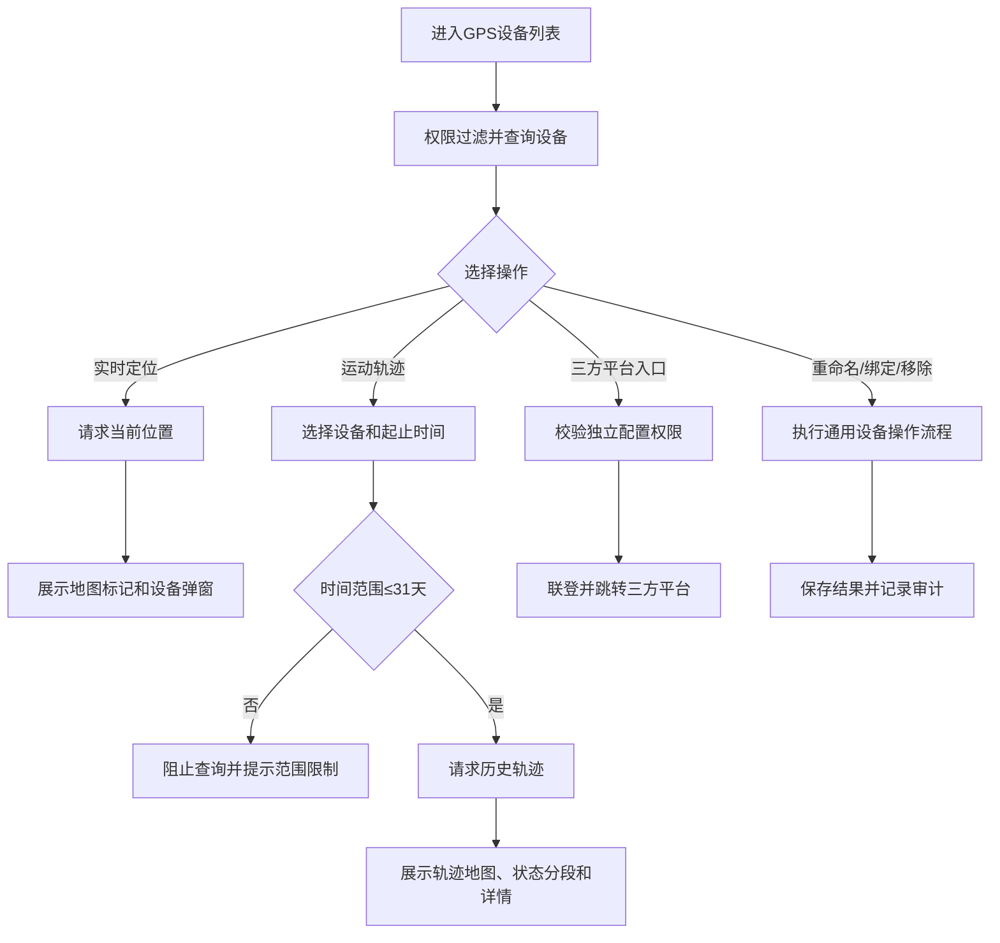

# GPS设备业务规则规格

> **文档定位**：GPS设备状态机、动作约束、校验规则、权限与计算规则的唯一定义来源。主 PRD、字段清单只引用本文件规则 ID，不重复定义规则本体。

> **文档定位**：GPS设备定位、轨迹、权限、第三方联登和设备维护规则唯一来源。
> **参考文档**：[GPS设备主PRD](./GPS设备主PRD.md)、[GPS设备字段清单](./GPS设备字段清单.md)、[GPS设备业务规则规格](GPS设备业务规则规格.md)
> **版本**：V1.0 | **更新时间**：2026-08-14

## 一、查询规则

| 规则编号 | 规则 |
| :--- | :--- |
| R01 | 实时定位和运动轨迹按当前用户、租户、机构和仓库数据权限查询，服务端不得只依赖前端筛选。 |
| R02 | 运动轨迹查询开始时间至结束时间不得超过31天；超出范围阻止请求。 |
| R03 | 实时定位展示当前车辆、司机、位置、状态和更新时间；司机手机号按角色脱敏。 |
| R04 | 轨迹详情展示起止地址、总里程、状态持续时长和定位设备信息；未确认接口字段不得固化为数据库字段。 |

## 二、入口与维护规则

| 操作 | 规则 |
| :--- | :--- |
| 实时定位 | 只读查询，不修改GPS设备主数据 |
| 运动轨迹 | 只读历史查询，查询失败不得修改轨迹或设备状态 |
| GPS平台规则配置 | 通过独立权限联登三方平台，平台内部规则不在本系统定义 |
| GPS平台基础数据 | 通过独立权限联登三方平台，平台内部字段不在本系统定义 |
| 移除设备 | 解绑设备业务关系，历史定位和业务详情保留设备快照 |

## 三、并发、幂等与审计

1. 设备维护使用设备编码作为幂等键，重命名、绑定和移除进行版本校验。
2. 定位和轨迹查询需校验设备有效性，设备编码不一致的第三方返回结果不得展示。
3. 审计记录查询人、查询时间、设备编码、时间范围、第三方调用结果、跳转结果和维护前后值。

## 四、三方接口待确认事项与责任边界

| 待确认事项 | 当前判断 | 责任人/角色 | 确认时点 | 验收依据 |
| :--- | :--- | :--- | :--- | :--- |
| 自动刷新频率、手动刷新入口和定位数据轮询机制 | 由三方定位接口能力和移动/PC交互共同决定，当前不固化 | GPS平台对接研发、前端负责人 | 原型评审和接口联调前 | 明确请求触发时机、频率、重复请求防护和弱网处理测试用例 |
| 定位状态枚举、编码、判定来源和优先级 | 以三方回传状态为准，当前原型值不视为最终口径 | GPS平台对接研发 | 三方接口联调前 | 实时定位、历史轨迹和列表筛选使用同一状态字典及优先级 |
| 司机来源、车辆与司机关联及手机号字段 | 由三方车辆/司机接口确认，当前不在 SYZC 侧补造数据 | GPS平台对接研发、车辆数据负责人、安全负责人 | 接口评审前 | 有司机、无司机、司机变更和不同角色脱敏场景均有接口样例和验收用例 |
| 地图底图、坐标系、地址解析服务和失败降级 | 由三方定位/地图服务确认，当前仅定义异常不阻断主流程 | GPS平台对接研发、地图服务负责人 | 技术方案评审前 | 坐标系、地址精度、解析失败、地图不可用和大数据量加载有明确方案 |
| 历史轨迹接口、轨迹点结构和状态分段算法 | 由三方历史轨迹接口确认，当前不固化接口字段 | GPS平台对接研发 | 历史轨迹接口联调前 | 设备编码、时间范围、轨迹点、状态分段和空数据返回结构一致 |
| 里程单位、精度、计算责任方和异常值处理 | 优先确认三方是否直接返回总里程；未确认前不自行计算并对外承诺 | GPS平台对接研发、车辆数据负责人 | 历史轨迹接口联调前 | 同一时间范围的里程样例、单位精度、缺失和异常值处理有验收结果 |
| GPS平台联登协议、回调方式、平台地址、会话有效期和异常提示 | 由三方平台和安全方案确认，SYZC 只维护入口权限和跳转结果 | GPS平台对接研发、安全负责人 | 联登联调前 | 成功跳转、权限不足、会话过期、回调失败和平台不可用均有测试用例 |

---

## 业务流程与联动

> 以下内容由原《GPS设备业务流程》合并，与上文规则 ID 配合阅读；重复的状态机定义以上文为准。

> **版本**：V1.0 | **更新时间**：2026-08-14
> **适用模块**：GPS设备列表、实时定位、运动轨迹和第三方平台入口

## 一、流程说明

1. 用户进入GPS设备列表，系统按权限加载有效设备和车辆信息。
2. 用户从行操作进入实时定位，系统请求当前位置并在地图及信息弹窗展示。
3. 用户进入运动轨迹，选择设备和时间范围；系统校验查询范围不超过31天后请求历史轨迹。
4. 用户进入GPS平台规则配置或基础数据时，系统校验独立权限并执行联登跳转。
5. 用户维护或移除设备时，执行通用设备权限、版本、幂等和审计规则。

## 二、业务流程图

## 三、异常处理

| 异常场景 | 处理规则 |
| :--- | :--- |
| 无定位数据 | 地图保留空状态，展示暂无定位，不使用旧设备数据 |
| 轨迹无数据 | 展示空轨迹状态，不生成虚假路径 |
| 定位服务超时 | 保留当前页面并提示获取失败，可按规则重试 |
| 联登失败 | 不离开当前页面，提示跳转失败并记录结果 |
| 设备已移除 | 禁止新的定位和轨迹查询，历史详情按快照展示 |

## 修订记录

| 日期 | 版本 | 变更 |
| :--- | :---: | :--- |
| 2026-08-20 | — | 合并原《GPS设备业务流程》至本文件「业务流程与联动」章节 |
