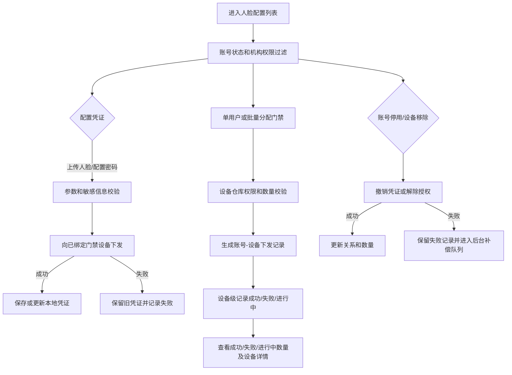

# 人脸配置业务规则规格

> **文档定位**：人脸配置状态机、动作约束、校验规则、权限与计算规则的唯一定义来源。主 PRD、字段清单只引用本文件规则 ID，不重复定义规则本体。

> **文档定位**：人脸凭证、开锁密码、门禁授权、异步下发、账号状态联动和敏感数据安全规则唯一来源。
> **参考文档**：[人脸配置主PRD](./人脸配置主PRD.md)、[人脸配置字段清单](./人脸配置字段清单.md)、[人脸配置业务规则规格](人脸配置业务规则规格.md)
> **版本**：V1.0 | **更新时间**：2026-08-14

## 一、准入与凭证规则

| 规则编号 | 规则 |
| :--- | :--- |
| R01 | 列表只展示账号状态为启用且当前用户有机构数据权限的账号。 |
| R02 | 人脸照片和开锁密码均可单独配置，但提交时至少完成一项；照片和密码均不可在前端或日志中明文泄露。 |
| R03 | 人脸图片仅支持JPG、JPEG、PNG，大小不超过200KB；密码按租户规则校验唯一性和格式。 |
| R04 | 只有人脸已录入或开锁密码已录入的账号，才允许进入门禁分配。 |

## 二、授权与下发规则

1. 单用户分配最多选择10台设备；批量分配最多选择10个账号，设备范围按设备绑定仓库权限过滤。
2. 授权或凭证更新采用“先向设备下发，成功后保存关系/凭证”的顺序；下发失败不得新增或替换本地关系。
3. 普通分配失败即最终失败，不持续等待设备上线；用户通过重新发起分配执行重试。
4. 账号停用或删除触发凭证撤销和授权解绑；撤销失败进入后台失败重试队列并保留失败状态。
5. 设备移除时，同步删除该设备与账号的授权映射，刷新账号门禁数量。

## 三、权限、并发与审计

- 人员账号按机构权限过滤，设备按绑定仓库权限过滤，两类权限必须同时满足。
- 服务端使用账号、设备编码、凭证版本和请求标识控制并发和幂等；失败时保留旧凭证和旧授权。
- 审计记录照片操作、密码配置、授权变更、异步下发、移除门禁、账号状态联动及失败请求；严禁记录照片内容和密码原文。

---

## 业务流程与联动

> 以下内容由原《人脸配置业务流程》合并，与上文规则 ID 配合阅读；重复的状态机定义以上文为准。

> **版本**：V1.0 | **更新时间**：2026-08-14
> **适用模块**：人脸/密码配置、门禁授权、批量下发和进度追踪

## 一、流程说明

1. 系统按账号状态和机构权限加载人脸配置列表。
2. 管理员上传人脸或配置开锁密码；至少完成一种凭证配置，提交后先向已绑定门禁设备下发。
3. 凭证下发成功后保存本地凭证关系；失败则保留旧凭证，不新增或替换本地关系。
4. 管理员进入单用户或批量分配门禁流程，系统按账号机构权限和设备仓库权限生成可选范围。
5. 一次提交按账号、设备拆分记录设备级下发结果；进度记录通过成功数量、失败数量和进行中数量展示整体处理情况，不单独维护任务编号或整体状态字段。
6. 账号停用、删除或设备移除时，系统触发凭证撤销或授权解绑；普通分配失败不自动重试，账号生命周期触发的撤销失败进入后台补偿队列并按重试上限转人工处置。

## 二、业务流程图

## 三、异常处理

| 异常场景 | 处理规则 |
| :--- | :--- |
| 图片格式或大小不合规 | 前后端均阻止提交，不改变原凭证 |
| 密码重复或格式错误 | 阻止提交，不向设备下发 |
| 设备离线或下发超时 | 普通下发标记失败，保留原关系，用户重新发起 |
| 批量部分失败 | 按账号和设备分别记录结果；成功数量、失败数量和进行中数量分别展示，成功项不回滚失败项 |
| 普通分配下发失败 | 直接标记设备级下发记录“失败”，不进入自动重试队列；用户重新发起分配 |
| 账号停用/删除撤销失败 | 进入后台补偿队列，记录重试次数、下次重试时间和最终失败原因；超过上限转人工处置并告警 |
| 设备移除 | 同步解除该设备与所有账号的授权映射 |

## 修订记录

| 日期 | 版本 | 变更 |
| :--- | :---: | :--- |
| 2026-08-20 | — | 合并原《人脸配置业务流程》至本文件「业务流程与联动」章节 |
