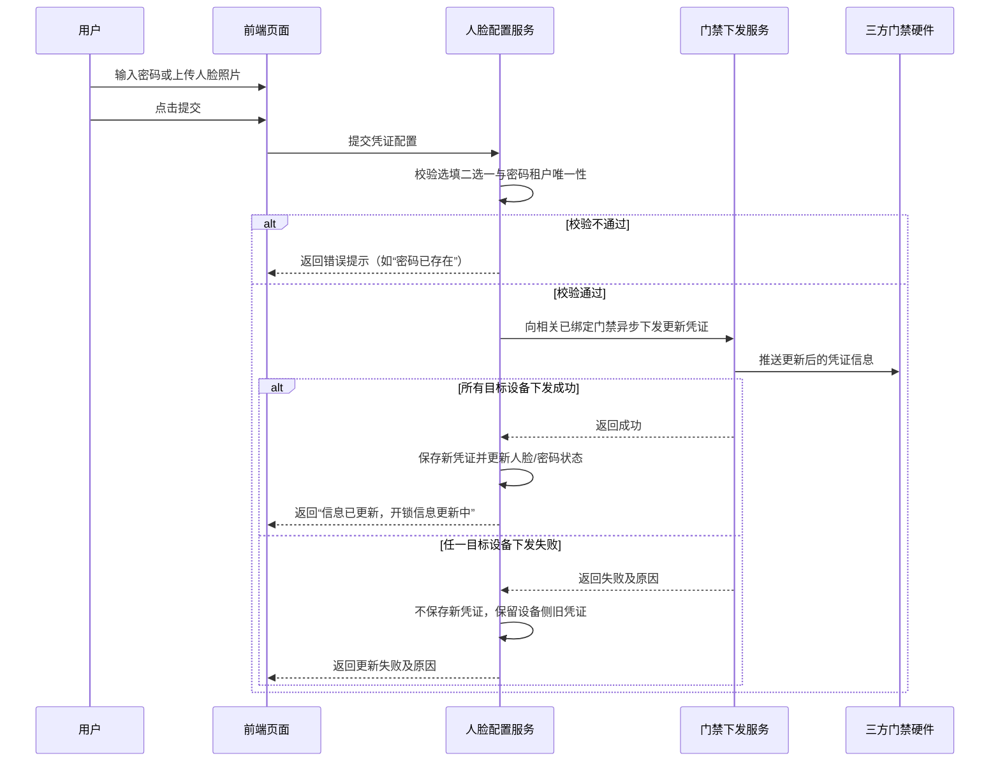
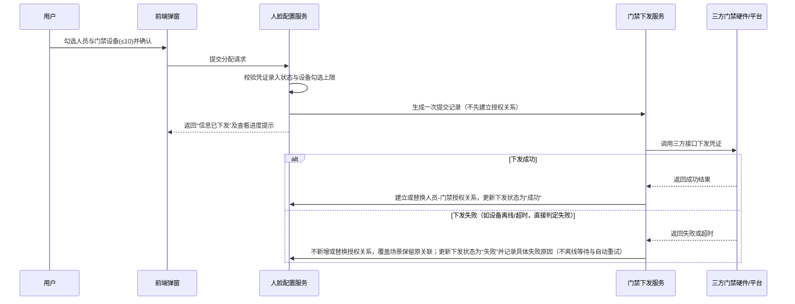
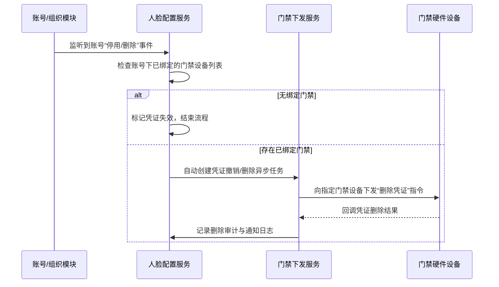

# 人脸配置主需求文档

> **版本**：V1.5 | 2026-08-14
> **读者**：研发工程师、测试工程师、产品复核
> **编写依据**：人脸配置字段清单
> **字段职责**：人脸照片、开锁密码、账号授权、进度记录和门禁数据详情字段以[`人脸配置字段清单.md`](./人脸配置字段清单.md)为准；门禁设备主数据字段引用[门禁设备字段清单](../02门禁设备/门禁设备字段清单.md)。本主 PRD 只维护流程、规则、权限、审计和异常处理。

## 1. 业务背景

在供应链金融仓储监管场景中，仓库门禁防线是防止押品被非法移库、替换或盗取的物理核心防护锁。人脸配置模块作为人员身份凭证与硬件门禁鉴权绑定的统一管理入口，负责维护仓储监管人员（如监管员、巡检员、仓管员）的人脸生物特征图像与开锁数字密码，并将凭证异步下发授权至指定的门禁硬件设备。

系统通过打通“人员账号 - 人脸/密码凭证 - 门禁设备 - 操作审计”数据链，确保进出监管仓库的物理动作可精准穿溯至具体责任人，为供应链金融风控提供强一致性、防篡改的存货安全保障。

## 2. 功能范围

**本期范围**：
- 人脸配置列表展示、条件筛选（账号名称、人脸状态、开锁密码）及数据展示；
- 单个人员人脸照片采集（支持 JPG/JPEG/PNG，≤200KB）及 4~8 位数字开锁密码维护；
- 同一租户范围内开锁密码唯一性校验（确保开锁日志精准识别具体开锁人员）；
- 单用户门禁分配（单次提交最多勾选10个门禁设备）与设备状态筛选；
- 全局“批量分配门禁”流程（最多选择10个账号，支持跨页勾选；勾选前置为人脸或密码任一已录入）；
- 门禁下发异步处理、全局“查看进度”列表（进度记录）及下发详情弹窗（设备级状态与失败说明）；
- 凭证下发失败即最终失败处理（设备离线或下发异常直接记为失败，系统不持续离线等待与上线自动重试）；
- 账号“门禁数据”列表查看及逐条“移除门禁”确认交互（仅解除关联，不影响设备主数据）；
- 账号状态变更及门禁设备移除联动后置影响闭环（账号停用/删除自动下发撤销凭证指令；门禁设备被移除时同步解绑授权关系）；
- 权限校验（租户、机构、菜单、数据权限）、并发锁与幂等控制、全路径操作审计日志留痕。

**不在本期范围**：
- 账号/组织/角色主数据的增删改查（引用账号与组织模块）；
- 门禁设备主数据接入、重命名、仓库绑定与设备删除（引用门禁设备模块）；
- 门禁开关锁实时事务日志与物理预警记录展示（引用门禁事务记录模块）；
- 门禁凭证授权时间段/有效期控制（三方接口支持，记录为后期 PRD 优化项）；
- 人脸特征向量本地离线提取算法库开发（依赖三方门禁平台或硬件 SDK 解析）。

## 3. 模块定位

### 3.1 系统位置

| 项目 | 内容 |
| :--- | :--- |
| 模块层级 | 物联网IOT管理 / 人脸配置（凭证与授权管理层） |
| 核心职责 | 维护人员人脸与密码凭证，管理人员与门禁设备的授权分配，处理凭证异步下发与撤销联动 |
| 数据来源 | 账号/组织主数据、用户上传图片与密码输入、门禁设备主数据、三方门禁下发回调 |
| 上游依赖 | **账号与组织模块**提供人员账号 ID、姓名、所属机构和启停状态；**权限模块**提供角色、菜单权限和数据权限；**门禁设备模块**提供设备 ID、设备类型、绑定位置、在线状态和授权下发入口。停用账号不可进入选人或授权列表，设备移除需同步解除授权。来源：[人脸配置字段清单](./人脸配置字段清单.md)、REF-ACCOUNT、REF-RBAC、[门禁设备字段清单](../02门禁设备/门禁设备字段清单.md)。 |
| 下游引用 | 门禁事务记录（开锁日志识别身份）、门禁设备下发队列、操作审计日志、设备风控预警 |
| 业务单据 | 不生成独立审批单据；保存提交记录、设备级下发结果及全路径审计镜像 |

### 3.2 凭证与配置逻辑关系

| 配置项 | 必填性 | 校验与限制 | 交互与展示 |
| :--- | :--- | :--- | :--- |
| 人脸照片 | 选填（组合二选一） | JPG/JPEG/PNG，≤200KB；仅用于门禁识别 | 上传/替换；支持查看大图（需权限校验） |
| 开锁密码 | 选填（组合二选一） | 4~8 位纯数字；同一租户内唯一 | 默认掩码显示，点击眼睛图标查看明文；不可清空；停用需在【账号管理】中停用账号 |
| 组合校验 | 必填（二选一） | 必须至少完成人脸照片或开锁密码其中一项 | 两项均为空时阻止提交并提示补充 |

### 3.3 账号与设备状态变更联动（后置影响规则）

当系统发生人员账号状态变化或门禁设备移除时，系统后端自动触发联动闭环处理：
1. **账号停用/删除自动阻断与撤销**：人员账号在【账号/组织管理】被停用或删除时，立即从人脸配置列表与选人列表中排除，系统自动生成凭证撤销任务，向该账号此前所有已绑定设备下发“删除凭证”指令；
2. **门禁设备移除同步解绑**：当某台人脸门禁设备在【物联网IOT管理 - 门禁设备】中被“移除设备”时，系统自动同步移除【人脸配置】模块中该设备与所有人员账号的授权绑定关系（更新各人员“门禁数据”数量并清空关联）；若 5 分钟轮询重新拉回设备，重入设备不自动恢复原授权，保持未授权状态；
3. **闭环说明**：本规则确保线上账号生命周期、设备生命周期与线下物理门禁鉴权 100% 强一致闭环。

## 4. 页面与字段规则

### 4.1 列表字段与排序

列表字段、排序、账号脱敏和门禁数据展示字段统一以[人脸配置字段清单](./人脸配置字段清单.md)为准；本主 PRD 不重复列出字段属性，只保留账号状态过滤和点击门禁数据进入详情的业务规则。

### 4.2 筛选规则

筛选控件、匹配方式和枚举范围统一以[人脸配置字段清单](./人脸配置字段清单.md)为准；本主 PRD 只要求查询服务执行租户、机构、账号状态和人员数据权限校验。

### 4.3 数据可见范围

1. **租户与机构隔离**：用户仅可查看与操作所属租户及有数据权限的机构下的人员账号；
2. **账号状态过滤**：列表仅返回账号状态为“启用”的记录；已停用/注销账号不展示；
3. **照片与密码敏感保护**：人脸照片查看大图、开锁密码明文显示（点击眼睛图标）均需单独校验权限并记录操作审计日志。

## 5. 操作功能

### 5.1 操作总览

| 操作名称 | 触发入口 | 展示条件 | 校验与限制 | 结果与后置联动 |
| :--- | :--- | :--- | :--- | :--- |
| 上传人脸 | 列表“操作”列 | 账号状态为“启用” | 人脸与密码二选一；密码租户内唯一 | 先向已绑定设备下发更新；下发成功才保存新凭证并创建更新记录；下发失败不保存新凭证，设备侧继续保留旧凭证 |
| 分配门禁 | 列表“操作”列 | 人脸状态为“已录入”或密码为“已录入” | 单次提交最多选择10个设备 | 触发后台异步下发，可点击“查看进度”查看 |
| 批量分配门禁 | 菜单全局按钮 | 列表勾选启用且凭证已录入人员 | 最多勾选10个账号；单次提交最多10个设备 | 跨页勾选人员，批量创建异步下发处理记录 |
| 查看进度 | 菜单全局按钮 | 始终展示 | 无 | 打开“进度记录”列表及下发设备详情弹窗 |
| 移除门禁 | “门禁数据”弹窗操作列 | 门禁数据数量 > 0 | 二次弹窗确认 | 解除当前账号与设备关联，刷新门禁数量 |

### 5.2 上传人脸（图片上传与密码维护）

1. **页面布局**：包含“基础信息”、“人脸图片采集”和“开锁密码”三个区域；
2. **基础信息**：只读展示账号名称、脱敏账号、角色（支持多角色）和归属机构；
3. **人脸图片上传**：
   - 支持 `JPG`、`JPEG`、`PNG` 格式，文件大小 ≤ `200KB`；
   - 提供采集示例提示（正对屏幕、轮廓清晰、光线均匀）；
4. **开锁密码维护**：
   - 4~8 位数字；输入框默认掩码，点击眼睛图标切换明文；
   - 系统校验同一租户范围内密码唯一；若与其他用户密码重复阻止提交并提示：“密码已存在，请重新设置”；
   - 若人员需停用开锁权限，在系统【账号管理】中停用对应账号即可；
5. **提交校验与更新模式**：
   - 人脸图片和开锁密码均未填写时，阻止提交并提示：“请至少完成人脸照片或开锁密码其中一项配置”；
   - **增量更新模式**：编辑提交采用增量更新模式；对于未修改的凭证项（如已有人脸图片未作更换、开锁密码未作修改），服务端保存时必须继承原镜像，严禁被空值覆盖；
   - 提交成功后提示：“信息已更新，开锁信息更新中”，返回列表并刷新“人脸状态”和“开锁密码”状态。

### 5.3 分配门禁（单用户与批量分配）

#### 5.3.1 单用户分配门禁
- **前置条件**：人员人脸状态为“已录入”或开锁密码为“已录入”；
- **设备筛选**：支持按设备名称（模糊匹配系统内名称）和设备状态（在线/离线）筛选；
- **设备选择**：
  - 支持表头全选框快捷多选；
  - **单次提交上限**：最多勾选 10 个门禁设备；超过 10 个时阻止提交并提示：“最多选择10个设备！”；
  - 未勾选任何设备时点击“确定”，阻止提交并提示：“请至少选择一个设备！”；
- **提交下发**：点击“确定”后提交后台异步下发，提示：“信息已成功下发，将在几分钟内完成信息同步...”，提供“返回主页”与“查看进度”入口。

#### 5.3.2 批量分配门禁
- **入口与勾选**：点击菜单全局“批量分配门禁”按钮；
- **选人限制与清空**：
  - 仅允许勾选人脸状态为“已录入”或开锁密码为“已录入”的人员；
  - 批量操作最多勾选 10 个账号；支持跨页勾选，翻页与查询保留勾选状态；
  - 未选择人员时阻止进入流程并提示：“请选择人员后，再进行操作！”；
  - **勾选池清空时机**：批量分配下发提交成功后，系统自动清空已选人员勾选池；
- **覆盖规则**：若已选账号之前已分配过某个门禁，本次分配允许覆盖。先向设备下发，设备下发成功后替换原关联；下发失败不新增或替换授权关系，保留原关联关系。

### 5.4 查看进度（下发记录与设备详情）

#### 5.4.1 进度记录列表
- **入口**：点击菜单全局“查看进度”按钮打开“进度记录”弹窗/页面；
- **字段引用**：进度记录列表字段和下发结果统计以[人脸配置字段清单](./人脸配置字段清单.md)为准；
- **整体进度展示**：不单独维护任务编号或整体状态字段，通过成功数量、失败数量和进行中数量展示本次提交的处理情况；设备级下发状态通过“查看”进入详情查看。

#### 5.4.2 下发详情设备列表
- 点击进度记录中的“查看”后，弹窗展示设备级下发详情；
- **字段引用**：设备上下文、下发状态和失败说明以[人脸配置字段清单](./人脸配置字段清单.md)为准；
- **下发失败即最终失败**：向门禁设备下发时，若下发失败（包括设备离线、网络超时、鉴权失败等），系统直接将下发状态标记为“失败”并记录失败说明。**系统不会进行持续离线等待与上线自动重试**。
- **重新下发与重复提交**：下发失败的设备不提供单列/单键重试按钮，统一由用户重新在列表发起“分配门禁”（勾选对应设备重新提交以触发覆盖下发）；凭证下发中或重复操作时允许重复提交，服务端按账号与设备关联键执行覆盖与幂等处理。

### 5.5 门禁数据与移除门禁

1. **入口**：在人脸配置列表中点击“门禁数据”列数量（如“3个门禁”）打开已分配门禁列表弹窗；
2. **字段引用**：门禁数据详情字段以[人脸配置字段清单](./人脸配置字段清单.md)为准；本节只定义移除确认、关联解除和后置联动规则；
3. **移除确认弹窗**：
   - 标题：“系统提示”；
   - 提示内容：“请确认是否移除当前门禁设备”；
   - 按钮：“我再想想”（取消）、“确认移除”（确认）；
4. **系统处理**：
   - 仅解除当前账号与该门禁设备的关联关系，不影响门禁设备主数据；
   - 在线与离线设备均允许移除；成功后提示：“移除成功”，刷新列表门禁数量并隐藏该行的“移除”按钮；
   - 重复点击或并发冲突时提示：“请稍后再试”；失败时回滚关联关系；
   - **设备管理移除联动**：若某台人脸门禁设备在【物联网IOT管理 - 门禁设备】中被执行“移除设备”，系统亦会自动同步解除该设备与所有账号的关联关系，并更新各账号的“门禁数据”数量。

## 6. 操作权限与数据权限

### 6.1 权限原则

1. 必须同时校验租户权限、机构权限、菜单功能权限和数据权限；
2. 人脸照片查看大图、开锁密码明文显示、分配门禁及移除门禁均需做服务端强校验；
3. 未启用（已停用/注销）账号自动剔除所有分配与配置权限。

### 6.2 操作权限矩阵

| 功能/操作 | 菜单查看权限 | 人员数据权限 | 敏感操作权限 | 规则与结果 |
| :--- | :---: | :---: | :---: | :--- |
| 查看人脸配置列表 | 是 | 是 | 不要求 | 仅展示启用状态的人员账号 |
| 人脸/密码编辑提交 | 是 | 是 | 是 | 必须二选一；密码租户内校验唯一 |
| 查看密码明文 | 是 | 是 | 是（敏感审计） | 点击眼睛图标掩码切换为明文 |
| 单用户/批量分配门禁 | 是 | 是 | 是 | 凭证需已录入；单次最多10设备/10账号 |
| 查看下发进度 | 是 | 是 | 不要求 | 查看进度记录与设备下发结果 |
| 移除门禁关联 | 是 | 是 | 是 | 仅解除关联，不影响设备主数据 |

## 7. 数据溯源与审计

### 7.1 数据溯源

| 字段/数据 | 来源模块 | 交互与存储规则 |
| :--- | :--- | :--- |
| 账号名称、账号、角色、机构 | 账号与组织模块 | 服务端接口实时带出，本页面只读，不提供直接修改能力 |
| 人脸照片 | 用户上传 | OSS/私有存储库存储加密文件，保存生成图像唯一索引与访问 Token |
| 开锁密码 | 用户输入 | 按当前系统能力保存并支持授权用户在页面查看明文；查看需服务端权限校验和审计，审计日志及数据库运行日志不记录明文或短信内容 |
| 门禁设备信息 | 门禁设备模块 | 继承门禁设备主数据，关联使用设备编码作为唯一键 |
| 下发状态与结果 | 三方门禁系统异步回调 | 记录设备级下发结果，更新对应提交记录的成功、失败和进行中数量 |

### 7.2 审计要求

以下敏感操作必须记录全路径操作审计日志（包含操作人、角色、时间、IP、请求标识、操作类型、前后镜像及结果）：
- 上传 / 替换人脸照片；
- 配置 / 修改开锁密码；
- 点击眼睛图标查看开锁密码明文；
- 查看人脸照片大图；
- 单用户分配门禁 / 批量分配门禁提交（**上下文快照必填**：目标门禁设备编码、系统内名称、所属仓库及下发时间戳）；
- 移除门禁关联（**上下文快照必填**：目标门禁设备编码、系统内名称、所属仓库及解绑时间戳）；
- 账号停用/删除自动触发的门禁凭证下发撤销联动。

*注：人脸照片二进制数据与开锁密码明文不得写入日志文件。*

## 8. 边界与异常处理

### 8.1 并发控制

| 场景 | 并发处理规则 |
| :--- | :--- |
| 同一账号并发修改密码/照片 | 使用服务端数据版本号（Optimistic Locking），后提交者被拒绝并提示“数据已被更新，请刷新后重试” |
| 正在下发中重新发起分配 | 允许重复提交，不覆盖未完成的提交记录，生成新的提交记录，三方接口按设备编码+人员编码幂等覆盖 |
| 移除门禁并发冲突 | 加锁或幂等限制；重复提交时阻断并提示“请稍后再试” |

### 8.2 门禁下发与三方接口

- 下发失败即最终失败：向门禁设备提交分配后，若下发过程出现异常（包括设备离线、网络超时、鉴权失败或系统错误等），结果直接判定为“失败”，记录对应原因说明（如“设备处于离线状态”、“三方鉴权失败”），并在下发详情中展示。系统不会进入持续“离线等待”或设备上线自动重试状态。
- 普通分配失败重试：下发失败的设备不提供单列/单键重试按钮，也不自动重试；用户需要重新发起“分配门禁”，通过重新勾选进行覆盖重试。

### 8.3 账号与设备状态变更联动一致性

1. 账号在组织/用户模块被停用或删除时，系统后台事务保障自动生成门禁凭证撤销任务。该“账号停用/删除触发的凭证撤销”属于后台联动场景；若异步撤销下发失败，自动进入后台失败重试队列，确保系统账号生命周期与线下物理门禁鉴权最终一致。普通用户主动分配或更新凭证失败不进入该队列。
2. 门禁设备在【物联网IOT管理 - 门禁设备】中被“移除设备”时，系统同步删除该设备与【人脸配置】模块中所有账号的授权关系，确保数据物理联锁闭环。

## 9. 操作时序

### 9.1 人脸/密码配置与提交下发时序

### 9.2 门禁分配与下发时序

### 9.3 账号停用/删除自动凭证撤销联动时序

---

## 4. 功能清单

> 功能能力矩阵由原《人脸配置功能清单》合并；规则细节见《人脸配置业务规则规格》。

## 一、功能清单矩阵

| 功能编号 | 功能名称 | 适用角色 | PC端能力 | 移动端能力 | 关键控制与规则 |
| :--- | :--- | :--- | :--- | :--- | :--- |
| F-01 | 人脸配置列表 | 人脸管理员、审计 | 启用账号筛选、状态查看 | 未纳入本次移动端范围 | 按租户、机构和账号权限过滤 |
| F-02 | 上传或替换人脸 | 人脸管理员 | 图片上传、替换和大图查看 | 未纳入本次移动端范围 | JPG/JPEG/PNG，≤200KB；查看大图单独授权 |
| F-03 | 配置开锁密码 | 人脸管理员 | 密码录入、唯一性校验和下发 | 未纳入本次移动端范围 | 密码原文不写日志，至少配置人脸或密码一项 |
| F-04 | 分配门禁 | 人脸管理员 | 单用户选择设备、授权和覆盖下发 | 未纳入本次移动端范围 | 单次最多10台设备，按设备仓库权限过滤 |
| F-05 | 批量分配门禁 | 人脸管理员 | 跨页选择账号和设备批量下发 | 未纳入本次移动端范围 | 最多10个账号，结果按账号和设备拆分 |
| F-06 | 查看下发进度 | 人脸管理员、审计 | 进度列表、设备级结果和失败原因 | 未纳入本次移动端范围 | 普通失败即最终失败，由用户重新发起 |
| F-07 | 移除门禁授权 | 人脸管理员 | 门禁数据列表逐条移除 | 未纳入本次移动端范围 | 只解除账号与设备关系，不删除设备主数据 |
| F-08 | 账号状态联动 | 系统、管理员 | 停用/删除时撤销凭证和授权 | 不适用 | 撤销失败进入后台失败重试队列 |

## 二、功能边界

- 人脸配置维护人员凭证、授权关系和下发进度；门禁设备仅提供设备上下文入口。
- 人脸照片和密码属于敏感数据，查看、变更、下发和失败均需审计。

## 11. 验收重点

| 编号 | 验收项 |
| :--- | :--- |
| A01 | 人脸配置列表字段及顺序以《人脸配置字段清单》为准 |
| A02 | 列表仅展示账号状态为“启用”的人员账号；账号脱敏显示手机号 |
| A03 | 人脸照片（≤200KB）与 4~8 位数字开锁密码选填组合，提交时校验必须至少完成一项 |
| A04 | 开锁密码在同一租户范围内校验唯一性，重复时拦截并提示“密码已存在，请重新设置” |
| A05 | 查看开锁密码明文（点击眼睛图标）及查看人脸大图需单独权限校验并写入审计日志 |
| A06 | 分配门禁及批量分配门禁的前置显示与勾选条件为“人脸状态为已录入 或 开锁密码为已录入” |
| A07 | 单用户分配门禁单次提交校验最多勾选 10 个门禁设备；未选择设备拦截提示“请至少选择一个设备！” |
| A08 | 批量分配门禁最多勾选 10 个账号，支持跨页勾选；已分配门禁允许覆盖，下发成功后替换原关联 |
| A09 | 普通用户主动分配或更新凭证时，下发失败即最终失败：设备离线或下发异常时直接记为失败，不离线等待与上线自动重试；用户需重新发起操作 |
| A10 | 全局“查看进度”打开“进度记录”列表，可下钻查看设备级下发状态和失败原因说明 |
| A11 | “门禁数据”详情仅支持逐条“移除”关联，不影响设备主数据；物联网IOT管理中门禁设备被移除时同步解绑关联 |
| A12 | 当账号在系统【账号管理】中停用或删除时，系统自动触发异步任务向已绑定设备下发删除凭证指令 |
| A13 | 密码原文与人脸照片二进制严禁写入日志文件 |
| A14 | 并发提交或更新时使用版本锁控制，阻止错误覆盖；账号停用/删除触发的凭证撤销失败进入后台失败重试队列 |

## 12. 待补充与优化事项

| 编号 | 待补充/优化内容 | 影响范围 | 说明 |
| :--- | :--- | :--- | :--- |
| 1 | 门禁凭证授权时间段与有效期控制 | 门禁鉴权、接口扩展 | 三方接口支持授权有效期，当前版本为长期有效，后期 PRD 迭代记为可优化项 |
| 2 | 人脸状态枚举编码及进度记录查询/保留规则 | 研发接口与页面查询 | 需在技术设计阶段确认枚举、排序、分页和历史记录保留周期；本期不新增任务编号字段 |

## 修订记录

| 日期 | 版本 | 变更内容 |
| :--- | :--- | :--- |
| 2026-08-20 | — | 合并原《人脸配置功能清单》至本文件 第4章 功能清单 |
| 2026-08-07 | V1.0 | 首次形成人脸配置主需求文档；结合字段清单与最新走查结果，明确人脸/密码二选一、密码租户内唯一、单次提交上限10设备及账号停用异步撤销凭证闭环 |
| 2026-08-07 | V1.1 | 将列表行操作按钮“人脸配置”统一更名为“上传人脸” |
| 2026-08-07 | V1.2 | 补充细节规则：1.在线下发失败通过再次发起分配覆盖重试；2.凭证下发中允许重复提交覆盖处理；3.批量分配成功后自动清空已选勾选池；4.编辑提交采用增量更新模式防止空值覆盖；5.分配与移除门禁的审计日志增加设备编码/名称/仓库/时间戳的上下文快照要求 |
| 2026-08-13 | V1.3 | 根据走查确认：明确人脸门禁在【物联网IOT管理】被移除时同步移除授权关系；普通分配/更新下发失败即最终失败，失败不新增或替换授权关系，凭证不保存且设备侧保留旧凭证；账号停用/删除触发的撤销失败进入后台失败重试队列；密码按当前系统允许权限内查看明文并补充审计约束 |
| 2026-08-14 | V1.4 | 历史版本曾按设备级结果汇总批次状态；后续版本已将列表、进度详情和门禁数据详情字段统一收口至字段清单 | 字段引用、下发进度和门禁数据详情 |
| 2026-08-14 | V1.5 | 按现有系统改为通过成功、失败和进行中数量展示下发进度，不新增任务编号和整体状态字段 | 下发进度、提交记录和字段引用 |
