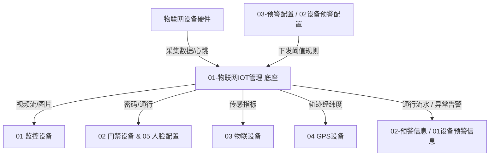

# 物联网IOT管理总索引

> **版本**：V1.2 | **更新日期**：2026-08-28
>
> **业务定位**：SYZC 存货监管系统物理资产与物联网设备底座，提供监控视频、门禁设备、环境传感、定位终端与人脸底库等全生命周期设备管理与硬件操作规范。
>
> **6.2 菜单重构说明**：原「门禁事务记录」独立菜单取消，底层通行流水与常规操作合流至 [02-预警信息/01设备预警信息](../02-预警信息/01设备预警信息/设备预警信息主PRD.md)（预警类型为 `常规通行与操作事务`）。
>
> **上级索引**：[SYZC 6.2 版本总览与索引](../README.md)
>
> **跨域关联**：
> - 产生的设备运行异常、物理告警与通行流水统一由 [02-预警信息/01设备预警信息](../02-预警信息/01设备预警信息/设备预警信息主PRD.md) 承接与闭环处置；
> - 设备预警规则、离线阈值及升级策略由 [03-预警配置/02设备预警配置](../03-预警配置/02设备预警配置/设备预警配置主PRD.md) 统一配置；
> - 门禁「获取门锁密码」命中审批时，申请单据唯一定义来源 见 [07-审批中心/05-子类型/01-开锁申请](../07-审批中心/05-子类型/01-开锁申请/开锁申请字段清单.md)；审批规则配置见 [06-门禁开锁审批/01-审批配置](../06-门禁开锁审批/01-审批配置/)。

---

## 一、模块目录结构

```text
01-物联网IOT管理/
├── 物联网IOT管理总索引.md       # 本文件
├── 01监控设备/                 # 视频监控、NVR/IPC 资产台账、直播、回放与锚点标注
├── 02门禁设备/                 # 智能挂锁、人脸门禁、密码获取与开闭权限
├── 03物联设备/                 # 温湿度传感器、烟感、气体监测与环境数据采集
├── 04GPS设备/                  # 车载/便携 GPS 终端、实时定位与轨迹追踪
└── 05人脸配置/                 # 人脸底库管理、授权下发与同步状态
```

---

## 二、子模块全景清单

| 模块序号 | 功能模块 | 核心能力与操作 | PRD 规格入口 | 字段清单 | 业务规则 | 本期 PC 原型验收 |
| :---: | :--- | :--- | :--- | :--- | :--- | :--- |
| **01** | **监控设备** | 直播流预览、录像回放、图像锚点设置、仓库绑定、设备重命名、设备移除 | [监控设备主PRD](./01监控设备/监控设备主PRD.md) | [字段清单](./01监控设备/监控设备字段清单.md) | [规则规格](./01监控设备/监控设备业务规则规格.md) | **不纳入**：本期仅验收 PRD/字段/规则，PC 入口为占位页 |
| **02** | **门禁设备** | 挂锁/人脸门禁主数据、设备数据查看、获取门锁密码、获取门禁密码、人脸权限；命中审批时跳转 [07-开锁申请](../07-审批中心/05-子类型/01-开锁申请/开锁申请字段清单.md) | [门禁设备主PRD](./02门禁设备/门禁设备主PRD.md) | [字段清单](./02门禁设备/门禁设备字段清单.md) | [规则规格](./02门禁设备/门禁设备业务规则规格.md) | **不纳入**：本期仅验收 PRD/字段/规则，PC 入口为占位页 |
| **03** | **物联设备** | 传感器主数据、温湿度/烟感/气体实时采集、历史数据曲线、数据导出 | [物联设备主PRD](./03物联设备/物联设备主PRD.md) | [字段清单](./03物联设备/物联设备字段清单.md) | [规则规格](./03物联设备/物联设备业务规则规格.md) | **不纳入**：本期仅验收 PRD/字段/规则，PC 入口为占位页 |
| **04** | **GPS设备** | GPS 终端台账、实时经纬度定位、历史轨迹回放、电子围栏状态 | [GPS设备主PRD](./04GPS设备/GPS设备主PRD.md) | [字段清单](./04GPS设备/GPS设备字段清单.md) | [规则规格](./04GPS设备/GPS设备业务规则规格.md) | **不纳入**：本期仅验收 PRD/字段/规则，PC 入口为占位页 |
| **05** | **人脸配置** | 监管人员/仓库人员人脸底库、多设备批量授权、下发进度跟踪与重试 | [人脸配置主PRD](./05人脸配置/人脸配置主PRD.md) | [字段清单](./05人脸配置/人脸配置字段清单.md) | [规则规格](./05人脸配置/人脸配置业务规则规格.md) | **不纳入**：本期仅验收 PRD/字段/规则，PC 入口为占位页 |

---

## 三、数据与操作架构原则



1. **唯一物理标识（唯一定义口径）**：所有硬件设备以系统生成的 `device_id` / `device_code` 为唯一标识，禁止使用显示名称或列表序号定位。
2. **仓库空间归属**：所有设备严格绑定仓库/库房/库位分区（REF-WH），未绑定的设备仅租户管理员可见。
3. **数据权限隔离**：设备列表查询与硬件操作严格受用户所属【仓库数据权限】控制。
