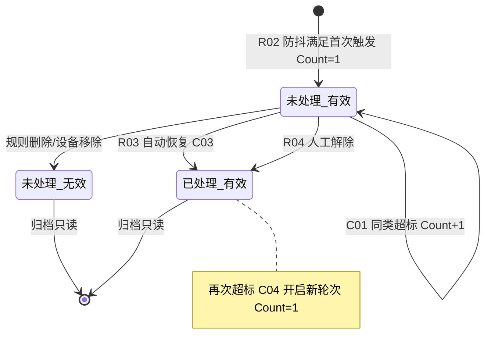
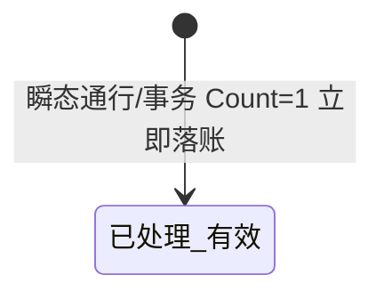
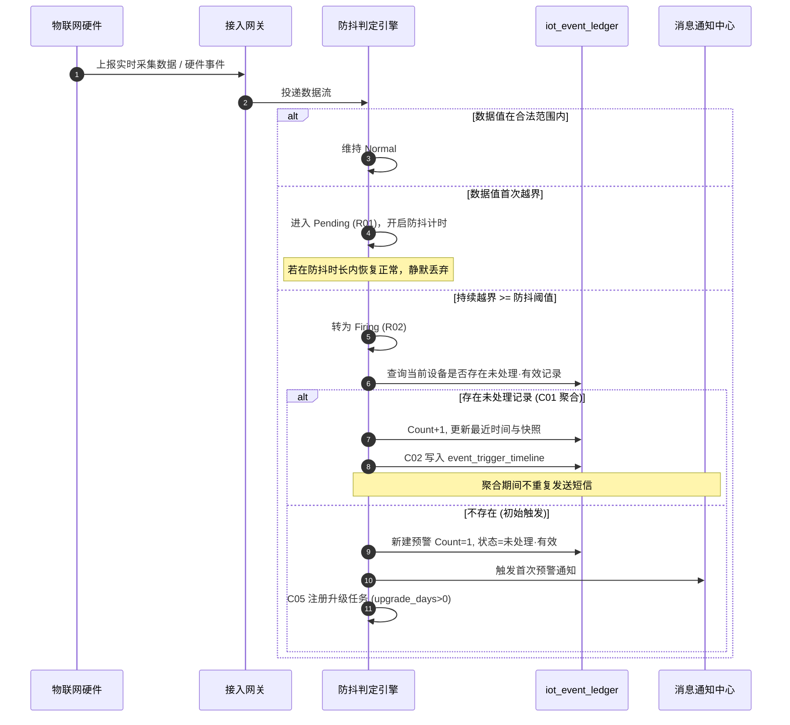
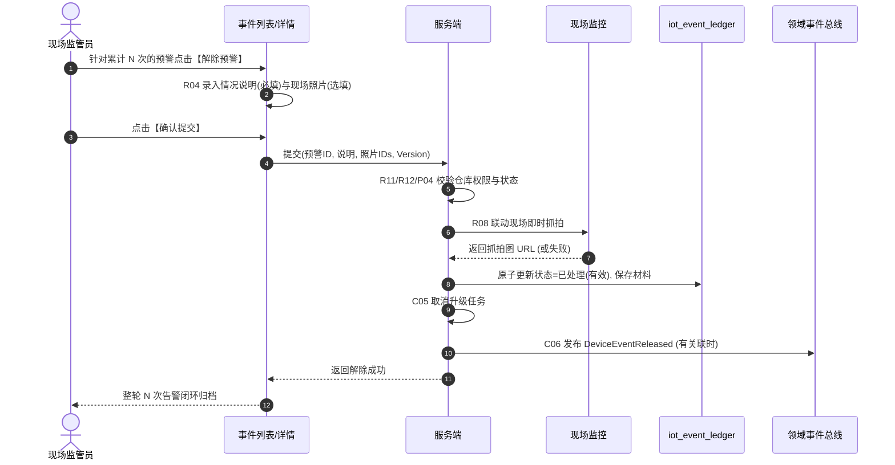
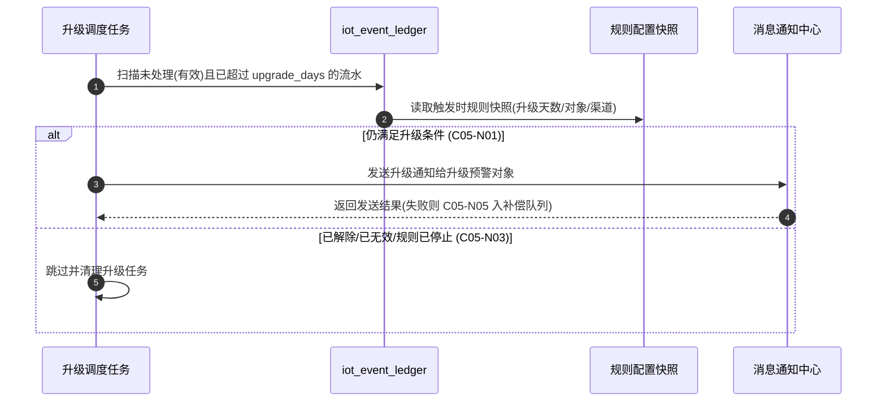

# 设备预警信息 业务规则规格

> **文档定位**：设备预警信息状态机、动作约束、校验规则、计算联动、权限与跨模块流程的**唯一定义来源**。主 PRD、字段清单、ASCII 线框只引用本文件规则 ID 与流程章节，不重复定义规则本体。
>
> **模块类型**：执行流水类（有处置状态机，无审批流）
>
> **参考文档**：[《设备预警信息主PRD》](./设备预警信息主PRD.md)、[《设备预警信息字段清单》](./设备预警信息字段清单.md)、[《00-全局契约与RBAC权限矩阵》](../../00-全局契约与RBAC权限矩阵.md)第四章 §1、[03/02设备预警配置业务规则规格](../../03-预警配置/02设备预警配置/设备预警配置业务规则规格.md)、[03/01 预警等级业务规则规格](../../03-预警配置/01预警等级/预警等级业务规则规格.md)
>
> **跨文档引用规范**：[B-迭代需求跨文档引用口径与来源索引](../../../README.md)。本文件定义流水状态、聚合、处置和跨域规则；依赖摘要不替代上述来源。
>
> **版本**：V3.0 | 2026-08-20
>
> **原型与 Demo 导航**：
> - **原型 DEV 路径**：PC端 [`/预警信息/设备预警信息`](http://localhost:5173/预警信息/设备预警信息) | 移动端 [`/m/iot/device-warning-events`](http://localhost:5173/m/iot/device-warning-events)（原型右下角可切换「标注模式」查看 DEV 说明）
> - **原型交互规范**：[设备预警信息_Demo_列表页](./设备预警信息_Demo_列表页.md) · [设备预警信息_Demo_详情页](./设备预警信息_Demo_详情页.md) · [设备预警信息_Demo_解除页](./设备预警信息_Demo_解除页.md) · [设备预警信息_Demo_移动端](./设备预警信息_Demo_移动端.md)
> - **ASCII 线框图**：[设备预警信息_ASCII_列表页](./设备预警信息_ASCII_列表页.md) · [设备预警信息_ASCII_详情页](./设备预警信息_ASCII_详情页.md) · [设备预警信息_ASCII_解除页](./设备预警信息_ASCII_解除页.md) · [设备预警信息_ASCII_移动端](./设备预警信息_ASCII_移动端.md)

---

## 一、能力定位

| 项目 | 内容 |
| :--- | :--- |
| **模块层级** | 执行流水层（非配置策略层） |
| **菜单路径** | `预警信息 → 设备预警信息` |
| **核心职责** | 承接硬件事件与通行事务合流台账（`iot_event_ledger`）；执行防抖判定（Pending/Firing）、频次聚合（Trigger Count）、通知/升级推送、现场核销与订单穿透联动 |
| **数据来源** | 物联网接入网关、防抖判定引擎、设备主数据事件流 |
| **上游依赖** | **03/02 设备预警配置**提供规则快照 C05，包括规则版本、阈值、防抖、通知策略和等级快照；**03/01 预警等级**仅提供 `sync_to_order_warn` 穿透开关和等级字典快照口径；**设备主数据与仓库档案**提供设备 ID、分类、空间归属和事件关联；**仓库数据权限**控制列表、详情、抓拍和处置范围。来源：REF-SEVERITY、REF-DEVICE、REF-WH、REF-RBAC。 |
| **下游影响** | **落账**：正式命中写入 `iot_event_ledger`，保存事件 ID、设备和空间快照、采集值/阈值、首次与最近时间、预警次数、规则 `Version`、防抖参数、03/01 等级快照和通知/升级对象快照；未处理期间重复事件按设备+子类型聚合，避免重复首发通知。**通知/升级**：按触发时规则快照发送首次通知和超时升级，流水处理或无效、规则删除/停用/失效时停止相应升级；发送失败进入补偿，不回滚流水。**订单穿透**：满足 R15 的等级同步开关和在押订单空间匹配时，向 [02/02 押品预警信息](../02押品预警信息/押品预警信息主PRD.md) 投递物联穿透记录，按设备事件 ID 幂等；不满足时仅保留本模块流水。**联动解除**：解除成功后按 C06 发布至少一次投递的 `DeviceEventReleased`，载荷含 `tenant_id`、`event_id`、`order_id`、`processed_by`、`processed_time`；02/02 消费失败由补偿重放。来源：[设备预警信息主 PRD](./设备预警信息主PRD.md) 第 3.1 节、R01~R04、C01~C06；[跨文档引用口径与来源索引](../../../README.md) REF-SEVERITY/REF-NOTIFY。 |
| **审核流** | **无**——人工解除提交即生效，核心路径为「触发 → 未处理有效 → 已处理有效」 |
| **与配置侧边界** | 配置侧 `状态`=规则生命周期；本模块 `预警状态`=流水处置状态，语义不同（见字段清单 第四章） |

---

## 二、状态定义

| 状态名称 | 枚举值 | 业务含义 | 是否终态 | 进入条件 | 离开条件 |
| :--- | :--- | :--- | :---: | :--- | :--- |
| 未处理（有效） | `OPEN_VALID` | 告警有效待处置；可聚合 Count；可人工/自动解除；可触发升级 | 否 | R02 防抖满足首次 Firing；持续型新建 Count=1 | 自动恢复 C03；人工解除 R04；置无效 |
| 未处理（无效） | `OPEN_INVALID` | 关联规则删除/覆盖或设备移除，不可再处置 | **是** | 配置侧 C01 规则删除；设备被移除 | — |
| 已处理（有效） | `CLOSED_VALID` | 自动恢复或人工核销完成，归档只读 | **是** | R03 自动恢复；R04 人工解除成功；R06 瞬态通行落账 | — |

**设计说明**：

- 执行流水类**不设**草稿态、待审核态；人工解除提交后一次性写入 `已处理（有效）`。
- `未处理（无效）` 不可通过界面恢复为有效，须等待全新超标事件开启新轮次（C04）。
- **常规通行与操作事务**类瞬态事件（R06）落账时直接进入 `已处理（有效）`，列表可简写「已处理」。

**引擎内部态（非用户可见）**：

| 内部态 | 含义 | 关联规则 |
| :--- | :--- | :--- |
| Pending（观测候选态） | 首次越界，防抖计时中 | R01 |
| Firing（正式告警态） | 达防抖阈值，可落账 | R02 |
| Normal | 数据在合法范围内 | — |

---

## 三、状态流转图

**瞬态事件旁路**（R06）：

---

## 四、状态流转表

> 前置条件须**全部**满足才允许触发动作；「后置影响」列出除状态变更以外的所有级联影响。

| 当前状态 | 动作 | 前置条件 | 结果状态 | 二次确认 | 后置影响 | 失败处理 |
| :--- | :--- | :--- | :--- | :--- | :--- | :--- |
| — | 引擎首次触发 | R01/R02 防抖满足；或 R06 瞬态事件 | 未处理（有效）或已处理（有效）* | 无 | ① 写入 `iot_event_ledger`；② C02 写 timeline；③ 持续型发首次通知；④ C05 注册升级任务（upgrade_days>0） | — |
| 未处理（有效） | 频次累加 | 同设备同子类型仍超标 | 未处理（有效） | 无 | ① C01 Count+1；② 更新最近预警时间与快照；③ C02 追加 timeline；④ **不**重复发短信 | — |
| 未处理（有效） | 自动恢复解除 | R03 采集值恢复并稳定 | 已处理（有效） | 无 | ① C03 更新处理人=系统自动处理；② C05 取消升级任务；③ C06 发布 DeviceEventReleased（有关联时） | — |
| 未处理（有效） | 人工解除 | R04/R11/R14 校验通过；P04 处理权限 | 已处理（有效） | 「确认解除该轮次告警？提交后将归档整轮 N 次触发。」 | ① 保存情况说明/现场照片；② 联动解除抓拍；③ C05 取消升级；④ C06 发布 DeviceEventReleased | 轻提示 (Toast)：「解除失败，{权限/状态/字段}不满足条件」 |
| 未处理（有效） | 规则删除联动 | 配置侧软删除规则 | 未处理（无效） | 系统自动 | ① C05 取消升级任务 | — |
| 未处理（无效） | 人工解除 | — | — | — | **不允许** | 入口不展示 |
| 已处理（有效） | 人工解除 | — | — | — | **不允许** | 入口不展示 |
| 已处理（有效） | （触发）新轮次 | 再次超标且防抖满足 | 未处理（有效） | 无 | C04 新建记录 Count=1 | — |

\* 瞬态通行/事务类（R06）首次触发直接进入 `已处理（有效）`。

---

## 五、动作能力矩阵

> ✅ = 允许；❌ = 不允许（不展示入口）；✅（条件）= 允许但有前置条件（见 第六章、第七章）

| 动作 | 未处理（有效） | 未处理（无效） | 已处理（有效） |
| :--- | :---: | :---: | :---: |
| 查看列表/详情 | ✅ | ✅ | ✅ |
| 频次时间轴抽屉 | ✅ | ✅ | ✅ |
| 抓拍预览 | ✅ | ✅ | ✅ |
| 人工解除 | ✅（条件） | ❌ | ❌ |
| 自动恢复解除 | ✅（系统） | ❌ | ❌ |
| 导出 | ✅ | ✅ | ✅ |

**人工解除条件（R14）**：仅图像入侵/挂锁破坏/非法开箱/物联离线/GPS 离线/门禁离线等**非瞬态已结案**且配置允许人工的类型展示 `[解除]` 入口；温湿度/GPS 数值恢复类走 R03 自动解除。

---

## 六、校验规则

### 6.1 防抖判定规则

| 规则ID | 规则 | 校验时机 | 违反处理 |
| :--- | :--- | :--- | :--- |
| **R01** | **防抖观测期（Pending）**：传感器采样值首次偏离规则阈值时，系统进入 `Pending (观测候选态)`；若偏离时长未达到规则配置的防抖时长，数据降回正常值，系统静默丢弃该事件，**不产生告警流水，不发通知短信** | 引擎判定 | 静默丢弃，无用户提示 |
| **R02** | **防抖满足触发（Firing）**：当偏离时长达到或超过防抖阈值（如温湿度持续超标 3 分钟），系统正式将状态转为 `Firing (正式告警态)`，生成初始预警记录（Count=1）并按配置渠道发送**首次**预警通知 | 引擎判定 | — |

### 6.2 解除校验规则

| 规则ID | 规则 | 校验时机 | 违反处理 |
| :--- | :--- | :--- | :--- |
| **R03** | **自动恢复解除**：温湿度/气体传感器采集值恢复到合法范围内并**稳定 1 分钟**、烟感收到恢复事件、GPS 收到正常事件、离线设备重新上线时，系统自动将该记录更新为 `已处理（有效）`，处理人=`系统自动处理` | 引擎判定 | — |
| **R04** | **人工核查解除**：图像识别入侵、智能挂锁破坏等非离线行为类及物联设备离线，支持有权限用户提交【情况说明】(必填, ≤200 字)与【现场照片】(选填, jpg/png/jpeg, 单张≤5MB, 最多 10 张)；提交时联动同位置监控即时抓拍 | 解除提交 | 阻断，提示「请填写情况说明」/「情况说明不可超过 200 字」 |
| **R11** | 人工解除时流水须为 `未处理（有效）`；须携带 `Version` 乐观锁（R12） | 解除提交 | 阻断，提示「该预警已处理或已失效」/「数据已被他人修改，请刷新重试」 |
| **R12** | 提交解除须携带 `Version`，乐观锁校验 | 解除提交 | 阻断，提示「数据已被他人修改，请刷新重试」 |
| **R14** | 仅 R14 允许人工解除的子类型展示解除入口；瞬态已结案类型（正常开关锁/刷脸通行等）不可解除 | 前端渲染 | 不展示 `[解除]` 按钮 |

### 6.3 门禁通行事务合流规则（继承 6.1 基准）

6.2 取消历史旧菜单【设备管理→门禁事务记录】，原 [01基准/05门禁事务记录](../../../../🌟🌟🌟-最新基准版/B端PC/02-仓储/20-设备管理-门禁事务记录/门禁事务字段清单.md) 的 15 种事务类型、人员追溯与抓拍规则在本模块继续生效：

| 规则ID | 规则 | 校验时机 | 违反处理 |
| :--- | :--- | :--- | :--- |
| **R05** | **事务大类映射**：原 15 种门禁事务归入预警类型 `常规通行与操作事务`（L1 默认）或 `智能挂锁预警` / `人脸门禁预警`（含异常类，如门打开超时、密码不匹配）；详情子类型名称沿用 6.1 事务名称枚举（见附录 A） | 落账 | — |
| **R06** | **瞬态通行立即落账**：正常开关锁、刷脸通行、获取密码成功等瞬态事件强制防抖=0，生成单条流水（Count=1），状态直接置 **`已处理（有效）`**（处理人=`系统自动处理`，处理时间=触发时间），不进入频次聚合；默认不发短信（规则配置 L2+ 且启用通知渠道时仍可按规则推送） | 落账 | — |
| **R07** | **人员追溯继承**：挂锁「开锁成功」沿用 6.1 动态追溯算法：关联最近一次及同密码「获取密码成功」操作人；获取密码/人脸认证/密码认证类事务展示操作账号 `姓名（机构）`；无关联人员展示 `-` | 展示 | — |
| **R08** | **抓拍联动继承**：开关锁及异常门禁事件触发同位置监控联动抓拍；获取密码类事务无实时抓拍时展示「无抓拍图」；图片访问走 R13 时效签名机制 | 落账/展示 | 抓拍失败展示「抓拍失败」 |
| **R09** | **双入口只读**：门禁设备「设备数据→事务记录」Tab 与「设备预警信息」列表共用 `iot_event_ledger`；标签页 (Tab) 按设备编码过滤，列表支持 03/01 当前启用等级与类型筛选 | 查询 | P02 仓库权限过滤 |
| **R10** | **历史迁移口径**：`t_door_access_log` 迁入新表时保留子类型名称与抓拍 Key；详见 [03历史数据迁移与回滚技术方案](../../04-历史迁移与割接方案/01设备侧规则与流水迁移/03历史数据迁移与回滚技术方案.md) Step 2 | 迁移 | — |

### 6.4 图片与穿透校验

| 规则ID | 规则 | 校验时机 | 违反处理 |
| :--- | :--- | :--- | :--- |
| **R13** | **图片时效签名**：抓拍图片落库时注入防伪签名；前端须使用带过期时间的时效签名 URL 访问；过期须重新换取 | 预览 | 提示「图片链接已过期，请刷新」 |
| **R15** | **穿透生成前置**：向 02/02 投递穿透告警前，须校验触发等级快照 `sync_to_order_warn=true` 且仓库空间存在在押订单；不满足则仅保留本模块物理台账。规则来源：[03/01 预警等级](../../03-预警配置/01预警等级/预警等级业务规则规格.md) LV-DICT-R08 | 穿透投递 | 跳过订单侧，仅本模块落账 |

---

## 七、计算与联动规则

| 规则ID | 规则 |
| :--- | :--- |
| **C01** | **频次聚合（Trigger Count）**：同一设备同一事件子类型处于 `未处理（有效）` 期间，后续重复收到的超标事件自动累加（`预警次数 = 预警次数 + 1`），更新 `最近预警时间` 与最新数据快照；**聚合期间不再重复发送短信**（对应原 EVT-R03） |
| **C02** | **时间轴明细写入**：聚合后的单条记录在底层关联 `event_trigger_timeline` 明细表，完整记录每一次触发的 `序号`、`时间戳`、`采集数值`、`抓拍图地址`，供频次抽屉回放（对应原 EVT-R04） |
| **C03** | **自动恢复状态更新**：R03 条件满足时，原子更新流水状态=`已处理（有效）`，写入处理时间，处理人=`系统自动处理`，保存恢复时快照 |
| **C04** | **全新轮次起算**：记录已变为 `已处理（有效）` 后归档只读；若未来再次发生超标事件且防抖满足，系统开启全新一轮预警，`预警次数` 重新从 **`1`** 开始计数（对应原 EVT-R07） |
| **C05** | **超时升级通知（EVT-N01~N05）**： ① **N01 触发**：流水处于 `未处理（有效）` 且规则快照 `upgrade_days > 0` 时，以 **首次预警时间** 为起点，到达 N 个自然日且仍未解除，向「升级预警对象」发送升级通知（站内信默认 + 规则配置的其他渠道）； ② **N02 与频次关系**：Count 累加**不**重复发首次短信，升级通知独立于频次，**不因 Count 增加而重置**升级计时； ③ **N03 停止**：流水变为 `已处理（有效）`/`未处理（无效）`，或关联规则被删除/停用/已失效时，立即取消待执行升级任务； ④ **N04 规则变更**：已存在未处理流水按**触发时规则快照**执行；新触发流水按最新规则； ⑤ **N05 失败隔离**：升级通知发送失败进入补偿队列，不回滚流水状态；连续失败超过 3 次记录运维告警 |
| **C06** | **穿透联动与领域事件**： ① **DeviceEventReleased 发布**（原 EVT-R14）：流水由 `未处理（有效）` 变为 `已处理（有效）`（人工或自动）且存在关联穿透押品预警时，须发布领域事件 `DeviceEventReleased`，载荷至少含：`tenant_id`、`event_id`、`order_id`（可多条）、`processed_by`、`processed_time`；至少一次投递；消费失败由补偿任务重放； ② **穿透投递前置**（R15）：满足 sync_to_order_warn 与在押订单条件时，向 02/02 订单预警同步引擎投递 |

---

## 八、权限规则

### 8.1 数据可见范围

| 规则ID | 规则 |
| :--- | :--- |
| **P01** | 租户隔离：仅可见本租户流水 |
| **P02** | 仓库数据权限：列表、详情、标签页 (Tab) 只读视图按用户管辖仓库过滤；解除时须校验流水所属仓库在操作人权限内 |
| **P03** | 无 IoT 菜单查看权限的用户不可见本模块入口 |
| **P04** | 人工解除须具备 IoT **处理**权限（R-IOT-OPS / R-SYS-ADMIN）；风控只读角色不可解除 |
| **P05** | 抓拍预览须具备图片查看权限；无权限时缩略图置灰或隐藏 |

### 8.2 操作权限矩阵

> 角色定义见 [00-全局契约与RBAC权限矩阵](../../00-全局契约与RBAC权限矩阵.md) 第四章 §1。

| 操作 | R-SYS-ADMIN | R-IOT-OPS | R-RISK-MGR | R-RISK-OFF | R-VIEWER |
| :--- | :---: | :---: | :---: | :---: | :---: |
| 查看列表/详情 | ✅ | ✅ | ✅ | ✅ | ✅ |
| 频次时间轴 | ✅ | ✅ | ✅ | ✅ | ✅ |
| 抓拍预览 | ✅ | ✅ | ✅ | ✅ | ✅ |
| 人工解除 | ✅ | ✅ | ❌ | ❌ | ❌ |
| 导出 | ✅ | ✅ | ✅ | ✅ | ✅ |

### 8.3 权限约束说明

| 约束 | 说明 |
| :--- | :--- |
| 解除范围 | 仅可操作数据权限内仓库的未处理有效流水 |
| 移动端 | 6.2 移动端支持列表/详情/解除；无规则写操作 |

---

## 九、边界与异常处理

### 9.1 并发控制

| 场景 | 处理方式 |
| :--- | :--- |
| 两人同时解除同一流水 | R12 乐观锁，后提交者提示「数据已被他人修改，请刷新重试」 |
| 解除与自动恢复并发 | 以数据库乐观锁为准，先成功者生效，后者提示状态已变更 |
| 频次累加与解除并发 | 解除成功后，迟到的超标事件开启 C04 新轮次，不写入已归档记录 |

### 9.2 幂等操作约束

| 操作 | 幂等规则 |
| :--- | :--- |
| 频次聚合 | 同一原始 event_id 重复投递不重复 Count+1 |
| 人工解除 | 同一流水重复解除返回「该预警已处理」 |
| DeviceEventReleased | 以 event_id + processed_time 为幂等键 |
| 升级通知 | 同一流水同一升级档位仅发送一次，失败重试不重复计数 |

### 9.3 上下游不一致

| 场景 | 处理方式 |
| :--- | :--- |
| 联动解除抓拍失败 | 解除仍成功，解除抓拍字段展示「抓拍失败」 |
| 升级通知连续失败 | EVT-N05 入补偿队列，超 3 次运维告警 |
| 规则已删除，流水仍显示未处理 | 配置侧 C01 置 `未处理（无效）`，升级 C05-N03 终止 |
| 02/01 显示未处理，但采集已恢复 | 补偿任务扫描 R03 条件，自动 C03 |
| 图片签名过期 | R13 前端重新换取时效 URL |

---

## 十、规则索引

| 规则类型 | 代码范围 | 说明 |
| :--- | :--- | :--- |
| 校验规则 | R01 – R15 | 防抖、解除、门禁合流、图片、穿透前置 |
| 计算联动规则 | C01 – C06 | Count 聚合、timeline、自动恢复、轮次、升级、穿透事件 |
| 权限规则 | P01 – P05 | 租户、仓库、菜单、解除、图片 |
| 升级子规则 | EVT-N01 – N05 | 归入 C05，保留 EVT-N 前缀便于通知引擎引用 |

### EVT-Rxx → R/C/P 映射表

| 原编号 | 新编号 | 说明 |
| :--- | :--- | :--- |
| EVT-R01 | **R01** | Pending 观测候选态 |
| EVT-R02 | **R02** | Firing 正式告警态 |
| EVT-R03 | **C01** | 频次聚合 Count+1 |
| EVT-R04 | **C02** | timeline 明细 |
| EVT-R05 | **R03** + **C03** | 自动恢复（校验 R03，执行 C03） |
| EVT-R06 | **R04** | 人工解除表单 |
| EVT-R07 | **C04** | 全新轮次起算 |
| EVT-R08 | **R05** | 事务大类映射 |
| EVT-R09 | **R06** | 瞬态通行立即落账 |
| EVT-R10 | **R07** | 人员追溯 |
| EVT-R11 | **R08** | 抓拍联动 |
| EVT-R12 | **R09** | 双入口 iot_event_ledger |
| EVT-R13 | **R10** | 历史迁移 |
| EVT-N01~N05 | **C05** | 超时升级（保留 EVT-N 子编号） |
| EVT-R14 | **C06** | DeviceEventReleased |
| EVT-R15 | **R15** + **C06** | 穿透前置校验 |

---

## 附录 A：预警子类型与合流枚举

> **权威来源**：配置侧 5 大类子类型见 [03/02 附录 A](../../03-预警配置/02设备预警配置/设备预警配置业务规则规格.md#附录-a预警子类型权威枚举)；本附录补充信息侧第 6 大类 `常规通行与操作事务` 及 6.1 门禁 15 种事务名称。

### A.1 预警类型（6 大类）

| 预警类型 | 来源 | 默认等级 | 处置路径 |
| :--- | :--- | :--- | :--- |
| 设备图像识别预警 | 配置规则命中 | 按规则快照 | 持续型：未处理→人工/自动；离线：自动恢复 |
| 设备物联预警 | 配置规则命中 | 按规则快照 | 数值异常：自动恢复；离线：人工/自动 |
| 智能挂锁预警 | 配置/事务合流 | L2~L5 | 破坏类：人工；正常开关锁：R06 瞬态已处理 |
| 人脸门禁预警 | 配置/事务合流 | L2~L5 | 异常类：未处理；正常通行：R06 瞬态已处理 |
| 设备GPS预警 | 配置规则命中 | 按规则快照 | 围栏/超速：自动恢复；离线：人工/自动 |
| **常规通行与操作事务** | 6.1 门禁合流 | L1 默认 | **R06 瞬态已处理**；不可在配置侧新建 |

### A.2 常规通行与操作事务 — 6.1 门禁 15 种事务名称（R05）

| 序号 | 子类型名称 | 合流大类 | 事件性质 |
| :---: | :--- | :--- | :---: |
| 1 | 获取密码成功 | 常规通行与操作事务 | 瞬态 |
| 2 | 获取密码失败 | 人脸门禁预警 | 瞬态 |
| 3 | 密码认证成功 | 常规通行与操作事务 | 瞬态 |
| 4 | 密码认证失败 | 人脸门禁预警 | 瞬态 |
| 5 | 人脸认证成功 | 常规通行与操作事务 | 瞬态 |
| 6 | 人脸认证失败 | 人脸门禁预警 | 瞬态 |
| 7 | 蓝牙开锁成功 | 智能挂锁预警 / 常规通行与操作事务 | 瞬态 |
| 8 | 蓝牙关锁成功 | 常规通行与操作事务 | 瞬态 |
| 9 | 远程开锁成功 | 常规通行与操作事务 | 瞬态 |
| 10 | 远程关锁成功 | 常规通行与操作事务 | 瞬态 |
| 11 | 门打开超时 | 人脸门禁预警 | 持续 |
| 12 | 非法开箱 | 智能挂锁预警 | 瞬态 |
| 13 | 拆壳报警 | 智能挂锁预警 | 瞬态 |
| 14 | 剪杆破坏 | 智能挂锁预警 | 瞬态 |
| 15 | 撬锁报警 | 智能挂锁预警 | 瞬态 |

---

## 业务流程与联动

> 跨模块主路径、时序推演、异常回路。与上文 第二至五章 状态机配合阅读；**重复的状态机定义以上文为准**。

### 1. 事件接入、防抖判定与频次累加时序

### 2. 人工核查解除与整轮归档时序

### 3. 超时升级通知时序

---

## 设计自检清单

- [x] 是否存在永远到不了的状态？——三态均可达（含瞬态旁路直接已处理）
- [x] 非终态是否都有离开路径？——未处理有效可自动/人工解除或置无效
- [x] Pending/Firing 内部态是否与用户可见状态分离？——是，第二章设计说明
- [x] 停用 vs 删除 vs 已失效（配置侧）对流水影响是否区分？——删除置无效；停用不置无效（配置 C02）
- [x] Count 累加与升级计时是否独立？——C05-N02 已明确
- [x] 动作能力矩阵是否无遗漏？——第五章已覆盖
- [x] 规则 ID 是否唯一？——R/C/P 索引见 第十章；EVT 映射表完整
- [x] 6 大类含「常规通行与操作事务」？——附录 A.1
- [x] iot_event_ledger 双入口？——R09
- [x] 跨模块流程是否归入本文件？——业务流程与联动章节 3 条时序

---

## 修订记录

| 日期 | 版本 | 变更摘要 |
| :--- | :---: | :--- |
| 2026-08-19 | V2.0 | 初版业务规则 |
| 2026-08-20 | V2.1 | 统一瞬态事务状态口径；EVT-N01~N05 |
| 2026-08-20 | V2.2 | EVT-R14/R15 穿透与 DeviceEventReleased |
| 2026-08-20 | **V3.0** | **6.2 标杆重构**：补 第一至十章 标准结构；状态流转表；动作矩阵；R01~R15/C01~C06/P01~P05；附录 A 子类型枚举；EVT-Rxx 映射表；设计自检清单 |
