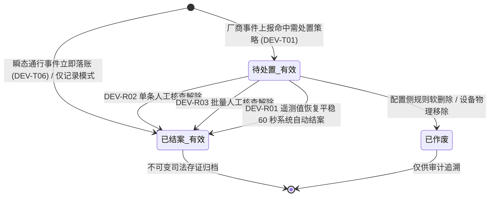
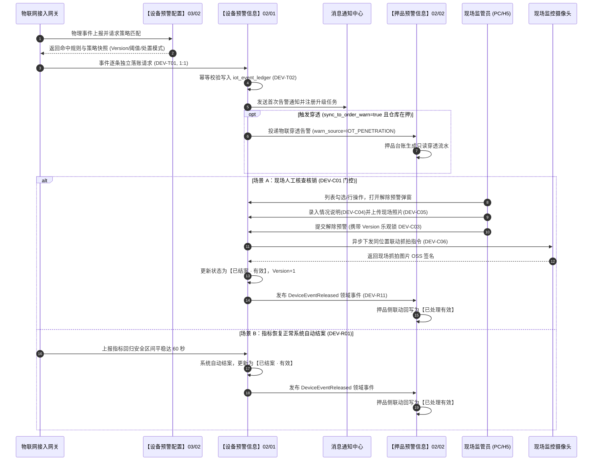

# 设备预警信息 业务规则规格

> **文档定位**：**三件套核心**——状态机流转、动作约束、核销校验、跨域联动与不可变存证的**唯一定义真源（SSOT）**。配套文档：[设备预警信息主PRD.md](./设备预警信息主PRD.md)（业务与页面交互）、[设备预警信息字段清单.md](./设备预警信息字段清单.md)（字段字典）。端侧 ASCII 线框与 Demo 为衍生输入，仅引用本文件规则 ID，不重复定义规则本体。  
> **模块类型**：业务执行流水类（具有完整处置状态机与多轨核销，无审批流）  
> **版本**：V4.0 | **更新时间**：2026-09-18 | **责任人**：森云科技（Senyun Technology）  
> **参考依据**：[《00-全局契约与RBAC权限矩阵》](../../00-全局契约与RBAC权限矩阵.md)第四章 §1、[设备预警配置业务规则规格（03/02）](../../03-预警配置/02设备预警配置/设备预警配置业务规则规格.md)、[预警等级配置业务规则规格（03/01）](../../03-预警配置/01预警等级/预警等级业务规则规格.md)

---

## 一、单据与能力定位

| 项目 | 内容 |
| :--- | :--- |
| **模块层级** | **【业务执行流水层】**（物理硬件异常事件的统一台账承接与闭环处置中枢，非配置策略层） |
| **菜单路径** | PC端：`工作台 → 预警信息 → 设备预警信息`；移动端：`工作台 → 预警信息 → 设备预警` |
| **核心职责** | 承接厂商接入层去重预过滤后的物理硬件异常事件与门禁风险事件台账（`iot_event_ledger`）；提供逐条独立落账（1:1）、触发快照不可变固化、双轨闭环解除（人工核查与系统自动恢复）、PC端批量快速解除、超时升级阶梯推送以及向订单侧物联穿透闭环协同 |
| **数据来源** | 物联网接入网关（厂商侧已完成防抖/持续时长判定与去重）、设备主数据与实时事件流 |
| **上游依赖** | **【设备预警配置】策略（菜单：预警配置 → 设备预警配置，代号 03/02）**：提供触发时刻的规则版本、最低/最高阈值、处置策略模式与升级天数快照； **【预警等级】字典（菜单：预警配置 → 预警等级，代号 03/01）**：提供预警严重度等级字典、标签颜色及 `sync_to_order_warn` 穿透开关快照； **设备台账与仓库主数据**：提供物理设备 ID、分类、名称及关联仓库/库房空间拓扑； **仓库数据权限**：列表检索、详情查看、抓拍预览与核销操作均严格按操作人管辖实体仓库行级隔离。 |
| **下游影响** | **逐条独立落账**：每条厂商事件独立写入 `iot_event_ledger`，不可变固化事件发生时刻的全部物理与策略快照；杜绝频次累加或覆盖； **升级定时调度**：状态为待处置有效且超期时，定时调度引擎触发阶梯升级短信；结案或作废时自动取消调度； **跨域物联穿透**：等级快照开启穿透且设备所在库区存在在押订单时，向【押品预警信息】台账（菜单：`预警信息 → 押品预警信息`，代号 02/02）投递只读穿透记录； **跨域联动解除**：现场核销结案后，系统发布 `【设备事件已解除】领域事件（DeviceEventReleased）` 驱动押品侧穿透告警同步更新为【已处理有效】。 |
| **审核流边界** | **无审批流**——现场核查解除提交即生效，核心状态机为「触发 $\rightarrow$ 待处置 · 有效 $\rightarrow$ 已结案 · 有效」 |

---

## 二、指标与计算口径隔离表

| 口径名称 | 应用维度 | 业务含义与计算公式 / 判定条件 | 约束与边界说明 |
| :--- | :--- | :--- | :--- |
| **数值型越限判定** | 事件接入实时计算 | 厂商上报物理监测值 $V_{\text{current}}$，当满足： $$V_{\text{current}} < T_{\text{min}} \quad \text{或} \quad V_{\text{current}} > T_{\text{max}}$$ | 超出正常闭区间即判定命中告警，触发生成独立流水；数值保留 2 位小数 |
| **自动恢复平稳判定** | 恢复结案实时计算 | 恢复自动结案模式下，当上报物理值满足： $$T_{\text{min}} \le V_{\text{current}} \le T_{\text{max}} \quad \text{且持续平稳时间} \quad \Delta t \ge 60\text{ 秒}$$ | 持续平稳达标即刻触发系统自动结案，联动更新流水为【已结案 · 有效】 |
| **超时升级时刻判定** | 升级定时调度引擎 | 自告警事件实际触发时刻起算，超时升级截止时刻为： $$T_{\text{upgrade}} = T_{\text{trigger}} + D_{\text{upgrade}} \times 86400\text{ 秒}$$ | $D_{\text{upgrade}} \in [1, 30]$ 正整数天；仅在流水处于待处置状态且 $T_{\text{now}} \ge T_{\text{upgrade}}$ 时触发升级 |
| **并发数据版本号** | 乐观锁并发控制 | 流水数据版本计数器： $$\text{Version}_{n+1} = \text{Version}_n + 1$$ | 初始落账 Version=1；人工或系统结案时原子递增；提交时若版本不一致强阻断 |
| **批量解除统计口径** | 批量操作反馈汇总 | 批量勾选 $N_{\text{total}}$ 条流水，系统逐条原子处理后汇总： $$N_{\text{total}} = N_{\text{success}} + N_{\text{failed}}$$ | 弹窗轻量浮窗提示反馈：「批量解除完成：成功 $N_{\text{success}}$ 条，失败 $N_{\text{failed}}$ 条」 |

---

## 三、单据状态机与生命周期流转

### 3.1 状态定义
预警流水生命周期严格采用三态标准词表，禁止使用简称：

| 状态名称 | 状态编码 | 业务含义 | 是否终态 | 进入条件 | 退出条件 |
| :--- | :--- | :--- | :---: | :--- | :--- |
| **待处置 · 有效** | `PENDING_VALID` | 告警有效待处置；可单条人工解除、可批量解除、可自动恢复、可触发超时升级 | 否 | 厂商事件命中且触发快照处置策略为需处置（人工或自动） | 人工核销成功；自动恢复成功；关联规则删除置作废 |
| **已结案 · 有效** | `RESOLVED_VALID` | 物理异常已消除或经现场核查合规解除，归档只读 | **是** | 单条人工解除成功；批量解除成功；自动恢复结案成功；瞬态通行落账 | —（不可逆终态） |
| **已作废** | `OPEN_INVALID` | 关联预警规则被软删除或物理设备解绑移除，告警失去处置依据 | **是** | 配置侧规则软删除；设备主数据中解绑移除 | —（不可逆终态） |

### 3.2 状态流转图

### 3.3 状态流转表

| 当前状态 | 触发动作 | 前置业务条件 | 结果状态 | 二次确认与交互形式 | 联动后置影响 | 失败处理与反馈 |
| :--- | :--- | :--- | :--- | :--- | :--- | :--- |
| — | **厂商事件落账** | 厂商事件通过接入层防抖与去重校验；命中有效规则 | 待处置 · 有效 / 已结案 · 有效* | 系统自动后台写入 | ① 写入 `iot_event_ledger`（新行）； ② 固化触发不可变快照； ③ 发送首次预警通知； ④ 注册超时升级定时调度任务； ⑤ 若开启穿透且在押，投递至押品预警台账。 | 丢弃或写入异常错误日志，不阻塞网关 |
| **待处置 · 有效** | **单条人工解除** | 流水满足 DEV-C01 门控；操作人具备 `R-IOT-OPS` 权限；通过并发版本校验 | 已结案 · 有效 | 弹窗强制录入 1~200 字情况说明；选填现场照片；点击【确定解除】二次确认 | ① 记录处理人、处理时间、情况说明与照片； ② 下发同位置监控抓拍指令并存储； ③ 取消超时升级定时任务； ④ 发布 `DeviceEventReleased` 领域事件驱动押品侧结案。 | 浮窗提示：「解除失败，{具体原因}」 |
| **待处置 · 有效** | **批量人工解除** | 勾选 $\ge 1$ 条记录且全部满足 DEV-C01 门控；操作人具备权限 | 已结案 · 有效（逐条） | 弹窗录入一次统一情况说明与可选照片；点击【确定批量解除】二次确认 | ① 逐条执行单条解除全部后置影响； ② 独立记录各条流水处理留痕与审计日志； ③ 异步逐条下发对应摄像头抓拍。 | 汇总成功/失败条数，轻量浮窗提示反馈 |
| **待处置 · 有效** | **自动恢复结案** | 子类型在白名单内；快照模式为恢复自动结案；监测值回归正常达 60 秒 | 已结案 · 有效 | 系统自动后台执行 | ① 处理人写入“系统自动处理”，记录恢复时间； ② 取消超时升级定时任务； ③ 发布 `DeviceEventReleased` 领域事件联动押品侧结案。 | 记录自动结案失败日志并重试 |
| **待处置 · 有效** | **规则删除联动** | 配置侧软删除该流水关联的预警规则 | 已作废 | 系统自动级联更新 | ① 取消超时升级定时任务； ② 停止后续流转，不可再人工核销。 | — |
| **已结案 · 有效** | **人工解除** | — | — | — | **强禁止**：操作列不展示解除入口，接口调用直接阻断 | HTTP 403 Forbidden |
| **已作废** | **人工解除** | — | — | — | **强禁止**：操作列不展示解除入口，接口调用直接阻断 | HTTP 403 Forbidden |

\* 瞬态通行事件（DEV-T06）及仅落账模式在初态直接落账为 `已结案 · 有效`。

---

## 四、动作能力与流转控制矩阵

| 触发动作 | 操作入口 | 适用角色 | 前置业务校验条件 | 结果状态 | 联动后置影响 | 失败阻断提示 |
| :--- | :--- | :--- | :--- | :--- | :--- | :--- |
| **单条人工解除** | PC列表/详情行操作【解除预警】；H5卡片【解除】 | 现场监管员 (`R-IOT-OPS`)、超级管理员 (`R-SYS-ADMIN`) | ① 流水处于 `待处置 · 有效`； ② 触发快照 `处置策略模式=人工处置结案`（DEV-C01）； ③ 客户端 Version 与服务端一致（DEV-C03）； ④ 操作人具备当前仓库数据权限（DEV-P02）。 | 已结案 · 有效 | ① 固化写入情况说明、现场照片及解除抓拍； ② 取消进行中的超时升级任务； ③ 发布 `DeviceEventReleased` 驱动押品侧闭环； ④ 写入全路径操作审计日志。 | 「解除失败：该告警已被他人处理」 「数据已被他人修改，请刷新重试」 |
| **批量人工解除** | PC列表工具条【批量解除】按钮 | 现场监管员 (`R-IOT-OPS`)、超级管理员 (`R-SYS-ADMIN`) | ① 至少勾选 1 条记录； ② 勾选记录全部满足 DEV-C01 门控； ③ 情况说明字符在 1~200 字之间（DEV-C04）。 | 已结案 · 有效（逐条） | ① 后台逐条校验 Version 乐观锁并独立提交； ② 逐条生成操作审计日志与联动抓拍； ③ 逐条取消超时升级任务； ④ 逐条发布解除领域事件。 | 「批量解除失败：包含不可解除的告警记录」 「批量解除完成：成功 M 条，失败 N 条」 |
| **查看详情** | 列表行操作【详情】按钮 | 具有查看权限的角色 (`R-IOT-VIEW` 等) | 数据属于操作人管辖仓库范围 | 状态不变 | 只读打开详情页，展示基本信息、位置快照、图文事实、处置材料及规则快照 | 「暂无该数据查看权限」 |
| **抓拍图片预览** | 列表缩略图点击 / 详情抓拍图点击 | 具有查看权限的角色 | 图片地址有效且具有图片查看权限（DEV-P01） | 状态不变 | 弹出大图预览浮层，支持旋转与缩放；调用私有 OSS 动态安全临时签名 | 「图片加载失败或已过期」 |
| **超时升级短信推送** | 定时任务调度引擎 | 系统自动化任务 | 流水处于待处置状态且超过升级天数阈值 | 状态不变 | 向规则快照中指定的升级对象发送短信告警；更新升级发送记录；失败自动重试 | 记录升级短信发送失败日志并进入补偿队列 |

---

## 五、核心业务规则清单 (DEV-T01 ~ DEV-P04)

### 5.1 事件落账与数据幂等 (DEV-T01 ~ DEV-T07)

#### 【逐条独立落账防抖与去重规则】(DEV-T01)
* **业务红线**：所有通过物联网网关接入层预过滤与防抖校验后的硬件告警事件，进入系统后**严格按 1:1 独立生成一条流水行**（`iot_event_ledger`）；
* **架构禁令**：系统**严禁**进行同设备同指标的预警频次累加（Count+1）、严禁更新覆盖旧流水最近预警时间、严禁在列表展示频次时间轴抽屉。每条流水具有全局唯一自增序号与预警时间，作为独立的超时升级与司法证据存证起点。

#### 【三方事件来源分布式幂等落账规则】(DEV-T02)
* **幂等控制**：系统在落账前以 `(tenant_id, event_id)` 作为分布式防重键。同一厂商上报的相同 `event_id` 若发生重复投递，系统直接静默丢弃并返回成功应答，杜绝网络重发导致的重复入账。

#### 【门禁通行事务合流与映射规则】(DEV-T05)
* **业务映射**：智能挂锁与人脸门禁的异常告警及通行事务统一合流进入本台账，分别归属于“智能挂锁预警”与“人脸门禁预警”大类。历史旧菜单【门禁事务记录】停止独立维护，原门禁设备详情「设备数据 $\rightarrow$ 事务记录」标签页作为只读视图共用底层台账。

#### 【瞬态通行事件立即落账结案规则】(DEV-T06)
* **初态判定**：合法员工正常刷脸通行、授权开锁成功等瞬态通行事件，事件生成时初态直接落库为 `已结案 · 有效`，无需人工核销，仅供现场出入库安全审计追溯。

#### 【挂锁开锁人员追溯继承规则】(DEV-T07)
* **追溯算法**：智能挂锁产生开锁通行事件时，系统自动关联最近一次审批通过且在有效时段内的开锁申请单，继承开锁申请人姓名与所属机构作为通行责任人；未匹配到审批单的紧急开锁或物理破锁，责任人标识为“未知/异常破锁”。

---

### 5.2 人工解除与批量处置门控 (DEV-C01 ~ DEV-C06)

#### 【人工核查解除准入门控规则】(DEV-C01)
* **门控准入条件**：流水必须**同时满足**以下全部条件，前端才允许展示【解除预警】入口或激活列表复选框：
  1. 流水当前业务状态严格处于 `待处置 · 有效`；
  2. 触发时刻固化的规则快照中，`处置策略模式` 严格为 `人工处置结案（ACTION_REQUIRED）`；
  3. 流水不属于瞬态通行即时结案类型（DEV-T06）。
* **接口强阻断**：若前端被篡改绕过门控直接调用解除接口，服务端前置拦截并返回 HTTP 403 阻断提示。

#### 【提交解除待处置状态强校验规则】(DEV-C02)
* **防篡改校验**：提交单条或批量解除请求时，服务端开启事务排他查询，若当前数据库状态已非 `待处置 · 有效`（如已被他人结案或系统自动结案），强阻断提交并提示「该预警已被他人处置结案，请刷新列表重试」。

#### 【提交解除数据版本号并发控制锁规则】(DEV-C03)
* **乐观锁控制**：前端打开解除弹窗时获取当前记录的 `Version` 版本号，提交时作为必要入参回传。服务端比对 `client_version == db_version`，若不一致则强阻断并提示「数据已被他人修改，请刷新重试」，同时返回最新数据库快照。

#### 【情况说明必填字数超限阻断规则】(DEV-C04)
* **录入规范**：人工解除核查时，“情况说明”为**必填项**，文本长度必须在 $1 \sim 200$ 个中文字符之间（去首尾空格）。禁止全空格或空字符提交，违规时前端提交按钮置灰并红字提示「请输入1~200字的情况说明」。

#### 【现场照片规格超限拦截规则】(DEV-C05)
* **规格限制**：现场核查照片为选填项，最多允许上传 10 张图片，格式仅支持 JPG、JPEG、PNG，单张文件大小严格限制在 5MB 以内。超出规格时在选择器阶段直接拦截并浮窗提示。

#### 【离线状态指令下发超时容灾规则】(DEV-C06)
* **容灾降级**：监管员提交人工解除时，系统异步向现场同库区摄像头下发即时抓拍指令。若摄像头离线或超时 5 秒未返回图片，抓拍状态标记为“抓拍失败/设备离线”，**严禁阻断**核心解除业务流的结案入账。

---

### 5.3 自动恢复与跨域联动规则 (DEV-R01 ~ DEV-R11)

#### 【传感器与离线指标自动恢复结案规则】(DEV-R01)
* **自动结案条件**：处于 `待处置 · 有效` 的温湿度、气体浓度或设备离线流水，当满足：
  1. 触发快照中 `处置策略模式=恢复自动结案（AUTO_CLOSE_ON_RECOVERY）`；
  2. 预警子类型属于白名单（温湿度、有害气体等持续型监控指标）；
  3. 传感器遥测监测值回落至安全区间并持续平稳 $\ge 60$ 秒，或离线设备恢复心跳在线。
* **结案动作**：系统自动将流水状态流转为 `已结案 · 有效`，处理人字段赋值为“系统自动处理”，取消超时升级定时任务，不可逆归档。

#### 【人工核查解除情况说明与现场抓拍规则】(DEV-R02)
* **全景存证**：单条人工解除成功后，系统原子固化处理人姓名、所属机构、核销时间戳、1~200 字情况说明、现场核查照片 OSS 地址及同位置监控联动抓拍图片，永久存证备查。

#### 【批量人工核查解除并发与强校验规则】(DEV-R03)
* **批量执行机制**：PC 端列表支持勾选多条满足 DEV-C01 门控的流水进行批量解除。
  - 录入一次统一的情况说明并共享至所选流水；
  - 后台循环处理时采用**独立子事务**模式，逐条比对独立 Version 版本号；
  - 若部分流水因并发冲突或已被处理失败，不影响其他成功流水结案入账，最终向用户返回执行结果汇总反馈。

#### 【设备事件解除发布领域事件联动规则】(DEV-R11)
* **跨域消息发布**：无论是人工核查解除还是系统自动结案，一旦流水流转为 `已结案 · 有效`，若该预警触发时曾向订单侧投递过穿透告警，系统立即向事件总线发布 `【设备事件已解除】领域事件（DeviceEventReleased）`。
* **消息契约**：携带 `event_id`、`device_id`、`warehouse_id`、`resolved_time`、`resolved_by`，由【押品预警信息】台账（02/02）监听消费并将对应的穿透预警状态联动更新为【已处理有效】。

---

### 5.4 权限与数据隔离约束 (DEV-P01 ~ DEV-P04)

#### 【设备预警菜单与操作鉴权规则】(DEV-P01)
* **权限矩阵**：
  - 菜单访问与列表/详情只读查看：分配至 `R-IOT-VIEW`、`R-IOT-OPS`、`R-RISK-MGR`、`R-SYS-ADMIN`；
  - 人工解除预警写权限（单条与批量）：严格仅授予现场监管员 (`R-IOT-OPS`) 与超级管理员 (`R-SYS-ADMIN`)；风控经理与普通查看者仅有只读权限，无解除按钮。

#### 【实体监管仓库数据权限行级隔离规则】(DEV-P02)
* **行级隔离**：系统所有列表查询、数据统计、抓拍预览及解除提交接口，强制注入操作人授权管辖的 `warehouse_id` 集合作为前置过滤条件，严禁跨仓库越权查看或操作他人监管仓库的物理设备告警。

#### 【移动无位置设备租户可见例外规则】(DEV-P03)
* **移动资产例外**：对于车载 GPS 等未绑定固定仓库实体的移动监管设备告警，默认在当前租户范围内全员可见，不受特定实体仓库权限隔离阻断。

#### 【解除处置服务端二次鉴权防篡改规则】(DEV-P04)
* **安全红线**：所有解除预警请求，服务端严禁信任前端传输的权限标识，必须在网关层鉴权、Session 上下文鉴权及行级仓库数据权限三重校验通过后方可执行更新。

---

## 六、异常与边界控制矩阵 (DEV-C01 ~ DEV-C06)

| 异常编号 | 异常场景 | 系统判定与控制动作 | 前端反馈与提示 |
| :--- | :--- | :--- | :--- |
| **【人工核查解除准入门控】(DEV-C01)** | 尝试对非人工处置类或已结案流水解除 | 校验流水处于 `待处置 · 有效` 且触发快照 `处置策略模式=人工处置结案` | 不满足门控时绝对不展示解除入口，接口调用直接阻断并返回 403 |
| **【人工解除待处置状态校验】(DEV-C02)** | 预警已被其他人员处置结案 | 提交解除预警时校验数据库当前状态，若已非 `待处置 · 有效` 则拦截提交 | 提交阻断，弹窗警告提示：`该预警已被他人处置结案，请刷新列表重试` |
| **【并发处置数据版本冲突】(DEV-C03)** | 多人并发提交解除预警 | 提交解除携带的 `Version` 与数据库版本号不匹配，乐观锁生效 | 提交阻断，浮窗提示：`数据已被他人修改，请刷新重试` |
| **【情况说明必填字数超限】(DEV-C04)** | 解除核查情况说明录入不合规 | 多行文本框为空、全空格或字数超过 200 字 | 提交按钮置灰阻断，红字提示：`请输入1~200字的情况说明` |
| **【现场照片规格超限拦截】(DEV-C05)** | 上传现场照片超过限制 | 上传图片数量 $> 10$ 张，或单张图片大小 $> 5MB$，或非 JPG/PNG 格式 | 文件选择器拦截，浮窗提示：`图片不能超过10张且单张不可超过5MB` |
| **【离线状态指令下发超时】(DEV-C06)** | 关联监控摄像头离线无法抓拍 | 提交瞬间异步下发抓拍指令，设备离线或超时 5 秒未响应 | 界面展示“无抓拍图/抓拍失败”，不阻断业务解除流程，记录系统告警 |

---

## 七、跨模块业务联动与时序推演

---

## 八、规则全景速查索引表

| 规则编码 | 规则业务全称 | 规则所属分类 | 系统核心控制口径摘要 |
| :--- | :--- | :--- | :--- |
| **DEV-T01** | 【逐条独立落账防抖与去重规则】 | 事件落账 | 接入层防抖下沉后，每事件 1:1 独立写入流水，严禁频次累加与覆盖 |
| **DEV-T02** | 【三方事件来源分布式幂等落账规则】| 幂等控制 | 同一 `(tenant_id, event_id)` 重复投递静默忽略 |
| **DEV-T05** | 【门禁通行事务大类映射规则】 | 事务合流 | 挂锁与人脸事件分别合流映射至智能挂锁预警与人脸门禁预警 |
| **DEV-T06** | 【瞬态通行事件立即落账结案规则】 | 状态变迁 | 正常刷脸与授权开关锁直接落库为 `已结案 · 有效`，无需核销 |
| **DEV-T07** | 【挂锁开锁人员追溯继承规则】 | 人员追溯 | 开锁通行自动追溯继承关联开锁审批单的申请人员与所属机构 |
| **DEV-C01** | 【人工核查解除入口准入门控规则】 | 业务门控 | 流水处于待处置有效且快照模式为人工处置结案方展示解除入口 |
| **DEV-C02** | 【人工解除流水待处置状态强校验规则】| 状态校验 | 仅待处置有效流水允许提交人工核查，防止重复核销 |
| **DEV-C03** | 【提交解除数据版本号并发控制锁规则】| 并发控制 | 携带客户端 Version 进行乐观锁校验，版本冲突强阻断 |
| **DEV-C04** | 【情况说明必填字数超限阻断规则】 | 表单校验 | 情况说明必填，字符长度严格限制在 1~200 字之间 |
| **DEV-C05** | 【现场照片规格超限拦截规则】 | 表单校验 | 现场照片选填，最多 10 张，单张不超过 5MB，格式限制 JPG/PNG |
| **DEV-C06** | 【离线状态指令下发超时容灾规则】 | 容灾降级 | 联动抓拍超时 5 秒或摄像头离线降级记录，不阻断核心核销流程 |
| **DEV-R01** | 【传感器与离线指标自动恢复结案规则】| 自动解除 | 白名单指标恢复安全区间平稳 60 秒，系统自动更新结案 |
| **DEV-R02** | 【人工核查解除情况说明与现场抓拍规则】| 人工解除 | 固化情况说明、现场照片及联动抓拍图，全路径审计留痕 |
| **DEV-R03** | 【批量人工核查解除并发与强校验规则】| 批量处理 | 逐条携带独立 Version 提交，汇总成功与失败条数轻量浮窗反馈 |
| **DEV-R11** | 【设备事件解除发布领域事件联动规则】| 跨域联动 | 结案后发布 `DeviceEventReleased` 领域事件驱动押品预警联动结案 |
| **DEV-P01** | 【设备预警菜单与操作鉴权规则】 | 权限控制 | 细粒度控制只读查看权限与解除操作权限，风控经理无解除按钮 |
| **DEV-P02** | 【实体监管仓库数据权限行级隔离规则】| 数据隔离 | 列表与详情严格按账号管辖实体仓库行级隔离 |
| **DEV-P03** | 【移动无位置设备租户可见例外规则】| 数据权限 | 车载 GPS 等未绑定固定仓库位置设备租户内全员可见 |
| **DEV-P04** | 【解除处置服务端二次鉴权防篡改规则】| 安全控制 | 写操作接口服务端强校验 Session 上下文与行级仓库权限 |
