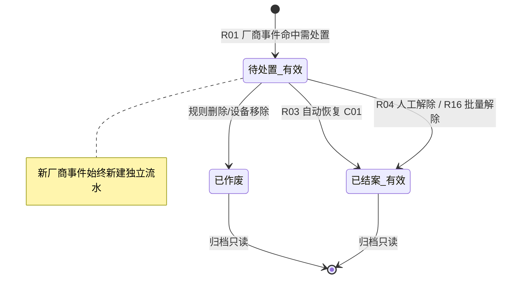
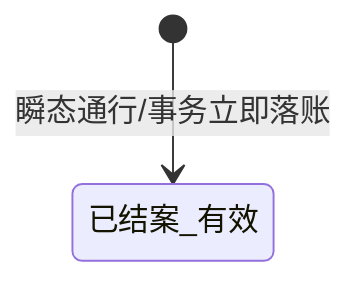
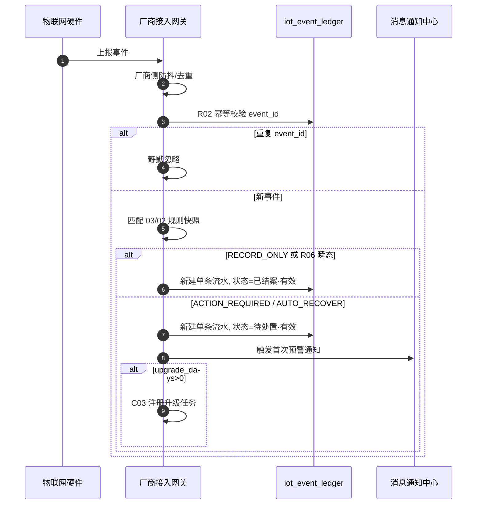

# 设备预警信息 业务规则规格

> **文档定位**：设备预警信息状态机、动作约束、校验规则、计算联动、权限与跨模块流程的**唯一定义来源**。主 PRD、字段清单、ASCII 线框只引用本文件规则 ID 与流程章节，不重复定义规则本体。
>
> **模块类型**：执行流水类（有处置状态机，无审批流）
>
> **参考文档**：[《设备预警信息主PRD》](./设备预警信息主PRD.md)、[《设备预警信息字段清单》](./设备预警信息字段清单.md)、[《00-全局契约与RBAC权限矩阵》](../../00-全局契约与RBAC权限矩阵.md)第四章 §1、[03/02设备预警配置业务规则规格](../../03-预警配置/02设备预警配置/设备预警配置业务规则规格.md)、[03/01 预警等级业务规则规格](../../03-预警配置/01预警等级/预警等级业务规则规格.md)
>
> **跨文档引用规范**：[B-迭代需求跨文档引用口径与来源索引](../../../README.md)。本文件定义流水状态、处置和跨域规则；依赖摘要不替代上述来源。
>
> **版本**：V3.4 | 2026-09-08
>
> **原型与 Demo 导航**：
> - **原型 DEV 路径**：PC端 [`/预警信息/设备预警信息`](http://localhost:5173/预警信息/设备预警信息) | 移动端 [`/m/iot/device-warning-events`](http://localhost:5173/m/iot/device-warning-events)（原型右下角可切换「标注模式」查看 DEV 说明）
> - **原型交互规范**：[设备预警信息_Demo_列表页](./设备预警信息_Demo_列表页.md) · [设备预警信息_Demo_详情页](./设备预警信息_Demo_详情页.md) · [设备预警信息_Demo_解除页](./设备预警信息_Demo_解除页.md) · [设备预警信息_Demo_移动端](./设备预警信息_Demo_移动端.md)
> - **ASCII 线框图**：[设备预警信息_ASCII_列表页](./设备预警信息_ASCII_列表页.md) · [设备预警信息_ASCII_详情页](./设备预警信息_ASCII_详情页.md) · [设备预警信息_ASCII_解除页](./设备预警信息_ASCII_解除页.md) · [设备预警信息_ASCII_移动端](./设备预警信息_ASCII_移动端.md)

---

## 一、能力定位

| 项目 | 内容 |
| :--- | :--- |
| **模块层级** | 执行流水层（非配置策略层） |
| **菜单路径** | `预警信息 → 设备预警信息` |
| **核心职责** | 承接厂商去重后的硬件事件与通行事务合流台账（`iot_event_ledger`）；逐条落账、通知/升级推送、现场核销（含批量）与订单穿透联动 |
| **数据来源** | 物联网接入网关（厂商侧已完成防抖/持续时长判定与去重）、设备主数据事件流 |
| **上游依赖** | **03/02 设备预警配置**提供规则快照，包括规则版本、阈值、通知策略和等级快照；**03/01 预警等级**仅提供 `sync_to_order_warn` 穿透开关和等级字典快照口径；**设备主数据与仓库档案**提供设备 ID、分类、空间归属和事件关联；**仓库数据权限**控制列表、详情、抓拍和处置范围。来源：REF-SEVERITY、REF-DEVICE、REF-WH、REF-RBAC。 |
| **下游影响** | **落账**：每条厂商事件独立写入 `iot_event_ledger`，保存事件 ID、设备和空间快照、采集值/阈值、预警时间、规则 `Version`、03/01 等级快照和通知/升级对象快照；**不**做同设备同子类型的频次累加、列表合并或 dedup 覆盖。**通知/升级**：按每条流水触发时规则快照发送首次通知和超时升级；流水处理或无效、规则删除/停用/失效时停止相应升级；发送失败进入补偿，不回滚流水。**订单穿透**：满足 R15 的等级同步开关和在押订单空间匹配时，向 [02/02 押品预警信息](../02押品预警信息/押品预警信息主PRD.md) 投递物联穿透记录，按设备事件 ID 幂等。**联动解除**：解除成功后按 C04 发布至少一次投递的 `DeviceEventReleased`。**规则变更（C03-N04）**：配置侧修改规则后，新到达事件按最新规则落账；已存在流水按触发时规则快照执行通知/升级与展示。来源：[设备预警信息主 PRD](./设备预警信息主PRD.md) 第 3.1 节、R01~R04、C01~C04。 |
| **审核流** | **无**——人工解除提交即生效，核心路径为「触发 → 待处置 · 有效 → 已结案 · 有效」 |
| **与配置侧边界** | 配置侧 `状态`=规则生命周期；本模块 `预警状态`=流水处置状态，语义不同（见字段清单 第四章） |
| **防抖边界** | **防抖/持续时长判定由物联网厂商接入层提供**；本模块不定义 Pending/Firing 内部态，不存储防抖留痕 |

---

## 二、状态定义

| 状态名称 | 枚举值 | 业务含义 | 是否终态 | 进入条件 | 离开条件 |
| :--- | :--- | :--- | :---: | :--- | :--- |
| 待处置 · 有效 | `OPEN_VALID` | 告警有效待处置；可人工/自动/批量解除；可触发升级 | 否 | R01 厂商事件命中且 disposition 需处置 | 自动恢复 C01；人工解除 R04/R16；置无效 |
| 已作废 | `OPEN_INVALID` | 关联规则删除/覆盖或设备移除，不可再处置 | **是** | 配置侧规则删除；设备被移除 | — |
| 已结案 · 有效 | `CLOSED_VALID` | 自动恢复或人工核销完成，归档只读 | **是** | R03 自动恢复；R04/R16 人工解除成功；R06 瞬态通行落账 | — |

**设计说明**：

- 执行流水类**不设**草稿态、待审核态；人工解除提交后一次性写入 `已结案 · 有效`。
- `已作废` 不可通过界面恢复为有效；须等待全新厂商事件新建独立流水。
- **常规通行与操作事务**类瞬态事件（R06）落账时直接进入 `已结案 · 有效`，列表可简写「已结案」。
- **每条厂商事件始终对应一条独立流水**；不存在待处置期间的多事件聚合或 Count 累加。

---

## 三、状态流转图



**瞬态事件旁路**（R06）：



---

## 四、状态流转表

> 前置条件须**全部**满足才允许触发动作；「后置影响」列出除状态变更以外的所有级联影响。

| 当前状态 | 动作 | 前置条件 | 结果状态 | 二次确认 | 后置影响 | 失败处理 |
| :--- | :--- | :--- | :--- | :--- | :--- | :--- |
| — | 厂商事件落账 | R01 命中规则；或 R06 瞬态事件 | 待处置 · 有效或已结案 · 有效* | 无 | ① 写入 `iot_event_ledger`（独立新行）；② 持续型发首次通知；③ C03 注册升级任务（upgrade_days>0） | — |
| 待处置 · 有效 | 自动恢复解除 | R03 采集值恢复并稳定 | 已结案 · 有效 | 无 | ① C01 更新处理人=系统自动处理；② C03 取消升级任务；③ C04 发布 DeviceEventReleased（有关联时） | — |
| 待处置 · 有效 | 人工解除 | R04/R11/**R14'** 校验通过；P04 处理权限 | 已结案 · 有效 | 「确认解除该条告警？」 | ① 保存情况说明/现场照片；② 联动解除抓拍；③ C03 取消升级；④ C04 发布 DeviceEventReleased | Toast：「解除失败，{原因}」 |
| 待处置 · 有效 | 批量人工解除 | R16；选中 ≥1 条 R14' 可解除记录 | 已结案 · 有效（逐条） | 「确认批量解除已选 {N} 条告警？」 | 同 R04 后置影响，逐条执行 | 部分失败：汇总成功/失败条数 |
| 待处置 · 有效 | 规则删除联动 | 配置侧软删除规则 | 已作废 | 系统自动 | ① C03 取消升级任务 | — |
| 已作废 | 人工解除 | — | — | — | **不允许** | 入口不展示 |
| 已结案 · 有效 | 人工解除 | — | — | — | **不允许** | 入口不展示 |

\* 初态由触发快照 **`disposition_mode`（03/02 R15b）** 与 **R06** 瞬态规则共同决定：`RECORD_ONLY` / R06 → **`已结案 · 有效`**；`ACTION_REQUIRED` / `AUTO_RECOVER` → **`待处置 · 有效`**。

---

## 五、动作能力矩阵

> ✅ = 允许；❌ = 不允许（不展示入口）；✅（条件）= 允许但有前置条件（见 第六章、第七章）

| 动作 | 待处置 · 有效 | 已作废 | 已结案 · 有效 |
| :--- | :---: | :---: | :---: |
| 查看列表/详情 | ✅ | ✅ | ✅ |
| 列表复选（批量解除） | ✅（R14' 条件） | ❌ | ❌ |
| 抓拍预览 | ✅ | ✅ | ✅ |
| 人工解除（单条） | ✅（条件） | ❌ | ❌ |
| 批量人工解除 | ✅（条件） | ❌ | ❌ |
| 自动恢复解除 | ✅（系统） | ❌ | ❌ |
| 导出 | ✅ | ✅ | ✅ |

**人工解除门控（R14'）**：须同时满足 ① 流水 `待处置 · 有效`；② 触发快照 `disposition_mode=ACTION_REQUIRED`；③ 非 R06 瞬态已结案类型。

**批量解除门控（R16）**：复选框仅对 R14' 可解除记录启用；表头全选仅选中当前页可选项。

**自动恢复门控**：须触发快照 `disposition_mode=AUTO_RECOVER` 且子类型 ∈ **03/02 R15c 白名单**，并满足 **R03** 恢复信号。

---

## 六、校验规则

### 6.1 事件落账规则

| 规则ID | 规则 | 校验时机 | 违反处理 |
| :--- | :--- | :--- | :--- |
| **R01** | **逐条独立落账**：物联网厂商接入层完成防抖/持续时长判定与去重后，每条到达事件独立写入 `iot_event_ledger`；本模块**不**对同设备同子类型做频次累加、不更新已有行的预警时间、不写入 timeline 明细、不做 dedup 覆盖 | 落账 | — |
| **R02** | **落账幂等**：同一厂商 `event_id` 重复投递不重复插入 | 落账 | 静默忽略重复 |

### 6.2 解除校验规则

| 规则ID | 规则 | 校验时机 | 违反处理 |
| :--- | :--- | :--- | :--- |
| **R03** | **自动恢复解除**：温湿度/气体传感器采集值恢复到合法范围内并**稳定 1 分钟**、烟感收到恢复事件、GPS 收到正常事件、离线设备重新上线时，系统自动将该记录更新为 `已结案 · 有效`，处理人=`系统自动处理` | 引擎判定 | — |
| **R04** | **人工核查解除**：在 **R14'** 门控通过前提下，支持有权限用户提交【情况说明】(必填, ≤200 字)与【现场照片】(选填)；提交时联动同位置监控即时抓拍 | 解除提交 | 阻断，提示字段约束 |
| **R11** | 人工解除时流水须为 `待处置 · 有效`；须携带 `Version` 乐观锁（R12） | 解除提交 | 阻断，提示状态/版本冲突 |
| **R12** | 提交解除须携带 `Version`，乐观锁校验 | 解除提交 | 阻断，提示「数据已被他人修改，请刷新重试」 |
| **R14'** | **解除入口门控**：仅 `disposition_mode=ACTION_REQUIRED` 且 `待处置 · 有效` 时展示单条/批量解除入口 | 前端渲染/解除提交 | 不展示入口 |
| **R16** | **批量人工解除**：① 选中项须全部为 R14' 可解除且 `待处置 · 有效`；② 统一情况说明必填 ≤200 字；③ 逐条携带各自 `Version` 提交；④ 单条失败不影响已成功项；⑤ 每条独立联动解除抓拍 | 批量提交 | 汇总 Toast：「成功 {M} 条，失败 {K} 条」 |

### 6.3 门禁通行事务合流规则（继承 6.1 基准）

| 规则ID | 规则 | 校验时机 | 违反处理 |
| :--- | :--- | :--- | :--- |
| **R05** | **事务大类映射**：原 15 种门禁事务归入预警类型 `常规通行与操作事务` 或 `智能挂锁预警` / `人脸门禁预警` | 落账 | — |
| **R06** | **瞬态通行立即落账**：正常开关锁、刷脸通行、获取密码成功等瞬态事件生成单条流水，状态直接置 **`已结案 · 有效`** | 落账 | — |
| **R07** | **人员追溯继承**：挂锁「开锁成功」沿用 6.1 动态追溯算法 | 展示 | — |
| **R08** | **抓拍联动继承**：开关锁及异常门禁事件触发同位置监控联动抓拍；图片访问走 R13 时效签名机制 | 落账/展示 | 抓拍失败展示「抓拍失败」 |
| **R09** | **双入口只读**：门禁设备「设备数据→事务记录」Tab 与「设备预警信息」列表共用 `iot_event_ledger` | 查询 | P02 仓库权限过滤 |
| **R10** | **历史迁移口径**：`t_door_access_log` 迁入新表时保留子类型名称与抓拍 Key | 迁移 | — |

### 6.4 图片与穿透校验

| 规则ID | 规则 | 校验时机 | 违反处理 |
| :--- | :--- | :--- | :--- |
| **R13** | **图片时效签名**：抓拍图片落库时注入防伪签名；前端须使用带过期时间的时效签名 URL 访问 | 预览 | 提示「图片链接已过期，请刷新」 |
| **R15** | **穿透生成前置**：向 02/02 投递穿透告警前，须校验触发等级快照 `sync_to_order_warn=true` 且仓库空间存在在押订单 | 穿透投递 | 跳过订单侧，仅本模块落账 |

---

## 七、计算与联动规则

| 规则ID | 规则 |
| :--- | :--- |
| **C01** | **自动恢复状态更新**：R03 条件满足时，原子更新流水状态=`已结案 · 有效`，写入处理时间，处理人=`系统自动处理` |
| **C02** | **独立事件模型**：每条厂商事件始终新建独立流水；已结案 · 有效归档只读；后续新事件新建新记录，**不**关联或覆盖历史行 |
| **C03** | **超时升级通知（EVT-N01~N05）**：<br>① **N01 触发**：流水处于 `待处置 · 有效` 且规则快照 `upgrade_days > 0` 时，以 **该条预警时间** 为起点，到达 N 个自然日且仍未解除，向「升级预警对象」推送；<br>② **N02**：每条流水升级计时独立，互不影响；<br>③ **N03 停止**：流水变为 `已结案 · 有效`/`已作废`，或关联规则被删除/停用/已失效时，立即取消待执行升级任务；<br>④ **N04 规则变更**：已存在流水按**触发时规则快照**执行；**新到达事件**按最新规则落账与通知；<br>⑤ **N05 失败隔离**：升级通知发送失败进入补偿队列，不回滚流水状态 |
| **C04** | **穿透联动与领域事件**：流水由 `待处置 · 有效` 变为 `已结案 · 有效`（人工/自动/批量）且存在关联穿透押品预警时，发布 `DeviceEventReleased`；穿透投递前置见 R15 |

---

## 八、权限规则

### 8.1 数据可见范围

| 规则ID | 规则 |
| :--- | :--- |
| **P01** | 租户隔离：仅可见本租户流水 |
| **P02** | 仓库数据权限：列表、详情、标签页 (Tab) 只读视图按用户管辖仓库过滤；解除时须校验流水所属仓库在操作人权限内 |
| **P03** | 无 IoT 菜单查看权限的用户不可见本模块入口 |
| **P04** | 人工/批量解除须具备 IoT **处理**权限（R-IOT-OPS / R-SYS-ADMIN） |
| **P05** | 抓拍预览须具备图片查看权限 |

### 8.2 操作权限矩阵

| 操作 | R-SYS-ADMIN | R-IOT-OPS | R-RISK-MGR | R-RISK-OFF | R-VIEWER |
| :--- | :---: | :---: | :---: | :---: | :---: |
| 查看列表/详情 | ✅ | ✅ | ✅ | ✅ | ✅ |
| 抓拍预览 | ✅ | ✅ | ✅ | ✅ | ✅ |
| 人工解除（单条/批量） | ✅ | ✅ | ❌ | ❌ | ❌ |
| 导出 | ✅ | ✅ | ✅ | ✅ | ✅ |

---

## 九、边界与异常处理

### 9.1 并发控制

| 场景 | 处理方式 |
| :--- | :--- |
| 两人同时解除同一流水 | R12 乐观锁，后提交者提示刷新 |
| 解除与自动恢复并发 | 以数据库乐观锁为准，先成功者生效 |
| 批量解除部分 Version 冲突 | 冲突项失败并列出；其余成功项正常结案 |

### 9.2 幂等操作约束

| 操作 | 幂等规则 |
| :--- | :--- |
| 事件落账 | 同一厂商 event_id 幂等，不重复插入（R02） |
| 人工解除 | 同一流水重复解除返回「该预警已结案 · 有效」 |
| DeviceEventReleased | 以 event_id + processed_time 为幂等键 |
| 升级通知 | 同一流水同一升级档位仅发送一次 |

### 9.3 上下游不一致

| 场景 | 处理方式 |
| :--- | :--- |
| 联动解除抓拍失败 | 解除仍成功，解除抓拍字段展示「抓拍失败」 |
| 升级通知连续失败 | EVT-N05 入补偿队列，超 3 次运维告警 |
| 规则已删除，流水仍显示待处置 · 有效 | 配置侧规则删除联动置 `已作废`，升级 C03-N03 终止 |
| 图片签名过期 | R13 前端重新换取时效 URL |

---

## 十、规则索引

| 规则类型 | 代码范围 | 说明 |
| :--- | :--- | :--- |
| 校验规则 | R01 – R16 | 落账、解除（含批量）、门禁合流、图片、穿透前置 |
| 计算联动规则 | C01 – C04 | 自动恢复、独立事件、升级、穿透事件 |
| 权限规则 | P01 – P05 | 租户、仓库、菜单、解除、图片 |
| 升级子规则 | EVT-N01 – N05 | 归入 C03 |

### 历史规则映射（V3.4 废弃项）

| 原编号 | V3.4 处置 | 说明 |
| :--- | :--- | :--- |
| 原 C01 频次聚合 | **已移除** | 改为 R01 逐条独立落账 |
| 原 C02 timeline | **已移除** | 不再维护 `event_trigger_timeline` |
| 原 R01/R02 防抖 Pending/Firing | **已移除** | 改由厂商接入层提供 |
| 原 C03~C06 | **重编号** | 现为 C01~C04 |
| EVT-R03/EVT-R04 | **已移除** | 原频次聚合/时间轴 |

### EVT-Rxx → R/C/P 映射表（现行）

| 原编号 | 新编号 | 说明 |
| :--- | :--- | :--- |
| EVT-R01/R02（防抖） | — | 厂商侧，本模块不再定义 |
| EVT-R03（频次聚合） | — | V3.4 已移除 |
| EVT-R04（timeline） | — | V3.4 已移除 |
| EVT-R05 | **R03** + **C01** | 自动恢复 |
| EVT-R06 | **R04** | 人工解除表单 |
| EVT-R07（轮次起算） | **C02** | 独立事件模型 |
| EVT-R08~R13 | **R05~R10** | 门禁合流 |
| EVT-N01~N05 | **C03** | 超时升级 |
| EVT-R14 | **C04** | DeviceEventReleased |
| EVT-R15 | **R15** + **C04** | 穿透前置 |

---

## 附录 A：预警子类型与合流枚举

> **权威来源**：配置侧 5 大类子类型见 [03/02 附录 A](../../03-预警配置/02设备预警配置/设备预警配置业务规则规格.md#附录-a预警子类型权威枚举)；本附录补充信息侧第 6 大类 `常规通行与操作事务` 及 6.1 门禁 15 种事务名称。

### A.1 预警类型（6 大类）

| 预警类型 | 来源 | 默认等级 | 处置路径 |
| :--- | :--- | :--- | :--- |
| 设备图像识别预警 | 配置规则命中 | 按规则快照 | 持续型：待处置 · 有效→人工/自动 |
| 设备物联预警 | 配置规则命中 | 按规则快照 | 数值异常：自动恢复；离线：人工/自动 |
| 智能挂锁预警 | 配置/事务合流 | L2~L5 | 破坏类：人工；正常开关锁：R06 瞬态已结案 |
| 人脸门禁预警 | 配置/事务合流 | L2~L5 | 异常类：待处置 · 有效；正常通行：R06 瞬态已结案 |
| 设备GPS预警 | 配置规则命中 | 按规则快照 | 围栏/超速：自动恢复；离线：人工/自动 |
| **常规通行与操作事务** | 6.1 门禁合流 | L1 默认 | **R06 瞬态已结案** |

### A.2 常规通行与操作事务 — 6.1 门禁 15 种事务名称（R05）

（同 V3.0 附录，略 — 枚举未变更）

---

## 业务流程与联动

### 1. 事件接入与逐条落账时序



### 2. 人工/批量解除时序

```mermaid
sequenceDiagram
    autonumber
    actor Officer as 现场监管员
    participant FE as 事件列表
    participant API as 服务端
    participant DB as iot_event_ledger

    alt 单条解除
        Officer->>FE: 点击【解除预警】
    else 批量解除 R16
        Officer->>FE: 勾选多条 →【批量解除】
    end
    FE->>FE: R04 录入情况说明
    Officer->>FE: 提交
    loop 逐条选中流水
        FE->>API: event_id, 说明, Version
        API->>DB: 乐观锁更新=已结案·有效
        API->>API: C03 取消升级; C04 发布事件
    end
    API-->>FE: 返回成功/失败汇总
```

### 3. 超时升级通知时序

（同 V3.0，起算点改为**该条预警时间**）

---

## 设计自检清单

- [x] 是否存在永远到不了的状态？——三态均可达
- [x] 非终态是否都有离开路径？——待处置 · 有效可自动/人工/批量解除或置无效
- [x] 防抖是否已移出本模块？——是，厂商接入层
- [x] 频次聚合/timeline 是否已移除？——是，V3.4
- [x] 批量解除是否纳入动作矩阵？——是，R16/第五章
- [x] 规则变更快照隔离（C03-N04）？——是
- [x] 6 大类含「常规通行与操作事务」？——附录 A.1

---

## 修订记录

| 日期 | 版本 | 变更摘要 |
| :--- | :---: | :--- |
| 2026-08-19 | V2.0 | 初版业务规则 |
| 2026-08-20 | **V3.0** | **6.2 标杆重构** |
| 2026-09-01 | V3.1 | C05 升级通知口径调整 |
| 2026-09-08 | V3.2 | 展示词表对齐 |
| 2026-09-08 | V3.3 | **R14→R14'** 解除门控 |
| 2026-09-08 | **V3.4** | **会议决策**：移除 C01/C02 频次聚合与 timeline、R01/R02 防抖；R01 改为逐条落账；新增 R16 批量解除；C01~C04 重编号；C03-N04 规则变更快照隔离 |
