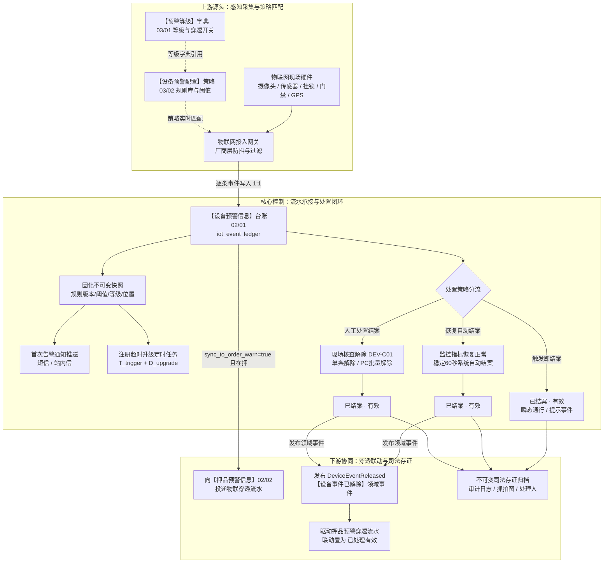
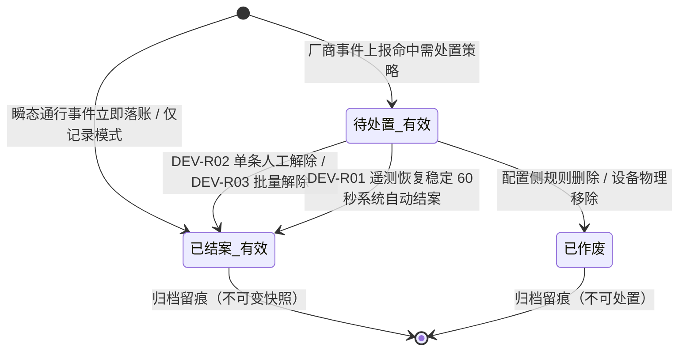

# 设备预警信息主PRD

> **版本**：V4.0 | 2026-09-18  
> **读者**：研发工程师、测试工程师、物联网风控产品经理、现场监管员、架构师  
> **所属模块**：02-预警信息 / 01-设备预警信息 | **菜单路径**：`预警信息 → 设备预警信息`  
> **模板选型**：台账流水类（[5-2-2 台账流水类 PRD 模板](../../../../05-常用模板/需求处理/5-2-2%20(输出)台账流水类PRD模板.md)）  
>
> **文档体系（三件套为唯一核心真源）**：
>
> | 层级 | 文档 | 职责 |
> | :--- | :--- | :--- |
> | **核心** | 本文（主 PRD） | 业务背景、功能范围对比、模块定位与系统链路、**页面功能说明**、业务场景四列故事、状态机摘要、规则摘要、验收标准 |
> | **核心** | [设备预警信息字段清单](./设备预警信息字段清单.md) | 11 列标准字段字典、筛选/列表/详情/解除表单、展示顺序与控件规格 |
> | **核心** | [设备预警信息业务规则规格](./设备预警信息业务规则规格.md) | 状态机本体、LaTeX 计算口径、7 列动作矩阵、R/C/P 规则本体、异常边界与时序推演 |
> | *衍生* | ASCII 线框 / Demo 文档 | 由三件套派生的可视化与原型输入，**非独立真源** |
>
> **跨模块引用标准**：
> - 策略规则快照源头：【设备预警配置】策略（菜单：`预警配置 → 设备预警配置`，代号 03/02）
> - 字典与穿透配置源头：【预警等级】字典（菜单：`预警配置 → 预警等级`，代号 03/01）
> - 订单侧穿透承接台账：【押品预警信息】台账（菜单：`预警信息 → 押品预警信息`，代号 02/02）
> - 全局权限矩阵依据：[00-全局契约与RBAC权限矩阵](../../00-全局契约与RBAC权限矩阵.md) 第四章 §1

---

## 1. 业务背景与业务痛点

### 1.1 业务背景与台账定位
在现代供应链金融存货质押监管业务中，仓储现场布设的视频监控、物联网传感器、电子挂锁、人脸门禁及车载 GPS 等硬件设备，是掌握底层质押货品物理完整性与现场安全的第一道防线。  
**设备预警信息**是仓储监管现场全部物理硬件异常告警事件的**统一承接与处置中枢台账**（`iot_event_ledger`）。本模块承接经物联网网关接入层完成防抖与预过滤后的硬件事件，全面覆盖 5 大类设备预警。系统严格推行**一事件一条流水（1:1 逐条落账）**、**规则快照不可变固化**、**双轨解除（自动恢复与人工核查，含 PC 批量解除）**、**超时升级阶梯推送**以及**订单侧穿透闭环**，为监管方、资金方提供司法存证级别的风控流水。

### 1.2 核心业务痛点
* **痛点 1：告警频繁与频次覆盖导致证据链断裂**：以往系统采用频次累加与去重覆盖模式，后续告警覆盖历史时间与快照，导致司法追溯时无法完整还原每一次物理违规瞬间；
* **痛点 2：物理告警与金融资产风控脱节**：现场设备断电、移位或越界，无法实时穿透至货权层级，资金方无法在第一时间获知在押货品处于失控风险中；
* **痛点 3：现场核销处置繁琐且缺乏防呆控制**：告警处置缺乏标准化闭环通道，核查材料缺乏防篡改与并发乐观锁控制，批量告警缺乏高效核销能力；
* **痛点 4：策略配置变更污染历史未结案流水**：运维人员修改报警阈值或等级后，历史正在跟进的流水被反向回写，破坏监管审计的严谨性。

---

## 2. 功能范围 (In / Out of Scope)

| 包含功能范围 (In Scope) | 不包含功能范围 (Out of Scope) |
| :--- | :--- |
| - **设备告警流水全景呈现**：承接 5 大类硬件设备预警流水，支持按等级、类型、状态、仓库、时间多维复合检索； - **逐条独立落账与不可变快照**：厂商事件逐条落账（无频次累加与合并覆盖），固化触发时刻规则版本、阈值及 03/01 等级快照； - **双轨闭环解除机制**：支持单条人工核查解除、恢复自动结案；PC 端支持符合 DEV-C01 门控的记录进行**批量解除**； - **现场监控抓拍联动**：告警触发即时关联现场摄像头抓拍；人工核销时联动解除抓拍； - **超时升级推送引擎**：待处置有效流水按预警时间与规则快照天数阶梯推送升级通知； - **跨域物联穿透协同**：命中 `sync_to_order_warn=true` 时自动向 02/02 押品预警投递穿透告警，现场解除后发布领域事件联动结案； - **全端协同体验**：PC 端提供全功能工作台与批量处置；H5 移动端支持查询、详情与单条现场核查解除。 | - **设备告警规则配置**：规则的新增、编辑与阈值策略维护归属【设备预警配置】（菜单：`预警配置 → 设备预警配置`，代号 03/02）； - **硬件接入防抖与持续时长计算**：防抖判定完全下沉至物联网厂商接入网关，本模块不设 Pending/Firing 状态； - **预警等级字典维护**：等级字典增删改与穿透开关维护归属【预警等级】字典（菜单：`预警配置 → 预警等级`，代号 03/01）； - **订单侧商业风险预警处置**：出库超时、跌价、质押率等商业告警处置归属【押品预警信息】（菜单：`预警信息 → 押品预警信息`，代号 02/02）； - **流水人工新增或物理删除**：执行流水台账严格禁止人工录入、修改关键事实或直接删除； - **移动端批量解除**：H5 移动端因交互空间与风控安全考量，不开放批量解除，仅支持现场单条核查。 |

---

## 3. 模块定位与系统链路

### 3.1 模块定位说明
【设备预警信息】台账（02/01）位于系统“物联感知与执行流水层”，是连接底层硬件世界与上层金融业务的关键枢纽。它向上承接【设备预警配置】（03/02）规则，向下驱动【押品预警信息】（02/02）金融风控，并与消息通知中心、现场监控服务保持实时联动。

### 3.2 系统端到端全景链路图

---

## 4. 业务场景与用户故事

| 场景编号与名称 | 触发角色 | 核心交互与风控约束 | 业务价值 |
| :--- | :--- | :--- | :--- |
| **场景 1【环境指标持续超标】(S01)** | 物联网监测网关 | 库房 CO₂ 浓度达 1800 ppm，超出安全区间 $[400, 1500]\text{ ppm}$。网关去重后投递，系统以 1:1 独立生成一条流水，状态为 `待处置 · 有效`，固化当时区间快照并推送首条预警通知。 | 真实记录物理环境异常，完整保留现场越限事实与判定依据。 |
| **场景 2【连续频发独立落账】(S02)** | 物联网监测网关 | 30 分钟内同传感器连续上报 3 次超标事件。系统生成 3 条独立编号流水，不进行频次合并覆盖，每条流水作为独立升级计时起点。 | 杜绝告警覆盖导致的时间篡改风险，满足金融穿透监管对完整证据链的要求。 |
| **场景 3【现场排查单条核销】(S03)** | 现场监管员 (`R-IOT-OPS`) | 现场排查通风管道故障并恢复，监管员在列表点击【解除预警】，弹窗强制录入 1~200 字情况说明，上传现场照片，系统联动摄像头抓拍，校验 Version 乐观锁后变更为 `已结案 · 有效`。 | 规范现场处置责任，图文并茂全路径审计留痕，防止随意口头销案。 |
| **场景 4【批量告警快速核销】(S04)** | 现场监管员 (`R-IOT-OPS`) | 强对流天气导致库区多台温湿度传感器告警，现场统一恢复后，监管员在 PC 端复选勾选多条记录，点击【批量解除】，录入一次情况说明并批量提交，逐条并发校验结案。 | 极大提升大规模设备突发异常时的现场处置效率，兼顾操作便捷与独立存证。 |
| **场景 5【指标正常自动恢复】(S05)** | 系统自动任务 | 温度越限告警处于 `待处置 · 有效`，若配置为“恢复自动结案”且子类型在白名单内，采集值回落安全区间并稳定 60 秒后，系统自动结案，处理人写入“系统自动处理”。 | 减少常规偶发波动的人工介入成本，实现物理自愈与自动化流转。 |
| **场景 6【瞬态通行即时结案】(S06)** | 智能挂锁 / 人脸门禁 | 合法开锁或员工正常刷脸通行。事件投递后系统匹配瞬态规则，立即生成一条流水并直接置为 `已结案 · 有效`，仅作留痕备查。 | 统一通行与风险管理底座，完整沉淀库房出入安全全息流水。 |
| **场景 7【超时未处自动升级】(S07)** | 定时调度引擎 | 告警处于 `待处置 · 有效` 超过规则配置的升级天数 $D_{\text{upgrade}}$，调度引擎自动抓取未结案流水，向高阶风控责任人发送短信升级预警。 | 建立多级风控防线，防止现场违规被隐瞒或处置延误导致重大损失。 |
| **场景 8【跨域穿透闭环联动】(S08)** | 跨域协同引擎 | 仓内电子锁被非法破坏，预警等级为 L4 且开启穿透，系统在押品预警台账生成穿透记录。现场监管员核销解除后，发布领域事件联动结案押品告警。 | 实现“货-仓-金”全链路穿透互锁，确保物理安全与资金风险实时步调一致。 |

---

## 5. 状态机与动作能力矩阵

### 5.1 状态定义
流水生命周期严格采用三态词表，不设草稿态与审批流：

| 状态名称 | 状态编码 | 业务含义 | 是否终态 | 进入条件 | 退出条件 |
| :--- | :--- | :--- | :---: | :--- | :--- |
| **待处置 · 有效** | `PENDING_VALID` | 告警有效待处置；可人工核查解除、可自动恢复、可触发超时升级 | 否 | 厂商事件命中且处置策略为需处置（人工或自动） | 人工核销成功；自动恢复成功；关联规则删除置作废 |
| **已结案 · 有效** | `RESOLVED_VALID` | 告警已通过人工核销或系统自动恢复处理完毕，归档只读 | **是** | 人工单条/批量解除成功；自动恢复结案成功；瞬态通行落账 | —（不可逆终态） |
| **已作废** | `OPEN_INVALID` | 关联预警规则被软删除或设备被物理移除，告警失去处置依据 | **是** | 配置侧规则删除；设备从系统解绑移除 | —（不可逆终态） |

### 5.2 状态流转图

### 5.3 动作在各状态下的可用性矩阵

| 动作名称 | 待处置 · 有效 (`PENDING_VALID`) | 已结案 · 有效 (`RESOLVED_VALID`) | 已作废 (`OPEN_INVALID`) |
| :--- | :---: | :---: | :---: |
| **查看列表与详情** | **✅** | **✅** | **✅** |
| **抓拍图片放大预览** | **✅** | **✅** | **✅** |
| **单条人工解除** | **✅（满足 DEV-C01 门控）** | ❌ (入口不展示) | ❌ (入口不展示) |
| **列表勾选与批量解除** | **✅（满足 DEV-C01 门控）** | ❌ (复选框置灰禁用) | ❌ (复选框置灰禁用) |
| **系统自动恢复结案** | **✅（满足 DEV-R01 条件）** | ❌ | ❌ |
| **超时升级通知触发** | **✅（未结案且超期）** | ❌ (自动取消调度) | ❌ (自动取消调度) |

---

## 6. 页面交互规格索引

### 6.1 PC 端列表页
* **页面路由**：`/物联网IOT与预警/预警信息/设备预警信息`
* **筛选区布局**：
  - 第一行常驻：预警类型（大类+子类型两栏树形级联多选）、预警等级（单选下拉，读取 03/01 租户启用等级）、预警状态（多选下拉）；
  - 第二行展开：所属仓库（单选下拉，数据权限隔离）、预警时间（日期时间范围选择器）；
* **批量操作工具条**：
  - 常驻列表表头上方，展示【批量解除】按钮与当前选中项计数；
  - 仅当勾选 $\ge 1$ 条处于 `待处置 · 有效` 且 `处置策略模式=人工处置结案（ACTION_REQUIRED）`（DEV-C01）的记录时按钮激活；包含不可解除行时自动置灰；
* **数据表格核心列**：
  - 复选框、序号、规则名称、预警等级、预警类型、预警内容（展示位置+设备+实际值/区间阈值）、预警抓拍图、预警时间、处理信息（处理人/处理时间两行合并）、预警状态、操作列；
* **行操作列门控**：
  - 待处置且满足 DEV-C01：展示【解除预警】与【详情】；
  - 待处置但为自动恢复/仅记录：仅展示【详情】；
  - 已结案或已作废：仅展示【详情】。

### 6.2 PC 端详情页
* **页面路由**：`/物联网IOT与预警/预警信息/设备预警信息/详情/:id`
* **顶栏与操作区**：展示规则名称大标题与预警状态标签；满足 DEV-C01 条件时右上角展示【解除预警】与【返回】按钮，否则仅展示【返回】；
* **四大只读分区**：
  1. **基本信息**：Event ID、规则名称、预警大类、预警子类型、预警等级、预警状态；
  2. **触发事实与位置**：所属仓库、库房/分区、设备名称与编码、预警内容、触发时刻现场抓拍图；
  3. **时间与处置记录**：预警触发时间、处理时间、处理责任人、核查情况说明、现场核查照片、解除时联动抓拍图；
  4. **规则策略快照**：固化触发时刻的处置策略模式、最低/最高阈值区间、单位、通知人与超时升级天数。

### 6.3 PC 端解除预警弹窗
* **单条解除弹窗**：
  - 点击【解除预警】弹出二次确认弹窗；
  - 录入项：情况说明（必填多行文本框，1~200 字）、现场照片（选填上传，$\le 10$ 张，单张 $\le 5MB$）；
  - 提交动作：系统下发同位置摄像头抓拍指令，携带 Version 乐观锁向后台原子提交；
* **批量解除弹窗**：
  - 勾选多条记录点击【批量解除】；
  - 弹窗展示选中流水摘要列表，录入一次统一的情况说明与可选照片；
  - 提交动作：后台逐条进行乐观锁与状态校验，部分失败时浮窗提示汇总成功/失败条数，不回滚已成功流水。

### 6.4 H5 移动端体验
* **页面路由**：`/m/iot/device-warning-events`
* **核心能力**：
  - 顶部快速胶囊筛选（状态、类型、仓库）+ 抽屉高级筛选（等级、时间）；
  - 卡片式瀑布流展示，卡片内置设备名、等级徽标、预警时间与处理状态；
  - 满足 DEV-C01 门控的卡片底部常驻【解除】按钮，点击打开移动端核查核销页面；
  - 移动端不提供批量选择与批量解除功能，保障移动操作风控严密性。

---

## 7. 核心业务规则索引与非功能需求

### 7.1 核心规则索引速查
* **DEV-T01 【逐条独立落账防抖与去重规则】**：每事件独立建行，杜绝覆盖与累加；
* **DEV-T02 【三方事件来源分布式幂等落账规则】**：同一 `event_id` 防重拦截；
* **DEV-C01 【人工核查解除准入门控规则】**：待处置有效且人工结案模式方可进入核销；
* **DEV-C03 【提交解除数据版本号并发控制锁规则】**：携带 Version 乐观锁并发保护；
* **DEV-C04 【情况说明必填字数超限阻断规则】**：1~200 字校验拦截；
* **DEV-R01 【传感器与离线指标自动恢复结案规则】**：采集值回归安全区间稳定 60 秒自动结案；
* **DEV-R02 【人工核查解除情况说明与现场抓拍规则】**：图文核销与监控抓拍留痕；
* **DEV-R03 【批量人工核查解除并发与强校验规则】**：逐条提交与部分失败容错机制；
* **DEV-R11 【设备事件解除发布领域事件联动规则】**：发布 `DeviceEventReleased` 驱动订单侧联动。

### 7.2 性能与安全审计
* **物理分页与大数据量防护**：默认每页展示 20 条，预警时间建立降序复合索引；
* **不可变司法证据链**：触发快照、处理留痕、现场照片及抓拍图调用私有 OSS 临时签名访问，严格禁止物理修改与覆盖；
* **行级数据权限隔离**：基于登录用户管辖的实体仓库范围进行列表与详情行级数据过滤（DEV-P02）。

---

## 8. 验收重点与预期结果

| 序号 | 验收测试项 | 前置输入条件 | 预期系统判定与控制动作 |
| :---: | :--- | :--- | :--- |
| **V01** | **逐条落账独立性验证** | 同一设备在 10 分钟内发生 3 次超温事件 | 生成 3 条独立编号流水，各自独立展示时间与阈值，不发生计数累加与合并 |
| **V02** | **人工解除门控准入验证** | 尝试解除自动恢复类或已结案流水 | 操作列不展示【解除预警】，直接调用接口被强阻断并返回 403 |
| **V03** | **批量解除强校验验证** | 列表中同时勾选 2 条待处置人工类与 1 条已结案记录 | 表头批量解除按钮自动禁用，或过滤仅选中有效待处置项 |
| **V04** | **并发乐观锁冲突拦截** | 两人同时打开同一流水解除弹窗并先后提交 | 第一人提交成功；第二人提交时被乐观锁拦截，提示「数据已被他人修改，请刷新重试」 |
| **V05** | **自动恢复结案流转验证** | 温度超标流水待处置中，传感器上报温度回落正常且持续 60 秒 | 状态自动流转为 `已结案 · 有效`，处理人显示“系统自动处理”，取消超时升级任务 |
| **V06** | **跨域穿透与联动解除** | 解除一条关联在押订单且穿透为真的设备预警 | 解除成功后发布领域事件，02/02 对应押品预警自动更新为已处理有效 |
| **V07** | **规则编辑变更快照隔离** | 配置侧修改告警阈值后，设备再次触发新告警 | 历史未结案流水保留原快照；新流水按最新阈值区间与规则版本落账 |

---

## 9. 修订记录

| 日期 | 版本 | 修订人 | 修订内容说明 |
| :--- | :---: | :--- | :--- |
| 2026-08-20 | V3.0 | 森云科技 PM 团队 | 初版 6.2 需求文档规划与三件套结构确立 |
| 2026-09-08 | V3.4 | 森云科技 PM 团队 | 架构重大升级：移除平台侧防抖与频次累加，全面确立逐条落账与批量解除规范 |
| 2026-09-11 | V3.9 | 森云科技 PM 团队 | 统一预警状态三态词表；落实衍生线框/原型与三件套解耦原则 |
| 2026-09-18 | **V4.0** | 森云科技 PM 团队 | **基准版重塑升级**：全面借鉴入库/出库记录标杆排版；完善系统链路三段图、四列业务故事、左右对称功能对比表与标准跨模块引用 |
