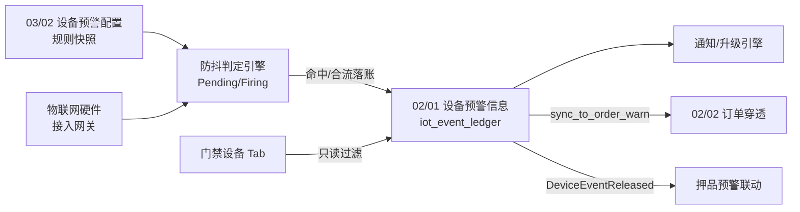
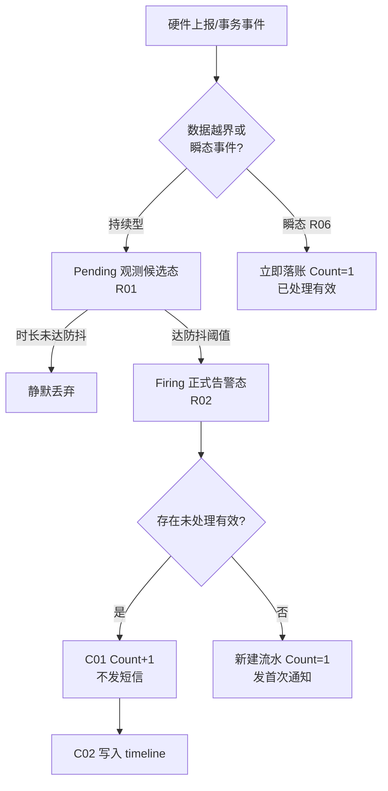
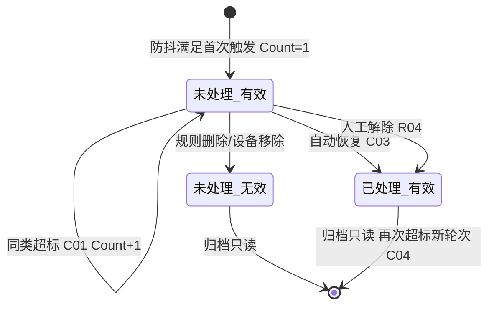

# 设备预警信息主PRD

> **版本**：V3.0 | 2026-08-20
> **读者**：研发工程师、测试工程师、物联网风控产品经理、现场监管员
> **规则来源**：状态机、校验、联动与权限详见《[设备预警信息业务规则规格](./设备预警信息业务规则规格.md)》——**规则 ID 以该文件为 唯一定义来源，本文仅摘要引用**
> **字段基准**：《[设备预警信息字段清单](./设备预警信息字段清单.md)》为字段唯一定义来源
> **菜单路径**：`预警信息 → 设备预警信息`
> **页面线框**：[列表页](./设备预警信息_ASCII_列表页.md) · [详情页](./设备预警信息_ASCII_详情页.md) · [解除页](./设备预警信息_ASCII_解除页.md) · [移动端](./设备预警信息_ASCII_移动端.md)
> **权限基准**：[00-全局契约与RBAC权限矩阵](../../00-全局契约与RBAC权限矩阵.md) 第四章 §1
> **跨文档引用规范**：[B-迭代需求跨文档引用口径与来源索引](../../../README.md)，本模块引用 REF-SEVERITY、REF-DEVICE、REF-WH、REF-RBAC、REF-NOTIFY。
>
> **原型与 Demo 导航**：
> - **原型 DEV 路径**：PC端 [`/预警信息/设备预警信息`](http://localhost:5173/预警信息/设备预警信息) | 移动端 [`/m/iot/device-warning-events`](http://localhost:5173/m/iot/device-warning-events)（原型右下角可切换「标注模式」查看 DEV 说明）
> - **原型交互规范**：[设备预警信息_Demo_列表页](./设备预警信息_Demo_列表页.md) · [设备预警信息_Demo_详情页](./设备预警信息_Demo_详情页.md) · [设备预警信息_Demo_解除页](./设备预警信息_Demo_解除页.md) · [设备预警信息_Demo_移动端](./设备预警信息_Demo_移动端.md)
> - **ASCII 线框图**：[设备预警信息_ASCII_列表页](./设备预警信息_ASCII_列表页.md) · [设备预警信息_ASCII_详情页](./设备预警信息_ASCII_详情页.md) · [设备预警信息_ASCII_解除页](./设备预警信息_ASCII_解除页.md) · [设备预警信息_ASCII_移动端](./设备预警信息_ASCII_移动端.md)

---

### 1. 业务背景

**设备预警信息**是仓储监管现场所有物理硬件资产动态运行流水、通行事务台账与异常告警事件的**统一承接与处置中枢**。

本模块彻底合并了原系统分散的「[门禁事务记录（刷卡开门）](../../../../🌟🌟🌟-最新基准版/B端PC/02-仓储/20-设备管理-门禁事务记录/门禁事务主PRD.md)」、「设备事务通知信息（开关锁/上线）」与「设备预警信息（越界/离线/破坏）」，实现**全域设备流水合一**。6.2 取消历史旧菜单【设备管理→门禁事务记录】；门禁设备「设备数据→事务记录」Tab 仍保留，数据源指向本模块 `iot_event_ledger` 台账。

没有统一的设备预警信息承接层：

- 告警、通行事务、运维通知分散在多菜单，现场无法一站式核查
- 传感器毛刺与持续超标混用同一展示策略，导致告警刷屏或漏报
- 解除核销、频次聚合、超时升级与订单穿透缺乏闭环，金融证据链断裂
- 配置侧规则变更与流水快照脱节，无法追溯「当时按什么规则触发」

本模块通过**读取 03/01 当前启用等级的筛选**、**持续时长防抖过滤（Pending/Firing）**、**预警次数聚合（Trigger Count）**、**双轨解除（自动/人工）**与**超时升级通知**，在彻底杜绝告警刷屏的同时，提供现场核销与金融证据链完整闭环；命中策略来自 [03/02 设备预警配置](../../03-预警配置/02设备预警配置/设备预警配置主PRD.md) 规则快照。

---

### 2. 功能范围

**包含范围 (In Scope)**：

- 全量事件流水合流呈现（6 大类预警类型，含 `常规通行与操作事务`）
- 列表组合筛选（预警类型/等级/状态/仓库/触发频次）、分页
- 预警频次与时间轴聚合（Trigger Count + timeline 明细）
- 持续时长防抖判定（Pending 观测候选态 → Firing 正式告警态）
- 现场抓拍预览（时效签名 URL）
- 人工解除预警（情况说明、现场照片、联动解除抓拍）
- 自动恢复解除（温湿度/GPS/离线/烟感恢复）
- 超时升级通知（EVT-N01~N05，起算=首次预警时间）
- 门禁通行事务合流（EVT-R08~R13 继承 6.1 基准）
- 穿透联动（DeviceEventReleased、sync_to_order_warn 条件投递）
- 门禁设备「设备数据→事务记录」Tab 只读（共用 `iot_event_ledger`）

**排除范围 (Out of Scope)**：

- 预警规则配置（阈值/防抖/通知对象）——归属 [03/02 设备预警配置](../../03-预警配置/02设备预警配置/设备预警配置主PRD.md)
- 预警等级字典维护——归属 [03/01 预警等级](../../03-预警配置/01预警等级/预警等级主PRD.md)
- 订单侧预警处置——归属 [02/02 押品预警信息](../02押品预警信息/押品预警信息主PRD.md)
- 批量导出流水模板——6.2 一期不支持
- 审批流（解除提交即生效，无待审核态）
- PC 端规则写操作——移动端仅列表/详情/解除

---

### 3. 模块定位

#### 3.1 在系统中的位置

| 项目 | 内容 |
| :--- | :--- |
| 模块层级 | **执行流水层**（非配置策略层、非业务订单层） |
| 核心职责 | 承接硬件事件与通行事务，执行防抖判定、频次聚合、通知推送、现场核销与穿透联动 |
| 数据来源 | 物联网接入网关、防抖判定引擎、门禁/挂锁/监控/GPS 设备上报 |
| 上游依赖 | **03/02 设备预警配置**：读取命中规则快照中的阈值、防抖、通知对象、规则版本和等级快照；**03/01 预警等级**：读取 `sync_to_order_warn` 穿透开关，不回写历史快照；**设备主数据**：提供设备 ID、分类、绑定位置和事件来源；**仓库档案**：提供仓库/库房/分区归属；**RBAC 与仓库数据权限**：列表、详情、抓拍和解除操作按租户、菜单、仓库权限及跨域复合校验过滤。来源：REF-SEVERITY、REF-DEVICE、REF-WH、REF-RBAC、REF-NOTIFY。 |
| 下游影响 | **正式命中**：写入 `iot_event_ledger` 设备预警流水，包含事件 ID、设备/仓库/库房/分区快照、预警类型与子类型、首次/最近预警时间、预警次数、采集值与阈值、规则 `Version`、防抖参数、03/01 等级快照及通知/升级快照；未处理期间重复事件按设备+子类型聚合并更新次数和时间，不重复发送首次短信。**通知与升级**：首次命中按规则快照通知，升级按 `upgrade_days` 和首次预警时间执行，流水已处理/无效或规则删除时取消待执行升级；发送失败进入补偿队列，不回滚流水。**订单穿透**：等级 `sync_to_order_warn=true` 且匹配在押订单时，向 02/02 投递 `IOT_PENETRATION`，以设备事件 ID 幂等；无匹配订单只保留设备流水。**解除联动**：设备流水解除后发布至少一次投递的 `DeviceEventReleased`（含租户、设备事件、订单、处理人和时间），供 02/02 按事件 ID 幂等联动解除；消费失败由补偿重放。来源：[设备预警信息业务规则规格](./设备预警信息业务规则规格.md) R01~R04、C01~C06、[跨文档引用口径与来源索引](../../../README.md) REF-SEVERITY/REF-NOTIFY。 |
| 实体关系 | 一条规则可产生多条预警流水（1:N）；同一设备+子类型未处理期间仅 1 条有效聚合记录 |

#### 3.2 系统链路图

#### 3.3 实体关系说明

| 关系 | 说明 |
| :--- | :--- |
| 设备预警配置 : 设备预警信息 | **1:N**（一条规则可产生多条流水；删除规则置未处理流水无效，见配置侧 C01） |
| 设备 + 子类型 : 未处理流水 | **1:1**（未处理有效期间同类事件聚合至同一记录，C01） |
| 预警流水 : 触发时间轴 | **1:N**（`event_trigger_timeline` 明细，C02） |
| 预警流水 : 订单预警 | **N:M**（穿透条件触发，C06 / R15） |

#### 3.4 防抖与频次聚合模型

---

### 4. 功能清单

| 功能编号 | 功能名称 | 适用角色 | PC 端 | 移动端 | 关键控制（规则引用） |
| :--- | :--- | :--- | :--- | :--- | :--- |
| EVT-01 | 事件流水列表与筛选 | IoT 查看权限 | 类型/等级/状态/仓库/频次筛选 | 列表、筛选 | P02 仓库过滤 |
| EVT-02 | 查看详情与频次时间轴 | IoT 查看权限 | 详情页、Count 时间轴抽屉 | 详情 | C02；点击预警次数展开 |
| EVT-03 | 现场抓拍预览 | IoT 查看+图片权限 | 列表缩略图、大图 | 大图预览 | R13；P05 时效签名 |
| EVT-04 | 人工解除预警 | IoT 处理权限 | 情况说明、现场照片、解除抓拍 | 解除提交 | R04/R11/R14；第四章 流转表 |
| EVT-05 | 自动恢复解除 | 系统任务 | 温湿度/GPS/离线恢复自动结案 | — | R03；C03 |
| EVT-06 | 频次聚合展示 | 系统任务 | Count 累加、不重复短信 | — | C01 |
| EVT-07 | 超时升级通知 | 系统任务 | 按首次预警时间+N 天升级 | — | C05（EVT-N01~N05） |
| EVT-08 | 门禁事务 Tab 只读 | 设备查看权限 | 设备数据→事务记录 Tab | — | R09；`iot_event_ledger` |
| EVT-09 | 同步至订单预警 | 系统任务 | sync_to_order_warn=是 时投递 | — | R15；C06 |
| EVT-10 | 穿透联动事件发布 | 系统任务 | 解除后发布 DeviceEventReleased | — | C06；补偿重放 |

---

### 5. 业务场景

| 场景ID | 场景 | 类型 | 说明 |
| :--- | :--- | :--- | :--- |
| S01 | 持续超标首次触发 | **主流程** | 温湿度越界 → Pending 3 分钟 → Firing → 新建流水 Count=1 → 发首次短信 |
| S02 | 未处理期间频次累加 | **主流程** | 同设备同类型持续超标 → Count+1 → 更新最近时间与快照 → 不发短信 |
| S03 | 人工解除整轮归档 | **主流程** | 累计 N 次未处理 → 提交情况说明 → 联动抓拍 → 已处理有效 → 下轮从 1 起算 |
| S04 | 自动恢复解除 | **主流程** | 温湿度恢复稳定 1 分钟 → 系统自动已处理有效，处理人=系统自动处理 |
| S05 | 瞬态通行立即落账 | **主流程** | 刷脸通行/开锁成功 → 防抖=0 → Count=1 → 直接已处理有效 |
| S06 | 超时升级通知 | **支线** | 未处理有效 + upgrade_days>0 → 首次预警时间+N 天 → 向升级对象推送 |
| S07 | 规则删除置流水无效 | **支线** | 配置侧删除规则 → 关联未处理流水置未处理无效 → 升级终止 |
| S08 | 穿透联动解除 | **支线** | 人工/自动解除 → 存在关联押品预警 → 发布 DeviceEventReleased |

---

### 6. 状态机

> **完整定义**（状态枚举、流转表、动作矩阵）见《[设备预警信息业务规则规格](./设备预警信息业务规则规格.md)》第二至五章。以下为摘要。

#### 6.1 预警状态

| 状态 | 含义 | 是否终态 |
| :--- | :--- | :---: |
| 未处理（有效） | 告警有效待处置，可聚合 Count、可人工/自动解除 | 否 |
| 未处理（无效） | 关联规则删除/覆盖或设备移除，不可解除 | **是** |
| 已处理（有效） | 自动恢复或人工核销完成，归档只读 | **是** |

> **说明**：常规通行/事务类瞬态事件落账时直接为 `已处理（有效）`，列表可简写展示「已处理」。

#### 6.2 状态机图（摘要）

#### 6.3 动作能力矩阵（摘要）

| 动作 | 未处理（有效） | 未处理（无效） | 已处理（有效） |
| :--- | :---: | :---: | :---: |
| 查看列表/详情 | ✅ | ✅ | ✅ |
| 频次时间轴 | ✅ | ✅ | ✅ |
| 抓拍预览 | ✅ | ✅ | ✅ |
| 人工解除 | ✅（条件） | ❌ | ❌ |
| 自动解除 | ✅（系统） | ❌ | ❌ |

---

### 7. 核心业务规则

> 规则本体见业务规则规格；此处仅列高风险摘要。

#### 7.1 防抖判定

| 规则ID | 规则摘要 |
| :--- | :--- |
| R01 | 首次越界进入 Pending（观测候选态）；未达防抖时长恢复正常则静默丢弃 |
| R02 | 持续越界达防抖阈值转为 Firing，生成初始流水 Count=1 并发送首次通知 |

#### 7.2 解除与轮次

| 规则ID | 规则摘要 |
| :--- | :--- |
| R03 | 温湿度/烟感/GPS/离线恢复 → 系统自动已处理有效 |
| R04 | 人工解除：情况说明必填 ≤200 字，现场照片选填，联动解除抓拍 |
| R14 | 仅图像入侵、挂锁破坏、物联离线等允许人工解除的类型展示解除入口 |

#### 7.3 频次聚合与升级

| 规则ID | 规则摘要 |
| :--- | :--- |
| C01 | 未处理有效期间 Count+1，不重复发短信 |
| C04 | 已处理有效归档后，再次超标全新轮次 Count 从 1 起算 |
| C05 | 超时升级：以首次预警时间起算，Count 累加不重置计时（EVT-N01~N05） |

#### 7.4 门禁合流与穿透

| 规则ID | 规则摘要 |
| :--- | :--- |
| R05~R10 | 15 种门禁事务合流、瞬态落账、人员追溯、抓拍、双入口、历史迁移 |
| C06 | 解除后发布 DeviceEventReleased；穿透前校验 sync_to_order_warn（R15） |

---

### 8. 权限设计

#### 8.1 数据可见范围

| 角色 | 可见数据范围 | 说明 |
| :--- | :--- | :--- |
| R-SYS-ADMIN | 本租户全部流水 | 含处理权限 |
| R-IOT-OPS | 管辖仓库下设备关联流水 | 按 P02 仓库过滤 |
| R-RISK-MGR / R-RISK-OFF | 本租户流水（只读） | 无解除操作 |
| R-VIEWER | 本租户流水（只读） | 审计查看 |

#### 8.2 操作权限矩阵

| 操作 | R-SYS-ADMIN | R-IOT-OPS | R-RISK-MGR | R-RISK-OFF | R-VIEWER |
| :--- | :---: | :---: | :---: | :---: | :---: |
| 查看 | ✅ | ✅ | ✅ | ✅ | ✅ |
| 抓拍预览 | ✅ | ✅ | ✅ | ✅ | ✅ |
| 人工解除 | ✅ | ✅ | ❌ | ❌ | ❌ |
| 频次时间轴 | ✅ | ✅ | ✅ | ✅ | ✅ |

> 以 [00-全局契约与RBAC权限矩阵](../../00-全局契约与RBAC权限矩阵.md) 为准。

---

### 9. 边界与异常处理

#### 9.1 并发控制

| 场景 | 处理方式 |
| :--- | :--- |
| 两人同时解除同一流水 | R12 乐观锁 Version，后提交提示刷新 |
| 解除与自动恢复并发 | 以数据库乐观锁为准，先成功者生效 |

#### 9.2 幂等操作约束

| 操作 | 幂等规则 |
| :--- | :--- |
| 频次聚合 | 同一触发批次 event_id 幂等，不重复 Count+1 |
| 人工解除 | 同一流水重复解除返回「已处理」 |
| DeviceEventReleased | event_id + processed_time 幂等投递 |

#### 9.3 上下游不一致

| 场景 | 处理方式 |
| :--- | :--- |
| 联动抓拍失败 | 解除仍成功，抓拍字段展示「抓拍失败」 |
| 升级通知发送失败 | 入补偿队列，不回滚流水状态（EVT-N05） |
| 规则已删除，流水仍显示未处理 | 配置侧 C01 置未处理无效 |
| 图片签名过期 | 前端重新换取时效 URL（R13） |

---

### 10. 验收重点

> 验收标准写「输入条件 → 预期结果」格式；完整规则见业务规则规格。

| # | 验收项 | 输入条件 | 预期结果 |
| :--- | :--- | :--- | :--- |
| V01 | 防抖过滤 | 设备 A 5 秒瞬时温度超标后恢复，防抖=3 分钟 | Pending 未达阈值，不生成流水，不发短信 |
| V02 | 频次累加 | 设备 A 持续 30 分钟每 5 分钟超温 | 列表 1 条记录，预警次数=6，短信仅首次 |
| V03 | 人工解除归档 | 累计 12 次未处理，提交一次人工解除 | 整体变已处理有效，下次超标 Count 从 1 起 |
| V04 | 等级筛选 | 开锁 L2、超温 L4 | 筛选 L4 仅超温，L2 仅开锁 |
| V05 | 超时升级 | 规则升级 3 天，流水未处理 | 第 3 天推送升级；解除后停止；Count 不重置计时 |
| V06 | 自动恢复 | 温湿度恢复稳定 1 分钟 | 状态=已处理有效，处理人=系统自动处理 |
| V07 | 瞬态通行 | 刷脸通行成功 | Count=1，直接已处理有效，不发短信（默认） |
| V08 | 规则删除联动 | 配置侧删除含未处理流水的规则 | 流水置未处理无效，升级终止 |
| V09 | 门禁 Tab | 门禁设备→事务记录 Tab | 与全量列表共用 `iot_event_ledger`，按设备过滤 |
| V10 | 穿透发布 | 解除存在关联押品预警 | 发布 DeviceEventReleased，载荷含 event_id/order_id |
| V11 | 乐观锁冲突 | 两人同时解除 | 后者提示「数据已被他人修改，请刷新重试」 |
| V12 | 图片签名 | 点击抓拍预览 | 时效签名 URL 正常展示，过期可刷新 |

---

### 修订记录

| 日期 | 版本 | 变更摘要 |
| :--- | :---: | :--- |
| 2026-08-19 | V2.0 | 初版 6.2 合流信息 |
| 2026-08-20 | V2.1 | 合并功能清单；补三态状态机；EVT-N/R14/R15 |
| 2026-08-20 | **V3.0** | **6.2 标杆重构**：对齐业务单据 PRD 章节（1~10）；排除范围 (Out of Scope)；业务场景 S01~S08；权限/边界/验收 V01~V12；状态机与规则下沉至业务规则规格 唯一定义来源；拆分 ASCII 列表/详情页 |
