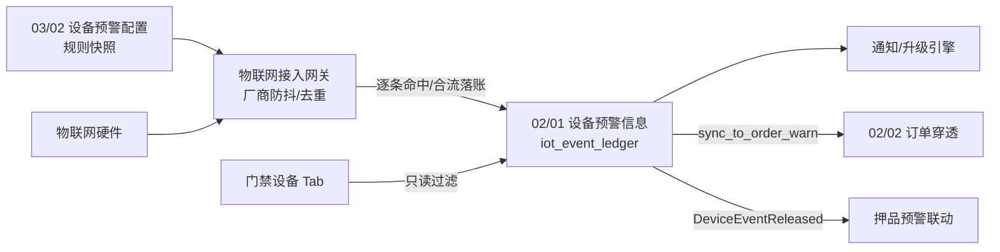
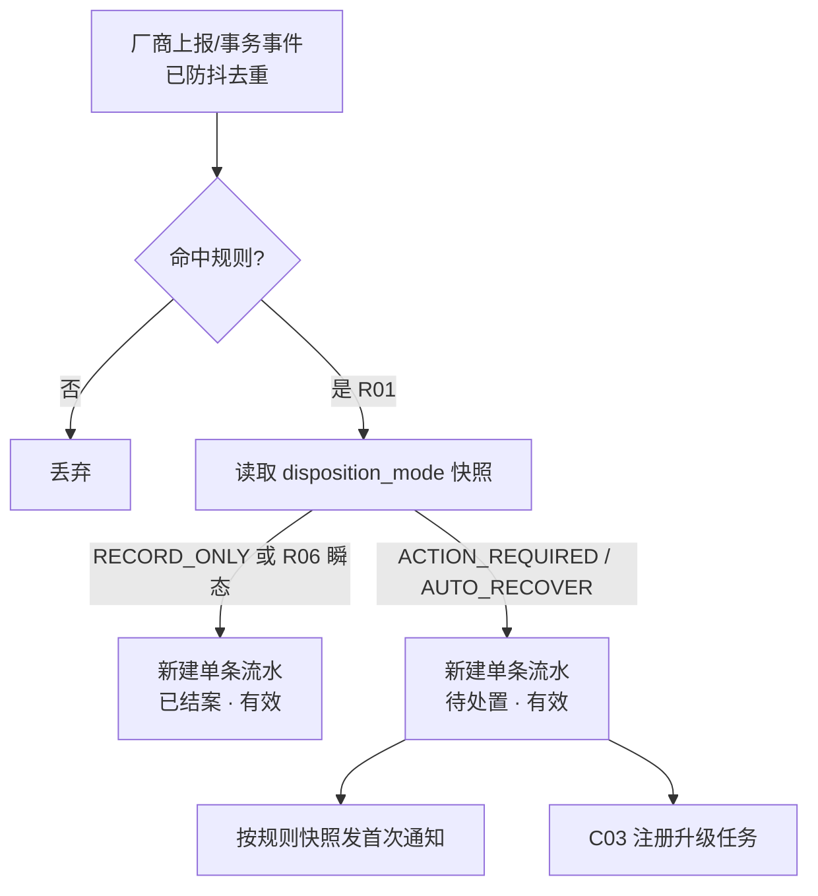
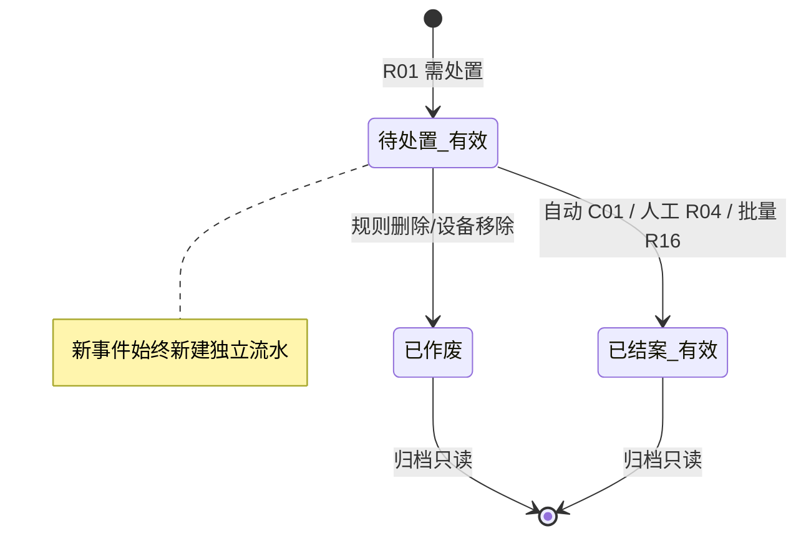

# 设备预警信息主PRD

> **版本**：V3.9 | 2026-09-11
> **读者**：研发工程师、测试工程师、物联网风控产品经理、现场监管员
> **所属模块**：02-预警信息 / 01-设备预警信息 | **菜单路径**：`预警信息 → 设备预警信息`
> **模板选型**：台账流水类（[5-2-2 台账流水类 PRD 模板](../../../../05-常用模板/需求处理/5-2-2%20(输出)台账流水类PRD模板.md)）
>
> **文档体系（三件套为核心）**：
>
> | 层级 | 文档 | 职责 |
> | :--- | :--- | :--- |
> | **核心** | 本文（主 PRD） | 业务背景、范围、架构、**页面功能说明**、场景、状态机摘要、规则摘要、验收 |
> | **核心** | [设备预警信息字段清单](./设备预警信息字段清单.md) | 字段定义、筛选/列表/详情/解除表单、展示顺序与控件规格 |
> | **核心** | [设备预警信息业务规则规格](./设备预警信息业务规则规格.md) | 状态机本体、R/C/P 规则、时序图、子类型附录、流转表 |
> | *衍生* | ASCII 线框 / Demo 文档 | 由三件套派生的可视化与原型输入，**非独立真源** |
>
> **规则来源**：状态机、校验、联动与权限详见《[设备预警信息业务规则规格](./设备预警信息业务规则规格.md)》——**规则 ID 以该文件为唯一定义来源，本文仅摘要引用**
> **字段基准**：《[设备预警信息字段清单](./设备预警信息字段清单.md)》为字段唯一定义来源
> **权限基准**：[00-全局契约与RBAC权限矩阵](../../00-全局契约与RBAC权限矩阵.md) 第四章 §1
> **跨文档引用规范**：[B-迭代需求跨文档引用口径与来源索引](../../../README.md)，本模块引用 REF-SEVERITY、REF-DEVICE、REF-WH、REF-RBAC、REF-NOTIFY。
>
> **衍生文档（可视化 / 原型）**：
> - **ASCII 线框**：[列表页](./设备预警信息_ASCII_列表页.md) · [详情页](./设备预警信息_ASCII_详情页.md) · [解除页](./设备预警信息_ASCII_解除页.md) · [移动端](./设备预警信息_ASCII_移动端.md)
> - **Demo 输入**：[列表页](./设备预警信息_Demo_列表页.md) · [详情页](./设备预警信息_Demo_详情页.md) · [解除页](./设备预警信息_Demo_解除页.md) · [移动端](./设备预警信息_Demo_移动端.md)
> - **原型 DEV**：PC [`/物联网IOT与预警/预警信息/设备预警信息`](http://localhost:5173/#/物联网IOT与预警/预警信息/设备预警信息) | H5 [`/m/iot/device-warning-events`](http://localhost:5173/#/m/iot/device-warning-events)

---

## 1. 业务背景与监控目的

### 1.1 台账定位

**设备预警信息**是仓储监管现场所有物理硬件资产动态运行流水、通行事务台账与异常告警事件的**统一承接与处置中枢**（`iot_event_ledger`）。

本模块彻底合并了原系统分散的「[门禁事务记录（刷卡开门）](../../../../🌟🌟🌟-最新基准版/B端PC/02-仓储/20-设备管理-门禁事务记录/门禁事务主PRD.md)」、「设备事务通知信息（开关锁/上线）」与「设备预警信息（越界/离线/破坏）」，实现**全域设备流水合一**。6.2 取消历史旧菜单【设备管理→门禁事务记录】；门禁设备「设备数据→事务记录」Tab 仍保留，数据源指向本模块台账。

本模块通过**读取 03/01 当前启用等级的筛选**、**厂商侧事件去重后逐条落账（一事件一条流水）**、**双轨解除（自动/人工，含批量人工解除）**与**超时升级通知**，提供现场核销与金融证据链完整闭环；命中策略来自 [03/02 设备预警配置](../../03-预警配置/02设备预警配置/设备预警配置主PRD.md) 规则快照。**防抖/持续时长判定由物联网厂商接入层完成**，本模块不再定义或展示防抖逻辑。

数值型物联事件（温度、湿度、二氧化碳、氧气）在列表和详情中同时展示实际采集值与触发时的最低/最高阈值；字段口径与示例见《[设备预警信息字段清单](./设备预警信息字段清单.md)》。

### 1.2 监控痛点与业务目标

- **穿透监管目标**：告警、通行事务、运维通知合流至单一台账，现场监管员可一站式核查，无需跨菜单跳转。
- **账实核验目标**：每条流水固化触发时刻规则快照（C03-N04），配置侧后续修改不回写历史记录，满足司法存证。
- **风险防范目标**：`sync_to_order_warn=true` 时向 [02/02 押品预警信息](../02押品预警信息/押品预警信息主PRD.md) 投递物联穿透；核销后发布 `DeviceEventReleased` 联动解除。
- **处置效率目标**：`ACTION_REQUIRED` 支持 PC 批量解除（R16）；`AUTO_RECOVER` 由 R03 自动结案。
- **V3.4 架构决策**：移除平台侧频次聚合与防抖 Pending/Firing；厂商去重后逐条独立落账。

---

## 2. 功能范围

**In Scope（本期范围）**：

- 全量事件流水合流呈现（6 大类预警类型，含 `常规通行与操作事务`）
- 列表组合筛选、分页；厂商事件逐条独立落账（**无**频次聚合、**无**列表 dedup 覆盖）
- PC 列表复选 + **批量解除**（R14'/R16）；单条/批量人工解除与自动恢复解除
- 现场抓拍预览、超时升级通知、门禁事务合流、订单穿透与联动解除
- 门禁设备「设备数据→事务记录」Tab 只读（共用 `iot_event_ledger`）
- PC/H5 列表、详情、单条解除

**Out of Scope（不在本期范围）**：

- 预警规则配置 → [03/02 设备预警配置](../../03-预警配置/02设备预警配置/设备预警配置主PRD.md)
- 防抖/持续时长判定 → 厂商接入层
- 预警等级字典 → [03/01 预警等级](../../03-预警配置/01预警等级/预警等级主PRD.md)
- 订单侧预警处置 → [02/02 押品预警信息](../02押品预警信息/押品预警信息主PRD.md)
- 列表批量导出、审批流、手动新增/编辑/删除流水
- H5 批量解除、规则写操作

---

## 3. 台账架构与数据源头

### 3.1 写入机制与生命周期

| 项目 | 机制说明 |
| :--- | :--- |
| **写入方式** | **事件驱动追加（Append-Only）**：厂商网关去重后的事件经规则命中自动写入；**严禁**人工新增流水 |
| **数据源头** | 03/02 规则快照 + 物联网接入网关 + 硬件/门禁/挂锁/GPS 上报 |
| **可变性** | 触发快照不可变；处置仅更新状态、处理人、处理时间及处置材料 |
| **保存粒度** | **一事件一条流水（1:1）**（R01） |
| **落账幂等** | 同一厂商 `event_id` 不重复插入（R02） |

### 3.2 数据流向架构图

### 3.3 实体关系说明

| 关系 | 说明 |
| :--- | :--- |
| 设备预警配置 : 设备预警信息 | **1:N** |
| 厂商事件 : 预警流水 | **1:1** |
| 预警流水 : 订单预警 | **N:M**（穿透，C04/R15） |

### 3.4 逐条落账模型

### 3.5 六类预警类型与处置路径

| 预警类型 | 数据来源 | 典型等级 | 初态与处置路径 |
| :--- | :--- | :--- | :--- |
| 设备图像识别预警 | 03/02 规则命中 | 按规则快照 | 入侵类 → 人工解除；离线 → 自动恢复 |
| 设备物联预警 | 03/02 规则命中 | 按规则快照 | 数值异常 → 自动恢复；离线 → 人工/自动 |
| 智能挂锁预警 | 03/02 + 事务合流 | L2~L5 | 破坏类 → 人工；正常开关锁 → R06 瞬态已结案 |
| 人脸门禁预警 | 03/02 + 事务合流 | L2~L5 | 异常 → 待处置；正常通行 → R06 瞬态已结案 |
| 设备GPS预警 | 03/02 规则命中 | 按规则快照 | 围栏/超速 → 自动恢复；非法拆除 → 人工 |
| **常规通行与操作事务** | 6.1 门禁合流（R05） | L1~L2 | **R06 瞬态已结案 · 有效** |

> 配置侧 5 大类子类型枚举、信息侧第 6 大类及 15 种门禁事务名称、子类型×处置策略矩阵见《[设备预警信息业务规则规格](./设备预警信息业务规则规格.md)》附录 A。

---

## 4. 页面功能说明

> 本节描述**做什么、怎么交互**；字段名/控件/列宽见《[字段清单](./设备预警信息字段清单.md)》；线框可视化见衍生 ASCII 文档。

### 4.1 PC 列表页

| 项目 | 说明 |
| :--- | :--- |
| 页面目标 | 查看设备侧预警流水，筛选后进入详情/解除；支持批量解除 |
| 页面路径 | `/物联网IOT与预警/预警信息/设备预警信息` |
| 骨架结构 | 页头标题 + 筛选区 + 批量工具条 + 数据表格 + 分页 |

**筛选区**：默认行预警类型（大类+子类型级联多选）、预警等级、预警状态；展开行所属仓库、预警时间。**无**触发频次/预警次数筛选（V3.4 移除）。筛选字段规格见字段清单「筛选区字段规范」。

**批量工具条**：展示「已选 N 条」+「批量解除」；未选中或含不可解除项时禁用（R16）。

**数据表格**：

- 首列复选框：仅 `待处置 · 有效` + `disposition_mode=ACTION_REQUIRED` 可选（R14'）
- 默认排序：预警时间 DESC
- 数值型「预警内容」展示实际值与触发时阈值区间（如 CO₂ `1800 ppm / 400~1500 ppm`）
- 状态 Tag：待处置 · 有效（橙）、已结案 · 有效（绿）、已作废（灰）

**行操作**：

| 流水状态 + 处置策略 | 操作列 |
| :--- | :--- |
| 待处置 · 有效 + R14' | 解除、详情 |
| 待处置 · 有效 + 仅自动恢复 | 详情 |
| 已结案 · 有效 / 已作废 | 详情 |

**其他**：无「新增」按钮；6.2 不提供列表导出。解除走弹窗（见 §4.3）。

### 4.2 PC 详情页

| 项目 | 说明 |
| :--- | :--- |
| 页面路径 | `/物联网IOT与预警/预警信息/设备预警信息/详情/:id` |
| 页头 | 规则名称 + 状态 Badge；R14' 时展示【解除预警】+【返回】，否则仅【返回】 |

**内容分区**（只读）：

| 分区 | 内容要点 |
| :--- | :--- |
| 基本信息 | Event ID、规则名称、预警类型/子类型、等级、状态 |
| 触发事实与位置 | 仓库、设备、预警内容、抓拍图 |
| 时间与处置 | 预警时间、处理时间/人、情况说明、现场照片、解除抓拍 |
| 规则快照 | 处置策略、监控阈值（最低/最高）、升级策略（**不含**防抖） |

> V3.4 移除：频次与时间分区、预警次数、最近预警时间、频次时间轴、「查看频次」按钮、防抖留痕。

### 4.3 PC 解除（弹窗为主流程）

| 模式 | 说明 |
| :--- | :--- |
| 单条解除 | 列表/详情触发 → ① 二次确认「确认解除该条告警？」→ ② 填写情况说明（必填 ≤200 字）、现场照片（选填）、联动解除抓拍 → 提交 |
| 批量解除（R16） | 勾选多条 R14' 记录 → 统一情况说明 + 可选照片 → 逐条携带 Version 提交；部分失败 Toast 汇总 |
| 完整页（备用） | `/物联网IOT与预警/预警信息/设备预警信息/解除/:id`；只读摘要 + 解除材料表单 |

解除入口门控与场景差异见业务规则规格 R14'、R04、R16 及解除页 ASCII。

### 4.4 H5 移动端

| 项目 | 说明 |
| :--- | :--- |
| 能力范围 | 列表、筛选、详情、抓拍预览、**单条**解除 |
| 不支持 | 规则配置、列表导出、频次时间轴、**批量解除** |
| 列表路径 | `/m/iot/device-warning-events` |
| 筛选 | 顶部胶囊：状态、预警类型（两栏级联，口径与 PC 一致）、仓库；抽屉：等级、预警时间 |
| 列表形态 | 卡片：规则名、等级、类型/子类型、设备、内容、预警时间、状态；R14' 卡片展示「解除」 |
| 详情 | 折叠区：处置信息、规则快照；数值型保留实际值与阈值 |
| 解除 | 独立页或弹窗：情况说明 + 现场照片 → 二次确认后提交 |

---

## 5. 功能清单

| 功能编号 | 功能名称 | 适用角色 | PC 端 | 移动端 | 关键控制（规则引用） |
| :--- | :--- | :--- | :--- | :--- | :--- |
| EVT-01 | 事件流水列表与筛选 | IoT 查看权限 | 类型/等级/状态/仓库/时间筛选 | 列表、筛选 | P02 |
| EVT-02 | 查看详情 | IoT 查看权限 | 详情页只读 | 详情 | — |
| EVT-03 | 现场抓拍预览 | IoT 查看+图片权限 | 列表缩略图、大图 | 大图预览 | R13；P05 |
| EVT-04 | 人工解除预警 | IoT 处理权限 | 情况说明、现场照片、解除抓拍 | 解除提交 | R04/R11/R14' |
| EVT-05 | 自动恢复解除 | 系统任务 | 温湿度/GPS/离线恢复自动结案 | — | R03；C01 |
| EVT-07 | 超时升级通知 | 系统任务 | 按预警时间+N 天升级 | — | C03（EVT-N01~N05） |
| EVT-08 | 门禁事务 Tab 只读 | 设备查看权限 | 设备数据→事务记录 Tab | — | R09 |
| EVT-09 | 同步至订单预警 | 系统任务 | sync_to_order_warn=是 时投递 | — | R15；C04 |
| EVT-10 | 穿透联动事件发布 | 系统任务 | 解除后发布 DeviceEventReleased | — | C04 |
| EVT-11 | 批量解除预警 | IoT 处理权限 | 列表复选 + 批量解除弹窗 | — | R16 |

---

## 6. 业务场景覆盖

| 场景ID | 场景 | 类型 | 说明 |
| :--- | :--- | :--- | :--- |
| S01 | 持续超标触发 | **主流程** | 厂商去重后 CO₂ 1800 ppm → 单条流水 → 按 `400~1500 ppm` 快照展示并发首次通知 |
| S02 | 同设备重复超标 | **主流程** | 再次上报 → **第二条独立流水**，不合并 |
| S03 | 人工解除单条归档 | **主流程** | 待处置 · 有效 → 情况说明 → 已结案 · 有效 |
| S04 | 批量人工解除 | **主流程** | 勾选多条 R14' → 统一说明 → 逐条结案 |
| S05 | 自动恢复解除 | **主流程** | 温湿度恢复稳定 1 分钟 → 系统自动已结案 · 有效 |
| S06 | 瞬态通行立即落账 | **主流程** | 刷脸/开锁成功 → 单条流水 → 已结案 · 有效 |
| S07 | 超时升级通知 | **支线** | 待处置 + upgrade_days>0 → 预警时间+N 天推送 |
| S08 | 规则删除置流水无效 | **支线** | 配置删规则 → 待处置流水置已作废 |
| S09 | 穿透联动解除 | **支线** | 解除 → 发布 DeviceEventReleased |
| S10 | 规则变更快照隔离 | **支线** | 新事件用新规则；历史保留触发快照（C03-N04） |

---

## 7. 状态机与快照机制

> **完整定义**（状态枚举、流转表、动作矩阵、时序图）见《[设备预警信息业务规则规格](./设备预警信息业务规则规格.md)》第二至五章及「业务流程与联动」。以下为摘要。

### 7.1 预警状态

| 状态 | 含义 | 是否终态 |
| :--- | :--- | :---: |
| 待处置 · 有效 | 有效待处置；可人工/自动/批量解除；可升级 | 否 |
| 已作废 | 规则删除/设备移除，不可处置 | **是** |
| 已结案 · 有效 | 自动或人工核销完成，归档只读 | **是** |

> 瞬态通行/事务（R06）落账时直接为 `已结案 · 有效`；列表与详情展示完整状态词。

### 7.2 状态机图（摘要）

### 7.3 动作能力矩阵（摘要）

| 动作 | 待处置 · 有效 | 已作废 | 已结案 · 有效 |
| :--- | :---: | :---: | :---: |
| 查看列表/详情 | ✅ | ✅ | ✅ |
| 列表复选（批量解除） | ✅（R14'） | ❌ | ❌ |
| 抓拍预览 | ✅ | ✅ | ✅ |
| 人工解除（单条/批量） | ✅（条件） | ❌ | ❌ |
| 自动恢复 | ✅（系统） | ❌ | ❌ |

### 7.4 快照机制（摘要）

触发时刻固化规则配置、设备/空间、数值阈值与 03/01 等级快照；配置侧后续编辑不回写（C03-N04）。字段级快照清单见字段清单第三章「系统追溯与快照字段」。

---

## 8. 核心业务规则

> 规则本体见业务规则规格；此处仅列高风险摘要。

### 8.1 事件落账

| 规则ID | 规则摘要 |
| :--- | :--- |
| R01 | 厂商去重后每条事件独立落账；无频次累加、timeline、dedup 覆盖 |
| R02 | 同一 `event_id` 幂等 |
| R06 | 瞬态通行/事务直接已结案 · 有效 |

### 8.2 解除

| 规则ID | 规则摘要 |
| :--- | :--- |
| R03 | 温湿度/烟感/GPS/离线恢复 → 系统自动已结案 · 有效 |
| R04 | 人工解除：情况说明 ≤200 字，现场照片选填，联动解除抓拍 |
| R14' | 解除入口：`disposition_mode=ACTION_REQUIRED` + 待处置 · 有效 |
| R16 | 批量解除：统一说明逐条提交；部分失败不回滚已成功项 |

### 8.3 升级、合流与穿透

| 规则ID | 规则摘要 |
| :--- | :--- |
| C03 / EVT-N01~N05 | 超时升级：以该条预警时间起算 |
| C03-N04 | 历史流水按触发快照；新事件按最新规则 |
| R05~R10 | 15 种门禁事务合流、瞬态落账、人员追溯、抓拍、双入口 |
| C04 / R15 | 穿透投递与 DeviceEventReleased 联动 |

---

## 9. 权限设计

### 9.1 数据可见范围

| 角色 | 可见范围 | 说明 |
| :--- | :--- | :--- |
| R-SYS-ADMIN | 本租户全部流水 | 含处理权限 |
| R-IOT-OPS | 管辖仓库下流水 | P02 |
| R-RISK-MGR / R-RISK-OFF | 本租户流水（只读） | 无解除 |
| R-VIEWER | 本租户流水（只读） | 审计 |

### 9.2 操作权限矩阵

| 操作 | R-SYS-ADMIN | R-IOT-OPS | R-RISK-MGR | R-RISK-OFF | R-VIEWER |
| :--- | :---: | :---: | :---: | :---: | :---: |
| 查看 | ✅ | ✅ | ✅ | ✅ | ✅ |
| 抓拍预览 | ✅ | ✅ | ✅ | ✅ | ✅ |
| 人工解除（单条/批量） | ✅ | ✅ | ❌ | ❌ | ❌ |

> P01~P05 完整定义见业务规则规格第八章。

---

## 10. 边界与异常处理

| 类别 | 场景 | 处理方式 |
| :--- | :--- | :--- |
| 并发 | 两人同时解除同一流水 | R12 乐观锁，后提交刷新 |
| 并发 | 解除与自动恢复并发 | 乐观锁，先成功者生效 |
| 并发 | 批量解除部分失败 | 成功项已结案；失败项可重试 |
| 幂等 | 重复 event_id / 重复解除 / 联动事件 | 见业务规则规格 9.2 |
| 不一致 | 抓拍失败 / 升级发送失败 / 规则已删 / 签名过期 | 见业务规则规格 9.3 |

---

## 11. 性能与大数据量防护

| 项目 | 要求 |
| :--- | :--- |
| 分页 | 物理分页；10/20/50 条；默认预警时间 DESC |
| 检索跨度 | 预警时间筛选建议 ≤ 90 天 |
| 索引 | `(tenant_id, warehouse_id, warning_time)`、`event_id` 唯一 |
| 列表投影 | 默认列不含 Event ID / Version / 规则快照大字段 |
| 批量解除 | 逐条乐观锁，避免长事务（R16） |

---

## 12. 验收重点

| # | 验收项 | 输入条件 | 预期结果 |
| :--- | :--- | :--- | :--- |
| V01 | 逐条落账 | 30 分钟内 6 次去重后超温事件 | 6 条独立记录，各发首次通知 |
| V02 | 无聚合 | 同设备同子类型两条待处置 | 2 行互不影响 |
| V03 | 人工解除 | 单条待处置 · 有效 | 变已结案 · 有效 |
| V04 | 批量解除 | 勾选 3 条 R14' | 3 条均已结案；不可选禁用 |
| V05 | 等级筛选 | L2 开锁、L4 超温 | 各筛各的 |
| V06 | 超时升级 | upgrade 3 天 | 第 3 天推送；解除后停止 |
| V07 | 自动恢复 | 温湿度恢复 1 分钟 | 已结案 · 有效，处理人=系统自动 |
| V08 | 瞬态通行 | 刷脸成功 | 直接已结案 · 有效 |
| V09 | 规则变更快照 | 改阈值后新事件 | 新流水新规则；旧快照不变 |
| V10 | 规则删除联动 | 删含待处置流水的规则 | 流水置已作废 |
| V11 | 门禁 Tab | 设备→事务记录 Tab | 共用 `iot_event_ledger` |
| V12 | 穿透发布 | 解除有关联押品预警 | 发布 DeviceEventReleased |
| V13 | CO₂ 阈值快照 | 1800 ppm / `400~1500 ppm` | 列表实际值；详情快照阈值表达 |

---

## 13. 修订记录

| 日期 | 版本 | 变更摘要 |
| :--- | :---: | :--- |
| 2026-08-19 | V2.0 | 初版 6.2 合流信息 |
| 2026-08-20 | **V3.0** | 6.2 标杆重构；三件套 + 拆分 ASCII/Demo |
| 2026-09-08 | **V3.4** | 移除频次/防抖；逐条落账；批量解除 R16 |
| 2026-09-10 | **V3.5** | 状态词表统一；大类+子类型级联对齐 |
| 2026-09-11 | **V3.6~V3.8** | 曾临时扩写自包含版与嵌入 ASCII（已回退） |
| 2026-09-11 | **V3.9** | **回归三件套架构**：主 PRD 聚焦业务与页面功能说明；字段/规则/时序/枚举归字段清单与业务规则规格；ASCII/Demo 明确为衍生文档 |
