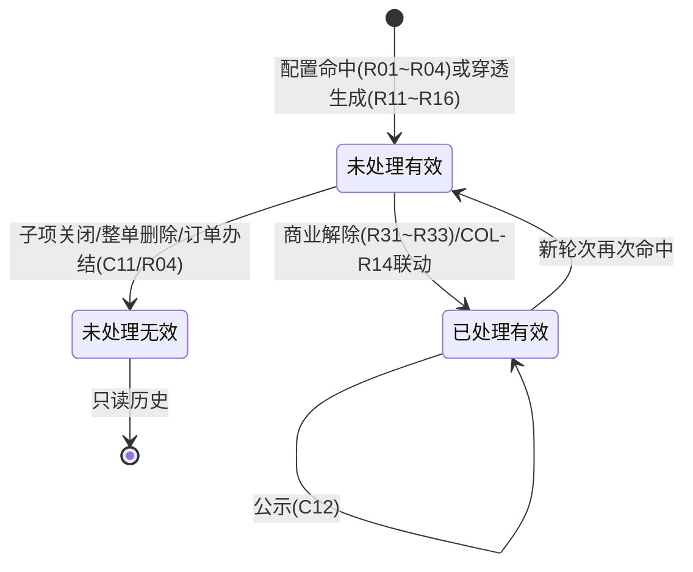
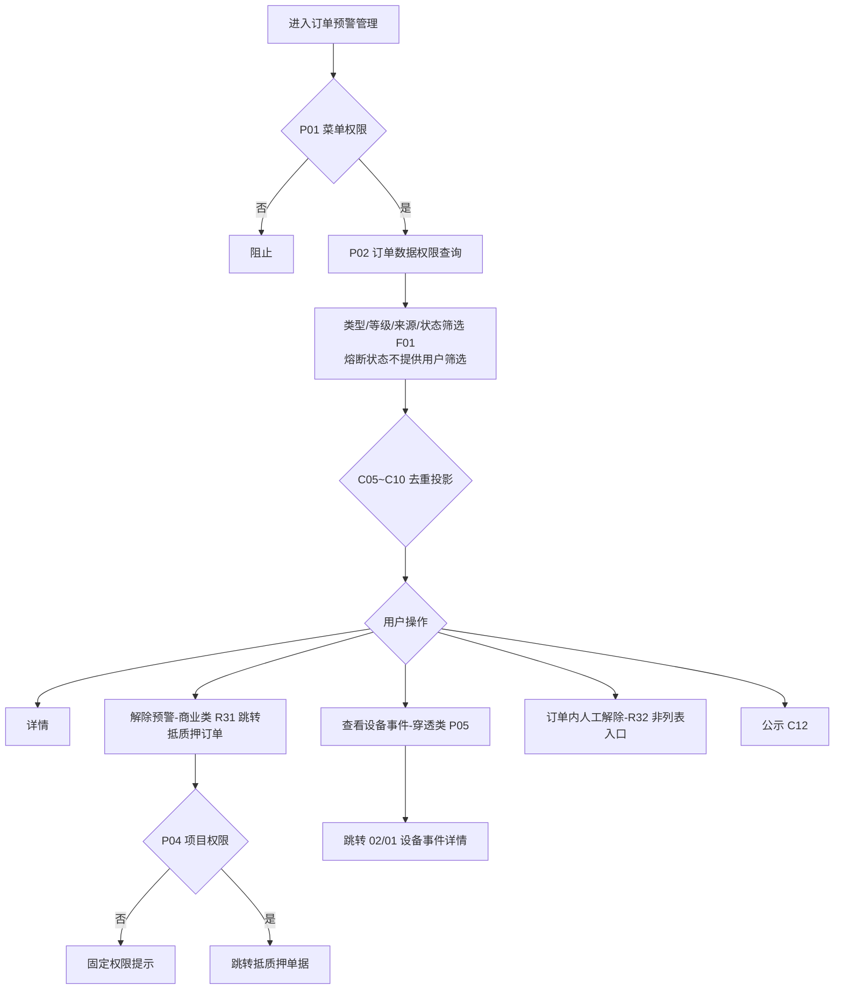
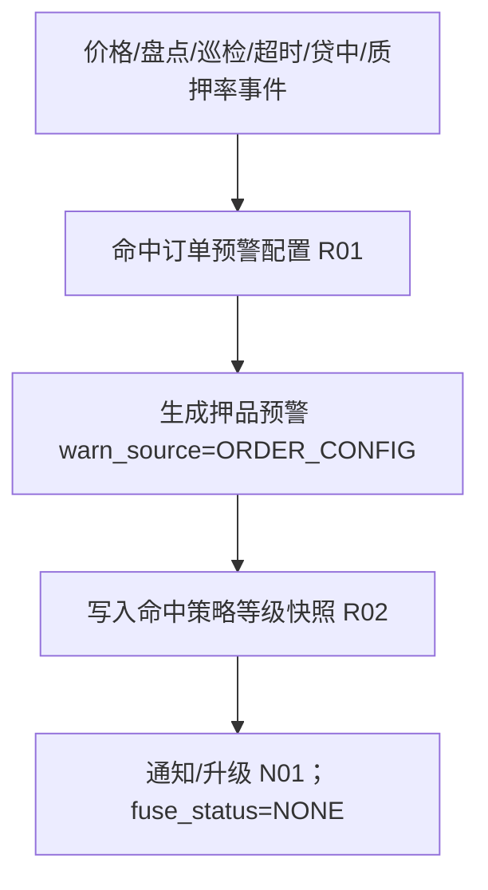
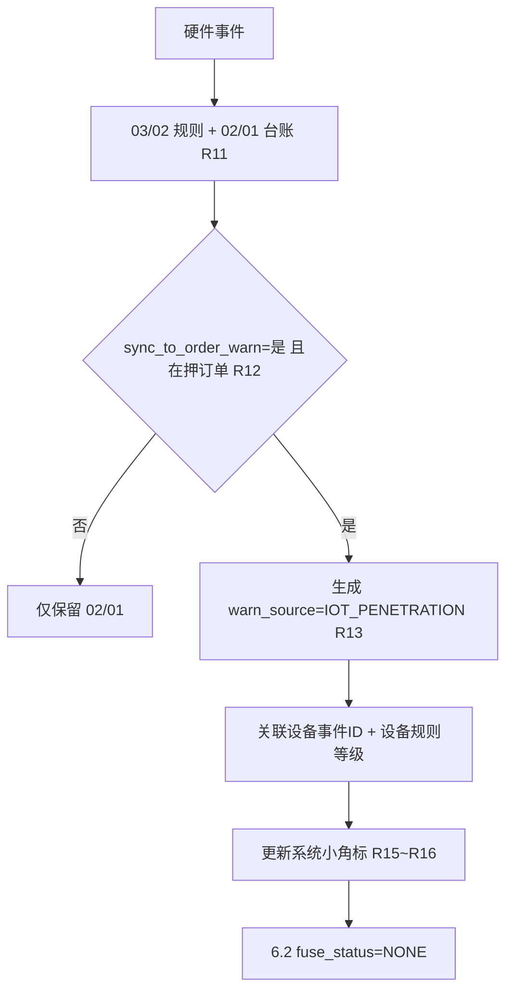
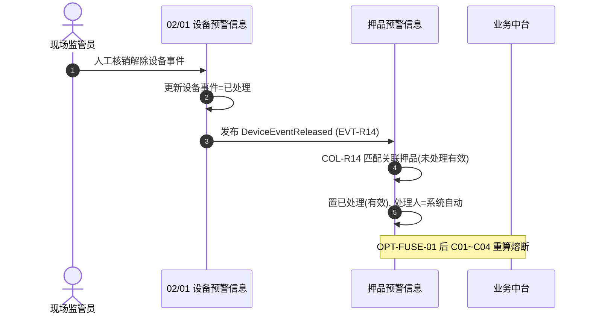
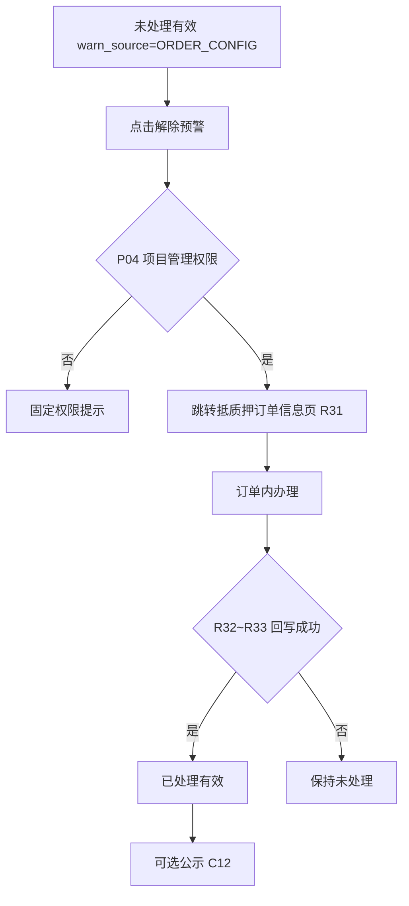
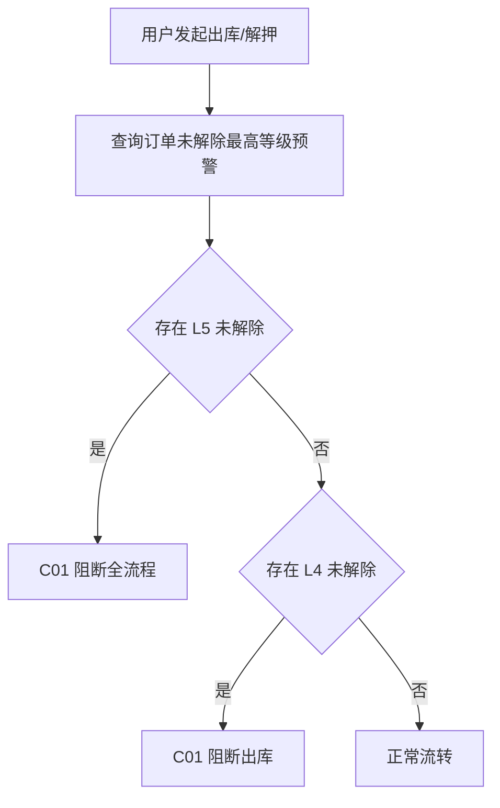

# 押品预警信息 业务规则规格

> **文档定位**：押品预警信息预警状态机、动作约束、生成/解除/去重/穿透联动、权限与跨模块流程的**唯一定义来源**。主 PRD、字段清单、ASCII 线框只引用本文件规则 ID 与流程章节，不重复定义规则本体。
>
> **模块类型**：流水查询 + 处理状态（**范式 C hybrid**——列表检索为主，叠加预警状态机 第二至五章）
>
> **参考文档**：[《押品预警信息主PRD》](./押品预警信息主PRD.md)、[《押品预警信息字段清单》](./押品预警信息字段清单.md)、[《00-全局契约与RBAC权限矩阵》](../../00-全局契约与RBAC权限矩阵.md)第四章 §1、[03/03 订单预警配置业务规则规格](../../03-预警配置/03订单预警配置/订单预警配置业务规则规格.md)、[02/01设备预警信息业务规则规格](../01设备预警信息/设备预警信息业务规则规格.md)（EVT-R14 发布方）
>
> **版本**：V3.2 | 2026-08-21
>
> **跨模块契约**：[00-全局契约与RBAC权限矩阵](../../00-全局契约与RBAC权限矩阵.md)；生命周期、权限、路由参数和熔断边界以该文档为准。
>
> **跨文档引用规范**：[B-迭代需求跨文档引用口径与来源索引](../../../README.md)。本文件定义押品流水状态、生成、处置、去重和穿透规则；依赖摘要按 REF-SEVERITY、REF-ORDER、REF-RBAC、REF-NOTIFY 展开。
>
> **原型与 Demo 导航**：
> - **原型 DEV 路径**：PC端 [`/预警信息/押品预警信息`](http://localhost:5173/预警信息/押品预警信息) | 移动端 [`/m/supervision/order-warnings`](http://localhost:5173/m/supervision/order-warnings)（原型右下角可切换「标注模式」查看 DEV 说明）
> - **原型交互规范**：[押品预警信息_Demo_列表页](./押品预警信息_Demo_列表页.md) · [押品预警信息_Demo_详情页](./押品预警信息_Demo_详情页.md) · [押品预警信息_Demo_移动端](./押品预警信息_Demo_移动端.md)
> - **ASCII 线框图**：[押品预警信息_ASCII_列表页](./押品预警信息_ASCII_列表页.md) · [押品预警信息_ASCII_详情页](./押品预警信息_ASCII_详情页.md) · [押品预警信息_ASCII_移动端](./押品预警信息_ASCII_移动端.md)

---

## 一、能力定位

| 项目 | 内容 |
| :--- | :--- |
| **模块层级** | 02 预警信息 · 流水承接与处置层 |
| **菜单路径** | PC `预警信息 → 押品预警信息`；移动 `项目监管 → 预警管理 → 订单预警` |
| **核心职责** | 承接 6 类订单配置触发 + 物联穿透投影；提供查询、去重展示、商业处置、穿透联动解除、公示 |
| **写入来源** | 订单配置引擎；穿透投影引擎（只读，不可本模块手工新增） |
| **上游依赖** | **03/03 订单预警配置**提供商业策略、阈值、通知策略和触发时规则快照；**02/01设备预警信息**提供物联穿透事件、设备事件 ID 和等级同步开关结果；**03/01 预警等级**提供等级 ID/编码/名称/颜色/排序快照及 `sync_to_order_warn` 口径；**估值、贷中、盘点、巡检**提供对应商业风控子项的触发输入。列表、详情、去处理和解除均按订单数据权限及跨域复合校验执行。来源：REF-SEVERITY、REF-ORDER、REF-RBAC、REF-NOTIFY。 |
| **下游影响** | **抵质押单据**：商业类未处理有效记录的「解除预警」只负责按 R31 跳转订单信息页，实际办结/人工解除由订单内动作完成并按 R32~R33 回写本流水；穿透类不提供人工解除入口。**风险公示**：已处理有效且未公示记录按 C12 进入单条/批量公示候选，公示状态和审计结果回写；公示失败不改变预警处置状态。**物联联动**：消费 02/01 发布的 `DeviceEventReleased`，按 `tenant_id + order_id + event_id` 幂等匹配未处理穿透记录并置已处理；消息丢失按 C05/EC-02 补偿重放。**熔断边界**：6.2 仅持久化 `fuse_status=NONE`，不调用 OPT-FUSE-01 的锁定、解锁或重算接口。通知发送失败进入补偿队列，不回滚已生成押品流水；订单办结、配置子项关闭或整条规则删除时按 R04/C11 将相关未处理记录置无效并停止升级。来源：[押品预警信息主 PRD](./押品预警信息主PRD.md) 第 3.1 节、R01~R04、R11~R16、C05/C11/C12、N01~N03。 |
| **审核流** | **无**——流水由引擎生成，处置通过解除预警跳转/订单内办结/联动完成 |
| **与配置侧边界** | 本模块 `预警状态`=流水处置状态；03/03 配置侧 `状态`=规则生命周期，**语义不同** |
| **7 类预警** | 6 商业 + 物联穿透；6.1 五类硬件订单预警不再新产生 |

---

## 二、状态定义

| 状态名称 | 枚举值 | 业务含义 | 是否终态 | 进入条件 | 离开条件 |
| :--- | :--- | :--- | :---: | :--- | :--- |
| 未处理（有效） | `PENDING_VALID` | 待处置的有效预警；列表展示操作入口 | 否 | 配置命中或穿透生成成功 | 商业解除/设备联动/置无效 |
| 未处理（无效） | `PENDING_INVALID` | 被子项关闭、整单删除、订单办结或同类型覆盖；只读归档 | **是** | 子项关闭/整单删除/订单办结/同类型覆盖 | — |
| 已处理（有效） | `PROCESSED_VALID` | 处置完成；可公示；新轮次可再次触发 | 否* | 商业解除/业务回写/COL-R14 联动 | 新轮次命中→未处理（有效） |

\* `已处理（有效）` 对单轮次为业务终态；同一订单+类型可开启新轮次。

**设计说明**：

- 预警状态**禁止**通过表单下拉选择框 (Dropdown) 修改，须通过「解除预警」（跳转抵质押订单）、订单内办结、`DeviceEventReleased 联动` 等独立动作触发。
- 物联穿透类（`warn_source=IOT_PENETRATION`）**不提供**押品页「解除预警」入口（R23）。

---

## 三、状态流转图

---

## 四、状态流转表

> 前置条件须**全部**满足才允许触发动作。

| 当前状态 | 动作 | 前置条件 | 结果状态 | 二次确认 | 后置影响 | 失败处理 |
| :--- | :--- | :--- | :--- | :--- | :--- | :--- |
| — | 配置触发生成 | R01~R04 命中；幂等键不重复 | 未处理（有效） | 无 | ① 写入等级/来源快照；② `fuse_status=NONE`；③ 通知/升级；④ C05 去重投影 | 缺必要计算值 R21 跳过并记原因 |
| — | 穿透投影生成 | R11~R16；02/01 已落账 | 未处理（有效） | 无 | ① 类型=物联穿透；② 关联设备事件ID 必填；③ 不重复物理通道通知 | 无在押订单则不生成 |
| 未处理（有效） | 解除预警 | P04 项目管理权限；商业类；非穿透 | 未处理（有效）* | 无 | 跳转对应抵质押订单信息页 | 无权限固定提示，不跳转 |
| 未处理（有效） | 人工解除 | R21~R22；允许人工类型；**非 IOT_PENETRATION** | 已处理（有效） | 「确认解除该预警？」 | ① 解除抓拍；② （OPT-FUSE-01）C01~C04 重算 | 版本/权限失败保持未处理 |
| 未处理（有效） | 业务模块回写 | R33 业务办结条件满足 | 已处理（有效） | 无 | 处理人=系统自动处理 | 回写失败保持未处理 |
| 未处理（有效） | COL-R14 联动解除 | 收到 `DeviceEventReleased`；设备事件ID 匹配 | 已处理（有效） | 无 | 处理人=系统自动处理；说明=关联事件编号 | 消息丢失走补偿重放 |
| 未处理（有效） | 置无效 | C11 子项关闭/整单删除；R04 订单办结 | 未处理（无效） | 系统自动 | 停止对应升级任务 | — |
| 已处理（有效） | 公示风险 | 未公示；P01 公示权限 | 已处理（有效） | 公示确认弹窗 | C12 联动 02/04 风险公示 | — |
| 未处理（有效） | 人工解除（穿透类） | — | — | — | **不允许** R23 | API 拒绝 |

\* 解除预警跳转本身不改变状态，订单内办结后由 R33 回写。

---

## 五、动作能力矩阵

> ✅ = 允许；❌ = 不允许（不展示入口）；✅* = 条件允许

| 动作 | 未处理（有效）商业类 | 未处理（有效）穿透类 | 已处理（有效） | 未处理（无效） |
| :--- | :---: | :---: | :---: | :---: |
| 查看列表/详情 | ✅ | ✅ | ✅ | ✅ |
| 解除预警 | ✅* | ❌ | ❌ | ❌ |
| 订单内人工解除 | ✅** | **❌** | ❌ | ❌ |
| 查看设备事件 | ❌ | ✅*** | ❌ | ❌ |
| 公示风险/批量公示 | ❌ | ❌ | ✅**** | ❌ |
| 导出 | ✅ | ✅ | ✅ | ✅ |

\* 须 P04 项目管理权限，跳转抵质押订单；\*\* 仅在抵质押订单内，如价格下跌 R32；\*\*\* 须 P05 IoT 权限；\*\*\*\* 且未公示。

**类型处置对照**：

| 预警类型 | 列表「解除预警」 | 订单内人工解除 | 主要解除路径 |
| :--- | :---: | :---: | :--- |
| 抵/质押率 | ✅ | ❌ | 抵质押订单补仓/平仓/解押 |
| 解抵/质押/监管 | ✅ | ❌ | 抵质押订单解押办结 |
| 盘点/巡检 | ✅ | ❌ | 抵质押订单关联任务完成 |
| 贷中风控 | ✅ | ❌ | 抵质押订单贷中处置 |
| 价格下跌 | ✅ | ✅ | 抵质押订单内核查 / 估值恢复 |
| 物联穿透告警 | ❌ | **❌** | **02/01 核销 → COL-R14** |

**列表 UI 呈现（6.2）**：

- 未处理（有效）**商业类**列表行展示「**解除预警**」。
- 点击后**统一跳转对应抵质押订单信息页**办理（R31/P04）；具体解除动作（单据办结、订单内人工说明等）在订单模块完成，**不在押品列表/详情弹窗解除**。
- 穿透类展示「查看设备事件」，不展示「解除预警」（R23）。

---

## 六、校验规则

### 6.1 配置触发（6 类）

| 规则ID | 规则 | 校验时机 | 违反处理 |
| :--- | :--- | :--- | :--- |
| **R01** | 命中 [03/03 订单预警配置](../../03-预警配置/03订单预警配置/订单预警配置主PRD.md) 最新有效规则 → 生成押品预警；`warn_source=ORDER_CONFIG` | 引擎触发 | — |
| **R02** | 预警等级取命中策略的 `severity_level_id` 及 04 快照（编码/名称/颜色/`sort_order`）；不得依赖固定 L1~L5 | 生成时 | — |
| **R03** | 幂等键：`租户+订单+预警类型+来源事件ID`（或业务批次键） | 生成时 | 重复则跳过 |
| **R04** | 订单办结/出库完毕 → 未处理置无效，停止升级；已处理保留 | 订单状态变更 | 系统自动 |

> **迁移**：原 COL-T01~T04 → R01~R04。

### 6.2 物联穿透（只读）

| 规则ID | 规则 | 校验时机 | 违反处理 |
| :--- | :--- | :--- | :--- |
| **R11** | 前置：02/01 已写入物理事件；触发等级 `sync_to_order_warn=true`；空间拓扑匹配在押订单 | 穿透引擎 | 不满足则仅保留 02/01 |
| **R12** | 空间拓扑：设备位置 → 匹配在押订单（抵质押中/监管中）；无订单则不生成 | 穿透引擎 | 不生成押品记录 |
| **R13** | 生成：类型=物联穿透告警；`warn_source=IOT_PENETRATION`；等级=设备规则等级；关联设备事件ID 必填 | 生成时 | — |
| **R14** | 幂等：`租户+订单+设备事件ID`；同一物理事件不得 duplicate | 生成时 | 跳过 duplicate |
| **R15** | 穿透生成时自动更新订单风控专员角色组**系统小角标**；**6.2 不评估熔断**（C01~C04 预留） | 生成后 | — |
| **R16** | 不在押品侧重复发送物理通道通知（设备侧已通知） | 生成后 | — |

> **迁移**：原 COL-T11~T16 → R11~R16。

### 6.3 通用生成

| 规则ID | 规则 | 校验时机 | 违反处理 |
| :--- | :--- | :--- | :--- |
| **R21** | 缺少必要计算值不生成数值类预警；记录跳过原因 | 生成前 | 跳过 |
| **R22** | 通知失败不回滚已生成记录 | 通知后 | 补偿队列 |
| **R23** | **穿透类（IOT_PENETRATION）禁止走押品人工解除接口**；前端不展示入口 | 解除时 | API 拒绝 |

> **迁移**：原 COL-T21~T23 → R21~R23（T23 与 R04 合并口径）。

### 6.4 商业解除校验

| 规则ID | 规则 | 校验时机 | 违反处理 |
| :--- | :--- | :--- | :--- |
| **R31** | 「解除预警」须项目管理菜单权限；跳转对应抵质押订单信息页；无权限固定提示，不跳转 | 解除预警 | 固定提示 |
| **R32** | 人工解除：情况说明必填 ≤200 字；现场照片选填 ≤10 张 5MB | 提交解除 | 表单校验阻断 |
| **R33** | 业务模块回写成功 → 原子更新已处理（有效）；处理人=系统自动处理 | 回写 | 失败保持未处理 |

> **迁移**：原 COL-R04 + 去处理规则 → R31~R33。

---

## 七、计算与联动规则

### 7.1 业务熔断（OPT-FUSE-01 预留，不属于 6.2 用户流程）

> **6.2 本期**：本节仅保留未来接口/枚举设计；不执行、不筛选、不展示熔断状态，`fuse_status` 恒 `NONE`。以下内容不能作为本期页面动作或验收断言。

| 规则ID | 规则 |
| :--- | :--- |
| **C01** | 未来按未处理预警的 `sort_order` 与业务中台策略计算锁定范围；6.2 不执行 |
| **C02** | 未来熔断状态写入业务动作快照；6.2 仅保留 `fuse_status=NONE` |
| **C03** | 未来解除后由业务中台幂等重算；6.2 不调用解锁接口 |
| **C04** | 未来按订单内最高严重度合并商业/穿透风险；6.2 不计算 |

> **迁移**：原 COL-F01~F04 → C01~C04。

### 7.2 穿透联动解除（COL-R14）

| 规则ID | 规则 |
| :--- | :--- |
| **COL-R14** | 须收到 **02/01** 发布的 `DeviceEventReleased` 领域事件（发布方 EVT-R14）；载荷含 `tenant_id`、`event_id`、`order_id`、`processed_by`、`processed_time`；按设备事件 ID 幂等匹配未处理有效穿透记录 → 置 `已处理（有效）`；处理人=系统自动处理；处理说明=关联设备事件编号 |
| **C05** | COL-R14 联动失败时押品保持未处理；6.2 无熔断联动；补偿任务按事件 ID 重放（EC-02） |

> 历史版本的设备事件联动解除口径统一收敛为 **COL-R14**；补偿和处理人写入由 COL-R14 后置规则负责。

### 7.3 配置生命周期联动

| 规则ID | 规则 |
| :--- | :--- |
| **C11** | 01 普通修改只影响后续触发；策略子项关闭仅将该子项未处理流水置无效；整单软删除才将该规则全部未处理流水置无效；系统失效不自动置无效；历史快照不回写 |
| **C12** | 已处理（有效）且未公示 → 单条/批量公示候选 → 联动 [02/04 风险公示](../04风险公示/风险公示主PRD.md) |

### 7.4 列表去重投影（C06~C10）

> 去重仅作用于列表投影，**不删除**原始记录。

| 规则ID | 范围 | 去重键 |
| :--- | :--- | :--- |
| **C06** | 未处理-商业类 | 订单 + 预警类型 + 预警内容 |
| **C07** | 未处理-穿透类 | 订单 + 关联设备事件ID |
| **C08** | 已处理-超时 | 订单 + 类型 + 处理时间 + 二维码 |
| **C09** | 已处理-价格下跌/盘点/贷中 | 订单 + 类型 + 处理时间 |
| **C10** | 已处理-巡检/质押率/穿透 | 巡检：+巡检人；质押率：+命中线；穿透：订单+设备事件ID+处理时间 |

> **迁移**：原字段清单 第八章 去重表 → C06~C10。

### 7.5 通知与升级（N01~N03）

| 规则ID | 规则 |
| :--- | :--- |
| **N01** | 商业类：继承订单规则通知对象与升级策略；首次/升级通知均自动更新对象**系统小角标**，外部渠道按规则快照；起算=本条首次触发时间 |
| **N02** | 穿透类：订单摘要通知默认向租户**订单风控专员**角色组自动更新**系统小角标**；不重复物理通道通知；升级可选继承设备规则 |
| **N03** | L4/L5 升级通知 6.2 **不含**「已锁定出库」文案（OPT-FUSE-01 后补充） |

---

## 八、权限规则

### 8.1 数据可见范围

| 规则ID | 规则 |
| :--- | :--- |
| **P01** | 须具备「订单预警管理/押品预警信息」菜单查看权限；各操作分别校验 |
| **P02** | 列表/详情/图片/公示按**订单数据权限**过滤 |
| **P03** | 写接口服务端重算订单权限 |
| **P04** | 「解除预警」跳转抵质押订单须项目管理菜单权限；无权限固定提示文案 |
| **P05** | 查看设备事件须 IoT 菜单权限 + 仓库/订单复合校验；无权限只读隐藏跳转 |
| **P06** | 图片换取校验租户、菜单、订单/仓库权限；签名 URL 时效 |

> **迁移**：原 COL-P01~P06 → P01~P06。

### 8.2 操作权限矩阵

> 角色定义见 [00-全局契约与RBAC权限矩阵](../../00-全局契约与RBAC权限矩阵.md) 第四章 §1。

| 操作 | R-SYS-ADMIN | R-RISK-MGR | R-RISK-OFF | R-ORDER-OP | R-VIEWER |
| :--- | :---: | :---: | :---: | :---: | :---: |
| 查看列表/详情 | ✅ | ✅ | ✅ | ✅ | ✅ |
| 解除预警 | ✅ | ✅ | ✅ | ✅* | ❌ |
| 人工解除 | ✅ | ✅ | ✅ | ❌ | ❌ |
| 查看设备事件 | ✅ | ✅ | ✅ | ❌ | ❌ |
| 公示/批量公示 | ✅ | ✅ | ❌ | ❌ | ❌ |

\* 须 P04 项目管理权限。

---

## 九、边界与异常处理

### 9.1 并发控制

| 场景 | 处理方式 |
| :--- | :--- |
| 人工解除与业务回写并发 | 乐观锁 + 状态=未处理（有效）校验 |
| COL-R14 与人工解除并发 | R23 拒绝人工；联动优先 |
| 公示与再次命中并发 | 新轮次生成新记录；原已处理保留 |

### 9.2 幂等操作约束

| 操作 | 幂等规则 |
| :--- | :--- |
| 配置触发生成 | R03：`租户+订单+类型+来源事件ID` |
| 穿透生成 | R14：`租户+订单+设备事件ID` |
| COL-R14 消费 | `event_id` 幂等 |
| 批量公示 | 候选 ID 列表幂等提交 |

### 9.3 上下游不一致

| 场景 | 处理方式 |
| :--- | :--- |
| 穿透生成但用户无 IoT 权限 | 押品可见；查看设备事件隐藏或 403 |
| 设备事件已解除但消息丢失 | C05 补偿任务按事件 ID 重放 COL-R14 |
| 同一事件重复穿透 | R14 幂等，不 duplicate |
| 订单失权 | P02 列表/详情/图片/公示均不可见 |
| 穿透类调用人工解除 API | R23 拒绝 |
| 6.1 历史 IoT 类未处理 | 迁移策略决定置无效或保留；新事件走穿透 |

### 9.4 检索规则（范式 C 补充）

| 规则ID | 规则 |
| :--- | :--- |
| **F01** | 进入页面默认加载近 30 天未处理（有效）+ 用户权限内订单；全量检索须至少一项筛选条件 |
| **F02** | 默认排序：预警时间 DESC |
| **F03** | 时间跨度 >366 天阻断，提示缩小范围 |
| **F04** | 导出上限 50,000 行 |

---

## 十、规则索引

| 规则类型 | 代码范围 | 说明 |
| :--- | :--- | :--- |
| 校验/触发规则 | R01 – R04, R11 – R16, R21 – R23, R31 – R33 | 生成、穿透、解除 |
| 计算联动规则 | C01 – C12 | 熔断预留、COL-R14、去重、公示、配置联动 |
| 穿透联动（跨模块） | **COL-R14** | 消费 `DeviceEventReleased`（对齐 02/01 EVT-R14） |
| 权限规则 | P01 – P06 | 菜单、订单、IoT、图片 |
| 通知规则 | N01 – N03 | 商业/穿透通知与升级 |
| 检索规则 | F01 – F04 | 范式 C 列表检索 |

### COL-* → R/C/P 迁移对照

| 原 COL-* | 新 ID | 类型 |
| :--- | :--- | :--- |
| COL-P01~P06 | P01~P06 | 权限 |
| COL-T01~T04 | R01~R04 | 配置触发 |
| COL-T11~T16 | R11~R16 | 穿透生成 |
| COL-T21~T23 | R21~R23 | 通用生成 |
| COL-F01~F04 | C01~C04 | 熔断（deferred） |
| 设备事件联动解除 | **COL-R14** | 穿透联动解除 |
| COL-R02~R03 | COL-R14 + C05 | 联动写处理人/补偿 |
| COL-R04 | R31~R33 | 商业解除 |
| 去重 第八章 | C06~C10 | 列表投影 |
| COL-N 系列 | N01~N03 | 通知升级 |

---

## 业务流程与联动

> 跨模块主路径、时序推演、异常回路。与上文 第二至五章 状态机配合阅读；**重复的状态机定义以上文为准**。

### 1. 列表查询流程

### 2. 预警生成双轨流程

#### 2.1 配置触发轨

#### 2.2 物联穿透轨

### 3. 穿透联动解除时序（COL-R14）

### 4. 商业类处置流程

### 5. 熔断与出库拦截（OPT-FUSE-01 预览）

> **6.2 本期不执行**。C01~C04 启用后参考：

---

## 设计自检清单

- [x] 是否存在永远到不了的状态？——三态均可达
- [x] 非终态是否都有离开路径？——未处理（有效）可解除/置无效；已处理可新轮次
- [x] 是否存在表单直接改状态下拉？——否，仅动作按钮
- [x] 穿透类是否禁止人工解除？——R23 + 第五章 动作矩阵
- [x] COL-R14 是否与 EVT-R14 对齐？——是
- [x] fuse_status 6.2 是否恒 NONE？——C01~C04 deferred
- [x] 动作能力矩阵是否无遗漏？——第五章已覆盖
- [x] COL-* 是否映射至 R/C/P？——第十章迁移表

---

## 修订记录

| 日期 | 版本 | 变更摘要 |
| :--- | :---: | :--- |
| 2026-08-18 | V1.3 | 6.1 基准 |
| 2026-08-20 | V2.0 | 7 类、穿透、熔断、联动解除 |
| 2026-08-20 | V2.1 | 口径统一；合并业务流程 |
| 2026-08-20 | **V3.0** | **6.2 标杆重构**：第一至十章；预警状态机、跨域联动、范式 C hybrid + F01~F04；设计自检清单 |
| 2026-08-21 | V3.1 | 第五章补列表 UI：商业类统一「解除预警」按钮 |
| 2026-08-21 | V3.2 | 「解除预警」统一跳转抵质押订单；R32 为订单内能力，非列表弹窗入口 |
| 2026-09-01 | **V3.3** | N01/N02/R15 通知口径：系统小角标自动更新，移除「站内信」可配置项 |
