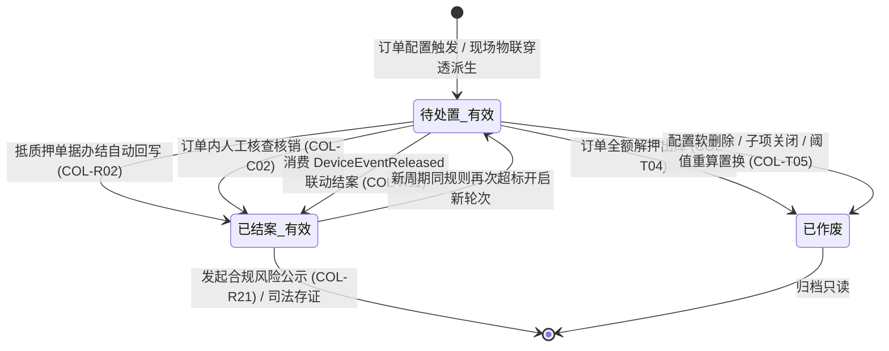
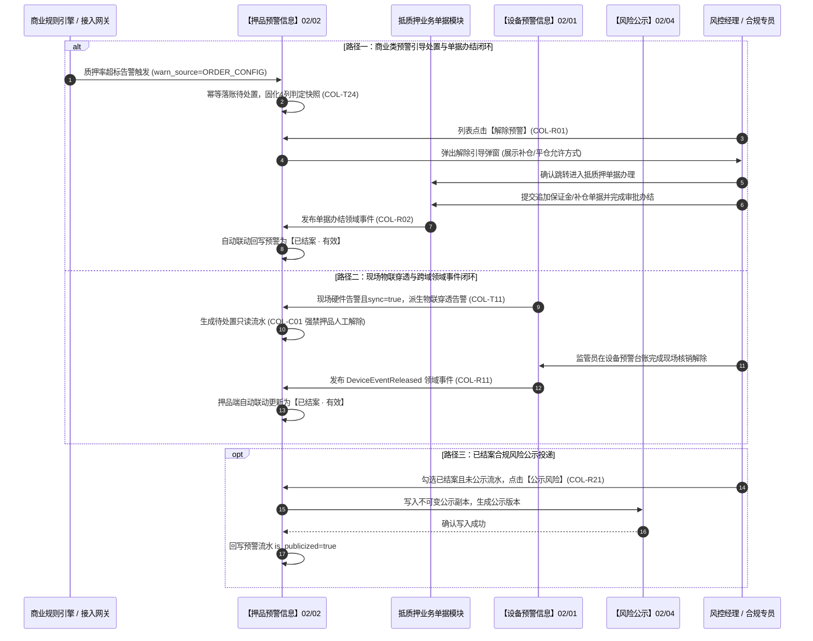

# 押品预警信息 业务规则规格

> **文档定位**：仓储风控 / 预警信息 / 押品预警信息模块（`02-02`）状态机流转、订单配置触发落账、物联穿透闭环、抵质押单据协同处置、数据不可变存证与跨系统权限控制的**唯一定义真源（SSOT）**。配套文档：[押品预警信息主PRD.md](./押品预警信息主PRD.md)（业务全景与页面交互说明）、[押品预警信息字段清单.md](./押品预警信息字段清单.md)（字段字典）。端侧原型与 ASCII 线框仅引用本文件规则编号（COL-T01~T24, COL-C01~C08, COL-R01~R21, COL-P01~P06, COL-N01~N03, COL-F01~F04），不重复定义规则本体。  
> **模块类型**：业务执行流水类（具有完整处置状态机与物联穿透联动，无审批流）  
> **版本**：V4.0 | **更新时间**：2026-09-18 | **责任人**：森云科技（Senyun Technology）  
> **参考规范**：[《00-全局契约与RBAC权限矩阵》](../../00-全局契约与RBAC权限矩阵.md)、[订单预警配置业务规则规格（03/03）](../../03-预警配置/03订单预警配置/订单预警配置业务规则规格.md)、[设备预警信息业务规则规格（02/01）](../01设备预警信息/设备预警信息业务规则规格.md)

---

## 一、单据与能力定位

| 项目 | 内容 |
| :--- | :--- |
| **模块层级** | **【业务执行流水层】**（订单级与押品级风险流水的承接中枢与处置工作台，非配置策略层） |
| **菜单路径** | PC端：`工作台 → 预警信息 → 押品预警信息`；移动端：`项目监管 → 预警管理 → 订单预警` |
| **核心职责** | 承接 6 类商业风控预警流水 + 现场物联穿透告警；提供多维复合检索、类型化展示去重投影、商业引导处置（跳转抵质押单据办理补仓/平仓）、物联领域事件联动结案及合规风险公示全流程闭环 |
| **单据来源** | **双轨流水归集**： 1. **商业配置轨**：由【订单预警配置】策略（菜单：`预警配置 → 订单预警配置`，代号 03/03）命中的 6 类商业风控流水（预警来源为「订单预警配置」）； 2. **物联穿透轨**：由【设备预警信息】台账（菜单：`预警信息 → 设备预警信息`，代号 02/01）触发且满足空间在押拓扑匹配后派生的只读流水（预警来源为「现场物联穿透告警」）。 |
| **上游依赖** | **【订单预警配置】策略（菜单：预警配置 → 订单预警配置，代号 03/03）**：提供商业策略阈值、通知升级策略与规则快照； **【设备预警信息】台账（菜单：预警信息 → 设备预警信息，代号 02/01）**：提供物理设备告警事实与 `sync_to_order_warn` 等级穿透开关； **【预警等级】字典（菜单：预警配置 → 预警等级，代号 03/01）**：提供等级 ID、编码、名称、标签色值及权重 `sort_order` 快照。 |
| **下游影响** | **抵质押业务单据**：商业类预警点击【解除预警】引导跳转至抵质押单据办理补仓/平仓/还款，单据办结后自动回写结案； **【风险公示】台账（菜单：预警信息 → 风险公示，代号 02/04）**：已结案有效记录满足合规条件后，支持单条或批量投递至风险公示台账； **司法证据保全**：固化触发瞬间 4 列不可变存证快照，调用私有对象存储（OSS）动态申请临时安全签名。 |
| **熔断边界** | 6.2 版本后台持久化保留 `熔断状态=无熔断（NONE）`，不阻断业务出库流转（相关能力后置规划）。 |

---

## 二、数量与计算口径隔离表

| 口径名称 | 应用维度 | 业务含义与计算公式 / 判定条件 | 约束与边界说明 |
| :--- | :--- | :--- | :--- |
| **动态抵质押率 (LTV)** | 商业盯市计算 | 质押货品贷款余额与实时盯市货值的比率： $$R_{\text{pledge}} = \frac{L_{\text{balance}}}{V_{\text{goods}}} \times 100\% = \frac{L_{\text{balance}}}{\sum_{i=1}^n (Q_i \times P_i)} \times 100\%$$ | 当 $R_{\text{pledge}} \ge T_{\text{warning}}$（预警补仓线）或 $R_{\text{pledge}} \ge T_{\text{close}}$（平仓线）时触发告警；若货值 $\le 0$ 强阻断计算 |
| **现货价格跌幅** | 行情波动计算 | 盯市价格相对于期初基准价格的跌价比例： $$D_{\text{price}} = \frac{P_{\text{init}} - P_{\text{current}}}{P_{\text{init}}} \times 100\%$$ | 当 $D_{\text{price}} \ge T_{\text{drop}}$ 时触发价格下跌预警；$P_{\text{init}}$ 锁定为入库核定价 |
| **解抵押超期天数** | 履约时效计算 | 订单当前履约滞后于约定期限的逾期天数： $$D_{\text{overdue}} = \max\left(0, \left\lceil \frac{T_{\text{current}} - T_{\text{due}}}{86400} \right\rceil\right)$$ | 当 $D_{\text{overdue}} > 0$ 时触发超时预警；未达期限时 $D_{\text{overdue}} = 0$ |
| **盘点账实差异率** | 盘点比对计算 | 现场盘点实测总重与系统账面结存数量的相对偏差： $$R_{\text{inventory\_diff}} = \frac{\|Q_{\text{book}} - Q_{\text{actual}}\|}{Q_{\text{book}}} \times 100\%$$ | 偏差超出允许公差阈值即触发盘点异常告警；$Q_{\text{book}} > 0$ |
| **列表去重投影算子** | 列表展示计算 | 针对全量原始流水集合 $\text{Ledger}$ 进行类型化聚合投影： $$S_{\text{display}} = \{ \operatorname{latest}(R) \mid R \in \text{Ledger}, \operatorname{key}(R) = (\text{order\_id}, \text{warn\_type}, \text{status}) \}$$ | 仅用于前端数据呈现，**绝对不删除**底层数据库任何一条物理事件流水 |
| **并发数据版本号** | 乐观锁并发控制 | 流水数据版本计数器： $$\text{Version}_{n+1} = \text{Version}_n + 1$$ | 初始落账 Version=1；任何状态变迁或核销回写时递增；提交时版本比对一致方可落库 |

---

## 三、单据状态机与生命周期流转

### 3.1 状态定义
押品预警流水采用“处理状态 + 记录有效性”组合三态标准词表：

| 状态名称 | 状态编码 | 业务含义 | 是否终态 | 进入条件 | 退出条件 |
| :--- | :--- | :--- | :---: | :--- | :--- |
| **待处置 · 有效** | `PENDING_VALID` | 预警事件已触发且订单处于在押存续期，尚未完成业务处置 | 否 | 订单策略命中或物联穿透派生产生 | 抵质押单据办结回写；订单内人工解除；设备联动结案；配置修改重算置换 |
| **已结案 · 有效** | `RESOLVED_VALID` | 风险已消除，经单据办结核销、人工核实结案或设备联动解除，归档只读 | 否* | 单据办结回写；订单内解除成功；消费 `DeviceEventReleased` 联动结案 | 新业务周期同规则再次超标命中开启新轮次 |
| **已作废** | `PENDING_INVALID` | 订单全额解押出库、配置规则删除、子项关闭或阈值调整重算置换 | **是** | 订单履约出库办结；配置侧软删除；配置阈值调整重算置换 | —（不可逆终态） |

\* 注：`已结案 · 有效` 对单次风险事件为终态；同一订单若在后续市场波动中再次超标，将开启全新预警轮次并生成新流水行。

### 3.2 状态流转图

### 3.3 状态流转表

| 当前状态 | 触发动作 | 前置业务条件 | 结果状态 | 二次确认与交互形式 | 联动后置影响 | 失败处理与反馈 |
| :--- | :--- | :--- | :--- | :--- | :--- | :--- |
| — | **配置触发 / 穿透派生** | 指标超标命中有效规则；或现场硬件告警且开启穿透拓扑匹配 | 待处置 · 有效 | 系统后台自动写入 | ① 写入 `order_warning_ledger`； ② 固化 4 列判定快照与等级快照； ③ 发送首次预警通知； ④ 注册超时升级任务。 | 记录落账异常日志，不阻塞主链路 |
| **待处置 · 有效** | **跳转抵质押单据** | 商业类预警；操作人具备项目管理权限 (COL-P04) | 待处置 · 有效 (单据流转中) | 弹出解除引导对话框，确认后无缝跳转 | 携带 `order_no` 跳转至抵质押单据列表，精确筛选该订单 | 「您暂无相关权限，请联系管理员开通项目管理权限！」 |
| **待处置 · 有效** | **抵质押单据办结** | 借款企业完成补仓、还款，单据审批通过办结 | 已结案 · 有效 | 单据审批终审办结自动触发 | ① 押品流水状态更新为 `已结案 · 有效`； ② 处理人写入办结人或系统自动； ③ 取消超时升级定时任务。 | 记录回写失败日志并重试 |
| **待处置 · 有效** | **订单内人工核查** | 价格下跌等特定商业类；在抵质押订单内提交解除 | 已结案 · 有效 | 弹窗录入 1~200 字情况说明并上传现场照片 | ① 固化写入情况说明、照片与抓拍； ② 变更为 `已结案 · 有效`； ③ 取消超时升级任务。 | 弹窗提示：「数据已被他人修改，请刷新重试」 |
| **待处置 · 有效** | **跨域设备事件联动** | 现场监管员在 02/01 完成设备事件核销解除 | 已结案 · 有效 | 消费 `DeviceEventReleased` 领域事件自动触发 | ① 匹配 `event_id` 更新为 `已结案 · 有效`； ② 处理人写入“系统自动处理”； ③ 取消超时升级任务。 | 补偿对账任务每 5 分钟重试重放 |
| **待处置 · 有效** | **订单办结全额出库** | 订单完成全额解押并归档 (COL-T04) | 已作废 | 业务系统订阅单据全额出库事件 | ① 将该订单下全部待处置流水置为 `已作废`； ② 停止升级调度； ③ 记录作废说明。 | — |
| **待处置 · 有效** | **阈值调整重算置换** | 03/03 修改阈值触发重算且仍命中 (COL-T05) | 已作废 (原流水) / 待处置 (新流水) | 系统自动化异步调度 | ① 原旧流水变更为 `已作废`； ② 新流水独立生成入库并推送通知。 | — |
| **已结案 · 有效** | **发起风险公示** | 处于已结案状态且未公示；具备公示权限 (COL-R21) | 状态保持已结案 (`is_publicized=true`) | 弹窗确认公示，录入公示审核信息 | ① 向【风险公示】台账（02/04）投递独立副本； ② 固化公示版本； ③ 回写本流水公示标记。 | 「公示失败：仅已结案且未公示的预警流水支持公示」 |

---

## 四、动作能力与流转控制矩阵

| 触发动作 | 操作入口 | 适用角色 | 前置业务校验条件 | 结果状态 | 联动后置影响 | 失败阻断提示 |
| :--- | :--- | :--- | :--- | :--- | :--- | :--- |
| **条件查询** | 筛选区【查询】按钮 | 具有查看权限的角色 (`R-RISK-WARN-VIEW` 等) | 开始时间 $\le$ 结束时间，跨度 $\le 366$ 天 | 刷新列表 | 服务端注入组织与管辖订单数据权限，返回去重投影结果 | 「查询失败：开始时间不得晚于结束时间」 「查询时间跨度不能超过1年」 |
| **重置筛选** | 筛选区【重置】按钮 | 全部角色 | 无 | 恢复默认筛选项 | 默认加载近 30 天待处置有效记录，保留管辖权限过滤 | — |
| **查看详情** | 列表行操作【详情】链接 | 具有查看权限的角色 | 预警属于操作人管辖订单范围 | 状态不变 | 打开详情页，展示基本信息、订单货物清单、4列判定要素及穿透/处置信息 | 「查看失败：该预警记录不存在或无权访问」 |
| **解除预警 (商业类)** | 列表行操作【解除预警】按钮 | 订单操作员 (`R-ORDER-OP`)、风控经理 (`R-RISK-MGR`) | ① 流水处于 `待处置 · 有效`； ② 预警来源为 `ORDER_CONFIG`； ③ 操作人具备项目管理菜单权限 (COL-P04)。 | 待处置 · 有效 (单据流转) | 弹出引导对话框，确认后跳转抵质押订单信息页并精确定位该订单 | 「您暂无相关权限，请联系管理员开通项目管理权限！」 |
| **查看设备事件 (穿透类)**| 列表行操作【查看设备事件】链接 | 具有 IoT 查看权限的角色 | ① 预警来源为 `IOT_PENETRATION`； ② 设备属于管辖仓库范围 (COL-P05)。 | 状态不变 | 新标签页跳转【设备预警信息】（02/01）详情页，穿透查看现场物理事实 | 「跳转失败：关联的物联网设备事件不存在或无权访问」 |
| **订单内人工解除** | 抵质押单据详情【解除预警】 | 风控管理人员 (`R-RISK-MGR`) | ① 流水处于 `待处置 · 有效`； ② 属于允许人工解除类型； ③ 携带 Version 乐观锁校验一致。 | 已结案 · 有效 | ① 固化情况说明与现场照片； ② 异步联动现场监控抓拍； ③ 更新为 `已结案 · 有效` 并取消升级。 | 「解除失败：数据已被他人更新，请刷新重试」 |
| **发起风险公示** | 列表行操作【公示风险】链接 | 信贷合规经理 (`R-RISK-MGR`) | ① 流水处于 `已结案 · 有效`； ② 当前尚未公示 (`is_publicized=false`)； ③ 具备风险公示权限。 | 状态保持已结案 | 弹出公示确认弹窗，向【风险公示】台账（02/04）投递独立存证副本，回写标记 | 「公示失败：仅已结案且未公示的预警流水支持公示」 |
| **批量风险公示** | 列表顶部【批量公示风险】按钮 | 信贷合规经理 (`R-RISK-MGR`) | ① 勾选 $\ge 1$ 条记录； ② 所选项全部处于 `已结案 · 有效` 且未公示。 | 状态保持已结案 | 弹出批量公示弹窗，向【风险公示】台账批量写入不可变副本并记录审计日志 | 「操作失败：请勾选至少一条已结案且未公示的预警」 |

---

## 五、核心业务规则清单 (COL-T01 ~ COL-P06)

### 5.1 预警生成、落账与生命周期规则 (COL-T01 ~ COL-T06)

#### 【订单配置触发与押品预警落账规则】(COL-T01)
* **规则触发**：当估值系统、贷中风控模型、盘点巡检或业务计时引擎发生指标越界时，风控引擎实时匹配【订单预警配置】策略（菜单：`预警配置 → 订单预警配置`，代号 03/03）中最新启用的综合规则包；
* **落账规范**：命中有效规则后，系统生成一条独立的押品预警流水，初始状态置为 `待处置 · 有效`（`PENDING_VALID`），来源标记为「订单预警配置」；记录当前毫秒级服务器时间作为后续超时升级计时的唯一起算点。

#### 【预警等级动态字典快照固化规则】(COL-T02)
* **动态字典快照**：预警生成瞬间，系统原子提取命中策略关联的预警等级 ID（`severity_level_id`），严格从【预警等级】字典（03/01）当前租户字典中固化等级编码、等级名称、标签显示颜色及排序权重 `sort_order` 快照，严禁硬编码。

#### 【多源触发事件分布式防重幂等规则】(COL-T03)
* **幂等控制**：风控引擎承接多源事件时，基于 `(tenant_id, order_id, warn_type, event_source_id)` 构建分布式排他并发锁。在 5 秒防抖窗口内，相同业务维度的重复推送直接静默放行丢弃，杜绝重复入账。

#### 【订单办结出库关联预警置无效规则】(COL-T04)
* **终结失效**：当抵质押订单完成全额解押出库审批并归档时，风控系统订阅该领域事件，将该订单下所有处于 `待处置 · 有效` 的预警流水自动原子更新为 `已作废`（`PENDING_INVALID`），并即刻注销关联的所有定时提醒与超时升级任务。

#### 【配置阈值调整重算置换与失效规则】(COL-T05)
* **重算置换**：当管理员在 03/03 中修改规则阈值并保存生效后：
  1. 系统触发全量在押订单异步重算：若订单仍命中新阈值且存在未结案流水，原旧流水自动置为 `已作废`（作废说明：`预警配置阈值调整重算置换`），停止原升级任务，同时派生生成全新 `待处置 · 有效` 流水；若新阈值不命中，旧流水保留现状；
  2. 编辑规则关闭某个已启用的子项策略时，仅将该子项关联的待处置流水置为 `已作废`（作废说明：`关联预警子项已关闭`）；
  3. 规则被软删除时，该规则全部待处置流水自动置为 `已作废`（作废说明：`关联预警配置已删除`）。

#### 【重复事件幂等放行与通知独立留痕规则】(COL-T06)
* **持续告警降噪**：对于尚未结案的持续性风险（如价格持续下跌），周期性扫描再次触发时，不新增独立未结案流水；系统在原始预警流水底层追加通知轮次与升级计时明细，保障列表视图清爽并保留全周期通知留痕。

---

### 5.2 物联穿透告警与协同闭环规则 (COL-T11 ~ COL-T16, COL-R11 ~ COL-R12)

#### 【物联穿透前置条件与订单匹配规则】(COL-T11)
* **穿透准入前置**：现场硬件告警在【设备预警信息】台账（02/01）成功落账后，风控引擎校验物联穿透前置条件：
  1. 触发该告警的设备预警等级在【预警等级】字典（03/01）中配置了开启 `sync_to_order_warn=true`（允许穿透）；
  2. 该物理设备安装绑定的物理库区在当前时刻存在有效的在押抵押、质押或监管服务订单；
* 若任一条件不满足，系统阻断穿透派生，风险事件仅保留在现场设备预警台账中。

#### 【空间拓扑在押订单穿透映射规则】(COL-T12)
* **拓扑穿透映射**：穿透引擎根据设备绑定的“仓库 $\rightarrow$ 库房 $\rightarrow$ 分区”三级空间拓扑，向上精确检索该空间单元内存储货物的归属订单。若一个库房内同时存在多笔有效在押订单，系统向该空间单元覆盖的所有有效订单分别派生穿透预警。

#### 【物联穿透告警流水生成规格规则】(COL-T13)
* **穿透流水规格**：派生生成的流水预警类型统一固化为“物联穿透告警”，来源标记为「现场物联穿透告警」；预警等级严格继承物理设备触发时的等级；底层强校验持久化关联的设备编码、设备名称、设备事件 ID 及触发时刻空间位置快照。

#### 【物联穿透事件分布式幂等去重规则】(COL-T14)
* **排他防重**：服务端基于 `(tenant_id, order_id, device_event_id)` 执行排他幂等校验，相同物理设备事件在重试或网络并发投递时，绝对不生成重复的押品穿透流水。

#### 【物联穿透移动端待办红点提醒规则】(COL-T15)
* **移动提醒**：物联穿透流水生成后，系统自动向相关订单负责人的移动端（H5）「订单预警」入口推送待处置待办提醒并点亮红点，导航栏角标按订单未结案数量实时聚合展示。

#### 【物联穿透物理通道通知免重复规则】(COL-T16)
* **通知降噪**：现场物理设备告警在设备侧已向驻库监管员下发短信及系统告警；押品侧生成穿透预警时，**严禁再次调用短信 API 重复下发**，仅在工作台产生流水记录与移动端红点，杜绝信息打扰。

#### 【设备事件解除跨模块领域事件联动结案规则】(COL-R11)
* **跨域领域事件联动**：现场监管员在【设备预警信息】台账（02/01）完成现场核查并人工解除告警后，系统向消息总线发布 `【设备事件已解除】领域事件（DeviceEventReleased）`。
* **联动结案**：押品预警模块消费该领域事件，根据载荷中的 `event_id` 幂等检索处于 `待处置 · 有效` 的穿透流水，自动将其更新为 `已结案 · 有效`（`RESOLVED_VALID`），处理人记录为“系统自动处理”，说明固化为“现场设备告警已核销结案（关联设备事件编号）”。

#### 【联动解除失败消息补偿重放容灾规则】(COL-R12)
* **容灾补偿**：若因跨服务网络超时导致 `DeviceEventReleased` 消费失败，系统后台常驻分布式补偿任务，基于设备事件 ID 每隔 5 分钟拉取设备侧终态，执行自动对账补偿结案。

---

### 5.3 商业处置、单据协同与公示联动规则 (COL-R01 ~ COL-R21)

#### 【商业预警解除跳转抵质押订单规则】(COL-R01)
* **引导跳转**：对于商业风控预警（来源为 `ORDER_CONFIG`），列表行操作统一呈现【解除预警】。点击后弹出解除引导对话框（抵质押率类展示命中线及允许的补仓/平仓方式），点击确认后系统校验具备项目管理菜单权限（COL-P04），携带 `order_no` 跳转至【抵质押单据】模块并自动精确筛选该订单。

#### 【抵质押业务办结自动化联动回写规则】(COL-R02)
* **单据办结回写**：业务员在抵质押单据模块完成补仓审批、追加保证金、部分解押或提前结清后，单据流转为办结终态。抵质押领域服务向风控中心推送办结领域事件，风控中心自动将对应的押品预警流水更新为 `已结案 · 有效`，实现无缝处置闭环。

#### 【已结案有效流水风险合规公示规则】(COL-R21)
* **合规公示流转**：仅允许状态为 `已结案 · 有效` 且尚未公示的预警记录发起单条或批量【风险公示】。确认公示后系统向【风险公示】台账（菜单：`预警信息 → 风险公示`，代号 02/04）写入不可变的司法存证初始副本，原预警流水标记为 `is_publicized=true`；若已存在公示档案则直接跳转详情，阻断重复创建。

---

### 5.4 数据存证、展示与去重投影规则 (COL-T21 ~ COL-I15)

#### 【指标缺失阻断伪预警入库规则】(COL-T21)
* **防脏数据**：抵/质押率预警生成时，必须同时具备质押率实际值、贷款余额及质物货值 3 项判定基准；若核心计算返回 `null`，直接阻断伪预警入库，杜绝脏数据污染台账。

#### 【外部通知下发失败不回滚流水规则】(COL-T22)
* **非阻塞通知**：预警流水落账成功后触发外部短信与消息通知。若外部通信运营商通道超时或发送失败，绝对不回滚已生成的预警记录，失败消息自动转入后台重试队列异步补偿。

#### 【触发判定要素不可变存证快照规则】(COL-T24)
* **4 列不可变存证**：预警触发落账瞬间，系统固化 4 列核心判定要素快照（`监控指标项`、`实际触发值`、`规则预警阈值`、`超标判定结果`）。存证快照不可篡改，后续规则版本演进或阈值调整不回写历史流水。

#### 【物联穿透快照降级与引导展示规则】(COL-I01)
* **穿透卡片说明**：物联穿透告警无商业风控对比指标，详情页判定要素卡片降级展示标准化说明：“由仓储现场物理设备传感器即时异常联动触发，详细指标见下方【穿透信息】”，并提供【关联设备事件编号】高亮超链接跳转 02/01 详情页。

#### 【列表去重投影分类聚合规则系列】(COL-I11 ~ COL-I15)
* **去重投影算子**：展示去重仅作用于列表查询结果投影，不物理删除原始预警记录：
  * **待处置商业预警** (`COL-I11`)：按 `订单号 + 预警类型 + 预警内容` 聚合，列表默认仅展示最新发生的一条未结案流水；
  * **待处置穿透预警** (`COL-I12`)：按 `订单号 + 关联设备事件ID` 聚合展示；
  * **已结案超时预警** (`COL-I13`)：按 `订单号 + 预警类型 + 处理时间 + 二维码批次` 聚合；
  * **已结案跌价/盘点/贷中预警** (`COL-I14`)：按 `订单号 + 预警类型 + 处理时间` 合并展示；
  * **已结案巡检/质押率预警** (`COL-I15`)：巡检追加巡检人，质押率追加命中线（补仓线/平仓线）合并展示。

---

### 5.5 权限控制与数据安全规则 (COL-P01 ~ COL-P06)

#### 【押品预警菜单与细粒度操作鉴权规则】(COL-P01)
* **操作权限控制**：访问菜单须具备 `R-RISK-WARN-VIEW` 权限；行级【解除预警】需具备 `R-RISK-WARN-RESOLVE` 权限，【公示风险】与【批量公示】需具备 `R-RISK-PUBLICIZE` 权限。

#### 【订单数据权限行级隔离过滤规则】(COL-P02)
* **行级隔离**：列表查询与详情调阅强制按当前登录账号管辖的组织架构与订单数据权限执行行级过滤，跨机构、跨项目订单数据物理屏蔽。

#### 【服务端二次鉴权与防越权篡改规则】(COL-P03)
* **二次鉴权**：所有处置接口服务端强制重新鉴权，校验租户标识、菜单权限、数据归属及单据状态机，严禁依赖前端隐藏按钮。

#### 【去处理跳转项目管理权限校验规则】(COL-P04)
* **跳转门控**：点击【解除预警】跳转前，服务端与前端双重校验登录人是否具备【项目管理/抵质押单据】权限；无权限时阻断跳转并弹出警告提示。

#### 【查看设备事件物联网权限校验规则】(COL-P05)
* **跨域权限门控**：点击穿透查看设备事件时，系统校验用户具备物联网模块查看权限且该设备属于管辖仓库，无权限时操作列置灰并提示。

#### 【现场抓拍私有OSS临时安全签名规则】(COL-P06)
* **私有存证安全**：预警抓拍图与解除现场照片存储于私有 OSS，数据库仅持久化安全 Object Key；前端动态换取带时效（15 分钟）的安全签名访问 URL，禁止生成静态公开外链。

---

## 六、异常与边界控制矩阵 (COL-C01 ~ COL-C08)

| 异常编号 | 异常场景 | 系统判定与控制动作 | 前端反馈与提示 |
| :--- | :--- | :--- | :--- |
| **【物联穿透跨域核销阻断】(COL-C01)** | 绕过前端尝试在线解除穿透告警 | 服务端校验预警来源为「现场物联穿透告警」，阻断直接核销写操作 | 接口返回 403 阻断，浮窗提示：`物联穿透预警须在现场设备台账完成核验结案` |
| **【解除表单必填要素缺失】(COL-C02)** | 提交解除预警未录入情况说明 | 模态弹窗提交时，多行文本框为空或全空格、或字数超过 200 字 | 提交按钮置灰阻断，红字提示：`请输入1~200字的情况说明` |
| **【业务日期起止倒置】(COL-C03)** | 日期范围筛选起止颠倒 | 筛选区选择 `开始日期 > 结束日期` | 失去焦点时自动修正结束日期为开始日期，浮窗提示：`开始时间不得晚于结束时间` |
| **【检索无匹配预警流水】(COL-C04)** | 检索无结果空态呈现 | 当前组合筛选条件下无任何符合权限的预警记录 | 列表展示标准空态插画，文案提示：`暂无匹配的押品预警记录` |
| **【并发处置版本冲突】(COL-C05)** | 多人同时处置同一条预警 | 提交解除预警时携带的 `Version` 与数据库版本不一致 | 提交阻断，弹窗警告提示：`该预警数据已被他人更新，请刷新列表后重试` |
| **【超大范围导出超限】(COL-C06)** | 导出流水记录超出系统容量 | 导出筛选范围流水数量超过 50,000 行或并发任务过大 | 前端阻断导出，浮窗提示：`单次导出上限为50,000行，请按时间缩小筛选范围` |
| **【跨模块单据权限缺失】(COL-C07)** | 点击【解除预警】无单据操作权限 | 点击操作跳转时，登录账号不具备【项目管理/抵质押单据】菜单权限 | 页面阻断跳转，弹出轻量警告浮窗提示：`您暂无相关权限，请联系管理员开通项目管理权限！` |
| **【现场照片规格超限拦截】(COL-C08)** | 上传现场照片超过规格限制 | 上传图片数量 $> 10$ 张，或单张图片大小 $> 5\text{MB}$，或格式非 JPG/PNG | 文件选择器拦截，浮窗提示：`图片不能超过10张且单张不可超过5MB` |

---

## 七、跨模块业务联动与时序推演

---

## 八、规则全景速查索引表

| 规则编码 | 规则业务全称 | 规则所属分类 | 系统核心控制口径摘要 |
| :--- | :--- | :--- | :--- |
| **COL-P01** | 【押品预警菜单与操作鉴权规则】 | 权限控制 | 菜单访问与行级操作细粒度鉴权 |
| **COL-P02** | 【订单数据权限行级隔离过滤规则】 | 数据隔离 | 行级组织与管辖订单范围控制 |
| **COL-P03** | 【服务端二次鉴权与防篡改规则】 | 安全控制 | 写操作接口服务端强鉴权 |
| **COL-P04** | 【去处理跳转项目管理权限校验规则】| 页面流转 | 跳转抵质押单据权限门控 |
| **COL-P05** | 【查看设备事件物联网权限校验规则】| 页面流转 | 跳转设备详情物联网权限门控 |
| **COL-P06** | 【现场抓拍私有OSS临时安全签名规则】| 存证安全 | 动态申请15分钟过期签名URL |
| **COL-T01** | 【订单配置触发与押品预警落账规则】| 触发落账 | 命中订单规则生成待处置有效流水 |
| **COL-T02** | 【预警等级动态字典快照固化规则】 | 快照存证 | 原子固化等级编码/颜色/权重快照 |
| **COL-T03** | 【多源触发事件分布式防重幂等规则】| 幂等控制 | 分布式排他锁防抖与防重复落账 |
| **COL-T04** | 【订单办结出库关联预警置无效规则】| 生命周期 | 订单全额解押出库驱动预警置无效 |
| **COL-T05** | 【配置阈值调整重算置换与失效规则】| 生命周期 | 阈值调整置换新流水，旧流水作废 |
| **COL-T06** | 【重复事件幂等放行与通知独立留痕规则】| 审计追溯 | 追加通知轮次与升级计时明细 |
| **COL-T11** | 【物联穿透前置条件与订单匹配规则】| 穿透引擎 | 设备告警穿透在押有效订单前置校验 |
| **COL-T12** | 【空间拓扑在押订单穿透映射规则】 | 穿透引擎 | 仓库/库房/分区空间拓扑匹配 |
| **COL-T13** | 【物联穿透告警流水生成规格规则】 | 穿透引擎 | 生成来源为IOT_PENETRATION只读流水 |
| **COL-T14** | 【物联穿透事件分布式幂等去重规则】| 穿透引擎 | 相同物理事件防重复穿透落账 |
| **COL-T15** | 【物联穿透流水生成移动端待办规则】| 移动推送 | 移动端入口角标与红点自动提醒 |
| **COL-T16** | 【物联穿透物理通道通知免重复规则】| 通知降噪 | 穿透流水免重复调用短信接口 |
| **COL-T21** | 【指标缺失阻断伪预警入库规则】 | 数据校验 | 核心计算返回null阻断伪预警入库 |
| **COL-T22** | 【外部通知下发失败不回滚流水规则】| 异常处理 | 异步补偿重试队列保障流水完整 |
| **COL-T24** | 【触发判定要素不可变存证快照规则】| 司法存证 | 固化4列判定要素，后续规则不回写 |
| **COL-C01** | 【物联穿透跨域核销阻断规则】 | 业务阻断 | 穿透流水不可在押品侧直接解除 |
| **COL-C02** | 【解除表单必填要素缺失阻断规则】 | 表单校验 | 情况说明1~200字与现场照片强校验 |
| **COL-C03** | 【业务日期筛选起止倒置自动纠正规则】| 交互阻断 | 开始日期大于结束日期失去焦点自动修正 |
| **COL-C04** | 【检索无匹配预警流水标准空态呈现规则】| 交互展示 | 标准空态插画与友好引导文案 |
| **COL-C05** | 【并发处置冲突数据版本号乐观锁规则】| 并发控制 | 携带Version校验，冲突弹窗警告 |
| **COL-C06** | 【超大范围导出超限检索门控阻断规则】| 容量控制 | 单次导出硬约束50,000行上限 |
| **COL-C07** | 【跨模块跳转单据管理权限缺失阻断规则】| 权限门控 | 无项目管理权限拦截页面跳转 |
| **COL-C08** | 【现场照片规格超限拦截规则】 | 表单校验 | 限制JPG/PNG且单张不超过5MB |
| **COL-R01** | 【商业预警解除跳转抵质押订单规则】| 业务流转 | 引导对话框确认后跳转单据办理 |
| **COL-R02** | 【抵质押业务办结自动化联动回写规则】| 模块协同 | 单据办结领域事件自动回写结案 |
| **COL-R11** | 【设备事件解除跨模块领域事件联动规则】| 穿透闭环 | 消费设备事件已解除领域事件联动结案 |
| **COL-R12** | 【联动解除失败消息补偿重放容灾规则】| 容灾补偿 | 事件ID排他重试补偿任务 |
| **COL-R21** | 【已结案有效流水风险合规公示联动规则】| 模块协同 | 结案流水投递风险公示台账 |
| **COL-I01** | 【物联穿透流水详情关联引导展示规则】| 信息展示 | 详情展示固定文案与穿透设备链接 |
| **COL-I11~I15**| 【列表去重投影分类聚合规则系列】 | 查询投影 | 列表分类去重，保留底层原始流水 |
| **COL-N01~N03**| 【通知策略与超时升级调度规则系列】| 通知升级 | 站内提醒与外部多渠道升级调度 |
| **COL-F01~F04**| 【列表范式 C 检索筛选规格规则系列】 | 查询规范 | 默认30天/时间DESC/最长1年限制 |

---

## 九、修订记录

| 日期 | 版本 | 修订人 | 变更内容说明 |
| :--- | :---: | :--- | :--- |
| 2026-08-18 | V1.3 | 森云科技 PM 团队 | 建立 6.1 押品预警基准模型 |
| 2026-08-20 | V2.0 | 森云科技 PM 团队 | 引入 7 类预警、物联穿透与联动解除机制 |
| 2026-09-15 | V3.5 | 森云科技 PM 团队 | 统一订单类型口径为抵押、质押、监管服务，下线历史旧监管单据 |
| 2026-09-18 | **V4.0** | 森云科技 PM 团队 | **基准化重塑升级**：增补《二、数量与计算口径隔离表》（LaTeX公式定义质押率、价格跌幅、逾期天数、盘点差异率、投影算子）；升级为 7 列动作控制矩阵与 4 列异常矩阵；补齐跨模块时序推演与标准引用 |
