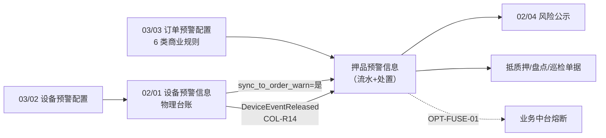
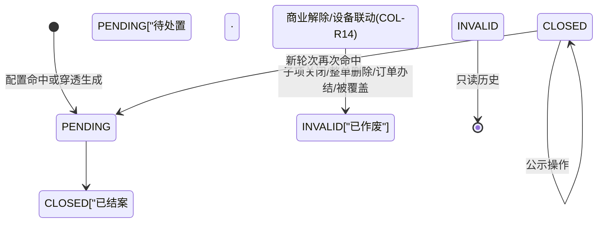

# 押品预警信息主PRD

> **文档体系（三件套为核心）**：
>
> | 层级 | 文档 | 职责 |
> | :--- | :--- | :--- |
> | **核心** | 本文（主 PRD） | 业务背景、范围、架构、**页面功能说明**、场景、状态机摘要、规则摘要、验收 |
> | **核心** | [押品预警信息字段清单](./押品预警信息字段清单.md) | 字段定义、筛选/列表/详情/解除与公示入口、展示顺序与控件规格 |
> | **核心** | [押品预警信息业务规则规格](./押品预警信息业务规则规格.md) | 状态机本体、R/C/P 规则、时序图、流转表 |
> | *衍生* | ASCII 线框 / Demo 文档 | 由三件套派生的可视化与原型输入，**非独立真源** |
>
> **版本**：V3.5 | 2026-09-11
> **读者**：研发工程师、测试工程师、风控经理、信贷审批员、架构师
> **所属模块**：02-预警信息 / 02-押品预警信息 | **菜单路径**：PC `预警信息 → 押品预警信息`；移动 `项目监管 → 预警管理 → 订单预警`
> **模板选型**：台账流水类（[5-2-2 台账流水类 PRD 模板](../../../../05-常用模板/需求处理/5-2-2%20(输出)台账流水类PRD模板.md)）
>
> **规则来源**：预警状态机、生成/解除/去重/穿透联动与权限详见《[押品预警信息业务规则规格](./押品预警信息业务规则规格.md)》——**规则 ID 以该文件为唯一定义来源，本文仅摘要引用**
> **字段基准**：《[押品预警信息字段清单](./押品预警信息字段清单.md)》为字段唯一定义来源
> **权限基准**：[00-全局契约与RBAC权限矩阵](../../00-全局契约与RBAC权限矩阵.md) 第四章 §1
> **跨文档引用规范**：[B-迭代需求跨文档引用口径与来源索引](../../../README.md)，本模块引用 REF-SEVERITY、REF-ORDER、REF-RBAC、REF-NOTIFY。
>
> **衍生文档（可视化 / 原型）**：
> - **ASCII 线框**：[列表页](./押品预警信息_ASCII_列表页.md) · [详情页](./押品预警信息_ASCII_详情页.md) · [移动端](./押品预警信息_ASCII_移动端.md)
> - **Demo 输入**：[列表页](./押品预警信息_Demo_列表页.md) · [详情页](./押品预警信息_Demo_详情页.md) · [移动端](./押品预警信息_Demo_移动端.md)
> - **原型 DEV**：PC [`/物联网IOT与预警/预警信息/押品预警信息`](http://localhost:5173/#/物联网IOT与预警/预警信息/押品预警信息) | H5 [`/m/supervision/order-warnings`](http://localhost:5173/#/m/supervision/order-warnings)

> **当前订单范围（2026-09-11）**：监管订单当前关闭。当前新预警仅关联抵押/质押订单；历史监管预警仅按权限保留查询、详情、审计和资料查看，不产生新流水，不提供订单处置、公示或其他写操作。

---

### 1. 业务背景

质押物价值下跌、质押率突破警戒线、解押超时、盘点巡检缺失、贷中模型拒绝，以及仓内 L4/L5 级物理破坏事件，均直接威胁资金方贷款安全。

**押品预警信息**是 **03/03 订单预警配置** 下的信息菜单，作为订单级风险流水的**承接中枢与处置工作台**。6.2 架构下，为了保证业务纯粹性与风控清晰度，系统推行**全新实时预警与历史数据彻底归档隔离**机制：

1. **全新实时预警承接（本页面）**：
   - **[03/03 订单预警配置](../../03-预警配置/03订单预警配置/订单预警配置主PRD.md)** 命中的 **6 类商业风控预警**（来源=`ORDER_CONFIG`）；
   - **物联穿透引擎**自动生成的「物联穿透告警」（来源=`IOT_PENETRATION`，只读生成，不可押品页人工解除）。
2. **历史存量预警归档（后端独立归档）**：
   - 6.1 及存量历史割接产生的预警流水，由系统底层与历史数据库归档存储隔离；侧边菜单不外露历史菜单项，押品预警信息主页面不展示历史 Banner 或提示条，确保业务界面纯净，仅承接全新的 6.2 实时在押预警。

本模块提供固定模板文案、03/01 动态等级标签（保存 `severity_level_id` 与触发快照）、列表去重投影、跳转抵质押单据处置、穿透类联动 [02/01设备预警信息](../01设备预警信息/设备预警信息主PRD.md) 核销、超时升级及风险公示的全流程闭环。（**6.2 不在 UI 展示业务熔断状态**；后台 `fuse_status` 恒 `NONE`，OPT-FUSE-01 启用后开放）

订单与位置快照按货物明细逐项保存 `cargoItems[]`。详情页在同一行对齐展示每个货物的「货物位置」与「大类 / 品类 / 规格 - 在押数量+单位」；缺失的分类或规格字段不渲染，后续移库、出库不回写历史快照。

---

### 2. 功能范围

**包含范围 (In Scope)**：

- 预警流水列表与复合检索：订单号、预警类型（7 类，支持大类及子类型级联）、03/01 当前启用等级、预警来源（订单配置触发 / 物联穿透）、预警状态、是否公示、时间范围
- **7 类预警承接**：6 类配置触发 + 物联穿透告警
- **纯净界面**：侧边栏不展示历史菜单，页面顶部不展示历史横幅，保持生产级业务页面原生感
- **`fuse_status` 后台持久化**：6.2 恒 `NONE`，**不在列表/详情 UI 展示**；COL-F01~F04 / OPT-FUSE-01 启用后开放列与筛选项
- 固定模板与触发快照：商业类沿用 6.1 模板；穿透类新增设备事件快照模板
- 展示去重：待处置 · 有效/已结案 · 有效按类型化规则投影（C05~C10），不删除原始记录
- 处置闭环：列表「解除预警」跳转抵质押订单信息页（R31）、订单内办结/人工解除（R32~R33 回写）、穿透类「查看设备事件」+ `DeviceEventReleased` 联动自动解除（COL-R14）
- 风险公示：已结案 · 有效单条/批量公示
- 安全与审计：订单数据权限、乐观锁、全路径审计

**排除范围 (Out of Scope)**：

- 纯设备物理台账——归属 [02/01设备预警信息](../01设备预警信息/设备预警信息主PRD.md)
- 预警规则配置——归属 [03/03 订单预警配置](../../03-预警配置/03订单预警配置/订单预警配置主PRD.md) / [03/02设备预警配置](../../03-预警配置/02设备预警配置/设备预警配置主PRD.md)
- 抵质押单据内部审批流——归属单据模块
- 出库/全流程熔断执行——6.2 不阻断；规划见 OPT-FUSE-01（COL-F01~F04 预留）
- 风险对外披露详情页——归属 [02/04 风险公示](../04风险公示/风险公示主PRD.md)
- 穿透类押品页人工解除——禁止（R23 / COL-R14 联动路径唯一）

**移动端范围**：列表、详情、人工核查处理；穿透类支持跳转设备事件详情（只读）。

---

### 3. 模块定位

#### 3.1 在系统中的位置

| 项目 | 内容 |
| :--- | :--- |
| 模块层级 | **02 预警信息 · 流水承接与处置层**（范式 C 流水查询 + 预警状态机） |
| 核心职责 | 承接订单级风险流水，驱动处置、熔断字段预留、穿透联动解除、公示 |
| 写入来源 | 订单配置引擎（6 类）+ 穿透投影引擎（物联穿透，只读） |
| 上游 | **03/03 订单预警配置**提供有效子项、订单 ID/类型、命中值与阈值、规则版本、03/01 等级快照、通知/升级策略和来源事件；**02/01设备预警信息**提供设备事件 ID、设备/空间快照和 `sync_to_order_warn` 结果，满足在押订单空间匹配后才生成物联穿透记录；**估值、贷中、盘点、巡检**提供对应商业子项的计算结果、任务状态和责任人。列表、详情、跳转、解除、公示均按租户、订单数据权限和跨域复合权限服务端校验。来源：[跨文档引用口径与来源索引](../../../README.md) REF-SEVERITY/REF-ORDER/REF-RBAC/REF-NOTIFY。 |
| 下游 | **抵质押单据**承接商业类「解除预警」跳转和订单内办结/人工解除回写；已结案 · 有效流水满足公示条件后投递 [02/04 风险公示](../04风险公示/风险公示主PRD.md)，公示状态和审计结果回写本流水。**物联穿透**仅消费 02/01 的 `DeviceEventReleased`，按设备事件 ID 幂等将对应待处置穿透记录置为已结案；消息丢失由补偿重放。**业务中台**仅预留 OPT-FUSE-01，6.2 持久化 `fuse_status=NONE`，不执行熔断或解锁。通知发送失败不回滚押品流水，进入补偿队列；订单办结/配置关闭或删除时相关待处置流水置无效并停止升级。来源：[押品预警信息业务规则规格](./押品预警信息业务规则规格.md) R01~R04、R11~R16、C05/C11/C12、N01~N03。 |

#### 3.2 系统链路图

#### 3.3 7 类预警与来源矩阵

| 预警类型 | 预警来源 (`warn_source`) | 等级来源 | 典型解除 |
| :--- | :--- | :--- | :--- |
| 解抵/质押超时 | `ORDER_CONFIG` | 命中策略的 03/01 动态等级快照 | 抵质押订单办结 |
| 价格下跌 | `ORDER_CONFIG` | 命中策略的 03/01 动态等级快照 | 人工核查 / 估值恢复 |
| 盘点异常 | `ORDER_CONFIG` | 命中策略的 03/01 动态等级快照 | 盘点模块完成 |
| 巡检异常 | `ORDER_CONFIG` | 命中策略的 03/01 动态等级快照 | 巡检模块完成 |
| 抵/质押率异常 | `ORDER_CONFIG` | 补仓线/平仓线各自的 03/01 动态等级快照 | 补仓/平仓/结清 |
| 贷中风控预警 | `ORDER_CONFIG` | 命中策略的 03/01 动态等级快照 | 风控复核 / 单据解除 |
| **物联穿透告警** | **`IOT_PENETRATION`（只读）** | **设备规则的 03/01 动态等级快照** | **02/01 核销 → 联动解除** |

#### 3.4 预警内容固定模板（6.2）

| 预警类型 | 标准模板（变量取触发快照） |
| :--- | :--- |
| 解抵/质押超时 | `当前抵/质押物 {品类}-{规格}（{数量}{单位}）未在 {日期} 完成解抵/质押！（阈值{天}天）` |
| 解监管超时 | `当前监管物 {品类}-{规格}（{数量}{单位}）未在 {日期} 完成解监管！（阈值{天}天）` |
| 价格下跌 | `抵/质押物价值下跌！货值已下跌超过{跌幅}%（阈值 {阈值}%）` |
| 盘点异常 | `盘点异常！经盘点发现货物异常，请及时核查处理！` |
| 巡检异常 | `巡检异常！【{巡检人}】未按时巡检，请及时核查处理！` |
| 抵/质押率异常 | `订单抵/质押率异常！触发【{补仓线/平仓线}】，LTV {值}%，贷款余额 {额} 元，质物价值 {值} 元` |
| 贷中风控预警 | `模型：【{模型名}】；分数：【{分数或--}】；描述：【{结果描述}】` |
| **物联穿透告警** | `【物联穿透】{仓库/库房/分区} {设备名称} 发生 {物理事件描述}（{等级}）；关联设备事件 {事件编号}，请至设备事件台账现场核销` |

#### 3.5 触发时刻判定数据快照规范（不可变存证）

详情页「预警事实与位置」区块包含「触发时刻判定数据快照（不可变存证）」结构化卡片，该卡片固化预警触发时刻的历史业务事实，由 **4 列不可变存证字段** 组成（`监控指标项`、`实际触发值`、`规则预警阈值`、`超标判定结果`），不随后续规则阈值调整而改变。

各预警类型快照枚举矩阵与判定标准如下：

| 序号 | 预警类型 | 监控指标项 (`metricName`) | 实际触发值 (`triggerValue`) | 规则预警阈值 (`thresholdValue`) | 超标判定结果 (`deviation`) |
| :--- | :--- | :--- | :--- | :--- | :--- |
| **01** | **贷中风控预警** | 智风控综合评分 | 38.5 分 (高危) | 准入线 60.0 分 | 低于准入线 -21.5 分 (借款企业新增诉讼冻结) |
| **02** | **抵/质押率异常** | 当前抵/质押率 (LTV) | 88.50% | 85.00% (平仓线) / 75.00% (预警补仓线) | 超出平仓警戒线 +3.50% |
| **03** | **价格下跌** | 现货价格跌幅 | -12.80% | -12.00% | 超跌 -0.80% (现货基准价 ¥68,200/吨) |
| **04** | **盘点异常** | 账实盘点差异率 | 差异率 2.30% | 允许公差 2.00% | 超差 +0.30% (盘亏 2.50 吨) |
| **05** | **巡检异常** | 例行巡检时效 | 逾期 24.0 小时 | 计划时限: 08-19 08:00 | 超时未打卡 (责任人: 巡检员刘强) |
| **06** | **解抵/质押超时** | 抵/质押业务存续期限 | 逾期 15 天 | 约定期限: 2026-06-01 | 抵/质押期限届满未办理解押或展期 |
| **07** | **物联穿透告警** | *不适用（传感器硬件异常触发）* | *无商业对比值* | *无静态阈值* | 页面展示固定说明：“由仓储现场物理设备传感器即时异常联动触发，详细指标见下方【穿透信息】” |

---

## 4. 页面功能说明

> 本节描述**做什么、怎么交互**；字段名/控件/列宽见《[字段清单](./押品预警信息字段清单.md)》；线框可视化见衍生 ASCII 文档。

### 4.1 PC 列表页

| 项目 | 说明 |
| :--- | :--- |
| 页面目标 | 查看订单侧 7 类预警流水，筛选后处置/公示/跳转详情 |
| 页面路径 | `/物联网IOT与预警/预警信息/押品预警信息` |
| 骨架结构 | 页头标题 + 筛选 Card + 工具条 + 数据表格 + 底栏提示 + 分页 |

**筛选区**：默认行预警订单、预警类型（7 类多选）、预警等级、预警来源；展开行预警状态（**默认待处置 · 有效** F01）、是否公示、预警时间（**默认近 30 天** F01）。**无**业务熔断状态筛选项（6.2 UI 隐藏）。筛选字段规格见字段清单。

**工具条**：「批量公示风险」（C12，有已结案 · 有效且未公示候选时可点）、「导出」（F04 上限 50,000 行）。

**数据表格**：

- 默认排序：预警时间 DESC（F02）
- 列顺序见字段清单第五章；不展示 Version、业务熔断状态
- 状态 Badge：待处置 · 有效（橙）、已结案 · 有效（绿）、已作废（灰）

**行操作**：

| 状态 + 类型 | 操作列 |
| :--- | :--- |
| 待处置 · 有效 · 商业 6 类 | 解除预警、详情 |
| 待处置 · 有效 · 物联穿透 | 查看设备事件、详情 |
| 已结案 · 有效 · 未公示 | 公示风险、详情 |
| 已结案 · 有效 · 已公示 / 已作废 | 详情 |

| 操作 | 行为 |
| :--- | :--- |
| 解除预警 | 跳转抵质押订单信息页（R31/P04）；无权限弹固定提示 |
| 查看设备事件 | 跳转 `/物联网IOT与预警/预警信息/设备预警信息/详情/:id`（P05） |
| 公示风险 | 公示确认弹窗（C12） |
| 详情 | 跳转 `/物联网IOT与预警/预警信息/押品预警信息/详情/:id` |

**底栏提示**：6.2 不展示「业务熔断状态」列；物联穿透类请至设备预警信息核销。

### 4.2 PC 详情页

| 项目 | 说明 |
| :--- | :--- |
| 页面路径 | `/物联网IOT与预警/预警信息/押品预警信息/详情/:id` |
| 骨架结构 | 页头识别区 → 基本信息 → 订单与仓储快照 → 预警事实与触发判定 → [穿透信息] → [处置信息/无效说明] |

**页头动作**（`getDetailHeaderActions`）：

| 状态 | 类型 | 页头按钮 |
| :--- | :--- | :--- |
| 待处置 · 有效 | 商业 6 类 | 返回 / 解除预警 |
| 待处置 · 有效 | 物联穿透 | 返回 / 查看设备事件 |
| 已结案 · 有效 | 任意 | 返回 / 公示风险（未公示时） |
| 已作废 | 任意 | 返回 |

**内容分区**（只读，DetailSection + 4 列 Grid）：

| 分区 | 内容要点 |
| :--- | :--- |
| 基本信息 | 预警订单、预警类型、等级、来源、规则名称、Version |
| 订单与仓储快照 | 订单类型、货主、`cargoItems[]` 逐行对齐「货物位置」与「大类/品类/规格-数量」 |
| 预警事实 | 预警内容（§3.4 模板）、触发时间、抓拍图、触发判定数据快照（4 列不可变存证） |
| 穿透信息 | 仅物联穿透：触发设备、物理子类型、触发位置；**无**人工解除入口（R23） |
| 处置信息 | 仅已结案 · 有效：处理时间/人、情况说明、现场照片、解除抓拍 |
| 无效说明 | 仅已作废：无效原因（C11） |

> 6.2 Demo 不展示「业务熔断状态」；是否公示由页头「公示风险」控制（C12）。

### 4.3 H5 移动端

| 项目 | 说明 |
| :--- | :--- |
| 能力范围 | 列表、筛选、详情、商业类解除跳转、穿透类看设备事件、单条/批量公示 |
| 不支持 | 本模块人工解除表单、列表导出、业务熔断 UI |
| 列表路径 | `/m/supervision/order-warnings` |
| 筛选 | 顶部胶囊：类型、等级、状态（默认待处置 · 有效）、来源；抽屉：订单、时间等 |
| 列表形态 | 卡片：订单号、等级、类型、来源、内容摘要、时间、状态；底链按 PC 行操作矩阵 |
| 详情 | 页头摘要灰框 + 折叠手风琴（触发快照/穿透/处置/无效） |
| 批量公示 | 进入勾选模式 → 仅已结案 · 有效且未公示可选 → 确认弹窗（C12） |

---

### 5. 功能清单

| 功能编号 | 功能名称 | 适用角色 | PC 端 | 移动端 | 关键控制（规则引用） |
| :--- | :--- | :--- | :--- | :--- | :--- |
| COL-01 | 预警流水列表与筛选 | 订单预警查看权限 | 7 类/等级/来源/状态筛选 | 列表、筛选 | P01~P02 订单数据权限 |
| COL-02 | 查看详情 | 订单预警查看权限 | 等级、来源、快照 | 详情 | 含穿透类设备事件关联；多货物位置与货物信息按序号对应展示 |
| COL-03 | 解除预警（商业类） | 订单操作员+项目权限 | 跳转抵质押订单信息 | 解除预警 | P04；R31 无权限固定提示 |
| COL-04 | 订单内人工解除 | 风控处理权限 | 情况说明、照片、解除抓拍（**抵质押订单内**） | — | R32；穿透类 R23 禁止 |
| COL-05 | 查看设备事件 | 风控+IoT 查看权限 | 穿透类跳转 02/01 详情 | 跳转设备事件 | P05 仓库/订单复合校验 |
| COL-06 | 业务熔断字段（后台） | 系统 | 6.2 UI 不展示 | — | 后台 `fuse_status=NONE`；C01~C04 / OPT-FUSE-01 预留 |
| COL-07 | 穿透联动自动解除 | 系统任务 | 设备核销后自动已结案 · 有效 | — | **COL-R14** `DeviceEventReleased` |
| COL-08 | 公示风险/批量公示 | 风控公示权限 | 单条/批量候选 | 单条底链 + 列表批量勾选 | 仅已结案 · 有效且未公示 |
| COL-09 | 列表去重投影 | 系统任务 | 按类型化去重键展示 | — | C05~C10；不删原始记录 |

---

### 6. 业务场景

| 场景ID | 场景 | 类型 | 说明 |
| :--- | :--- | :--- | :--- |
| S01 | 配置触发 L4 质押率预警 | **主流程** | 订单配置命中 → 生成流水 → 来源=订单配置 → 点击解除预警跳转抵质押订单 |
| S02 | L5 穿透告警生成 | **主流程** | 02/01 物理事件 + sync=是 → 投影物联穿透 → 关联设备事件ID → 无人工解除入口 |
| S03 | 设备事件核销联动解除 | **主流程** | 02/01 现场核销 → 发布 DeviceEventReleased → COL-R14 置押品已结案 · 有效 |
| S04 | 价格下跌订单内解除 | **支线** | 抵质押订单内填写说明 → 解除抓拍 → 已结案 · 有效→ 可选公示 |
| S05 | 配置删除置无效 | **支线** | 01 整单软删除 → 关联待处置置「已作废」；系统自动失效不置无效 |
| S06 | 批量公示 | **支线** | 勾选已结案 · 有效且未公示 → 批量候选 → 联动 02/04 风险公示 |
| S07 | 穿透类误点人工解除 | **异常** | API 层 R23 拒绝；前端不展示「解除预警」 |
| S08 | DeviceEventReleased 丢失 | **异常** | 补偿任务按事件 ID 重放 COL-R14（EC-02） |

---

### 7. 状态机

> **完整定义**（状态枚举、流转表、动作矩阵）见《[押品预警信息业务规则规格](./押品预警信息业务规则规格.md)》第二至五章。以下为摘要。

#### 7.1 预警状态

| 状态 | 含义 | 是否终态 |
| :--- | :--- | :---: |
| 待处置 · 有效 | 待处置的有效预警，列表可操作 | 否 |
| 已作废 | 被子项关闭、整单删除、订单办结或同类型覆盖，只读 | **是** |
| 已结案 · 有效 | 商业解除/设备联动解除完成，可公示 | 否* |

\* 已结案后可因新轮次再次命中回到「待处置 · 有效」。

#### 7.2 状态机图（摘要）

#### 7.3 动作能力矩阵（摘要）

| 动作 | 待处置 · 有效商业类 | 待处置 · 有效穿透类 | 已结案 · 有效 | 已作废 |
| :--- | :---: | :---: | :---: | :---: |
| 查看详情 | ✅ | ✅ | ✅ | ✅ |
| 解除预警 | ✅ | ❌ | ❌ | ❌ |
| 订单内人工解除 | ✅* | **❌** | ❌ | ❌ |
| 查看设备事件 | ❌ | ✅ | ❌ | ❌ |
| 公示风险 | ❌ | ❌ | ✅** | ❌ |

\* 列表入口统一「解除预警」跳转抵质押订单；订单内人工解除（如价格下跌）在抵质押模块完成；\*\* 且未公示。

---

### 8. 核心业务规则

> 规则本体见业务规则规格；此处仅列高风险摘要。

#### 8.1 生成与穿透

| 规则ID | 规则摘要 |
| :--- | :--- |
| R01~R04 | 6 类配置触发：幂等、等级快照、配置失效联动 |
| R11~R16 | 物联穿透：02/01 前置、空间拓扑、幂等、不重复物理通知 |
| R23 | **穿透类禁止押品页人工解除** |

#### 8.2 解除与联动

| 规则ID | 规则摘要 |
| :--- | :--- |
| **COL-R14** | 消费 **02/01** 发布的 `DeviceEventReleased`；按设备事件 ID 幂等置已结案 · 有效 |
| R31~R33 | 商业类解除预警跳转/订单内人工解除/业务回写 |

#### 8.3 熔断（6.2 deferred）

| 规则ID | 规则摘要 |
| :--- | :--- |
| COL-F01~F04 → C01~C04 | **6.2 不生效**；`fuse_status` 恒 `NONE`；OPT-FUSE-01 后启用 |

#### 8.4 去重投影

| 规则ID | 规则摘要 |
| :--- | :--- |
| C05~C10 | 商业/穿透/已结案 · 有效分类型去重键；仅列表投影 |

---

### 9. 权限设计

#### 9.1 数据可见范围

| 角色 | 可见数据范围 | 说明 |
| :--- | :--- | :--- |
| R-SYS-ADMIN | 本租户全部押品预警 | 含公示 |
| R-RISK-MGR / R-RISK-OFF | 订单数据权限内流水 | 查看/处理/公示 |
| R-ORDER-OP | 管辖项目订单流水 | 解除预警跳转须项目管理权限 |
| R-VIEWER | 订单数据权限内（只读） | 无写操作 |

#### 9.2 操作权限矩阵

| 操作 | R-SYS-ADMIN | R-RISK-MGR | R-RISK-OFF | R-ORDER-OP | R-VIEWER |
| :--- | :---: | :---: | :---: | :---: | :---: |
| 查看列表/详情 | ✅ | ✅ | ✅ | ✅ | ✅ |
| 解除预警 | ✅ | ✅ | ✅ | ✅* | ❌ |
| 人工解除 | ✅ | ✅ | ✅ | ❌ | ❌ |
| 查看设备事件 | ✅ | ✅ | ✅ | ❌ | ❌ |
| 公示/批量公示 | ✅ | ✅ | ❌ | ❌ | ❌ |

\* 须同时具备项目管理菜单权限（P04）。

> 以 [00-全局契约与RBAC权限矩阵](../../00-全局契约与RBAC权限矩阵.md) 为准。

---

### 10. 边界与异常处理

#### 10.1 并发控制

| 场景 | 处理方式 |
| :--- | :--- |
| 人工解除与业务回写并发 | 乐观锁 + 状态校验，失败提示刷新 |
| 穿透联动与人工解除并发 | R23 拒绝人工；COL-R14 优先 |

#### 10.2 幂等操作约束

| 操作 | 幂等规则 |
| :--- | :--- |
| 配置触发 | `租户+订单+预警类型+来源事件ID` |
| 穿透生成 | `租户+订单+设备事件ID` |
| COL-R14 联动 | `设备事件ID` 幂等更新 |

#### 10.3 上下游不一致

| 场景 | 处理方式 |
| :--- | :--- |
| 穿透生成但无 IoT 权限 | 押品可见；「查看设备事件」隐藏或 403 |
| DeviceEventReleased 消息丢失 | 补偿任务按事件 ID 重放 COL-R14 |
| 6.1 历史 IoT 类待处置 | 迁移策略决定置已作废或保留；新事件走穿透 |

---

### 11. 验收重点

| # | 验收项 | 输入条件 | 预期结果 |
| :--- | :--- | :--- | :--- |
| V01 | L4 穿透生成 | 02/01 L4 事件 + sync=是 + 在押订单 | 列表展示等级、来源=物联穿透、fuse=**无熔断** |
| V02 | 设备事件核销联动 | 02/01 核销关联事件 | COL-R14 自动已结案 · 有效；处理人=系统自动 |
| V03 | L5 贷中拒绝不阻断出库 | 配置触发 L5 + 发起出库 | **放行**；fuse_status=NONE |
| V04 | 解除预警无权限 | 无项目管理权限点解除预警 | 固定提示文案，不跳转 |
| V05 | 穿透类无人工解除 | 物联穿透待处置记录 | 不展示「解除预警」，仅「查看设备事件」 |
| V06 | 穿透 API 拒绝 | 穿透类调人工解除 API | R23 拒绝，错误码对齐 COL-R14 域 |
| V07 | 列表去重 | 同订单同类型多条待处置 | 列表投影 1 条；原始记录保留 |
| V08 | 批量公示 | 勾选已结案 · 有效且未公示 | 进入公示候选；已公示不可重复 |
| V09 | 整单删除联动 | 01 规则软删除 | 关联待处置→已作废；系统自动失效不置已作废 |
| V10 | 6.1 历史 IoT | 历史五类硬件订单预警 | 只读展示；新事件不再按旧类型生成 |
| V11 | 图片权限 | 无订单权限换图 | P06 阻断签名 URL |
| V12 | 订单办结 | 订单出库完毕 | 待处置 · 有效置已作废；已结案 · 有效保留 |

---

### 修订记录

| 日期 | 版本 | 变更摘要 |
| :--- | :---: | :--- |
| 2026-08-19 | V1.8 | 6.1 基准（见 03风险信息（基准）） |
| 2026-08-20 | V2.0 | 6.2 独立信息菜单：7 类、L1~L5、熔断、穿透联动 |
| 2026-08-20 | V2.1 | 口径统一：fuse 恒 NONE；穿透跳转 02/01 |
| 2026-08-20 | **V3.0** | **6.2 标杆重构**：对齐 第1~10章；排除范围 (Out of Scope)；S01~S08；V01~V12；状态机与 COL-* 规则下沉 唯一定义来源；拆分 ASCII 列表/详情 |
| 2026-08-21 | V3.1 | 包含范围 (In Scope) 筛选口径对齐字段清单第五章：去掉「货主/货物」，补「是否公示」 |
| 2026-08-21 | V3.2 | 「解除预警」统一跳转抵质押订单信息页；COL-04 明确为订单内人工解除 |
| 2026-09-08 | **V3.3** | **历史预警独立归档**：将历史产生的预警剥离至独立菜单与页面【历史押品预警】，当前【押品预警信息】作为全新的 6.2 实时在押风险流转中心 |
| 2026-09-10 | **V3.4** | **多货物快照与详情排版对齐**：订单快照改为 `cargoItems[]`，详情按货物序号对齐展示货物位置与大类/品类/规格-数量 |
| 2026-09-11 | **V3.5** | **对齐三件套标杆**：补 §4 页面功能说明；三件套/衍生文头；章节重编号 |
