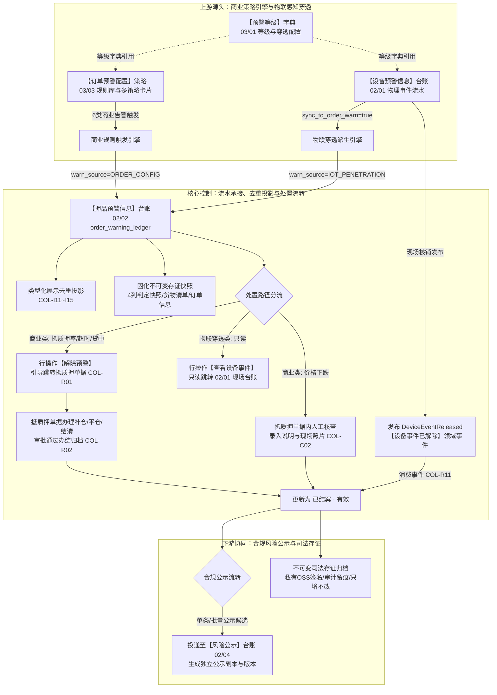
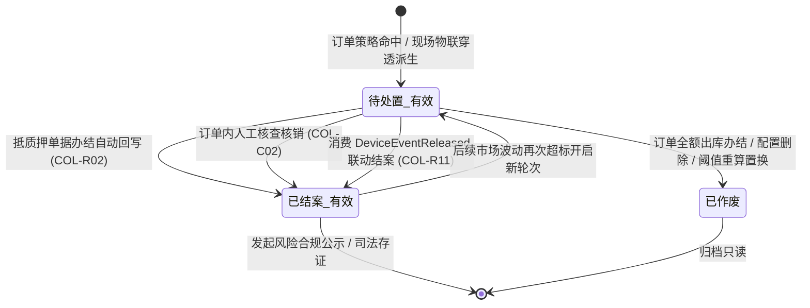

# 押品预警信息主PRD

> **版本**：V4.0 | 2026-09-18  
> **读者**：研发工程师、测试工程师、金融风控经理、信贷审批员、架构师  
> **所属模块**：02-预警信息 / 02-押品预警信息 | **菜单路径**：PC端 `预警信息 → 押品预警信息`；移动端 `项目监管 → 预警管理 → 订单预警`  
> **模板选型**：台账流水类（[4-2-2 (输出)台账流水类PRD模板](../../../../05-常用模板/需求处理/4-2-2%20(输出)台账流水类PRD模板.md)）
>
> **文档体系（三件套为唯一核心真源）**：
>
> | 层级 | 文档 | 职责 |
> | :--- | :--- | :--- |
> | **核心** | 本文（主 PRD） | 业务背景、功能范围对比、模块定位与系统链路、**页面功能说明**、业务场景四列故事、状态机摘要、规则摘要、验收标准 |
> | **核心** | [押品预警信息字段清单](./押品预警信息字段清单.md) | 11 列标准字段字典、筛选/列表/详情/解除跳转与公示入口、展示顺序与控件规格 |
> | **核心** | [押品预警信息业务规则规格](./押品预警信息业务规则规格.md) | 状态机本体、LaTeX 数量与计算口径、7 列动作能力矩阵、COL-* 规则本体、异常边界与时序推演 |
> | *衍生* | ASCII 线框 / Demo 文档 | 由三件套派生的可视化与原型输入，**非独立真源** |
>
> **跨模块引用标准**：
> - 商业策略规则源头：【订单预警配置】策略（菜单：`预警配置 → 订单预警配置`，代号 03/03）
> - 字典与穿透配置源头：【预警等级】字典（菜单：`预警配置 → 预警等级`，代号 03/01）
> - 物理硬件告警与联动源头：【设备预警信息】台账（菜单：`预警信息 → 设备预警信息`，代号 02/01）
> - 合规信息披露台账：【风险公示】台账（菜单：`预警信息 → 风险公示`，代号 02/04）
> - 全局权限矩阵依据：[00-全局契约与RBAC权限矩阵](../../00-全局契约与RBAC权限矩阵.md) 第四章 §1

---

## 1. 业务背景与业务痛点

### 1.1 业务背景与台账定位
在动产质押与供应链金融监管业务中，质押物市场行情暴跌、抵质押率突破平仓警戒线、借款企业贷中资信恶化、盘点巡检账实不符，以及仓储现场发生物理破坏与越界移库等突发事件，均直接威胁资金方的信贷资金本息安全。  
**押品预警信息**是面向抵押、质押及监管服务订单打造的**订单级与押品级风险流水承接中枢与处置工作台**。本模块承接来自【订单预警配置】（03/03）命中的 6 类商业风控预警，以及来自【设备预警信息】（02/01）现场物理硬件告警自动派生的“现场物联穿透告警”（只读生成）。系统通过标准化固定内容模板、动态预警等级渲染、展示分类去重投影、引导跳转抵质押单据核销、跨域消费 `DeviceEventReleased` 领域事件联动结案及合规风险公示，构建起严密的“货-仓-金”全链路金融风控闭环。

### 1.2 核心业务痛点
* **痛点 1：商业信贷风险感知滞后**：质押大宗商品价格波动频繁，人工盯市难以实时计算各订单动态抵质押率，往往导致错失补仓或平仓的最佳处置窗口；
* **痛点 2：物理仓储告警与信贷资产割裂**：仓库内发生的断电、红外遮挡或门禁非法破锁等物理告警仅停留在设备运维层面，信贷审批员与风控总监无法直观获知在押动产是否面临实质灭失风险；
* **痛点 3：多源预警处置缺乏统一标准化闭环**：传统模式下告警处置流程各异，缺乏直接联动抵质押单据办理补仓/平仓的自动化引导，且现场物联告警容易在押品端被误操作口头解除；
* **痛点 4：缺乏不可变的司法存证证据链**：预警触发时刻的历史业务事实（货值、贷款余额、阈值快照）容易被后续规则配置变更所篡改，难以满足司法诉讼与外部审计的合规举证要求。

---

## 2. 功能范围 (In / Out of Scope)

| 包含功能范围 (In Scope) | 不包含功能范围 (Out of Scope) |
| :--- | :--- |
| - **7 类预警流水统一承接**：承接 6 类商业风控预警（解押超时、价格下跌、盘点异常、巡检异常、抵质押率异常、贷中风控）及 1 类“现场物联穿透告警”； - **多维复合检索与列表投影**：支持订单号、7 类预警类型、启用等级、预警来源（订单配置/物联穿透）、预警状态、是否公示等组合检索；按类型化去重键进行展示投影； - **固定内容模板与不可变存证快照**：固化触发时刻 4 列判定数据快照（监控指标项、实际触发值、规则预警阈值、超标判定结果），规则阈值修改不回写； - **商业类引导处置闭环**：列表点击【解除预警】无缝跳转抵质押单据办理补仓、平仓或还款结清（COL-R01），单据办结自动回写结案； - **物联穿透闭环与联动解除**：穿透流水押品侧只读（COL-C01 强禁人工解除），消费 02/01 `DeviceEventReleased` 领域事件自动联动结案（COL-R11）； - **风险公示快速流转**：支持已结案有效流水单条确认公示或批量投递至【风险公示】台账（02/04）； - **纯净界面与历史归档隔离**：全新 6.2 实时流水展示，历史割接流水由底层独立归档存储，不外露历史菜单项与提示横幅； - **移动端协同**：H5 支持列表查询、详情快照、商业类解除跳转、穿透类跳转设备事件及单条/批量公示。 | - **设备物理运行台账**：纯硬件资产状态与现场核销归属【设备预警信息】（菜单：`预警信息 → 设备预警信息`，代号 02/01）； - **预警规则策略配置**：订单策略配置归属【订单预警配置】（菜单：`预警配置 → 订单预警配置`，代号 03/03）； - **抵质押业务单据内部审批流**：补仓、平仓及还款单据内部审批流转归属抵质押业务模块； - **出库风控全流程熔断**：6.2 版本后台持久化 `熔断状态=无熔断（NONE）`，不在 UI 展示熔断列，不阻断正常出库业务流转（相关能力后置规划）； - **外部合规监管报送直连**：外部监管机构直连接口上报由外部独立合规报送平台负责； - **穿透类押品页人工直接解除**：严格禁止在押品预警页面直接对现场物联穿透告警录入情况说明或人工销案。 |

---

## 3. 模块定位与系统链路

### 3.1 模块定位说明
【押品预警信息】台账（02/02）位于系统“风控信息与业务处置层”，上游承接商业风控规则引擎与现场物联感知引擎，横向驱动抵质押业务单据流转，下游打通合规风险公示与司法存证。

### 3.2 系统端到端全景链路图

---

## 4. 业务场景与用户故事

| 场景编号与名称 | 触发角色 | 核心交互与风控约束 | 业务价值 |
| :--- | :--- | :--- | :--- |
| **场景 1【抵质押率超标引导处置】(S01)** | 动态风控盯市引擎 | 质押电解铜市场价格下跌，某笔质押订单实时抵质押率达 88.50%，突破规则配置的平仓警戒线（85.00%）。系统生成 `待处置 · 有效` 预警，风控人员在列表点击【解除预警】，系统引导跳转至该抵质押单据办理追加质押物或追加保证金，单据办结后自动回写预警结案。 | 消除信息断层，实现风险告警向金融业务挽损操作的自动化引导与闭环。 |
| **场景 2【现场物联破坏穿透告警】(S02)** | 现场物联感知引擎 | 监管仓库 3 号库房电子挂锁遭暴力破拆，设备预警台账（02/01）触发 L4 级告警且等级开启穿透，系统匹配该库房存在在押质押订单，自动在押品预警生成一条“现场物联穿透告警”，状态为 `待处置 · 有效`，操作列仅展示【查看设备事件】，严格禁止押品侧人工解除。 | 穿透底层物理安全至金融货权，杜绝现场违规在资金端被随意违规核销。 |
| **场景 3【设备核销跨域联动结案】(S03)** | 跨域协同总线 | 现场监管员在设备预警台账（02/01）排查挂锁故障并完成人工解除。系统发布 `DeviceEventReleased` 领域事件，押品预警台账监听消费后，按设备事件 ID 幂等自动将对应穿透预警流转为 `已结案 · 有效`，处理人记录为“系统自动处理”。 | 实现物理现场处置与金融货权风控的跨系统自动化同步，大幅降低沟通成本。 |
| **场景 4【现货价格下跌人工核实】(S04)** | 现场风控员 | 监控钢材现货价格下跌超阈值产生预警。风控员跳转进入抵质押订单详情，现场核实货物保管完好并由借款企业出具保价函，在订单内录入 1~200 字核查说明与照片提交解除，系统更新预警为 `已结案 · 有效`。 | 规范现场价格复核标准，图文留痕满足全周期信贷审计要求。 |
| **场景 5【配置阈值调整重算置换】(S05)** | 风控管理人员 | 管理人员在 03/03 中将平仓线由 85% 调整为 88%。系统启动全量在押订单阈值重算：仍命中新阈值且存在未解除预警的，旧流水变更为 `已作废`（作废原因：预警配置阈值调整重算置换），同时派生新流水推送；不命中者保留旧流水。 | 保证风控流水与当前生效策略时刻严密对齐，历史变迁清晰可查。 |
| **场景 6【重大风险合规公示发布】(S06)** | 信贷合规经理 (`R-RISK-MGR`) | 某质押订单因严重违约完成平仓并结案，合规人员在列表复选勾选该条记录，点击【批量公示风险】，弹出确认弹窗后投递至【风险公示】台账（02/04），生成不可变公示快照。 | 落实金融监管合规披露要求，发挥行业失信惩戒与威慑作用。 |

---

## 5. 状态机与动作能力矩阵

### 5.1 状态定义
押品预警流水采用“处理状态 + 记录有效性”组合三态标准词表：

| 状态名称 | 状态编码 | 业务含义 | 是否终态 | 进入条件 | 退出条件 |
| :--- | :--- | :--- | :---: | :--- | :--- |
| **待处置 · 有效** | `PENDING_VALID` | 预警事件已触发且订单处于在押存续期，尚未完成业务处置 | 否 | 订单策略命中或物联穿透派生产生 | 抵质押单据办结回写；订单内人工解除；设备联动结案；配置修改重算置换 |
| **已结案 · 有效** | `RESOLVED_VALID` | 风险已消除，经单据办结核销、人工核实结案或设备联动解除，归档只读 | 否* | 单据办结回写；订单内解除成功；消费 `DeviceEventReleased` 联动结案 | 新业务周期同规则再次超标命中开启新轮次 |
| **已作废** | `PENDING_INVALID` | 订单全额解押出库、配置规则删除、子项关闭或阈值调整重算置换 | **是** | 订单履约出库办结；配置侧软删除；配置阈值调整重算置换 | —（不可逆终态） |

\* 注：`已结案 · 有效` 对单次风险事件为终态；同一订单若在后续市场波动中再次超标，将开启全新预警轮次并生成新流水行。

### 5.2 状态流转图

### 5.3 动作在各状态下的可用性矩阵

| 动作名称 | 待处置 · 有效（商业类） | 待处置 · 有效（物联穿透） | 已结案 · 有效（未公示） | 已结案 · 有效（已公示） | 已作废 (`PENDING_INVALID`) |
| :--- | :---: | :---: | :---: | :---: | :---: |
| **查看详情** | **✅** | **✅** | **✅** | **✅** | **✅** |
| **解除预警 (跳转单据)** | **✅ (COL-R01)** | ❌ (入口不展示) | ❌ (入口不展示) | ❌ (入口不展示) | ❌ (入口不展示) |
| **查看设备事件** | ❌ (入口不展示) | **✅ (跳转02/01)** | ❌ (入口不展示) | ❌ (入口不展示) | ❌ (入口不展示) |
| **订单内人工解除** | **✅ (抵质押单据内)** | ❌ (强阻断 COL-C01) | ❌ | ❌ | ❌ |
| **发起风险公示** | ❌ | ❌ | **✅ (COL-R21)** | ❌ (已公示禁止重复) | ❌ |
| **批量公示勾选** | ❌ (复选框禁用) | ❌ (复选框禁用) | **✅ (复选框激活)** | ❌ (复选框禁用) | ❌ (复选框禁用) |

---

## 6. 页面交互规格索引

### 6.1 PC 端列表页
* **页面路由**：`/物联网IOT与预警/预警信息/押品预警信息`
* **筛选区布局**：
  - 第一行常驻：预警订单（文本框模糊匹配）、预警类型（7 类下拉多选）、预警等级（单选下拉，读取 03/01 租户启用等级）、预警来源（单选下拉：订单配置 / 现场物联穿透）；
  - 第二行展开：预警状态（下拉多选，默认勾选 `待处置 · 有效`）、是否公示（单选下拉）、预警时间（日期时间范围，默认最近 30 天）；
  - 特别说明：页面无“业务熔断状态”列与筛选项（6.2 版本 UI 隐藏）；
* **工具条与批量操作**：
  - 工具条常驻【批量公示风险】按钮（当列表中有且仅勾选处于 `已结案 · 有效` 且从未公示的记录时激活）与【导出】按钮（上限 50,000 行）；
* **数据表格核心列**：
  - 复选框、序号、预警订单、预警类型、预警等级、预警来源、预警内容、预警时间、处理信息（处理人/处理时间两行合并）、预警状态、是否公示、操作列；
* **行操作列门控**：
  - 待处置有效 · 商业类：展示【解除预警】与【详情】；
  - 待处置有效 · 物联穿透：展示【查看设备事件】与【详情】；
  - 已结案有效 · 未公示：展示【公示风险】与【详情】；
  - 已结案有效 · 已公示/已取消：展示【查看公示】与【详情】；
  - 已作废：仅展示【详情】。

### 6.2 PC 端详情页
* **页面路由**：`/物联网IOT与预警/预警信息/押品预警信息/详情/:id`
* **顶栏与操作区**：展示订单号与预警状态标签；满足门控时右上角展示【解除预警】或【查看设备事件】或【公示风险】；
* **五大结构化分区**：
  1. **基本信息**：预警订单编号、预警类型、预警严重度等级、预警来源、规则名称、Version；
  2. **订单与仓储快照**：订单类型（抵押/质押/监管服务）、借款企业名称、监管仓库名称；质押货物明细清单逐行对齐展示“货物存储位置”与“品类/规格/在押数量”；
  3. **预警事实与触发判定**：预警内容固定模板、触发时间、监控抓拍图；结构化展示 **4 列不可变存证判定卡片**（监控指标项、实际触发值、规则预警阈值、超标判定结果）；
  4. **穿透信息专区**（仅物联穿透告警展示）：触发物理设备名称、硬件子类型、关联设备事件编号（提供 Deep Link 跳转 02/01 详情）；
  5. **处置信息/作废说明**：已结案展示核销人、核销时间、情况说明、现场照片；已作废展示作废原因。

### 6.3 H5 移动端体验
* **页面路由**：`/m/supervision/order-warnings`
* **核心能力**：
  - 顶部单输入框仅支持按预警订单号模糊搜索；胶囊筛选（类型、等级、状态、来源）；
  - 卡片式流式布局，展示订单号、预警类型徽标、触发时间、等级色值与状态；
  - 商业类卡片底栏提供【解除预警】直跳对应移动端订单；穿透类提供【查看设备事件】；
  - 支持进入“勾选模式”对已结案未公示流水进行批量公示操作。

---

## 7. 核心业务规则索引与非功能需求

### 7.1 核心规则索引速查
* **COL-T01~T04 【商业预警配置触发与生命周期管理规则】**：配置命中即落账，固化 03/01 等级与策略快照；
* **COL-T11~T16 【物联穿透告警派生与空间匹配规则】**：02/01 设备告警开启穿透且库区存在在押订单时自动派生；
* **COL-C01 【物联穿透类禁止押品端人工直接解除规则】**：强禁在押品端人工解除物联穿透，保证现场设备核销唯一性；
* **COL-C02 【抵质押单据内人工核查核销规则】**：价格下跌等特定类型在抵质押单据内闭环核销；
* **COL-R01 【商业类预警引导跳转单据处置规则】**：列表点击【解除预警】精准直跳抵质押单据；
* **COL-R02 【抵质押单据办结自动回写结案规则】**：单据补仓、平仓或结清审批办结后自动回写押品预警为 `已结案 · 有效`；
* **COL-R11 【设备事件解除跨域联动结案规则】**：消费 `DeviceEventReleased` 领域事件，按事件 ID 幂等自动结案；
* **COL-R21 【重大已结案预警合规风险公示规则】**：已结案有效记录支持单条或批量向 02/04 投递不可变公示副本；
* **COL-I11~I15 【列表类型化展示去重投影算法规则】**：基于订单、类型、状态进行前端投影去重，不删除底层流水；
* **COL-P01~P06 【订单数据权限与跨模块鉴权控制规则】**：基于管辖项目与订单数据权限行级隔离。

### 7.2 性能与大数据量防护
* **物理分页与复合索引**：基于 `(tenant_id, order_id, warning_time)` 建立联合索引，单页限制 20 条；
* **大字段投影分离**：列表查询仅拉取摘要信息，质押货物明细清单与判定快照仅在详情按需加载；
* **不可变存证安全**：触发时刻 4 列判定快照存库后设为只读，OSS 抓拍图采用时效防盗链签名。

---

## 8. 验收重点与预期结果

| 序号 | 验收测试项 | 前置输入条件 | 预期系统判定与控制动作 |
| :---: | :--- | :--- | :--- |
| **V01** | **物联穿透流水自动派生验证** | 02/01 设备预警触发 L4 告警，开启穿透，设备所在库区在押质押订单 | 押品预警台账成功生成一条来源为“现场物联穿透告警”的流水，状态为 `待处置 · 有效` |
| **V02** | **穿透流水人工解除强禁验证** | 尝试在押品预警界面或调用 API 解除物联穿透预警 | 操作列不展示【解除预警】；API 接口调用被 COL-C01 拦截并返回 403 错误 |
| **V03** | **跨域领域事件联动结案验证** | 在 02/01 台账对关联设备事件完成现场核销解除 | 押品端监听消费 `DeviceEventReleased` 事件，对应穿透预警自动变更为 `已结案 · 有效` |
| **V04** | **商业类预警跳转抵质押单据** | 点击质押率异常流水的行操作【解除预警】 | 校验操作人权限通过后，精准跳转至该订单的抵质押办理详情页 |
| **V05** | **抵质押单据办结回写结案** | 借款企业完成补仓，抵质押补仓单据审批办结 | 押品预警台账对应质押率预警自动更新为 `已结案 · 有效`，处理人记录为办结人 |
| **V06** | **列表去重投影展示验证** | 同一订单因价格连续下跌触发 3 次同类型待处置预警 | 列表依据 COL-I11~I15 投影展示最新 1 条记录，底层数据库完整保留 3 条流水 |
| **V07** | **未结案记录禁止发起公示** | 尝试对 `待处置 · 有效` 或 `已作废` 状态的预警发起公示 | 操作列不展示公示入口；批量勾选时复选框强制置灰禁用 |
| **V08** | **阈值修改重算置换联动** | 03/03 修改质押率阈值并触发重算，仍超标 | 旧流水状态置为 `已作废`（作废原因明确说明），生成全新流水并推送首次通知 |

---

## 9. 修订记录

| 日期 | 版本 | 修订人 | 修订内容说明 |
| :--- | :---: | :--- | :--- |
| 2026-08-20 | V3.0 | 森云科技 PM 团队 | 6.2 标杆重构，统一 7 类预警定义与三件套结构 |
| 2026-09-08 | V3.3 | 森云科技 PM 团队 | 历史预警独立归档，确立全新的 6.2 实时在押风险流转中心定位 |
| 2026-09-15 | V3.6 | 森云科技 PM 团队 | 订单类型统一收敛为抵押、质押、监管服务；旧历史“监管”类型下线 |
| 2026-09-18 | **V4.0** | 森云科技 PM 团队 | **基准化重塑升级**：全面借鉴入库/出库记录标杆排版；完善系统链路三段图、四列业务故事、左右对称功能对比表与标准跨模块引用 |
