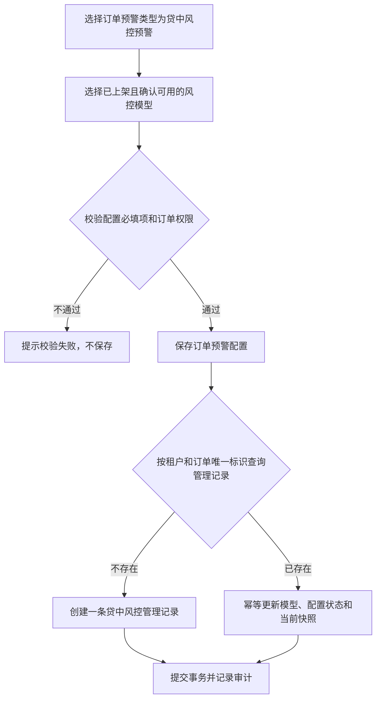
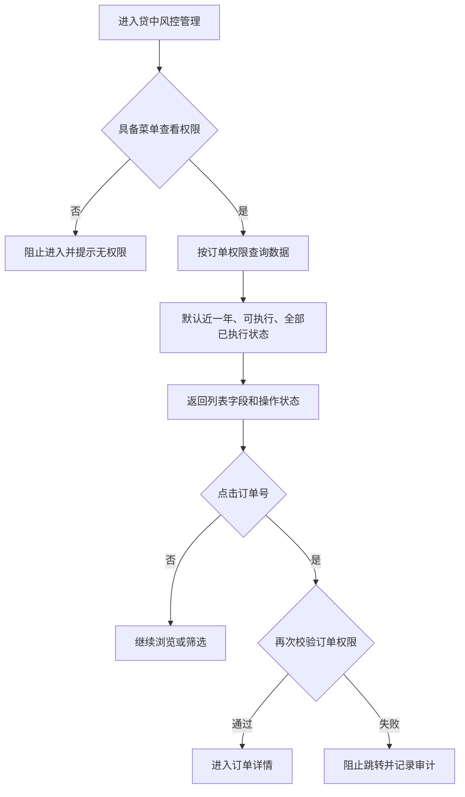
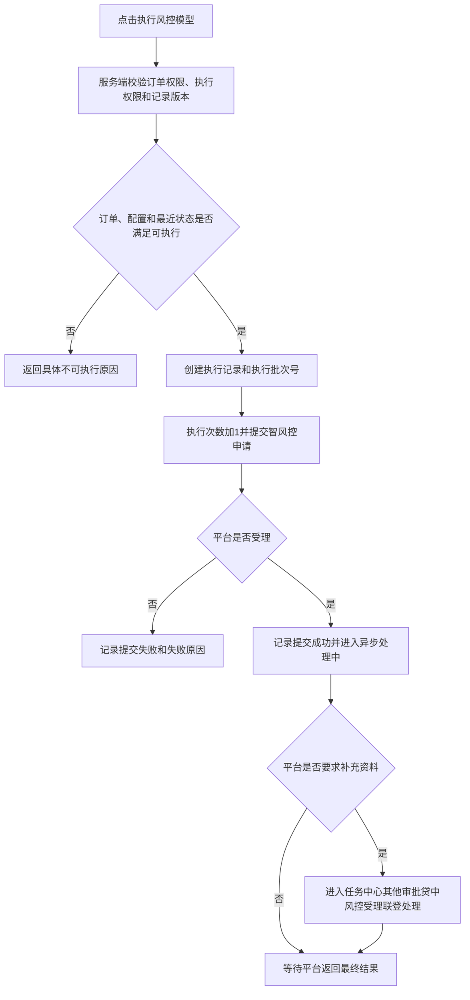
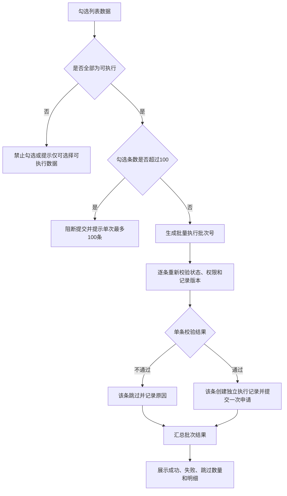
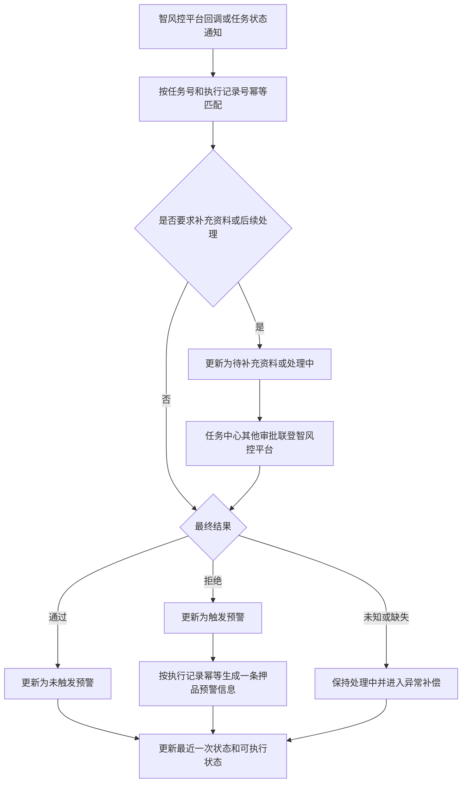
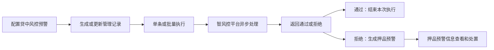

# 贷中风控管理业务规则规格

> **文档定位**：贷中风控管理的权限、数据生成、执行资格、单条/批量提交、异步回调、预警联动、异常处理、幂等和审计规则的唯一定义来源。字段定义引用[贷中风控管理字段清单](./贷中风控管理字段清单.md)，流程引用本文件，不在流程中重复定义字段口径。
>
> **版本**：V1.0 | 2026-08-18

## 一、能力边界与术语

| 项目 | 当前规则 |
| :--- | :--- |
| 管理对象 | 已配置“贷中风控预警”的抵押或质押订单 |
| 数据权限 | 沿用订单权限；列表、详情、执行和执行记录均按当前订单权限校验 |
| 风控模型 | 订单预警配置选择的智风控平台已上架且经风控确认可使用的产品；一个产品可绑定N条规则 |
| 执行申请 | 每个订单每次向智风控平台提交一次申请；批量操作不改变申请的独立性 |
| 最终结果 | 智风控平台返回的贷款产品最终结果；通过为未触发预警，拒绝为触发预警 |
| 押品预警 | 最终结果为拒绝时，按现有预警提醒逻辑生成一条“贷中风控预警”押品预警信息 |

本模块不提供新增或编辑管理记录的页面。管理记录由订单预警配置保存成功后自动生成或更新，执行结果由智风控平台异步回传。

本文中的“审批中心”统一指实际系统入口`任务中心—其他审批—贷中风控受理`；该入口通过联登进入智风控平台处理补充资料或后续流程。

## 二、权限与数据范围

| 规则ID | 规则 |
| :--- | :--- |
| MID-P01 | 用户须具备“贷中风控管理”菜单查看权限才可进入列表；列表和详情按订单数据权限过滤。 |
| MID-P02 | 订单号跳转、订单详情、执行记录、模型分数和结果描述均执行服务端订单权限校验；无订单权限时不得通过前端参数绕过。 |
| MID-P03 | 单条执行和批量执行分别校验执行操作权限、订单权限、订单状态、配置状态和记录版本；页面按钮不可替代服务端校验。 |
| MID-P04 | 进入任务中心或联登智风控平台处理补充资料前，校验当前用户的任务中心/其他审批权限和订单权限；无权限时不得创建或展示越权入口。 |
| MID-P05 | 订单、货主、押品和模型信息按当前页面展示权限脱敏；执行记录中的任务号、分数和结果描述按订单权限展示。 |

## 三、管理数据生成与唯一性

| 规则ID | 规则 |
| :--- | :--- |
| MID-D01 | 订单预警配置选择预警类型“贷中风控预警”且保存成功时，按订单唯一标识创建或更新一条贷中风控管理记录。 |
| MID-D02 | 同一订单在贷中风控管理中只允许存在一条当前管理记录；服务端对租户和订单唯一标识建立唯一约束，重复保存使用幂等更新，不重复插入。 |
| MID-D03 | 首次创建时写入订单、货主、押品、订单生成时间、订单类型、模型和配置版本；配置编辑时更新当前模型和配置状态，但不删除执行次数、预警次数及历史执行记录。 |
| MID-D04 | 配置停用、已失效、已删除或订单不再处于抵/质押中时，管理记录保留用于查询和追溯，但“是否可执行”计算为不可执行。 |
| MID-D05 | 订单预警配置的模型被智风控平台停用时，配置按订单预警配置规则进入失效状态；管理记录同步更新配置状态并阻断后续提交。 |
| MID-D06 | 配置更新后，历史执行记录保留执行时的模型名称、模型标识、配置版本和规则版本快照；不得用当前配置覆盖历史执行事实。 |

## 四、执行资格与状态

### 4.1 是否可执行

可执行须同时满足：

1. 当前订单状态为“抵/质押中”；
2. 该订单关联的贷中风控预警配置状态为“启用”；
3. 当前不存在仍在提交或等待最终结果的执行申请；
4. 没有执行记录，或最近一次执行状态为“提交失败”“触发预警”“未触发预警”。

以下任一条件满足时为不可执行：订单已解抵押/解质押，配置非启用，或最近一次申请仍为“提交中”“提交成功（处理中）”。不可执行时页面展示提醒图标及具体订单状态、配置状态和最近一次执行状态。

### 4.2 执行状态

| 状态 | 含义 | 是否可再次执行 |
| :--- | :--- | :--- |
| 提交中 | 服务端正在提交或等待平台受理 | 否 |
| 提交成功（处理中） | 智风控平台已受理，但最终产品结果尚未返回 | 否 |
| 提交失败 | 本次申请未被平台受理 | 是，仍需满足其他可执行条件 |
| 未触发预警 | 平台返回最终结果为通过 | 是，仍需满足其他可执行条件 |
| 触发预警 | 平台返回最终结果为拒绝 | 是，仍需满足其他可执行条件 |

“提交成功”不能直接等同于“未触发预警”。平台异步处理期间，必须保持处理中状态；平台返回未知、空结果或超时，不得判定为通过，应保持处理中并进入补偿/异常处理队列。

## 五、单条与批量执行

| 规则ID | 规则 |
| :--- | :--- |
| MID-E01 | 单条执行仅允许对当前“可执行”记录提交；提交前服务端重新读取订单、配置和记录版本。 |
| MID-E02 | 批量执行仅允许勾选“可执行”记录，单次最多100条；前端勾选状态不作为最终资格依据。 |
| MID-E03 | 批量提交生成一个执行批次号，但每条订单分别生成一条执行记录并向智风控平台提交一次申请。选择N条即产生N次申请和最多N条独立结果。 |
| MID-E04 | 批量校验通过后，对每条记录分别执行幂等提交；部分成功、部分失败时保留各条真实结果，不能用批次整体结果覆盖单条状态。 |
| MID-E05 | 提交前发现订单已解抵/解质押、配置停用、记录版本变化或已有处理中申请的，该条拒绝提交并记录失败原因；其他符合条件的记录继续提交。 |
| MID-E06 | 提交按钮在请求发送期间防重复点击；服务端使用幂等键、记录版本校验和分布式锁或等效机制，避免重复扣增执行次数或重复创建申请。 |
| MID-E07 | 执行次数在每条申请形成提交记录时增加一次，不论提交成功或失败；预警次数仅在最终结果为拒绝并成功生成预警事件时增加一次。 |

## 六、智风控异步处理与任务中心

1. 提交成功后，智风控平台异步返回最终产品结果。系统使用平台任务号/受理编号和执行记录号关联回调，重复回调必须幂等处理。
2. 若平台要求补充资料或完成后续流程，执行记录标记为“待补充资料”或“处理中”，并在`任务中心—其他审批—贷中风控受理`提供联登智风控平台的入口。
3. 联登处理只改变后续处理状态，不得提前将执行结果标记为通过或拒绝；最终结果仍以智风控平台返回为准。
4. 回调缺少任务号、执行记录号或订单关联信息时不得写入最终结果，记录异常原因并进入重试/人工核查队列。
5. 回调处理与押品预警生成在同一业务幂等边界内完成：最终结果已落库但预警生成失败时，使用补偿任务重试，不重复计数或重复生成。

## 七、最终结果与押品预警联动

| 智风控最终结果 | 贷中风控状态 | 预警处理 |
| :--- | :--- | :--- |
| 通过 | 未触发预警 | 不生成贷中风控押品预警 |
| 拒绝 | 触发预警 | 生成一条押品预警信息，预警类型为“贷中风控预警” |
| 未返回、未知或平台异常 | 保持处理中/异常 | 不生成预警，不按通过处理 |

生成押品预警时至少保存以下触发快照：订单唯一标识、订单号、配置规则名称、模型标识和模型名称、模型分数、结果描述、执行记录号、平台任务号、最终结果时间和配置版本。

押品预警中的“预警内容”按以下结构展示：

1. 模型名称：预警配置关联的模型名称；
2. 模型分数：智风控平台返回的该产品最终分数，无分数时展示“--”；底层值保留为空；
3. 预警描述：模型返回的结果描述内容。

预警生成使用“租户+订单+执行记录号+最终结果事件”作为幂等键。通知发送、预警展示和后续处理沿用押品预警信息现有规则；模型结果为拒绝不等于已完成预警处置，后续处置由押品预警信息和对应业务模块负责。

## 八、并发、异常与审计

| 场景 | 处理规则 |
| :--- | :--- |
| 同一订单并发单条和批量提交 | 以服务端记录版本和订单锁裁决，仅允许一个申请成功，其余返回已提交或状态变化提示 |
| 批量执行超过100条 | 阻断整次批量操作并提示上限，不创建任何执行记录 |
| 批量中部分记录不可执行 | 逐条返回失败原因，符合条件的记录继续提交；批次结果展示成功、失败和跳过数量 |
| 智风控平台提交失败 | 记录提交失败和失败原因，执行次数计1，满足条件时允许重新执行 |
| 智风控平台重复回调 | 按平台任务号、执行记录号和结果版本幂等，不能重复计预警次数或重复生成押品预警 |
| 配置或订单状态在提交后变化 | 不回滚已成功提交的申请；当前管理记录变为不可执行，历史执行按提交时快照保留 |
| 最终结果缺少分数 | 押品预警模型分数展示“--”，不因缺少分数丢弃拒绝结果 |
| 详情或任务入口失去订单权限 | 隐藏数据并阻止跳转；记录越权访问审计 |

关键操作必须记录审计日志：操作人、角色、机构、时间戳、IP、请求标识、订单唯一标识、执行记录号、批次号、配置版本、模型标识、提交前后状态、接口请求/响应关联标识、失败原因和预警生成结果。敏感模型原始报文按权限脱敏或仅保存受控引用。

## 九、修订记录

| 日期 | 变更内容 | 影响范围 |
| :--- | :--- | :--- |
| 2026-08-18 | V1.0 初版：补充数据生成唯一性、执行资格、异步回调、任务中心、批量提交、押品预警联动、异常、幂等和审计规则 | 贷中风控管理全流程 |

---

## 业务流程与联动

> 以下内容由原《贷中风控管理业务流程》合并，与上文规则 ID 配合阅读；重复的状态机定义以上文为准。

> **文档定位**：贷中风控管理的数据生成、列表查询、单条/批量执行、智风控异步处理、任务中心补充资料和押品预警联动流程。字段定义引用[贷中风控管理字段清单](./贷中风控管理字段清单.md)，规则定义引用[贷中风控管理业务规则规格](./贷中风控管理业务规则规格.md)。
>
> **版本**：V1.0 | 2026-08-18

## 一、订单预警配置保存与管理记录同步

- 同一订单始终只有一条贷中风控管理记录。
- 配置编辑不删除执行历史；配置停用、失效或订单结束后，记录保留但不可执行。
- 配置更新和管理记录同步必须在同一业务事务或可靠补偿机制内完成；同步失败不得向用户返回保存成功。

## 二、列表查询与权限校验

订单生成时间查询跨度不得超过一年。风控模型支持多选；是否可执行和是否已执行支持单选。不可执行数据保留在列表中，但操作区不提供执行入口，并展示具体阻断原因。

## 三、单条执行流程

提交成功只表示申请被平台受理，不直接生成“未触发预警”结果。执行记录、提交人、提交时间和平台任务号必须先落库，再向平台提交或在可靠消息机制下完成提交。

## 四、批量执行流程

批量执行的批次号只用于关联一次用户操作；选择N条必须对应N条独立申请、N条执行记录和N个异步结果。批量部分成功时不得回滚已成功提交的其他订单。

## 五、智风控异步回调与最终结果

平台最终结果为拒绝时，押品预警内容保存模型名称、模型分数和结果描述；模型分数缺失时页面展示“--”。预警通知和后续处理沿用押品预警信息模块规则。

## 六、异常与补偿流程

| 场景 | 流程处理 |
| :--- | :--- |
| 提交接口失败 | 当前执行记录置为提交失败，保存失败原因，执行次数保留，可重新执行 |
| 平台已受理但回调超时 | 保持处理中，由任务查询或补偿任务获取最终结果，不按通过处理 |
| 重复回调 | 返回首次处理结果，不重复更新预警次数、不重复生成押品预警 |
| 批量部分失败 | 每条记录保存独立结果，批次页汇总成功、失败、跳过数量 |
| 配置或订单状态变更 | 新提交按最新状态阻断；已成功提交的申请继续接收结果并保留提交时快照 |
| 押品预警生成失败 | 保留已落库的拒绝结果，进入补偿队列重试，成功后补记预警次数 |

## 七、页面操作闭环

## 修订记录

| 日期 | 版本 | 变更 |
| :--- | :---: | :--- |
| 2026-08-20 | — | 合并原《贷中风控管理业务流程》至本文件「业务流程与联动」章节 |
