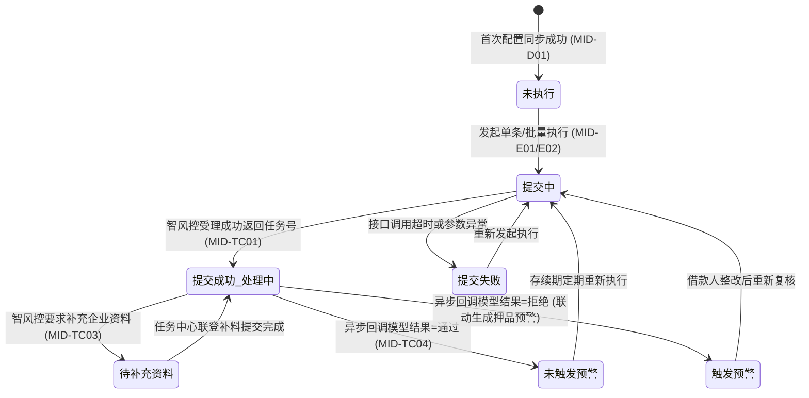
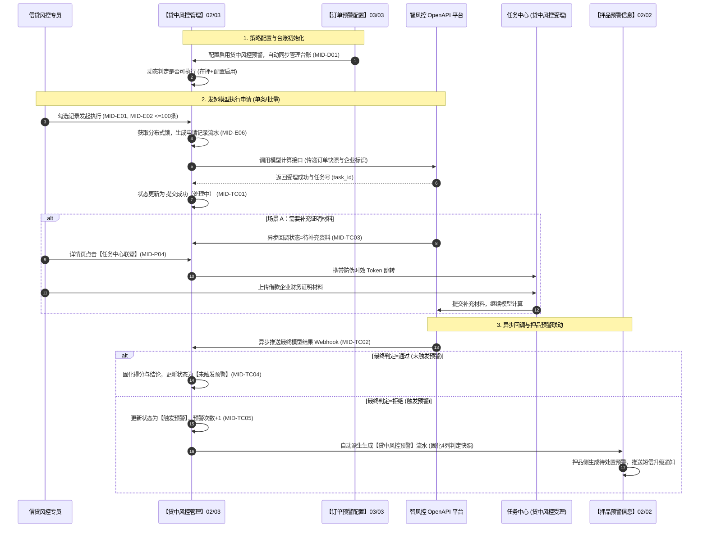

# 贷中风控管理 业务规则规格

> **文档定位**：仓储风控 / 预警信息 / 贷中风控管理模块（`02-03`）状态机流转、执行资格计算、单条/批量异步调度、外部智风控平台回调对接及押品预警联动的**唯一定义真源（SSOT）**。配套文档：[贷中风控管理主PRD.md](./贷中风控管理主PRD.md)（业务全景与页面交互说明）、[贷中风控管理字段清单.md](./贷中风控管理字段清单.md)（字段字典）。端侧原型与 ASCII 线框仅引用本文件规则编号（MID-P01~P05, MID-D01~D06, MID-E01~E07, MID-TC01~TC07），不重复定义规则本体。  
> **模块类型**：模型对接与调度流水类（具有异步执行状态机与外部系统回调闭环，无审批流）  
> **版本**：V4.0 | **更新时间**：2026-09-18 | **责任人**：森云科技（Senyun Technology）  
> **参考规范**：[《00-全局契约与RBAC权限矩阵》](../../00-全局契约与RBAC权限矩阵.md)、[订单预警配置业务规则规格（03/03）](../../03-预警配置/03订单预警配置/订单预警配置业务规则规格.md)、[押品预警信息业务规则规格（02/02）](../02押品预警信息/押品预警信息业务规则规格.md)

---

## 一、单据与能力定位

| 项目 | 内容 |
| :--- | :--- |
| **模块层级** | **【风险信息与处置层】**（智风控平台大数据模型对接与贷中资信监控中枢，非配置策略层） |
| **菜单路径** | PC端：`工作台 → 预警信息 → 贷中风控管理`；移动端：`工作台 → 预警信息 → 贷中风控` |
| **核心职责** | 集中管理在押订单的风控模型执行资格；发起单条与批量异步计算申请；跟踪任务受理进度；带安全签名联登任务中心处理补料；接收模型结果并在拒绝时自动联动生成押品预警 |
| **数据来源** | 【订单预警配置】策略（03/03）保存启用事件、抵质押订单主数据状态、智风控 OpenAPI 异步计算回调 |
| **上游依赖** | **【订单预警配置】策略（菜单：预警配置 → 订单预警配置，代号 03/03）**：提供贷中风控子项启用状态、绑定的模型产品及预警等级； **抵/质押订单主数据**：提供订单 ID、借款企业标识、贷款余额及在押生命周期状态； **智风控平台 OpenAPI**：提供异步任务受理、进度查询、模型评分与最终风险决策结果。 |
| **下游影响** | **【押品预警信息】台账（菜单：预警信息 → 押品预警信息，代号 02/02）**：智风控返回“拒绝”时，系统自动派生生成一条来源为 `ORDER_CONFIG` 的贷中风控押品预警； **任务中心**：模型需要补充财务或纳税证明材料时，在详情页提供带安全签名跳转至 `任务中心—其他审批—贷中风控受理` 的处理入口； **审计留痕**：每次模型申请、受理、补料及回调结果均生成不可变执行历史记录。 |
| **审核流边界** | **无内部审批流**——本模块发起执行与结果接收均为系统级调用；补充资料审批在任务中心与智风控平台内闭环完成。 |

---

## 二、数量与计算口径隔离表

| 口径名称 | 应用维度 | 业务含义与计算公式 / 判定条件 | 约束与边界说明 |
| :--- | :--- | :--- | :--- |
| **执行资格判定** | 列表与行操作门控 | 订单当前是否允许向智风控平台提交模型执行计算申请： $$\text{Executable} = (\text{OrderStatus} \in \{\text{PLEDGED}, \text{MORTGAGED}\}) \land (\text{ConfigStatus} = \text{ACTIVE}) \land (\text{LastStatus} \notin \{\text{SUBMITTING}, \text{PROCESSING}\})$$ | 四要素必须同时满足；若订单解押或配置停用，系统强制判定为不可执行并置灰入口 |
| **批量执行容量上限** | 批量提交约束 | 单次批量勾选向智风控发起调用的订单总数量 $N_{\text{batch}}$： $$1 \le N_{\text{batch}} \le 100$$ | 单次勾选严格限制在 100 条以内；超出时前端直接阻断并弹出警告提示 |
| **执行次数计数器** | 统计累加口径 | 向智风控平台提交模型计算申请的物理总次数： $$\text{ExecCount}_{n+1} = \text{ExecCount}_n + 1$$ | 每次生成提交记录即原子累加 1；不论提交最终成功与否均真实记录 |
| **预警次数计数器** | 风险触发口径 | 智风控模型最终计算结果判定为“拒绝”的总次数： $$\text{WarnCount}_{n+1} = \begin{cases} \text{WarnCount}_n + 1 & \text{if CallbackResult} = \text{REJECT} \\ \text{WarnCount}_n & \text{otherwise} \end{cases}$$ | 仅当智风控返回最终拒绝结果且成功派生押品预警时递增 |
| **数据版本并发控制** | 乐观锁并发控制 | 管理台账数据版本号递增： $$\text{Version}_{n+1} = \text{Version}_n + 1$$ | 初始同步为 1；每次发起执行或回调结果入库时原子递增；并发冲突阻断提交 |

---

## 三、单据状态机与生命周期流转

### 3.1 状态定义
管理记录围绕外部风控模型执行的全生命周期流转：

| 状态名称 | 状态编码 | 业务含义 | 是否终态 | 进入条件 | 退出条件 |
| :--- | :--- | :--- | :---: | :--- | :--- |
| **未执行** | `NOT_EXECUTED` | 贷中风控预警策略已启用，但尚未发起过模型计算 | 否 | 规则配置保存首次同步产生 | 发起单条或批量执行 |
| **提交中** | `SUBMITTING` | 服务端正在组装企业数据并向智风控平台发送请求 | 否 | 用户点击确认提交执行 | 智风控返回受理成功或接口调用失败 |
| **提交成功（处理中）** | `PROCESSING` | 智风控平台已受理任务，大数据模型正在异步运算中 | 否 | 智风控返回任务受理编号 | 收到异步最终结果；或转入待补充资料 |
| **待补充资料** | `NEED_SUPPLEMENT`| 智风控计算发现材料缺失，需要业务人员补充证明文件 | 否 | 智风控回调要求补料 | 经任务中心联登补齐材料继续计算 |
| **提交失败** | `SUBMIT_FAILED` | 本次向智风控平台发起申请失败（网络超时或参数错误） | 否 | 接口调用返回错误应答 | 重新发起执行申请 |
| **未触发预警** | `NO_WARNING` | 智风控模型最终判定为“通过”，借款企业资信良好 | 否* | 异步回调模型结果=通过 | 周期性再次发起执行申请 |
| **触发预警** | `WARNING_TRIGGERED`| 智风控模型最终判定为“拒绝”，借款企业存在重大资信风险 | 否* | 异步回调模型结果=拒绝 | 整改后再次发起执行申请 |

\* 注：`未触发预警` 与 `触发预警` 代表单次模型调用的最终结果；存续期内满足执行资格可再次发起执行。

### 3.2 状态流转图

### 3.3 状态流转表

| 当前状态 | 触发动作 | 前置业务条件 | 结果状态 | 二次确认与交互形式 | 联动后置影响 | 失败处理与反馈 |
| :--- | :--- | :--- | :--- | :--- | :--- | :--- |
| — | **配置同步生成** | 03/03 启用贷中风控且保存成功 | 未执行 | 系统自动后台写入 | ① 写入 `mid_loan_risk_ledger`； ② 初始执行次数=0，预警次数=0。 | 记录幂等同步日志，不阻塞配置 |
| **未执行** | **单条发起执行** | 满足可执行资格（在押+配置启用+无在途申请） | 提交中 $\rightarrow$ 处理中 | 点击【执行】，弹窗二次确认「确认发起贷中模型计算？」 | ① 生成独立执行流水，执行次数+1； ② 调用智风控 OpenAPI； ③ 记录任务受理编号。 | 接口异常更新为“提交失败”，浮窗提示 |
| **未执行 / 终态** | **批量发起执行** | 勾选记录全部满足可执行资格；数量 $\le 100$ 条 | 提交中 $\rightarrow$ 处理中 | 点击【批量执行】，弹窗展示所选清单并确认 | ① 生成统一批次号，逐笔独立向智风控提交； ② 逐笔增加执行次数； ③ 独立记录流水。 | 汇总成功/失败条数轻量浮窗反馈 |
| **提交中** | **智风控接口应答**| 智风控成功接收请求并完成前置校验 | 提交成功（处理中） | 系统后台自动更新 | ① 写入平台任务受理编号； ② 保持处理中，等待异步运算。 | 网络超时更新为“提交失败” |
| **处理中** | **智风控请求补料**| 智风控算法计算发现材料缺失 | 待补充资料 | 系统后台接收通知 | ① 详情页激活【任务中心联登】入口； ② 记录补料要求描述。 | 保持现状等待人工介入 |
| **待补充资料** | **任务中心联登** | 操作人具备任务中心/其他审批权限 | 状态不变 (跳转处理) | 点击【任务中心联登】新标签页打开 | 生成时效防伪签名，直跳智风控受理界面上传材料 | 「联登失败：签名生成异常或无权限」 |
| **处理中** | **智风控回调通过**| 智风控模型计算完成，最终判定为通过 | 未触发预警 | 异步接收 Webhook 回调 | ① 固化模型得分与结果结论快照； ② 记录本次执行完成时间戳。 | 幂等更新，重复回调安全覆盖 |
| **处理中** | **智风控回调拒绝**| 智风控模型计算完成，最终判定为拒绝 | 触发预警 | 异步接收 Webhook 回调 | ① 固化模型得分与拒绝原因； ② 预警次数+1； ③ 自动向 02/02 派生押品预警。 | 预警生成失败自动进入补偿重试 |

---

## 四、动作能力与流转控制矩阵

| 触发动作 | 操作入口 | 适用角色 | 前置业务校验条件 | 结果状态 | 联动后置影响 | 失败阻断提示 |
| :--- | :--- | :--- | :--- | :--- | :--- | :--- |
| **单条执行** | 列表操作列【执行】按钮 | 信贷风控专员 (`R-RISK-MGR`)、超级管理员 | ① 订单处于在押状态； ② 预警配置处于启用中； ③ 无在途处理中申请（MID-E01）。 | 提交成功（处理中） | ① 增加执行次数（ExecCount+1）； ② 调用外部智风控 OpenAPI； ③ 生成申请记录流水。 | 「执行失败：该订单当前不可执行」 「该订单正在计算中，请勿重复提交」 |
| **批量执行** | 列表工具条【批量执行】按钮 | 信贷风控专员 (`R-RISK-MGR`)、超级管理员 | ① 勾选数量 $1 \sim 100$ 条； ② 勾选记录全部满足可执行资格（MID-E02）； ③ 具备批量执行权限。 | 提交成功（处理中，逐笔） | ① 生成统一样式执行批次号； ② 逐笔独立向外部提交并扣增执行次数； ③ 记录批量操作审计日志。 | 「批量执行失败：单次最多勾选100条」 「包含不可执行的订单记录，请重新勾选」 |
| **查看详情** | 列表行操作【详情】按钮 | 具有查看权限的角色 (`R-RISK-VIEW` 等) | 订单属于操作人管辖权限范围 | 状态不变 | 打开详情页，展示基础识别、配置快照及历次执行历史时间轴 | 「暂无该订单查看权限」 |
| **任务中心联登** | 详情页执行记录【任务中心联登】 | 具备任务中心审批权限的角色 | 执行记录当前状态严格为“待补充资料”且 Token 有效 | 状态不变 (新窗口) | 生成带 15 分钟时效签名的联登凭证，无缝打开智风控受理界面 | 「您暂无任务中心审批权限，请联系管理员开通」 |
| **条件查询与重置**| 筛选区【查询】/【重置】 | 全部角色 | 订单号输入长度 $\le 50$ 字符 | 刷新列表 | 服务端注入订单数据权限过滤，返回符合条件的分页数据 | — |

---

## 五、核心业务规则清单 (MID-P01 ~ MID-TC07)

### 5.1 权限与数据范围规则 (MID-P01 ~ MID-P05)

#### 【贷中风控管理菜单与操作鉴权规则】(MID-P01)
* **菜单门控**：用户必须具备 `R-RISK-MID-VIEW` 菜单权限方可访问贷中风控管理台账；列表与详情严格按登录人管辖的组织架构与订单数据权限行级过滤。

#### 【跨模块跳转与详情调阅服务端鉴权规则】(MID-P02)
* **防越权保护**：从外部跳转调阅订单详情、执行记录、模型分数及结果描述时，服务端强制执行订单行级权限校验，禁止通过修改 URL 参数越权调阅非管辖订单的风控数据。

#### 【单条与批量执行操作权限强校验规则】(MID-P03)
* **执行写权限**：发起单条或批量执行必须具备 `R-RISK-MID-EXEC` 操作写权限；提交前服务端重新排他读取订单状态与配置状态，前端按钮状态仅作交互提示，不替代服务端校验。

#### 【任务中心联登安全签名与时效规则】(MID-P04)
* **联登安全凭证**：点击【任务中心联登】跳转前，系统基于 `(user_id, order_id, task_id, timestamp)` 生成具有防伪验签机制的时效 Token（有效时间 15 分钟），单次使用后即废弃，杜绝链接外泄安全隐患。

#### 【客户隐私信息多级脱敏展示规则】(MID-P05)
* **数据脱敏**：列表及详情展示借款主体信息时，个人货主证件号强制前三后四脱敏展示；企业主体统一社会信用代码保留原貌；模型内部核心算法特征不对前端展示。

---

### 5.2 管理数据生成与唯一性规则 (MID-D01 ~ MID-D06)

#### 【订单预警配置触发自动生成规则】(MID-D01)
* **自动化归集**：当【订单预警配置】（03/03）策略中启用“贷中风控预警”且保存生效后，系统自动向贷中风控管理台账同步新增或更新一条记录。

#### 【订单管理台账唯一定位防重规则】(MID-D02)
* **一单一行约束**：同一业务订单在贷中风控管理台账中**仅允许存在 1 条当前有效管理记录**。系统在数据库层面对 `(tenant_id, order_id)` 建立唯一联合索引，重复配置保存自动采用幂等更新。

#### 【首次创建基础事实快照固化规则】(MID-D03)
* **基础快照**：首次创建记录时，原子固化订单编号、货主主体、押品摘要、订单类型、订单生成时间、当前绑定风控模型产品 ID 及配置版本。后续配置编辑时仅更新模型快照，严禁清除历史执行记录。

#### 【业务生命周期终结不可执行规则】(MID-D04)
* **生命周期阻断**：当订单完成全额解押出库，或规则配置被停用、失效、软删除时，管理记录保留以供历史审计追溯，但系统动态计算“是否可执行”为“不可执行”，阻断后续申请。

#### 【外部模型下架配置同步失效规则】(MID-D05)
* **模型联动失效**：若订单绑定的智风控模型产品在外部平台被停用或下架，系统订阅模型变更事件，将关联订单的贷中风控配置同步置为失效，本台账即刻阻断提交并标记原因。

#### 【历史执行事实版本隔离快照规则】(MID-D06)
* **存证隔离**：配置侧后续修改阈值或更换模型产品，历史执行时间轴中记录的模型名称、产品标识、计算得分及结论描述快照保持绝对不可变。

---

### 5.3 单条与批量执行调度规则 (MID-E01 ~ MID-E07)

#### 【单条执行可执行资格排他校验规则】(MID-E01)
* **四要素准入**：单条点击【执行】时，服务端排他校验四要素：① 订单处于抵押/质押中；② 配置处于启用；③ 无提交中或处理中任务；④ 客户端 Version 与数据库一致。不满足时强阻断。

#### 【批量执行容量与资格过滤校验规则】(MID-E02)
* **批量门控**：批量执行勾选记录数强制在 $1 \sim 100$ 条之间。勾选记录若包含任何一条不可执行记录，批量执行提交按钮置灰禁用，并提示「包含不可执行的订单记录」。

#### 【批量申请生成独立执行记录规则】(MID-E03)
* **独立子任务**：批量执行时系统生成一个统一的执行批次号，但后台采用**独立子事务**循环向智风控提交。勾选 $N$ 笔订单即生成 $N$ 条独立的申请流水与 $N$ 次接口调用，保证业务隔离。

#### 【批量执行部分成功容错隔离规则】(MID-E04)
* **容错隔离**：批量提交过程中，若部分订单因网络抖动或外部平台校验失败，不影响其他成功订单的受理与落库，系统最终汇总成功与失败条数并反馈用户。

#### 【分布式防重复提交并发锁控制规则】(MID-E06)
* **防重锁机制**：提交执行时，服务端以 `(tenant_id, order_id, "MID_SUBMIT")` 为 Key 获取分布式排他锁，锁超时时间设为 10 秒，防止单条与批量并发提交同一笔订单。

#### 【执行次数与预警次数累加统计规则】(MID-E07)
* **计数统计**：每成功向外部智风控发起一次申请，该订单的“执行次数”原子累加 1；“预警次数”仅在外部模型最终计算完毕且结果为“拒绝”时累加 1。

---

### 5.4 智风控异步处理与押品联动规则 (MID-TC01 ~ MID-TC07)

#### 【智风控任务受理与异步跟踪规则】(MID-TC01)
* **任务号绑定**：调用外部 OpenAPI 成功后，系统提取返回的外部任务受理编号（`task_id`）持久化至执行记录，状态更新为 `提交成功（处理中）`，进入异步等待状态。

#### 【异步结果回调防重排他幂等规则】(MID-TC02)
* **回调幂等**：接收智风控平台异步计算结果 Webhook 时，基于 `(task_id, execute_record_id)` 实现排他防重处理。相同结果重复投递时直接返回成功应答，不重复计数。

#### 【模型补充资料状态流转与引导规则】(MID-TC03)
* **补料流转**：若外部模型计算过程中要求补充资料，状态流转为 `待补充资料`，详情页激活【任务中心联登】入口。补料完成并经智风控确认后，状态流转回 `提交成功（处理中）` 继续计算。

#### 【模型计算通过正常结案归档规则】(MID-TC04)
* **通过归档**：若外部智风控模型最终判定为“通过”，台账状态更新为 `未触发预警`，固化模型分数与通过结论快照，不向押品侧派生预警。

#### 【模型拒绝自动联动生成押品预警规则】(MID-TC05)
* **跨域告警派生**：若外部智风控模型最终判定为“拒绝”：
  1. 台账状态更新为 `触发预警`，预警次数原子递增 1；
  2. 系统自动向【押品预警信息】台账（02/02）投递一条预警流水，类型为“贷中风控预警”，来源为 `ORDER_CONFIG`；
  3. 预警内容严格依据固定模板组装：“模型：【{模型名}】；分数：【{分数}】；描述：【{结论描述}】”；
  4. 固化触发时刻 4 列判定快照，实现信贷主体风险向押品监管的深度穿透。

#### 【异常未知结果非通过保护规则】(MID-TC06)
* **安全兜底**：智风控异步回调返回空结果、未知状态或接口超时异常时，系统**严禁**判定为通过，必须保持为处理中或异常状态，并进入后台告警队列由人工风控专员复核。

#### 【预警生成失败补偿重试机制规则】(MID-TC07)
* **事务补偿**：若模型判定拒绝且结果已落库，但调用押品预警模块派生告警失败时，系统记录补偿任务，每隔 1 分钟重试派生，直至成功，保障跨模块数据最终一致性。

---

## 六、异常与边界控制矩阵 (MID-TC01 ~ MID-TC07)

| 异常编号 | 异常场景 | 系统判定与控制动作 | 前端反馈与提示 |
| :--- | :--- | :--- | :--- |
| **【处理中订单重复执行拦截】(MID-TC01)** | 订单正在外部模型计算中再次点击执行 | 服务端排他校验发现处于 `SUBMITTING` 或 `PROCESSING` | 点击执行阻断，浮窗提示：`该订单正在模型计算中，请勿重复提交` |
| **【批量执行勾选数量超限】(MID-TC02)** | 列表中勾选超过 100 条记录发起批量 | 前端与服务端校验勾选总条数 $> 100$ 条 | 拦截提交，弹窗警告提示：`单次批量执行最多支持100条记录，请分批操作` |
| **【订单非在押状态执行拦截】(MID-TC03)** | 订单已解押出库但尝试发起模型执行 | 服务端读取实时订单状态已非 `抵押中` 或 `质押中` | 点击执行阻断，浮窗提示：`订单已解除抵/质押，不可发起贷中风控执行` |
| **【预警策略停用执行拦截】(MID-TC04)** | 订单关联贷中配置已被停用或删除 | 服务端校验关联预警规则状态已非 `生效中` | 点击执行阻断，浮窗提示：`关联贷中风控预警配置已停用或失效` |
| **【智风控接口调用超时降级】(MID-TC05)** | 向外部智风控提交请求超时 10 秒无响应 | 触发网关熔断保护，状态标记为 `提交失败`，不扣增预警次数 | 浮窗提示：`外部风控平台接口响应超时，本次提交失败，请稍后重试` |
| **【任务中心联登权限缺失】(MID-TC06)** | 点击【任务中心联登】无审批中心权限 | 校验当前登录账号缺失任务中心相关权限点 | 页面阻断跳转，弹出警告提示：`您暂无任务中心审批权限，请联系管理员开通` |
| **【异步回调参数缺失阻断】(MID-TC07)** | 外部回调缺少任务号或订单匹配信息 | 服务端安全网关拦截非法回调请求并记录安全日志 | 丢弃回调并返回 400 错误，不更新数据库执行记录 |

---

## 七、跨模块业务联动与时序推演

---

## 八、规则全景速查索引表

| 规则编码 | 规则业务全称 | 规则所属分类 | 系统核心控制口径摘要 |
| :--- | :--- | :--- | :--- |
| **MID-P01** | 【贷中风控菜单与操作鉴权规则】 | 权限控制 | 菜单访问与行级操作细粒度鉴权，订单行级隔离 |
| **MID-P02** | 【跨模块跳转与详情调阅服务端鉴权规则】| 安全控制 | 服务端强鉴权，防止前端修改参数越权访问 |
| **MID-P03** | 【单条与批量执行操作权限强校验规则】| 操作鉴权 | 执行接口服务端二次校验写权限与在押状态 |
| **MID-P04** | 【任务中心联登安全签名与时效规则】| 存证安全 | 动态生成 15 分钟时效防伪签名，单次使用废弃 |
| **MID-P05** | 【客户隐私信息多级脱敏展示规则】 | 隐私保护 | 个人证件号前三后四脱敏展示，模型内部细节隐藏 |
| **MID-D01** | 【订单预警配置触发自动生成规则】 | 数据生成 | 配置启用贷中预警自动幂等创建/更新台账 |
| **MID-D02** | 【订单管理台账唯一定位防重规则】 | 唯一约束 | 同一订单仅允许一条当前管理记录，租户订单唯一联合索引 |
| **MID-D03** | 【首次创建基础事实快照固化规则】 | 存证快照 | 固化订单、货主、押品及模型产品初始快照 |
| **MID-D04** | 【业务生命周期终结不可执行规则】 | 业务约束 | 订单出库或配置停用后，记录保留但不可执行 |
| **MID-D05** | 【外部模型下架配置同步失效规则】 | 跨域联动 | 外部模型停用下架，系统联动失效并阻断提交 |
| **MID-D06** | 【历史执行事实版本隔离快照规则】 | 司法存证 | 配置更新不回写历史执行记录，保持原始快照不可变 |
| **MID-E01** | 【单条执行可执行资格排他校验规则】| 执行控制 | 四要素准入校验（在押+配置启用+无在途申请） |
| **MID-E02** | 【批量执行容量与资格过滤校验规则】| 执行控制 | 单次勾选严格限制 1~100 条且全部须处于可执行状态 |
| **MID-E03** | 【批量申请生成独立执行记录规则】 | 调度控制 | 生成统一批次号，但逐笔独立向外部提交并记录流水 |
| **MID-E04** | 【批量执行部分成功容错隔离规则】 | 容灾隔离 | 部分失败不影响成功订单，独立记录真实状态 |
| **MID-E06** | 【分布式防重复提交并发锁控制规则】| 并发控制 | 租户订单申请锁，防止单条与批量并发提交 |
| **MID-E07** | 【执行次数与预警次数累加统计规则】| 统计口径 | 提交成功物理次数累加，模型拒绝时预警次数累加 |
| **MID-TC01**| 【智风控任务受理与异步跟踪规则】 | 外部对接 | 记录外部 task_id，流转为提交成功处理中 |
| **MID-TC02**| 【异步结果回调防重排他幂等规则】 | 幂等控制 | 基于 task_id 幂等接收回调，防网络重发 |
| **MID-TC03**| 【模型补充资料状态流转与引导规则】| 流程协同 | 缺料时状态流转为待补充资料，激活联登入口 |
| **MID-TC04**| 【模型计算通过正常结案归档规则】 | 结果处理 | 模型判定通过，流转为未触发预警并归档快照 |
| **MID-TC05**| 【模型拒绝自动联动生成押品预警规则】| 跨域联动 | 模型判定拒绝，更新为触发预警并派生 02/02 押品告警 |
| **MID-TC06**| 【异常未知结果非通过保护规则】 | 容灾保护 | 异常超时或未知结果严禁判定为通过，保持处理中 |
| **MID-TC07**| 【预警生成失败补偿重试机制规则】 | 事务补偿 | 押品告警派生失败异步定时补偿，保证最终一致性 |

---

## 九、修订记录

| 日期 | 版本 | 修订人 | 变更内容说明 |
| :--- | :---: | :--- | :--- |
| 2026-08-18 | V1.0 | 森云科技 PM 团队 | 初版贷中风控管理业务规则确立 |
| 2026-08-24 | V1.9 | 森云科技 PM 团队 | 统一任务中心联登规范与执行状态定义 |
| 2026-09-18 | **V4.0** | 森云科技 PM 团队 | **基准化重塑升级**：增补《二、数量与计算口径隔离表》（LaTeX公式定义资格四要素、批量容量、计数累加与乐观锁）；升级为 7 列动作控制矩阵与 4 列异常矩阵；补齐跨模块时序推演与标准引用 |
