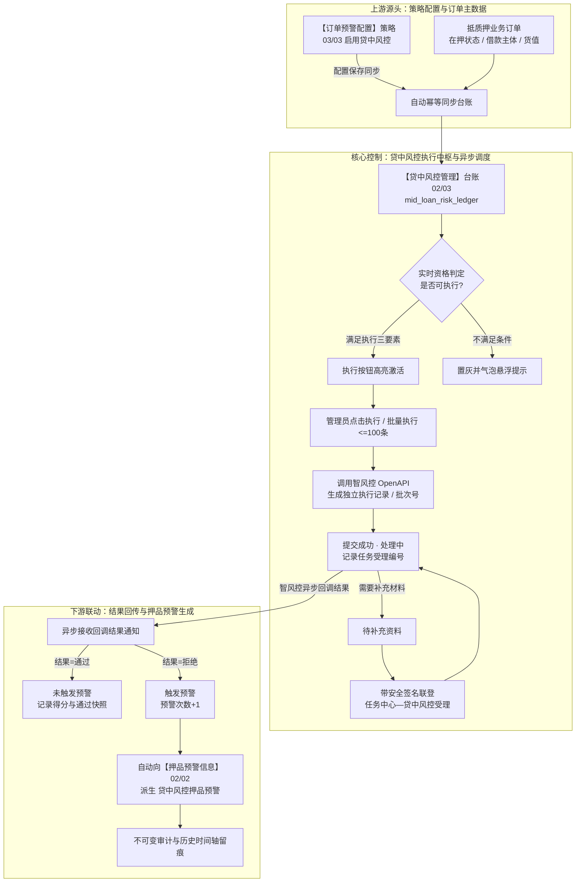
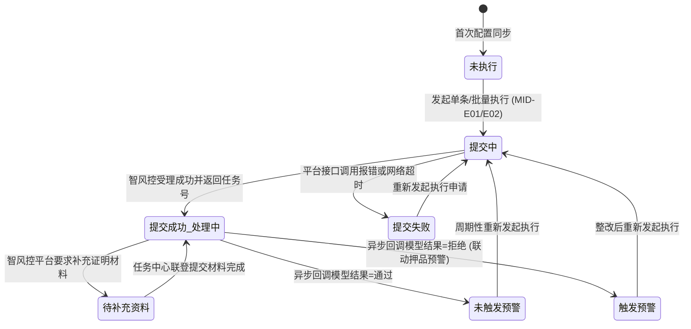

# 贷中风控管理主PRD

> **版本**：V4.0 | 2026-09-18  
> **读者**：研发工程师、测试工程师、信贷风控产品经理、大数据架构师  
> **所属模块**：02-预警信息 / 03-贷中风控管理 | **菜单路径**：`预警信息 → 贷中风控管理`  
> **模板选型**：台账流水类（[5-2-2 台账流水类 PRD 模板](../../../../05-常用模板/需求处理/5-2-2%20(输出)台账流水类PRD模板.md)）  
>
> **文档体系（三件套为唯一核心真源）**：
>
> | 层级 | 文档 | 职责 |
> | :--- | :--- | :--- |
> | **核心** | 本文（主 PRD） | 业务背景、功能范围对比、模块定位与系统链路、**页面功能说明**、业务场景四列故事、状态机摘要、规则摘要、验收标准 |
> | **核心** | [贷中风控管理字段清单](./贷中风控管理字段清单.md) | 11 列标准字段字典、筛选/列表/详情/执行与联登跳转、展示顺序与控件规格 |
> | **核心** | [贷中风控管理业务规则规格](./贷中风控管理业务规则规格.md) | 状态机本体、LaTeX 执行资格与计数口径、7 列动作能力矩阵、MID-* 规则本体、异常边界与时序推演 |
> | *衍生* | ASCII 线框 / Demo 文档 | 由三件套派生的可视化与原型输入，**非独立真源** |
>
> **跨模块引用标准**：
> - 策略规则配置源头：【订单预警配置】策略（菜单：`预警配置 → 订单预警配置`，代号 03/03）
> - 预警下游承接台账：【押品预警信息】台账（菜单：`预警信息 → 押品预警信息`，代号 02/02）
> - 外部风控能力平台：智风控 OpenAPI 平台
> - 全局权限矩阵依据：[00-全局契约与RBAC权限矩阵](../../00-全局契约与RBAC权限矩阵.md) 第四章 §1

---

## 1. 业务背景与业务痛点

### 1.1 业务背景与台账定位
在动产质押与供应链授信存续期内，借款企业的经营状况恶化、重大司法涉诉、涉税违规、多头借贷以及核心供应链资信评级变化，直接影响贷款本息的安全偿还。单一依靠质押货物的静态盘点和被动盯市，无法全面防范借款主体违约引发的系统性信用风险。  
**贷中风控管理**面向在【订单预警配置】（03/03）中已启用“贷中风控预警”策略的有效在押订单，作为**对接外部智风控大数据算法模型与贷中资信监控的统一执行中枢**。本模块支持**动态判定模型执行资格、单条即时提交与批量快速发起执行申请、跟踪外部智风控平台异步计算进度、带签名联登任务中心补充资料，并在模型计算最终拒绝时自动联动生成押品预警**，实现贷中主体资信风控与底层质押动产监管的深度业务融合。

### 1.2 核心业务痛点
* **痛点 1：贷中主体信用与现场动产监管脱离**：以往动产质押仅关注仓库内货物吨数，借款企业已被列入失信被执行人时，监管系统无法联动，风险发现严重滞后；
* **痛点 2：大数据模型异步计算黑盒化**：风控模型涉及海量政务司法与工商税务数据，计算耗时长达数分钟至数小时。缺乏统一管理中枢导致业务人员无法获知任务受理编号与实时计算阶段；
* **痛点 3：缺乏补充资料联登闭环通道**：模型计算常因缺少纳税申报或财务流水而挂起，传统线下补料周期长，缺乏带身份签名的直通审批与补料通道；
* **痛点 4：资信拒绝无法自动穿透至信贷防线**：外部模型判定为高危拒绝后，缺乏自动生成押品高危预警与驱动出库风控审核的自动化业务闭环。

---

## 2. 功能范围 (In / Out of Scope)

| 包含功能范围 (In Scope) | 不包含功能范围 (Out of Scope) |
| :--- | :--- |
| - **管理台账自动维护与幂等同步**：【订单预警配置】（03/03）保存启用“贷中风控预警”后，自动按订单唯一标识幂等生成或更新管理台账； - **执行资格动态实时计算**：结合订单状态（抵押/质押中）、配置策略（启用）及前次执行状态，实时判定“是否可执行”； - **单条与批量模型执行申请**：支持单条点击执行与勾选最多 100 条的可执行记录进行批量执行，生成独立申请记录向智风控平台提交； - **智风控异步回调与任务跟踪**：接收智风控 OpenAPI 异步回调，维护任务受理编号、模型得分、风险评级与计算结果； - **任务中心带签名联登补料**：状态为“待补充资料”时，在详情页提供带安全签名跳转至 `任务中心—其他审批—贷中风控受理` 的处理入口； - **自动联动押品预警生成**：模型最终判定为“拒绝”时，系统自动在【押品预警信息】（02/02）派生生成一条贷中风控押品预警； - **执行历史全生命周期留痕**：详情页时间轴完整展示历次提交时间、提交人、模型版本、得分及结果快照； - **移动端查询协同**：H5 移动端提供列表检索与执行历史详情只读调阅。 | - **智风控平台内部算法研发**：模型底层特征工程、评分卡规则及反欺诈算法由智风控平台独立负责； - **预警规则中的模型绑定与修改**：为订单绑定或更换风控模型产品归属【订单预警配置】（菜单：`预警配置 → 订单预警配置`，代号 03/03）； - **押品预警产生后的单据处置与公示**：预警核销与对外合规披露归属【押品预警信息】（02/02）与【风险公示】（02/04）； - **移动端发起执行与联登**：出于风控严密性与网络安全要求，移动端不开放单条/批量执行与外部联登，仅限 PC 端完成。 |

---

## 3. 模块定位与系统链路

### 3.1 模块定位说明
【贷中风控管理】台账（02/03）位于系统“风险信息与处置层”，是连接底层抵质押业务订单与外部专业智风控大数据平台的桥梁。

### 3.2 系统端到端全景链路图

---

## 4. 业务场景与用户故事

| 场景编号与名称 | 触发角色 | 核心交互与风控约束 | 业务价值 |
| :--- | :--- | :--- | :--- |
| **场景 1【单笔订单定期资信复核】(S01)** | 信贷风控专员 | 针对重点在押质押订单，风控员在列表找到该订单，系统实时判定为“可执行”，点击【执行】按钮，弹出二次确认弹窗，确认后向智风控平台提交模型计算请求。状态变更为 `提交成功（处理中）`，执行次数加 1。 | 实现对存续期核心借款企业信用的主动按需体检，防范潜在暴雷风险。 |
| **场景 2【批量快速跑批监控】(S02)** | 信贷风控专员 | 月末例行风控排查，风控员筛选出当前管辖的 50 笔在押订单，勾选列表复选框后点击【批量执行】，系统生成统一执行批次号，但逐笔订单独立校验并发起申请，后台独立记录流水。 | 极大提升大规模存续期订单日常风控扫描效率，操作便捷且互不影响。 |
| **场景 3【模型需要补充资料联登】(S03)** | 信贷审批主管 | 智风控平台计算发现借款企业近半年财务流水缺失，状态流转为“待补充资料”。主管进入详情页，点击【任务中心联登】，系统校验权限并生成时效安全签名，平滑跳转智风控补充资料界面完成资料上传。 | 打通跨系统补料断点，提供标准化、带鉴权的线上协同工作流。 |
| **场景 4【模型拒绝联动押品告警】(S04)** | 系统自动化引擎 | 智风控模型完成全维分析，综合评分 38.5 分（低于准入线 60 分），返回“拒绝（高危，新增失信被执行人）”。系统自动将本台账状态流转为 `触发预警`，并在【押品预警信息】（02/02）自动派生生成一条押品预警。 | 实现外部大数据风控向动产监管系统的自动化闭环，第一时间筑牢信贷防线。 |
| **场景 5【订单解押自动阻断执行】(S05)** | 系统状态引擎 | 借款企业全额还款办结解押出库。管理记录保留以供追溯，但系统实时判定“是否可执行”为“不可执行”，列表行操作【执行】置灰禁用，浮窗提示“订单已解抵/解质押，不可执行”。 | 建立严格的业务生命周期防呆约束，防止对已失效资产无效调用收费模型。 |

---

## 5. 状态机与动作能力矩阵

### 5.1 执行状态定义
本台账记录围绕风控模型调用的生命周期流转：

| 状态名称 | 状态编码 | 业务含义 | 是否终态 | 进入条件 | 退出条件 |
| :--- | :--- | :--- | :---: | :--- | :--- |
| **未执行** | `NOT_EXECUTED` | 策略已配置启用，但尚未向智风控平台提交过执行申请 | 否 | 规则配置首次同步产生 | 发起单条或批量执行 |
| **提交中** | `SUBMITTING` | 服务端正在组装数据或正在向智风控平台发送请求 | 否 | 点击确认执行提交 | 智风控受理成功或接口报错失败 |
| **提交成功（处理中）** | `PROCESSING` | 智风控平台已成功受理任务，大数据模型正在异步计算中 | 否 | 智风控返回任务受理编号 | 收到异步最终结果；或转入待补充资料 |
| **待补充资料** | `NEED_SUPPLEMENT`| 智风控计算过程中需要补充借款企业额外证明材料 | 否 | 智风控回调要求补料 | 经任务中心联登补齐材料继续计算 |
| **提交失败** | `SUBMIT_FAILED` | 本次向智风控平台发起申请失败（网络超时或参数错误） | 否 | 接口调用返回错误 | 重新发起执行 |
| **未触发预警** | `NO_WARNING` | 智风控模型最终计算结果为“通过”，借款企业资信良好 | 否* | 异步回调结果为通过 | 满足执行资格可再次发起执行 |
| **触发预警** | `WARNING_TRIGGERED`| 智风控模型最终计算结果为“拒绝”，借款企业存在重大资信风险 | 否* | 异步回调结果为拒绝并联动押品告警 | 满足执行资格可再次发起执行 |

\* 注：`未触发预警` 与 `触发预警` 代表单次模型调用的最终结果；若后续订单依然处于在押存续期，且满足间隔条件，风控人员可再次发起执行，开启新一轮计算。

### 5.2 状态流转图

### 5.3 动作在各状态下的可用性矩阵

| 动作名称 | 未执行 (`NOT_EXECUTED`) | 提交中 / 处理中 (`PROCESSING`) | 待补充资料 (`NEED_SUPPLEMENT`) | 提交失败 (`SUBMIT_FAILED`) | 未触发 / 触发预警 (`NO_WARNING/WARNING`) |
| :--- | :---: | :---: | :---: | :---: | :---: |
| **查看详情** | **✅** | **✅** | **✅** | **✅** | **✅** |
| **单条发起执行** | **✅ (满足在押与配置)** | ❌ (禁止并发提交) | ❌ (请先补料) | **✅ (允许重试)** | **✅ (满足资格可重执)** |
| **批量发起执行** | **✅ (勾选激活)** | ❌ (复选框置灰) | ❌ (复选框置灰) | **✅ (勾选激活)** | **✅ (勾选激活)** |
| **任务中心联登** | ❌ (入口不展示) | ❌ (入口不展示) | **✅ (展示联登入口)** | ❌ (入口不展示) | ❌ (入口不展示) |

---

## 6. 页面交互规格索引

### 6.1 PC 端列表页
* **页面路由**：`/物联网IOT与预警/预警信息/贷中风控管理`
* **筛选区布局**：
  - 订单号（单行文本框模糊匹配）、执行状态（下拉多选）、是否可执行（下拉单选：全部/可执行/不可执行，默认筛选“可执行”）；
  - 查询与重置：录入筛选条件后点击【查询】刷新列表；点击【重置】清空筛选项并回到第 1 页；
* **批量操作工具条**：
  - 列表表头上方展示【批量执行】按钮与已勾选计数；
  - 仅当勾选记录数在 $1 \sim 100$ 条且勾选记录均为“可执行”时按钮激活；超出 100 条弹出超限警告；
* **数据表格核心列**：
  - 复选框、序号、预警订单、货主名称、押品信息、订单类型、风控模型、执行次数、预警次数、执行状态、最近执行时间、操作列；
* **行操作列门控**：
  - 处于“可执行”状态：展示【执行】与【详情】；
  - 处于“不可执行”状态（处理中、订单解押或配置停用）：【执行】按钮置灰禁用，鼠标悬停展示具体原因气泡悬浮提示，右侧保留【详情】。

### 6.2 PC 端详情页
* **页面路由**：`/物联网IOT与预警/预警信息/贷中风控管理/详情/:id`
* **顶栏概览**：展示订单号大标题、借款货主、当前生效模型名称及是否可执行状态徽标；
* **执行历史时间轴卡片**：
  - 倒序展示历次向智风控平台提交的执行记录；
  - 每条记录展开包含：申请流水号、提交时间、提交人、智风控任务号、当前执行状态、最终模型评分、判定结果及结论描述快照；
  - 若处于“待补充资料”状态，该记录右侧展示【任务中心联登】专属高亮链接，点击带签名在新标签页打开。

### 6.3 H5 移动端体验
* **页面路由**：`/m/risk/mid-loan`
* **能力边界**：仅提供贷中风控管理列表检索与执行历史详情的只读查阅，移动端严禁展示单条/批量执行按钮与外部联登入口，杜绝移动网络环境下的误触发与安全风险。

---

## 7. 核心业务规则索引与非功能需求

### 7.1 核心规则索引速查
* **MID-P01~P05 【贷中风控菜单鉴权与订单行级数据隔离规则】**：严格基于管辖订单行级隔离，无单据权限禁止操作；
* **MID-D01~D06 【管理台账自动生成与订单唯一性规则】**：配置启用自动幂等生成，一单一条管理台账；
* **MID-E01~E07 【模型执行资格与单条/批量并发控制规则】**：四要素动态判定资格，单次批量 $\le 100$ 条；
* **MID-TC01~TC07 【智风控异步处理与押品预警联动规则】**：模型拒绝自动在 02/02 派生押品预警。

### 7.2 性能与并发安全
* **分布式防重复执行锁**：基于 `(tenant_id, order_id, submit_lock)` 构建分布式锁，杜绝单条与批量并发提交同一笔订单；
* **异步回调幂等保护**：智风控 OpenAPI 回调基于 `(task_id, execute_record_id)` 实现完全幂等，多次回调安全覆盖。

---

## 8. 验收重点与预期结果

| 序号 | 验收测试项 | 前置输入条件 | 预期系统判定与控制动作 |
| :---: | :--- | :--- | :--- |
| **V01** | **管理记录幂等生成验证** | 03/03 配置为订单首次启用“贷中风控预警” | 本台账成功生成一条新记录，初始状态为 `未执行`，执行与预警次数为 0 |
| **V02** | **可执行资格动态计算** | 订单处于抵/质押中、配置启用、且前次执行为 `未触发预警` | 系统实时判定“是否可执行”为“可执行”，操作列【执行】按钮激活高亮 |
| **V03** | **批量执行容量上限约束** | 列表中同时勾选 101 条处于可执行状态的记录 | 点击批量执行时直接前端拦截，弹出警告提示「单次批量执行最多支持100条记录」 |
| **V04** | **处理中并发提交拦截** | 某笔订单已提交智风控正在计算（处理中），再次尝试执行 | 操作列【执行】按钮置灰，调用接口被服务端排他锁阻断，提示「该订单正在计算中」 |
| **V05** | **模型拒绝自动联动押品告警** | 智风控异步回调返回“拒绝（模型评分38.5分）” | 本台账更新为 `触发预警`，预警次数+1；02/02 自动生成一条贷中风控预警 |
| **V06** | **带签名联登任务中心验证** | 执行记录处于“待补充资料”，点击【任务中心联登】 | 成功生成带防伪签名的时效 Token，新标签页无缝打开智风控受理界面 |

---

## 9. 修订记录

| 日期 | 版本 | 修订人 | 修订内容说明 |
| :--- | :---: | :--- | :--- |
| 2026-08-18 | V1.0 | 森云科技 PM 团队 | 初版贷中风控管理需求规格制定与智风控对接模型确立 |
| 2026-08-24 | V1.9 | 森云科技 PM 团队 | 规范任务中心联登入口，明确移动端只读边界 |
| 2026-09-18 | **V4.0** | 森云科技 PM 团队 | **基准化重塑升级**：全面借鉴入库/出库记录标杆排版；完善系统链路三段图、四列业务故事、左右对称功能对比表、LaTeX 计算口径与标准跨模块引用 |
