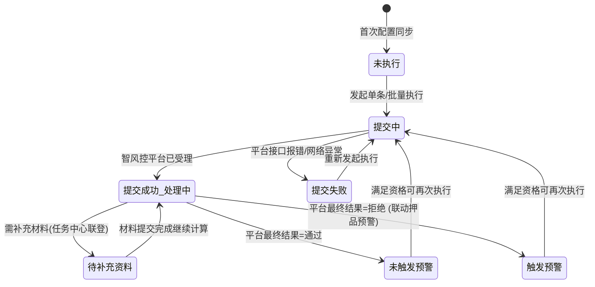
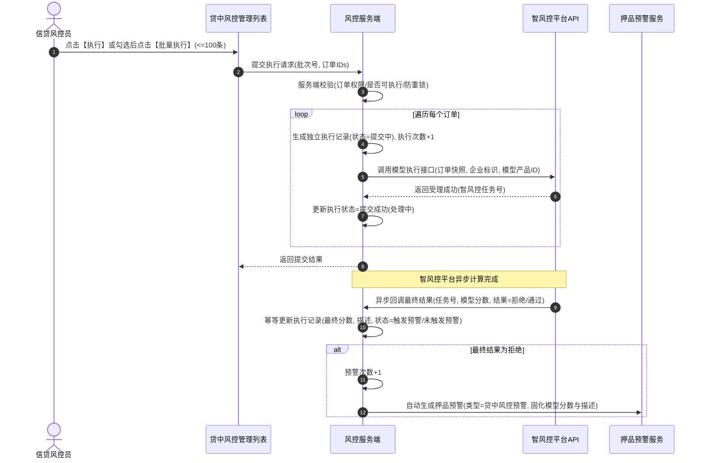

# 贷中风控管理主需求文档

> **文档体系（三件套为核心）**：
>
> | 层级 | 文档 | 职责 |
> | :--- | :--- | :--- |
> | **核心** | 本文（主 PRD） | 业务背景、范围、架构、**页面功能说明**、场景、状态机摘要、规则摘要、验收 |
> | **核心** | [贷中风控管理字段清单](./贷中风控管理字段清单.md) | 字段定义、筛选/列表/详情/执行与跳转、展示顺序与控件规格 |
> | **核心** | [贷中风控管理业务规则规格](./贷中风控管理业务规则规格.md) | 状态机本体、R/C/P 规则、时序图、流转表 |
> | *衍生* | ASCII 线框 / Demo 文档 | 由三件套派生的可视化与原型输入，**非独立真源** |
>
> **版本**：V1.9 | 2026-09-11
> **读者**：研发工程师、测试工程师、信贷风控产品经理、架构师
> **所属模块**：02-预警信息 / 03-贷中风控管理 | **菜单路径**：`预警信息 → 贷中风控管理`
> **模板选型**：台账流水类（[5-2-2 台账流水类 PRD 模板](../../../../05-常用模板/需求处理/5-2-2%20(输出)台账流水类PRD模板.md)）
>
> **规则来源**：执行资格、异步回调、联动与权限详见《[贷中风控管理业务规则规格](./贷中风控管理业务规则规格.md)》——**规则 ID 以该文件为唯一定义来源，本文仅摘要引用**
> **字段基准**：《[贷中风控管理字段清单](./贷中风控管理字段清单.md)》为字段唯一定义来源
>
> **衍生文档（可视化 / 原型）**：
> - **ASCII 线框**：[列表页](./贷中风控管理_ASCII_列表页.md)
> - **Demo 输入**：[列表页](./贷中风控管理_Demo_列表页.md)
> - **原型 DEV**：PC [`/物联网IOT与预警/预警信息/贷中风控管理`](http://localhost:5173/#/物联网IOT与预警/预警信息/贷中风控管理) | H5 [`/m/risk/mid-loan`](http://localhost:5173/#/m/risk/mid-loan)

---

## 1. 业务背景

在存货质押授信期内，借款企业经营状况、司法涉诉、征信舆情及上下游供应链资信变化，直接影响贷款本息偿还。
**贷中风控管理**面向已在 [03/03 订单预警配置](../../03-预警配置/03订单预警配置/订单预警配置主PRD.md) 中启用“贷中风控预警”的抵/质押订单，提供风控模型调用的执行管理中枢。它支持对存续订单**动态计算模型执行资格、发起单条/批量执行申请、跟踪智风控平台异步计算进度、联登任务中心处理补充资料，并在模型最终拒绝时自动联动生成押品预警**，实现贷中资信风控与物理押品监管的深度融合。

---

## 2. 功能范围

### 2.1 本期范围
- **管理记录自动生成与同步**：订单预警配置保存“贷中风控预警”成功后，按订单唯一标识自动幂等生成或更新管理台账；
- **执行资格动态计算**：结合订单状态（抵/质押中）、配置状态（启用）及最近一次执行状态，系统实时判定“是否可执行”；
- **单条与批量执行申请**：支持单条提交与最多 100 条的批量勾选提交，生成独立执行记录与智风控平台申请；
- **智风控异步回调与任务跟踪**：支持接收智风控平台异步返回的任务受理编号、模型分数及最终结果；
- **任务中心联登补充资料**：当模型执行需要补充资料时，在详情中提供联登至 `任务中心—其他审批—贷中风控受理` 的跳转处理入口；
- **押品预警自动触发**：模型最终结果为“拒绝”时，系统自动在 [02押品预警信息](../02押品预警信息/押品预警信息主PRD.md) 生成一条贷中风控押品预警；
- **安全与审计**：基于订单数据权限控制、执行记录历史快照防篡改与防重复提交分布式锁。

### 2.2 移动端范围
- 移动端仅支持贷中风控管理列表与执行历史详情的查看；单条/批量执行与补充资料联登在 Web 端完成。

### 2.3 不在本期范围
- 智风控平台内部算法模型研发与评分卡策略（由智风控平台独立负责）；
- 订单预警配置中模型的绑定与修改（归属 [03/03 订单预警配置](../../03-预警配置/03订单预警配置/订单预警配置主PRD.md)）；
- 押品预警产生后的单据处置与公示（归属 [02押品预警信息](../02押品预警信息/押品预警信息主PRD.md)）。

---

## 3. 模块定位与上下游关系

### 3.1 系统位置

| 项目 | 内容 |
| :--- | :--- |
| **模块层级** | 风险信息与处置层（智风控平台模型对接与贷中监控枢纽） |
| **核心职责** | 管理模型执行资格、发起异步计算、跟踪任务进度、记录执行历史并联动押品预警 |
| **上游依赖** | **03/03 订单预警配置**提供贷中风控子项的启用状态、模型产品和预警等级；**抵/质押订单主数据**提供订单 ID、货权关系、贷款余额及生命周期；**智风控平台 OpenAPI**提供模型调用结果和风险等级。保存同步必须按订单幂等，失败不得返回成功。来源：[03/03 订单预警配置](../../03-预警配置/03订单预警配置/订单预警配置主PRD.md)、[贷中风控管理字段清单](./贷中风控管理字段清单.md)、[B-迭代需求跨文档引用口径与来源索引](../../../README.md) REF-ORDER。 |
| **下游引用** | [02押品预警信息](../02押品预警信息/押品预警信息主PRD.md)、任务中心（其他审批）、操作审计日志 |
| **业务单据** | 本模块维护订单贷中风控执行台账与历史执行申请记录 |

### 3.2 执行状态机与流转模型

---

## 4. 页面功能说明

> 本节描述**做什么、怎么交互**；字段/控件见《[字段清单](./贷中风控管理字段清单.md)》；异步流程见 §5。

### 4.1 PC 列表页

| 项目 | 说明 |
| :--- | :--- |
| 页面目标 | 查看贷中模型执行台账，发起单条/批量执行，进入执行历史详情 |
| 页面路径 | `/预警信息/贷中风控管理` |
| 骨架结构 | 页头 + 筛选区 + 批量工具条 + 数据表格 + 分页 |

**筛选区**：订单号（模糊）、执行状态、是否可执行；查询为草稿态，点击「查询」生效；「重置」清空并回第 1 页。

**批量工具条**：「批量执行」（勾选 ≤100 条可执行记录；超限阻断 MID-TC02）。

**数据表格**：

- 列：序号、订单号、货主、押品信息、订单类型、风控模型、执行次数、预警次数、执行状态、最近执行时间、操作
- 可执行记录：「执行」「详情」；不可执行：仅「详情」，执行按钮禁用并 Tooltip 原因

**行操作「执行」**：二次确认 → 提交智风控异步申请 → Toast 反馈；处理中订单再次执行服务端拦截（MID-TC05）。

### 4.2 PC 详情页

| 项目 | 说明 |
| :--- | :--- |
| 页面路径 | `/预警信息/贷中风控管理/详情/:id` |
| 能力 | 只读订单识别信息 + **执行历史时间轴**（模型分数、结果描述、状态变迁） |

**详情分区**：基础识别（订单/货主/模型）→ 执行历史列表 → 待补充资料记录展示「任务中心联登」入口（P06 权限校验）。

**审批人侧不展示**：智风控平台内部算法细节；历史分数/描述为触发时刻快照，不可回写。

### 4.3 移动端（6.2）

仅列表与执行历史详情**只读**；单条/批量执行与任务中心联登在 PC 完成。

### 4.4 数据权限摘要

| 场景 | 规则 |
| :--- | :--- |
| 列表/详情 | 订单数据权限强过滤 |
| 执行 | 写权限 + 「可执行」动态判定 |
| 联登 | 任务中心权限 + 签名令牌 |

---

## 5. 操作流程与时序

### 5.1 操作总览

| 操作名称 | 入口 | 适用状态 | 前置条件 | 是否改变流水状态 | 联动下游影响 |
| :--- | :--- | :--- | :--- | :---: | :---: |
| **单条执行** | 列表操作列 | 可执行 | 订单抵质押中 + 配置启用 + 无处理中申请 | 是 | 产生执行记录，增加执行次数 |
| **批量执行** | 列表顶部操作栏 | 勾选可执行项 (<=100条) | 具备批量执行权限 | 是 | 批量生成独立申请与执行记录 |
| **查看详情** | 列表操作列 / 订单号 | 全部 | 拥有订单权限 | 否 | 查看执行历史与模型分数 |
| **补充资料联登** | 详情执行记录列 | 待补充资料 | 拥有任务中心权限 | 否 | 联登智风控平台处理材料 |

---

### 5.2 单条与批量执行流转

- **批量执行约束**：单次最多勾选 100 条；批量生成一个批次号，但每个订单独立向智风控提交、独立记录执行流水、独立返回结果；
- **防重复提交**：采用 `租户ID + 订单ID + 申请锁` 分布式锁，防止单条与批量并发提交同一订单。

---

## 6. 异常处理与安全保障

1. **异步回调幂等与补偿**：使用 `智风控任务号 + 执行记录号` 建立回调幂等机制，重复回调返回原结果；若回调异常中断，定时任务发起主动查询补偿；
2. **未知与超时状态保护**：智风控返回超时或未知结果时，系统保持 `处理中` 并标记异常，**严禁**将未知结果误判为通过；
3. **快照防篡改**：历史执行记录中的模型名称、模型分数、结果描述在落库时固化，后续模型升级不回写历史快照。

---

## 7. 验收标准与测试用例

| 用例编号 | 测试场景 | 前置条件 | 预期输出与系统行为 |
| :---: | :--- | :--- | :--- |
| **MID-TC01** | 执行资格动态计算 | 订单处于“已解押”状态 | 系统判定为“不可执行”，列表展示提醒图标，执行按钮置灰 |
| **MID-TC02** | 批量执行数量超限拦截 | 页面勾选 101 条记录 | 点击批量执行，系统弹出阻断提示“单次批量执行最多支持 100 条” |
| **MID-TC03** | 异步拒绝联动押品预警 | 智风控异步回调返回“拒绝” | 执行状态变为“触发预警”，预警次数+1，押品预警自动生成 1 条预警流水 |
| **MID-TC04** | 回调重复推送幂等测试 | 智风控针对同一任务号重复回调 2 次 | 仅首次处理并生成预警，第 2 次回调幂等响应，不重复增加预警次数 |
| **MID-TC05** | 在途申请防重复提交 | 订单 A 处于“提交成功(处理中)” | 再次尝试提交订单 A 执行，服务端直接拦截并提示“当前已有正在处理中的申请” |

---

## 8. 引用文档与修订记录

### 8.1 关联文档
- [贷中风控管理字段清单](./贷中风控管理字段清单.md)
- [贷中风控管理业务规则规格](./贷中风控管理业务规则规格.md)
- [贷中风控管理业务流程](./贷中风控管理业务规则规格.md)
- [订单预警配置主PRD](../../03-预警配置/03订单预警配置/订单预警配置主PRD.md)
- [押品预警信息主PRD](../02押品预警信息/押品预警信息主PRD.md)
- [贷中风控管理字段清单](./贷中风控管理字段清单.md)

### 8.2 修订记录

| 日期 | 版本 | 修订人 | 修订内容 |
| :--- | :---: | :---: | :--- |
| 2026-08-19 | V1.8 | 产品团队 | 统一规范命名为“贷中”，深度对齐 6.1 主 PRD 标准，细化资格判定、异步回调闭环、任务中心联登与测试矩阵。 |
| 2026-09-11 | V1.9 | 产品团队 | **对齐三件套标杆**：补 §4 页面功能说明；三件套/衍生文头；§5 更名为操作流程与时序 |
| 2026-08-18 | V1.0 | 产品团队 | 初版发布。 |
