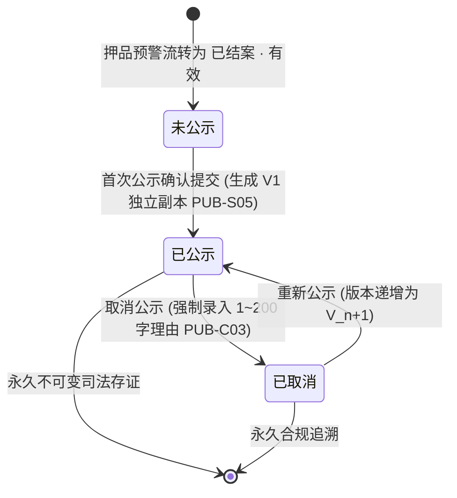
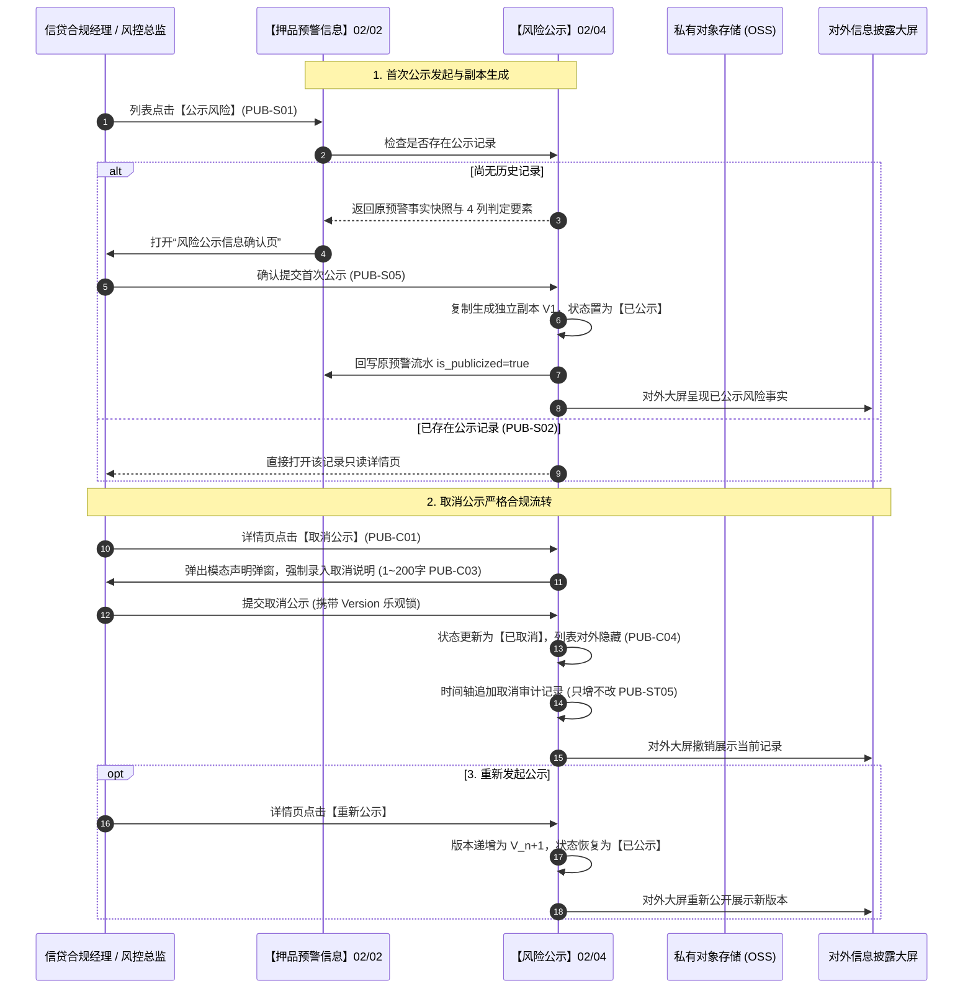

# 风险公示 业务规则规格

> **文档定位**：仓储风控 / 预警信息 / 风险公示模块（`02-04`）对外信息披露生命周期、原预警解耦机制、取消公示严格合规约束、多版本审计存证及数据权限控制的**唯一定义真源（SSOT）**。配套文档：[风险公示主PRD.md](./风险公示主PRD.md)（业务全景与页面交互说明）、[风险公示字段清单.md](./风险公示字段清单.md)（字段字典）。端侧原型与 ASCII 线框仅引用本文件规则编号（PUB-P01~P05, PUB-S01~S06, PUB-B01~B05, PUB-C01~C06, PUB-ST01~ST05），不重复定义规则本体。  
> **模块类型**：合规信息披露与多版本审计类（具有独立公示状态机与 Append-Only 版本审计，无审批流）  
> **版本**：V4.0 | **更新时间**：2026-09-18 | **责任人**：森云科技（Senyun Technology）  
> **参考规范**：[《00-全局契约与RBAC权限矩阵》](../../00-全局契约与RBAC权限矩阵.md)、[押品预警信息业务规则规格（02/02）](../02押品预警信息/押品预警信息业务规则规格.md)

---

## 一、单据与能力定位

| 项目 | 内容 |
| :--- | :--- |
| **模块层级** | **【风险信息与处置层】**（动产质押对外合规信息披露与审计公示中枢，非内部流水操作层） |
| **菜单路径** | PC端：`工作台 → 预警信息 → 风险公示`；移动端：`工作台 → 预警信息 → 风险公示` |
| **核心职责** | 承接已结案的重大押品预警；生成完全解耦的独立公示副本；提供单条确认发布、批量合规公示、取消公示严格审核（$\le 200$ 字必填）、重新发布及多版本不可变审计全生命周期管理 |
| **数据来源** | 【押品预警信息】台账（02/02）中处于 `已结案 · 有效` 的质押/抵押订单风险流水（历史监管订单不进入新增公示候选） |
| **上游依赖** | **【押品预警信息】台账（菜单：预警信息 → 押品预警信息，代号 02/02）**：提供已结案预警事实快照、订单主数据、4 列判定要素快照、现场排查说明及原始现场抓拍图； **抵/质押订单数据权限**：列表与详情严格按当前登录人的组织管辖与订单数据权限行级隔离。 |
| **下游影响** | **对外披露大屏与合规报表**：最新处于 `已公示` 状态的记录进入对外合规通报与企业信用履约档案； **【押品预警信息】台账**：首次公示成功后，回写原预警流水标记 `is_publicized=true`； **司法证据存证库**：每次发布、取消、重发生成不可篡改的操作审计日志与版本快照。 |
| **审核流边界** | **无审批流**——首次确认与取消公示由具备专属合规权限的角色确认后即刻生效，不进系统通用待办池。 |

---

## 二、数量与计算口径隔离表

| 口径名称 | 应用维度 | 业务含义与计算公式 / 判定条件 | 约束与边界说明 |
| :--- | :--- | :--- | :--- |
| **公示准入前置条件** | 公示发起门控 | 某条押品预警流水是否允许发起单条或批量风险公示： $$\text{EligibleForPub} = (\text{Status} = \text{RESOLVED\_VALID}) \land (\text{IsPublicized} = \text{false}) \land (\text{OrderType} \in \{\text{PLEDGE}, \text{MORTGAGE}\})$$ | 三要素必须同时满足；已存在公示历史或监管服务类型强阻断发起 |
| **取消说明字数口径** | 取消公示强校验 | 取消公示时录入的情况说明文本字符长度 $L_{\text{cancel}}$： $$1 \le L_{\text{cancel}} \le 200 \quad (\text{去除首尾空格})$$ | 禁止全空格或空字符；超限或为空前端提交按钮置灰阻断 |
| **公示版本号递增** | 多版本审计追溯 | 单条公示记录的版本计数器递增规则： $$\text{Version}_{n+1} = \text{Version}_n + 1$$ | 首次公示为 V1；取消公示保持当前版本号并记录动作；重新公示时递增生成新版本 |
| **批量公示候选集算子**| 批量操作过滤 | 针对操作人所选全量预警流水集合 $\text{Selected}$ 提取有效候选： $$S_{\text{candidate}} = \{ R \mid R \in \text{Selected}, \text{EligibleForPub}(R) = \text{true} \}$$ | 提交时服务端逐条原子核验；部分不满足项自动过滤或报错，成功项独立落库 |

---

## 三、单据状态机与生命周期流转

### 3.1 状态定义
公示记录拥有完全独立于内部预警流水的生命周期状态：

| 状态名称 | 状态编码 | 业务含义 | 是否终态 | 进入条件 | 退出条件 |
| :--- | :--- | :--- | :---: | :--- | :--- |
| **未公示** | `UNPUBLISHED` | 押品预警已结案，但尚未生成对外公示副本 | 否 | 押品预警处于已结案有效且未曾公示 | 发起单条或批量公示 |
| **已公示** | `PUBLISHED` | 风险信息已对外发布，处于公示生效期，列表公开可见 | 否 | 首次公示确认提交；或已取消后重新公示 | 发起取消公示操作 |
| **已取消** | `CANCELLED` | 公示已被合规撤销，列表隐藏，但详情与全量操作审计永久留痕 | 否 | 录入 1~200 字说明后取消公示 | 重新发起公示 |

### 3.2 状态流转图

### 3.3 状态流转表

| 当前状态 | 触发动作 | 前置业务条件 | 结果状态 | 二次确认与交互形式 | 联动后置影响 | 失败处理与反馈 |
| :--- | :--- | :--- | :--- | :--- | :--- | :--- |
| **未公示** | **首次单条公示** | 押品预警处于 `已结案 · 有效`；有效抵/质押订单；无历史公示记录 | 已公示 (V1) | 弹出“风险公示信息确认页”，核对原预警快照后点击【确认公示】 | ① 生成独立公示副本 V1； ② 回写原预警 `is_publicized=true`； ③ 记录首次公示审计。 | 校验冲突提示「已有公示记录，直接打开详情」 |
| **未公示** | **批量快速公示** | 勾选记录全部满足未公示准入条件；操作人具备批量权限 | 已公示 (逐条) | 弹出批量公示确认弹窗，确认后后台逐笔执行 | ① 逐条独立创建公示记录与快照； ② 逐条回写原预警标记； ③ 记录批量操作审计。 | 部分失败返回汇总明细，成功项安全落库 |
| **已公示** | **取消公示** | 当前最新状态为 `已公示`；操作人具备 `R-RISK-MGR` 权限 | 已取消 | 弹窗展示固定合规声明，强制录入 1~200 字取消说明 | ① 状态更新为 `已取消`； ② 风险公示列表隐藏该项； ③ 时间轴追加取消审计，保留历史快照。 | 字数不符提交置灰；并发冲突弹窗提示刷新 |
| **已取消** | **重新公示** | 当前最新状态为 `已取消`；操作人具备权限 | 已公示 (V_n+1) | 跳转公示确认页，核实后点击【确认重新公示】 | ① 公示版本递增（Version+1）； ② 状态恢复为 `已公示`，重新在列表展示； ③ 时间轴追加重发审计。 | 版本冲突强阻断，要求获取最新详情 |

---

## 四、动作能力与流转控制矩阵

| 触发动作 | 操作入口 | 适用角色 | 前置业务校验条件 | 结果状态 | 联动后置影响 | 失败阻断提示 |
| :--- | :--- | :--- | :--- | :--- | :--- | :--- |
| **查看公示详情** | 列表行操作【详情】链接 | 具备公示查看权限 (`R-RISK-PUB-VIEW` 等) | 记录属于操作人管辖订单范围 | 状态不变 | 打开详情页，展示公示基本信息、不可变原预警事实快照及多版本操作时间轴 | 「暂无该风险公示记录查看权限」 |
| **单条公示发起** | 押品预警行操作【公示风险】 | 信贷合规经理 (`R-RISK-MGR`) | ① 押品预警处于 `已结案 · 有效`； ② 关联抵押/质押订单； ③ 尚无公示历史记录。 | 进入确认页 $\rightarrow$ 已公示 | 首次进入“风险公示信息确认页”；若已有公示记录则直跳本模块详情 | 「公示失败：仅已结案且未公示的预警支持发起公示」 |
| **批量公示发起** | 押品预警顶部【批量公示风险】 | 信贷合规经理 (`R-RISK-MGR`) | ① 勾选 $\ge 1$ 条记录； ② 所选项全部满足未公示准入条件。 | 已公示 (逐条独立) | 逐条生成独立公示记录，批量写入风险公示台账并回写押品预警标记 | 「操作失败：请勾选至少一条已结案且未公示的预警」 |
| **取消风险公示** | 详情页右上角【取消公示】按钮 | 信贷合规经理 (`R-RISK-MGR`)、风控总监 | ① 当前最新状态严格处于 `已公示`； ② 取消说明字符在 1~200 字之间（PUB-C03）。 | 已取消 | ① 状态变更为 `已取消`； ② 风险公示列表对外隐藏； ③ 详情页时间轴追加只增不改的操作记录。 | 「取消公示失败：请输入1~200字的取消说明」 「该记录已被他人取消，请刷新重试」 |
| **重新发起公示** | 详情页右上角【重新公示】按钮 | 信贷合规经理 (`R-RISK-MGR`) | 当前最新状态严格处于 `已取消` 且关联订单依然有效 | 已公示 (新版本) | ① 公示版本号递增； ② 重新在风险公示列表对外展示； ③ 时间轴追加重新发布审计记录。 | 「数据已被他人更新，请刷新重试」 |
| **多条件查询** | 筛选区【查询】按钮 | 全部角色 | 规则名/订单号/货主/类型输入 $\le 50$ 字符 | 刷新列表 | 服务端注入订单权限过滤，固定仅返回当前最新为 `已公示` 的记录 | — |

---

## 五、核心业务规则清单 (PUB-P01 ~ PUB-ST05)

### 5.1 权限与数据范围规则 (PUB-P01 ~ PUB-P05)

#### 【风险公示菜单与细粒度操作鉴权规则】(PUB-P01)
* **权限矩阵**：
  - 菜单访问与列表/详情只读查阅：授予 `R-RISK-PUB-VIEW`、`R-RISK-MGR`、`R-SYS-ADMIN`；
  - 单条与批量【公示风险】写权限：授予信贷合规经理 (`R-RISK-MGR`) 与超级管理员；
  - 【取消公示】核心高危权限：严格仅授予信贷合规经理 (`R-RISK-MGR`) 与风控总监，普通业务员无权操作。

#### 【订单数据权限行级隔离过滤规则】(PUB-P02)
* **行级隔离**：来源预警、订单号、预警抓拍图、公示内容及详情，服务端强制按登录账号管辖的组织架构与订单数据权限行级过滤，越权数据一律屏蔽。

#### 【失去数据权限即刻阻断访问规则】(PUB-P03)
* **防越权保护**：用户因岗位变动失去订单或预警数据权限后，系统禁止通过历史 URL、浏览器缓存、图片原始路径或公示主键继续调阅或操作，一律返回 403 错误。

#### 【公示操作服务端二次强校验规则】(PUB-P05)
* **安全底线**：所有创建、编辑、批量提交和取消公示接口，服务端必须重新校验登录人角色、机构范围与记录最新状态，严禁信任前端传输的参数。

---

### 5.2 原预警与公示副本解耦规则 (PUB-D01 ~ PUB-D05)

#### 【首次公示独立存证副本生成规则】(PUB-D01)
* **解耦模型**：首次公示确认时，系统从【押品预警信息】（02/02）原子读取触发时刻的订单信息、质押货物明细、4 列判定要素快照及现场排查说明，在【风险公示】台账（02/04）复制生成一份独立的初始存证副本。

#### 【双向不可逆快照隔离规则】(PUB-D02)
* **快照隔离原则**：
  1. 原预警后续发生任何状态变迁（如订单出库办结置作废、现场补录说明等），**绝对不自动改写**已生成的公示副本；
  2. 公示侧发起的取消公示、重新公示或内容补充，也**绝对不反向改写**原预警流水的判定事实与处理人记录。

#### 【订单类型范围白名单约束规则】(PUB-D03)
* **订单准入白名单**：新增风险公示仅面向处于抵押中或质押中的商业订单开放；监管服务订单因业务属性差异，仅保留历史查询与详情审计，禁止进入新增公示候选池。

---

### 5.3 单条与批量公示发布规则 (PUB-S01 ~ PUB-B05)

#### 【单条公示入口智能分流规则】(PUB-S01)
* **入口分流判定**：从押品预警行操作点击【公示风险】时：
  1. 若该预警尚未生成过任何公示记录，系统引导进入“风险公示信息确认”页；
  2. 若该预警在历史中曾生成过公示记录（含已公示或已取消），系统直接打开本模块只读详情页，阻断重复创建（PUB-S02）。

#### 【批量公示候选准入强校验规则】(PUB-B01)
* **批量候选准入**：批量勾选记录必须**同时满足**：① 原预警处于 `已结案 · 有效`；② 关联有效抵押/质押订单；③ **从未产生过公示记录**（已取消记录不属于未公示，禁止重新批量勾选）；④ 当前账号具备批量操作权限。

#### 【批量公示独立子事务与容错规则】(PUB-B04)
* **独立事务单元**：批量提交以每笔原预警为独立事务单元，逐条独立落库生成公示记录与审计日志，严禁将多笔违规事实粗暴合并为一条公示；部分失败不影响其他成功记录落库（PUB-B05）。

---

### 5.4 取消公示与状态展示规则 (PUB-C01 ~ PUB-ST05)

#### 【取消公示操作入口门控规则】(PUB-C01)
* **取消门控**：取消公示只能从当前最新状态严格为 `已公示` 的详情页发起，操作人必须具备取消公示权限；已处于 `已取消` 状态的记录禁止重复操作。

#### 【取消公示固定文案与合规确认规则】(PUB-C02)
* **合规声明**：点击【取消公示】弹出模态弹窗，固定展示严正声明：“取消公示后，该风险信息将不再对外展示，但系统将永久保留本次取消记录以供审计。”

#### 【取消说明必填字数强约束规则】(PUB-C03)
* **必填校验**：取消说明为必填多行文本框，字符长度必须在 $1 \sim 200$ 个字符之间（去首尾空格），禁止全空格或空字符提交，违规时提交按钮置灰阻断。

#### 【取消成功列表隐藏与详情留痕规则】(PUB-C04)
* **展示隔离**：取消成功后，公示侧状态变更为 `已取消`，风险公示列表（仅展示已公示）自动过滤隐藏当前记录；公示详情页永久保留，时间轴完整记录取消人、取消时间与取消说明。

#### 【已公示台账专属过滤展示规则】(PUB-ST02)
* **台账过滤**：风险公示列表固定仅呈现当前最新状态为 `已公示` 的记录，列表不提供公示状态筛选项，保障对外展示界面的严谨性与纯净度。

#### 【多版本操作审计只增不改规则】(PUB-ST05)
* **审计存证**：详情页时间轴完整沉淀首次公示、取消公示、重新公示的操作记录，包含操作人、角色、机构、时间戳、IP、前后版本镜像与取消理由，底层 Append-Only 存储，严禁物理修改或删除。

---

## 六、异常与边界控制矩阵 (PUB-TC01 ~ PUB-TC07)

| 异常编号 | 异常场景 | 系统判定与控制动作 | 前端反馈与提示 |
| :--- | :--- | :--- | :--- |
| **【重复发起首次公示拦截】(PUB-TC01)** | 对已生成过公示记录的预警再次点击公示 | 服务端查询发现已存在对应公示主键 | 拦截进入首次确认页，直接重定向打开该记录公示详情页 |
| **【取消说明必填字数超限】(PUB-TC02)** | 取消公示弹窗中说明为空或字数超过 200 字 | 前端表单与服务端排他校验字符长度在 $1 \sim 200$ 字外 | 提交按钮置灰阻断，红字提示：`请输入1~200字的取消说明` |
| **【未结案记录尝试发起公示】(PUB-TC03)** | 绕过界面尝试对处于 `待处置` 或 `已作废` 预警公示 | 服务端排他校验原预警状态已非 `已结案 · 有效` | 接口调用返回 403 阻断，浮窗提示：`仅已结案的押品预警支持发起风险公示` |
| **【已取消记录进入批量候选】(PUB-TC04)** | 批量勾选时包含了曾公示过但已取消的记录 | 服务端校验该预警存在历史公示档案 | 提交阻断，弹窗提示：`所选记录包含已公示过的数据，不可重复批量公示` |
| **【并发取消公示版本冲突】(PUB-TC05)** | 多人并发打开同一公示详情并先后提交取消 | 提交时携带的公示版本与数据库版本号不一致 | 提交阻断，弹窗警告提示：`该公示记录已被他人操作，请刷新详情后重试` |
| **【取消公示高危权限缺失】(PUB-TC06)** | 无合规管理权限的角色尝试调用取消公示接口 | 服务端鉴权发现操作人缺失 `R-RISK-MGR` 权限 | 阻断提交并记录越权审计日志，浮窗提示：`您暂无取消公示权限，请联系风控总监` |
| **【私有抓拍图片访问签名过期】(PUB-TC07)** | 详情页大图预览时签名超过 15 分钟时效 | OSS 鉴权网关返回 SignatureDoesNotMatch | 前端自动触发静默二次刷新换取新签名，若失效提示：`图片签名已过期，请刷新页面` |

---

## 七、跨模块业务联动与时序推演

---

## 八、规则全景速查索引表

| 规则编码 | 规则业务全称 | 规则所属分类 | 系统核心控制口径摘要 |
| :--- | :--- | :--- | :--- |
| **PUB-P01** | 【风险公示菜单与操作鉴权规则】 | 权限控制 | 菜单访问与发布/取消操作细粒度鉴权 |
| **PUB-P02** | 【订单数据权限行级隔离过滤规则】 | 数据隔离 | 列表与详情按管辖组织与订单数据权限隔离 |
| **PUB-P03** | 【失去权限即刻阻断访问规则】 | 安全控制 | 失去权限后禁止通过 URL 或缓存越权调阅 |
| **PUB-P05** | 【公示操作服务端二次强校验规则】 | 安全控制 | 接口服务端强制校验权限与状态，不信客户端 |
| **PUB-D01** | 【首次公示独立存证副本生成规则】 | 架构解耦 | 首次公示从原预警复制独立存证副本 V1 |
| **PUB-D02** | 【双向不可逆快照隔离规则】 | 司法存证 | 原预警变迁不改写公示，公示操作不回写原预警 |
| **PUB-D03** | 【订单类型范围白名单约束规则】 | 准入控制 | 仅面向抵押与质押订单开放，监管服务订单禁新增 |
| **PUB-S01** | 【单条公示入口智能分流规则】 | 页面流转 | 无记录进确认页，有记录直跳详情页 |
| **PUB-S02** | 【已有公示记录直接打开详情规则】 | 防重控制 | 已有公示历史记录点击公示直接进入详情 |
| **PUB-S03** | 【首次确认页准入前置校验规则】 | 准入控制 | 仅处于已结案有效且未曾公示方可进确认页 |
| **PUB-S04** | 【首次确认页读取快照回填规则】 | 数据回填 | 读取原预警触发快照与处理留痕回填表单 |
| **PUB-S05** | 【首次提交成功创建首个版本规则】 | 版本控制 | 提交成功创建公示记录与 V1 首个版本 |
| **PUB-B01** | 【批量公示候选准入强校验规则】 | 批量控制 | 原预警已结案、有效抵质押且从未公示方可候选 |
| **PUB-B04** | 【批量公示独立子事务与容错规则】 | 批量调度 | 每笔原预警为独立事务单元，逐笔独立建档 |
| **PUB-C01** | 【取消公示操作入口门控规则】 | 操作门控 | 仅最新状态为已公示的详情页方展示取消按钮 |
| **PUB-C02** | 【取消公示固定文案与合规确认规则】| 合规确认 | 弹窗固定展示取消公示严正声明文案 |
| **PUB-C03** | 【取消说明必填字数强约束规则】 | 表单校验 | 取消说明必填且字符长度在 1~200 字之间 |
| **PUB-C04** | 【取消成功列表隐藏与详情留痕规则】| 状态变迁 | 状态置已取消，列表对外隐藏，详情保留全量审计 |
| **PUB-C05** | 【取消公示不改写原预警事实规则】 | 快照保护 | 取消公示绝对不改写原预警的触发与处置事实 |
| **PUB-C06** | 【取消公示后保持已公示过属性规则】| 状态约束 | 取消后仍属于“已公示过”，不可再进首次确认页 |
| **PUB-ST01**| 【公示状态三态枚举与流转规则】 | 状态机 | 未公示、已公示、已取消，取消后不回未公示 |
| **PUB-ST02**| 【已公示台账专属过滤展示规则】 | 列表展示 | 风险公示列表固定仅呈现当前为已公示的记录 |
| **PUB-ST05**| 【多版本操作审计只增不改规则】 | 存证审计 | 时间轴倒序记录历次变迁，底层 Append-Only |

---

## 九、修订记录

| 日期 | 版本 | 修订人 | 变更内容说明 |
| :--- | :---: | :--- | :--- |
| 2026-08-20 | V1.0 | 森云科技 PM 团队 | 初版风险公示业务规则制定与独立副本解耦模型确立 |
| 2026-09-11 | V1.2 | 森云科技 PM 团队 | 统一取消公示 200 字校验与已公示台账专属展示逻辑 |
| 2026-09-18 | **V4.0** | 森云科技 PM 团队 | **基准化重塑升级**：增补《二、数量与计算口径隔离表》（LaTeX公式定义准入三要素、取消字数约束、版本计数器）；升级为 7 列动作控制矩阵与 4 列异常矩阵；补齐跨模块时序推演与标准引用 |
