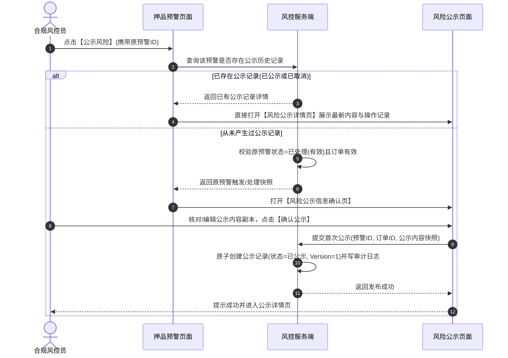

# 风险公示主需求文档

> **文档体系（三件套为核心）**：
>
> | 层级 | 文档 | 职责 |
> | :--- | :--- | :--- |
> | **核心** | 本文（主 PRD） | 业务背景、范围、架构、**页面功能说明**、场景、状态机摘要、规则摘要、验收 |
> | **核心** | [风险公示字段清单](./风险公示字段清单.md) | 字段定义、筛选/列表/详情/取消公示、展示顺序与控件规格 |
> | **核心** | [风险公示业务规则规格](./风险公示业务规则规格.md) | 状态机本体、R/C/P 规则、时序图、流转表 |
> | *衍生* | ASCII 线框 / Demo 文档 | 由三件套派生的可视化与原型输入，**非独立真源** |
>
> **版本**：V2.0 | 2026-09-11
> **读者**：研发工程师、测试工程师、信贷合规经理、风控总监、架构师
> **所属模块**：02-预警信息 / 04-风险公示 | **菜单路径**：`预警信息 → 风险公示`
> **模板选型**：台账流水类（[5-2-2 台账流水类 PRD 模板](../../../../05-常用模板/需求处理/5-2-2%20(输出)台账流水类PRD模板.md)）
>
> **规则来源**：公示状态机、取消公示、快照隔离与权限详见《[风险公示业务规则规格](./风险公示业务规则规格.md)》——**规则 ID 以该文件为唯一定义来源，本文仅摘要引用**
> **字段基准**：《[风险公示字段清单](./风险公示字段清单.md)》为字段唯一定义来源

> **当前订单范围（2026-09-11）**：监管订单当前关闭。当前新增风险公示仅允许关联有效抵押/质押订单；历史监管公示记录仅保留查询、详情和审计，不进入新增或批量公示候选。
>
> **衍生文档（可视化 / 原型）**：
> - **ASCII 线框**：[列表页](./风险公示_ASCII_列表页.md)
> - **Demo 输入**：[列表页](./风险公示_Demo_列表页.md)
> - **原型 DEV**：PC [`/物联网IOT与预警/预警信息/风险公示`](http://localhost:5173/#/物联网IOT与预警/预警信息/风险公示) | H5 [`/m/risk/disclosures`](http://localhost:5173/#/m/risk/disclosures)

---

## 1. 业务背景

在动产质押与仓储监管生态中，对已核实解除的历史重大风险进行适度、合规的信息披露（风险公示），有助于提升质押存货透明度、满足资金方审计监管合规要求，并对失信与违规行为形成威慑。
**风险公示**面向 [02押品预警信息](../02押品预警信息/押品预警信息主PRD.md) 中处于“已结案 · 有效”的重大押品风险，提供对外信息披露的发布与管理中枢。它建立**原预警与公示记录完全解耦的独立快照机制**，支持单条确认公示、批量快速公示、公示版本管理以及**取消公示（200 字原因核查、多版本操作审计只增不改）**，确保公示信息客观严谨、合规可溯。

---

## 2. 功能范围

### 2.1 本期范围
- **公示列表与状态检索**：支持按规则名称（模糊）、预警类型、订单号、货主名称、状态（当前默认仅展示最新状态为“已公示”的记录）多维度筛选；
- **单条公示分流处理**：从押品预警点击【公示风险】时，已存在公示记录直接进入详情，无公示记录且满足条件进入“风险公示信息确认”页；
- **首次公示副本生成**：首次公示从原预警读取并复制初始快照，生成独立的公示版本与记录；原预警后续变更不影响公示副本；
- **批量公示快速发布**：支持对多条“已结案 · 有效且从未公示”的原预警进行批量选择，逐条独立落库生成公示记录与版本；
- **取消公示与多版本审计**：支持在详情页对已公示记录发起取消公示（固定弹窗文案、<=200 字说明必填）；取消后列表隐藏，但历史详情与操作记录永久保留；
- **安全与审计**：基于订单数据权限与公示 标签页 (Tab) 权限双重隔离、防并发锁与全路径操作审计。

### 2.2 移动端范围
- 移动端仅支持风险公示列表与公示详情的查看；首次公示确认、批量公示与取消公示在 Web 端完成。

### 2.3 不在本期范围
- 押品预警原始流水产生与单据处置解除（归属 [02押品预警信息](../02押品预警信息/押品预警信息主PRD.md)）；
- 外部监管机构系统接口直连上报（由外部合规监管报送平台负责）。

---

## 3. 模块定位与上下游关系

### 3.1 系统位置

| 项目 | 内容 |
| :--- | :--- |
| **模块层级** | 风险信息与处置层（对外风险信息披露与审计公示中枢） |
| **核心职责** | 承接已处理押品风险，生成独立公示副本，提供确认发布、取消公示与多版本留痕 |
| **上游依赖** | **02押品预警信息**提供已处理且有效的押品预警记录、等级/来源/处理结果和订单关联；只有满足处理状态和公示权限的记录才可进入公示。来源：[02押品预警信息](../02押品预警信息/押品预警信息主PRD.md)、[B-迭代需求跨文档引用口径与来源索引](../../../README.md) REF-ORDER/REF-RBAC。 |
| **下游引用** | 风险公示大屏、监管合规报表、企业信用履约档案、操作审计日志 |
| **业务单据** | 本模块生成独立的风险公示单据，拥有 `未公示 -> 已公示 <-> 已取消` 独立状态机 |

### 3.2 原预警与公示副本解耦模型

```mermaid
flowchart LR
    subgraph S1[押品预警信息]
        A[原预警流水: 已处理(有效)]
    end

    subgraph S2[首次公示确认]
        B[读取原预警快照] --> C[复制生成公示初始副本]
    end

    subgraph S3[风险公示独立记录]
        D[公示版本 V1: 已公示]
        E[取消公示: 已取消(说明+操作人)]
        F[多版本审计操作记录: 只增不改]
    end

    A --> B
    C --> D
    D --> E
    D & E --> F
```

> **核心原则**：原预警与公示记录通过业务关联键关联，但不共用可变字段、不相互覆盖状态。公示侧的发布或取消不改写原预警；原预警后续变化也不自动改写已生成的公示快照。

---

## 4. 页面功能说明

> 本节描述**做什么、怎么交互**；字段见《[字段清单](./风险公示字段清单.md)》；首次公示/取消流程见 §5。

### 4.1 PC 列表页

| 项目 | 说明 |
| :--- | :--- |
| 页面目标 | 查看当前**已公示**风险副本，进入详情审计 |
| 页面路径 | `/预警信息/风险公示` |
| 骨架结构 | 页头 + 筛选区 + 数据表格 + 分页 |

**筛选区**：规则名称、订单号、货主名称（模糊）；状态下拉（6.2 列表默认仅展示最新状态=**已公示**）。

**数据表格**：

- 列：序号、预警订单、货主、预警类型、预警内容、抓拍、预警时间、处理时间、处理人、公示状态、公示时间、操作
- **操作列仅「详情」**；不提供解除/编辑原预警入口

**空态/分页**：标准分页；日期空值展示 `—`；长文本省略 + Tooltip。

### 4.2 PC 详情页

| 项目 | 说明 |
| :--- | :--- |
| 页面路径 | `/预警信息/风险公示/详情/:id` |
| 能力 | 只读公示副本 + 多版本操作审计时间轴 |

**内容分区**：公示基本信息 → 原预警事实快照（不可变）→ 操作记录（首次发布/取消公示等只增不改）。

**页头动作**：

| 最新状态 | 按钮 |
| :--- | :--- |
| 已公示 | 「取消公示」（R-RISK-MGR 等权限） |
| 已取消 | 仅「返回」 |

**取消公示弹窗**：固定确认文案 + 取消说明必填 ≤200 字（PUB-TC05）→ 成功后列表隐藏该项，详情保留完整审计。

### 4.3 押品预警侧入口（跨页）

| 入口 | 行为 |
| :--- | :--- |
| 押品列表「公示风险」/「批量公示」 | 无历史公示 → **首次确认页**；已有公示/已取消 → **直达本模块详情**（PUB-TC01） |
| 首次确认页 | 核对/编辑公示内容副本 →「确认公示」→ 生成 V1 已公示记录 |

### 4.4 移动端（6.2）

仅列表与详情**只读**；首次确认、批量公示、取消公示在 PC 完成。

---

## 5. 操作流程与时序

### 5.1 操作总览

| 操作名称 | 入口 | 适用状态 | 前置条件 | 是否改变公示状态 | 联动下游影响 |
| :--- | :--- | :--- | :--- | :---: | :---: |
| **单条公示确认** | 押品预警列表【公示风险】 | 原预警已解除且无公示记录 | 具备公示操作权限 | 是 (新建记录) | 生成公示 V1 版本，状态=已公示 |
| **批量公示风险** | 押品预警列表【批量公示】 | 原预警已解除且无公示记录 | 具备批量公示权限 | 是 (批量新建) | 逐条生成公示记录，状态=已公示 |
| **查看公示详情** | 风险公示列表 / 押品预警 | 全部有公示历史记录 | 具备公示查看权限 | 否 | 查看最新内容与操作审计流水 |
| **取消风险公示** | 风险公示详情页 | 当前最新状态为已公示 | 具备取消公示权限 | 是 (状态变更) | 状态更新为已取消，列表隐藏当前项 |

---

### 5.2 单条公示入口分流与首次确认



---

### 5.3 取消风险公示流转
- **操作入口**：仅从最新状态为“已公示”的详情页发起；
- **二次确认与表单**：
  - 固定展示文案：“您正在操作取消风险公示，确认后风险公示列表将取消显示当前操作的风险内容，点击确认按钮后生效。”
  - **取消公示说明**：必填文本域，长度不超过 200 个字符；
- **状态流转与审计**：
  - 取消成功后，最新公示状态变更为 `已取消`；
  - 风险公示列表不再显示该项；但详情页与操作记录中完整保留取消说明、操作人与时间；
  - 本条记录被标记为“已公示过”，后续不可再次进入批量公示候选。

---

## 6. 异常处理与安全保障

1. **并发首次公示防重复生成**：采用 `预警ID + 公示锁`，并发提交时仅首个请求成功创建公示记录，后序请求直接返回已有记录并引导进入详情；
2. **并发取消公示乐观锁控制**：提交取消时校验当前公示版本号，版本冲突时拒绝覆盖并提示重新获取最新详情；
3. **操作审计永久保留**：首次发布、批量发布、取消公示、失败拦截等所有操作均记录不可篡改的结构化审计日志（操作人/角色/IP/请求ID/前后版本镜像）。

---

## 7. 验收标准与测试用例

| 用例编号 | 测试场景 | 前置条件 | 预期输出与系统行为 |
| :---: | :--- | :--- | :--- |
| **PUB-TC01** | 单条公示入口分流验证 | 预警 A 从未公示；预警 B 已取消公示 | 点击预警 A 进入确认页；点击预警 B 直接进入详情页并展示“已取消” |
| **PUB-TC02** | 首次公示快照解耦 | 预警 C 首次公示成功 | 修改原预警关联的其他信息，公示侧内容保持不变，快照未被篡改 |
| **PUB-TC03** | 批量公示逐条独立落库 | 勾选 5 条原预警提交批量公示 | 5 条记录逐条独立生成公示记录与 V1 版本，单条失败不影响其他成功项 |
| **PUB-TC04** | 取消公示表单与列表联动 | 对记录 D 提交取消公示（填写 50 字说明） | 提交成功后记录 D 状态变为已取消，风险公示列表不再展示该记录 |
| **PUB-TC05** | 取消公示字数越界拦截 | 取消说明输入 201 个字符 | 前后端均拦截提交，提示“取消说明不能超过 200 个字符” |

---

## 8. 引用文档与修订记录

### 8.1 关联文档
- [风险公示字段清单](./风险公示字段清单.md)
- [风险公示业务规则规格](./风险公示业务规则规格.md)
- [风险公示业务流程](./风险公示业务规则规格.md)
- [押品预警信息主PRD](../02押品预警信息/押品预警信息主PRD.md)
- [风险公示字段清单](./风险公示字段清单.md)

### 8.2 修订记录

| 日期 | 版本 | 修订人 | 修订内容 |
| :--- | :---: | :---: | :--- |
| 2026-08-19 | V1.8 | 产品团队 | 深度对齐 6.1 主 PRD 标准，细化原预警解耦副本、单条入口分流、取消公示 200 字说明与多版本审计测试矩阵。 |
| 2026-09-11 | V1.9 | 产品团队 | **对齐三件套标杆**：补 §4 页面功能说明；三件套/衍生文头；§5 更名为操作流程与时序 |
| 2026-09-11 | **V2.0** | 产品团队 | **监管订单当前关闭**：当前新增公示仅关联有效抵押/质押订单，历史监管公示仅只读查询、详情和审计 |
| 2026-08-18 | V1.0 | 产品团队 | 初版发布。 |
