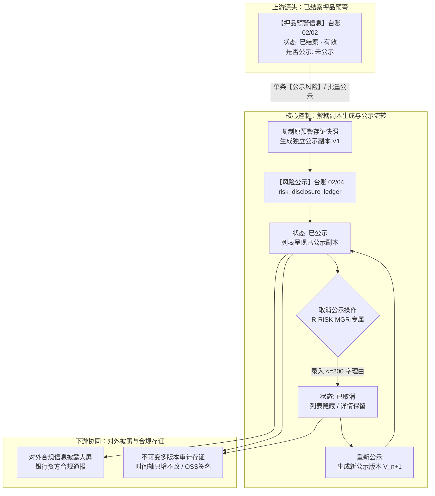
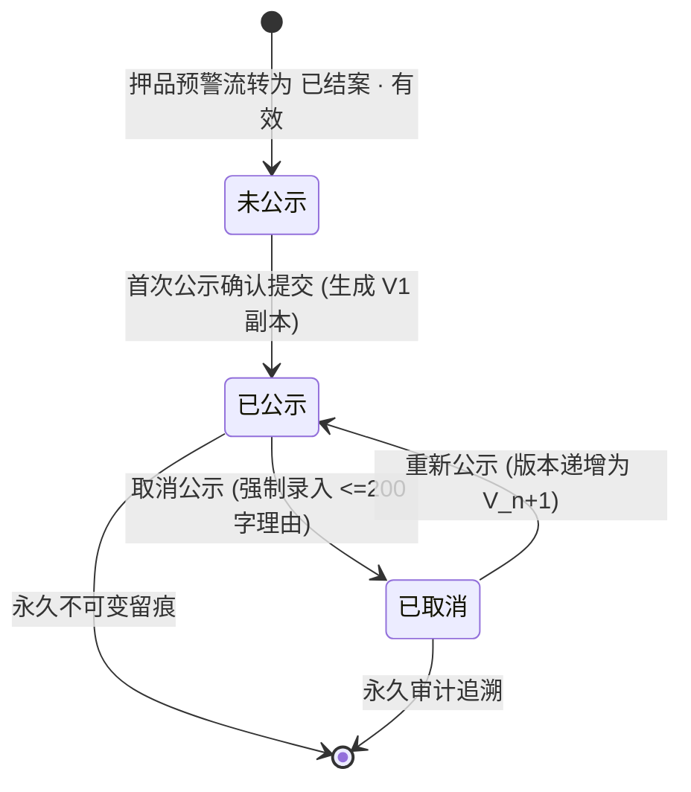

# 风险公示主PRD

> **版本**：V4.0 | 2026-09-18  
> **读者**：研发工程师、测试工程师、信贷合规经理、风控总监、金融审计师、架构师  
> **所属模块**：02-预警信息 / 04-风险公示 | **菜单路径**：`预警信息 → 风险公示`  
> **模板选型**：台账流水类（[5-2-2 台账流水类 PRD 模板](../../../../05-常用模板/需求处理/5-2-2%20(输出)台账流水类PRD模板.md)）  
>
> **文档体系（三件套为唯一核心真源）**：
>
> | 层级 | 文档 | 职责 |
> | :--- | :--- | :--- |
> | **核心** | 本文（主 PRD） | 业务背景、功能范围对比、模块定位与系统链路、**页面功能说明**、业务场景四列故事、状态机摘要、规则摘要、验收标准 |
> | **核心** | [风险公示字段清单](./风险公示字段清单.md) | 11 列标准字段字典、筛选/列表/详情/取消公示、展示顺序与控件规格 |
> | **核心** | [风险公示业务规则规格](./风险公示业务规则规格.md) | 状态机本体、LaTeX 公示准入与版本计数口径、7 列动作能力矩阵、PUB-* 规则本体、异常边界与时序推演 |
> | *衍生* | ASCII 线框 / Demo 文档 | 由三件套派生的可视化与原型输入，**非独立真源** |
>
> **跨模块引用标准**：
> - 风险事实源头台账：【押品预警信息】台账（菜单：`预警信息 → 押品预警信息`，代号 02/02）
> - 全局权限矩阵依据：[00-全局契约与RBAC权限矩阵](../../00-全局契约与RBAC权限矩阵.md) 第四章 §1

---

## 1. 业务背景与业务痛点

### 1.1 业务背景与台账定位
在动产质押与仓储监管金融生态中，对已经核实解除的历史重大风险进行适度、客观、合规的信息披露（合规风险公示），有助于提升动产存货透明度、满足资金方与监管机构合规审计要求，并对失信借款企业与违规监管方形成强有力的信用威慑。  
**风险公示**面向在【押品预警信息】（02/02）中处于 `已结案 · 有效` 状态的重大押品风险事件，作为**对外合规披露与合规审计的统一发布与管理中枢**。本模块建立**原预警流水与对外公示记录完全解耦的独立不可变快照机制**，支持从押品预警端发起单条确认公示、批量快速公示、公示版本递增管理以及严格的**取消公示（强制录入 $\le 200$ 字理由、多版本操作审计只增不改）**，确保披露事实客观严谨、司法存证严密闭环。

### 1.2 核心业务痛点
* **痛点 1：重大违约信息缺乏规范合规披露平台**：以往借款企业发生平仓、涉诉或虚假质押后，风险信息仅沉淀在内部工单，资金方与其他金融合作机构无法获知失信事实；
* **痛点 2：对外披露与内部流水直接耦合带来篡改隐患**：若对外公示直接读取内部预警流水，内部对历史记录的核销维护可能反向污染对外公告内容，破坏司法存证效力；
* **痛点 3：取消公示缺乏严格的审核门控与留痕**：随意取消公示可能产生道德风险与利益输送，缺乏强制录入核查理由与不可逆操作审计机制；
* **痛点 4：缺乏完整公示版本回溯能力**：历史公示从发布、取消到重新公示的全生命周期缺乏版本追踪快照，无法满足合规审计倒查要求。

---

## 2. 功能范围 (In / Out of Scope)

| 包含功能范围 (In Scope) | 不包含功能范围 (Out of Scope) |
| :--- | :--- |
| - **已公示台账检索呈现**：PC 端提供规则名称、订单号、货主、预警类型 4 字段独立模糊匹配（AND 组合）；列表固定仅展示最新处于“已公示”状态的记录（RISK-PUB-ST02）； - **原预警与公示副本完全解耦**：首次公示从押品预警复制生成独立的初始快照与版本（V1），后续原预警更新不影响公示副本，公示变更不回写原预警； - **单条公示分流与首次确认**：从押品预警点击【公示风险】时，无公示记录进入“风险公示信息确认”页；已有公示记录直接进入公示详情； - **批量公示快速发布**：支持对多条处于“已结案 · 有效且从未公示”的押品预警进行批量勾选，逐条独立落库生成公示记录； - **取消公示合规控制**：仅高阶合规权限可发起取消公示，弹窗强制录入 1~200 字取消说明，取消后列表隐藏当前项，但详情保留完整历史； - **多版本审计只增不改**：时间轴完整沉淀首次发布、取消公示、重新发布的操作人、时间、理由与数据镜像； - **全端协同体验**：PC 端提供完整工作台；H5 移动端支持已公示列表、详情快照及底部取消/重新公示操作。 | - **押品预警原始流水产生与核销**：风险指标计算与现场核销归属【押品预警信息】（菜单：`预警信息 → 押品预警信息`，代号 02/02）； - **外部监管机构接口直连上报**：与中国动产融资统一登记公示系统等外部监管直连由外部独立报送平台负责； - **历史监管服务订单新增公示**：当前新增风险公示仅允许关联有效抵押/质押订单；历史监管服务订单仅保留查询追溯，不进入新增公示候选； - **物理删除公示历史记录**：所有公示记录与操作留痕严格采用 Append-Only 归档，禁止任何物理删除。 |

---

## 3. 模块定位与系统链路

### 3.1 模块定位说明
【风险公示】台账（02/04）位于系统“风险信息与处置层”，是连接内部风控中枢与外部合规披露的桥梁。

### 3.2 系统端到端全景链路图

---

## 4. 业务场景与用户故事

| 场景编号与名称 | 触发角色 | 核心交互与风控约束 | 业务价值 |
| :--- | :--- | :--- | :--- |
| **场景 1【单笔重大违约确认公示】(S01)** | 信贷合规经理 (`R-RISK-MGR`) | 某质押订单发生平仓并已结案，合规经理在押品预警列表点击【公示风险】，系统弹出“风险公示确认页”，核对原预警快照、抵质押物、违规事实及处理人信息后点击【确认公示】，生成 V1 版已公示记录并回写押品标记。 | 建立标准化的对外合规披露入口，确保对外发布信息严谨合规、责任到人。 |
| **场景 2【批量结案违约快速公示】(S02)** | 信贷合规经理 (`R-RISK-MGR`) | 集中排查发现多笔已结案违规记录需合规报送，合规经理在押品预警列表批量勾选所选记录，点击【批量公示风险】，系统逐条生成独立公示记录，批量写入风险公示台账。 | 提升合规报送工作效率，避免逐笔手工录入与重复繁琐操作。 |
| **场景 3【事实澄清合规取消公示】(S03)** | 风控总监 (`R-RISK-MGR`) | 借款企业通过司法重整全额偿还贷款并提供法院裁定书，风控总监进入公示详情页，点击【取消公示】，弹窗强制录入 1~200 字取消理由。提交后公示状态更新为 `已取消`，列表不再对外展示，但详情永久保留该次撤销审计。 | 兼顾企业正当权益修复与金融合规审计留痕，防范暗箱操作道德风险。 |
| **场景 4【对外披露大屏实时调阅】(S04)** | 外部监管/资金方审计专员 | 审计专员访问风险公示列表，系统仅呈现当前最新处于“已公示”状态的记录，支持按订单号或货主模糊检索，点击【详情】查阅完整存证材料与监控抓拍图。 | 提高质押资产透明度，满足外部资金方与监管机构对资产处置的穿透审计要求。 |
| **场景 5【借款人二次违规重新公示】(S05)** | 信贷合规经理 (`R-RISK-MGR`) | 已取消公示的订单再次发生恶意移库，合规经理在详情页点击【重新公示】，系统生成公示新版本（V2），状态恢复为 `已公示`，时间轴清晰记录历次变迁。 | 全程沉淀主体信用履约全景档案，多版本无缝衔接。 |

---

## 5. 状态机与动作能力矩阵

### 5.1 公示状态定义
风险公示单据拥有独立于内部预警的生命周期状态机：

| 状态名称 | 状态编码 | 业务含义 | 是否终态 | 进入条件 | 退出条件 |
| :--- | :--- | :--- | :---: | :--- | :--- |
| **未公示** | `UNPUBLISHED` | 押品预警已结案，但尚未生成对外公示副本 | 否 | 押品预警处于已结案有效且未曾公示 | 发起单条或批量公示 |
| **已公示** | `PUBLISHED` | 风险信息已对外发布，处于公示生效期，列表公开可见 | 否 | 首次公示确认提交；或已取消后重新公示 | 发起取消公示操作 |
| **已取消** | `CANCELLED` | 公示已被合规撤销，列表隐藏，但详情与全量操作审计永久留痕 | 否 | 录入 1~200 字说明后取消公示 | 重新发起公示 |

### 5.2 状态流转图

### 5.3 动作在各状态下的可用性矩阵

| 动作名称 | 未公示 (`UNPUBLISHED`) | 已公示 (`PUBLISHED`) | 已取消 (`CANCELLED`) |
| :--- | :---: | :---: | :---: |
| **查看详情** | ❌ (尚无公示记录) | **✅** | **✅** |
| **列表公开展示** | ❌ (不入台账) | **✅** | ❌ (列表自动过滤隐藏) |
| **取消公示操作** | ❌ | **✅ (强制录入理由)** | ❌ (已取消不可再取消) |
| **重新公示操作** | ❌ | ❌ (已公示禁止重复) | **✅ (生成新版本)** |
| **抓拍图片预览** | ❌ | **✅** | **✅** |

---

## 6. 页面交互规格索引

### 6.1 PC 端列表页
* **页面路由**：`/预警信息/风险公示`
* **筛选区布局**：
  - 规则名称、预警订单号、货主名称、预警类型四个独立模糊单行文本输入框；
  - 检索逻辑：四项条件按 AND 逻辑组合过滤；
  - 固定门控：列表固定仅展示最新状态为 `已公示` 的记录（RISK-PUB-ST02），不提供公示状态或公示时间日期范围筛选项；
* **数据表格核心列**：
  - 序号、预警订单、预警类型、公示标题与内容摘要、现场抓拍图（缩略图）、最近一次公示时间、最新操作人、公示状态、操作列；
* **行操作列门控**：
  - 列表行操作**仅提供【详情】按钮**，不提供解除或编辑入口；点击打开只读公示详情页。

### 6.2 PC 端详情页
* **页面路由**：`/预警信息/风险公示/详情/:id`
* **顶栏动作区**：
  - 处于 `已公示` 状态：右上角展示【重新公示】、【取消公示】及【返回】；
  - 处于 `已取消` 状态：右上角展示【重新公示】及【返回】；
* **三大只读分区**：
  1. **公示基本信息**：公示单号、公示版本（如 V1）、当前状态、首次公示时间、最新操作时间、最新操作人；
  2. **原预警事实快照（不可变存证）**：固化触发时刻的订单信息、质押货物明细、4列判定数据快照、现场排查情况说明及现场佐证照片；
  3. **多版本操作审计时间轴**：按时间倒序展示历次操作事件（首次公示、取消公示、重新公示），展示操作人、操作时间戳、取消理由说明及前后数据版本。

### 6.3 取消公示弹窗
* 点击【取消公示】弹出模态对话框；
* 固定警示文案：“取消公示后，该风险信息将不再对外展示，但系统将永久保留本次取消记录以供审计。”；
* 录入项：取消说明（必填多行文本框，限制 $1 \sim 200$ 个字符，禁止全空格）；
* 提交动作：提交成功后，该记录从已公示列表消失，详情页状态流转为 `已取消`。

### 6.4 H5 移动端体验
* **页面路由**：`/m/risk/disclosures`
* **核心能力**：
  - 顶部字段选择器（规则名/订单号/货主/类型）+ 单输入框模糊匹配；
  - 列表仅呈现已公示记录卡片；
  - 详情页展示完整快照与操作时间轴，底部对齐提供【取消公示】（Bottom Sheet 录入 200 字说明）与【重新公示】按钮。

---

## 7. 核心业务规则索引与非功能需求

### 7.1 核心规则索引速查
* **PUB-P01~P04 【风险公示菜单与取消权限鉴权规则】**：仅高阶合规经理具备取消公示权限；
* **PUB-D01~D05 【原预警解耦与独立不可变快照生成规则】**：首次公示复制存证副本，后续互不回写；
* **PUB-TC01~TC07 【单条/批量公示分流与取消操作闭环规则】**：取消说明必填 1~200 字，多版本只增不改。

### 7.2 存证安全与审计
* **司法级存证不可篡改**：公示副本、抓拍图及现场照片存储于私有 OSS，动态安全签名访问；
* **Append-Only 操作日志**：取消公示与重新公示全程记录不可物理删除的操作审计日志。

---

## 8. 验收重点与预期结果

| 序号 | 验收测试项 | 前置输入条件 | 预期系统判定与控制动作 |
| :---: | :--- | :--- | :--- |
| **V01** | **已公示列表过滤验证** | 台账中存在 3 条已公示记录与 1 条已取消记录 | PC 与 H5 列表仅展示 3 条已公示记录，已取消记录自动过滤隐藏 |
| **V02** | **原预警与公示副本解耦** | 某预警已生成公示副本 V1，后续订单发生解押出库 | 风险公示详情中仍完整保留 V1 时的原预警事实快照与货物清单，不被出库修改 |
| **V03** | **取消公示字数强校验** | 点击取消公示，说明留空或录入超过 200 字 | 提交按钮置灰阻断，红字提示「请输入1~200字的取消说明」 |
| **V04** | **取消公示权限强门控** | 非合规管理人员尝试取消公示或调用接口 | 页面不展示【取消公示】按钮，调用 API 直接返回 403 权限拒绝 |
| **V05** | **多版本审计时间轴留痕** | 对某笔记录先后执行发布 $\rightarrow$ 取消 $\rightarrow$ 重新公示 | 详情页时间轴清晰展现 3 次操作流水，完整保留每次操作人、时间戳与取消说明 |

---

## 9. 修订记录

| 日期 | 版本 | 修订人 | 修订内容说明 |
| :--- | :---: | :--- | :--- |
| 2026-08-20 | V1.0 | 森云科技 PM 团队 | 初版风险公示管理需求制定与独立副本解耦模型确立 |
| 2026-09-11 | V2.0 | 森云科技 PM 团队 | 规范取消公示 200 字必填校验与多版本审计时间轴 |
| 2026-09-18 | **V4.0** | 森云科技 PM 团队 | **基准化重塑升级**：全面借鉴入库/出库记录标杆排版；完善系统链路三段图、四列业务故事、左右对称功能对比表、LaTeX 计算口径与标准跨模块引用 |
