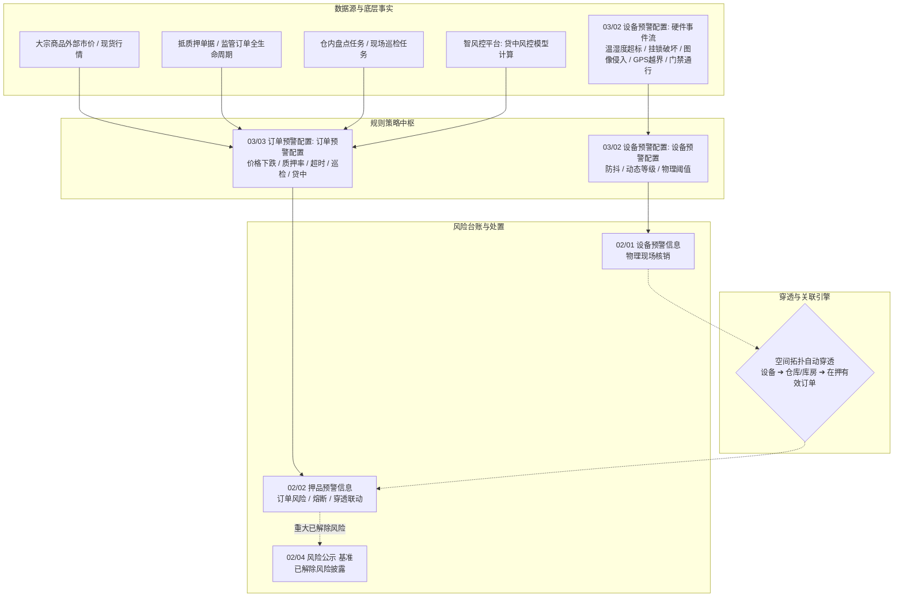
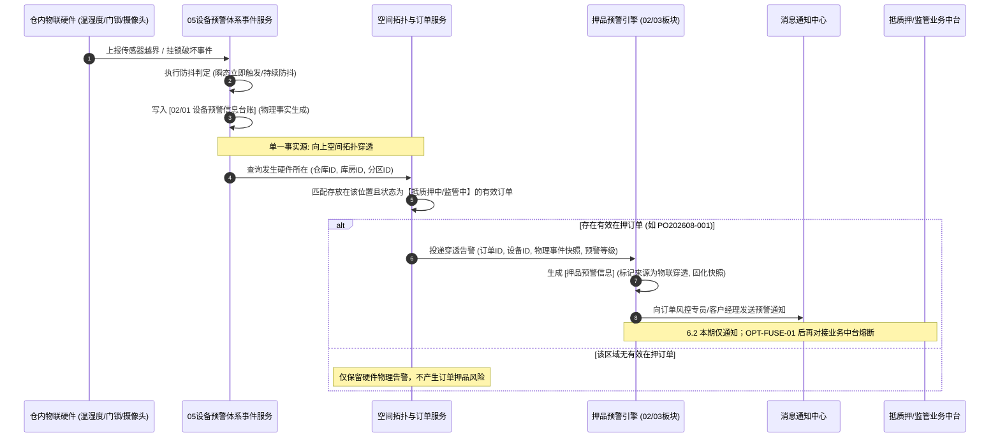

# 订单预警通知模板与协同规范

> **文档定位**：跨板块协同规范（空间穿透、通知模板、业务熔断），**非独立系统菜单**。订单预警配置的菜单级 PRD 与字段定义见 **[03订单预警配置](../../03-预警配置/03订单预警配置/订单预警配置主PRD.md)**。
>
> **版本**：V3.0 | **更新日期**：2026-09-04 | **适用版本**：SYZC 6.2 存货监管系统
> **读者**：前端/后端研发工程师、测试工程师、风控产品经理、架构师
> **编写依据**：[6.2版本 README](../../README.md)、[预警配置总索引](../../03-预警配置/预警配置总索引.md)、[预警信息总索引](../预警信息总索引.md)
> **核心原则**：
> 1. **物理与金融彻底解耦**：物理硬件规则（温湿度/门锁/抓拍/GPS）100% 收口至 [02设备预警配置](../../03-预警配置/02设备预警配置/设备预警配置主PRD.md)；设备资产档案继续引用 [01-物联网IOT管理](../../01-物联网IOT管理/物联网IOT管理总索引.md)；订单预警配置专注于纯正的金融价格、质押率、时效、巡检与贷中资信模型。
> 2. **单一事实源与自动空间穿透**：物理事件仅在设备端触发一次；订单端根据「设备 ➔ 所属仓库/库房 ➔ 在押有效订单」拓扑链路自动向上穿透生成押品风险，杜绝双重阈值配置与逻辑冲突。
> 3. **租户可自定义扩展的预警等级体系**：2~20 档等级标签；**通知与升级均在设备/订单规则配置**；出库/全流程熔断见 **OPT-FUSE-01**。见 [01预警等级](../../03-预警配置/01预警等级/预警等级主PRD.md)。
> 4. **等级数据契约**：03/02、03/03 规则保存 `severity_level_id`；通知和流水固化 ID、编码、名称、颜色、`sort_order`、同步开关；比较严重度只使用 `sort_order`，`L1~L5` 仅为默认示例。
> 5. **跨域路由契约**：跳转参数、复合权限、返回刷新和失败码统一见 [00-全局契约与RBAC权限矩阵](../../00-全局契约与RBAC权限矩阵.md)。

---

## 一、订单风控与物联网体系协同全景图



---

## 二、功能范围与 7 大纯正商业风控模型矩阵

在 6.2 架构解耦后，**订单预警配置**菜单仅维护纯商业/金融/操作规则，不再重复配置硬件物理阈值：

| 序号 | 预警大类 | 子类型 / 核心配置项 | 适用订单类型 | 触发条件与业务逻辑 | 自动解除与处置条件 |
| :---: | :--- | :--- | :--- | :--- | :--- |
| 1 | **价格下跌预警** | 价格下跌比例阈值（%） | 抵/质押订单、监管订单 | 订单质物实时市价总价值较入库/质押初始估值下跌严格大于配置比例 | 市价回升或办理补仓增信后自动解除 |
| 2 | **抵/质押率超标** | 补仓线（%）、平仓线（%）+ 处置方式 | **仅抵/质押订单**（监管禁用） | 实时质押率 $LTV = \frac{融资金额}{实时在押货值} \times 100\%$ 突破阈值 | 办理补仓/提前部分还款结清后自动解除 |
| 3 | **解押/监管超时** | 超时天数（天） | 抵/质押订单、监管订单 | 订单超过约定期限未办理办结解押且存货未出库 | 办结解押审批或完成出库后自动解除 |
| 4 | **盘点异常预警** | 账实差异启用开关 | 抵/质押订单、监管订单 | 盘点任务录入的实际库存数量与系统账面数量不一致 | 盘点差异完成审批调整或复核核销 |
| 5 | **巡检超期预警** | 巡检责任人（多选）+ 独立巡检周期（天） | 抵/质押订单、监管订单 | 允许不同人员设置独立周期；超过设定周期未提交有效巡检报告 | 现场提交有效巡检记录后自动解除 |
| 6 | **贷中风控预警** | 智风控模型产品（单选） | **仅抵/质押订单** | 模型异步计算评分低于准入基准或结果为“拒绝/高风险” | 人工提交资信复核说明或单据解除 |
| 7 | **物联穿透告警** | **只读穿透（无需配置）** | 抵/质押订单、监管订单 | 设备事件对应等级 **同步至订单预警=是** 且空间匹配在押订单时自动生成 | 现场硬件事件完成解除核销后联动解除 |

---

## 三、单一事实源与物联事件空间穿透规则规格



### 空间穿透关键边界规则：
1. **杜绝双重阈值配置**：物理指标由 [02设备预警配置](../../03-预警配置/02设备预警配置/设备预警配置主PRD.md) 统一定义。
2. **状态自动联动解除**：现场监管员在 02/01 核销后，关联 02/02 穿透告警自动解除（6.2 不涉及熔断解封，见 OPT-FUSE-01）。
3. **跨租户与权限隔离**：穿透生成的押品预警严格受订单数据权限控制，仅管辖该订单的风控人员可见。

---

## 四、订单预警配置表单字段

表单字段、校验规则与页面交互的**唯一定义来源**为 [订单预警配置字段清单](../../03-预警配置/03订单预警配置/订单预警配置字段清单.md)，本节不再重复维护，避免双源冲突。

---

## 五、订单预警多渠道通知（6.2 本期）与熔断（待优化）

### 0. 通知配置分层（03/01 vs 03/02、03/03 权威边界）

| 配置项 | 03/01 预警等级 | 03/02 设备规则 | 03/03 订单规则 | 触发时读取 |
| :--- | :---: | :---: | :---: | :--- |
| 等级标签/颜色/排序 | ✅ | 选等级 | 选等级 | 等级快照 |
| **同步至订单预警** | ✅ | — | — | 等级快照 |
| **通知渠道**（短信/邮件，选填） | — | ✅ | ✅ | 规则快照 |
| **系统小角标**（导航栏待办计数） | — | 自动 | 自动 | 预警命中时自动更新预警对象，**不可配置** |
| **预警对象**（首次收件人） | — | ✅ | ✅ | 规则快照 |
| **升级预警天数** | — | ✅ | ✅ | 规则快照 |
| **升级预警对象** | — | ✅ | ✅ | 规则快照 |

**执行顺序（每条预警触发）**：

1. 读 **规则快照**：`预警对象`、`通知渠道`、`upgrade_days`、`升级对象`
2. 读 **等级快照**：`sync_to_order_warn`（及编码/名称/颜色用于展示）
3. **首次通知**：自动更新 `预警对象` 的**系统小角标**；外部渠道 = 规则已勾选渠道（短信/邮件，可不选）
4. **升级通知**：仅当 `upgrade_days > 0` 且已选 `升级对象` → 从首次预警时间起算；同样自动更新升级对象系统小角标，并按规则快照发送已勾选外部渠道
5. **穿透摘要**（无订单规则时）：走 第5.3节 默认「订单风控专员角色组」

> 03/01 预警等级 **仅**维护等级标签与穿透开关；**全部**通知策略由 03/02、03/03 规则决定。

### 1. 规范化通知消息模板

```text
【森云科技 SYZC 风险预警】
预警级别：[L4 - 橙色严重风险]
订单编号：PO202608-1002 (抵押中)
借款企业：江苏某大宗商贸有限公司
监管仓库：一号大宗钢材仓 (A库区)
风险类型：质押率突破平仓线 (实时LTV: 88.5% > 平仓线: 85.0%)
当前在押货值：2,820.00 万元 (融资金额: 2,500.00 万元)
处置建议：请立即督促企业办理补仓增信或结清；请关注订单预警管理处理进度。
```

> 6.2 **不包含**「系统已锁定出库」类文案；该文案在 **OPT-FUSE-01** 启用熔断后使用。

### 2. 同步至订单预警（读 03/01 预警等级）

字典该档 **同步至订单预警=是** 且设备所在仓库有在押订单时，02/02 生成「物联穿透告警」并发送摘要通知（详见 第5.3节）。

### 3. 业务熔断（待优化 OPT-FUSE-01）

| 规划动作 | 枚举 | 规划行为 | 6.2 |
| :--- | :--- | :--- | :---: |
| 出库熔断 | `OUTBOUND_BLOCK` | 禁止出库/部分解押 | 不执行 |
| 全流程熔断 | `FULL_BLOCK` | 禁止解押、出库、放款 | 不执行 |

启用条件：业务中台锁定接口就绪；03/01 预警等级 UI 开放选项；押品 `fuse_status` 字段生效。详 [预警等级字段清单 OPT-FUSE-01](../../03-预警配置/01预警等级/预警等级字段清单.md)。

### 4. 穿透类默认通知口径

| 场景 | 6.2 默认行为 | 说明 |
| :--- | :--- | :--- |
| **物联穿透告警 — 订单侧摘要通知** | 向该订单关联的**默认风控对象**（租户配置的订单风控专员角色组）自动更新**系统小角标**；不重复发送设备侧已发出的物理通道短信 | 实现 COL-T16 / ORD-T54 默认口径 |
| **穿透告警 — 邮件/短信** | 6.2 首版不默认开启；租户可在消息中心模板绑定后扩展 | 待消息中心模板 ID 对齐后迭代 |
| **设备侧升级通知** | 自动更新升级对象系统小角标；外部渠道继承触发规则快照 | 见 02/01 EVT-N01~N05 |

---

## 六、验收标准与测试用例

| 用例编号 | 测试场景 | 前置条件 | 预期系统行为 |
| :---: | :--- | :--- | :--- |
| **ORD-V2-01** | 物联网硬件事件自动穿透订单 | 摄像头在 A 库区触发行人入侵(L4) | 系统在 A 库区在押订单生成押品预警记录，订单详情高亮标注物理风险 |
| **ORD-V2-02** | 平仓线高于补仓线强校验 | 补仓线录入 80%，平仓线录入 75% | 表单拦截并报错“平仓线阈值必须严格高于补仓线”，禁止保存 |
| **ORD-V2-03** | 监管订单禁用质押率规则 | 选定“监管订单”类型单据 | 表单自动置灰并隐藏“抵/质押率”配置区域，防止非法配置 |
| **ORD-V2-04** | ~~重大风险自动锁定出库~~ | — | **延期 OPT-FUSE-01**；6.2 出库不被阻断 |
| **ORD-V2-05** | 现场物联核销联动订单解除 | 挂锁告警核销 | 穿透押品预警变已处理；6.2 无熔断解封步骤 |
| **ORD-V2-08** | 升级仅看规则 | 任意启用 `severity_level_id`，规则 `upgrade_days=3` | 3 天后向升级对象通知；与等级编码和排序无关 |

---

## 修订记录

| 日期 | 版本 | 变更 |
| :--- | :---: | :--- |
| 2026-09-04 | **V3.0** | 通知渠道移除误增「Webhook」；第5.4节 穿透类默认通知口径与 03/02 对齐为短信/邮件两档 |
| 2026-08-20 | V2.8 | 移除 04「通知强度」；第5.0节 简化；ORD-V2-08 |
| 2026-09-01 | **V2.9** | 通知渠道移除「站内信」；系统小角标改为预警命中时自动更新；首次/升级/穿透通知口径同步 |
| 2026-08-20 | V2.7 | 第5.0节 通知分层（03/01 vs 03/02、03/03）；ORD-V2-06/07（已废弃） |
| 2026-08-20 | V2.6 | 穿透触发条件改为 sync_to_order_warn |
| 2026-08-20 | V2.5 | 6.2 本期仅通知；OPT-FUSE-01 预留熔断；ORD-V2-04 延期 |
| 2026-08-20 | V2.3 | 第5.2节 相对序位映射（已废弃） |
| 2026-08-20 | V2.2 | 修正模块编号；新增第5.4节穿透类默认通知口径（6.2 外部渠道为短信/邮件） |
| 2026-08-20 | V2.1 | 补 03/01 预警等级引用 |
