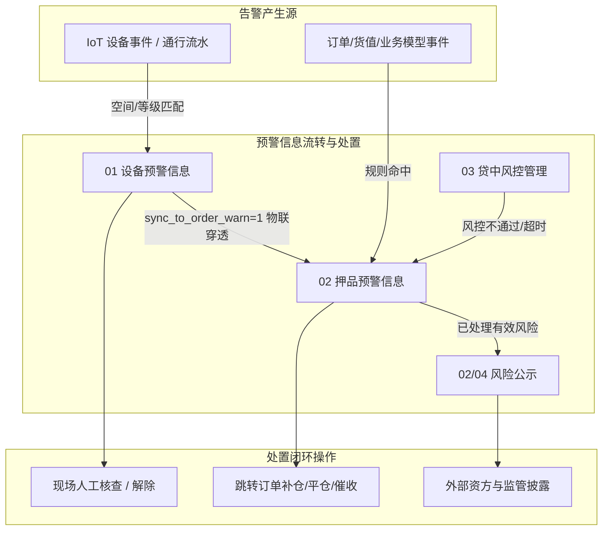

# 预警信息总索引

> **版本**：V1.0 | **更新日期**：2026-08-24
>
> **业务定位**：SYZC 存货监管系统运行时风险监控与闭环处置中枢，负责承接来自物联网硬件的物理告警、来自金融业务与抵质押订单的押品风险、贷中风控模型执行结果以及风险对外披露公示。
>
> **上级索引**：[SYZC 6.2 版本总览与索引](../README.md)
>
> **跨域关联**：
> - 预警判定依据与严重等级来源于 [03-预警配置/01预警等级](../03-预警配置/01预警等级/预警等级主PRD.md) 底座；
> - 设备预警规则由 [03-预警配置/02设备预警配置](../03-预警配置/02设备预警配置/设备预警配置主PRD.md) 驱动；
> - 押品预警规则由 [03-预警配置/03订单预警配置](../03-预警配置/03订单预警配置/订单预警配置主PRD.md) 驱动；
> - 物联网物理设备源头由 [01-物联网IOT管理](../01-物联网IOT管理/物联网IOT管理总索引.md) 承载。

---

## 一、模块目录结构

```text
02-预警信息/
├── 预警信息总索引.md           # 本文件
├── 01设备预警信息/             # IoT 设备离线、数值异常、物理破坏等告警流水与解除处置
├── 02押品预警信息/             # 货值跌价、质押超期、异动与物联穿透告警承接与去处理
├── 03贷中风控管理/             # 授信额度、借款企业信用评价、贷中模型异步执行与风险跟踪
├── 04风险公示/                 # 已处理风险对外披露、首次确认独立副本与合规公示审计
└── 协同规范/                   # 运行时跨域通知模板与穿透协同（非迁移文档）
```

---

## 二、子模块全景清单

| 模块序号 | 功能模块 | 核心能力与闭环处置 | PRD 规格入口 | 字段清单 | 业务规则 | 线框/原型 |
| :---: | :--- | :--- | :--- | :--- | :--- | :--- |
| **01** | **设备预警信息** | 设备事件流水、去重覆盖、现场抓拍展示、频次时间轴、自动恢复/人工解除 | [主PRD V3.0](./01设备预警信息/设备预警信息主PRD.md) | [字段清单](./01设备预警信息/设备预警信息字段清单.md) | [规则规格](./01设备预警信息/设备预警信息业务规则规格.md) | [列表](./01设备预警信息/设备预警信息_ASCII_列表页.md) · [详情](./01设备预警信息/设备预警信息_ASCII_详情页.md) · [解除页](./01设备预警信息/设备预警信息_ASCII_解除页.md) |
| **02** | **押品预警信息** | 押品风险流水、去处理跳转单据补仓平仓、物联穿透只读流水、超时升级 | [主PRD V3.0](./02押品预警信息/押品预警信息主PRD.md) | [字段清单](./02押品预警信息/押品预警信息字段清单.md) | [规则规格](./02押品预警信息/押品预警信息业务规则规格.md) | [列表](./02押品预警信息/押品预警信息_ASCII_列表页.md) · [详情](./02押品预警信息/押品预警信息_ASCII_详情页.md) |
| **03** | **贷中风控管理** | 模型执行资格校验、单条/批量执行申请、智风控异步结果跟踪、拒绝联动 | [主PRD](./03贷中风控管理/贷中风控管理主PRD.md) | [字段清单](./03贷中风控管理/贷中风控管理字段清单.md) | [规则规格](./03贷中风控管理/贷中风控管理业务规则规格.md) | [列表 ASCII](./03贷中风控管理/贷中风控管理_ASCII_列表页.md) · [列表 Demo](./03贷中风控管理/贷中风控管理_Demo_列表页.md) |
| **02/04** | **风险公示** | 已解除风险对外披露、首次确认生成独立副本、取消公示说明与版本审计 | [主PRD](./04风险公示/风险公示主PRD.md) | [字段清单](./04风险公示/风险公示字段清单.md) | [规则规格](./04风险公示/风险公示业务规则规格.md) | [列表 ASCII](./04风险公示/风险公示_ASCII_列表页.md) · [列表 Demo](./04风险公示/风险公示_Demo_列表页.md) |

---

## 三、端到端处置与跨域联动体系



---

## 四、核心业务边界与原则

1. **双轨模型隔离**：
   - **设备预警（物理轨）**：按用户所属【仓库数据权限】过滤与处置；
   - **押品预警（商业轨）**：按用户所属【订单数据权限】过滤与去处理。
2. **物联穿透只读性**：
   - 当设备预警配置了 `sync_to_order_warn=1` 时，事件穿透至押品预警生成只读记录；
   - 押品端**禁止直接人工解除**物联穿透流水，必须由设备端现场处置并解除后自动联动同步。
3. **数据快照不可篡改**：
   - 流水产生时固化当时设备状态、货值、抵质押率、租户等级标签与规则快照，后续基础数据调整不得篡改历史记录。
4. **协同规范参考**：
   - [通知模板与协同规范](./协同规范/通知模板.md)（运行时穿透与通知，非一次性迁移）
5. **历史迁移与割接**（6.1→6.2 一次性工作，见 [04-历史迁移与割接方案](../04-历史迁移与割接方案/历史迁移总索引.md)）：
   - [6.1→6.2 门禁事务与设备事务通知兼容映射](../04-历史迁移与割接方案/03业务兼容映射/6.1→6.2 门禁事务与设备事务通知兼容映射.md)
   - [6.1→6.2 订单规则与押品流水迁移](../04-历史迁移与割接方案/02订单侧规则与流水迁移/6.1→6.2 订单规则与押品流水迁移.md)
   - [6.2 跨域用例数据推演](../04-历史迁移与割接方案/04割接验收与推演/6.2跨域用例数据推演.md)
