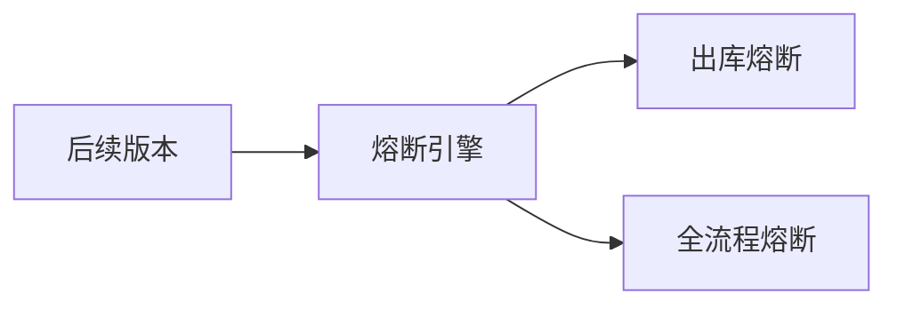
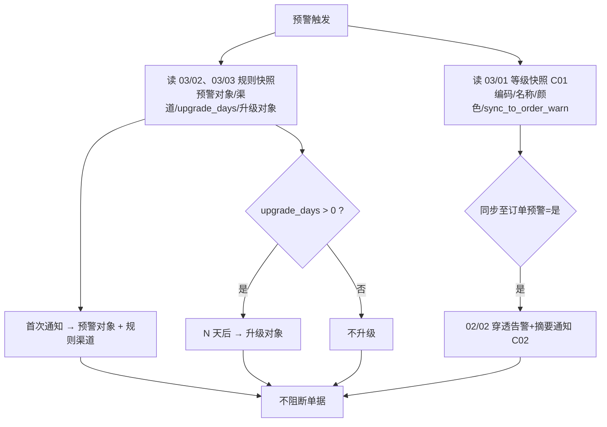
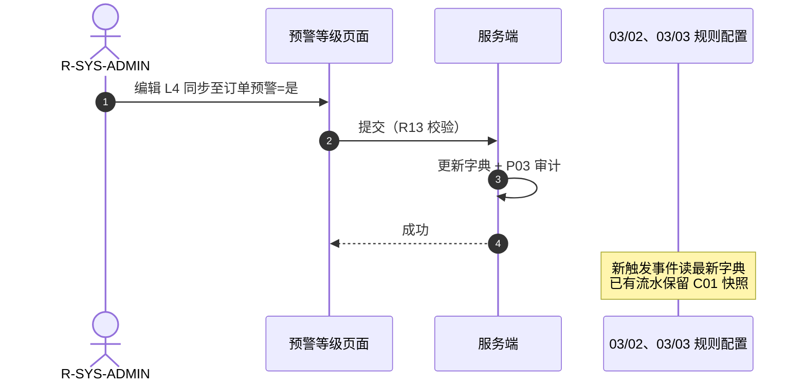

# 预警等级 业务规则规格

> **文档定位**：预警等级使用状态、动作约束、校验规则、计算联动、权限与跨模块流程的**唯一定义来源（单一真实数据源 (SSOT)）**。主 PRD、字段清单、ASCII 线框只引用本文件规则 ID 与流程章节，不重复定义规则本体。
>
> **模块类型**：配置字典范式 B——**无单据状态机**；以「启用 / 停用」使用状态 + 动作能力矩阵替代生命周期状态机
>
> **参考文档**：[《预警等级主PRD》](./预警等级主PRD.md)、[《预警等级字段清单》](./预警等级字段清单.md)、[《6.2全局契约与RBAC权限矩阵》](../../6.2全局契约与RBAC权限矩阵.md)第三章第1节、[03/02 设备预警配置业务规则规格](../02设备预警配置/设备预警配置业务规则规格.md)、[03/03 订单预警配置业务规则规格](../03订单预警配置/订单预警配置业务规则规格.md)
>
> **跨文档引用规范**：[B-迭代需求跨文档引用口径与来源索引](../../../README.md)，本文件定义 REF-SEVERITY 的规则 SSOT。
>
> **版本**：V3.2 | 2026-08-21
>
> **原型与 Demo 导航**：
> - **原型 DEV 路径**：PC端 [`/预警配置/预警等级`](http://localhost:5173/预警配置/预警等级)（原型右下角可切换「标注模式」查看 DEV 说明）
> - **原型交互规范**：[预警等级_Demo_列表页](./预警等级_Demo_列表页.md) · [预警等级_Demo_新增编辑页](./预警等级_Demo_新增编辑页.md) · [预警等级_Demo_详情页](./预警等级_Demo_详情页.md)
> - **ASCII 线框图**：[预警等级_ASCII_列表页](./预警等级_ASCII_列表页.md) · [预警等级_ASCII_新增编辑页](./预警等级_ASCII_新增编辑页.md) · [预警等级_ASCII_详情页](./预警等级_ASCII_详情页.md)

## 0. 统一等级模型约束

本文件定义的等级实体是 03/01、03/02、03/03 共用的唯一等级模型：

- 规则配置外键统一为 `severity_level_id`，不允许以 `severity_code` 或 `L1~L5` 作为关联键。
- `sort_order` 是唯一严重度比较依据；等级编码可改名、可使用 `HIGH` 等非 `L` 编码，不能参与大小比较。
- 03/02、03/03 读取 03/01 的**启用**等级下拉；保存时服务端校验租户归属、启用状态和等级 ID，不能信任前端传入的名称/颜色/排序。
- 预警流水必须固化 `severity_level_id`、`severity_code`、`severity_name`、`severity_color`、`sort_order`、`sync_to_order_warn`；字典后续编辑不回写历史流水。
- `L1~L5` 仅是新租户默认初始化示例，不是系统固定枚举；迁移或用例找不到对应等级 ID 时必须进入异常清单。

---

## 一、能力定位

| 项目            | 内容                                                                 |
| ------------- | ------------------------------------------------------------------ |
| **模块层级**      | 配置字典层（非策略规则层、非业务单据层）                                               |
| **菜单路径**      | `预警配置 → 预警等级`                                                      |
| **核心职责**      | 维护 2~20 档预警等级标签（编码、名称、颜色、排序）及「同步至订单预警」穿透开关                         |
| **稳定主键**      | **等级ID（UUID）**——下游规则与流水绑定 ID，编码可改                                  |
| **配置来源**      | 用户手动新增/编辑；新租户系统初始化默认 5 档                                           |
| **上游依赖**      | 无                                                                  |
| **下游影响**      | 03/02 和 03/03 仅读取当前租户“启用”等级并提交 `severity_level_id`；02/01 和 02/02 触发时固化等级快照。等级停用后新配置不可选，已有规则和历史流水继续使用原快照；跨域穿透仅读取 `sync_to_order_warn`。来源：本文件第 0 节、第二节、R01/R02/C03。 |
| **职责边界（6.2）** | 本模块**不得**配置通知渠道、预警对象、升级天数/对象；上述全部由 03/02、03/03 规则快照驱动                    |
| **审核流**       | **无**——保存即生效，无草稿/待审核态                                              |
| **预留能力**      | 出库/全流程熔断 **OPT-FUSE-01**（6.2 不执行；信息侧 `fuse_status` 恒为 `NONE`）      |

---

## 二、使用状态定义

> **设计说明**：配置字典范式 B **不设**单据状态机（无草稿、审核、已失效、软删除态等）；仅维护「启用 / 停用」使用状态。删除为独立动作，非状态流转。

| 状态名称 | 枚举值        | 业务含义                           | 进入条件                   | 离开条件 |
| ---- | ---------- | ------------------------------ | ---------------------- | ---- |
| 启用   | `ENABLED`  | 可被 03/02、03/03 规则下拉选中；触发时参与等级快照（C01） | 新增保存（默认启用）；自 `停用` 人工启用 | 人工停用 |
| 停用   | `DISABLED` | 规则下拉不可选（C03）；已有规则/流水保留原快照      | 人工停用（R10 预检通过）         | 人工启用 |

**约束**：

- 状态变更通过列表开关、表单开关或独立启停动作触发；**禁止**通过其他业务单据状态联动改写。
- 租户内**至少 1 档**处于启用状态（R11）。
- 停用不等于删除；停用记录仍可在列表/详情查看。

---

## 三、动作能力矩阵

> ✅ = 允许；❌ = 不允许（不展示入口）；✅（条件）= 允许但有前置条件（见 第四章、第五章）

| 动作      | 启用            | 停用            |
| ------- | ------------- | ------------- |
| 查看列表/详情 | ✅             | ✅             |
| 新增      | ✅             | ✅             |
| 编辑      | ✅             | ✅             |
| 启用      | ❌             | ✅（条件：R11）     |
| 停用      | ✅（条件：R10、R11） | ❌             |
| 删除      | ✅（条件：R08、R09） | ✅（条件：R08、R09） |
| 拖拽排序    | ✅             | ✅             |

> 「新增」动作与当前档位使用状态无关，受 R07 上限约束。

---

## 四、动作流转表

> 前置条件须**全部**满足才允许触发动作；「后置影响」列出除字段变更以外的级联影响。

| 当前状态    | 动作   | 前置条件                                       | 结果状态   | 二次确认                  | 后置影响                                                 | 失败处理                       |
| ------- | ---- | ------------------------------------------ | ------ | --------------------- | ---------------------------------------------------- | -------------------------- |
| —       | 新增保存 | R03、R05、R06、R07、R13、R14 校验通过               | 启用     | 无                     | ① 生成 `severity_level_id`（UUID）；② `sort_order` 追加至末尾；③ P03 写审计 | 轻提示 (Toast)：「保存失败，{字段名/规则}不满足条件」 |
| 启用 / 停用 | 编辑保存 | 同新增校验（不含 R07 上限，除非从未存在）；R02 不可改 `severity_level_id` | 保持原状态  | 无                     | ① 更新字段；② P03 写审计；③ 新规则/新预警读最新字典                      | 同上                         |
| 启用      | 停用   | R10 关联预检；R11 启用数>1；P02 写权限                 | 停用     | 「停用后规则配置中不可选本档，确认停用？」 | ① C03 下拉隐藏；② 已有规则/流水不变                               | 轻提示 (Toast)：「停用失败，{关联/启用数}不满足条件」 |
| 停用      | 启用   | P02 写权限                                    | 启用     | 无                     | ① C03 恢复下拉可选；② P03 写审计                               | —                          |
| 启用 / 停用 | 删除   | R08 至少保留 2 档；R09 无生效规则绑定；P02 写权限           | （记录删除） | 「删除后不可恢复，确认删除？」       | ① 物理/逻辑删除；② P03 写审计                                  | 轻提示 (Toast)：「删除失败，{引用/下限}不满足条件」  |
| 启用 / 停用 | 拖拽排序 | R12；P02 写权限                                | 保持原状态  | 无                     | ① 批量更新 `sort_order`；② `severity_level_id` 不变；③ P03 写审计        | —                          |

---

## 五、校验规则

### 5.1 档位结构与字段

| 规则ID    | 规则                                                         | 校验时机     | 违反处理                |
| ------- | ---------------------------------------------------------- | -------- | ------------------- |
| **R01** | **动态档位**：租户内 2~20 条；可新增、删除、编辑、拖拽排序                         | 新增/删除/排序 | 超出范围阻断并提示           |
| **R02** | **稳定主键**：`severity_level_id`（UUID）系统生成后**不可变**；下游规则/流水绑 ID，不绑编码     | 新增/编辑    | 服务端拒绝变更 `severity_level_id`  |
| **R03** | **等级编码**：必填，租户内唯一，2~16 字符                                  | 保存/编辑    | 阻断，提示「等级编码已存在」或格式错误 |
| **R04** | **严重度排序**：`sort_order` 越大越严重；序号随排序更新                       | 拖拽/新增    | 服务端重算序号             |
| **R05** | **显示名称** 2~20 字符；**标签颜色** 合法 HEX                           | 保存/编辑    | 阻断，提示格式错误           |
| **R06** | **职责边界**：本模块**不得**维护通知渠道、预警对象、升级天数/对象；API/UI 拒绝历史「通知强度」等字段 | 保存/API   | 阻断，提示字段不允许          |
| **R13** | **同步至订单预警**：布尔必填；标签旁 `[?]` 文字提示 (Tooltip) 见字段清单 第2.1节              | 保存/编辑    | 阻断，提示必填             |
| **R14** | **等级说明**：选填，≤100 字                                         | 保存/编辑    | 超长阻断                |

### 5.2 增删改约束

| 规则ID    | 规则                                          | 校验时机    | 违反处理                   |
| ------- | ------------------------------------------- | ------- | ---------------------- |
| **R07** | **新增上限**：租户内最多 **20** 档                     | 新增      | 「+ 新增等级」不可用或保存拦截       |
| **R08** | **删除下限**：至少保留 **2** 档                       | 删除      | 阻断，提示「至少保留 2 档预警等级」    |
| **R09** | **删除预检**：存在**生效中**（或等价有效态）03/02、03/03 规则绑定时不可删    | 删除      | 阻断，提示「该等级已被规则引用，请先解绑」  |
| **R10** | **停用预检**：同 R09 关联预检逻辑；停用后 03/02、03/03 下拉隐藏（C03）   | 停用      | 阻断或提示须先解绑              |
| **R11** | **至少一档启用**：启用数不得为 **0**                     | 停用/编辑停用 | 阻断，提示「至少保留 1 档启用的预警等级」 |
| **R12** | **排序变更**：拖拽改 `sort_order`；**不改** `severity_level_id` | 拖拽      | 服务端批量更新排序              |

### 5.3 初始化与迁移

| 规则ID    | 规则                                               | 校验时机 | 违反处理   |
| ------- | ------------------------------------------------ | ---- | ------ |
| **R15** | **6.1 迁移**：老数据映射 `severity_level_id`；历史「通知强度/业务动作」字段废弃不写入 | 迁移脚本 | 记录迁移日志 |

**新租户初始化（系统任务，非用户动作）**：

- 默认写入 **5 档**（编码/名称/颜色/排序/同步至订单预警见字段清单 第三章）；
- **L4、L5 默认「同步至订单预警=是」**；
- 通知人员与升级在 03/02、03/03 规则中配置，不在本模块初始化。

---

## 六、计算与联动规则

| 规则ID    | 规则                                                                                                     |
| ------- | ------------------------------------------------------------------------------------------------------ |
| **C01** | **流水快照**：预警触发时固化等级 ID、编码、名称、颜色、`sync_to_order_warn` 标记；后续字典变更不影响已生成流水                                  |
| **C02** | **订单穿透**：「同步至订单预警=是」时，设备事件满足仓库空间匹配且在押订单存在，则在 02/02 生成「物联穿透告警」并发送通知；6.2 **不触发出库/全流程锁定**                 |
| **C03** | **下拉隐藏**：档位停用后，03/02、03/03 新增/编辑表单的等级下拉**不可选**该档；已有规则继续生效直至编辑重选                                        |
| **C04** | **熔断预留**：信息侧 `fuse_status` 6.2 恒为 `NONE`；数据模型可保留 `OUTBOUND_BLOCK`、`FULL_BLOCK` 枚举；OPT-FUSE-01 上线前引擎不执行 |

---

## 七、权限规则

### 7.1 数据可见范围

| 规则ID    | 规则                                                 |
| ------- | -------------------------------------------------- |
| **P01** | **租户隔离**：仅可见本租户预警等级数据                              |
| **P02** | **写操作权限**：新增/编辑/删除/启停/排序仅 **R-SYS-ADMIN**；其他角色无写入口 |
| **P03** | **审计日志**：增删改、排序、启停、同步开关变更均记录操作人、时间戳、前后镜像           |

### 7.2 操作权限矩阵

> 角色定义见 [6.2全局契约与RBAC权限矩阵](../../6.2全局契约与RBAC权限矩阵.md)。

| 操作      | R-SYS-ADMIN | R-RISK-MGR | R-IOT-OPS | R-RISK-OFF | R-VIEWER |
| ------- | ----------- | ---------- | --------- | ---------- | -------- |
| 查看列表/详情 | ✅           | ✅          | ❌         | ❌          | ❌        |
| 新增      | ✅           | ❌          | ❌         | ❌          | ❌        |
| 编辑      | ✅           | ❌          | ❌         | ❌          | ❌        |
| 启用/停用   | ✅           | ❌          | ❌         | ❌          | ❌        |
| 删除      | ✅           | ❌          | ❌         | ❌          | ❌        |
| 拖拽排序    | ✅           | ❌          | ❌         | ❌          | ❌        |

---

## 八、边界与异常处理

### 8.1 并发控制

| 场景         | 处理方式                   |
| ---------- | ---------------------- |
| 两人同时编辑同一档位 | 后提交覆盖或乐观锁提示（以实现为准）     |
| 排序拖拽与编辑并发  | 以服务端最终 `sort_order` 为准 |

### 8.2 幂等操作约束

| 操作    | 幂等规则          |
| ----- | ------------- |
| 删除    | 重复删除返回「记录不存在」 |
| 停用/启用 | 同状态重复操作静默成功   |

### 8.3 上下游不一致

| 场景                   | 处理方式                          |
| -------------------- | ----------------------------- |
| 03/01 等级被停用，03/02、03/03 规则仍引用 | 规则继续生效；流水快照保留原等级；编辑规则时须重选启用等级 |
| 尝试 API 写入通知/升级字段     | R06 拒绝                        |
| 穿透告警但无在押订单           | C02 不生成 02/02 记录              |

---

## 九、规则索引

| 规则类型   | 代码范围      | 说明                |
| ------ | --------- | ----------------- |
| 校验规则   | R01 – R15 | 档位结构、字段、增删改、迁移    |
| 计算联动规则 | C01 – C04 | 快照、订单穿透、下拉隐藏、熔断预留 |
| 权限规则   | P01 – P03 | 租户隔离、写权限、审计       |

> **迁移说明**：V2.x/V3.1 的 `LV-DICT-Rxx` 已映射为本版 `R/C/P` 体系，见 第十章 附录。

---

## 十、附录

### 10.1 LV-DICT → R/C/P 迁移对照

| 原编号             | 新编号       | 说明               |
| --------------- | --------- | ---------------- |
| LV-DICT-R01     | R01       | 动态档位 2~20        |
| LV-DICT-R02     | R02       | 稳定主键 severity_level_id    |
| LV-DICT-R03     | R03       | 编码可自定义           |
| LV-DICT-R04     | R04       | 严重度以排序为准         |
| LV-DICT-R05     | R05       | 名称与颜色            |
| LV-DICT-R06     | R06       | 不配置通知与升级         |
| LV-DICT-R08     | R13 + C02 | 同步至订单预警 + 穿透联动   |
| LV-DICT-R09     | C01       | 流水快照             |
| LV-DICT-R10     | R07       | 新增上限 20          |
| LV-DICT-R11     | R08       | 删除下限 2           |
| LV-DICT-R12     | R09       | 删除预检             |
| LV-DICT-R13     | R10 + C03 | 停用预检 + 下拉隐藏      |
| LV-DICT-R14     | R11       | 至少一档启用           |
| LV-DICT-R15     | R12       | 排序变更             |
| LV-DICT-R16     | P01       | 租户隔离             |
| LV-DICT-R17     | P03       | 审计               |
| LV-DICT-R18     | 第5.3节 初始化  | 新租户默认 5 档        |
| LV-DICT-R19     | R15       | 6.1 迁移           |
| LV-DICT-R20     | C04       | fuse_status NONE |
| LV-DICT-R21~R22 | C04       | OPT-FUSE-01 预留   |

### 10.2 OPT-FUSE-01 预留（本期不执行）

| 项目     | 内容                                      |
| ------ | --------------------------------------- |
| 枚举预留   | 数据模型可保留 `OUTBOUND_BLOCK`、`FULL_BLOCK`   |
| 6.2 行为 | 本模块 UI 不配置；引擎不执行；`fuse_status` 恒 `NONE` |
| 启用条件   | OPT-FUSE-01 上线后单独版本公告                   |

---

## 跨模块流程

> 03/01 仅提供等级标签与穿透开关；**全部通知行为由 03/02、03/03 规则决定**。

### 1. 预警触发后的通知链路（6.2 本期）

| 链路节点    | 规则依据 | 说明                                                     |
| ------- | ---- | ------------------------------------------------------ |
| 等级快照读取  | C01  | 04 固化 ID/编码/名称/颜色/`sync_to_order_warn`                 |
| 首次通知与升级 | R06  | 渠道、对象、`upgrade_days` 来自 03/02、03/03 规则，与字典档位无关               |
| 订单穿透    | C02  | 仅当 `sync_to_order_warn=true` 且仓库空间匹配在押订单时，02/02 生成穿透告警 |
| 业务阻断    | —    | 6.2 全程不阻断出入库或单据流转                                      |

### 2. 字典维护与下游读取时序

---

## 设计自检清单

- [x] 03/01 是否未配置通知渠道/对象/升级？——是（R06）
- [x] 下游是否以 severity_level_id 稳定关联？——是（R02）
- [x] 档位数量是否在 2~20 且至少一档启用？——是（R01、R07、R08、R11）
- [x] 穿透与通知职责是否分离？——穿透看 C02，通知看 03/02、03/03 规则
- [x] 6.2 熔断是否恒为 NONE？——是（C04）
- [x] 是否无单据状态机？——是，仅启用/停用（第二章）
- [x] 动作能力矩阵是否无遗漏？——第三章已覆盖
- [x] 规则 ID 是否唯一？——R/C/P 索引见 第九章

---

## 修订记录

| 日期         | 版本       | 变更摘要                                                                                  |
| ---------- | -------- | ------------------------------------------------------------------------------------- |
| 2026-08-20 | V3.1     | 合并原《预警等级业务流程》至跨模块流程；确立 单一真实数据源 (SSOT) 定位                                                        |
| 2026-08-20 | V3.0     | 移除「通知强度」及相关旧版规则                                                                       |
| 2026-08-20 | V2.2     | 「参与物联穿透」→「同步至订单预警」                                                                    |
| 2026-08-20 | **V3.0** | **6.2 标杆重构**：补 第一至十章 标准结构；配置字典范式 B（启用/停用 + 动作矩阵）；LV-DICT-Rxx 映射为 R/C/P；保留跨模块流程与设计自检清单 |
