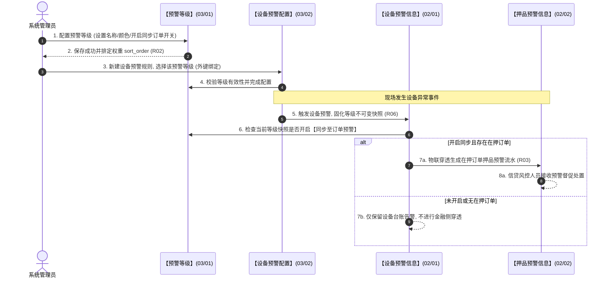

# 预警等级 业务规则规格

> **文档定位**：**三件套核心**——状态机、动作约束、校验规则、计算联动、权限与跨模块流程的**唯一定义来源**。配套：[主PRD](./预警等级主PRD.md)（业务与页面功能）、[字段清单](./预警等级字段清单.md)（字段）。ASCII/Demo 为衍生，只引用本文件规则 ID，不重复定义规则本体。
>
> **统一引用规范**：
> - 本字典：【预警等级】字典（菜单：预警配置 → 预警等级，代号 03/01）
> - 下游策略：【设备预警配置】策略（菜单：预警配置 → 设备预警配置，代号 03/02）
> - 下游策略：【订单预警配置】策略（菜单：预警配置 → 订单预警配置，代号 03/03）
> - 下游流水：【设备预警信息】台账（菜单：预警信息 → 设备预警信息，代号 02/01）
> - 下游流水：【押品预警信息】台账（菜单：预警信息 → 押品预警信息，代号 02/02）
>
> **版本**：V4.0 基准版 | **更新时间**：2026-09-18 | **责任人**：产品架构组

---

## 一、单据与能力定位

| 维度 | 标准定位规格 | 业务解释与控制边界 |
| :--- | :--- | :--- |
| **模块层级** | 基础字典与风控元数据层（Risk Metadata Layer） | 为全系统预警体系提供统一的严重度衡量标尺与跨域穿透开关。 |
| **菜单路径** | `预警配置 → 预警等级` | 挂载于预警配置体系第一项，系统代号为 `03/01`。 |
| **核心职责** | 租户级预警严重度字典维护 | 纳管 2~20 档预警等级的编码、名称、色彩、严重度排序权重及穿透开关。 |
| **单据/数据源头** | 系统默认初始化与管理员自定义 | 新租户自动开通 5 档基线模板；管理员可按机构风控政策动态扩展或调整。 |
| **上下游协同** | 标准外键输出与快照消费 | 下游【设备预警配置】(03/02)与【订单预警配置】(03/03)必须以 `severity_level_id` 稳定关联；告警流水产生时固化全量等级快照。 |
| **审核与存证机制**| 保存即生效，存量流水绝不回写 | 字典配置无审批流；等级任何属性修改绝对不回写历史已产生的告警流水，保障司法证据效力。 |

---

## 二、数量与计算口径隔离表

| 指标/判定项 | 严格业务口径与判定公式 | 边界条件与约束控制 | 关联规则编号 |
| :--- | :--- | :--- | :--- |
| **租户档位容量区间约束** | 设当前租户下已存在的预警等级集合为 $\mathbb{L}_{total}$。档位总数必须满足：$$2 \le |\mathbb{L}_{total}| \le 20$$ | 1. 尝试新增当 $|\mathbb{L}_{total}| = 20$ 时阻断； 2. 尝试删除当 $|\mathbb{L}_{total}| = 2$ 时触发最低保护阻断。 | **R01** |
| **严重度高低比较机制** | 设等级 $A$ 和等级 $B$ 的严重度排序权重分别为 $W(A) = sort\_order(A)$，$W(B) = sort\_order(B)$。则风险比较函数定义为：$$A \succ B \iff W(A) > W(B)$$ 严禁使用编码字符串（如 `L1 < L2`）作为比较依据。 | 1. 拖拽调序后系统重新按自上而下赋予递增正整数权重； 2. 抵质押率平仓线严重度必须大于补仓线：$W(\text{平仓}) \ge W(\text{补仓})$。 | **R02** |
| **物联穿透告警生成判定** | 设设备告警命中等级为 $L$，设备所在库房当前在押订单集合为 $\mathbb{O}_{active}$。物联穿透函数定义为：$$\text{NeedPenetrate}(L, d) = \begin{cases} \text{TRUE}, & \text{if } sync\_to\_order\_warn(L) = 1 \;\land\; |\mathbb{O}_{active}| > 0 \\ \text{FALSE}, & \text{otherwise} \end{cases}$$ | 命中 TRUE 时系统自动向【押品预警信息】(02/02)写入一条 `warn_source = IOT_PENETRATION` 的押品预警流水。 | **R03** |
| **有效规则引用阻断判定** | 设当前待删除等级为 $L_{target}$，全系统有效（生效中/停用）的预警规则集合为 $\mathbb{R}_{all}$。引用检测函数定义为：$$\text{IsReferenced}(L_{target}) = \begin{cases} \text{TRUE}, & \text{if } \exists r \in \mathbb{R}_{all} \text{ s.t. } Ref(r) = severity\_level\_id(L_{target}) \\ \text{FALSE}, & \text{otherwise} \end{cases}$$ | 若返回 TRUE，系统强制阻断删除，并弹窗列出引用的规则名称。 | **R04** |

---

## 三、单据状态机与生命周期流转

### 3.1 状态定义
* 预警等级作为基础字典，**不设复杂单据状态机**，采用二态使用状态：
  - **启用 (`ENABLED`)**：有效状态。下游预警规则下拉框可见并允许配置；
  - **停用 (`DISABLED`)**：停用状态。下游规则下拉框不可新选，存量规则保留快照继续运行。

### 3.2 动作控制与流转规则表

| 当前状态 | 触发动作 | 适用角色 | 前置业务校验条件 | 结果状态 | 联动后置影响 | 失败阻断处理与提示 |
| :--- | :--- | :--- | :--- | :--- | :--- | :--- |
| **[无/新增]** | 新增保存 | 系统管理员 (`R-SYS-ADMIN`) | 1. 租户档位总数 $< 20$； 2. 等级编码与名称租户内唯一； 3. 色值与名称格式合法。 | **启用** | 1. 生成唯一 UUID 主键； 2. 赋予最高严重度权重并排首位； 3. 下游规则下拉实时可用。 | 浮窗提示：「新增失败：租户预警等级已达 20 档上限」 |
| **启用** | 编辑保存 | 系统管理员 (`R-SYS-ADMIN`) | 1. 编码唯一； 2. 携带乐观锁版本号匹配成功。 | **启用** | 1. 更新字典定义； 2. 存量预警流水绝对不回写； 3. 记录操作审计留痕。 | 浮窗提示：「保存失败：等级编码已存在」 |
| **启用** | 点击停用 | 系统管理员 (`R-SYS-ADMIN`) | 租户内处于「启用」状态的等级数 $\ge 2$ | **停用** | 1. 下游规则下拉置灰不可选； 2. 已生效规则继续触发不受影响。 | 浮窗提示：「停用失败：租户必须保留至少 1 个启用的预警等级」 |
| **停用** | 点击启用 | 系统管理员 (`R-SYS-ADMIN`) | 具备字典编辑权限 | **启用** | 下游规则配置下拉框重新可选 | 浮窗提示：「启用失败：状态已变更」 |
| **启用/停用** | 点击删除 | 系统管理员 (`R-SYS-ADMIN`) | 1. 租户档位数 $> 2$（底线保护）； 2. 未被任何有效预警规则引用。 | **物理删除** | 1. 移出等级字典； 2. 重算其余等级 `sort_order`； 3. 写入删除审计日志。 | 浮窗提示：「删除失败：该等级已被【{规则名称}】引用，禁止删除」 |

---

## 四、动作能力与流转控制矩阵

| 触发动作 | 操作入口 | 适用角色 | 前置业务校验条件 | 结果状态 | 联动后置影响 | 失败阻断提示 |
| :--- | :--- | :--- | :--- | :--- | :--- | :--- |
| **【新增等级】** | 列表顶部【+ 新增预警等级】 | 系统管理员 | 租户等级总数 $< 20$ 档 | 启用 | 实时生效，插入列表首位 | 按钮置灰并提示：「已达 20 档上限」 |
| **【编辑等级】** | 列表行操作【编辑】 | 系统管理员 | 具备配置写权限 | 保持当前状态 | 更新字典显示，历史流水不回写 | 浮窗提示：「保存失败：数据版本冲突」 |
| **【拖拽调序】** | 列表行左侧手柄拖拽 | 系统管理员 | 拖拽释放完成 | 保持当前状态 | 重新计算全量 `sort_order` 权重 | 浮窗提示：「排序调整失败，请刷新重试」 |
| **【快速切换穿透】**| 列表表格行内滑动开关 | 系统管理员 | 点击开关切换状态 | 穿透状态翻转 | 热更新风控穿透规则判定逻辑 | 浮窗提示：「切换失败：网络异常」 |
| **【快速启停】** | 列表表格行内滑动开关 | 系统管理员 | 停用时校验至少保留 1 档启用 | 状态翻转 | 启用恢复可选，停用不可新选 | 浮窗提示：「至少保留 1 个启用等级」 |
| **【删除等级】** | 列表行操作【删除】 | 系统管理员 | 满足最低 2 档保护且无有效规则引用 | 彻底移除 | 物理删除字典，重算排序 | 弹窗阻断：「被规则引用禁止删除」 |

---

## 五、核心业务规则清单

### 5.1 字典模型与容量约束规则 (R01~R03)

#### 【租户级档位容量区间规则】(R01)
1. **容量刚性区间**：在任意系统租户维度下，预警等级档位总数必须严格限定在 $[2, 20]$ 区间内。
2. **上限与下限双向防御**：
   - 当租户等级总数达到 20 档时，顶部【+ 新增预警等级】按钮自动禁用置灰，并悬浮提示「当前租户预警等级已达 20 档上限」；
   - 当租户等级总数仅剩 2 档时，所有行的【删除】按钮禁用置灰，强校验拦截删除，确保任何租户至少保留 2 档严重度。

#### 【严重度排序与权重度量机制】(R02)
1. **唯一比较权衡键**：全系统跨模块严重度判定、告警等级比较与平仓线合法性校验，**必须且仅能以 `sort_order` 字段数值为准**。
2. **大数高危原则**：`sort_order` 设定为正整数，数值越大代表风险严重度越高。
3. **拖拽重算一致性**：在前端表格中拖拽调整等级顺序后，系统必须在单事务内对当前租户的全量等级重新计算并批量持久化新的 `sort_order`，保证权重绝对连续有序。

#### 【同步至订单预警穿透机制】(R03)
1. **开关独立控制**：每个预警等级独立维护一个布尔型「同步至订单预警」开关（`sync_to_order_warn`）。
2. **跨域穿透触发**：当物理设备触发告警（02/01）且其关联规则的等级开启了此开关时，若设备所在库房存在在押的供应链金融订单，实时风控引擎自动向【押品预警信息】(02/02)写入对应流水；关闭此开关的等级仅在设备侧告警，不打扰信贷风控人员。

### 5.2 保护与存证隔离规则 (R04~R06)

#### 【底线防御与被引用强阻断规则】(R04)
1. **外键引用检测**：删除等级时，系统执行强校验。若该等级已被【设备预警配置】(03/02)或【订单预警配置】(03/03)中任何处于「生效中」或「已停用」的规则引用，系统**绝对禁止删除**。
2. **阻断精准提示**：前端弹出高危错误阻断框，明确提示：「删除失败：该预警等级已被规则【{规则名称}】引用，请先修改或删除对应规则后再试」。

#### 【至少保留 1 档启用规则】(R05)
1. **停用防线约束**：管理员在执行停用操作时，系统必须校验当前租户内处于「启用」状态的等级数量。
2. **阻断防呆**：若当前仅剩 1 个启用的预警等级，系统终止停用操作，并浮窗提示：「操作失败：租户内必须保留至少 1 个处于启用状态的预警等级，禁止全部停用」。

#### 【预警流水快照固化与不回写机制】(R06)
1. **快照不可篡改**：当设备或订单预警事件触发时，系统必须将当时该等级的 `severity_level_id`、`severity_code`、`severity_name`、`severity_color`、`sort_order` 全量固化写入预警流水表中。
2. **字典编辑不回写**：后续在【预警等级】字典中进行的任何重命名、调序、改色或停用操作，**严禁级联回写存量已生成的预警流水记录**，确保司法取证事实的永久不可变性。

---

## 六、异常与边界控制矩阵

| 异常编号 | 异常场景 | 系统判定与控制动作 | 前端反馈与提示 |
| :--- | :--- | :--- | :--- |
| **【超出 20 档上限】(C01)** | 达到 20 档时通过快捷键或脚本强行调用新增接口 | 校验租户档位数 $|\mathbb{L}| \ge 20$ | 错误代码 400：「租户预警等级不可超过 20 档」 |
| **【最低 2 档保护拦截】(C02)**| 仅剩 2 档时尝试删除其中 1 档 | 校验租户档位数 $|\mathbb{L}| \le 2$ | 浮窗提示：「删除失败：系统必须保留至少 2 档预警等级」 |
| **【被引用强阻断】(C03)** | 尝试删除已被预警规则绑定的预警等级 | 校验 $\text{IsReferenced}(L) = \text{TRUE}$ | 错误弹窗阻断：「该等级已被规则【{规则名}】绑定，禁止删除」 |
| **【停用全量等级拦截】(C04)**| 尝试停用仅存的最后 1 个启用等级 | 校验启用等级总数等于 1 | 浮窗提示：「租户必须保留至少 1 个启用的预警等级」 |
| **【等级编码重复】(C05)** | 新增或编辑等级编码与租户内已有编码重名 | 租户内唯一性校验失败 | 输入框标红提示：「等级编码已存在，请重新输入」 |
| **【拖拽调序并发冲突】(C06)**| 两人同时在不同终端拖拽调序 | 乐观锁版本校验冲突 | 浮窗提示：「排序配置已被他人修改，请刷新列表重试」 |

---

## 七、跨模块业务联动与时序推演

---

## 八、规则全景速查索引表

| 规则类别 | 规则编号 | 规则名称 | 核心约束摘要 |
| :--- | :--- | :--- | :--- |
| **容量约束** | **R01** | 租户级档位容量区间规则 | 严格限制为 2~20 档，达到 20 档禁止新增。 |
| **权重判定** | **R02** | 严重度排序权重度量机制 | `sort_order` 正整数为唯一严重度比较依据，数字越大越严重。 |
| **物联穿透** | **R03** | 同步至订单预警穿透机制 | 控制设备告警是否穿透生成押品预警，保障信贷风控聚焦。 |
| **删除保护** | **R04** | 底线防御与被引用强阻断 | 最低 2 档保护禁止删除；被有效规则引用强阻断删除。 |
| **停用底线** | **R05** | 至少保留 1 档启用规则 | 租户内必须保留至少 1 个处于启用的预警等级，禁止全停。 |
| **存证保护** | **R06** | 预警流水快照固化与不回写 | 告警触发固化等级快照，字典后续调整绝对不回写历史流水。 |

---

## 九、修订记录

| 日期 | 版本 | 修订人 | 变更内容说明 | 影响范围 |
| :--- | :---: | :--- | :--- | :--- |
| 2026-08-20 | V3.0 | 森云科技 PM 团队 | 初版 6.2 预警等级业务规则规格制定 | 业务规则全章节 |
| 2026-09-08 | V3.4 | 森云科技 PM 团队 | 明确 2~20 档容量区间与被有效规则引用强阻断删除逻辑 | 异常控制与判定矩阵 |
| 2026-09-16 | V3.9 | 森云科技 PM 团队 | 统一编号规范与去水重构，将规则全面命名为【规则业务名称】(Rxx) 语义格式 | 规则全景与时序图 |
| 2026-09-18 | **V4.0** | 森云科技 PM 团队 | **标杆排版深度升级（全面对齐《入库记录》《出库记录》规范）**： 1. 规范文头真源声明与跨模块引用标准； 2. 完善单据与能力定位标准表，确立风控基础字典与元数据层职责； 3. 落地严格的 LaTeX 判定公式与容量/权重/穿透/引用计算口径表； 4. 建立 7 列动作控制矩阵与异常控制矩阵； 5. 完善跨模块穿透业务流转时序推演图与标准五列修订记录历史表。 | 预警等级业务规则规格全文 |

