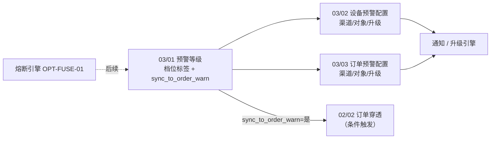
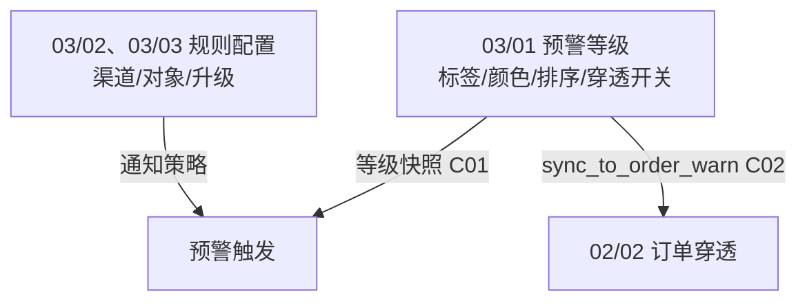
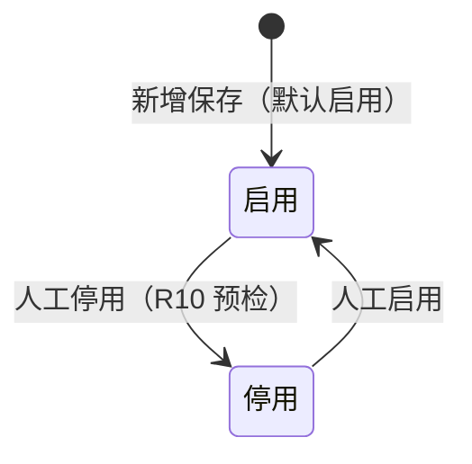

# 预警等级主需求文档

> **版本**：V3.0 | **更新日期**：2026-08-20
> **读者**：研发工程师、测试工程师、配置管理员、风控架构师
> **规则来源**：使用状态、校验、联动与权限详见《[预警等级业务规则规格](./预警等级业务规则规格.md)》——**规则 ID 以该文件为 单一真实数据源 (SSOT)，本文仅摘要引用**
> **字段基准**：《[预警等级字段清单](./预警等级字段清单.md)》为字段唯一定义来源
> **菜单路径**：`预警配置 → 预警等级`
> **页面线框**：[列表页](./预警等级_ASCII_列表页.md) · [详情页](./预警等级_ASCII_详情页.md) · [新增/编辑页](./预警等级_ASCII_新增编辑页.md)
> **权限基准**：[6.2全局契约与RBAC权限矩阵](../../6.2全局契约与RBAC权限矩阵.md) 第二章、第三章第1节
> **跨模块契约**：[6.2全局契约与RBAC权限矩阵](../../6.2全局契约与RBAC权限矩阵.md)
> **跨文档引用规范**：[B-迭代需求跨文档引用口径与来源索引](../../../README.md)，本模块是 REF-SEVERITY 的 SSOT。
>
> **原型与 Demo 导航**：
> - **原型 DEV 路径**：PC端 [`/预警配置/预警等级`](http://localhost:5173/预警配置/预警等级)（原型右下角可切换「标注模式」查看 DEV 说明）
> - **原型交互规范**：[预警等级_Demo_列表页](./预警等级_Demo_列表页.md) · [预警等级_Demo_新增编辑页](./预警等级_Demo_新增编辑页.md) · [预警等级_Demo_详情页](./预警等级_Demo_详情页.md)
> - **ASCII 线框图**：[预警等级_ASCII_列表页](./预警等级_ASCII_列表页.md) · [预警等级_ASCII_新增编辑页](./预警等级_ASCII_新增编辑页.md) · [预警等级_ASCII_详情页](./预警等级_ASCII_详情页.md)

---

### 1. 业务背景

**预警等级**是 6.2 预警体系的**公共标签底座**，为设备侧与订单侧规则配置提供统一的严重度档位（编码、名称、颜色、排序）及「同步至订单预警」穿透开关。

没有统一的预警等级字典：

- 03/02、03/03 规则配置与信息侧流水无法以稳定主键关联等级，编码变更导致历史追溯断裂
- 严重度口径分散，同一业务事件在不同模块展示不一致
- 设备告警与订单侧穿透策略混在同一配置页，职责不清

本模块职责收敛为：

- **本模块**：多档位（2~20）等级编码、名称、颜色、排序，及「同步至订单预警」穿透开关；
- **03/02、03/03 规则**：通知渠道、预警对象、升级天数与升级对象（不在此重复配置）；
- **OPT-FUSE-01（后续）**：出库/全流程熔断，6.2 信息侧 `fuse_status` 恒为 `NONE`。

下游以 **等级ID（UUID）** 稳定关联；通知引擎**只读 03/02、03/03 规则快照**，字典不参与通知策略计算。

03/01 对外输出统一为 `severity_level_id + severity_code + severity_name + severity_color + sort_order + sync_to_order_warn`；03/02、03/03 只能提交等级 ID，严重度比较按 `sort_order`，`L1~L5` 只作为默认租户的展示示例。

---

### 2. 功能范围

**包含范围 (In Scope)**：

- 等级列表、按「是否启用」筛选（2~20 档，无分页）
- 动态新增、编辑、删除、拖拽排序（2~20 档）
- 等级编码、显示名称、标签颜色、等级说明
- **同步至订单预警**：设备告警是否同步生成 02/02 订单侧告警
- 启用 / 停用（非单据状态机，见 第6章 动作矩阵）
- 变更审计（含启停、排序、同步开关）
- 新租户默认 5 档初始化（L4/L5 默认开启同步至订单预警）
- 下游 03/02、03/03 规则下拉、信息侧流水标签读字典快照

**排除范围 (Out of Scope)**：

| 编号 | 内容 |
| :--- | :--- |
| — | **通知强度** / 业务动作 / 通知渠道 / 预警对象 / 升级配置（归属 03/02、03/03 规则） |
| **OPT-FUSE-01** | 出库熔断、全流程熔断（6.2 不执行，仅字段预留） |
| — | 单租户超过 20 档 |
| — | 审批流（保存即生效，无待审核态） |
| — | 批量导入/导出等级模板 |
| — | 移动端写操作——6.2 移动端不提供本菜单 |

---

### 3. 模块定位

#### 3.1 在系统中的位置

| 项目 | 内容 |
| :--- | :--- |
| 模块类型 | **配置字典范式 B**（租户级字典，无单据状态机） |
| 模块层级 | **配置字典层**（非策略规则层、非执行流水层） |
| 核心职责 | 维护 2~20 档预警等级标签及「同步至订单预警」穿透开关 |
| 稳定主键 | **等级ID（UUID）**——下游规则与流水绑定 ID，编码可改 |
| 配置来源 | 用户手动新增/编辑；新租户系统初始化默认 5 档 |
| 上游依赖 | 无 |
| 下游影响 | **03/02 设备预警配置、03/03 订单预警配置**读取当前租户状态为“启用”的等级，提交 `severity_level_id`；**02/01 设备预警信息、02/02 押品预警信息**在触发时固化等级 ID、编码、名称、颜色、`sort_order` 及 `sync_to_order_warn` 快照。停用或删除字典项不得回写历史规则和流水；新配置不得选择停用项。来源：[预警等级业务规则规格](./预警等级业务规则规格.md) 第 0 节、第二节、R01/R02/C03。 |
| 职责边界（6.2） | 本模块**不得**配置通知渠道、预警对象、升级天数/对象 |

#### 3.2 系统链路图

#### 3.3 实体关系说明

| 关系 | 说明 |
| :--- | :--- |
| 预警等级 : 设备预警规则 | **1:N**（一档可被多条设备规则引用） |
| 预警等级 : 订单预警规则 | **1:N**（一档可被多条订单规则引用） |
| 预警等级 : 预警流水 | **1:N**（触发时固化等级快照，见 C01） |
| 租户 : 预警等级 | **1:N**（租户内 2~20 档，至少 1 档启用） |

#### 3.4 与 03/02、03/03 职责分工

---

### 4. 功能清单

| 功能编号 | 功能名称 | 适用角色 | PC 端 | 移动端 | 关键控制（规则引用） |
| :--- | :--- | :--- | :--- | :--- | :--- |
| LV-01 | 等级列表与筛选 | R-SYS-ADMIN / R-RISK-MGR | 筛选/列表 | — | P01 租户隔离 |
| LV-02 | 新增等级 | R-SYS-ADMIN | 独立页面 | — | R03/R07；最多 20 档 |
| LV-03 | 编辑等级 | R-SYS-ADMIN | 独立页面 | — | R03/R06；编码可改 |
| LV-04 | 删除等级 | R-SYS-ADMIN | 二次确认 | — | R08/R09；至少 2 档 |
| LV-05 | 拖拽排序 | R-SYS-ADMIN | 列表 ≡ 手柄 | — | R04/R12 |
| LV-06 | 启用/停用 | R-SYS-ADMIN | 列表/表单开关 | — | 第四章 流转表；R10/R11 |
| LV-07 | 配置同步至订单预警 | R-SYS-ADMIN | 列表/表单开关 | — | R13；C02 穿透 |
| LV-08 | 查看详情 | R-SYS-ADMIN / R-RISK-MGR | 只读页 | — | — |
| LV-09 | 变更审计 | 系统 | 后台 | — | P03 审计日志 |

> 通知渠道/预警对象/升级：**不在本菜单**；设备类见 **03/02 设备预警配置**，订单类见 **03/03 订单预警配置**。

---

### 5. 业务场景

| 场景ID | 场景 | 类型 | 说明 |
| :--- | :--- | :--- | :--- |
| S01 | 新租户初始化默认档位 | **主流程** | 开户后系统自动写入 5 档（L1~L5）；L4/L5 默认「同步至订单预警=是」；无「通知强度」字段 |
| S02 | 新增第 6 档并排序 | **主流程** | 管理员新增 L6 → 保存追加至末尾 → 列表拖拽 ≡ 调整严重度排序 |
| S03 | 编辑 L4 开启订单穿透 | **主流程** | 编辑 L4「同步至订单预警」改为「是」→ 保存 → 后续设备告警满足仓库匹配时在 02/02 生成穿透告警 |
| S04 | 停用未绑定规则的档位 | **支线** | 停用 L3（无生效规则引用）→ 03/02、03/03 下拉隐藏 L3 → 已有规则/流水不受影响 |
| S05 | 删除空闲档位 | **支线** | 租户扩至 8 档后删除 L8（无规则绑定）→ 成功；仍保留至少 2 档 |
| S06 | 删除/停用被引用档位 | **异常** | L5 被 3 条生效中设备规则引用 → 删除或停用阻断，提示须先解绑规则 |

---

### 6. 使用状态与动作矩阵

> **模块类型说明**：配置字典范式 B——**无单据状态机**（无草稿/审核/失效等生命周期态）；仅维护「启用 / 停用」使用状态。完整定义见《[预警等级业务规则规格](./预警等级业务规则规格.md)》第二至五章。

#### 6.1 使用状态

| 状态 | 枚举值 | 含义 |
| :--- | :--- | :--- |
| 启用 | `ENABLED` | 可被 03/02、03/03 规则下拉选中；触发时参与等级快照 |
| 停用 | `DISABLED` | 规则下拉不可选；已有规则/流水保留原快照 |

#### 6.2 状态示意（非状态机）

> 无「已失效」「已删除」等终态；删除为物理/逻辑删除记录，非状态流转。

#### 6.3 动作能力矩阵（摘要）

| 动作 | 启用 | 停用 |
| :--- | :---: | :---: |
| 查看列表/详情 | ✅ | ✅ |
| 编辑 | ✅ | ✅ |
| 停用 | ✅ | ❌ |
| 启用 | ❌ | ✅ |
| 删除 | ✅ | ✅ |
| 拖拽排序 | ✅ | ✅ |

> 删除/停用须满足 R08~R11 约束；详见业务规则规格 第四章 流转表。

---

### 7. 核心业务规则

> 规则本体见业务规则规格；此处仅列高风险摘要。

#### 7.1 档位结构

| 规则ID | 规则摘要 |
| :--- | :--- |
| R01 | 租户内 2~20 档，可新增、删除、编辑、拖拽排序 |
| R02 | 等级ID（UUID）不可变；下游规则/流水绑 ID |
| R04 | `sort_order` 越大越严重 |

#### 7.2 职责边界

| 规则ID | 规则摘要 |
| :--- | :--- |
| R06 | 本模块**不得**维护通知渠道、预警对象、升级天数/对象 |
| R13 | 「同步至订单预警」布尔必填；为「是」时触发 C02 订单穿透 |
| C04 | 信息侧 `fuse_status` 6.2 恒为 `NONE`（OPT-FUSE-01 预留） |

#### 7.3 增删改约束

| 规则ID | 规则摘要 |
| :--- | :--- |
| R07 | 最多 20 档 |
| R08 | 至少保留 2 档 |
| R09 | 有生效规则绑定则不可删 |
| R10 | 停用前关联预检；停用后下拉隐藏（C03） |
| R11 | 启用数不得为 0 |

#### 7.4 联动摘要

| 规则ID | 规则摘要 |
| :--- | :--- |
| C01 | 触发时固化等级 ID/编码/名称/颜色/`sync_to_order_warn` 快照 |
| C02 | `sync_to_order_warn=是` 且仓库空间匹配在押订单 → 02/02 生成穿透告警 |
| C03 | 停用后 03/02、03/03 等级下拉隐藏该档 |

---

### 8. 权限设计

#### 8.1 数据可见范围

| 角色 | 可见数据范围 | 说明 |
| :--- | :--- | :--- |
| R-SYS-ADMIN | 本租户全部等级 | 含新增/编辑/删除/启停/排序 |
| R-RISK-MGR | 本租户等级（只读） | 无写操作 |
| 其他角色 | 不可见 | 无菜单入口 |

#### 8.2 操作权限矩阵

| 操作 | R-SYS-ADMIN | R-RISK-MGR | R-IOT-OPS | R-RISK-OFF | R-VIEWER |
| :--- | :---: | :---: | :---: | :---: | :---: |
| 查看列表/详情 | ✅ | ✅ | ❌ | ❌ | ❌ |
| 新增 | ✅ | ❌ | ❌ | ❌ | ❌ |
| 编辑 | ✅ | ❌ | ❌ | ❌ | ❌ |
| 启用/停用 | ✅ | ❌ | ❌ | ❌ | ❌ |
| 删除 | ✅ | ❌ | ❌ | ❌ | ❌ |
| 拖拽排序 | ✅ | ❌ | ❌ | ❌ | ❌ |

> 以 [6.2全局契约与RBAC权限矩阵](../../6.2全局契约与RBAC权限矩阵.md) 第二章、第三章第1节 为准。

---

### 9. 边界与异常处理

#### 9.1 并发控制

| 场景 | 处理方式 |
| :--- | :--- |
| 两人同时编辑同一档位 | 后提交覆盖或乐观锁提示（以实现为准） |
| 排序拖拽与编辑并发 | 以服务端最终 `sort_order` 为准 |

#### 9.2 幂等操作约束

| 操作 | 幂等规则 |
| :--- | :--- |
| 删除 | 重复删除返回「记录不存在」 |
| 停用/启用 | 同状态重复操作静默成功 |

#### 9.3 上下游不一致

| 场景 | 处理方式 |
| :--- | :--- |
| 03/01 等级被停用，03/02、03/03 规则仍引用 | 规则继续生效；流水快照保留原等级；编辑规则时须重选启用等级 |
| 尝试写入历史「通知强度」字段 | API 拒绝，R06 |
| 6.1 迁移数据 | R15 映射 `severity_level_id`；废弃字段不写入 |

---

### 10. 验收重点

> 验收标准写「输入条件 → 预期结果」格式；完整规则见业务规则规格。

| # | 验收项 | 输入条件 | 预期结果 |
| :--- | :--- | :--- | :--- |
| V01 | 新租户初始化 | 新开户租户首次进入预警等级 | 默认 5 档（L1~L5）；L4/L5 同步至订单预警=是；无「通知强度」字段 |
| V02 | 扩展档位 | 已有 5 档，新增 3 档至 8 档 | 保存成功；03/02、03/03 下拉展示 8 项启用档 |
| V03 | 订单穿透 | L4 同步至订单预警=是；设备告警且仓库有在押订单 | 02/02 生成物联穿透类告警并通知 |
| V04 | 无通知配置入口 | 打开新增/编辑/详情页 | UI 无通知渠道、预警对象、升级字段；API 拒绝历史字段 |
| V05 | 熔断恒 NONE | 任意预警流水 | 押品信息侧 `fuse_status` 恒为「无熔断」/ `NONE` |
| V06 | 通知走规则 | L5 等级 + 03/02、03/03 规则 upgrade=3 天 | 3 天后升级通知（与字典无关，读规则快照） |
| V07 | 删除预检 | L5 被生效中设备规则引用，执行删除 | 阻断，提示须先解绑规则（R09） |
| V08 | 删除下限 | 租户仅 2 档，尝试删除 1 档 | 阻断，提示至少保留 2 档（R08） |
| V09 | 停用隐藏 | 停用 L3 | 03/02、03/03 新增/编辑时下拉不可选 L3（C03） |
| V10 | 至少一档启用 | 尝试停用最后一档启用项 | 阻断，提示启用数不得为 0（R11） |

---

### 修订记录

| 日期 | 版本 | 变更摘要 |
| :--- | :---: | :--- |
| 2026-08-20 | V3.4 | 下游共用业务字段名统一：严重等级 → 预警等级 |
| 2026-08-20 | V3.3 | 模块命名统一：预警等级；菜单 `预警配置 → 预警等级` |
| 2026-08-20 | V3.2 | 页面线框改由三份 ASCII 专页维护 |
| 2026-08-20 | V3.1 | 引用合并后的《业务规则规格》为唯一规则源 |
| 2026-08-20 | V3.0 | **移除「通知强度」**；03/01 仅标签 + 穿透 |
| 2026-08-20 | **V3.0** | **6.2 标杆重构**：对齐配置字典 PRD 章节（第1~10章）；In/排除范围 (Out Scope)；业务场景 S01~S06；启用/停用动作矩阵（非单据 SM）；权限/边界/验收 V01~V10；规则下沉至业务规则规格 单一真实数据源 (SSOT)（R/C/P 体系） |
