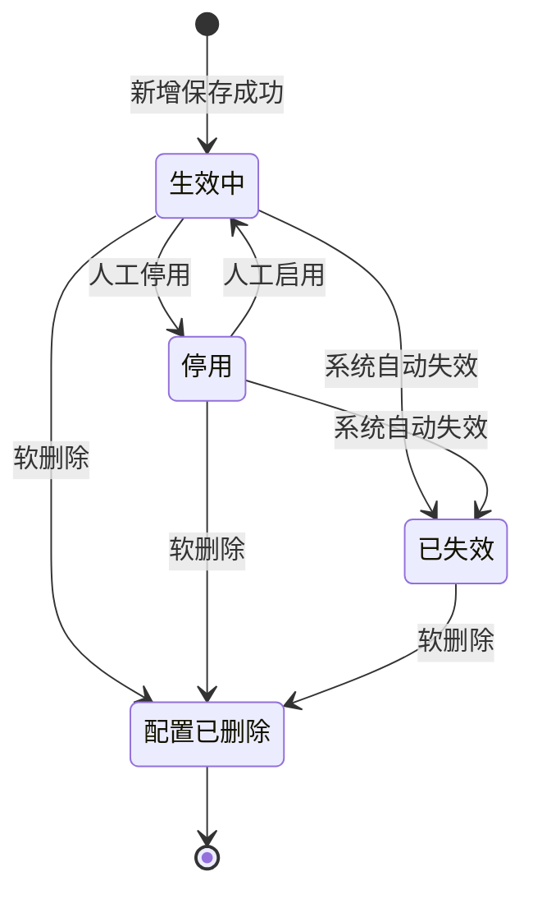
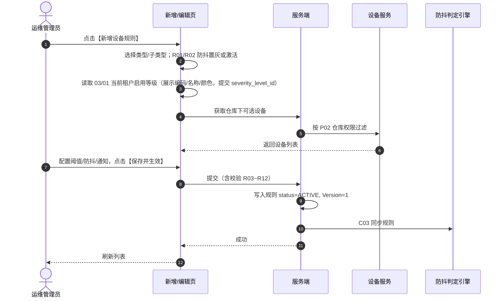
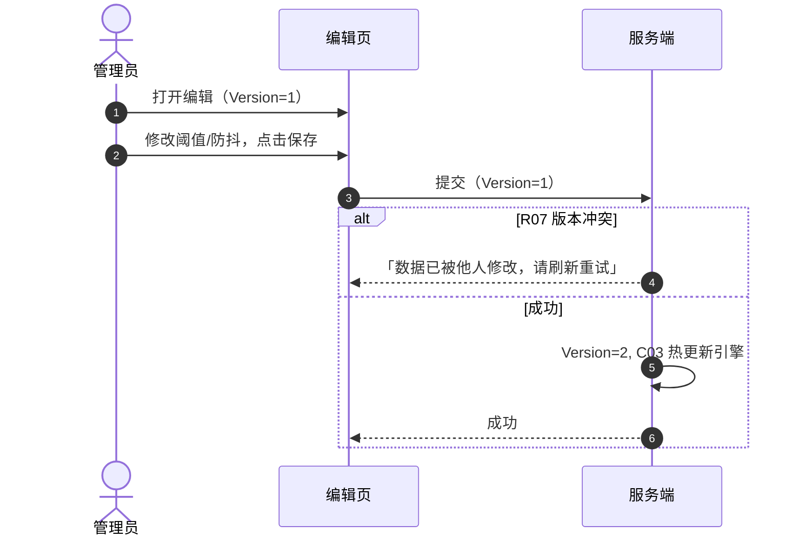
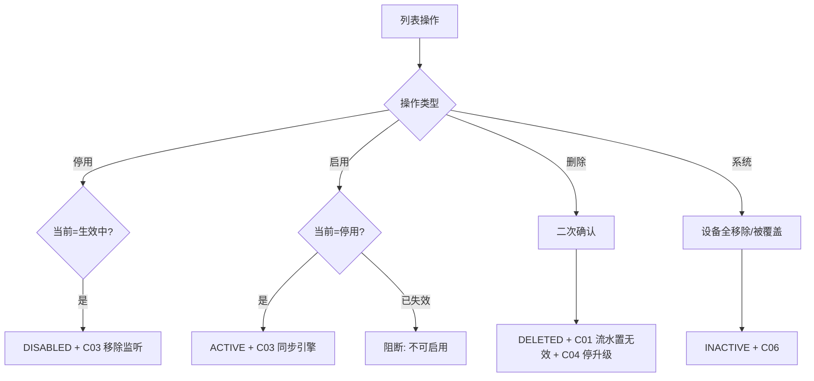

# 设备预警配置 业务规则规格

> **文档定位**：设备预警配置状态机、动作约束、校验规则、计算联动、权限与跨模块流程的**唯一定义来源（单一真实数据源 (SSOT)）**。主 PRD、字段清单、ASCII 线框只引用本文件规则 ID 与流程章节，不重复定义规则本体。
>
> **模块类型**：配置策略类（范式 A 裁剪版——有生命周期状态机，无审批流）
>
> **参考文档**：[《设备预警配置主PRD》](./设备预警配置主PRD.md)、[《设备预警配置字段清单》](./设备预警配置字段清单.md)、[《6.2全局契约与RBAC权限矩阵》](../../6.2全局契约与RBAC权限矩阵.md)第三章第2节、[03/01 预警等级业务规则规格](../01预警等级/预警等级业务规则规格.md)
>
> **跨文档引用规范**：[B-迭代需求跨文档引用口径与来源索引](../../../README.md)。本文件定义设备规则的业务规则 SSOT；下方依赖摘要只说明当前模块实际使用的外部口径。
>
> **版本**：V3.0 | 2026-08-20
>
> **原型与 Demo 导航**：
> - **原型 DEV 路径**：PC端 [`/预警配置/设备预警配置`](http://localhost:5173/预警配置/设备预警配置)（原型右下角可切换「标注模式」查看 DEV 说明）
> - **原型交互规范**：[设备预警配置_Demo_列表页](./设备预警配置_Demo_列表页.md) · [设备预警配置_Demo_新增编辑页](./设备预警配置_Demo_新增编辑页.md) · [设备预警配置_Demo_详情页](./设备预警配置_Demo_详情页.md)
> - **ASCII 线框图**：[设备预警配置_ASCII_列表页](./设备预警配置_ASCII_列表页.md) · [设备预警配置_ASCII_新增编辑页](./设备预警配置_ASCII_新增编辑页.md) · [设备预警配置_ASCII_详情页](./设备预警配置_ASCII_详情页.md)

---

## 一、能力定位

| 项目 | 内容 |
| :--- | :--- |
| **模块层级** | 配置策略层（非业务单据层） |
| **菜单路径** | `预警配置 → 设备预警配置` |
| **核心职责** | 维护 5 大类设备资产的异常告警与运维通知策略；配置防抖阈值、预警等级绑定、通知渠道与超时升级；驱动防抖判定引擎监听 |
| **配置来源** | 用户手动新增/编辑（6.2 唯一方式） |
| **上游依赖** | **03/01 预警等级**：读取当前租户启用等级，提交 `severity_level_id`，比较使用 `sort_order`；**设备主数据**：选择设备 ID，并读取设备分类、系统内名称、绑定仓库/库房/分区及设备状态；**仓库档案**：提供有效空间层级和位置归属；**仓库数据权限**：设备选择、规则列表、详情和写接口均按当前账号可见仓库过滤并二次校验。来源：REF-SEVERITY、REF-DEVICE、REF-WH、REF-RBAC。 |
| **下游影响** | **规则保存/编辑/启用**：写入规则主数据和 `Version`，以 `规则 ID + Version` 幂等同步防抖判定引擎；生效中开始监听，停用、已失效或软删除移除监听。**规则命中**：02/01 按 C05 固化规则名称、预警类型/子类型、阈值、防抖参数、03/01 等级快照和通知/升级对象，生成或聚合设备预警流水；首次正式命中发送通知，升级任务按首次预警时间执行。**订单穿透**：等级快照中的 `sync_to_order_warn=true` 且设备空间匹配在押订单时，投递 02/02 物联穿透告警；消息以设备事件 ID 幂等。**生命周期与失败**：停用/已失效不置无效已有流水；软删除按 C01 将未处理流水置为无效并按 C04 取消升级；引擎、通知或穿透投递失败记录日志并进入补偿，不回滚已生成流水。来源：[设备预警配置主 PRD](./设备预警配置主PRD.md) 第 3.1 节、C01~C06；[跨文档引用口径与来源索引](../../../README.md) REF-SEVERITY/REF-NOTIFY。 |
| **审核流** | **无**——保存即生效（状态=`生效中`），核心路径为「新增/编辑 → 生效中」 |
| **与信息侧边界** | 本模块 `状态`=规则生命周期；信息侧 `预警状态`=流水处置状态，语义不同（见字段清单 第四章） |

---

## 二、状态定义

| 状态名称 | 枚举值 | 业务含义 | 是否终态 | 进入条件 | 离开条件 |
| :--- | :--- | :--- | :---: | :--- | :--- |
| 生效中 | `ACTIVE` | 规则正常运行，防抖引擎同步监听，可触发新流水 | 否 | 新增保存成功；自 `停用` 人工启用 | 人工停用；系统自动失效；软删除 |
| 停用 | `DISABLED` | 人工主动暂停，配置保留，不监听新事件 | 否 | 人工停用 | 人工启用；系统自动失效；软删除 |
| 已失效 | `INACTIVE` | 系统自动失效（关联对象不可用），不可编辑、不可启用 | **是** | 关联设备全部移除、被新规则覆盖、租户策略变更等 | 软删除 |
| 配置已删除 | `DELETED` | 软删除，列表不可见，历史审计保留 | **是** | 人工删除确认 | — |

**设计说明**：

- 配置策略类**不设**草稿态、待审核态；表单「保存并生效」一次性写入 `生效中`。
- 状态变更**禁止**通过表单下拉选择框 (Dropdown) 修改，必须通过独立动作按钮（启停、删除）触发。
- `已失效` 不可通过启停接口恢复，须删除后重建新规则。

---

## 三、状态流转图

---

## 四、状态流转表

> 前置条件须**全部**满足才允许触发动作；「后置影响」列出除状态变更以外的所有级联影响。

| 当前状态 | 动作 | 前置条件 | 结果状态 | 二次确认 | 后置影响 | 失败处理 |
| :--- | :--- | :--- | :--- | :--- | :--- | :--- |
| — | 新增保存 | R03~R06、R01/R02 防抖校验通过；预警对象必填；关联设备或全局新设备二选一 | 生效中 | 无 | ① 写入规则主数据 Version=1；② C03 同步引擎；③ 开启监听 | 轻提示 (Toast)：「保存失败，{字段名/规则}不满足条件」 |
| 生效中 | 编辑保存 | 同新增校验；携带 Version；R06 不可变字段未变更 | 生效中 | 无 | ① Version+1；② C03 热更新引擎 | 轻提示 (Toast)：「数据已被他人修改，请刷新重试」（R07 冲突） |
| 停用 | 编辑保存 | 同生效中编辑 | 停用 | 无 | 同上；状态保持停用，**不**自动恢复监听 | 同上 |
| 生效中 | 停用 | 拥有 IoT 写权限 | 停用 | 「停用后将暂停事件监听，确认停用？」 | ① C03 从引擎移除监听；② 未处理流水**不**置无效 | — |
| 停用 | 启用 | 拥有 IoT 写权限；R04/R05 唯一性仍满足 | 生效中 | 「确认启用该规则？」 | ① C03 同步引擎；② 恢复监听 | 轻提示 (Toast)：「启用失败，{唯一性/权限}不满足条件」 |
| 已失效 | 启用 | — | — | — | **不允许** | 轻提示 (Toast)：「规则已失效，不可启用，请删除后重建」 |
| 生效中 / 停用 / 已失效 | 删除 | 拥有 IoT 删除权限 | 配置已删除 | 「删除后不可恢复，关联未处理预警将置为无效，确认删除？」 | ① 软删除 is_deleted=1；② C01 未处理流水置无效；③ C04 停止升级任务；④ C03 移除引擎 | — |
| 生效中 / 停用 | （触发）系统失效 | 关联设备全部移除 / 被新规则覆盖 / 租户策略变更 | 已失效 | 系统自动，无需确认 | ① C03 移除监听；② 不可编辑；③ 未处理流水**不**自动置无效 | — |

---

## 五、动作能力矩阵

> ✅ = 允许；❌ = 不允许（不展示入口）；✅（条件）= 允许但有前置条件（见 第六章、第七章）

| 动作 | 生效中 | 停用 | 已失效 | 配置已删除 |
| :--- | :---: | :---: | :---: | :---: |
| 查看列表/详情 | ✅ | ✅ | ✅ | ❌ |
| 新增 | ✅ | ✅ | ✅ | ✅ |
| 编辑 | ✅ | ✅ | ❌ | ❌ |
| 启用 | ❌ | ✅ | ❌ | ❌ |
| 停用 | ✅ | ❌ | ❌ | ❌ |
| 删除（软删） | ✅ | ✅ | ✅ | ❌ |
| 导出 | ✅ | ✅ | ✅ | ❌ |

---

## 六、校验规则

### 6.1 防抖判定规则

| 规则ID | 规则 | 校验时机 | 违反处理 |
| :--- | :--- | :--- | :--- |
| **R01** | **瞬态事件强制防抖=0**：附录 A 标记「瞬态」的子类型，前端防抖模式锁定「立即触发」，时长/次数输入框置灰；服务端防抖参数必须为 0，不进入观测窗口 | 保存/编辑 | 服务端若防抖>0，阻断并提示「瞬态事件不支持防抖配置」 |
| **R02** | **持续状态型防抖**：附录 A 标记「持续」的子类型，允许配置持续时长或连续超标次数；值必须为 **>0** 的正整数 | 保存/编辑 | 阻断，提示「持续防抖时长必须大于 0」 |
| **R02a** | 图像入侵类（行人/车辆入侵）表单层统一按**持续**处理，可配防抖；形态变化默认 180 秒 | 保存/编辑 | 同 R02 |

**默认防抖推荐值**（持续型，见附录 A）：

| 场景 | 默认值 |
| :--- | :--- |
| 温湿度/气体超标 | 180 秒 |
| 设备离线 | 300 秒 |
| 门未关超时 | 60 秒 |
| GPS 超速 | 10 秒 |
| 图像入侵 | 5 秒 |

### 6.2 唯一性与配置约束

| 规则ID | 规则 | 校验时机 | 违反处理 |
| :--- | :--- | :--- | :--- |
| **R03** | 规则名称必填，租户内唯一，长度 ≤50 字符 | 保存/编辑 | 阻断，提示「规则名称已存在」或「规则名称不可为空」 |
| **R04** | 同一设备 + 同一预警子类型，租户内仅允许 **1 条**有效规则（含生效中、停用；不含已删除） | 保存/编辑/启用 | 阻断，提示「该设备已存在同类型预警规则」 |
| **R05** | 勾选「仅针对新设备」时，同一预警类型（大类）租户内仅允许 **1 条** `生效中` 的全局规则 | 保存/启用 | 阻断，提示「该类型全局新设备规则已存在」 |
| **R06** | 编辑时【规则名称】【预警类型】【预警子类型】不可修改（置灰）；【预警等级】【关联设备】【阈值】【防抖】【通知/升级对象】可改 | 编辑 | 服务端拒绝变更不可变字段 |
| **R07** | 提交编辑须携带 `Version`，乐观锁校验 | 编辑 | 阻断，提示「数据已被他人修改，请刷新重试」 |

### 6.3 表单与阈值校验

| 规则ID | 规则 | 校验时机 | 违反处理 |
| :--- | :--- | :--- | :--- |
| **R08** | 未勾选「仅针对新设备」时，关联设备必选至少 1 台；勾选后隐藏设备选择，按全局监听 | 保存 | 阻断，提示「请选择关联设备」 |
| **R09** | 数值型子类型：最低值须 **严格小于** 最高值；温度允许负数 | 保存/编辑 | 阻断，提示「阈值区间设置不正确」 |
| **R10** | 预警等级须选自 03/01 预警等级**启用**项 | 保存/编辑 | 阻断，提示「请选择预警等级」 |
| **R11** | 预警对象（首次通知接收人）必填；升级预警天数 >0 时，升级预警对象必填 | 保存/编辑 | 阻断，提示「请配置预警对象」/「请配置升级预警对象」 |
| **R12** | 关联设备须在操作人仓库数据权限可见范围内 | 保存/编辑 | 阻断或过滤不可见设备 |
| **R13** | 勾选「仅针对新设备」时，**隐藏**升级预警配置区；`upgrade_days` 强制为 **0**，不注册升级任务 | 保存/编辑 | 服务端若 `upgrade_days>0`，阻断并提示「全局新设备规则不支持升级预警」 |

### 6.4 停用 vs 删除 vs 已失效（易混点）

| 维度 | 停用 | 删除（软删） | 已失效（系统） |
| :--- | :--- | :--- | :--- |
| **触发方** | 人工 | 人工 | 系统（设备全移除、规则被覆盖等） |
| **是否监听** | 否 | — | 否 |
| **未处理流水** | 保留，不置无效 | 置 `未处理（无效）`，停止升级 | 保留，不置无效 |
| **可编辑** | 是 | — | **否** |
| **可恢复** | 可启用 | 不可 | 不可，须删后重建 |
| **列表可见** | 是 | 否 | 是 |
| **二次确认文案** | 「停用后将暂停事件监听，确认停用？」 | 「删除后不可恢复，关联未处理预警将置为无效，确认删除？」 | — |

---

## 七、计算与联动规则

| 规则ID | 规则 |
| :--- | :--- |
| **C01** | 规则**软删除**后：该规则产生的「未处理」设备预警信息自动置为 `未处理（无效）`；已处理/已解除记录只读保留 |
| **C02** | 规则**停用**或**已失效**时：停止新事件监听；**不**自动将未处理流水置无效 |
| **C03** | **引擎同步**：状态=`生效中` 或编辑生效中规则成功后，须同步规则至防抖判定引擎；状态=`停用`/`已失效`/`配置已删除` 时，从引擎移除或标记不监听 |
| **C04** | 规则删除后：终止该规则下所有进行中的超时升级任务 |
| **C05** | 规则命中触发流水时，固化快照：规则名称、预警类型、子类型、预警等级（ID/编码/名称/颜色）、阈值、防抖参数、通知渠道与对象（见 02/01 字段清单） |
| **C06** | 关联设备全部被移除时，系统自动将规则置 `已失效`（INACTIVE），触发 C02/C03 |

---

## 八、权限规则

### 8.1 数据可见范围

| 规则ID | 规则 |
| :--- | :--- |
| **P01** | 租户隔离：仅可见本租户规则 |
| **P02** | 仓库数据权限：列表与详情按用户管辖仓库过滤；关联设备须在可见仓库内 |
| **P03** | 无 IoT 菜单查看权限的用户不可见本模块入口 |

### 8.2 操作权限矩阵

> 角色定义见 [6.2全局契约与RBAC权限矩阵](../../6.2全局契约与RBAC权限矩阵.md)。

| 操作 | R-SYS-ADMIN | R-IOT-OPS | R-RISK-MGR | R-RISK-OFF | R-VIEWER |
| :--- | :---: | :---: | :---: | :---: | :---: |
| 查看列表/详情 | ✅ | ✅ | ✅ | ✅ | ✅ |
| 新增 | ✅ | ✅ | ❌ | ❌ | ❌ |
| 编辑 | ✅ | ✅ | ❌ | ❌ | ❌ |
| 启用/停用 | ✅ | ✅ | ❌ | ❌ | ❌ |
| 删除 | ✅ | ❌* | ❌ | ❌ | ❌ |
| 导出 | ✅ | ✅ | ✅ | ✅ | ✅ |

\* 6.2 矩阵：R-IOT-OPS 具备查看/新增/编辑/启停，删除仅 R-SYS-ADMIN；以 RBAC 矩阵为准。

### 8.3 权限约束说明

| 约束 | 说明 |
| :--- | :--- |
| 写操作范围 | 新增/编辑时仅可选择操作人数据权限内仓库下的设备 |
| 移动端 | 6.2 移动端仅只读列表与详情；写操作仅 Web 端 |

---

## 九、边界与异常处理

### 9.1 并发控制

| 场景 | 处理方式 |
| :--- | :--- |
| 两人同时编辑同一规则 | R07 乐观锁，后提交者提示「数据已被他人修改，请刷新重试」 |
| 编辑保存与停用并发 | 以数据库乐观锁为准，失败方提示状态已变更 |

### 9.2 幂等操作约束

| 操作 | 幂等规则 |
| :--- | :--- |
| 引擎同步 | 以规则 ID + Version 为幂等键，同一版本重复同步不产生重复监听 |
| 删除置流水无效 | 同一规则重复删除请求，第二次返回「规则已删除」 |

### 9.3 上下游不一致

| 场景 | 处理方式 |
| :--- | :--- |
| 规则显示生效中，但引擎同步失败 | 记录失败日志并告警；支持后台补偿重推；列表可展示「引擎同步异常」标识 |
| 03/01 预警等级被停用/删除，规则仍引用 | 规则继续生效，流水快照保留原等级；编辑时须重新选择启用等级 |
| 关联设备被移除，规则仍生效中 | C06 自动置 `已失效` |
| 02/01 显示未处理，但规则已删除 | 删除触发 C01，流水置 `未处理（无效）` |

---

## 十、规则索引

| 规则类型 | 代码范围 | 说明 |
| :--- | :--- | :--- |
| 校验规则 | R01 – R13 | 防抖、唯一性、表单、阈值、权限范围、全局新设备禁升级 |
| 计算联动规则 | C01 – C06 | 流水置无效、引擎同步、快照、自动失效 |
| 权限规则 | P01 – P03 | 租户、仓库、菜单隔离 |

> **迁移说明**：V2.x 的 `RUL-R01~R11` 已映射为本版 `R/C/P` 体系，见修订记录。

---

## 附录 A：预警子类型权威枚举

> **权威来源**：本附录为 [设备预警配置字段清单](./设备预警配置字段清单.md)「预警子类型」动态选项的唯一枚举；R01/R02 瞬态/持续判定以此为准。

| 预警类型（大类） | 预警子类型 | 事件性质 | 默认防抖 |
| :--- | :--- | :---: | :--- |
| 设备图像识别预警 | 行人入侵、车辆入侵、物品形态变化 | 持续* | 入侵 5 秒；形态变化 180 秒 |
| 设备图像识别预警 | 摄像头离线 | 持续 | 300 秒 |
| 设备图像识别预警 | 监控设备上线 | 瞬态 | 0（立即触发） |
| 设备物联预警 | 温度异常、湿度异常、烟感异常、CO2异常、氧气异常 | 持续 | 180 秒 |
| 设备物联预警 | 物联传感器离线 | 持续 | 300 秒 |
| 智能挂锁预警 | 拆壳、被剪、撬锁、非法开箱 | 瞬态 | 0 |
| 智能挂锁预警 | 正常开关锁事务 | 瞬态 | 0 |
| 智能挂锁预警 | 低电量 | 持续 | 300 秒 |
| 智能挂锁预警 | 门锁离线 | 持续 | 300 秒 |
| 人脸门禁预警 | 门未关超时 | 持续 | 60 秒 |
| 人脸门禁预警 | 密码错误 | 瞬态 | 0 |
| 人脸门禁预警 | 正常刷脸通行记录 | 瞬态 | 0 |
| 人脸门禁预警 | 门禁离线 | 持续 | 300 秒 |
| 设备GPS预警 | 进出围栏、超速、怠速滞留、偏离路线 | 持续 | 超速 10 秒；滞留 300 秒 |
| 设备GPS预警 | 非法拆除 | 瞬态 | 0 |
| 设备GPS预警 | GPS离线 | 持续 | 300 秒 |

\* 行人/车辆入侵在表单层统一按**持续**处理（R02a），用户侧可配防抖时长。

---

## 业务流程与联动

> 跨模块主路径、时序推演、异常回路。与上文 第二至五章 状态机配合阅读；**重复的状态机定义以上文为准**。

### 1. 规则创建与引擎同步时序

### 2. 编辑乐观锁时序

### 3. 启停、失效与删除流程

---

## 设计自检清单

- [x] 是否存在永远到不了的状态？——四态均可达（含软删除终态）
- [x] 非终态是否都有离开路径？——生效中/停用均可启停、失效、删除
- [x] 是否存在表单直接改状态下拉？——否，仅动作按钮
- [x] 停用 vs 删除 vs 已失效是否区分？——第6.4节 已对比
- [x] 动作能力矩阵是否无遗漏？——第五章已覆盖
- [x] 规则 ID 是否唯一？——R/C/P 索引见 第十章
- [x] 跨模块流程是否归入本文件？——业务流程与联动章节

---

## 修订记录

| 日期 | 版本 | 变更摘要 |
| :--- | :---: | :--- |
| 2026-08-19 | V2.0 | 初版业务规则 |
| 2026-08-20 | V2.1 | 补全三态及 RUL-R09~R11 |
| 2026-08-20 | V2.2 | 新增附录 A；合并业务流程 |
| 2026-08-20 | **V3.0** | **6.2 标杆重构**：补 第一至十章 标准结构；状态流转表；动作矩阵；R/C/P 规则体系；第6.4节 三动作对比；设计自检清单；RUL-Rxx 映射为 R/C/P |
| 2026-08-20 | **V3.1** | 新增 **R13**：全局新设备规则隐藏升级预警，`upgrade_days` 强制 0 |
