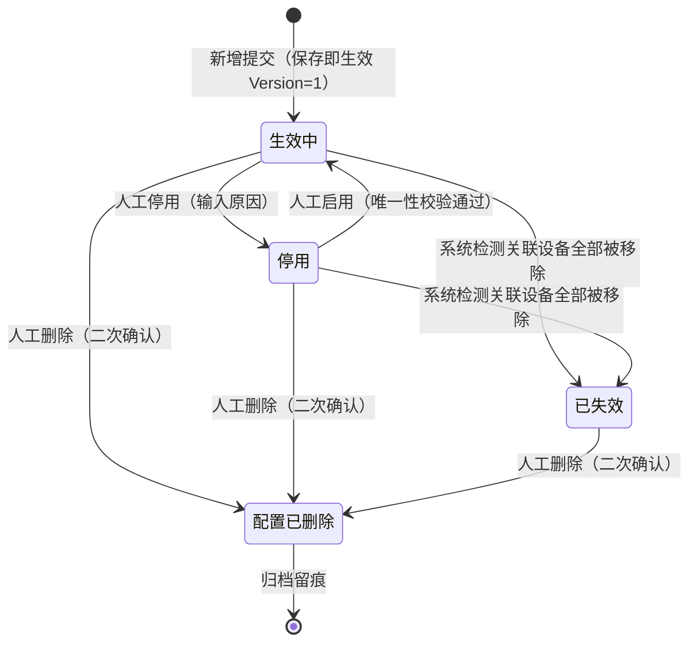
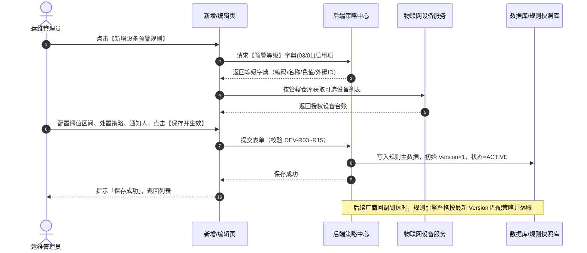
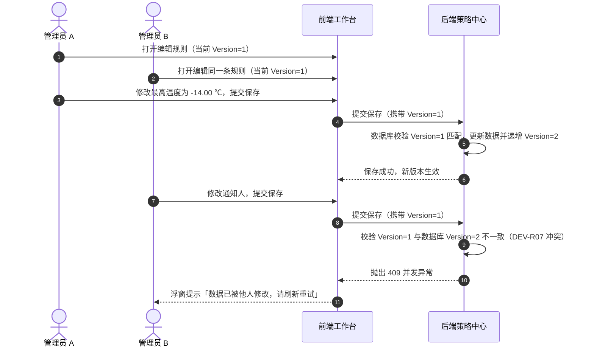

# 设备预警配置 业务规则规格

> **文档定位**：**三件套核心**——状态机、动作约束、校验规则、计算联动、处置策略矩阵及并发控制的**唯一定义来源**。配套文档：[设备预警配置主PRD.md](./设备预警配置主PRD.md)（业务与页面交互）、[设备预警配置字段清单.md](./设备预警配置字段清单.md)（字段字典）。端侧 ASCII 线框与 Demo 为衍生输入，仅引用本文件规则 ID，不重复定义规则本体。  
> **模块类型**：配置策略类（范式 A 裁剪版——具有完整生命周期状态机，保存即生效，无审批流）  
> **版本**：V4.4 | **更新时间**：2026-09-20 | **责任人**：森云科技（Senyun Technology）  
> **参考依据**：[《00-全局契约与RBAC权限矩阵》](../../00-全局契约与RBAC权限矩阵.md)第四章 §1、[预警等级配置业务规则规格（03/01）](../01预警等级/预警等级业务规则规格.md)

---

## 一、单据与能力定位

| 项目 | 内容 |
| :--- | :--- |
| **模块层级** | **【配置策略层】**（物理设备资产告警管控规则配置，非底层业务单据） |
| **菜单路径** | `预警配置 → 设备预警配置` |
| **核心职责** | 集中定义与维护 5 大类硬件设备的预警策略；精准配置物理指标阈值区间、预警等级外键绑定、三档处置策略模式、多渠道通知人及超时升级阶梯；接收厂商预过滤后的设备事件回调并完成实时策略匹配 |
| **规则来源** | 经授权的管理人员通过 PC 端表单新增/编辑生成（保存即生效） |
| **上游依赖** | **【预警等级】字典（菜单：预警配置 → 预警等级，代号 03/01）**：读取当前租户启用等级列表，保存 `severity_level_id` 外键，按 `sort_order` 比较严重度； **设备台账主数据**：提供物理设备 ID、分类、系统内名称及绑定仓库/库房/分区； **仓库档案与数据权限**：设备穿梭框、规则列表与详情均严格按操作人管辖实体仓库范围过滤。 |
| **下游影响** | **规则版本递增**：保存/编辑成功后，规则状态置为 `生效中`，`Version` 递增；生效中规则即刻对后续设备事件生效； **流水落账与快照固化**：设备回调命中生效规则时，【设备预警信息】台账（菜单：`预警信息 → 设备预警信息`，代号 02/01）写入 `iot_event_ledger`，不可变固化触发时刻的规则版本、阈值、等级快照及通知/升级对象； **配置变更隔离（C08）**：规则修改**严格不回写**存量未结案流水，后续回调严格按最新 Version 落账； **跨域穿透**：等级快照开启订单穿透且设备空间匹配在押订单时，向【押品预警信息】台账（菜单：`预警信息 → 押品预警信息`，代号 02/02）投递物联穿透告警。 |
| **审核流边界** | **无审批流**——配置策略类保存即生效（状态直接为 `生效中`），表单无状态下拉选择框，不设草稿态与待审核态 |

---

## 二、指标与计算口径隔离表

| 口径名称 | 应用维度 | 业务含义与计算公式 / 判定条件 | 约束与边界说明 |
| :--- | :--- | :--- | :--- |
| **数值阈值区间** | 持续型子类型配置 | 正常安全运行的物理指标闭区间： $$V \in [T_{\text{min}}, T_{\text{max}}]$$ | **严格递增**：必须满足 $T_{\text{min}} < T_{\text{max}}$；支持 2 位小数；二氧化碳示例 $[400.00, 1500.00]\text{ ppm}$ |
| **越限告警判定** | 设备回调实时计算 | 厂商上报物理监测值 $V_{\text{current}}$，当满足： $$V_{\text{current}} < T_{\text{min}} \quad \text{或} \quad V_{\text{current}} > T_{\text{max}}$$ | 超出正常闭区间即判定命中告警，触发生成【设备预警信息】（02/01）告警流水 |
| **自动恢复判定** | 恢复结案实时计算 | 仅限白名单子类型且配置为恢复自动结案模式，当上报监测值满足： $$T_{\text{min}} \le V_{\text{current}} \le T_{\text{max}}$$ | 指标回落至正常安全区间并稳定，触发系统自动结案，联动更新流水为【已结案 · 有效】 |
| **超时升级时间** | 超时升级定时引擎 | 自告警事件实际发生时间起算，超时升级触发时刻为： $$T_{\text{upgrade}} = T_{\text{trigger}} + D_{\text{upgrade}} \times 86400\text{ 秒}$$ | $D_{\text{upgrade}} \in [1, 30]$ 正整数天；仅在告警处于待处置状态且 $T_{\text{current}} \ge T_{\text{upgrade}}$ 时触发短信升级 |
| **数据版本号** | 乐观锁并发控制 | 规则主数据版本计数器： $$\text{Version}_{n+1} = \text{Version}_n + 1$$ | 初始新增为 1；每次编辑保存成功后原子递增；提交时若客户端 Version 与数据库不一致强阻断 |
| **有效规则唯一性** | 规则防重约束 | 租户内针对同一物理设备 $Dev_i$ 与同一预警子类型 $SubType_j$ 的有效规则计数： $$\text{Count}(Dev_i, SubType_j, \text{Status} \in \{\text{ACTIVE}, \text{DISABLED}\}) \le 1$$ | 计数严格 $\le 1$；超出时系统强阻断保存或启用（含停用态占位） |

---

## 三、单据状态机与流转定义

### 3.1 状态定义
规则生命周期共包含 4 种状态，不设草稿与审批态，核心生命周期在列表与详情页流转：

| 状态名称 | 状态编码 | 业务含义 | 是否终态 | 列表可见性 | 进入条件 | 退出条件 |
| :--- | :--- | :--- | :---: | :---: | :--- | :--- |
| **生效中** | `ACTIVE` | 规则正常运行，对设备回调事件生效，命中可触发流水 | 否 | 可见 | 新增保存成功；自停用态人工启用 | 人工停用；系统自动失效；软删除 |
| **停用** | `DISABLED` | 人工主动暂停，配置保留，停止监听和匹配新事件 | 否 | 可见 | 人工点击停用 | 人工重新启用；系统自动失效；软删除 |
| **已失效** | `INACTIVE` | 关联设备全部被解绑移除，系统自动失效，不可恢复 | **是** | 可见 | 系统任务检测到无关联可用设备 | 软删除（仅可删除） |
| **配置已删除** | `DELETED` | 规则已被软删除，退出策略库，保留底层审计镜像 | **是** | **不可见** | 人工二次确认删除 | —（不可逆终态） |

### 3.2 状态流转图

---

## 四、动作能力与流转控制矩阵

| 触发动作 | 操作入口 | 适用角色 | 前置业务校验条件 | 结果状态 | 联动后置影响 | 失败阻断提示 |
| :--- | :--- | :--- | :--- | :--- | :--- | :--- |
| **新增保存** | 新增页【保存并生效】按钮 | IoT 管理员 (`R-IOT-OPS`) | ① 规则名称租户内唯一（R03）； ② 设备与子类型唯一（R04/R05）； ③ 设备上线子类型互斥（R14）； ④ 处置策略白名单有效（R15/R15c）； ⑤ 数值阈值 $T_{\text{min}} < T_{\text{max}}$（R09）。 | 生效中 | ① 写入规则主数据，初始 Version=1； ② 规则版本即时生效，监听设备事件； ③ 记录新增操作审计日志。 | 「保存失败：{字段名}校验未通过」 「保存失败：该设备已存在同类型有效预警规则」 |
| **编辑保存** | 编辑页【保存并生效】按钮 | IoT 管理员 (`R-IOT-OPS`) | ① 不可变字段未变更（R06）； ② 携带客户端 Version 且与数据库一致（R07 乐观锁）； ③ 满足新增全部表单校验项。 | 生效中 / 停用（保持原态） | ① 规则 Version 递增（Version+1）； ② **不回写**既有未结案流水（C08）； ③ 后续事件按最新 Version 匹配落账； ④ 记录编辑操作审计日志。 | 「数据已被他人修改，请刷新重试」 「保存失败：不可变字段禁止修改」 |
| **停用规则** | 列表/详情行操作【停用】 | IoT 管理员 (`R-IOT-OPS`) | 规则处于生效中状态；强制输入停用原因（$\le 200$ 字） | 停用 | ① 规则版本停止匹配新事件； ② 存量未处理流水**不置作废**，继续允许处理； ③ 记录停用操作审计日志。 | 「停用失败：规则状态已发生变迁」 |
| **启用规则** | 列表/详情行操作【启用】 | IoT 管理员 (`R-IOT-OPS`) | 规则处于停用状态；重新执行【设备子类型唯一性】校验（R04/R05） | 生效中 | ① 恢复规则版本生效，重新监听设备事件； ② 记录启用操作审计日志。 | 「启用失败：该设备已绑定其他同类型有效规则」 |
| **删除规则** | 列表/详情行操作【删除】 | IoT 管理员 (`R-IOT-OPS`) | 规则处于生效中、停用或已失效；二次确认弹窗输入删除理由 | 配置已删除 | ① 执行软删除，列表不可见； ② 级联将该规则产生的所有未结案流水置为【已作废】（C01）； ③ 取消关联的所有进行中超时升级任务（C04）。 | 「删除失败：规则已被他人删除」 |
| **查看详情** | 列表行操作【查看详情】 | 具备查看权限 (`R-IOT-VIEW`) | 规则处于生效中、停用或已失效 | 状态不变 | 只读打开详情页，展示完整策略快照、当前 Version 及审计日志 | — |
| **规则导出** | 列表上方【导出】按钮 | 具备查看权限 (`R-IOT-VIEW`) | 列表有符合筛选条件的数据 | 状态不变 | 异步导出规则策略清单 Excel 文件；记录审计日志 | 「导出失败：系统繁忙，请稍后重试」 |

---

## 五、核心业务规则清单 (DEV-R01 ~ DEV-R15)

### 5.1 唯一性约束与版本并发控制

#### 【规则名称租户内唯一】(DEV-R03)
* **业务红线**：规则名称必填，最大长度不超过 50 个字符。同一租户内严禁存在重名规则（已软删除规则不计入重名校验）；
* **强校验时机**：表单失去焦点即时校验，点击【保存并生效】时服务端前置拦截，重复时提示「规则名称已存在，请重新输入」。

#### 【同一设备同一预警子类型唯一规则约束】(DEV-R04)
* **业务红线**：同一物理设备与同一预警子类型，在租户内**仅允许绑定 1 条有效规则**（有效规则包含 `生效中` 与 `停用` 状态，不含 `配置已删除` 与 `已失效`）；
* **设计目标**：杜绝同一设备针对同一指标被重复配置，避免触发重叠告警与冲突风暴；
* **校验动作**：新增、编辑及停用恢复【启用】时均执行强校验，违规时阻断并提示「该设备已存在同类型有效预警规则」。

#### 【全局新设备规则唯一性约束】(DEV-R05)
* **单例配置位**：当勾选「仅针对新设备」时，同一预警大类（如视频监控、物联设备）在租户内**仅允许存在 1 条有效全局规则**（含生效中、停用；不含已删除、已失效）；
* **占位与释放**：创建时即行校验；若需更换全局策略，管理人员必须**编辑**既有规则或将既有规则**删除**（释放单例槽位）后方可新建。

#### 【编辑时不可变字段锁定】(DEV-R06)
* **锁定范围**：规则进入编辑页后，`规则名称`、`预警大类`、`预警子类型` 三个核心字段强制锁定置灰只读，严禁变更；
* **防呆机制**：若业务上需要变更监控类型，必须废弃该规则并新建，防止下游快照语义混淆。

#### 【数据版本乐观锁并发控制】(DEV-R07)
* **并发控制**：编辑保存提交时，请求必须携带客户端打开时的规则数据版本号 `Version`；
* **冲突阻断**：服务端在事务内对比当前数据库版本：
  * 若一致：执行更新并原子令 $\text{Version} = \text{Version} + 1$；
  * 若不一致：强阻断更新，浮窗提示「数据已被他人修改，请刷新重试」。

---

### 5.2 触发条件与指标计算规范

#### 【关联设备非空校验】(DEV-R08)
* 当未勾选「仅针对新设备」时，关联设备列表**必须选择至少 1 台**有效物理设备；
* 勾选「仅针对新设备」时，前端自动隐藏设备选择穿梭框，服务端将设备关联列表持久化为空集合。

#### 【数值型区间逻辑有效性】(DEV-R09)
* **区间递增校验**：针对温度、湿度、有害气体等持续型数值子类型，最低阈值与最高阈值均为必填项，且必须严格满足：
  $$T_{\text{min}} < T_{\text{max}}$$
* **物理边界保护**：
  * 湿度指标强制限制在 $[0.00, 100.00]\%RH$；
  * 二氧化碳最低阈值不得小于 $0\text{ ppm}$，推荐默认闭区间为 $[400.00, 1500.00]\text{ ppm}$；
  * 违反校验时阻断提交，提示「阈值区间设置不正确，最低值必须严格小于最高值」。

#### 【预警等级引用与外键快照】(DEV-R10)
* **字典引用**：预警等级下拉列表仅读取【预警等级】字典（03/01）中状态为 `启用` 的等级项；
* **外键存储**：规则主数据仅存储稳定外键 `severity_level_id`，禁止存储静态编码或名称；严重度比较与平仓判定严格使用等级对应的 `sort_order` 权重数值。

#### 【设备上线子类型互斥规范】(DEV-R14)
* **互斥红线**：5 大类中的所有「xxx设备上线」子类型（附录 A）属于资产入网运维通知，**严禁与温度、破坏等任何运营告警子类型混选在同一规则中**；
* **交互联动**：
  * 用户点击勾选「设备上线」时，系统自动取消已勾选的其他子类型并置灰；
  * 用户勾选「仅针对新设备」时，子类型单选框自动限定为当前大类对应的「xxx设备上线」子类型。

---

### 5.3 处置策略模式与能力矩阵白名单

#### 【处置策略模式配置规范】(DEV-R15)
* **策略三档定义**：
  1. `仅落账记录 (RECORD_ONLY)`（触发即结案）：适用于瞬态通知类事件，告警产生后系统自动结案，初态直接为【已结案 · 有效】；
  2. `人工处置结案 (ACTION_REQUIRED)`（人工解除结案）：适用于需现场干预的安防或严重违规事件，初态为【待处置 · 有效】，强制人工现场核验销警；
  3. `恢复自动结案 (AUTO_RECOVER)`（恢复自动结案）：适用于可自愈的环境监测指标，初态为【待处置 · 有效】，指标正常后系统自动结案。

#### 【触发即结案禁配超时升级】(DEV-R15a)
* 当处置策略配置为 `仅落账记录 (RECORD_ONLY)` 时，该事件无需人工跟进，系统自动隐藏超时升级配置区，并强制设置 `upgrade_days = 0`，禁止注册升级定时任务。

#### 【下沉流水落账联动机制】(DEV-R15b)
* 规则配置中的处置策略模式在告警触发时 100% 固化入流水快照，作为【设备预警信息】台账（菜单：`预警信息 → 设备预警信息`，代号 02/01）执行前置核销校验的唯一标准，不受后续规则修改影响。

#### 【恢复自动结案能力矩阵白名单】(DEV-R15c)
* **白名单强控**：仅当规则内**所有**选中的子类型均属于附录 A 白名单（如温湿度异常、有害气体、离线后重新上线）时，才允许选择【恢复自动结案】；
* **GPS 行车事件禁配**：进围栏、出围栏、普通限速、怠速滞留、路线偏离、非法拆除等 GPS 行车/安防事件，**三方接入层不提供恢复自动结案回调**，禁止配置【恢复自动结案】，系统推荐【人工解除结案】；
* **安防红线**：对于非法剪杆、非法开锁、密码连续错误、图像入侵、设备非法拆除等安防破坏事件，**绝对禁止**配置自动恢复，违规保存时系统强阻断。

---

### 5.4 通知渠道与超时升级阶梯

#### 【通知渠道与预警对象完整性】(DEV-R11)
* **按需展开**：通知渠道提供多选复选框（短信、邮件）。未勾选任何渠道时，系统隐藏预警对象与超时升级配置区；
* **非空约束**：一旦勾选短信或邮件，`预警对象`（首次通知人）必填；若开启超时升级且天数 $>0$，`升级预警对象` 必填；
* **升级短信专道**：超时升级预警统一通过**短信通道**上报，不受首次通知是否勾选邮件影响。

#### 【全局新设备规则禁配升级】(DEV-R13)
* 当勾选「仅针对新设备」全局监听时，该规则定位为基础入网通知，系统强制隐藏超时升级配置区，强制锁定 `upgrade_days = 0`。

---

### 5.5 仓库数据权限与生命周期联动

#### 【管辖仓库数据权限强隔离】(DEV-R12)
* 操作员在新增或编辑规则选择物理设备时，系统强制基于其组织架构分配的实体仓库范围进行过滤，严禁越权返回未经授权仓库的设备。

#### 【规则删除级联流水作废】(DEV-C01)
* 当规则被软删除时，系统在同一原子事务内，级联检索出该规则产生的全部处于 `待处置 · 有效` 状态的历史告警流水，批量更新状态为 `已作废`（作废原因记为「关联规则已被删除」），并同步终止其所有待执行的超时升级任务。

#### 【配置变更版本生效与历史隔离】(DEV-C08)
* 规则编辑保存后 Version 递增生效；系统**严格不回写**既有未结案告警流水；后续新设备事件回调严格按最新 Version 匹配落账，保证每条历史告警的规则快照与司法存证证据效力永久真实不变。

---

## 六、异常与边界控制矩阵 (DEV-C01 ~ DEV-C08)

| 异常编号 | 异常场景 | 系统判定与控制动作 | 前端反馈与提示 |
| :--- | :--- | :--- | :--- |
| **【规则删除级联作废】(DEV-C01)** | 规则软删除时存在未结案流水 | 检索该规则下全部待处置流水，原子置为【已作废】并注销升级任务 | 二次确认弹窗提示：「删除后该规则产生的未处理预警将全部置为已作废，确认删除？」 |
| **【规则停用回调拒识】(DEV-C02)** | 规则处于停用状态下接收设备事件 | 规则版本已停用，事件匹配引擎直接忽略跳过，不落流水 | 服务端静默记录忽略日志，前端列表保持停用 |
| **【规则版本生效控制】(DEV-C03)** | 规则启停或失效变迁 | 生效中时激活当前 Version 监听；停用、失效或删除时注销当前 Version 监听 | 列表状态即时刷新，浮窗提示：「操作成功」 |
| **【删除终止升级任务】(DEV-C04)** | 规则删除取消调度 | 调度引擎按 `rule_id` 扫描未触发的延迟升级定时 Job，全量撤销 | 服务端异步取消，防止幽灵短信打扰 |
| **【快照字段固化隔离】(DEV-C05)** | 事件命中时生成流水快照 | 一次性固化触发时刻的规则 Version、阈值区间、预警等级全套字段与通知责任人 | 详情页展示触发时刻原始数据，不受后续修改影响 |
| **【关联设备全解绑失效】(DEV-C06)** | 设备台账解绑导致规则无设备 | 规则关联设备列表有效设备数为 0 时，系统自动将规则变迁为【已失效】 | 规则状态变更已失效，操作列置灰仅保留删除 |
| **【移动端红点自动联动】(DEV-C07)** | 告警产生后移动端同步 | 设备告警流水落账时，系统自动更新移动端「设备预警信息」待办红点角标 | 移动端工作台即时渲染待办红点 |
| **【配置变更不回写历史】(DEV-C08)** | 修改阈值后存在历史未结案流水 | 规则 Version 递增生效，严格不回写既有流水；新回调按新 Version 落账 | 保存成功，历史详情页明确显示为历史快照版本 |

---

## 七、业务时序推演与跨模块联动

### 7.1 规则创建与版本生效时序

### 7.2 编辑乐观锁并发冲突时序

---

## 八、规则全景速查索引表

| 规则编码 | 规则全称 | 核心控制逻辑摘要 | 违规/异常反馈 |
| :--- | :--- | :--- | :--- |
| **DEV-R03** | 规则名称租户内唯一 | 最多 50 字；租户内唯一 | 阻断，提示名称已存在 |
| **DEV-R04** | 同一设备同一子类型唯一有效规则 | 同一物理设备 + 同一预警子类型限 1 条有效规则 | 阻断，提示同类型规则已存在 |
| **DEV-R05** | 全局新设备规则大类唯一性 | 每预警大类仅 1 条有效全局规则（含停用占位） | 阻断，提示编辑或删除原规则 |
| **DEV-R06** | 编辑时不可变字段锁定 | 名称、大类、子类型置灰只读 | 服务端拦截篡改传参 |
| **DEV-R07** | 数据版本乐观锁并发控制 | 提交携带 Version；版本冲突拦截 | 阻断，提示数据已被他人修改 |
| **DEV-R08** | 关联设备非空校验 | 非全局新设备时，关联设备必选 $\ge 1$ 台 | 阻断，提示请选择关联设备 |
| **DEV-R09** | 数值型区间逻辑有效性 | 最低值严格小于最高值（$T_{\text{min}} < T_{\text{max}}$） | 阻断，提示阈值区间设置不正确 |
| **DEV-R10** | 预警等级引用与外键快照 | 下拉仅读【预警等级】字典（03/01）启用项；保存外键 ID | 阻断，提示请选择有效等级 |
| **DEV-R11** | 通知渠道与预警对象完整性 | 勾选渠道时首次通知人必填；升级天数 $>0$ 升级人必填 | 阻断，提示请配置预警对象 |
| **DEV-R12** | 仓库数据权限强隔离 | 物理设备受限于管辖仓库权限 | 越权设备物理不可见 |
| **DEV-R13** | 全局新设备规则禁配升级 | 全局新设备隐藏升级；`upgrade_days=0` | 服务端阻断非法升级天数 |
| **DEV-R14** | 设备上线子类型互斥规范 | 设备上线单独成规；禁止与常规子类型混选 | 阻断，自动取消互斥项并提示 |
| **DEV-R15** | 处置策略三档模式配置 | 三档单选；触发即结案/人工结案/自动结案 | 阻断空值 |
| **DEV-R15a**| 触发即结案禁配升级 | `RECORD_ONLY` 隐藏升级，天数强制为 0 | 服务端阻断非法升级配置 |
| **DEV-R15b**| 下沉流水落账联动 | 处置策略 100% 固化入流水触发快照 | 【设备预警信息】台账（02/01）按快照执行核销门控 |
| **DEV-R15c**| 恢复自动结案白名单矩阵 | 仅限附录 A 白名单子类型可选自动结案；GPS 围栏/限速/怠速/偏离/拆除因三方无恢复回调禁止 | 阻断，提示无自动恢复信号 |

---

## 附录 A：预警子类型权威枚举与处置策略能力矩阵

| 预警大类 | 预警子类型编码 | 子类型中文名称 | 指标类型 | 系统推荐处置策略 | 是否允许配置【恢复自动结案】(R15c 白名单) |
| :--- | :--- | :--- | :--- | :--- | :---: |
| **视频监控** | `DEV_OFFLINE` | 监控设备离线 | 事件型 | 人工处置结案 | **✅ 允许**（重新上线自动结案） |
| **视频监控** | `DEV_ONLINE` | 监控设备上线 | 事件型 | 仅落账记录 | ❌ 禁止（通知类） |
| **门禁设备** | `LOCK_SHEAR` | 智能挂锁剪杆破坏 | 事件型 | 人工处置结案 | ❌ 禁止（安防破坏类） |
| **门禁设备** | `LOCK_ILLEGAL_OPEN` | 门禁非法开锁破坏 | 事件型 | 人工处置结案 | ❌ 禁止（安防破坏类） |
| **门禁设备** | `PWD_RETRY_OVER` | 密码连续错误超限 | 事件型 | 人工处置结案 | ❌ 禁止（安防破坏类） |
| **门禁设备** | `DOOR_TIMEOUT` | 门未关超时告警 | 事件型 | 自动恢复结案 | **✅ 允许**（关门后自动恢复） |
| **门禁设备** | `BATT_LOW` | 门禁设备低电量 | 事件型 | 人工处置结案 | ❌ 禁止（硬件维护类） |
| **物联设备** | `TEMP_ALARM` | 温度异常 | 数值型 | 自动恢复结案 | **✅ 允许**（温度回落区间自动结案） |
| **物联设备** | `HUMI_ALARM` | 湿度异常 | 数值型 | 自动恢复结案 | **✅ 允许**（湿度回落区间自动结案） |
| **物联设备** | `CO2_ALARM` | 二氧化碳超限 | 数值型 | 自动恢复结案 | **✅ 允许**（气体浓度恢复自动结案） |
| **物联设备** | `O2_ALARM` | 氧气浓度超限 | 数值型 | 自动恢复结案 | **✅ 允许**（气体浓度恢复自动结案） |
| **物联设备** | `SMOKE_ALARM` | 烟雾感应火警 | 事件型 | 人工处置结案 | ❌ 禁止（严重消防隐患） |
| **GPS 终端** | `GPS_FENCE_IN` | 进围栏 | 事件型 | 人工处置结案 | ❌ 禁止（三方不提供恢复自动结案回调） |
| **GPS 终端** | `GPS_FENCE_OUT` | 出围栏 | 事件型 | 人工处置结案 | ❌ 禁止（三方不提供恢复自动结案回调） |
| **GPS 终端** | `GPS_OVER_SPEED` | 普通限速 | 事件型 | 人工处置结案 | ❌ 禁止（三方不提供恢复自动结案回调） |
| **GPS 终端** | `GPS_IDLE` | 怠速滞留 | 事件型 | 人工处置结案 | ❌ 禁止（三方不提供恢复自动结案回调） |
| **GPS 终端** | `GPS_ROUTE_DEV` | 路线偏离 | 事件型 | 人工处置结案 | ❌ 禁止（三方不提供恢复自动结案回调） |
| **GPS 终端** | `GPS_ILLEGAL_DISMANTLE`| 非法拆除 | 事件型 | 人工处置结案 | ❌ 禁止（安防破坏类；三方不提供恢复自动结案回调） |
| **GPS 终端** | `GPS_OFFLINE` | GPS设备离线 | 事件型 | 自动恢复结案 | **✅ 允许**（重新上线自动结案） |
| **图像识别** | `IMG_INTRUSION` | 禁区人员非法入侵 | 事件型 | 人工处置结案 | ❌ 禁止（安防事件类） |
| **图像识别** | `IMG_FIRE_DETECT` | 视频明火烟雾识别 | 事件型 | 人工处置结案 | ❌ 禁止（严重消防隐患） |

---

## 修订记录

| 日期 | 版本 | 变更内容说明 | 影响范围 | 修订人 |
| :--- | :--- | :--- | :--- | :--- |
| 2026-09-11 | V4.0 | 确立三件套核心定位，规范 R/C/P 规则编号自解释语义。 | 全文 | AI PM / 森云科技 |
| 2026-09-16 | V4.1 | 汉化交互词汇，规范处置策略三档模式与白名单机制。 | 规则清单 | AI PM / 森云科技 |
| 2026-09-18 | **V4.3** | **全面对齐《入库记录》《出库记录》标杆业务规格排版**： 1. 确立《一、单据与能力定位》6 大维度标准表格； 2. 新增《二、指标与计算口径隔离表》，严格以 LaTeX 公式定义区间判定、自动恢复与升级计时算法； 3. 落地 7 列全景动作控制矩阵（前置条件、后置联动、失败文案）； 4. 核心规则清单条目化重构，落地黑体重点引导词； 5. 完善时序推演与附录 A 能力矩阵。 | 业务规则规格全文 | AI PM / 森云科技 |
| 2026-09-20 | **V4.4** | **GPS 行车事件退出 R15c 白名单**：进围栏、出围栏、普通限速、怠速滞留、路线偏离、非法拆除因三方不提供恢复自动结案回调，禁止配置【恢复自动结案】，系统推荐【人工解除结案】；GPS 设备离线仍允许重新上线自动结案。 | DEV-R15c、附录 A GPS 矩阵 | AI PM / 森云科技 |
