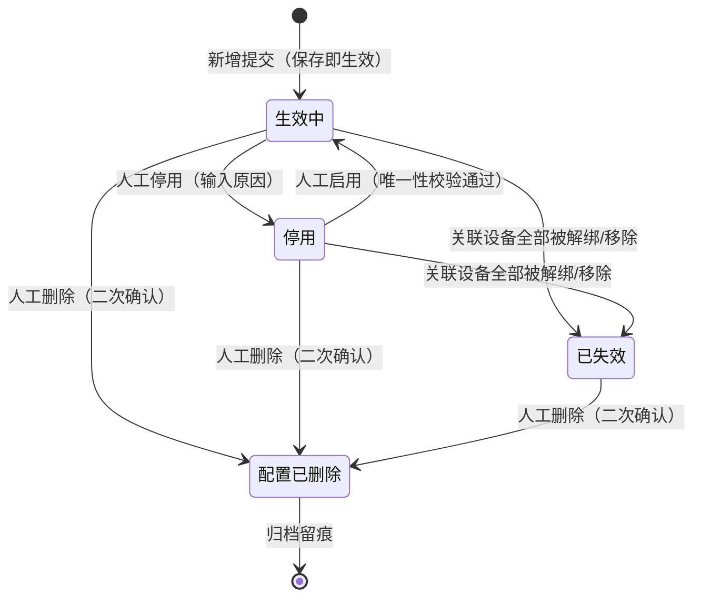

# 设备预警配置主PRD

> **模块定位**：物联网 IoT 板块策略配置中枢，统管视频监控、智能门禁、物联传感、GPS 终端及图像识别 5 大类硬件资产的异常告警与运维通知策略。通过集中绑定自定义预警等级、配置物理指标阈值与事件型判定、编排多渠道通知与超时升级阶梯，实现“事件接入-规则匹配-流水落账-跨域穿透”的全链路闭环。  
> **版本**：V4.1 | **更新时间**：2026-09-20 | **责任人**：森云科技（Senyun Technology）  
> **编写依据**：[设备预警配置字段清单.md](./设备预警配置字段清单.md) 是本模块所有字段定义、枚举与页面展示的唯一定义来源；[设备预警配置业务规则规格.md](./设备预警配置业务规则规格.md) 是本模块状态机、校验算法、处置策略矩阵、防并发控制及跨域联动的唯一定义来源；配套衍生原型输入详见 [设备预警配置_ASCII_列表页.md](./设备预警配置_ASCII_列表页.md)、[设备预警配置_ASCII_新增编辑页.md](./设备预警配置_ASCII_新增编辑页.md) 与 [设备预警配置_ASCII_详情页.md](./设备预警配置_ASCII_详情页.md)。

---

## 一、业务背景与业务痛点

### 1.1 业务背景
在供应链金融存货质押与动态监管业务中，部署在仓库与货位现场的物理物联网设备是实现“货权穿透、物理监管、数字防盗”的眼睛与触角。为了防止由于设备掉线、传感器异常波动或人为非法侵入导致质押货物受损或失控，系统必须建立统一、严密且高效的设备预警策略体系。通过灵活定义告警触发条件、预警等级与通知责任人，保障告警发生时毫秒级响应、责任到人、全程留痕。

### 1.2 核心业务痛点
1. **【策略分散与风控口径不一】**：传统设备监控各硬件厂商自成一套规则，阈值与通知对象分散维护，缺乏统一的严重度分级与风控管控底座；
2. **【误报频发与告警风暴】**：传感器瞬态尖峰或网络抖动易造成海量垃圾告警，缺乏标准化的处置策略与白名单准入机制；
3. **【快照脱节与举证困难】**：预警产生后，规则若被修改，无法追溯“触发当时按什么阈值与规则判定”，导致司法纠纷中证据链不完整；
4. **【生命周期与流水联动断层】**：规则停用或软删除后，历史未结案告警如何流转、是否继续超时升级缺乏清晰的标准，易引发管理失控；
5. **【线上线下割裂缺乏闭环】**：传统设备告警仅停留在硬件通知层面，未能与底层在押货物、仓单及金融订单穿透联动，无法实现风险阻断。

---

## 二、功能范围

| 包含功能范围 (In Scope) | 不包含功能范围 (Out of Scope) |
| :--- | :--- |
| - **5大类硬件策略全景纳管**：集中管理视频监控、门禁设备、物联传感器、GPS 终端、图像识别设备的告警策略；<br/>- **自定义预警等级动态绑定**：读取【预警等级】字典（菜单：`预警配置 → 预警等级`，代号 03/01）租户级启用等级（2~20 档），保存 `severity_level_id` 外键快照与权重比较；<br/>- **双模触发条件判定**：<br/>  1. **数值型指标**：支持温湿度、有害气体等持续型监测指标配置 `[最低值, 最高值]` 正常区间，超出即触发告警；<br/>  2. **事件型指标**：支持剪杆、非法开锁、黑名单人脸等瞬态破坏事件即时触发；<br/>- **三档处置策略模式**：系统推荐 + 矩阵白名单控制（`触发即结案`、`人工解除结案`、`恢复自动结案`）；<br/>- **通知渠道与超时升级阶梯**：支持短信/邮件多渠道通知，支持配置升级天数与升级对象逐级上报；<br/>- **双重监听范围**：支持关联指定实体设备集合，或勾选「仅针对新设备」实现全局增量自动监听；<br/>- **规则生命周期管理**：生效中、停用、已失效及软删除闭环流转，版本号（Version）递增生效；<br/>- **多维组合筛选与报表导出**：支持按规则名称、类型、等级、处置策略、状态等组合检索并导出清单。 | - **审批流机制**：配置策略类单据保存即生效（状态直接为生效中），系统设计不支持草稿箱与待审核态；<br/>- **平台级复杂防抖计算**：事件预过滤与防抖判定完全由硬件厂商边缘接入层负责，平台配置中心不再配置防抖窗口时长；<br/>- **版本树与历史回滚**：6.2 仅提供 `Version` 乐观锁防并发并发冲突，不提供历史配置版本树与一键回滚；<br/>- **预警流水现场处置**：告警流水人工解除、核销、拍照上传与情况说明归属于 [设备预警信息（02/01）](../../02-预警信息/01设备预警信息/设备预警信息主PRD.md)；<br/>- **预警等级字典维护**：等级字典增删改查归属于 [预警等级配置（03/01）](../01预警等级/预警等级主PRD.md)；<br/>- **订单金融侧规则配置**：超时、跌价、盘点等商业订单预警配置归属于 [订单预警配置（03/03）](../03订单预警配置/订单预警配置主PRD.md)；<br/>- **移动端配置管理**：6.2 移动端仅提供预警流水查看与待办红点提示，策略规则配置与维护强约束在 PC 端完成。 |

---

## 3. 模块定位与系统链路

### 3.1 模块定位矩阵

| 项目 | 内容 |
| :--- | :--- |
| **模块层级** | **【配置策略层】**（定义硬件告警判定逻辑与通知策略，非底层流水账） |
| **核心职责** | 明确定义「何种设备资产、在何种异常场景下、达到什么指标阈值、以何种严重等级、通知哪些责任人、如何超时升级」 |
| **配置来源** | 授权风控或运维管理人员在 PC 端手动新增/编辑维护（保存即生效） |
| **上游依赖** | **【预警等级】字典（菜单：预警配置 → 预警等级，代号 03/01）**：提供启用的严重度字典与订单穿透标记；<br/>**设备台账主数据**：提供物理设备唯一标识、分类、名称及空间绑定关系；<br/>**仓库档案与数据权限**：基于操作员管辖仓库范围实现规则配置与查看的数据隔离。 |
| **下游影响** | **【设备预警信息】台账（菜单：预警信息 → 设备预警信息，代号 02/01）**：规则命中时固化规则快照，生成设备告警流水；<br/>**通知与升级引擎**：读取规则触发快照执行首次短信/邮件推送，超时自动升级；<br/>**【押品预警信息】台账（菜单：预警信息 → 押品预警信息，代号 02/02）**：当预警等级开启穿透且关联库区存在在押订单时，向订单侧投递物联穿透告警。 |
| **实体对应关系** | **规则与设备**：1 条规则可关联多台物理设备（N:M）；<br/>**设备与子类型**：同一物理设备 + 同一预警子类型在租户内**唯一对应 1 条有效规则**（1:1）。 |

### 3.2 端到端系统链路图

```mermaid
flowchart TD
    subgraph S1[上游输入与依赖源头]
        A1[【预警等级】字典(03/01)<br/>等级ID / 权重 / 订单穿透开关]
        A2[物联网设备台账<br/>设备ID / 分类 / 仓储空间拓扑]
        A3[数据权限体系<br/>管辖仓库范围强隔离]
    end

    subgraph S2[设备预警配置策略引擎]
        B1{规则定义与保存}
        A1 --> B1
        A2 --> B1
        A3 --> B1
        B1 -->|版本号递增 Version+1| B2[生效中规则策略库<br/>阈值 / 处置策略 / 通知渠道 / 升级阶梯]
    end

    subgraph S3[下游流水生成与协同闭环]
        C1[现场设备事件发生] -->|厂商接入层预过滤防抖| C2[设备事件回调]
        B2 -.->|精确匹配 生效中 规则版本| C2
        C2 -->|固化不可变规则快照| D1[【设备预警信息】台账(02/01)<br/>逐条落账 / 生成告警流水]
        D1 -->|首次命中推送| E1[通知中心<br/>短信 / 邮件通知]
        D1 -->|超时未处理| E2[超时升级引擎<br/>按天数逐级上报]
        D1 -->|穿透开关开启 + 库区有押品| D2[【押品预警信息】台账(02/02)<br/>生成物联穿透流水]
    end
```

---

## 4. 业务场景与用户故事

| 场景编号与名称 | 触发角色 | 核心交互与风控约束 | 业务价值 |
| :--- | :--- | :--- | :--- |
| **场景 1【环境传感持续型阈值规则配置】(S01)** | 物联网运维工程师 | 选择温湿度传感器，选择【温度异常】子类型；输入阈值区间 `[-18.00, -15.00] ℃`；绑定等级 `L4 严重风险`；处置策略选择【恢复自动结案】（白名单允许）；配置短信通知与 1 天超时升级。点击【保存并生效】。 | 保障冷库恒温环境，指标异常自动告警，回落正常自动消警。 |
| **场景 2【安防破坏瞬态事件规则配置】(S02)** | 安全风控经理 | 选择智能挂锁，选择【非法剪杆破坏】；无需配置阈值；系统锁定处置策略为【人工解除结案】（白名单限制禁配自动恢复）；配置紧急短信通知风控主管。点击【保存并生效】。 | 针对盗窃、破坏等恶性事件建立强控防线，强制人工现场核验销警。 |
| **场景 3【全局新设备上线专规监听】(S03)** | 系统管理员 | 选择监控设备，选择【监控设备上线】（系统自动互斥其他子类型）；勾选「仅针对新设备」开关；系统自动隐藏设备选择列表与超时升级阶梯；配置通知责任人。点击【保存并生效】。 | 实现新硬件入网即时感知，规避告警风暴，确保上线事件专规专审。 |
| **场景 4【已生效规则编辑与版本递增】(S04)** | 风控主管 | 编辑生效中的冷库温度规则，微调最高温度阈值为 `-14.00 ℃`；系统提示修改将生成新版本；提交时携带当前 Version，服务端执行版本递增生效；既有历史流水不回写，保持原触发快照。 | 支持业务策略动态敏捷调优，同时保障历史流水司法存证证据效力。 |
| **场景 5【规则临时停用与重新启用】(S05)** | 物联网运维工程师 | 仓库库区改造施工期间，对该库区的红外感应规则执行【停用】；新设备回调不再命中；施工完毕后在列表点击【启用】，系统前置校验唯一性通过后恢复监听。 | 避免施工期间误报频发，提供灵活的策略启闭控制。 |
| **场景 6【规则删除级联流水作废】(S06)** | 风控经理 | 淘汰某批旧款电子封条，对对应规则执行【删除】；系统二次确认弹窗强制输入原因；删除后配置软删除归档，规则产生的存量未结案预警自动置为【已作废】并取消升级任务。 | 彻底清理废弃策略，保证告警处置台账真实反映当前管控态势。 |
| **场景 7【设备全部移除规则自动失效】(S07)** | 系统调度任务 | 当某规则关联的所有物理设备均在设备管理中被解绑或移除时，系统自动将规则变迁为【已失效】终态；不可再次编辑或启用，仅支持删除归档。 | 保证规则与物理资产拓扑强一致，避免产生僵尸空跑规则。 |
| **场景 8【并发编辑乐观锁冲突阻断】(S08)** | 运维操作员 | 两位操作员同时打开同一条规则进行编辑；后提交者保存时因服务端 Version 校验不匹配被阻断，浮窗提示「数据已被他人修改，请刷新重试」。 | 杜绝并发脏写，保障策略配置版本一致性。 |

---

## 5. 状态机与动作能力矩阵

### 5.1 规则状态定义
规则生命周期共包含 4 种状态，不设草稿与审批态，核心生命周期在列表与详情页流转：

| 状态名称 | 状态编码 | 业务含义 | 是否终态 | 列表可见性 | 流转与退出说明 |
| :--- | :--- | :--- | :---: | :---: | :--- |
| **生效中** | `ACTIVE` | 规则正常运行中，对设备上报事件生效，命中即可生成流水 | 否 | 可见 | 保存即进入；可人工停用、删除或由系统自动失效 |
| **停用** | `DISABLED` | 人工主动暂停，配置完整保留，不再监听与匹配新设备事件 | 否 | 可见 | 人工点击停用；可在列表中重新点击【启用】恢复 |
| **已失效** | `INACTIVE` | 关联设备全部移除或被覆盖，系统自动置为失效，不可恢复 | **是** | 可见 | 系统任务触发；不可编辑、不可启用，仅支持删除归档 |
| **配置已删除** | `DELETED` | 规则已被软删除，彻底退出运行池，保留底层数据库审计留痕 | **是** | **不可见** | 列表执行删除；历史已触发流水保留原快照 |

### 5.2 规则状态机流转图



### 5.3 动作能力控制矩阵

| 动作名称 | 生效中 (`ACTIVE`) | 停用 (`DISABLED`) | 已失效 (`INACTIVE`) | 配置已删除 (`DELETED`) | 核心控制与前置条件 |
| :--- | :---: | :---: | :---: | :---: | :--- |
| **查看详情** | ✅ | ✅ | ✅ | ❌ | 只读展示完整策略快照、当前 Version 及审计日志 |
| **编辑规则** | ✅ (版本递增) | ✅ (保持停用) | ❌ (不可编辑) | ❌ | 遵循【不可变字段锁定】(R06) 与【乐观锁校验】(R07) |
| **停用规则** | ✅ | ❌ | ❌ | ❌ | 强制二次确认；停止监听新事件；存量流水不作废 |
| **启用规则** | ❌ | ✅ | ❌ | ❌ | 重新校验【设备子类型唯一性】(R04/R05)，通过后恢复监听 |
| **删除规则** | ✅ | ✅ | ✅ | ❌ | 软删除；级联将未处理流水置为【已作废】并终止升级任务 |
| **报表导出** | ✅ | ✅ | ✅ | ❌ | 导出当前筛选条件下的规则策略清单 Excel |

---

## 6. 页面交互规格索引

### 6.1 规则列表页（`/物联网IOT与预警/预警配置/设备预警配置`）
- **筛选区域**：
  - 第一行默认筛选项：`规则名称`（模糊文本）、`预警类型`（大类+子类型级联下拉多选）、`预警等级`（下拉单选，读【预警等级】字典（03/01）启用项）、`状态`（生效中/停用/已失效）、【查询】与【重置】；
  - 展开高级筛选项：`处置策略模式`（触发即结案/人工解除结案/恢复自动结案三选一）；
  - 右上角操作区：【+ 新增设备预警规则】主按钮、【导出】按钮。
- **数据表格（10 列标准呈现）**：
  `序号`、`规则名称`、`预警类型`（大类/子类型）、`处置策略`（标签展示）、`预警等级`（色块+名称）、`关联设备范围`（设备数量或“全局新设备”）、`触发条件摘要`（数值区间或事件描述）、`规则状态`（带状态圆点）、`更新人/更新时间`（双行）、`操作`。
- **行操作分态呈现**：
  - `生效中` 行：【编辑】、【停用】、【删除】、【详情】；
  - `停用` 行：【编辑】、【启用】、【删除】、【详情】；
  - `已失效` 行：【删除】、【详情】。

### 6.2 规则新增与编辑页（`/新增` · `/编辑/:id`）
- **骨架结构**：顶部操作栏（【返回/取消】、右侧【保存并生效】主按钮）+ 三大表单折叠卡片：
  1. **卡片一【基本信息】**：
     - `规则名称`：单行文本输入，最多 50 字，租户内唯一（R03）；
     - `预警大类与子类型`：级联选择器，遵循【设备上线子类型互斥】(R14)；
     - `预警等级`：下拉选择器，仅展示当前租户已启用的等级（2~20 档），提交 `severity_level_id`；
     - `处置策略模式`：单选卡片组（触发即结案 / 人工解除结案 / 恢复自动结案），遵循【处置策略白名单矩阵】(R15c)。
  2. **卡片二【关联设备与触发条件】**：
     - `监听范围`：二选一模式，单选「指定关联设备」呼出穿梭框多选设备；或单选「仅针对新设备」全局监听（R05）；
     - `监控指标区间`：仅针对持续型数值子类型渲染 `最低阈值 ~ 最高阈值` 输入框及单位，严格校验 `最低值 < 最高值`（R09）。
  3. **卡片三【通知与升级策略】**：
     - `通知渠道`：多选复选框（短信、邮件），至少勾选一项后激活下方输入项；
     - `预警对象`：支持选择本租户内有效人员/角色；
     - `超时升级预警`：滑动开关，开启后配置 `升级天数`（正整数，1~30 天）与 `升级对象`；`仅落账记录` 处置策略下强制置灰禁用升级。
- **编辑态差异控制**：
  - 编辑已生效规则时，`规则名称`、`预警大类`、`预警子类型` 强制置灰只读（R06）；
  - 页面头部只读展示当前规则数据版本 `Version: vX`，提交时携带 Version 执行乐观锁校验（R07）。

### 6.3 规则详情页（`/详情/:id`）
- 只读展示规则完整配置快照；
- 底部展示全路径【操作审计日志】（记录创建人、修改人、启停时间、前后镜像）；
- 右上角根据规则状态提供【编辑】、【停用/启用】、【删除】入口。

---

## 7. 核心业务规则索引

| 规则编号与名称 | 核心控制逻辑摘要 | 规则规格唯一定义章节 |
| :--- | :--- | :--- |
| **【规则名称租户内唯一】(R03)** | 规则名称最多 50 字，同一租户内不得存在同名规则 | [业务规则规格 §五.1](./设备预警配置业务规则规格.md#r03规则名称租户内唯一) |
| **【设备与子类型唯一绑定】(R04)** | 同一物理设备 + 同一预警子类型在租户内仅能绑定 1 条有效规则（生效中/停用） | [业务规则规格 §五.1](./设备预警配置业务规则规格.md#r04同一设备同一预警子类型唯一规则约束) |
| **【全局新设备规则唯一性】(R05)** | 每个预警大类仅允许创建 1 条“仅针对新设备”的全局有效规则（含停用占位） | [业务规则规格 §五.1](./设备预警配置业务规则规格.md#r05全局新设备规则唯一性约束) |
| **【编辑时不可变字段锁定】(R06)** | 规则编辑时，规则名称、预警大类、预警子类型强制锁定只读，严禁变更 | [业务规则规格 §五.1](./设备预警配置业务规则规格.md#r06编辑时不可变字段锁定) |
| **【数据版本乐观锁并发控制】(R07)** | 编辑提交必须校验数据版本号 Version，版本冲突时强阻断并提示刷新 | [业务规则规格 §五.1](./设备预警配置业务规则规格.md#r07数据版本乐观锁并发控制) |
| **【数值型区间逻辑有效性】(R09)** | 数值型指标最低阈值必须严格小于最高阈值（`min < max`），精度保留 2 位小数 | [业务规则规格 §五.2](./设备预警配置业务规则规格.md#r09数值型区间逻辑有效性) |
| **【预警等级引用与外键快照】(R10)** | 下拉仅读取【预警等级】字典（03/01）启用项；保存外键 `severity_level_id`，比较使用 `sort_order` | [业务规则规格 §五.2](./设备预警配置业务规则规格.md#r10预警等级引用与外键快照) |
| **【设备上线子类型互斥】(R14)** | 「设备上线」子类型必须单独成规，绝对禁止与温度、破坏等运营子类型混选 | [业务规则规格 §五.2](./设备预警配置业务规则规格.md#r14设备上线子类型互斥规范) |
| **【处置策略三档白名单矩阵】(R15)** | 三档处置策略模式；【恢复自动结案】严格受限于附录能力矩阵白名单；GPS 围栏/限速/怠速/偏离/拆除因三方无恢复回调禁止 | [业务规则规格 §五.2](./设备预警配置业务规则规格.md#r15处置策略模式配置规范) |
| **【规则删除级联流水作废】(C01)** | 软删除规则后，该规则产生的所有未结案流水自动置为【已作废】，终止升级任务 | [业务规则规格 §六](./设备预警配置业务规则规格.md#c01规则删除级联流水作废) |
| **【配置变更不回写历史流水】(C08)** | 规则保存 Version 递增生效，严格不回写存量告警流水，历史证据链永久固化 | [业务规则规格 §六](./设备预警配置业务规则规格.md#c08配置变更版本生效与流水隔离) |

---

## 8. 非功能性需求

### 8.1 性能与响应时效
- **列表查询响应**：在租户拥有 5,000 条规则、百万级设备事件数据量下，组合筛选与分页响应时间 $\le 0.8\text{s}$；
- **事件回调匹配时效**：硬件厂商事件上报至平台网关后，规则引擎多维度匹配并固化快照耗时 $\le 200\text{ms}$；
- **短信通知投递**：告警流水落账后，向第三方运营商下发通知请求耗时 $\le 1.0\text{s}$。

### 8.2 安全与审计合规
- **数据权限强隔离**：严格按用户所属机构与仓库权限过滤设备与规则，严禁越权跨仓配置规则；
- **操作审计不可篡改**：规则的新增、编辑、启停、删除全流程记录操作人、时间戳、客户端 IP 及前后数据镜像版本，审计日志保存 5 年以上备查；
- **凭据脱敏防护**：操作审计与详情中涉及的通知人员手机号统一脱敏展示中间 4 位。

---

## 修订记录

| 日期 | 版本 | 变更内容说明 | 影响范围 | 修订人 |
| :--- | :--- | :--- | :--- | :--- |
| 2026-09-11 | V3.8 | 统一三件套文档架构与页面功能说明规范。 | 全模块文档 | AI PM / 森云科技 |
| 2026-09-16 | V3.9 | 编号语义自解释化重构，清除前端浮窗、抽屉及内部代码字段等开发词汇。 | 规则编号与术语 | AI PM / 森云科技 |
| 2026-09-18 | **V4.0** | **标杆排版深度升级（全面对齐《入库记录》《出库记录》规范）**：<br/>1. 重构功能范围为左右对称 Markdown 对比表（In Scope vs Out of Scope）；<br/>2. 绘制标准的 Mermaid 三段式系统全景链路图（上游输入 $\rightarrow$ 策略引擎 $\rightarrow$ 下游协同）；<br/>3. 落地四列标准用户故事业务场景矩阵（编号名称、触发角色、交互风控、业务价值）；<br/>4. 建立横向动作能力控制矩阵（动作 vs 状态）；<br/>5. 优化条理化排版与黑体重点引导词，提升阅读舒适度。 | 设备预警配置主 PRD 全文 | AI PM / 森云科技 |
| 2026-09-20 | **V4.1** | GPS 进围栏、出围栏、普通限速、怠速滞留、路线偏离、非法拆除退出【恢复自动结案】白名单（三方不提供恢复回调），新增页子类型 chip 推荐改为【人工解除结案】。 | R15 摘要、新增/编辑页处置策略 | AI PM / 森云科技 |
