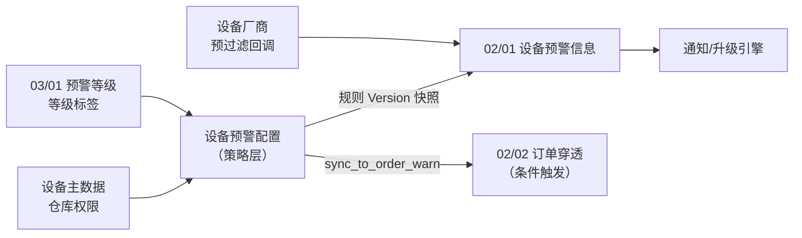
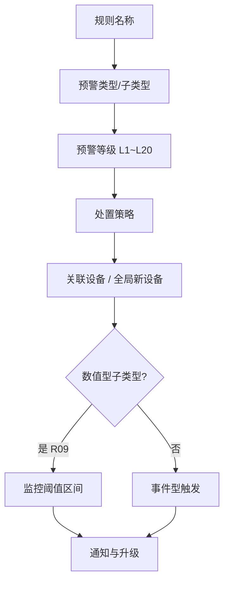
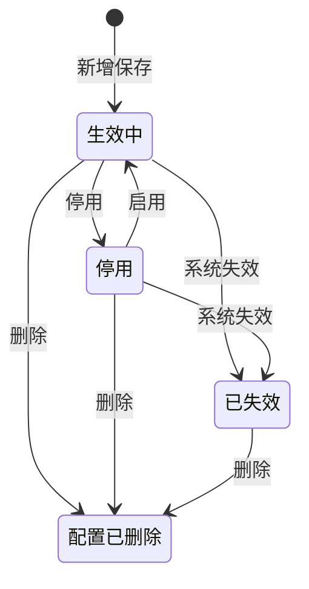

# 设备预警配置主PRD

> **文档体系（三件套为核心）**：
>
> | 层级 | 文档 | 职责 |
> | :--- | :--- | :--- |
> | **核心** | 本文（主 PRD） | 业务背景、范围、架构、**页面功能说明**、场景、状态机摘要、规则摘要、验收 |
> | **核心** | [设备预警配置字段清单](./设备预警配置字段清单.md) | 字段定义、筛选/列表/新增编辑/详情、展示顺序与控件规格 |
> | **核心** | [设备预警配置业务规则规格](./设备预警配置业务规则规格.md) | 状态机本体、R/C/P 规则、时序图、流转表 |
> | *衍生* | ASCII 线框 / Demo 文档 | 由三件套派生的可视化与原型输入，**非独立真源** |
>
> **版本**：V3.8 | 2026-09-11
> **读者**：研发工程师、测试工程师、物联网产品经理、风控架构师
> **所属模块**：03-预警配置 / 02-设备预警配置 | **菜单路径**：`预警配置 → 设备预警配置`
> **模板选型**：配置策略类（[5-2-3 配置策略类 PRD 模板](../../../../05-常用模板/需求处理/5-2-3%20(输出)配置策略类PRD模板.md)）
> **规则来源**：状态机、校验、联动与权限详见《[设备预警配置业务规则规格](./设备预警配置业务规则规格.md)》——**规则 ID 以该文件为 唯一定义来源，本文仅摘要引用**
> **字段基准**：《[设备预警配置字段清单](./设备预警配置字段清单.md)》为字段唯一定义来源
> **权限基准**：[00-全局契约与RBAC权限矩阵](../../00-全局契约与RBAC权限矩阵.md) 第四章 §1
> **跨文档引用规范**：[B-迭代需求跨文档引用口径与来源索引](../../../README.md)，本模块引用 REF-SEVERITY、REF-DEVICE、REF-WH、REF-RBAC。
>
> **衍生文档（可视化 / 原型）**：
> - **ASCII 线框**：[列表页](./设备预警配置_ASCII_列表页.md) · [新增/编辑页](./设备预警配置_ASCII_新增编辑页.md) · [详情页](./设备预警配置_ASCII_详情页.md)
> - **Demo 输入**：[列表页](./设备预警配置_Demo_列表页.md) · [新增/编辑页](./设备预警配置_Demo_新增编辑页.md) · [详情页](./设备预警配置_Demo_详情页.md)
> - **原型 DEV**：PC [`/物联网IOT与预警/预警配置/设备预警配置`](http://localhost:5173/#/物联网IOT与预警/预警配置/设备预警配置)

---

### 1. 业务背景

**设备预警配置**是物联网 IoT 板块的**策略配置中枢**，集中维护摄像头、温湿度/气体传感器、智能挂锁、人脸门禁、GPS 终端等硬件资产的异常告警与运维通知策略。

没有统一的设备预警配置：

- 各设备类型的阈值、通知对象分散维护，无法统一风控口径
- 厂商侧事件过滤策略与平台规则口径不一致，导致误报或响应延迟
- 预警等级、通知渠道、升级策略与信息侧流水脱节，无法追溯「当时按什么规则触发」
- 规则生命周期与未处理预警联动不清晰，删除/停用后仍持续推送

本模块通过**自定义预警等级绑定**（来自 03/01 预警等级）、**数值阈值与事件型触发条件**、**多渠道通知与超时升级**，在配置层完成策略定义；设备事件由厂商侧预过滤后回调，命中后由 02/01 设备预警信息承接流水，通知引擎读规则快照执行推送。

---

### 2. 功能范围

**包含范围 (In Scope)**：

- 规则列表、组合筛选（名称/类型/等级/状态/展开处置策略）、分页与导出
- 5 大类预警类型与子类型动态表单（枚举见业务规则规格 [附录 A](./设备预警配置业务规则规格.md#附录-a预警子类型权威枚举)）
- 预警等级下拉：读取当前租户 03/01 预警等级中状态为“启用”的等级，租户等级总数限制为 2~20 档；展示等级编码、名称和标签颜色，提交 `severity_level_id`；服务端校验租户归属、启用状态和等级 ID，严重度比较使用 `sort_order`。停用等级不可被新规则选中，但已有规则和流水保留等级快照（REF-SEVERITY，R10/C03）。
- 关联设备多选 / 「仅针对新设备」全局监听
- 数值阈值（温度、湿度、二氧化碳、氧气等持续型指标）：统一配置最低值与最高值，超出区间触发预警；二氧化碳示例为 `400~1500 ppm`
- **处置策略**（`disposition_mode`）：三档单选——触发即结案 / 人工解除结案 / 恢复自动结案；子类型 chip 系统推荐（R15）；**R15c** 仅 R03 白名单子类型可选恢复自动结案（见业务规则附录 A 能力矩阵）；决定 02/01 流水落账（R15b）
- 通知渠道（短信/邮件，选填）、预警对象、升级预警天数与升级对象；系统小角标在预警命中时自动更新，不可配置
- 规则新增、编辑、启用/停用、软删除、详情查看
- 规则生命周期三态（生效中/停用/已失效）及与规则版本、流水的联动

**排除范围 (Out of Scope)**：

- 审批流（保存即生效，无待审核态）——配置策略类单据不设审核
- 规则版本回滚与历史版本对比——6.2 仅 Version 乐观锁，不提供版本树
- 批量导入/导出规则模板——一期不支持
- 预警流水处置（解除、备注、图片）——归属 [02/01 设备预警信息](../../02-预警信息/01设备预警信息/设备预警信息主PRD.md)
- 预警等级字典维护——归属 [03/01 预警等级](../01预警等级/预警等级主PRD.md)
- 订单侧预警配置——归属 [03/03 订单预警配置](../03订单预警配置/订单预警配置主PRD.md)
- 出库/全流程熔断（OPT-FUSE-01）——后续迭代
- 移动端页面——6.2 不展示本模块移动端页面，配置与规则维护仅在 PC 端完成

---

### 3. 模块定位

#### 3.1 在系统中的位置

| 项目 | 内容 |
| :--- | :--- |
| 模块层级 | **配置策略层**（非业务订单层、非执行流水层） |
| 核心职责 | 定义「哪些设备、何种事件、达到什么条件、以何等级、通知谁、如何升级」 |
| 配置来源 | 用户手动新增/编辑（6.2 唯一方式） |
| 上游依赖 | **03/01 预警等级**：读取当前租户启用等级，保存 `severity_level_id`，按 `sort_order` 比较严重度；**设备主数据**：读取可选设备的设备 ID、设备分类、系统内名称和绑定位置，具体字段按设备类型基准清单确定；**仓库档案**：读取仓库、库房、分区 ID 及有效状态；**RBAC 与仓库数据权限**：列表、详情和写操作均校验 IoT 菜单权限及关联仓库数据权限。来源：[跨文档引用口径与来源索引](../../../README.md) REF-SEVERITY/REF-DEVICE/REF-WH/REF-RBAC。 |
| 下游影响 | **保存、编辑或启用**：写入规则主数据并按 `规则 ID + Version` 递增规则版本；生效中规则对后续设备回调生效，停用/已失效/软删除规则不再匹配新事件。**命中事件**：设备厂商侧已完成事件预过滤与去抖，平台直接接收设备回调；由 02/01 写入 `iot_event_ledger`，固化规则 Version、阈值、预警等级（ID/编码/名称/颜色/`sort_order`）及通知/升级对象快照，生成设备预警流水。**配置变更**：编辑保存后 Version+1，**不回写**既有未处理预警，等待下一次设备回调按最新规则版本落账；历史流水完整保留触发时刻规则快照。**通知与穿透**：首次命中按触发快照发送通知，超时升级按首次预警时间计时；等级 `sync_to_order_warn=true` 且空间匹配在押订单时，向 02/02 投影订单级物联穿透告警。**停用/失效/删除**：停用或系统失效不回写未处理流水；软删除将关联未处理流水置为“已作废”并取消升级任务。通知或事件投递失败进入日志/补偿，不回滚已落账流水。来源：[设备预警配置业务规则规格](./设备预警配置业务规则规格.md) C01~C08、[跨文档引用口径与来源索引](../../../README.md) REF-SEVERITY/REF-NOTIFY。 |
| 实体关系 | 一条规则可关联**多台设备**（N:M）；一设备 + 一子类型租户内**唯一**（1:1 有效规则） |

#### 3.2 系统链路图

#### 3.3 实体关系说明

| 关系 | 说明 |
| :--- | :--- |
| 设备预警配置 : 预警等级 | **N:1**（多条规则可绑定同一等级；等级来自 03/01 字典） |
| 设备预警配置 : 设备 | **N:M**（一条规则多设备；全局新设备规则不绑具体 ID） |
| 设备预警配置 : 设备预警信息 | **1:N**（一条规则可产生多条预警流水） |
| 设备 + 子类型 : 规则 | **1:1**（租户内有效规则唯一，见 R04） |

#### 3.4 表单配置模型

---

## 4. 页面功能说明

> 本节描述**做什么、怎么交互**；字段/控件见《[字段清单](./设备预警配置字段清单.md)》；子类型枚举与处置矩阵见《[业务规则规格](./设备预警配置业务规则规格.md)》附录 A。

### 4.1 PC 列表页

| 项目 | 说明 |
| :--- | :--- |
| 页面目标 | 筛选、查看设备预警规则，进入新增/编辑/详情 |
| 页面路径 | `/物联网IOT与预警/预警配置/设备预警配置` |
| 骨架结构 | 页头 + 筛选 Card + 数据表格 + 分页 |

**筛选区**：默认行规则名称、预警类型（大类+子类型级联多选）、预警等级、状态；展开行处置策略（三档多选）。Header 集成「+ 新增设备规则」。

**数据表格**：

- 默认排序：更新时间 DESC；分页 10/20/50
- 列：规则名称、预警类型、处置策略、预警等级、关联设备范围、触发条件摘要、状态、创建/更新信息、操作
- 数值型触发条件展示最低/最高边界（如 CO₂ `400~1500 ppm`）

**行操作**：

| 状态 | 操作列 |
| :--- | :--- |
| 生效中 | 编辑 / 停用 / 删除 / 详情 |
| 停用 | 编辑 / 启用 / 删除 / 详情 |
| 已失效 | 删除 / 详情 |

列表支持导出；启停不在表单内改，仅列表/详情独立动作。

### 4.2 PC 新增/编辑页

| 项目 | 说明 |
| :--- | :--- |
| 新增路径 | `/物联网IOT与预警/预警配置/设备预警配置/新增` |
| 编辑路径 | `/物联网IOT与预警/预警配置/设备预警配置/编辑/:id` |
| 骨架结构 | 页头 → 基本信息 → 关联设备与触发条件 → 通知与升级策略 |

**页头**：返回/取消（Dirty 确认）+「保存并生效」（无审核流、无状态下拉）。

**新增 vs 编辑**：

| 对比项 | 新增 | 编辑 |
| :--- | :--- | :--- |
| 规则名称/类型/子类型 | 可填 | **Readonly**（R06） |
| 已失效规则 | — | **不可进入编辑** |
| Version | 不展示 | 只读展示，提交携带（R07）；保存后 Version+1（C08） |

**表单分区要点**：

| 分区 | 交互要点 |
| :--- | :--- |
| 基本信息 | 规则名称、5 大类+子类型（**R14** 上线类互斥）、03/01 等级、`disposition_mode` 三档 RadioCard（R15/R15c） |
| 关联设备 | 设备多选 **或** 「仅针对新设备」全局监听（R05）；选上线类时隐藏设备选择与升级（R13/R15a） |
| 触发条件 | 数值型子类型展示最低/最高阈值（R09）；事件型无阈值 |
| 通知与升级 | 短信/邮件（选填）、预警对象、升级天数与对象；`RECORD_ONLY` 隐藏升级 |

> **平台不再配置防抖**（V3.7）；厂商预过滤后回调；编辑保存不回写未处理流水（C08）。

### 4.3 PC 详情页

| 项目 | 说明 |
| :--- | :--- |
| 页面路径 | `/物联网IOT与预警/预警配置/设备预警配置/详情/:id` |
| 能力 | 只读展示规则快照、Version、审计信息；生效中/停用可跳转编辑；已失效仅可删除 |

### 4.4 移动端（6.2）

本模块不展示移动端页面，配置与规则维护仅在 PC 端完成。

---

### 5. 功能清单

| 功能编号 | 功能名称 | 适用角色 | PC 端 | 移动端 | 关键控制（规则引用） |
| :--- | :--- | :--- | :--- | :--- | :--- |
| RUL-01 | 规则列表与筛选 | IoT 查看权限 | 筛选/分页/导出 | 只读列表 | P02 仓库过滤 |
| RUL-02 | 新增规则 | IoT 写权限 | 独立页面表单 | — | R03~R05 唯一性；R14 上线互斥 |
| RUL-03 | 编辑规则 | IoT 写权限 | 独立页面表单 | — | R06 不可变字段；R07 乐观锁 |
| RUL-04 | 启用/停用 | IoT 写权限 | 列表开关 | — | 第四章 流转表；已失效不可启用 |
| RUL-05 | 删除规则 | IoT 删除权限 | 二次确认 | — | C01 流水置无效；C04 停升级 |
| RUL-06 | 查看详情 | IoT 查看权限 | 只读+审计 | 只读详情 | — |
| RUL-07 | 全局新设备监听 | IoT 写权限 | 勾选开关 | — | R05 每大类限 1 条生效 |
| RUL-08 | 规则版本同步 | 系统 | 后台任务 | — | C03 版本递增/停匹配 |

---

### 6. 业务场景

| 场景ID | 场景 | 类型 | 说明 |
| :--- | :--- | :--- | :--- |
| S01 | 新增持续型规则并立即生效 | **主流程** | 选温湿度+温度异常 → 配阈值区间 → 保存 → 状态=生效中 → 等待厂商回调命中 |
| S02 | 新增瞬态破坏规则 | **主流程** | 选智能挂锁+剪杆 → 保存 → 厂商回调事件即时触发流水 |
| S03 | 全局新设备上线通知 | **主流程** | 单选监控设备上线（R14）+勾选仅新设备 → 隐藏设备选择与升级预警（R13）→ 仅配通知渠道与预警对象 → 后续新设备入库即通知 |
| S09 | 设备上线与其他子类型混选 | **异常** | 已选温度异常后再点监控设备上线 → 前端自动取消温度异常并单选上线类 → 保存若仍混选则 R14 阻断 |
| S04 | 停用后恢复 | **支线** | 生效中 → 停用 → 停止匹配新回调 → 再启用 → 恢复匹配；未处理流水不变 |
| S05 | 编辑阈值版本递增 | **支线** | 生效中规则修改温度或二氧化碳最低/最高值 → Version 递增 → 不回写未处理流水；下次设备回调按新规则落账 |
| S06 | 删除规则联动流水 | **支线** | 删除含 3 条未处理预警的规则 → 流水置「已作废」→ 升级终止 |
| S07 | 关联设备全移除自动失效 | **异常** | 规则关联设备均被移除 → 系统自动已失效 → 不可编辑/不可启用 |
| S08 | 并发编辑冲突 | **异常** | 两人同时编辑 → 后提交者 R07 乐观锁失败 → 提示刷新 |

---

### 7. 状态机

> **完整定义**（状态枚举、流转表、动作矩阵）见《[设备预警配置业务规则规格](./设备预警配置业务规则规格.md)》第二至五章。以下为摘要。

#### 7.1 规则状态

| 状态 | 含义 | 是否终态 |
| :--- | :--- | :---: |
| 生效中 | 对设备回调生效中，可编辑/停用/删除 | 否 |
| 停用 | 人工暂停，可编辑/启用/删除 | 否 |
| 已失效 | 系统自动失效，不可编辑/不可启用，可删除 | **是** |
| 配置已删除 | 软删除，列表不可见 | **是** |

#### 7.2 状态机图（摘要）

#### 7.3 动作能力矩阵（摘要）

| 动作 | 生效中 | 停用 | 已失效 |
| :--- | :---: | :---: | :---: |
| 编辑 | ✅ | ✅ | ❌ |
| 停用 | ✅ | ❌ | ❌ |
| 启用 | ❌ | ✅ | ❌ |
| 删除 | ✅ | ✅ | ✅ |
| 查看 | ✅ | ✅ | ✅ |

---

### 8. 核心业务规则

> 规则本体见业务规则规格；此处仅列高风险摘要。

#### 8.1 唯一性与编辑锁定

| 规则ID | 规则摘要 |
| :--- | :--- |
| R03 | 规则名称租户内唯一，≤50 字 |
| R04 | 同一设备 + 同一子类型，租户内仅 1 条有效规则 |
| R05 | 全局新设备规则：每预警大类仅 1 条生效中 |
| R14 | 设备上线子类型与同规则其他子类型互斥；全局新设备时子类型仅能单选上线类 |
| R15 | 处置策略三档必填；系统推荐 + 用户可配；R15a 禁升级；R15b 落账联动；**R15c** AUTO_RECOVER 仅 R03 白名单（5 大类附录矩阵） |
| R06 | 编辑时名称/类型/子类型不可改 |
| R07 | 编辑须携带 Version 乐观锁 |

#### 8.2 生命周期与版本联动

| 规则ID | 规则摘要 |
| :--- | :--- |
| C01 | **删除** → 未处理流水置「已作废」 |
| C02 | **停用/已失效** → 停止匹配新回调，流水不自动置无效 |
| C03 | **生效中** → 规则 Version 生效；停用/失效/删除 → 停止匹配 |
| C08 | **配置变更** → Version+1；不回写未处理流水；新回调按最新 Version 落账；历史流水保留触发快照 |

#### 8.3 停用 vs 删除 vs 已失效

详见业务规则规格 [第6.3节](./设备预警配置业务规则规格.md#63-停用-vs-删除-vs-已失效易混点)。

---

### 9. 权限设计

#### 9.1 数据可见范围

| 角色 | 可见数据范围 | 说明 |
| :--- | :--- | :--- |
| R-SYS-ADMIN | 本租户全部规则 | 含删除权限 |
| R-IOT-OPS | 管辖仓库下设备关联的规则 | 按 P02 仓库过滤 |
| R-RISK-MGR / R-RISK-OFF | 本租户规则（只读） | 无写操作 |
| R-VIEWER | 本租户规则（只读） | 审计查看 |

#### 9.2 操作权限矩阵

| 操作 | R-SYS-ADMIN | R-IOT-OPS | R-RISK-MGR | R-RISK-OFF | R-VIEWER |
| :--- | :---: | :---: | :---: | :---: | :---: |
| 查看 | ✅ | ✅ | ✅ | ✅ | ✅ |
| 新增 | ✅ | ✅ | ❌ | ❌ | ❌ |
| 编辑 | ✅ | ✅ | ❌ | ❌ | ❌ |
| 启用/停用 | ✅ | ✅ | ❌ | ❌ | ❌ |
| 删除 | ✅ | ❌ | ❌ | ❌ | ❌ |
| 导出 | ✅ | ✅ | ✅ | ✅ | ✅ |

> 以 [00-全局契约与RBAC权限矩阵](../../00-全局契约与RBAC权限矩阵.md) 为准。

---

### 10. 边界与异常处理

#### 10.1 并发控制

| 场景 | 处理方式 |
| :--- | :--- |
| 两人同时编辑同一规则 | R07 乐观锁，后提交提示刷新 |
| 保存与停用并发 | 数据库乐观锁，失败提示状态已变更 |

#### 10.2 幂等操作约束

| 操作 | 幂等规则 |
| :--- | :--- |
| 规则版本写入 | 规则 ID + Version 幂等，同一 Version 重复写入不重复递增 |
| 删除 | 重复删除返回「规则已删除」 |

#### 10.3 上下游不一致

| 场景 | 处理方式 |
| :--- | :--- |
| 规则版本写入失败 | 记录日志+告警，支持补偿重试 |
| 03/01 等级被停用，规则仍引用 | 规则继续生效；编辑时须重选启用等级 |
| 设备全移除 | C06 自动置已失效 |

---

### 11. 验收重点

> 验收标准写「输入条件 → 预期结果」格式；完整规则见业务规则规格。

| # | 验收项 | 输入条件 | 预期结果 |
| :--- | :--- | :--- | :--- |
| V01 | 等级下拉 | 03/01 配置 L4 名称与颜色 | 下拉与列表标签正确反显 |
| V02 | 全局新设备 | 单选设备上线+勾选仅新设备 | 设备选择隐藏；后续新设备入库触发通知 |
| V13 | 上线子类型互斥 | 同规则混选「监控设备上线」与「温度异常」 | 保存阻断，提示「设备上线通知需单独配置，不可与其他预警子类型组合」 |
| V03 | 设备子类型唯一 | 设备 A 已有温度异常规则，再建同组合 | 保存阻断，提示已存在同类型规则 |
| V04 | 删除流水联动 | 规则有 3 条未处理预警，执行删除 | 3 条置「已作废」，升级终止 |
| V05 | 停用不置无效 | 生效中规则停用 | 状态=停用，未处理流水不变 |
| V06 | 已失效不可启用 | 已失效规则点启用 | 入口不可用或提示须删后重建 |
| V07 | 编辑不可变字段 | 编辑已有规则 | 名称/类型/子类型置灰不可改 |
| V08 | 乐观锁冲突 | 两人同时编辑，先后提交 | 后者提示「数据已被他人修改，请刷新重试」 |
| V09 | 配置变更版本递增 | 生效中规则改阈值保存 | Version+1；未处理流水不变；新回调按新 Version 落账 |
| V10 | 历史快照不变 | 规则已编辑且 Version 递增 | 既有流水仍展示触发时刻快照 |
| V11 | 仓库权限 | 无仓库权限的设备 | 不可选或保存阻断 |
| V12 | 二氧化碳双边阈值 | 选择「二氧化碳异常」，填写最低 400 ppm、最高 1500 ppm | 新增/编辑页展示两个输入框；列表展示 `二氧化碳 < 400 ppm 或 > 1500 ppm`；关联设备预警详情保留同一阈值快照 |

---

### 修订记录

| 日期 | 版本 | 变更摘要 |
| :--- | :---: | :--- |
| 2026-08-19 | V2.0 | 初版 6.2 合流配置 |
| 2026-08-20 | V2.1 | 合并功能清单；补三态状态机 |
| 2026-08-20 | **V3.0** | **6.2 标杆重构**：对齐业务单据 PRD 章节（1~10）；排除范围 (Out of Scope)；业务场景 S01~S08；权限/边界/验收 V01~V12；状态机与规则下沉至业务规则规格 唯一定义来源；删重复 第4章 与已合并业务流程引用 |
| 2026-09-02 | **V3.1** | 新增 R14 设备上线子类型互斥；补 S09/V13 验收场景 |
| 2026-09-07 | **V3.2** | 新增 disposition_mode 处置策略三档；列表列与展开筛选；与 02/01 落账联动（R15） |
| 2026-09-08 | **V3.3** | 展示词表：配置侧结案路径 + 信息侧待处置/已结案/已作废 |
| 2026-09-08 | **V3.7** | **移除平台侧防抖配置**（R01/R02/R02a）；事件由厂商预过滤回调；新增 C08 配置变更版本递增不回写未处理流水；历史流水保留触发快照 |
| 2026-09-11 | **V3.9** | **二氧化碳阈值由单边上限调整为最低值 + 最高值**；同步新增/编辑、列表、详情及设备预警快照口径 |
| 2026-09-11 | **V3.8** | **对齐三件套标杆**：补 §4 页面功能说明；三件套/衍生文头；章节重编号 |
