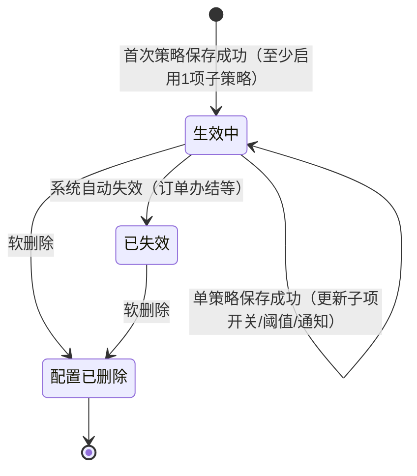
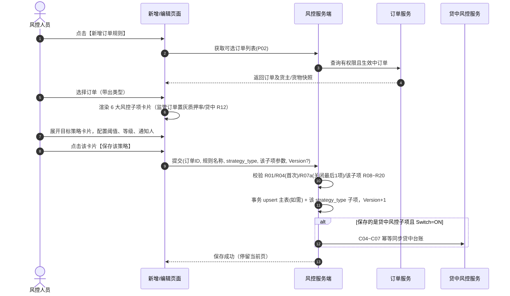
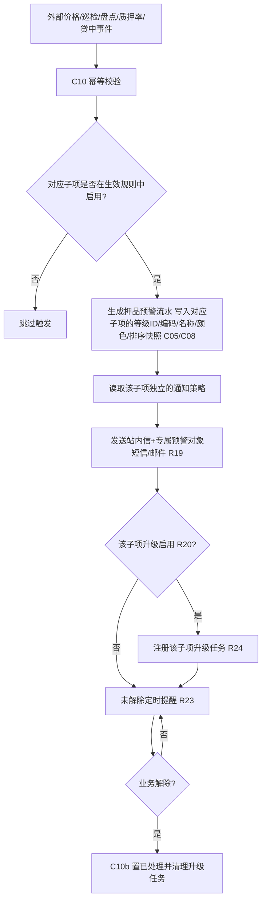

# 订单预警配置 业务规则规格

> **文档定位**：订单预警配置状态机、动作约束、校验规则、触发联动、权限与跨模块流程的**唯一定义来源**。主 PRD、字段清单、ASCII 线框只引用本文件规则 ID 与流程章节，不重复定义规则本体。
>
> **模块类型**：配置策略类（范式 A 裁剪版——有生命周期状态机，无审批流，**无停用态**）
>
> **参考文档**：[《订单预警配置主PRD》](./订单预警配置主PRD.md)、[《订单预警配置字段清单》](./订单预警配置字段清单.md)、[《00-全局契约与RBAC权限矩阵》](../../00-全局契约与RBAC权限矩阵.md)第四章 §1、[03/01 预警等级业务规则规格](../01预警等级/预警等级业务规则规格.md)、[订单预警与通知体系协同规范](../../02-预警信息/协同规范/通知模板.md)
>
> **跨文档引用规范**：[B-迭代需求跨文档引用口径与来源索引](../../../README.md)。本文件定义订单规则状态、校验、联动和通知规则；外部依赖摘要按 REF-SEVERITY、REF-ORDER、REF-RBAC、REF-NOTIFY 展开。
>
> **版本**：V3.3 | 2026-09-01（策略子项逐条独立保存）
>
> **原型与 Demo 导航**：
> - **原型 DEV 路径**：PC端 [`/预警配置/订单预警配置`](http://localhost:5173/预警配置/订单预警配置)（原型右下角可切换「标注模式」查看 DEV 说明）
> - **原型交互规范**：[订单预警配置_Demo_列表页](./订单预警配置_Demo_列表页.md) · [订单预警配置_Demo_新增编辑页](./订单预警配置_Demo_新增编辑页.md) · [订单预警配置_Demo_详情页](./订单预警配置_Demo_详情页.md)
> - **ASCII 线框图**：[订单预警配置_ASCII_列表页](./订单预警配置_ASCII_列表页.md) · [订单预警配置_ASCII_新增编辑页](./订单预警配置_ASCII_新增编辑页.md) · [订单预警配置_ASCII_详情页](./订单预警配置_ASCII_详情页.md)

---

## 一、能力定位

### 1.1 统一主子数据模型（唯一定义来源）

03/03 的页面卡片对应策略子项，不对应多条订单主规则：

```text
order_rule_config（综合规则主表，订单维度 1:1）
  └─ order_rule_strategy（策略子项表，strategy_type 维度 1:N，最多 6 条）
       ├─ strategy_params（该子项的阈值/明细 JSON）
       ├─ severity_level_id（普通子项）
       ├─ margin_call_severity_level_id / close_out_severity_level_id（LTV 子项）
       └─ notify_channels / notify_user_ids / upgrade_days / upgrade_user_ids
```

模型约束：

1. `tenant_id + order_id` 仅允许一条 `ACTIVE` 综合规则；`rule_id + strategy_type` 唯一。
2. 等级外键统一使用 04 的 `severity_level_id`；触发与 LTV 双等级比较统一读取 `sort_order`，不比较 `L1/L5` 或其他编码字符串。
3. 保存策略时由服务端根据等级 ID 回填 `severity_code`、`severity_name`、`severity_color`、`sort_order` 快照；预警流水再次固化同一组快照。
4. 未启用策略不监听、不触发、不校验内部参数；关闭策略只影响该策略产生的未处理流水。
5. 主规则 Version 覆盖主表和所有子项；**每次单策略保存**主表 Version+1，主表、当前子项、贷中同步台账与审计记录必须在同一事务或可靠消息链路中完成。
6. **保存粒度**：前端/API 按 `strategy_type` 逐条 upsert 策略子项，**不支持**整页 6 条策略一次性提交；新增页首次策略保存时一并创建主表。

| 项目 | 内容 |
| :--- | :--- |
| **模块层级** | 配置策略层（订单级综合金融风控策略包，非业务单据层） |
| **菜单路径** | `预警配置 → 订单预警配置` |
| **核心职责** | 维护订单维度的综合风控策略包；支持单规则内同时激活并独立配置 6 类商业风控子项（超时、跌价、盘点、巡检、抵质押率、贷中风控）；各子项配置专属阈值、独立绑定 03/01 动态等级、独立通知渠道与超时升级；驱动对应风控判定引擎 |
| **配置来源** | 用户手动新增/编辑（6.2 唯一方式，支持一站式多策略并存） |
| **上游依赖** | **03/01 预警等级**：读取启用等级并提交 `severity_level_id`，严重度比较按 `sort_order`；**抵/质押与监管订单**：提供订单类型、生命周期和货权关系；**盘点/巡检任务**：提供任务完成状态、时间和责任人；**外部市价**：提供价格下跌计算输入；**智风控平台**：提供贷中模型结果；**订单数据权限**：限制订单列表、选择器、详情、编辑和删除。来源：REF-SEVERITY、REF-ORDER、REF-RBAC。 |
| **下游影响** | **规则写入与引擎**：保存/编辑写入综合规则、启用子项和 `Version`，按规则 ID、子项和版本幂等同步各风控判定引擎；关闭子项只影响后续事件。**订单流水**：命中后向 [02/02 押品预警信息](../../02-预警信息/02押品预警信息/押品预警信息主PRD.md) 写入订单 ID、订单类型、预警类型、命中值/阈值、触发时间、`warn_source=ORDER_CONFIG`、规则版本、03/01 等级 ID/编码/名称/颜色/`sort_order` 及通知/升级策略快照；按 R03 幂等，重复事件不重复生成。**通知与贷中**：商业类继承触发时通知对象和升级策略；贷中子项命中时按 C04~C07 幂等同步 [02/03 贷中风控管理](../../02-预警信息/03贷中风控管理/贷中风控管理主PRD.md) 台账。**关闭/失效/删除**：子项关闭仅将该子项未处理流水置无效；订单办结或整条规则失效/软删除时按 C01/C11 置相关未处理流水无效并停止升级，历史快照不回写；通知或台账同步失败进入补偿，不回滚已生成押品流水。来源：[订单预警配置主 PRD](./订单预警配置主PRD.md) 第 3.1 节、C01/C04~C07/C11、R01~R04、N01。 |
| **审核流** | **无**——保存即生效（状态=`生效中`），核心路径为「新增/编辑 → 生效中」 |
| **与信息侧边界** | 本模块 `状态`=规则生命周期；信息侧 `预警状态`=流水处置状态，语义不同（见字段清单 第五章） |
| **6.2 不设停用态** | 订单侧规则无人工启停；生命周期仅 **生效中 / 已失效 / 配置已删除** 三态（子项支持独立启用开关） |

---

## 二、状态定义

| 状态名称 | 枚举值 | 业务含义 | 是否终态 | 进入条件 | 离开条件 |
| :--- | :--- | :--- | :---: | :--- | :--- |
| 生效中 | `ACTIVE` | 规则正常运行，判定引擎监听已启用的风控子项，可触发新押品预警 | 否 | 新增保存成功 | 系统自动失效；软删除 |
| 已失效 | `INACTIVE` | 系统自动失效（订单办结/全部子项失效等），不可编辑，可删除 | **是** | 订单解押/出库完毕；租户策略变更等 | 软删除 |
| 配置已删除 | `DELETED` | 软删除，列表不可见，历史审计保留 | **是** | 人工删除确认 | — |

**设计说明**：

- 配置策略类**不设**草稿态、待审核态、**停用态**；**首次策略保存**一次性写入 `生效中`（新增页无页级统一保存）。
- 状态变更**禁止**通过表单下拉选择框 (Dropdown) 修改，必须通过独立动作（删除）或系统任务触发。
- `已失效` 不可通过编辑恢复，须删除后重建新规则。
- **子项独立开关**：规则内部各策略子项具备独立的启用开关 `is_enabled`，关闭某子项不改变整条规则的 `生效中` 状态。

---

## 三、状态流转图



---

## 四、状态流转表

> 前置条件须**全部**满足才允许触发动作；「后置影响」列出除状态变更以外的所有级联影响。

| 当前状态 | 动作 | 前置条件 | 结果状态 | 二次确认 | 后置影响 | 失败处理 |
| :--- | :--- | :--- | :--- | :--- | :--- | :--- |
| — | 新增（首次策略保存） | R01~R04 基础校验通过；当前子项 Switch=ON 且 R08~R20 校验通过；P01~P03 权限通过 | 生效中 | 无 | ① 写入规则主数据 Version=1 及该子项明细；② 启用了贷中风控时触发 C04~C07 幂等同步台账；③ 激活该子项引擎监听 | 轻提示 (Toast)：「{策略名称}保存失败，{字段名/规则}不满足条件」 |
| 生效中 | 单策略保存 | 同新增子项校验；携带 Version；R06 不可变字段未变更 | 生效中 | 无 | ① Version+1；② 当前子项热更新；③ 若关闭了原启用的该子项，触发 C01a 该子项流水置无效；④ 贷中状态联动更新 | 轻提示 (Toast)：「数据已被他人修改，请刷新重试」（R07 冲突） |
| 生效中 | 单策略保存（关闭最后 1 项） | 当前子项 Switch=OFF 且为规则内最后 1 项已启用策略 | — | — | **不允许** | 轻提示 (Toast)：「请至少启用一项预警策略」（R07a） |
| 生效中 | 编辑保存（整页） | — | — | — | **已废弃**——不提供整页统一保存入口 | — |
| 已失效 | 编辑保存 | — | — | — | **不允许** | 轻提示 (Toast)：「规则已失效，不可编辑，请删除后重建」 |
| 生效中 / 已失效 | 删除 | 拥有删除权限（P04）；订单数据权限 | 配置已删除 | 「删除后不可恢复，关联未处理押品预警将置为无效，确认删除？」 | ① 软删除 is_deleted=1；② C01 关联该规则的所有未处理押品预警置无效；③ C02 停止所有升级任务 | — |
| 生效中 | （触发）系统失效 | 订单解押/出库完毕；租户策略变更 | 已失效 | 系统自动，无需确认 | ① 停止所有子项新触发（C03）；② 不可编辑；③ 未处理押品预警**不**自动置无效 | — |

---

## 五、动作能力矩阵

> ✅ = 允许；❌ = 不允许（不展示入口）

| 动作 | 生效中 | 已失效 | 配置已删除 |
| :--- | :---: | :---: | :---: |
| 查看列表/详情 | ✅ | ✅ | ❌ |
| 新增 | ✅ | ✅ | ✅ |
| 编辑 | ✅ | ❌ | ❌ |
| 删除（软删） | ✅ | ✅ | ❌ |
| 导出 | ✅ | ✅ | ❌ |

> **6.2 无整单启用/停用动作**——与 03/02 设备预警配置不同，订单侧不设整单人工启停；精细化控制由规则内部各策略子项开关实现。

---

## 六、校验规则

### 6.1 基础与唯一性

| 规则ID | 规则 | 校验时机 | 违反处理 |
| :--- | :--- | :--- | :--- |
| **R01** | 规则名称必填，租户内唯一，长度 ≤50 字符 | 保存/编辑 | 阻断，提示「规则名称已存在」或「规则名称不可为空」 |
| **R02** | 订单号、订单类型、货主、货物由订单主数据带出，用户不可篡改 | 保存/编辑 | 服务端拒绝变更 |
| **R03** | 新增订单下拉仅返回有权限且业务状态有效的订单（抵/质押中或监管中） | 新增 | 过滤或阻断 |
| **R04** | **订单唯一性**：同一订单在租户内仅允许存在 **1 条**有效综合预警规则（ACTIVE，不含已删除）；若该订单已存在规则，新增页阻断并引导至编辑 | 保存 | 阻断，提示「该订单已配置预警规则，请前往编辑」 |
| **R05** | **6.2 禁止**在本模块配置 6.1 硬件类预警（图像识别、物联设备、智能挂锁、人脸门禁、GPS）；接口返回明确错误码并引导至 [03/02设备预警配置](../02设备预警配置/设备预警配置主PRD.md) | 保存 | 阻断，提示改配设备规则 |
| **R06** | 编辑时【规则名称】【关联订单】不可修改（置灰）；各风控子项的启用开关、阈值、等级、通知/升级对象可自由编辑 | 编辑 | 服务端拒绝变更不可变字段 |
| **R07** | 提交编辑须携带 `Version`，乐观锁校验 | 编辑 | 阻断，提示「数据已被他人修改，请刷新重试」 |
| **R07a** | **多策略组合必填校验**：整条规则必须**至少开启 1 项**预警子策略；未开启的子项不校验内部参数；**校验时机**：单策略保存且 Switch=OFF 时，若其为最后 1 项已启用策略则阻断 | 单策略保存 | 阻断，提示「请至少启用一项预警策略」 |
| **R12** | **订单类型限制**：抵/质押订单可启用全部 6 类；监管订单强制禁用/隐藏「抵/质押率异常」与「贷中风控预警」两类子项卡片，非法传参服务端阻断 | 保存 | 阻断，提示「监管订单不支持抵/质押率及贷中风控配置」 |

### 6.2 六类风控子项动态配置与独立等级

> 每个启用的风控子项卡片必须独立选择预警等级（读 03/01 启用档），并配置专属触发参数。

| 预警子项 | 核心配置项 | 独立等级规则 | 规则ID |
| :--- | :--- | :--- | :--- |
| **解抵/质押/监管超时** | 按二维码/批次逐条配置天数；至少一条；起算为实际成功时间 | 必选独立绑定一个 03/01 启用等级 | R10, R14 |
| **价格下跌** | 跌幅比例（%）；跌幅**严格大于**配置值触发；无估值监管单跳过 | 必选独立绑定一个 03/01 启用等级 | R10, R15 |
| **盘点异常** | 开关勾选即启用；盘点模块判定账实差异时触发 | 必选独立绑定一个 03/01 启用等级 | R10, R16 |
| **巡检异常** | 多行巡检人+独立周期（天）；超期未巡检分别触发；与盘点解耦 | 必选独立绑定一个 03/01 启用等级 | R10, R17 |
| **抵/质押率异常** | 补仓线/平仓线双阈值 + 双等级 + 多选解除方式（**仅抵/质押订单**） | 补仓线/平仓线各必选独立等级 | R08~R13c |
| **贷中风控预警** | 单选智风控已上架模型（**仅抵/质押订单**）；模型停用子项自动失效 | 必选独立绑定一个 03/01 启用等级 | R10, R18 |

| 规则ID | 规则 | 校验时机 | 违反处理 |
| :--- | :--- | :--- | :--- |
| **R10** | 保存某启用策略子项（除抵/质押率外），其【预警等级】必选（读 03/01 **启用**项） | 单策略保存 | 阻断，提示「请选择{子项名称}的预警等级」 |
| **R14** | 解抵/质押/监管超时：保存且 Switch=ON 后至少配置一条二维码/批次超时天数（>0 整数） | 单策略保存 | 阻断，提示「请至少配置一条二维码超时天数」 |
| **R15** | 价格下跌：保存且 Switch=ON 后比例必须 >0 且 ≤100% | 单策略保存 | 阻断，提示「价格下跌比例须在 0%~100% 之间」 |
| **R16** | 盘点异常：保存且 Switch=ON 后即生效监听 | 单策略保存 | — |
| **R17** | 巡检异常：保存且 Switch=ON 后至少添加一行巡检人与巡检周期（>0 整数） | 单策略保存 | 阻断，提示「请至少配置一组巡检人与周期」 |
| **R18** | 贷中风控：保存且 Switch=ON 后风控模型产品必选 | 单策略保存 | 阻断，提示「请选择智风控模型产品」 |

### 6.3 抵/质押率双阈值双等级规则

| 规则ID | 规则 | 校验时机 | 违反处理 |
| :--- | :--- | :--- | :--- |
| **R08** | 启用后，补仓线、平仓线阈值均必填；支持两位小数；**严格大于**阈值才命中 | 保存/触发 | 保存阻断 / 无法计算不触发 |
| **R09** | 平仓线须**严格高于**补仓线；区间不得交集 | 保存 | 阻断，提示「平仓线必须高于补仓线」 |
| **R10a** | 补仓线预警等级、平仓线预警等级各必选；两者均从当前租户 03/01 预警等级的“启用”项中选择，提交 `margin_call_severity_level_id` / `close_out_severity_level_id`，服务端校验租户归属、启用状态和等级 ID | 保存 | 阻断，提示「请配置补仓线/平仓线预警等级」 |
| **R11** | 平仓线预警等级严重度 `sort_order` 须 ≥ 补仓线预警等级 `sort_order` | 保存 | 阻断，提示「平仓线预警等级不得低于补仓线」 |
| **R12a** | 每组解除方式必选，可多选补仓/平仓/部分结清 | 保存 | 阻断，提示「请选择解除方式」 |
| **R13** | LTV = 贷款余额 / 货物当前价值；无法计算不触发 | 触发 | 跳过 |
| **R13a** | 命中补仓线取「补仓线预警等级」；命中平仓线取「平仓线预警等级」 | 触发 | — |
| **R13b** | 同一订单+抵/质押率异常仅一条未处理记录；从补仓升级到平仓时**同记录升级**等级与内容 | 触发 | — |
| **R13c** | 触发快照保存命中线、命中线等级、LTV、贷款余额、货值 | 触发 | — |

### 6.4 独立通知与超时升级规则

> 为防止告警骚扰，每个启用的策略子项均支持**独立配置专属预警对象与升级策略**。

| 规则ID | 规则 | 校验时机 | 违反处理 |
| :--- | :--- | :--- | :--- |
| **R19** | 保存某 Switch=ON 子项的【预警对象】（首次通知接收人）必填；通知渠道选填（站内信默认勾选，邮件/短信/Webhook可选） | 单策略保存 | 阻断，提示「请配置{子项名称}的预警对象」 |
| **R20** | 保存某子项时升级开关独立：开启时升级天数 >0 且【升级预警对象】必填；关闭时不校验 | 单策略保存 | 阻断，提示「请配置{子项名称}的升级天数与对象」 |
| **R21** | 发送前校验账号启用；停用账号跳过并记录审计 | 通知发送 | 跳过并审计 |
| **R22** | 预警对象变更不生成新预警，仅影响后续通知 | 编辑后 | — |
| **R23** | 即时通知 + 未解除定时提醒；以最新有效未处理预警为依据 | 通知引擎 | — |
| **R24** | 升级以该轮次首次触发时间为起点；达天数且未解除则触发升级通知 | 升级引擎 | — |
| **R25** | 抵/质押率升级通知使用首次触发快照数值 | 升级引擎 | — |
| **R26** | 通知模板须含对应子项独立的等级 ID、编码、名称和排序标签（见协同规范） | 通知引擎 | — |

### 6.5 删除 vs 已失效 vs 子项关闭

| 维度 | 整单删除（软删） | 整单已失效（系统） | 子项独立关闭（编辑） |
| :--- | :--- | :--- | :--- |
| **触发方** | 人工删除按钮 | 系统任务（订单办结等） | 人工编辑表单关闭某子项 开关 (Switch) |
| **规则状态** | 置 `DELETED` | 置 `INACTIVE` | 规则保持 `ACTIVE`，子项置 `is_enabled=0` |
| **引擎监听** | 停止所有子项监听 | 停止所有子项监听 | 仅停止该子项监听，其余正常 |
| **未处理流水** | **全部**置 `未处理（无效）`，停升级 | 全部保留，不置无效 | **仅该子项**流水置 `未处理（无效）`，其余保留 |
| **可编辑性** | 否 | 否 | 允许再次开启编辑 |

---

## 七、计算与联动规则

### 7.1 生命周期与押品预警联动

| 规则ID | 规则 |
| :--- | :--- |
| **C01** | **整单删除联动**：规则软删除后，该规则产生的所有「未处理」押品预警流水自动置为 `未处理（无效）`；已处理/已解除记录只读保留 |
| **C01a** | **子项关闭联动**：编辑规则关闭某个已启用的风控子项时，仅将该子项产生的「未处理」押品预警置为 `未处理（无效）`，终止其升级任务；其他子项不受影响 |
| **C02** | 终止对应已删除或已关闭子项下所有进行中的超时升级任务 |
| **C03** | 规则**已失效**时：停止新事件触发；**不**自动将未处理押品预警置无效 |
| **C05** | 规则命中触发押品预警时，固化快照：规则名称、命中子项类型、对应子项配置的预警等级（ID/编码/名称/颜色）、触发值、配置版本、来源 |
| **C07** | 子项预警等级或阈值修改仅影响后续新触发预警，不回写历史流水快照 |
| **C08** | 抵质押率命中线等级（补仓线等级/平仓线等级）在预警生成时精准写入快照 |
| **C09** | **6.2 不触发业务熔断**；`fuse_status` 恒 `NONE`。熔断规划见协同规范 第5.3节 **OPT-FUSE-01** |

### 7.2 贷中风控管理同步（原 ORD-M01~M04）

| 规则ID | 规则 |
| :--- | :--- |
| **C04** | 规则中启用了「贷中风控预警」且保存成功 → 按订单幂等创建/更新贷中风控管理记录 |
| **C04a** | 编辑规则中**关闭**了「贷中风控预警」或整单删除/失效 → 贷中管理台账记录标记为不可执行 |
| **C05a** | 同一订单仅一条管理记录；重复保存幂等更新 |
| **C06** | 配置失效/删除后管理记录保留追溯 |
| **C07** | 同步与保存同事务或可靠消息最终一致；**同步失败不得返回保存成功** |

### 7.3 预警触发通用（原 ORD-T01~T04）

| 规则ID | 规则 |
| :--- | :--- |
| **C10** | 价格任务、订单作业、贷中回调须幂等，重复不 duplicate 预警；幂等键=`租户+订单+子项类型+来源事件ID` |
| **C10a** | 命中生成「未处理（有效）」押品预警 + 站内信；其他渠道按该子项独立配置发送 |
| **C10b** | 自动/业务解除后更新「已处理（有效）」，停止提醒与升级 |

**六类触发矩阵**：

| 子项类型 | 触发逻辑 | 解除逻辑 |
| :--- | :--- | :--- |
| 解抵/质押/监管超时 | 二维码超期定时判定 | 对应二维码解押/出库 |
| 价格下跌 | 跌幅超阈值 | 押品预警信息处置/估值恢复 |
| 盘点异常 | 盘点模块异常结果 | 盘点模块处理完成 |
| 巡检异常 | 责任人超期未巡检 | 巡检模块完成记录 |
| 抵/质押率异常 | LTV 超补仓/平仓线 | 补仓/平仓/结清 |
| 贷中风控预警 | 模型异步拒绝/高风险 | 人工复核或单据解除 |

### 7.4 物联穿透（只读，原 ORD-T51~T54）

| 规则ID | 规则 |
| :--- | :--- |
| **C11** | 物理事件仅在 [02/01设备预警信息](../../02-预警信息/01设备预警信息/设备预警信息主PRD.md) 生成一次 |
| **C12** | 设备事件对应等级字典 **同步至订单预警=是** 且空间拓扑匹配在押订单 → 自动生成押品预警（来源=物联穿透） |
| **C13** | 现场核销解除设备事件 → 联动解除关联押品预警；**6.2 无熔断解封**（OPT-FUSE-01） |
| **C14** | 本模块**不得**为穿透告警配置阈值或通知对象；穿透告警等级继承设备规则，不受本模块配置覆盖 |

---

## 八、权限规则

### 8.1 数据可见范围

| 规则ID | 规则 |
| :--- | :--- |
| **P01** | 须具备「订单预警配置」菜单查看权限；新增、编辑、删除、详情分别校验操作权限 |
| **P02** | 列表、新增候选、详情、编辑均按**订单数据权限**过滤；可见订单才可见其配置 |
| **P03** | 保存/编辑/删除接口服务端重算订单权限，不依赖前端缓存 |
| **P04** | 删除须具备删除权限且拥有订单数据权限 |

### 8.2 操作权限矩阵

> 角色定义见 [00-全局契约与RBAC权限矩阵](../../00-全局契约与RBAC权限矩阵.md) 第四章 §1。

| 操作 | R-SYS-ADMIN | R-RISK-MGR | R-RISK-OFF | R-VIEWER |
| :--- | :---: | :---: | :---: | :---: |
| 查看列表/详情 | ✅ | ✅ | ✅ | ✅ |
| 新增 | ✅ | ✅ | ✅ | ❌ |
| 编辑 | ✅ | ✅ | ✅ | ❌ |
| 删除 | ✅ | ❌ | ❌ | ❌ |
| 导出 | ✅ | ✅ | ✅ | ✅ |

---

## 九、边界与异常处理

### 9.1 并发控制

| 场景 | 处理方式 |
| :--- | :--- |
| 两人同时编辑同一规则 | R07 乐观锁，后提交者提示「数据已被他人修改，请刷新重试」 |
| 编辑保存与删除并发 | 以数据库乐观锁为准，失败方提示状态已变更 |

### 9.2 幂等操作约束

| 操作 | 幂等规则 |
| :--- | :--- |
| 价格/贷中回调 | `租户+订单+子项类型+来源事件ID` 幂等键 |
| 贷中台账同步 | 同一订单幂等创建/更新（C04~C07） |
| 删除置押品预警无效 | 同一规则重复删除请求，第二次返回「规则已删除」 |

### 9.3 上下游不一致

| 场景 | 处理方式 |
| :--- | :--- |
| 贷中同步失败 | C07：整体保存失败，不得返回成功 |
| 03/01 预警等级被停用/删除，规则仍引用 | 规则继续生效，流水快照保留原等级；编辑时须重新选择启用等级 |
| 订单办结，规则仍生效中 | 第四章 系统失效 → 已失效 |
| 02/02 显示未处理，但规则已删除 | 删除触发 C01，押品预警置 `未处理（无效）` |

---

## 十、规则索引

| 规则类型 | 代码范围 | 说明 |
| :--- | :--- | :--- |
| 校验规则 | R01 – R26 | 基础、订单唯一性、多策略必填、六类子项动态配置、双阈值双等级、独立通知 |
| 计算联动规则 | C01 – C14 | 整单/子项生命周期联动、贷中同步、触发、穿透 |
| 权限规则 | P01 – P04 | 菜单、订单数据、删除权限 |

---

## 业务流程与联动

### 1. 综合规则创建与保存时序



### 2. 多子项预警触发与分流流程



---

## 修订记录

| 日期 | 版本 | 变更摘要 |
| :--- | :---: | :--- |
| 2026-08-18 | V1.1 | 6.1 基准 |
| 2026-08-20 | V3.0 | 6.2 标杆重构（六类可配置 + L1~L5 + 穿透规则） |
| 2026-08-21 | **V3.1** | **一站式多策略重构**：从单策略原子模式升级为「订单综合风控策略包」模式；R04 升级为订单级唯一策略包；新增 R07a 多子项组合校验；明确各子项独立预警等级与独立通知配置；细化 C01a 子项关闭联动流水置无效。 |
| 2026-09-01 | **V3.3** | **逐条策略独立保存**：API/前端粒度对齐 `strategy_type` upsert；移除整页统一保存；R07a/R08~R20 校验时机调整为单策略保存；状态流转表与保存时序图同步更新。 |
