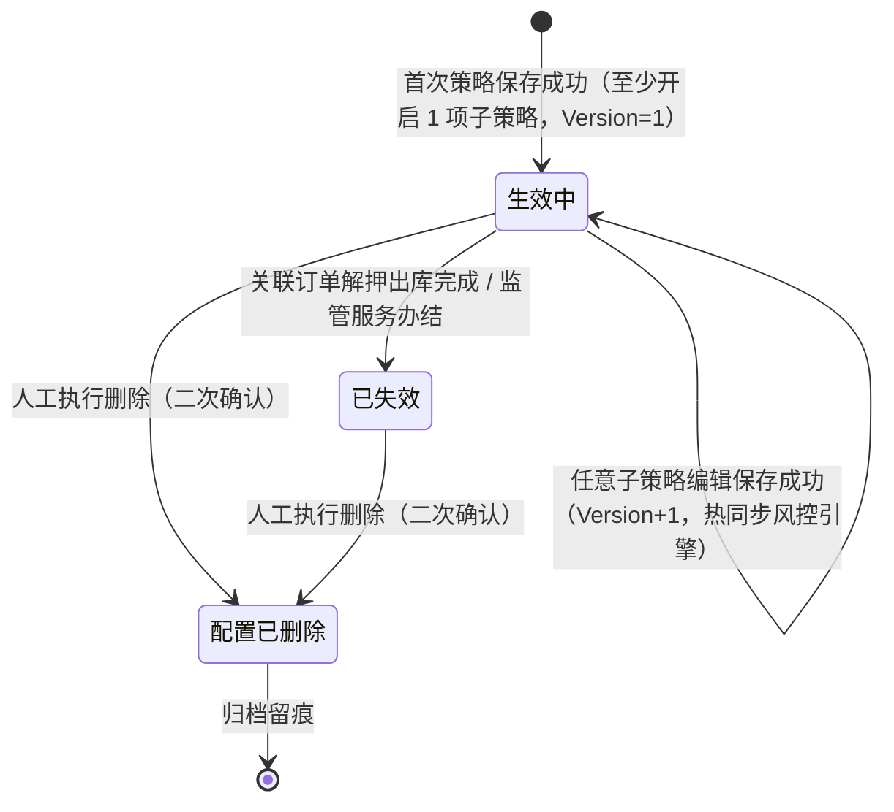
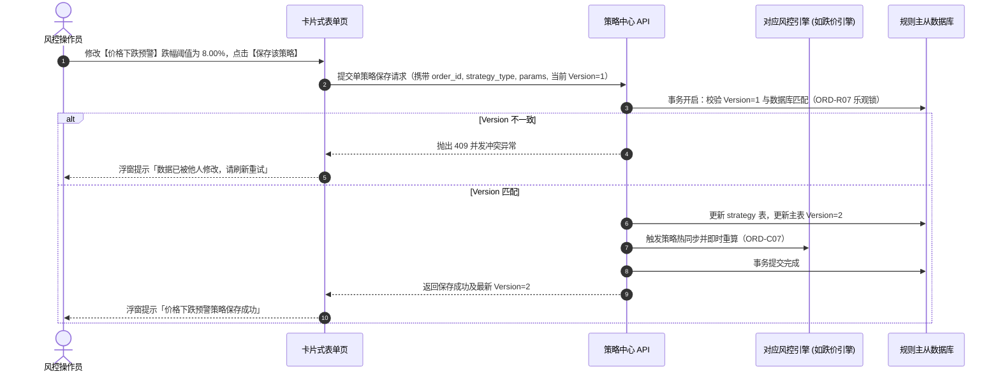
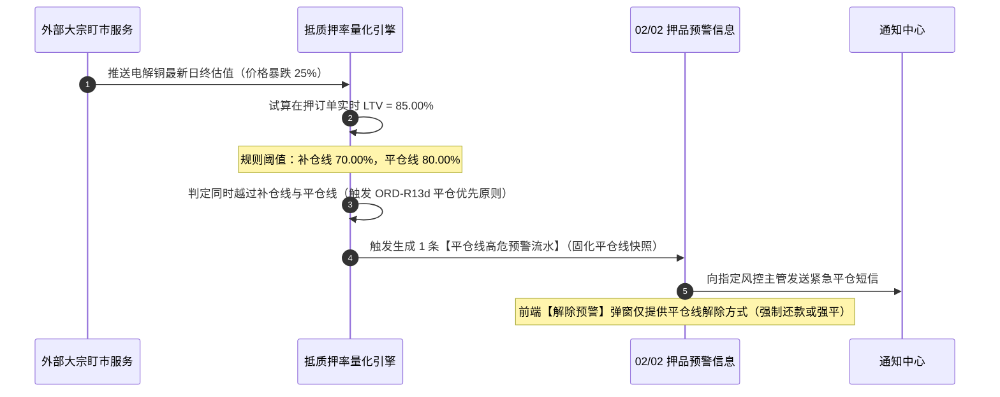

# 订单预警配置 业务规则规格

> **文档定位**：**三件套核心**——订单级综合风控策略模型、各子项判定算法、逐条保存机制、抵质押率双线计算、贷中台账联动及并发控制的**唯一定义来源**。配套文档：[订单预警配置主PRD.md](./订单预警配置主PRD.md)（业务场景与页面交互）、[订单预警配置字段清单.md](./订单预警配置字段清单.md)（字段字典）。端侧 ASCII 线框与 Demo 为衍生输入，仅引用本文件规则 ID，不重复定义规则本体。  
> **模块类型**：配置策略类（范式 A 裁剪版——具有完整生命周期状态机，无审批流，**无整单停用态**，精细化控制由各策略子项独立开关承接）  
> **版本**：V4.3 | **更新时间**：2026-09-18 | **责任人**：森云科技（Senyun Technology）  
> **参考依据**：[《00-全局契约与RBAC权限矩阵》](../../00-全局契约与RBAC权限矩阵.md)第四章 §1、[预警等级配置业务规则规格（03/01）](../01预警等级/预警等级业务规则规格.md)、[订单预警与通知体系协同规范](../../02-预警信息/协同规范/通知模板.md)

---

## 一、单据与能力定位

### 1.1 统一主子数据模型规范

本模块在底层采用“单订单综合规则主表 + 策略子项从表”的主从模型，各策略卡片独立维护，不对应多条订单主规则：

```text
order_rule_config（综合规则主表，单订单维度 1:1，持有 Version 乐观锁）
  └─ order_rule_strategy（策略子项从表，strategy_type 维度 1:N，最多 6 条策略）
       ├─ strategy_params（该子策略的专属阈值/周期/模型参数 JSON）
       ├─ severity_level_id（各子策略独立绑定的预警等级外键，整卡单等级）
       └─ notify_channels / notify_user_ids / upgrade_days / upgrade_user_ids（独立通知升级配置）
```

### 1.2 模块能力定位矩阵

| 项目 | 内容 |
| :--- | :--- |
| **模块层级** | **【配置策略层】**（订单级纯商业与金融风控综合策略包，非业务单据层、非执行流水层） |
| **核心职责** | 集中定义与维护抵押、质押、监管服务订单的 6 类风控子策略（超时、跌价、盘点、巡检、抵质押率、贷中风控）；支持逐条策略独立开启、独立配置阈值、独立绑定等级与独立通知升级；驱动对应风控判定引擎 |
| **规则来源** | 经授权的风控管理人员通过 PC 端卡片式表单新增/编辑生成，各策略卡片**逐条独立保存**（保存即生效） |
| **适用订单口径** | 统一支持三类有效业务订单：`抵押`、`质押`、`监管服务`（旧历史“监管”枚举已彻底下线） |
| **上游依赖** | **【预警等级】字典（菜单：预警配置 → 预警等级，代号 03/01）**：提供启用的严重度字典外键 `severity_level_id`，按 `sort_order` 权重比较严重度；<br/>**订单主数据**：提供在押订单编号、类型、期限、货物清单与货值；<br/>**外部市价盯市**：提供大宗商品最新单价，计算跌幅与实时抵质押率；<br/>**智风控平台**：提供贷中反欺诈与信用模型决策结果；<br/>**仓储任务中心**：提供盘点任务实际结果与巡检打卡时间戳。 |
| **下游影响** | **风控判定引擎**：逐条策略保存后，即时向超时、跌价、盘点、巡检、抵质押率及贷中引擎热同步最新策略参数；<br/>**【押品预警信息】台账（菜单：预警信息 → 押品预警信息，代号 02/02）**：指标越限命中时，固化触发时刻的子策略快照（阈值、等级、通知人），生成押品预警流水；<br/>**【贷中风控管理】台账（菜单：预警信息 → 贷中风控管理，代号 02/03）**：保存贷中风控子策略时，系统异步幂等写入贷中台账；<br/>**生命周期联动**：订单办结出库时，规则自动变迁为【已失效】终态，未处理流水置为【已作废】并注销升级任务。 |
| **审核流边界** | **无审批流**——配置策略类保存即生效（状态直接为 `生效中`），不设草稿箱与待审核态 |
| **6.2 不设停用态** | 本模块**不设整单人工停用状态**；整单生命周期仅为 **生效中 / 已失效 / 配置已删除** 三态；精细化控制由各策略子项独立 Switch 承接 |

---

## 二、指标与计算口径隔离表

| 口径名称 | 涉及策略子项 | 业务含义与计算公式 / 判定条件 | 约束与边界说明 |
| :--- | :--- | :--- | :--- |
| **跌价比例计算** | 价格下跌预警 | 标的物盯市单价相对质押初始基准价的跌幅百分比：<br/>$$P_{\text{drop}} = \frac{P_{\text{base}} - P_{\text{market}}}{P_{\text{base}}} \times 100\%$$ | 跌幅阈值 $P_{\text{threshold}} \in (0, 100)\%$；当实时跌幅 $P_{\text{drop}} > P_{\text{threshold}}$ 时触发告警 |
| **抵/质押率计算** | 抵/质押率异常预警 | 融资金额相对当前在押标的物实时总市值的比率：<br/>$$LTV = \frac{\text{融资金额}}{\sum (\text{在押数量}_i \times P_{\text{market}, i})} \times 100\%$$ | 补仓线 $LTV_{\text{margin}}$ 与平仓线 $LTV_{\text{close}}$ 严格满足：<br/>$$0\% < LTV_{\text{margin}} < LTV_{\text{close}} \le 100\%$$ |
| **平仓优先判定** | 抵/质押率异常预警 | 当实时测算 $LTV$ 越限时的判定规则：<br/>- 若 $LTV_{\text{margin}} < LTV \le LTV_{\text{close}}$：触发【补仓线告警】；<br/>- 若 $LTV > LTV_{\text{close}}$：触发【平仓线高危告警】 | **平仓优先**：双线同时越界时强制以平仓线（最高危险度）触发流水，解除时仅展示平仓线解除方式（ORD-R13d/R13e） |
| **巡检超时判定** | 巡检异常预警 | 针对第 $k$ 位巡检责任人，自上次有效巡检打卡时间 $T_{\text{last}, k}$ 起算：<br/>$$\Delta T_k = T_{\text{current}} - T_{\text{last}, k}$$ | 巡检周期 $D_{\text{cycle}, k} \in [1, 90]$ 天；当 $\Delta T_k > D_{\text{cycle}, k} \times 86400$ 时触发巡检异常告警 |
| **升级触发时刻** | 超时升级定时引擎 | 自押品告警实际触发落账时间 $T_{\text{trigger}}$ 起算：<br/>$$T_{\text{upgrade}} = T_{\text{trigger}} + D_{\text{upgrade}} \times 86400\text{ 秒}$$ | $D_{\text{upgrade}} \in [1, 30]$ 正整数天；仅在告警处于待处置且 $T_{\text{current}} \ge T_{\text{upgrade}}$ 时，按卡片已勾选的 `notify_channels` 触发升级通知（ORD-R21） |
| **数据版本号** | 综合规则乐观锁 | 规则主表数据版本计数器：<br/>$$\text{Version}_{n+1} = \text{Version}_n + 1$$ | 初始新增为 1；单策略卡片每次保存成功后原子递增；提交时若客户端 Version 与数据库不一致强阻断 |

---

## 三、单据状态机与流转定义

### 3.1 规则状态定义

| 状态名称 | 状态编码 | 业务含义 | 是否终态 | 列表可见性 | 变迁条件说明 |
| :--- | :--- | :--- | :---: | :---: | :--- |
| **生效中** | `ACTIVE` | 规则正常生效运行，包含的启用子策略持续进行实时风险判定 | 否 | 可见 | 首次保存策略子项成功（至少开启 1 项策略）即进入 |
| **已失效** | `INACTIVE` | 关联订单已完成解押出库、全额还款或监管服务办结，系统自动失效 | **是** | 可见 | 系统任务监听订单终态后自动变迁；不可编辑，不可恢复 |
| **配置已删除** | `DELETED` | 规则已被软删除，退出风控策略运行池，保留底层审计镜像 | **是** | **不可见** | 人工在列表执行删除（二次确认）；存量未处理预警自动置为已作废 |

### 3.2 规则状态机流转图



---

## 四、动作能力与流转控制矩阵

| 触发动作 | 操作入口 | 适用角色 | 前置业务校验条件 | 结果状态 | 联动后置影响 | 失败阻断提示 |
| :--- | :--- | :--- | :--- | :--- | :--- | :--- |
| **首次策略保存 (新增)** | 新增页卡片【保存该策略】 | 风控操作员 (`R-RISK-OPS`) | ① 选择有效订单（抵押/质押/监管服务）；<br/>② 规则名称租户内唯一（见规则 ORD-R03）；<br/>③ 满足一单一配（见规则 ORD-R04）；<br/>④ 当前卡片参数有效（见规则 ORD-R08~R20）。 | 生效中 | ① 原子创建主规则记录（Version=1）与当前子策略从表；<br/>② 启用了贷中风控策略时，幂等同步至【贷中风控管理】台账（菜单：`预警信息 → 贷中风控管理`，代号 02/03，详见规则 ORD-C04【贷中台账幂等同步】）；<br/>③ 激活对应引擎监听。 | 「保存失败：{字段名}校验未通过」<br/>「保存失败：该订单已存在有效预警配置」 |
| **单策略卡片保存 (编辑)** | 编辑页卡片【保存该策略】 | 风控操作员 (`R-RISK-OPS`) | ① 订单编号与类型未变更（ORD-R06）；<br/>② 携带当前 Version 且与数据库一致（ORD-R07 乐观锁）；<br/>③ 若当前操作为关闭 Switch，校验规则内剩余启用子策略数 $\ge 1$（ORD-R07a）；<br/>④ 卡片参数校验通过。 | 生效中 (状态保持) | ① 主表 Version 递增（Version+1）；<br/>② 当前子策略热同步至风控引擎；<br/>③ 若关闭了该子策略，级联将该子策略产生的未处理流水置为【已作废】（ORD-C01a）并终止升级；<br/>④ 触发即时重算，若旧流水仍命中执行置换（ORD-C07）。 | 「数据已被他人修改，请刷新重试」<br/>「保存失败：综合预警规则必须至少保留 1 项有效开启的策略」 |
| **整单删除规则** | 列表行操作【删除】 | 风控主管 (`R-RISK-MGR`) | 规则处于生效中或已失效状态；具备删除权限 (`P04`)；二次确认弹窗输入删除理由 | 配置已删除 | ① 软删除主表与全部策略子项（`is_deleted=1`）；<br/>② 级联将该规则产生的所有未结案押品预警置为【已作废】（ORD-C01）；<br/>③ 注销该规则所有待执行的超时升级任务（ORD-C02）。 | 「删除失败：规则已被他人删除」 |
| **查看规则详情** | 列表行操作【查看详情】 | 具备查看权限 (`R-RISK-VIEW`) | 规则处于生效中或已失效状态 | 状态不变 | 只读打开详情页，展示 6 大卡片完整配置快照、当前 Version 及审计日志 | — |
| **整单停用/启用** | — | — | — | — | **不允许**（6.2 订单侧不设整单启停动作，精细化启闭由各子策略 Switch 独立承接） | — |

---

## 五、核心业务规则清单 (ORD-R01 ~ ORD-R20)

### 5.1 基础模型与唯一性规则

#### 【规则名称租户内唯一】(ORD-R03)
* **业务红线**：规则名称必填，最大长度不超过 50 个字符。同一租户内严禁存在同名订单预警规则（已软删除规则不计入重名校验）。

#### 【一单一配唯一性约束】(ORD-R04)
* **业务红线**：一笔抵押、质押或监管服务业务订单在租户内**严格仅允许绑定 1 条有效综合预警规则**（生效中状态）；
* **防重校验**：新增规则选择订单时，下拉列表自动过滤已绑规则的订单；提交保存时服务端加排他锁校验唯一性，违规阻断并提示「该订单已存在有效预警配置」。

#### 【硬件类非法传参拦截】(ORD-R05)
* **边界防护**：6.2 架构明确将物理安防剥离至物联网板块。订单预警接口若接收到摄像头离线、挂锁剪杆、温湿度等 6.1 遗留硬件类型，服务端直接抛出 400 业务异常强阻断。

#### 【编辑时订单锁定只读】(ORD-R06)
* **防呆机制**：规则一旦创建成功，进入编辑页后，`关联订单编号`、`订单类型`、`货主信息` 强制置灰锁定只读，严禁在既有规则上“偷换”关联订单。

#### 【逐条策略保存与乐观锁机制】(ORD-R07)
* **逐条保存理念**：页面内 6 大卡片独立维护 Switch 开关与【保存该策略】按钮。前端与 API 均按 `strategy_type` 逐条提交；
* **主表并发版本锁**：主表 `Version` 统一管理整单与全部子项。每次任意卡片保存成功，服务端在同一事务内更新当前子策略并原子令主表 $\text{Version} = \text{Version} + 1$；提交时版本不匹配直接抛出 409 并发冲突。

#### 【至少保留一项有效策略强阻断】(ORD-R07a)
* **底线风控**：综合预警规则**必须时刻保持至少 1 项有效开启的子策略**；
* **关闭拦截**：当用户尝试将某卡片的 Switch 开关关闭并点击保存，或点击【关闭并停用】并确认后，系统前置校验当前规则中其他策略的启用状态：
  * 若仍有其他策略处于开启状态：允许关闭保存，并级联将该子策略未结案流水置为【已作废】（ORD-C01a）；
  * 若该卡片是当前规则内**最后一条**开启的策略：系统绝对强阻断保存，浮窗提示「综合预警规则必须至少保留 1 项有效开启的策略」。

---

### 5.2 六大风控子策略专项配置规则

#### 【超时预警平铺与天数非负】(ORD-R08)
* 选择订单后，系统根据订单主数据自动读取并平铺全部在押货物批次行；
* 二维码标识与成功时间只读带出，仅允许录入 `超时天数`（正整数，$\ge 1$ 天）；不提供手工新增批次或删除货物行的入口。

#### 【价格下跌跌幅阈值规范】(ORD-R09)
* 跌幅比例阈值必须配置在 $(0.00, 100.00)\%$ 区间内，精度保留 2 位小数；外部盯市单价更新时，跌幅超限即刻告警。

#### 【抵/质押率单等级约束】(ORD-R10)
* **整卡单等级**：抵/质押率卡片虽包含补仓线与平仓线两个阈值，但**整张卡片强制仅能绑定 1 档预警等级**（选自【预警等级】字典（03/01）中的启用项，提交 `severity_level_id`）；严禁分别配置不同等级。

#### 【抵/质押率双阈值逻辑有效性】(ORD-R13)
* 补仓线比例与平仓线比例均为必填项，且必须严格满足：
  $$0.00\% < LTV_{\text{margin}} < LTV_{\text{close}} \le 100.00\%$$
* 违规保存时系统强阻断，提示「阈值设置不正确：补仓线必须严格小于平仓线」。

#### 【抵/质押率双线同时命中平仓优先】(ORD-R13d)
* 当市场估值暴跌导致实时 $LTV$ 同时越过补仓线和平仓线时，风控引擎按**平仓线优先原则**触发一条平仓高危预警流水（不重复生成两条）；流水详情与解除弹窗仅展示平仓线对应的解除方式（见规则 ORD-R13e）。

#### 【抵/质押率分线独立解除方式配置】(ORD-R13e)
* 卡片内支持针对补仓线和平仓线分别勾选可用的解除方式（追加保证金、追加抵质押物、提前还款等）；
* 告警发生后，在【押品预警信息】（菜单：`预警信息 → 押品预警信息`，代号 02/02）详情页【解除预警】弹窗中，**仅展示当前命中线所允许的解除方式选项**。

#### 【巡检责任人与独立周期完整性】(ORD-R12)
* 巡检异常支持配置多位巡检人；每位巡检人必须独立配置巡检周期（$1 \sim 90$ 正整数天）；任一责任人超期未打卡，即以该责任人为主体生成一条巡检异常预警流水。

#### 【贷中风控模型单选与台账联动】(ORD-R20)
* 贷中策略必须且仅能单选 1 个智风控模型；保存成功后系统异步向【贷中风控管理】台账（菜单：`预警信息 → 贷中风控管理`，代号 02/03）插入监控凭据；模型回调判定拒绝或高风险时触发押品高危告警。

#### 【预警通知对象选填】(ORD-R19)
* 各策略子项勾选 `短信` / `邮件` 外部通知渠道后，展示「预警通知对象（按组织架构选择）」控件，但**不强制**填写；
* 保存时未配置预警对象**不阻断**；外部渠道（短信/邮件）在实际下发前须已配置对象，否则跳过该渠道下发；
* 移动端「押品预警信息」待处置红点不受通知对象是否配置影响，预警命中时自动展示。

#### 【升级文案与渠道联动】(ORD-R21)
* **前端文案联动**：「启用升级预警」Checkbox 副文案须随当前卡片 `notify_channels` 动态生成，例如：
  * 仅勾选短信 → 「长时间未处置时，将通过短信逐级上报」；
  * 勾选短信 + 邮件 → 「……将通过短信、邮件逐级上报」；
* **升级下发渠道**：升级督办通知与卡片已勾选的外部通知渠道保持一致，不再固定为仅短信；
* **升级参数校验**：开启升级预警后，「持续未解除天数」与「升级预警对象」仍为必填（见 ORD-R20a 升级配置完整性）。

---

### 5.3 协同与生命周期联动规则

#### 【规则删除级联流水作废】(ORD-C01)
* 软删除整条规则时，系统级联将该规则产生的所有处于待处置状态的历史押品预警流水批量置为【已作废】（作废原因记录为「关联订单规则已被删除」），并同步注销所有超时升级任务（ORD-C02）。

#### 【关闭子策略级联流水作废】(ORD-C01a)
* 当且仅当某卡片 Switch 由开启变为关闭并保存成功时，系统仅将**该子策略产生且未结案**的预警流水置为【已作废】，其他开启子项产生的流水不受影响。

#### 【阈值修改即时重算与流水置换】(ORD-C07)
* 当用户修改某子策略阈值并保存成功后，风控引擎即刻对该订单执行即时重算：
  * 若重算后仍命中告警，且当前存在处于待处置状态的该子策略旧流水：系统自动将旧流水置为【已作废】（原因记为「阈值修改规则置换」），并生成携带最新阈值快照的新流水；
  * 若重算后不再命中告警：系统将存量待处置流水自动结案或置作废，停止升级。

#### 【订单终态规则系统自动失效】(ORD-C08)
* 当借款企业完成还款解押出库、或监管服务订单在业务系统完成办结时，系统自动将该订单对应的综合预警规则变迁为【已失效】终态；
* 停止所有子策略的引擎监听，存量未处理预警自动置为已作废，注销所有升级 Job。

---

## 六、异常与边界控制矩阵 (ORD-C01 ~ ORD-C10)

| 异常编号 | 异常场景 | 系统判定与控制动作 | 前端反馈与提示 |
| :--- | :--- | :--- | :--- |
| **【规则删除级联作废】(ORD-C01)** | 规则软删除时存在未结案流水 | 检索该规则下全部待处置押品流水，原子置为【已作废】并注销升级任务 | 二次确认弹窗提示：「删除后该规则产生的未处理预警将全部置为已作废，确认删除？」 |
| **【子策略关闭流水作废】(ORD-C01a)**| 关闭某张子策略卡片保存（含 Switch OFF 保存或【关闭并停用】确认后自动保存） | 仅将该子策略类型产生的待处置流水置为【已作废】，终止该项升级任务 | 确认弹窗说明作废与升级终止（**不展示规则编号**）；保存成功提示「{策略名称}已关闭并停用」 |
| **【终止超时升级调度】(ORD-C02)** | 删除规则或关闭子项取消调度 | 调度引擎按 `rule_id` 或 `strategy_type` 撤销所有未触发的升级定时任务 | 服务端异步取消，杜绝幽灵短信骚扰 |
| **【贷中台账幂等同步】(ORD-C04)** | 贷中子策略保存后同步台账 | 异步调用【贷中风控管理】台账（02/03）接口写入监控凭据；网络超时自动重试 3 次 | 前端无感知，保证最终一致性 |
| **【阈值修改重算置换】(ORD-C07)** | 调严阈值后存在旧待处置流水 | 重算命中后，系统自动作废旧流水并按新阈值生成新流水 | 详情页时间轴清晰展现置换与新流水生成记录 |
| **【订单办结规则失效】(ORD-C08)** | 订单完成出库或服务办结 | 订单状态变迁为办结终态时，系统自动将综合规则置为【已失效】 | 规则列表状态变迁为灰色「已失效」，锁定只读 |
| **【移动端红点自动联动】(ORD-C09)** | 押品告警产生后移动端同步 | 押品预警流水落账时，系统自动更新移动端「押品预警信息」待办红点角标 | 移动端工作台即时渲染待办红点 |
| **【硬件类非法传参拦截】(ORD-C10)** | 接口接收到 6.1 遗留硬件类型 | 服务端前置校验拦截非商业预警类型，拒绝入库写入 | 抛出 400 业务异常，拒绝非法请求 |

---

## 七、业务时序推演与跨模块联动

### 7.1 单策略卡片独立保存与版本递增时序



### 7.2 抵质押率双线平仓优先触发时序



---

## 八、规则全景速查索引表

| 规则编码 | 规则全称 | 核心控制逻辑摘要 | 违规/异常反馈 |
| :--- | :--- | :--- | :--- |
| **ORD-R03** | 规则名称租户内唯一 | 最多 50 字；租户内唯一 | 阻断，提示名称已存在 |
| **ORD-R04** | 一单一配唯一性约束 | 单笔抵质押或监管服务订单限 1 条有效规则 | 阻断，提示订单已配置规则 |
| **ORD-R05** | 硬件类非法传参拦截 | 拒绝温湿度、门禁等硬件类型传参 | 服务端抛出 400 业务异常 |
| **ORD-R06** | 编辑时订单锁定只读 | 编辑态订单编号与类型置灰锁定 | 拦截篡改传参 |
| **ORD-R07** | 逐条策略保存与乐观锁 | 单卡片独立保存；主表 Version 原子递增 | 阻断，提示数据已被他人修改 |
| **ORD-R07a**| 至少保留一项有效策略 | 关闭卡片 Switch 时，整单必须保留 $\ge 1$ 项开启 | 阻断，提示至少保留一项策略 |
| **ORD-R08** | 超时预警平铺与天数非负 | 自动平铺在押货物；录入正整数天数 | 阻断，提示天数必须大于等于1 |
| **ORD-R09** | 价格下跌跌幅阈值规范 | 跌幅比例必须在 $(0.00, 100.00)\%$ 区间 | 阻断，提示跌幅比例设置不正确 |
| **ORD-R10** | 抵质押率单等级约束 | 整卡强制单选 1 档预警等级，按 `sort_order` 比较 | 阻断，提示请选择等级 |
| **ORD-R12** | 巡检责任人与独立周期 | 支持多巡检人；每人独立配置天数（$1\sim 90$ 天） | 阻断，提示周期天数不合法 |
| **ORD-R13** | 抵质押率双阈值逻辑性 | 补仓线严格小于平仓线（$LTV_{\text{margin}} < LTV_{\text{close}}$） | 阻断，提示补仓线必须小于平仓线 |
| **ORD-R13d**| 双线同时命中平仓优先 | 双线越界时，平仓高危优先触发，仅展示平仓解除 | 风控引擎自动裁决 |
| **ORD-R13e**| 分线独立解除方式配置 | 支持两线独立配置解除路径，前台按命中线展示 | 阻断空选 |
| **ORD-R20** | 贷中模型单选与台账联动 | 智风控模型单选；保存异步同步至【贷中风控管理】台账（02/03） | 阻断未选模型 |
| **ORD-R19** | 预警通知对象选填 | 勾选短信/邮件后对象选填；未配置不阻断保存 | 允许保存；外部渠道无对象则不下发 |
| **ORD-R21** | 升级文案与渠道联动 | 升级 Checkbox 文案与升级下发随 `notify_channels` 联动 | 前端实时联动；后端按已选渠道升级 |

---

## 修订记录

| 日期 | 版本 | 变更内容说明 | 影响范围 | 修订人 |
| :--- | :--- | :--- | :--- | :--- |
| 2026-09-15 | V4.0 | 收口三类订单类型（抵押/质押/监管服务），下线历史“监管”类型。 | 全文 | AI PM / 森云科技 |
| 2026-09-16 | V4.1 | 汉化交互用语，规范 ORD-R/C/P 规则自解释命名。 | 规则清单 | AI PM / 森云科技 |
| 2026-09-18 | **V4.3** | **全面对齐《入库记录》《出库记录》标杆业务规格排版**：<br/>1. 确立《一、单据与能力定位》标准矩阵；<br/>2. 新增《二、指标与计算口径隔离表》，严格以 LaTeX 公式定义跌价幅、LTV 双阈值、平仓优先及乐观锁算法；<br/>3. 落地 7 列全景动作控制矩阵（逐条保存、关闭限制、后置联动、失败文案）；<br/>4. 核心规则清单条目化重构，落地黑体重点引导词与分小节层次；<br/>5. 完善单策略保存时序与双线命中平仓优先时序推演。 | 业务规则规格全文 | AI PM / 森云科技 |
| 2026-09-22 | **V4.4** | 补充【关闭并停用】为 ORD-R07a / ORD-C01a 合法入口；前端反馈文案不展示规则编号。 | §5.1 ORD-R07a、§六 ORD-C01a | AI PM / 森云科技 |
| 2026-09-22 | **V4.5** | 新增 ORD-R19（预警通知对象选填）、ORD-R21（升级文案与渠道联动）；升级触发口径改为随 `notify_channels`。 | §二 口径表、§5.2、§八 | AI PM / 森云科技 |
