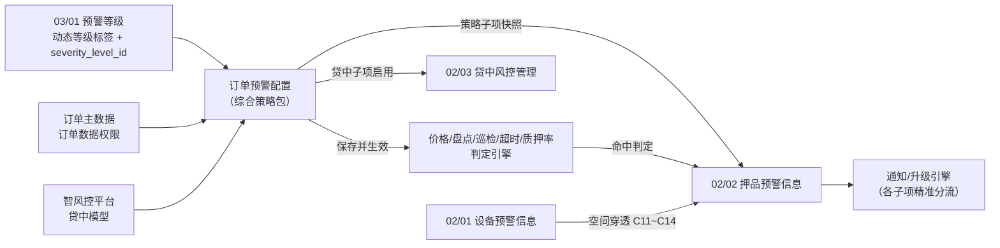
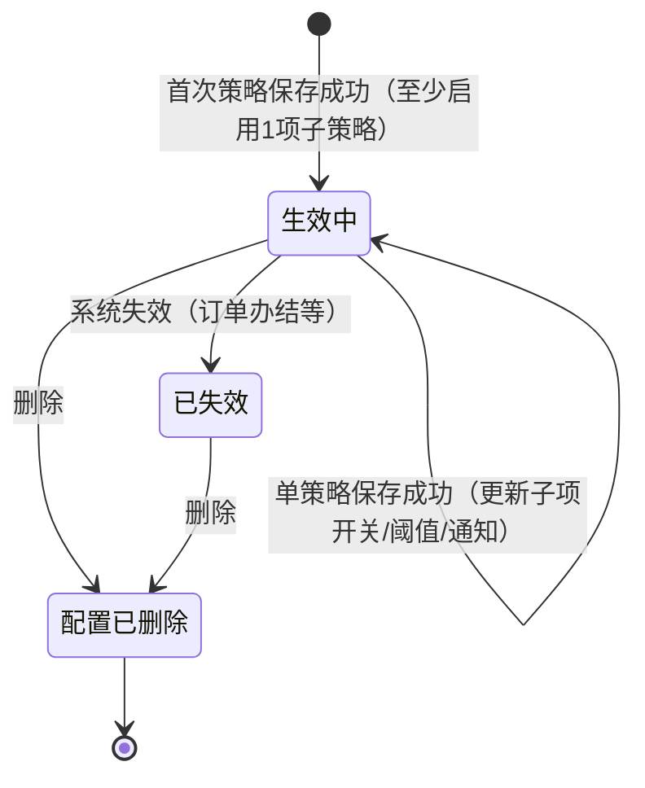

# 订单预警配置主PRD

> **文档体系（三件套为核心）**：
>
> | 层级 | 文档 | 职责 |
> | :--- | :--- | :--- |
> | **核心** | 本文（主 PRD） | 业务背景、范围、架构、**页面功能说明**、场景、状态机摘要、规则摘要、验收 |
> | **核心** | [订单预警配置字段清单](./订单预警配置字段清单.md) | 字段定义、筛选/列表/新增编辑/详情、展示顺序与控件规格 |
> | **核心** | [订单预警配置业务规则规格](./订单预警配置业务规则规格.md) | 状态机本体、R/C/P 规则、时序图、流转表 |
> | *衍生* | ASCII 线框 / Demo 文档 | 由三件套派生的可视化与原型输入，**非独立真源** |
>
> **版本**：V3.7 | 2026-09-11
> **读者**：研发工程师、测试工程师、风控产品经理、架构师
> **所属模块**：03-预警配置 / 03-订单预警配置 | **菜单路径**：`预警配置 → 订单预警配置`
> **模板选型**：配置策略类（[5-2-3 配置策略类 PRD 模板](../../../../05-常用模板/需求处理/5-2-3%20(输出)配置策略类PRD模板.md)）
> **规则来源**：状态机、校验、联动与权限详见《[订单预警配置业务规则规格](./订单预警配置业务规则规格.md)》——**规则 ID 以该文件为 唯一定义来源，本文仅摘要引用**
> **字段基准**：《[订单预警配置字段清单](./订单预警配置字段清单.md)》为字段唯一定义来源
> **权限基准**：[00-全局契约与RBAC权限矩阵](../../00-全局契约与RBAC权限矩阵.md) 第四章 §1
> **跨文档引用规范**：[B-迭代需求跨文档引用口径与来源索引](../../../README.md)，本模块引用 REF-SEVERITY、REF-ORDER、REF-RBAC、REF-NOTIFY。
> **6.2 迭代说明**：物理硬件规则已收口至 [03/02设备预警配置](../02设备预警配置/设备预警配置主PRD.md)；穿透规则见 [订单预警与通知体系协同规范](../../02-预警信息/协同规范/通知模板.md)
>
> **衍生文档（可视化 / 原型）**：
> - **ASCII 线框**：[列表页](./订单预警配置_ASCII_列表页.md) · [新增/编辑页](./订单预警配置_ASCII_新增编辑页.md) · [详情页](./订单预警配置_ASCII_详情页.md)
> - **Demo 输入**：[列表页](./订单预警配置_Demo_列表页.md) · [新增/编辑页](./订单预警配置_Demo_新增编辑页.md) · [详情页](./订单预警配置_Demo_详情页.md)
> - **原型 DEV**：PC [`/物联网IOT与预警/预警配置/订单预警配置`](http://localhost:5173/#/物联网IOT与预警/预警配置/订单预警配置)

---

### 1. 业务背景

在供应链金融大宗商品存货质押与监管业务中，货权质押期长、市场价格波动大、仓储作业频繁，资金方与监管方需要对质押物与监管订单进行全生命周期的风险监控。

**订单预警配置**是 **03/03 订单预警配置** 下的配置菜单，作为订单级纯商业/金融风控规则的**一站式综合策略中枢**。系统支持针对单个订单，在同一个配置页面内一站式勾选并配置价格下跌、抵/质押率异常、解押/监管超时、盘点异常、巡检超期与贷中风控模型等 **6 类风控子策略**，并为每个启用的子策略分别绑定 03/01 提供的动态预警等级（稳定关联 `severity_level_id`，按 `sort_order` 比较）与独立的通知升级路径。物理安防事件不再在此重复配置，由物联网板块触发后经空间拓扑穿透自动生成押品预警。

> **当前运营口径（2026-09-11）**：监管订单业务当前关闭。本模块当前仅允许抵/质押订单新增、编辑、保存和触发新的订单预警；历史监管订单及其历史规则保留用于查询、详情、审计和资料查看，不提供编辑、删除、保存或新预警触发。

通过本模块的**一站式卡片式多策略表单**（各策略**逐条独立保存**）：

- 风控人员可在同一页面为单个订单配齐全部风控监控项，**按策略类型分别保存**，与后端 `strategy_type` 写入粒度对齐；
- 各策略子项拥有独立的预警等级与通知对象，实现风控告警的精准分流；
- 规则生命周期与未处理押品预警精准联动，支持整单或子项维度的灵活管控。

---

### 2. 功能范围

**包含范围 (In Scope)**：

- 规则列表、组合筛选（规则名称/订单号/订单类型/已启用预警项/状态）、分页
- 6 类风控子策略的卡片式表单配置（超时、跌价、盘点、巡检、抵质押率、贷中风控）；**每条策略独立编辑、独立保存**
- 各启用的风控子项独立绑定预警等级：读取当前租户 03/01 预警等级中状态为“启用”的等级，租户等级总数限制为 2~20 档；展示编码、名称和颜色，提交 `severity_level_id`，服务端校验租户归属、启用状态和等级 ID，严重度比较使用 `sort_order`。抵/质押率异常分别配置补仓线、平仓线等级（REF-SEVERITY，R10/R10a/R11）。
- 订单选择与联动加载（按订单数据权限；新增候选仅返回有效抵/质押订单）；订单货物由主数据自动带出并全部平铺，超时策略不提供手工添加批次或删除货物入口
- 各子项独立通知渠道（短信/邮件，选填）、预警对象、升级预警天数与升级对象；系统小角标在预警命中时自动更新，不可配置
- 规则新增、编辑、软删除、详情查看（当前仅适用于抵/质押订单；监管历史规则仅详情、审计和资料查看）
- 规则生命周期三态（生效中/已失效/配置已删除）及与押品预警、贷中台账的联动
- 贷中风控预警保存后幂等同步贷中风控管理台账（C04~C07）

**排除范围 (Out of Scope)**：

- 审批流（保存即生效，无待审核态）——配置策略类单据不设审核
- **整单启用/停用**人工开关——6.2 订单侧规则**不设整单停用态**，仅生效中/已失效/配置已删除（精细化控制由各策略子项 开关 (Switch) 实现）
- 规则版本回滚与历史版本对比——6.2 仅 Version 乐观锁，不提供版本树
- 批量导入/导出规则模板——一期不支持
- 押品预警产生后的核查、解除与单据处置——归属 [02/02 押品预警信息](../../02-预警信息/02押品预警信息/押品预警信息主PRD.md)
- 预警等级字典维护——归属 [03/01 预警等级](../01预警等级/预警等级主PRD.md)
- 设备物理阈值与通知升级规则——归属 [03/02 设备预警配置](../02设备预警配置/设备预警配置主PRD.md)
- **物联穿透告警**的配置与阈值维护——系统自动穿透，只读生成（C11~C14）
- 6.1 硬件类预警类型（图像/物联/挂锁/门禁/GPS）——接口拒绝写入（R05）
- 出库/全流程熔断（OPT-FUSE-01）——6.2 运行时 `fuse_status` 恒 `NONE`
- 移动端页面——6.2 不展示本模块移动端页面，配置与规则维护仅在 PC 端完成

---

### 3. 模块定位

#### 3.1 在系统中的位置

| 项目 | 内容 |
| :--- | :--- |
| 模块层级 | **配置策略层**（订单级综合风控策略包，非业务单据层、非执行流水层） |
| 核心职责 | 一站式定义「该订单开启哪些商业风险项、各达何种阈值、以何等级、分别通知谁、如何升级」 |
| 配置来源 | 用户手动新增/编辑抵/质押订单规则（6.2 当前唯一写入方式）；监管历史规则不再写入 |
| 上游依赖 | **03/01 预警等级**：提供启用等级下拉、`severity_level_id` 和 `sort_order`；**抵/质押订单主数据**：提供当前可运营订单 ID、生命周期状态和货权关系；**监管订单历史数据**仅作为只读快照来源；**盘点/巡检任务**：提供任务状态、完成时间和责任人；**外部市价/估值**：提供价格和货值计算输入；**智风控平台**：提供贷中模型结果；**RBAC 与订单数据权限**：过滤列表、订单选择器和写接口，并执行服务端二次校验。来源：[跨文档引用口径与来源索引](../../../README.md) REF-SEVERITY/REF-ORDER/REF-RBAC/REF-NOTIFY。 |
| 下游影响 | **保存/编辑**：写入综合规则、各启用子项和 `Version`，按规则 ID、子项和版本幂等同步对应风控判定引擎；关闭子项只影响后续触发，普通编辑不回写历史流水。**命中触发**：02/02 写入订单 ID、订单类型、预警子类型、命中值/阈值、预警时间、`warn_source=ORDER_CONFIG`、规则版本、03/01 等级（ID/编码/名称/颜色/`sort_order`）及通知/升级策略快照；按租户+订单+类型+来源事件/业务批次键幂等，重复命中不重复生成。**贷中联动**：贷中子项命中时同步贷中风控管理台账，写入模型结果和处置关联；通知失败进入补偿队列，不回滚已生成流水。**生命周期**：订单办结/出库或规则系统失效时，未处理流水置为“已作废”并停止升级；整条规则软删除按 C01 处理，历史已处理流水和触发快照保留。已结案 · 有效流水满足条件后进入 02/04 风险公示候选。来源：[订单预警配置业务规则规格](./订单预警配置业务规则规格.md) R01~R04、C01~C12、N01~N03。 |
| 实体关系 | 一个订单对应 **1 条有效综合规则**（1:1，R04）；一条综合规则包含 **1~6 项已激活策略**（1:N） |

#### 3.2 系统链路图

#### 3.3 实体关系说明

| 关系 | 说明 |
| :--- | :--- |
| 订单 : 订单预警配置 | **1:1**（租户内每个订单仅 1 条有效综合规则，见 R04） |
| 订单预警配置 : 策略子项 | **1:N**（单规则内可同时激活并配置 1~6 个不同风控子项，见 R07a） |
| 策略子项 : 预警等级 | **N:1**（各子项独立绑定 03/01 预警等级字典） |
| 策略子项 : 押品预警信息 | **1:N**（命中时按具体子项快照生成预警流水） |
| 订单预警配置 : 贷中风控管理 | **1:1**（启用了贷中风控子项时幂等同步，见 C04~C07） |

#### 3.4 6.2 当前可配置预警子策略矩阵

| 序号 | 预警子项 | 核心配置项 | 当前适用订单类型 | 触发条件摘要 | 解除方式摘要 |
| :---: | :--- | :--- | :--- | :--- | :--- |
| 1 | **解抵/质押超时** | 超时天数（订单货物二维码/批次行自动带出；只填写超时天数） | **仅抵/质押** | 订单货物对应超时天数到期且未解押 | 完成解押/出库 |
| 2 | **价格下跌** | 下跌比例（%） | **仅抵/质押** | 货值跌幅严格大于配置比例 | 估值回升或补仓 |
| 3 | **盘点异常** | 开关勾选即启用 | **仅抵/质押** | 盘点账实不一致 | 盘点差异审批/复核 |
| 4 | **巡检异常** | 巡检人 + 独立周期（天） | **仅抵/质押** | 各责任人超期未巡检 | 提交有效巡检记录 |
| 5 | **抵/质押率异常** | 补仓线/平仓线 + 双等级 + 解除方式 | **仅抵/质押** | LTV 严格大于对应阈值 | 补仓/平仓/部分结清 |
| 6 | **贷中风控预警** | 智风控模型（单选） | **仅抵/质押** | 模型异步拒绝/高风险 | 人工复核或单据解除 |

> 监管订单不属于当前可配置范围；历史监管规则只读保留，不再触发新的订单预警。

---

## 4. 页面功能说明

> 本节描述**做什么、怎么交互**；字段/控件见《[字段清单](./订单预警配置字段清单.md)》；6 类子策略矩阵见本文 §3.4。

### 4.1 PC 列表页

| 项目 | 说明 |
| :--- | :--- |
| 页面目标 | 筛选一站式多策略订单规则，进入新增/编辑/详情 |
| 页面路径 | `/物联网IOT与预警/预警配置/订单预警配置` |
| 骨架结构 | 页头 + 筛选 Card + 数据表格 + 底栏提示 + 分页 |

**筛选区**：规则名称、订单号、订单类型、已启用预警项（6 类多选）、状态。Header 集成「+ 新增订单规则」。订单类型筛选可定位历史监管规则，但新增候选仅返回抵/质押订单。

**数据表格**：

- 列：规则名称、订单号、订单类型、货主/货物摘要、已启用预警项徽章集合、状态、更新时间、操作
- 已启用项摘要示例：`[跌价(L3)] [质押率(L3/L4)]`

**行操作**：

| 状态 | 操作列 |
| :--- | :--- |
| 生效中 | 编辑 / 详情 / 删除 |
| 已失效 | 详情 / 删除 |
| 监管历史规则 | 详情（无编辑、删除） |

### 4.2 PC 新增/编辑页（逐条策略保存）

| 项目 | 说明 |
| :--- | :--- |
| 新增路径 | `/物联网IOT与预警/预警配置/订单预警配置/新增` |
| 编辑路径 | `/物联网IOT与预警/预警配置/订单预警配置/编辑/:id` |
| 骨架结构 | 页头 → 基础识别卡片 → **6 大策略卡片组**（Switch + 折叠 + 逐条保存） |

**页头**：仅「返回/取消」；**无整页统一保存**（V3.2 起各策略独立「保存该策略」）。

**基础识别**：规则名称、关联订单（编辑 Readonly R06）；新增只可选择有效抵/质押订单，选订单后自动带出订单类型、货主、货物（`cargoItems[]` 逐项平铺，R02）。监管历史规则若通过旧地址访问，进入历史只读提示页。

**6 大策略卡片**（每张含 Switch、专属参数、独立等级、通知/升级、**「保存该策略」**）：

| # | 策略 | 监管历史规则 | 要点 |
| :---: | :--- | :---: | :--- |
| 1 | 价格下跌 | 历史快照只读 | 跌幅比例 + 等级 + 通知 |
| 2 | 抵/质押率双控 | 历史快照只读 | 补仓线/平仓线 LTV + 双等级 + 解除方式 |
| 3 | 仓储巡检超期 | 历史快照只读 | 巡检人 + 周期动态表格 |
| 4 | 解抵/质押超时 | 历史快照只读 | 订单货物自动生成行；仅展示历史超时天数 |
| 5 | 盘点异常 | 历史快照只读 | 仅展示历史配置 |
| 6 | 贷中风控 | 历史快照只读 | 仅展示历史模型参数，不再同步台账 |

**保存交互**：

- 首次点击任一「保存该策略」时一并创建主表（R01/R04）
- 每条策略保存携带 Version（R07）；成功后 Toast，**停留当前页**（V11）
- 关闭子项 Switch 并保存 → 该子项待处置流水置无效（C01a）
- 整条规则至少启用 1 项（R07a）

### 4.3 PC 详情页

| 项目 | 说明 |
| :--- | :--- |
| 页面路径 | `/物联网IOT与预警/预警配置/订单预警配置/详情/:id` |
| 能力 | 卡片式只读展示各策略快照、Version、审计；当前抵/质押规则按状态提供编辑/删除；监管历史规则仅详情、审计和资料查看 |

### 4.4 移动端（6.2）

本模块不展示移动端页面，配置与规则维护仅在 PC 端完成。

---

### 5. 功能清单

| 功能编号 | 功能名称 | 适用角色 | PC 端 | 移动端 | 关键控制（规则引用） |
| :--- | :--- | :--- | :--- | :--- | :--- |
| ORD-C01 | 规则列表与筛选 | 风控查看权限 | 筛选/分页 | 只读列表 | P02 订单权限过滤；已启用项多选 |
| ORD-C02 | 新增综合预警规则 | 风控写权限 | 卡片式表单 + **逐条策略保存** | — | R04 订单唯一性；R07a 至少启1项；R12 订单类型限制 |
| ORD-C03 | 编辑综合规则 | 风控写权限 | 卡片式表单 + **逐条策略保存** | — | R06 不可变字段；R07 乐观锁；C01a 子项关闭联动 |
| ORD-C04 | 删除规则 | 风控删除权限 | 二次确认 | — | C01 全流水置无效；C02 停升级 |
| ORD-C05 | 查看详情 | 风控查看权限 | 卡片式只读+审计 | 只读详情 | — |
| ORD-C06 | 贷中风控台账同步 | 系统 | 保存后幂等同步 | — | C04~C07 |
| ORD-C07 | 拒绝 6.1 IoT 类型 | 服务端 | 拦截硬件类非法传参 | — | R05 |
| ORD-C08 | 规则自动失效 | 系统 | 订单办结置已失效 | — | 第四章 系统失效 |

---

### 6. 业务场景

| 场景ID | 场景 | 类型 | 说明 |
| :--- | :--- | :--- | :--- |
| S01 | 新增抵质押订单全套风控策略 | **主流程** | 选抵/质押订单 → 逐条开启并保存跌价(10%/L3)、质押率(75%/85%)、巡检(王五/7天)等策略 → 各子项分别生效 |
| S02 | 查询历史监管订单规则 | **只读流程** | 从列表进入历史监管规则 → 仅查看详情、审计和资料 → 不提供编辑、删除、保存或新预警触发 |
| S03 | 局部调整风控参数 | **支线** | 编辑已有规则 → 修改跌价卡片比例为 15% → 点击该卡片「保存该策略」→ 后续命中按新参数，不影响未变动子项 |
| S04 | 独立关闭某项风控子策略 | **支线** | 编辑规则关闭「价格下跌」开关 → 点击该卡片「保存该策略」→ 停止跌价监控，历史跌价未处理流水置无效（C01a），其余子项正常 |
| S05 | 开启贷中风控并同步台账 | **主流程** | 开启贷中风控卡片 → 选择智风控模型 → 点击「保存该策略」→ C04 幂等同步至贷中管理台账 |
| S06 | 删除整单规则联动流水 | **支线** | 删除整条综合规则 → 该订单下所有未处理押品预警置无效（C01） → 升级终止 |
| S07 | 订单办结自动失效 | **异常** | 订单解押/出库完毕 → 系统自动将整条规则置已失效 → 不可编辑仅可删除 |
| S08 | 并发编辑冲突 | **异常** | 两人同时编辑同一订单规则 → 后提交者 R07 乐观锁失败 → 提示刷新 |

---

### 7. 状态机

#### 7.1 规则状态

| 状态 | 含义 | 是否终态 |
| :--- | :--- | :---: |
| 生效中 | 规则正常运行，判定引擎监听已启用的子项，可触发新押品预警 | 否 |
| 已失效 | 系统自动失效（订单办结等），不可编辑，可删除 | **是** |
| 配置已删除 | 软删除，列表不可见 | **是** |

#### 7.2 状态机图（摘要）

#### 7.3 动作能力矩阵（摘要）

| 动作 | 生效中 | 已失效 |
| :--- | :---: | :---: |
| 编辑 | ✅ | ❌ |
| 删除 | ✅ | ✅ |
| 查看 | ✅ | ✅ |

> 监管历史规则是已失效兼容数据的特殊子集：仅允许按权限查看列表、详情、审计和资料，不提供编辑、删除、保存或新预警触发。

---

### 8. 核心业务规则

#### 8.1 基础、唯一性与组合约束

| 规则ID | 规则摘要 |
| :--- | :--- |
| R01 | 规则名称租户内唯一，≤50 字 |
| R04 | **订单唯一性**：同一订单租户内仅 1 条有效综合规则 |
| R07a | **多策略组合必填**：整条规则必须至少开启 1 项预警子策略 |
| R05 | **6.2 禁止**配置 6.1 硬件类预警（图像/物联/挂锁/门禁/GPS） |
| R06 | 编辑时规则名称与关联订单不可改（置灰） |
| R07 | 编辑须携带 Version 乐观锁 |
| R12 | **监管订单关闭**：当前新增候选仅返回抵/质押订单；监管订单禁止新增、编辑、保存、删除及新预警触发，历史监管规则仅只读查询、详情、审计和资料查看 |

#### 8.2 各子项参数与独立等级

| 规则ID | 规则摘要 |
| :--- | :--- |
| R08~R11 | 抵质押率：补仓线/平仓线双阈值必填，平仓线严格高于补仓线；补仓线/平仓线预警等级各必选 |
| R10 | 各启用子项必须各自选择 04 的启用等级；保存 `severity_level_id`，严重度比较使用 `sort_order` |
| R14~R18 | 各启用子项参数完整性校验（超时天数、跌价比例、巡检列表、贷中模型） |
| R19~R20 | 各启用子项独立配置预警对象（必填）与升级策略（选填） |

#### 8.3 生命周期联动

| 规则ID | 规则摘要 |
| :--- | :--- |
| C01 | **整单删除** → 该规则产生的所有待处置 · 有效押品预警置「已作废」 |
| C01a | **子项关闭** → 仅该子项对应的待处置 · 有效押品预警置「已作废」 |
| C02 | **删除/关闭** → 终止对应子项所有进行中的超时升级任务 |
| C03 | **已失效** → 停止新触发；未处理押品预警**不**自动置无效 |
| C04~C07 | 贷中风控启用时幂等同步台账；关闭时标记不可执行 |
| C09 | **fuse_status** 6.2 恒 `NONE`；熔断规划见 OPT-FUSE-01 |

---

### 9. 权限设计

#### 9.1 数据可见范围

| 角色 | 可见数据范围 | 说明 |
| :--- | :--- | :--- |
| R-SYS-ADMIN | 本租户全部规则 | 含删除权限 |
| R-RISK-MGR / R-RISK-OFF | 订单数据权限内规则 | 按 P02 订单过滤 |
| R-VIEWER | 订单数据权限内规则（只读） | 审计查看 |

#### 9.2 操作权限矩阵

| 操作 | R-SYS-ADMIN | R-RISK-MGR | R-RISK-OFF | R-VIEWER |
| :--- | :---: | :---: | :---: | :---: |
| 查看 | ✅ | ✅ | ✅ | ✅ |
| 新增 | ✅ | ✅ | ✅ | ❌ |
| 编辑 | ✅ | ✅ | ✅ | ❌ |
| 删除 | ✅ | ❌ | ❌ | ❌ |
| 导出 | ✅ | ✅ | ✅ | ✅ |

---

### 10. 边界与异常处理

| 场景 | 处理方式 |
| :--- | :--- |
| 两人同时编辑同一订单规则 | R07 乐观锁，后提交提示刷新 |
| 保存与删除并发 | 数据库乐观锁，失败提示状态已变更 |
| 贷中同步失败 | 整体保存失败，不得返回成功（C07） |
| 03/01 等级被停用，规则仍引用 | 规则继续生效；编辑时对应子项须重选启用等级 |
| 订单办结，规则仍生效中 | 系统自动置已失效（第四章 系统失效） |

---

### 11. 验收重点

| # | 验收项 | 输入条件 | 预期结果 |
| :--- | :--- | :--- | :--- |
| V01 | 逐条多项配置 | 选抵质押订单，分别保存跌价、质押率、巡检 3 条策略 | 每条策略独立保存成功，列表正确展示已启用 3 项徽章 |
| V02 | 监管订单关闭 | 访问历史监管规则或尝试提交监管订单 | 历史规则仅展示详情、审计和资料；新增/编辑/保存/删除及新预警触发均被阻断（R12） |
| V03 | 重复配置订单 | 选择已配置规则的订单提交首次策略保存 | 保存阻断，提示订单已配置规则（R04） |
| V04 | 至少启用一项校验 | 编辑页关闭最后 1 项已启用策略并保存 | 保存阻断，提示请至少启用一项预警策略（R07a） |
| V05 | 独立通知精准触达 | 跌价配业务员，平仓线配风控总监 | 跌价触发仅通知业务员，平仓触发仅通知风控总监 |
| V06 | 局部关闭子项联动 | 编辑规则关闭「价格下跌」并保存该策略 | 仅价格下跌未处理流水置无效，巡检流水保留（C01a） |
| V07 | 整单删除联动 | 删除整条规则 | 关联的所有未处理押品预警置无效，停止升级（C01/C02） |
| V08 | 贷中风控台账同步 | 开启贷中风控卡片并保存该策略 | 贷中风控管理台账幂等创建/更新（C04） |
| V09 | 编辑不可变字段 | 编辑已有规则 | 规则名称与关联订单置灰不可改（R06） |
| V10 | 乐观锁并发校验 | 双用户同时编辑同一策略先后保存 | 后提交者 R07 乐观锁失败提示刷新 |
| V11 | 逐条保存不跳转 | 保存任一策略成功后 | Toast 提示成功，停留当前页可继续配置其他策略 |

---

### 修订记录

| 日期 | 版本 | 变更摘要 |
| :--- | :---: | :--- |
| 2026-08-19 | V1.8 | 6.1 基准版 |
| 2026-08-20 | V3.0 | 6.2 标杆重构（六类可配置 + L1~L5 + 穿透规则） |
| 2026-08-21 | **V3.1** | **一站式多策略综合规则重构**：单规则内支持同时配置 6 大风控子项；实体关系升级为 1 订单 : 1 综合策略 : N 启用子项；更新 S01~S08 业务场景与 V01~V10 验收项；细化子项独立等级与通知分流机制。 |
| 2026-09-01 | **V3.2** | **逐条策略独立保存**：新增/编辑页移除页级统一保存，各策略卡片独立「保存该策略」；API 粒度对齐 `strategy_type`；R07a/R07 校验时机调整为单策略保存；新增 V11 验收项。 |
| 2026-09-10 | **V3.4** | **订单货物行对齐原型**：订单选择后自动生成并平铺全部货物；超时策略移除手工添加批次和删除货物入口；二维码/批次、成功时间无值时不展示。 |
| 2026-09-11 | **V3.5** | **对齐三件套标杆**：补 §4 页面功能说明；三件套/衍生文头；章节重编号 |
