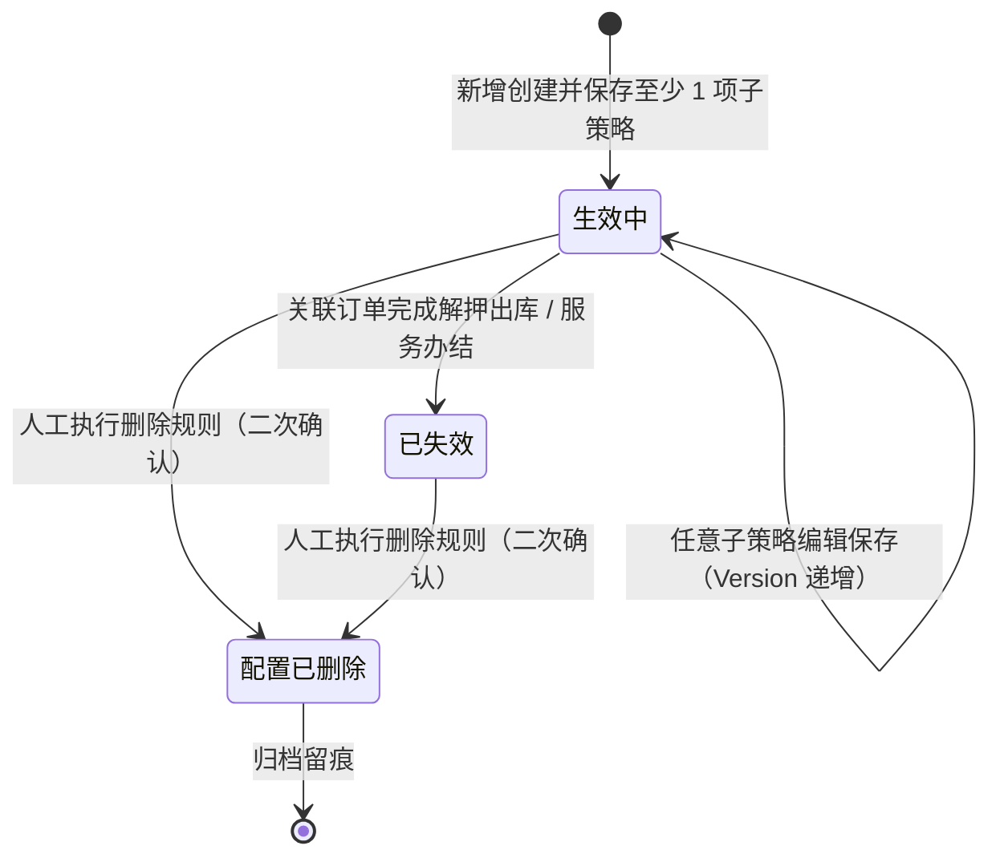

# 订单预警配置主PRD

> **模块定位**：供应链金融纯商业与金融风控规则的一站式综合策略中枢。面向抵押、质押及监管服务订单，在单一配置页面内一站式编排解押/监管超时、市场价格下跌、动态盘点异常、定期巡检超期、监管业务率双控超限及智能贷中风控模型 6 类风控子策略。支持各策略逐条独立保存、独立绑定严重等级与独立通知升级分流，实现“一单一揽子风控”的精细化管控闭环。  
> **版本**：V4.1 | **更新时间**：2026-09-18 | **责任人**：森云科技（Senyun Technology）  
> **编写依据**：[订单预警配置字段清单.md](./订单预警配置字段清单.md) 是本模块所有字段定义、枚举与页面展示的唯一定义来源；[订单预警配置业务规则规格.md](./订单预警配置业务规则规格.md) 是本模块状态机、逐条策略保存机制、监管业务率双控分线解除算法、并发控制及贷中台账联动的唯一定义来源；配套衍生原型输入详见 [订单预警配置_ASCII_列表页.md](./订单预警配置_ASCII_列表页.md)、[订单预警配置_ASCII_新增编辑页.md](./订单预警配置_ASCII_新增编辑页.md) 与 [订单预警配置_ASCII_详情页.md](./订单预警配置_ASCII_详情页.md)。

---

## 一、业务背景与业务痛点

### 1.1 业务背景
在大宗商品（如电解铜、铝锭、热轧卷板）存货质押融资与仓储监管业务中，货物在库周期长、大宗市场价格波动剧烈、仓储现场作业繁杂。资方、保理商与监管企业不仅需要防范现场偷盗跑冒的物理风险，更需要时刻盯防市场跌价导致穿仓、货权逾期不解押、现场盘点账实不符、监管巡检脱岗等商业与金融风险。订单预警配置正是将这些多维度的金融风控规则聚合落地的核心策略中心。

### 1.2 核心业务痛点
1. **【策略分散割裂维护成本高】**：过去跌价、超时、巡检等策略分散在各个菜单，风控人员面对一笔质押订单需要跳转多个页面重复配置，极易漏配；
2. **【监管业务率处置缺乏分线闭环】**：传统率指标告警通常只设单一阈值，缺乏“补仓线预警”与“平仓线强控”的双阈值阶梯与分线独立解除机制；6.2 统一以「监管业务率双控」策略承接，展示名随订单类型区分抵押率/质押率/监管业务率；
3. **【商业风险与物理安防混杂】**：早期版本将摄像头掉线等物理事件与金融跌价混在一个配置表单中，造成职责不清；
4. **【缺乏子项级精准分流】**：所有告警都推给同一个责任人，无法实现“跌价推给金融风控部、巡检超时推给现场监管组”的精细化分工；
5. **【办结后策略空跑产生僵尸告警】**：订单解押或办结出库后，后台策略未能自动失效，持续计算跌价并推送错误告警，干扰正常运营。

---

## 二、功能范围

| 包含功能范围 (In Scope) | 不包含功能范围 (Out of Scope) |
| :--- | :--- |
| - **一站式 6 类商业风控子策略卡片配置**：<br/>  1. **超时预警**：解抵押/解质押/监管服务到期前或超期天数监控；<br/>  2. **价格下跌**：挂钩外部盯市估值，设定货值跌幅触发比例；<br/>  3. **盘点异常**：开启后实时监听盘点任务结果，账实差异自动触发；<br/>  4. **巡检异常**：支持多位巡检人配置独立周期，超期未打卡即时告警；<br/>  5. **监管业务率双控预警**：补仓线与平仓线双阈值联动、分线独立解除方式、整卡单等级绑定；<br/>  6. **贷中风控预警**：对接智风控模型，异步校验与风险决策结果联动；<br/>- **逐条策略独立编辑与保存**：单页面内各卡片独立维护 Switch 开关、独立保存，与后端引擎细粒度对齐；<br/>- **订单唯一绑定约束（一单一配）**：单笔订单 1:1 绑定 1 条有效综合规则，防重复冲突；<br/>- **各策略独立分流与升级**：各启用子项分别独立绑定【预警等级】字典（菜单：`预警配置 → 预警等级`，代号 03/01），独立配置短信/邮件通知人与升级天数；<br/>- **贷中风控台账自动同步**：贷中子策略保存后幂等同步至【贷中风控管理】台账（菜单：`预警信息 → 贷中风控管理`，代号 02/03）；<br/>- **订单生命周期联动失效**：订单办结出库时，规则自动置为【已失效】，未结案流水自动作废。 | - **整单人工停用状态**：6.2 订单侧规则不设整单“停用”态（仅生效中/已失效/配置已删除），精细化暂停由各策略子项的 Switch 开关独立控制；<br/>- **审批流机制**：配置策略类单据保存即生效，系统设计不设草稿箱与待审核态；<br/>- **物理硬件规则配置**：摄像头离线、门禁开锁、温湿度等硬件规则已彻底收口至 [设备预警配置（03/02）](../02设备预警配置/设备预警配置主PRD.md)；<br/>- **物联穿透规则人工配置**：设备告警基于仓库空间拓扑自动向在押订单穿透，订单侧只读展示，无需且不可人工配置穿透规则；<br/>- **版本树与历史回滚**：6.2 仅提供 `Version` 乐观锁防并发并发冲突，不提供历史配置回滚；<br/>- **押品预警流水现场处置**：流水解除、复核与材料提交归属于 [押品预警信息（02/02）](../../02-预警信息/02押品预警信息/押品预警信息主PRD.md)；<br/>- **移动端页面配置**：6.2 不提供移动端规则配置，规则维护强约束在 PC 端完成。 |

---

## 3. 模块定位与系统链路

### 3.1 模块定位矩阵

| 项目 | 内容 |
| :--- | :--- |
| **模块层级** | **【配置策略层】**（订单级纯商业与金融风控综合策略包） |
| **核心职责** | 集中定义「该订单开启哪些商业风险项、各达何种阈值、以何等级、分别通知谁、如何超时升级」 |
| **配置来源** | 具备风控权限的操作人员在 PC 端手动新增/编辑，各策略卡片独立保存 |
| **适用订单类型** | 统一支持三类有效业务订单：`抵押`、`质押`、`监管服务`（旧历史“监管”枚举已彻底下线） |
| **上游依赖** | **【预警等级】字典（菜单：预警配置 → 预警等级，代号 03/01）**：提供启用的严重度字典与订单穿透标记；<br/>**订单主数据**：提供在押订单货品清单、期限、货值及生命周期状态；<br/>**外部盯市估值与智风控平台**：提供实时大宗商品行情价格与贷中模型决策结果；<br/>**盘点与巡检任务台账**：提供实际现场作业打卡记录与完成时间戳。 |
| **下游影响** | **风控判定引擎**：保存后即时同步各子策略至对应微服务判定引擎，持续实时计算；<br/>**【押品预警信息】台账（菜单：预警信息 → 押品预警信息，代号 02/02）**：指标越限命中时，固化触发时刻的子策略快照，生成订单告警流水；<br/>**【贷中风控管理】台账（菜单：预警信息 → 贷中风控管理，代号 02/03）**：启用了贷中风控子项时，自动在贷中台账建立对应监控凭据。 |
| **实体对应关系** | **订单与规则**：1 笔业务订单 1:1 对应 1 条有效综合规则包（ORD-R04）；<br/>**规则与策略子项**：1 条综合规则包含 1~6 项已激活策略（至少保留 1 项开启，ORD-R07a）。 |

### 3.2 端到端系统链路图

```mermaid
flowchart TD
    subgraph S1[上游输入与源头依赖]
        A1[【预警等级】字典(03/01)<br/>等级ID / 权重排序]
        A2[订单主数据与货品清单<br/>抵押 / 质押 / 监管服务]
        A3[外部市价行情与智风控<br/>日终盯市价 / 贷中风控模型]
        A4[仓储作业任务中心<br/>盘点任务结果 / 巡检打卡时间]
    end

    subgraph S2[订单综合风控策略中枢]
        B1[订单预警配置<br/>一站式多策略表单]
        A1 --> B1
        A2 --> B1
        A3 --> B1
        A4 --> B1
        B1 -->|各子项逐条独立保存| B2[生效中综合策略包]
        B2 --> P1[超时策略引擎]
        B2 --> P2[价格跌价引擎]
        B2 --> P3[盘点/巡检引擎]
        B2 --> P4[监管业务率双控引擎]
        B2 --> P5[贷中模型调度引擎]
    end

    subgraph S3[下游押品预警与协同处置]
        P1 & P2 & P3 & P4 & P5 -->|实时计算越限命中| C1[【押品预警信息】台账(02/02)<br/>固化触发时刻策略快照]
        C1 -->|各子项精准分流| D1[通知中心<br/>短信 / 邮件推送]
        C1 -->|超时未处置| D2[超时升级引擎<br/>已选渠道逐级上报]
        B2 -.->|贷中策略开启同步| E1[【贷中风控管理】台账(02/03)<br/>台账联动]
        F1[【设备预警信息】台账(02/01)] -.->|物联空间拓扑穿透| C1
    end
```

### 3.3 6 类风控子策略权威配置矩阵

| 序号 | 预警子项名称 | 适用订单类型 | 核心判定逻辑与阈值配置 | 严重等级与通知升级 | 解除方式 |
| :---: | :--- | :--- | :--- | :--- | :--- |
| **1** | **解抵押/解质押/监管服务超时** | 抵押、质押、监管服务 | 自动平铺订单货物批次，配置超时天数 $D_{\text{timeout}}$；到期前预警或超期未解押告警 | 独立绑定 1 档等级；独立短信/邮件通知及升级 | 订单完成解押出库或监管服务结案 |
| **2** | **价格下跌预警** | 仅限抵押、质押 | 挂钩大宗商品最新盯市单价，设定跌幅比例阈值 $P_{\text{drop}}\%$；跌幅超限触发 | 独立绑定 1 档等级；独立短信/邮件通知及升级 | 市价回升或货主追加保证金/质押物 |
| **3** | **盘点异常预警** | 抵押、质押、监管服务 | 开关启用即生效；监听盘点任务结果，当盘点实际件数/重量 $\ne$ 账面在押数时即刻告警 | 独立绑定 1 档等级；独立短信/邮件通知及升级 | 盘点差异审批通过或完成账实平账 |
| **4** | **巡检异常预警** | 抵押、质押、监管服务 | 支持添加多位现场巡检人员，每人分别配置独立巡检周期（天）；超期未打卡即刻告警 | 独立绑定 1 档等级；独立短信/邮件通知及升级 | 责任人补交有效现场巡检记录 |
| **5** | **监管业务率双控预警** | 抵押、质押、监管服务 | **双阈值 + 分线解除 + 单等级**：配置补仓线 $LTV_{\text{margin}}$ 与平仓线 $LTV_{\text{close}}$（$LTV_{\text{margin}} < LTV_{\text{close}}$）；两线同时命中取平仓线 | **整卡单等级**（不可分线配等级）；独立通知升级 | 按命中线展示对应解除方式（追加质押物/保证金/还款） |
| **6** | **贷中风控模型预警** | 仅限抵押、质押 | 单选绑定的风控模型（如仓单尽调产品-版本1）；支持模型输入项数据源映射（个人/企业主体）及输出项指标预警判定（评分/额度运算符及拒绝结果）；模型回调指标越限或结果拒绝时触发告警 | 独立绑定 1 档等级；独立短信/邮件通知及升级 | 贷中风控台账人工复核或线下补充材料 |

---

## 4. 业务场景与用户故事

| 场景编号与名称 | 触发角色 | 核心交互与风控约束 | 业务价值 |
| :--- | :--- | :--- | :--- |
| **场景 1【新增质押订单一揽子综合风控】(S01)** | 供应链金融风控经理 | 选择一笔新增质押订单（电解铜 500 吨，货值 3500 万元）；系统自动回显货品明细；在同一页面内依次开启【价格下跌】（跌幅超 10%）、【监管业务率双控预警】（补仓线 70%，平仓线 80%）与【盘点异常】；为各子项分别选定等级与通知人，逐张卡片点击【保存】。 | 实现对高价值在押资产的多维全景监控，一次性配齐核心商业风控策略。 |
| **场景 2【监管业务率双控平仓优先命中】(S02)** | 风险量化分析师 | 市场价格暴跌导致某质押订单实时质押率达 85%，同时越过补仓线（70%）与平仓线（80%）；风控引擎按规则严格以平仓线（最高危险度）触发流水，解除弹窗仅展示平仓线解除路径（强制还款或强平）。 | 严守资方本金安全底线，双线重叠时坚决执行高阶风控阻断。 |
| **场景 3【关闭子策略至少保留一项有效】(S03)** | 业务运营主管 | 订单执行后期，运营人员尝试将仅剩的【巡检异常】Switch 关闭并保存；系统前端与服务端强校验拦截，提示「综合预警规则必须至少保留 1 项有效开启的策略」（ORD-R07a）。 | 杜绝产生没有任何监控能力的“空壳配置”，保障在押资产风控全覆盖。 |
| **场景 4【编辑阈值即时重算置换旧流水】(S04)** | 风控主管 | 研判市场行情后，风控人员将某订单跌价阈值由 15% 调严至 8% 并保存；系统触发即时重算；若该订单当前存在处于待处置状态的旧预警流水，系统自动作废旧流水并按新阈值生成新流水（ORD-C07）。 | 确保预警事实与最新风控决策口径强一致，避免存量歧义流水误导处置人员。 |
| **场景 5【订单办结出库规则系统自动失效】(S05)** | 仓储监管调度员 | 借款企业全额还款，质押订单执行最终解押出库并办结；系统后台自动将该订单对应的预警综合规则变迁为【已失效】终态，未结案预警置为已作废，终止定时升级任务。 | 规避资产退出监管后的误报与幽灵骚扰，实现策略全生命周期闭环管理。 |
| **场景 6【并发编辑乐观锁冲突保护】(S06)** | 风控操作员 | 两位风控员同时打开同一订单编辑巡检策略；后提交者提交保存时，因当前规则 Version 已被递增而触发乐观锁冲突拦截，浮窗提示「数据已被他人修改，请刷新重试」。 | 保证金融级策略保存的数据强一致性，杜绝多操作员覆盖修改。 |

---

## 5. 状态机与动作能力矩阵

### 5.1 规则状态定义
订单预警配置采用精简的三态生命周期，**不设整单人工停用状态**，具体策略启闭由各子策略 Switch 独立控制：

| 状态名称 | 状态编码 | 业务含义 | 是否终态 | 列表可见性 | 变迁条件说明 |
| :--- | :--- | :--- | :---: | :---: | :--- |
| **生效中** | `ACTIVE` | 规则正常生效运行，包含的启用子策略持续进行实时风险判定 | 否 | 可见 | 新增保存成功（至少开启 1 项子策略）即进入 |
| **已失效** | `INACTIVE` | 订单已还款办结、完全出库或解除监管，系统自动将其置为失效 | **是** | 可见 | 系统任务监听订单终态后自动变迁；不可编辑，不可恢复 |
| **配置已删除** | `DELETED` | 规则已被软删除，退出风控策略运行池，底层审计日志永久留痕 | **是** | **不可见** | 人工在列表执行删除；存量未处理预警自动置为已作废 |

### 5.2 规则状态机流转图



### 5.3 动作能力控制矩阵

| 动作名称 | 生效中 (`ACTIVE`) | 已失效 (`INACTIVE`) | 配置已删除 (`DELETED`) | 核心控制与风控约束 |
| :--- | :---: | :---: | :---: | :--- |
| **查看详情** | ✅ | ✅ | ❌ | 只读展示该订单 6 大卡片完整配置快照及当前数据版本 Version |
| **编辑规则** | ✅ (逐条保存) | ❌ (不可编辑) | ❌ | 订单类型与单号只读锁定；按卡片独立编辑保存；至少保留 1 项开启 |
| **删除规则** | ✅ | ✅ | ❌ | 软删除；级联将该规则产生的所有未处理押品预警置为【已作废】 |
| **子策略开关切换** | ✅ | ❌ | ❌ | 关闭时校验剩余开启项数 $\ge 1$（ORD-R07a）；关闭成功后终止对应升级 Job |
| **贷中台账同步** | ✅ (自动触发) | ❌ | ❌ | 保存贷中风控子项后，系统异步幂等写入【贷中风控管理】台账（菜单：`预警信息 → 贷中风控管理`，代号 02/03） |

---

## 6. 页面交互规格索引

### 6.1 规则列表页（`/物联网IOT与预警/预警配置/订单预警配置`）
- **筛选区域**：
  - 筛选项：`规则名称`（模糊文本）、`订单编号`（精确输入）、`订单类型`（下拉单选：全部/抵押/质押/监管服务）、`已启用预警项`（下拉多选：6类子策略）、`状态`（生效中/已失效）、【查询】与【重置】；
  - 右上角操作区：【+ 新增订单预警规则】主按钮。
- **数据表格（10 列标准呈现）**：
  `序号`、`规则名称`、`关联订单号`、`订单类型`、`在押总货值`、`已启用预警策略`（以彩色 Tag 聚合展示开启的子项）、`规则状态`（生效中绿点 / 已失效灰点）、`更新人/更新时间`（双行）、`操作`。
- **行操作呈现**：
  - `生效中` 行：【编辑】、【删除】、【详情】；
  - `已失效` 行：【删除】、【详情】。

### 6.2 规则新增与编辑页（`/新增` · `/编辑/:id`）
- **顶部公共区**：
  - 左侧：【返回/取消】（Dirty 状态确认拦截）；
  - 核心字段：`规则名称`（必填，≤50字）、`关联订单选择器`（带出订单类型、货主、在押货物清单、估值货值；编辑态锁定只读）；
  - 右侧：当前规则版本 `Version: vX` 只读标签。
- **六大风控策略卡片（逐条独立保存）**：
  - 每个卡片标题行包含 `Switch` 开关与【收起/展开】；卡片底部操作区为：**【取消修改】**（脏态时出现）、**【关闭并停用】**（已保存为启用态时出现，destructive）、**【保存该策略】**（primary）；左侧展示 `● 未保存` / `✓ 已保存` 状态；
  - **【取消修改】**：放弃当前卡片未保存变更，恢复至该策略上次保存快照，不离开页面；
  - **【关闭并停用】**：对已启用且已保存的策略，二次确认后以 `Switch=OFF` 自动提交保存；若其为最后 1 项已启用策略则 ORD-R07a 阻断；确认文案不向用户展示规则编号；
- **各卡片通用 · 通知与升级配置**：
  - **通知渠道（选填）**：复选框组 `短信` / `邮件`；移动端「押品预警信息」待处置红点自动展示，无需配置；
  - **预警通知对象（选填）**：仅勾选短信/邮件后展示组织选择器；未配置对象时不阻断保存，外部渠道不下发；
  - **启用升级预警**：Checkbox 文案**随已选通知渠道动态联动**（如仅勾选邮件则展示「将通过邮件逐级上报」）；开启后「持续未解除天数」与「升级预警对象」仍为必填；
  - **卡片 1【解抵押/解质押/监管服务超时】**：平铺订单货物，配置超时天数、预警等级、通知渠道与升级对象；
  - **卡片 2【价格下跌预警】**：配置跌幅百分比（%）、预警等级、通知渠道与升级对象；
  - **卡片 3【盘点异常预警】**：开关勾选即启用，配置预警等级、通知渠道与升级对象；
  - **卡片 4【巡检异常预警】**：支持动态添加巡检责任人行（人员选择 + 巡检周期天数），配置等级与通知升级；
  - **卡片 2【监管业务率双控预警】**：录入补仓线（%）与平仓线（%），分别配置两线的解除方式；整卡单选 1 档预警等级，配置通知升级；
  - **卡片 6【贷中风控模型预警】**：单选风控模型（如仓单尽调产品-版本1）；选定模型后呈现左右两栏布局：左栏为【输入项】数据映射（个人姓名/电话/身份证、企业名称/电话/信用代码自选或自动匹配订单主体），右栏为【输出项】触发条件（产品评分与额度的最小值/运算符/最大值区间、决策结果选择）；底部独立配置预警等级与通知升级。

### 6.3 规则详情页（`/详情/:id`）
- 只读呈现 6 大卡片的配置快照；未启用的策略卡片展示为“未启用”置灰态；
- 底部展示【操作审计日志】（包含各子项修改人、时间戳、前后阈值镜像）。

---

## 7. 核心业务规则索引

| 规则编号与名称 | 核心控制逻辑摘要 | 规则规格唯一定义章节 |
| :--- | :--- | :--- |
| **【规则名称租户内唯一】(ORD-R03)** | 规则名称必填，最大 50 字，同一租户内唯一 | [业务规则规格 §五.1](./订单预警配置业务规则规格.md#ord-r03规则名称租户内唯一) |
| **【一单一配唯一性约束】(ORD-R04)** | 单笔抵质押或监管服务订单在租户内仅能绑定 1 条有效规则 | [业务规则规格 §五.1](./订单预警配置业务规则规格.md#ord-r04一单一配唯一性约束) |
| **【硬件类非法传参拦截】(ORD-R05)** | 服务端强拦截温湿度、门禁等 6.1 硬件类类型，拒绝写入 | [业务规则规格 §五.1](./订单预警配置业务规则规格.md#ord-r05硬件类非法传参拦截) |
| **【编辑时订单锁定只读】(ORD-R06)** | 编辑页关联订单号与订单类型强制置灰只读，严禁换单 | [业务规则规格 §五.1](./订单预警配置业务规则规格.md#ord-r06编辑时订单锁定只读) |
| **【逐条策略保存与乐观锁】(ORD-R07)** | 卡片独立提交保存；每次提交强校验 Version 乐观锁并原子递增 | [业务规则规格 §五.1](./订单预警配置业务规则规格.md#ord-r07逐条策略保存与乐观锁) |
| **【至少保留一项有效策略】(ORD-R07a)**| 关闭子策略 Switch 保存时，整单必须保留至少 1 项开启 | [业务规则规格 §五.1](./订单预警配置业务规则规格.md#ord-r07a至少保留一项有效策略) |
| **【预警通知对象选填】(ORD-R19)** | 勾选短信/邮件后预警通知对象为选填，未配置不阻断保存 | [业务规则规格 §五.2](./订单预警配置业务规则规格.md#ord-r19预警通知对象选填) |
| **【升级文案与渠道联动】(ORD-R21)** | 升级 Checkbox 文案与升级下发渠道随 `notify_channels` 动态联动 | [业务规则规格 §五.2](./订单预警配置业务规则规格.md#ord-r21升级文案与渠道联动) |
| **【监管业务率双控单等级约束】(ORD-R10)** | 补仓/平仓双线仅绑定 1 档预警等级，按 `sort_order` 比较 | [业务规则规格 §五.2](./订单预警配置业务规则规格.md#ord-r10) |
| **【监管业务率双控双阈值逻辑性】(ORD-R13)** | 补仓线阈值必须严格小于平仓线阈值（$LTV_{\text{margin}} < LTV_{\text{close}}$） | [业务规则规格 §五.2](./订单预警配置业务规则规格.md#ord-r13) |
| **【双线同时命中平仓优先】(ORD-R13d)**| 双线同时越界时，按平仓线触发高危流水；解除仅展示平仓解除方式 | [业务规则规格 §五.2](./订单预警配置业务规则规格.md#ord-r13d双线同时命中平仓优先) |
| **【阈值修改重算置换旧流水】(ORD-C07)**| 阈值修改保存后触发即时重算；若仍命中，作废未结案旧流水并置换新流水 | [业务规则规格 §六](./订单预警配置业务规则规格.md#ord-c07阈值修改重算置换旧流水) |
| **【订单终态自动失效】(ORD-C08)** | 订单办结或出库时，系统任务自动将综合规则置为已失效，未结案流水作废 | [业务规则规格 §六](./订单预警配置业务规则规格.md#ord-c08订单终态自动失效) |

---

## 8. 非功能性需求

### 8.1 性能要求
- **多策略聚合表单加载**：进入新增/编辑页时，回显 6 大策略及订单货物明细时间 $\le 1.0\text{s}$；
- **逐条策略保存响应**：单个卡片点击保存至服务端写入并同步引擎时间 $\le 0.5\text{s}$；
- **日终盯市批量重算**：日终市价更新后，全量在押订单监管业务率（抵押率/质押率/监管业务率）与跌价批量试算耗时 $\le 15\text{分钟}$。

### 8.2 安全合规
- **订单数据权限隔离**：操作员仅能选择和查看管辖机构与仓库范围内的订单；
- **金融审计证据效力**：所有策略保存均记录快照镜像，司法存证支持导出不可变证据链。

---

## 修订记录

| 日期 | 版本 | 变更内容说明 | 影响范围 | 修订人 |
| :--- | :--- | :--- | :--- | :--- |
| 2026-09-15 | V4.0 | 收口三类订单类型（抵押/质押/监管服务），下线历史“监管”类型。 | 全模块文档 | AI PM / 森云科技 |
| 2026-09-16 | V4.0.1 | 汉化交互术语，统一 R/C/P 规则自解释命名。 | 规则清单 | AI PM / 森云科技 |
| 2026-09-18 | **V4.1** | **标杆排版深度升级（全面对齐《入库记录》《出库记录》规范）**：<br/>1. 重构功能范围为 Markdown 左右对称对比表格（In Scope vs Out of Scope）；<br/>2. 绘制标准的 Mermaid 三段式全景系统链路图（上游依赖 $\rightarrow$ 策略中枢 $\rightarrow$ 下游协同）；<br/>3. 落地 4 列标准业务场景故事矩阵（编号名称、触发角色、交互风控、业务价值）；<br/>4. 完善 6 大风控子策略权威表格与动作能力矩阵；<br/>5. 全文条理化重排与重点黑体引导，阅读舒适度大幅提升。 | 订单预警配置主 PRD 全文 | AI PM / 森云科技 |
| 2026-09-22 | **V4.2** | 策略卡片底部新增「取消修改」「关闭并停用」交互规格；确认弹窗用户文案不展示规则编号。 | §6.2 新增/编辑页 | AI PM / 森云科技 |
| 2026-09-22 | **V4.3** | 预警通知对象改选填（ORD-R19）；升级 Checkbox 文案与下发渠道随通知渠道联动（ORD-R21）。 | §6.2、§7 规则索引 | AI PM / 森云科技 |
