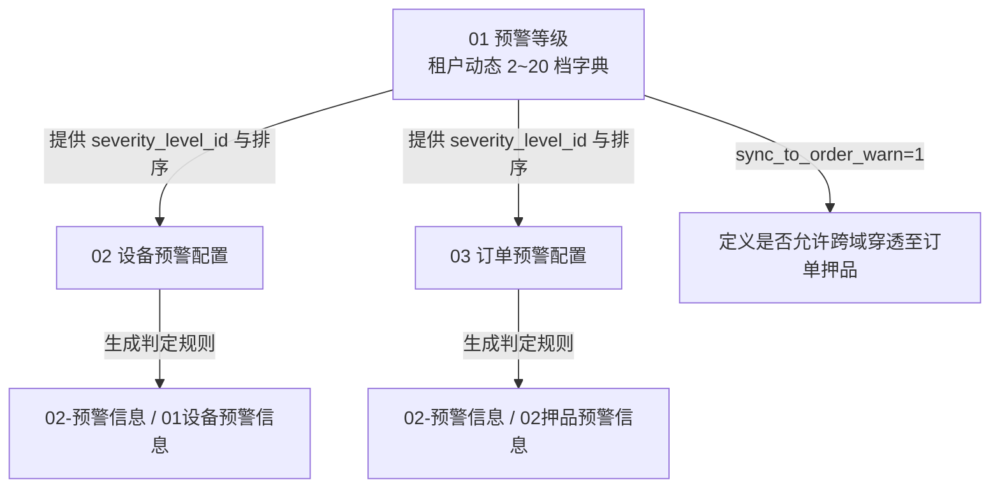

# 预警配置总索引

> **版本**：V1.0 | **更新日期**：2026-08-24
>
> **业务定位**：SYZC 存货监管系统风控与预警规则中枢，负责统一管理租户级动态预警等级字典底座（2~20档），以及物联网设备端与押品商业端的预警阈值、异常检测条件、通知渠道与超时升级策略。
>
> **上级索引**：[SYZC 6.2 版本总览与索引](../README.md)
>
> **跨域关联**：
> - 为 [02-预警信息](../02-预警信息/预警信息总索引.md) 下的设备预警信息与押品预警信息提供计算与判定基准；
> - 为 [01-物联网IOT管理](../01-物联网IOT管理/物联网IOT管理总索引.md) 下的设备资产下发离线与数值监控阈值。

---

## 一、模块目录结构

```text
03-预警配置/
├── 预警配置总索引.md           # 本文件
├── 01预警等级/                 # 租户动态 2~20 档严重等级字典、颜色、权重与同步订单开关
├── 02设备预警配置/             # 5 大类 IoT 设备预警规则、温湿度上下限、离线阈值与升级策略
└── 03订单预警配置/             # 6 大类抵质押订单预警阈值、贷中模型绑定、通知渠道与升级策略
```

---

## 二、子模块全景清单

| 模块序号 | 功能模块 | 核心能力与底座定义 | PRD 规格入口 | 字段清单 | 业务规则 | 线框/原型 |
| :---: | :--- | :--- | :--- | :--- | :--- | :--- |
| **01** | **预警等级** ⭐公共底座 | 租户级 2~20 档动态等级、标签颜色、排序权重、同步订单预警开关（02/03 共用底座） | [主PRD V3.0](./01预警等级/预警等级主PRD.md) | [字段清单](./01预警等级/预警等级字段清单.md) | [规则规格](./01预警等级/预警等级业务规则规格.md) | [列表](./01预警等级/预警等级_ASCII_列表页.md) · [详情](./01预警等级/预警等级_ASCII_详情页.md) · [新增编辑](./01预警等级/预警等级_ASCII_新增编辑页.md) |
| **02** | **设备预警配置** | 5 大类设备异常（挂锁/人脸/温湿度/离线/破坏）阈值规则、通知对象、多级超时升级 | [主PRD V3.0](./02设备预警配置/设备预警配置主PRD.md) | [字段清单](./02设备预警配置/设备预警配置字段清单.md) | [规则规格](./02设备预警配置/设备预警配置业务规则规格.md) | [列表](./02设备预警配置/设备预警配置_ASCII_列表页.md) · [详情](./02设备预警配置/设备预警配置_ASCII_详情页.md) · [新增编辑](./02设备预警配置/设备预警配置_ASCII_新增编辑页.md) |
| **03** | **订单预警配置** | 6 大类订单风险（跌价/超期/集中度/履约等）阈值、贷中模型校验、多渠道通知 | [主PRD V3.0](./03订单预警配置/订单预警配置主PRD.md) | [字段清单](./03订单预警配置/订单预警配置字段清单.md) | [规则规格](./03订单预警配置/订单预警配置业务规则规格.md) | [列表](./03订单预警配置/订单预警配置_ASCII_列表页.md) · [详情](./03订单预警配置/订单预警配置_ASCII_详情页.md) · [新增编辑](./03订单预警配置/订单预警配置_ASCII_新增编辑页.md) |

---

## 三、预警等级底座与规则配置联动模型



---

## 四、配置核心规范与治理原则

1. **唯一持久化 ID（SSOT）**：
   - 等级配置以 `severity_level_id` 为稳定主键；
   - 设备规则以 `iot_rule_id` 为稳定主键；
   - 订单规则以 `rule_id` 为稳定主键。
   - 规则与流水中严禁使用显示名称或排序号作为外键绑定。
2. **规则变更与历史快照隔离**：
   - 规则的阈值、等级、通知人调整仅对后续新产生的事件生效；
   - 严禁通过修改规则配置回写历史已产生的告警流水快照。
3. **历史数据迁移参考**（见 [04-历史迁移与割接方案](../04-历史迁移与割接方案/历史迁移总索引.md)）：
   - [03 历史数据迁移与回滚技术方案](../04-历史迁移与割接方案/01设备侧规则与流水迁移/03历史数据迁移与回滚技术方案.md)
   - [6.1→6.2 门禁事务与设备事务通知兼容映射](../04-历史迁移与割接方案/03业务兼容映射/6.1→6.2 门禁事务与设备事务通知兼容映射.md)
   - [6.1→6.2 订单规则与押品流水迁移](../04-历史迁移与割接方案/02订单侧规则与流水迁移/6.1→6.2 订单规则与押品流水迁移.md)
