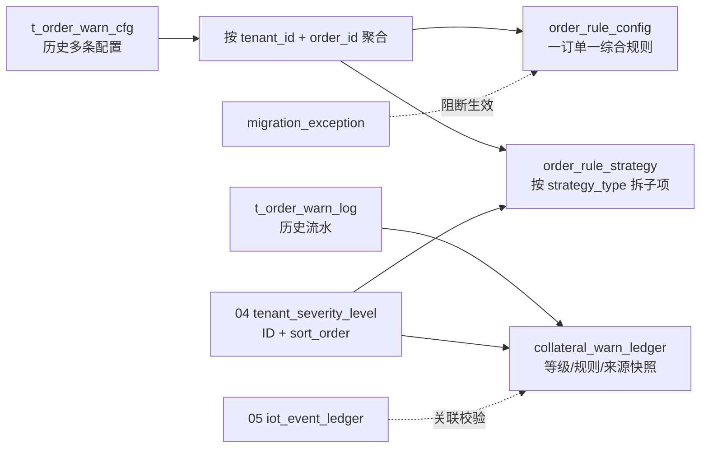

# 03/03 订单预警配置历史数据迁移与回滚技术方案

> **文档定位**：指导 6.1 订单预警配置与押品预警流水迁移到 6.2 的**综合规则主表 + 策略子项表 + 押品预警台账**模型。本文是迁移实施、校验、回滚和异常处置的唯一依据。
>
> **版本**：V2.0 | **编制日期**：2026-08-21 | **适用环境**：MySQL 8.0+ / TiDB
>
> **上级索引**：[历史迁移总索引](../历史迁移总索引.md)
>
> **关联基准**：[订单预警配置字段清单](../../03-预警配置/03订单预警配置/订单预警配置字段清单.md) · [订单预警配置业务规则规格](../../03-预警配置/03订单预警配置/订单预警配置业务规则规格.md) · [03/01 预警等级业务规则规格](../../03-预警配置/01预警等级/预警等级业务规则规格.md)

## 一、迁移目标与不可违反的约束

1. 同一租户同一订单的历史配置先聚合为**一条** `order_rule_config`，再按预警类型拆成 `order_rule_strategy` 子项；不能把历史每条配置直接写成一条新主规则。
2. 6.2 规则等级只保存 04 的 `severity_level_id`，展示字段由该 ID 回填。严重度比较只使用 `sort_order`；`L1~L5` 仅可作为某些租户的旧编码示例。
3. 历史配置中的通知渠道、对象、升级天数/对象迁入对应策略子项；`notify_channels` 迁移时须剔除「站内信」（6.2 改为系统小角标自动更新，不可配置）及误写入的「Webhook」（6.2 外部渠道仅保留短信/邮件）；抵/质押率历史配置必须拆成补仓线、平仓线及各自等级。
4. IoT 五类继续区分 `LEGACY_IOT` 与 `IOT_PENETRATION`，不得伪装成 06 商业策略；有设备事件关联的历史记录保留 `related_device_event_id`。
5. 6.2 运行时 `fuse_status` 统一写 `NONE`。旧熔断值仅写 `legacy_fuse_status` 审计字段，不得在迁移时锁定出库或解押。
6. 迁移必须按 `migration_batch_id` 幂等；回滚只允许删除本批次产生的数据，禁止按状态、时间或全表删除。

## 二、目标模型



### 2.1 主表和子项表最小字段

```sql
CREATE TABLE IF NOT EXISTS order_rule_config (
  id BIGINT UNSIGNED NOT NULL AUTO_INCREMENT,
  rule_id VARCHAR(64) NOT NULL,
  tenant_id VARCHAR(64) NOT NULL,
  order_id VARCHAR(64) NOT NULL,
  order_no VARCHAR(64) NOT NULL,
  order_type VARCHAR(16) NOT NULL,
  rule_name VARCHAR(50) NOT NULL,
  status VARCHAR(16) NOT NULL DEFAULT 'ACTIVE',
  migration_batch_id VARCHAR(64) NULL,
  migration_status VARCHAR(24) NOT NULL DEFAULT 'MIGRATED',
  source_rule_count INT NOT NULL DEFAULT 0,
  version INT NOT NULL DEFAULT 1,
  is_deleted TINYINT(1) NOT NULL DEFAULT 0,
  created_by VARCHAR(64) NULL,
  created_time DATETIME NOT NULL,
  updated_by VARCHAR(64) NULL,
  updated_time DATETIME NOT NULL,
  PRIMARY KEY (id),
  UNIQUE KEY uk_rule_id (rule_id),
  UNIQUE KEY uk_active_tenant_order (tenant_id, order_id, status, is_deleted),
  KEY idx_migration_batch (migration_batch_id)
) ENGINE=InnoDB DEFAULT CHARSET=utf8mb4;

CREATE TABLE IF NOT EXISTS order_rule_strategy (
  id BIGINT UNSIGNED NOT NULL AUTO_INCREMENT,
  strategy_id VARCHAR(64) NOT NULL,
  rule_id VARCHAR(64) NOT NULL,
  tenant_id VARCHAR(64) NOT NULL,
  strategy_type VARCHAR(32) NOT NULL,
  is_enabled TINYINT(1) NOT NULL DEFAULT 1,
  strategy_params JSON NOT NULL,
  severity_level_id VARCHAR(64) NULL,
  severity_code VARCHAR(16) NULL,
  severity_name VARCHAR(32) NULL,
  severity_color VARCHAR(16) NULL,
  sort_order_snapshot INT NULL,
  margin_call_severity_level_id VARCHAR(64) NULL,
  close_out_severity_level_id VARCHAR(64) NULL,
  notify_channels JSON NULL,
  notify_user_ids JSON NULL,
  upgrade_days INT NOT NULL DEFAULT 0,
  upgrade_user_ids JSON NULL,
  migration_batch_id VARCHAR(64) NULL,
  source_rule_ids JSON NULL,
  version INT NOT NULL DEFAULT 1,
  created_time DATETIME NOT NULL,
  updated_time DATETIME NOT NULL,
  PRIMARY KEY (id),
  UNIQUE KEY uk_strategy_id (strategy_id),
  UNIQUE KEY uk_rule_strategy_type (rule_id, strategy_type),
  KEY idx_strategy_batch (migration_batch_id)
) ENGINE=InnoDB DEFAULT CHARSET=utf8mb4;
```

`strategy_params` 的迁移结构示例：

```json
{
  "timeout_items": [{"business_key": "QR-001", "days": 30}],
  "price_drop_ratio": 0.10,
  "inspection_items": [{"user_id": "U-005", "cycle_days": 7}],
  "margin_call_ltv": 0.75,
  "close_out_ltv": 0.85,
  "model_product_id": "MODEL-001"
}
```

迁移控制表必须先建好，保证异常和回滚范围可审计：

```sql
CREATE TABLE IF NOT EXISTS migration_batch (
  migration_batch_id VARCHAR(64) NOT NULL,
  module VARCHAR(32) NOT NULL,
  source_version VARCHAR(16) NOT NULL,
  status VARCHAR(24) NOT NULL,
  started_at DATETIME NOT NULL,
  finished_at DATETIME NULL,
  PRIMARY KEY (migration_batch_id)
);

CREATE TABLE IF NOT EXISTS migration_exception (
  id BIGINT UNSIGNED NOT NULL AUTO_INCREMENT,
  migration_batch_id VARCHAR(64) NOT NULL,
  tenant_id VARCHAR(64) NULL,
  source_table VARCHAR(64) NOT NULL,
  source_id VARCHAR(64) NULL,
  exception_type VARCHAR(64) NOT NULL,
  detail JSON NOT NULL,
  resolution_status VARCHAR(24) NOT NULL DEFAULT 'OPEN',
  resolved_by VARCHAR(64) NULL,
  resolved_at DATETIME NULL,
  PRIMARY KEY (id),
  KEY idx_exception_batch (migration_batch_id, resolution_status)
);
```

### 2.2 历史台账字段补充

`collateral_warn_ledger` 必须至少具备：`warn_id`、租户/订单快照、`rule_id`、`strategy_type`、`severity_level_id`、`severity_code`、`severity_name`、`severity_color`、`sort_order_snapshot`、`warn_source`、`legacy_warn_type`、`related_device_event_id`、`trigger_snapshot`、`process_status`、`fuse_status`、`legacy_fuse_status`、`publicity_status`、`event_source`、`migration_batch_id`。

历史流水若无法解析等级 ID，不得伪造一个 `L3`。应保留旧的名称/颜色/编码快照，写入 `migration_exception` 并将 `severity_resolution_status=UNRESOLVED`，由业务确认后补齐 ID；不能阻断历史台账可追溯性。

## 三、源类型与等级映射

### 3.1 11 类源类型到策略子项

| 6.1 源类型 | 6.2 处理 | 目标 `strategy_type` / `warn_source` |
| :--- | :--- | :--- |
| 解抵/质押/监管超时 | 保留并聚合 | `TIMEOUT` / `ORDER_CONFIG` |
| 价格下跌 | 保留并聚合 | `PRICE_DROP` / `ORDER_CONFIG` |
| 盘点异常 | 保留并聚合 | `INVENTORY_CHECK` / `ORDER_CONFIG` |
| 巡检异常 | 保留并聚合 | `INSPECTION` / `ORDER_CONFIG` |
| 抵/质押率异常 | 保留并拆双阈值 | `LTV` / `ORDER_CONFIG` |
| 贷中风控预警 | 保留并聚合 | `LOAN_RISK` / `ORDER_CONFIG` |
| 图像识别、物联设备、智能挂锁、人脸门禁、GPS | 不进入有效商业策略 | `IOT_PENETRATION`（有设备事件）或 `LEGACY_IOT`（无设备事件） |

### 3.2 等级解析优先级

对每个配置子项和每条历史流水分别执行以下优先级：

1. 源数据已有 `severity_level_id`：校验租户归属、启用/历史可引用状态后直接使用。
2. 源数据只有旧编码：按同租户 `severity_code` 精确匹配。
3. 源数据只有旧名称：按同租户名称匹配；多匹配或未匹配进入异常。
4. 业务确认的租户级映射表：仅允许在迁移批次开始前配置，不允许 SQL 内写死 `L1~L5`。
5. 仍无法匹配：写异常清单，规则子项不进入 `ACTIVE`，历史流水保留原快照并标记待补齐。

## 四、分批迁移步骤

### Step 0：创建批次与前置检查

```sql
INSERT INTO migration_batch (migration_batch_id, module, source_version, status, started_at)
VALUES ('MIG-20260821-001', 'ORDER_WARNING', '6.1', 'RUNNING', NOW());

-- 03/01 等级主键、租户隔离和最小启用档检查
SELECT tenant_id, COUNT(*) AS enabled_cnt
FROM tenant_severity_level
WHERE is_deleted = 0 AND status = 'ENABLED'
GROUP BY tenant_id
HAVING enabled_cnt = 0;

-- 目标表不得存在同批次残留；存在则先停止，不得重复插入
SELECT COUNT(*) FROM order_rule_config WHERE migration_batch_id = 'MIG-20260821-001';
```

同时生成 `tenant_legacy_severity_map`，记录每个租户的旧编码/名称到 `severity_level_id` 的显式映射；映射不完整时批次进入 `BLOCKED`，不自动降级为固定等级。

### Step 1：源数据规范化与异常分流

把旧表转换到临时表 `stg_order_warn_config`：统一租户、订单类型、源类型、规则名称、原始等级、参数 JSON、通知 JSON 和来源配置 ID。以下情况写 `migration_exception`，不直接写目标有效数据：租户/订单不存在、源类型无法识别、同一订单类型冲突、等级多匹配、LTV 双阈值缺一、监管订单带 LTV/贷中策略。

### Step 2：按订单聚合生成综合规则

```sql
INSERT INTO order_rule_config (
  rule_id, tenant_id, order_id, order_no, order_type, rule_name, status,
  migration_batch_id, migration_status, source_rule_count, version,
  created_by, created_time, updated_by, updated_time
)
SELECT
  CONCAT('MIG-', :batch_id, '-', SHA2(CONCAT(tenant_id, ':', order_id), 256)),
  tenant_id, order_id, MAX(order_no), MAX(order_type),
  LEFT(MAX(rule_name), 50),
  CASE WHEN SUM(CASE WHEN migration_status = 'READY' THEN 1 ELSE 0 END) > 0
       THEN 'ACTIVE' ELSE 'INACTIVE' END,
  :batch_id,
  CASE WHEN SUM(CASE WHEN migration_status <> 'READY' THEN 1 ELSE 0 END) = 0
       THEN 'MIGRATED' ELSE 'PENDING_REVIEW' END,
  COUNT(*), 1, 'MIGRATION', MIN(created_time), 'MIGRATION', MAX(updated_time)
FROM stg_order_warn_config
GROUP BY tenant_id, order_id;
```

`PENDING_REVIEW` 主规则不得被引擎监听；仅当该订单所有待迁移子项完成等级和业务约束校验后，才由批次收尾任务置为 `ACTIVE`。

### Step 3：按类型生成策略子项

```sql
INSERT INTO order_rule_strategy (
  strategy_id, rule_id, tenant_id, strategy_type, is_enabled, strategy_params,
  severity_level_id, severity_code, severity_name, severity_color,
  sort_order_snapshot, margin_call_severity_level_id,
  close_out_severity_level_id, notify_channels, notify_user_ids,
  upgrade_days, upgrade_user_ids, migration_batch_id, source_rule_ids,
  version, created_time, updated_time
)
SELECT
  CONCAT('MIG-ST-', :batch_id, '-', SHA2(CONCAT(s.tenant_id, ':', s.order_id, ':', s.strategy_type), 256)),
  r.rule_id, s.tenant_id, s.strategy_type, 1, s.strategy_params,
  CASE WHEN s.strategy_type <> 'LTV' THEN lv.severity_level_id END,
  CASE WHEN s.strategy_type <> 'LTV' THEN lv.severity_code END,
  CASE WHEN s.strategy_type <> 'LTV' THEN lv.severity_name END,
  CASE WHEN s.strategy_type <> 'LTV' THEN lv.severity_color END,
  CASE WHEN s.strategy_type <> 'LTV' THEN lv.sort_order END,
  CASE WHEN s.strategy_type = 'LTV' THEN margin_lv.severity_level_id END,
  CASE WHEN s.strategy_type = 'LTV' THEN close_lv.severity_level_id END,
  s.notify_channels, s.notify_user_ids, s.upgrade_days, s.upgrade_user_ids,
  :batch_id, s.source_rule_ids, 1, MIN(s.created_time), MAX(s.updated_time)
FROM stg_order_warn_strategy s
JOIN order_rule_config r ON r.tenant_id = s.tenant_id AND r.order_id = s.order_id
LEFT JOIN tenant_severity_level lv ON lv.severity_level_id = s.severity_level_id
LEFT JOIN tenant_severity_level margin_lv ON margin_lv.severity_level_id = s.margin_call_severity_level_id
LEFT JOIN tenant_severity_level close_lv ON close_lv.severity_level_id = s.close_out_severity_level_id
WHERE s.migration_status = 'READY'
GROUP BY s.tenant_id, s.order_id, s.strategy_type;
```

实际实现可按数据库方言拆成多条语句，但必须保持 `rule_id + strategy_type` 唯一以及主表/子项同批次可追溯。

### Step 4：迁移押品预警流水

- 商业六类：`warn_source=ORDER_CONFIG`，通过历史规则 ID 或订单+策略类型回填综合规则与子项；等级取触发时原始等级映射，不取当前规则等级覆盖历史。
- 有 `related_device_event_id` 的五类 IoT：`warn_type=IOT_PENETRATION`、`warn_source=IOT_PENETRATION`。
- 无设备事件关联的五类 IoT：`warn_type=LEGACY_IOT`、`warn_source=LEGACY_IOT`，保留 `legacy_warn_type`，只读展示。
- 所有历史流水 `event_source=HISTORY_MIGRATION`、`migration_batch_id=:batch_id`；`fuse_status=NONE`，原值写 `legacy_fuse_status`。
- 已处理/未处理/无效状态按旧处置状态一一映射；不得因规则删除或历史熔断值改变处置状态。

### Step 5：批次收尾与启用

1. 校验每条 `ACTIVE` 主规则至少有一条 `is_enabled=1` 子项。
2. 校验监管订单没有 `LTV`/`LOAN_RISK` 子项。
3. 校验每个启用子项等级 ID 均属于对应租户；LTV 两个等级均存在且 `close_out.sort_order >= margin_call.sort_order`。
4. 校验主规则唯一性、子项唯一性、通知对象可用性和升级字段完整性。
5. 所有校验通过后将批次置 `COMPLETED`；异常订单保持 `PENDING_REVIEW`，输出人工处理清单。

## 五、对账与验收 SQL

```sql
-- 1. 源配置按订单聚合数与目标主规则数
SELECT COUNT(*) FROM (
  SELECT tenant_id, order_id FROM t_order_warn_cfg
  WHERE is_deleted = 0 GROUP BY tenant_id, order_id
) x;
SELECT COUNT(*) FROM order_rule_config WHERE migration_batch_id = :batch_id;

-- 2. 主规则下至少一条策略，且同订单不超过一条 ACTIVE
SELECT r.rule_id
FROM order_rule_config r
LEFT JOIN order_rule_strategy s ON s.rule_id = r.rule_id AND s.is_enabled = 1
WHERE r.migration_batch_id = :batch_id AND r.status = 'ACTIVE'
GROUP BY r.rule_id HAVING COUNT(s.strategy_id) = 0;

SELECT tenant_id, order_id, COUNT(*) AS active_cnt
FROM order_rule_config
WHERE migration_batch_id = :batch_id AND status = 'ACTIVE' AND is_deleted = 0
GROUP BY tenant_id, order_id HAVING active_cnt > 1;

-- 3. 等级 ID 租户归属和 LTV 严重度校验
SELECT s.strategy_id
FROM order_rule_strategy s
LEFT JOIN tenant_severity_level lv ON lv.severity_level_id = COALESCE(s.severity_level_id, s.close_out_severity_level_id)
WHERE s.migration_batch_id = :batch_id
  AND (lv.severity_level_id IS NULL OR lv.tenant_id <> s.tenant_id);

SELECT s.strategy_id
FROM order_rule_strategy s
JOIN tenant_severity_level m ON m.severity_level_id = s.margin_call_severity_level_id
JOIN tenant_severity_level c ON c.severity_level_id = s.close_out_severity_level_id
WHERE s.strategy_type = 'LTV' AND c.sort_order < m.sort_order;

-- 4. 熔断与异常完整性
SELECT COUNT(*) AS non_none_fuse
FROM collateral_warn_ledger
WHERE migration_batch_id = :batch_id AND fuse_status <> 'NONE';
SELECT exception_type, COUNT(*) FROM migration_exception
WHERE migration_batch_id = :batch_id GROUP BY exception_type;
```

验收要求：数量可解释、无重复主规则、无跨租户等级引用、无非法策略组合、无非 `NONE` 运行时熔断、每个异常均有责任人和处理结论。

## 六、回滚与重跑

回滚必须先将批次置 `ROLLBACK_RUNNING`，停止该批次规则监听和补偿任务，再按外键顺序删除：流水 → 策略子项 → 主规则 → 归档/异常记录；全部语句带 `migration_batch_id=:batch_id`，并在事务或可恢复分片中执行。

```sql
START TRANSACTION;
DELETE FROM collateral_warn_ledger WHERE migration_batch_id = :batch_id;
DELETE FROM order_rule_strategy WHERE migration_batch_id = :batch_id;
DELETE FROM order_rule_config WHERE migration_batch_id = :batch_id;
DELETE FROM order_rule_config_migration_archive WHERE migration_batch_id = :batch_id;
DELETE FROM migration_exception WHERE migration_batch_id = :batch_id;
UPDATE migration_batch SET status = 'ROLLED_BACK', finished_at = NOW()
WHERE migration_batch_id = :batch_id;
COMMIT;
```

禁止 `TRUNCATE`、禁止按 `status='ACTIVE'` 批量删除、禁止删除上线后人工新建且不属于本批次的数据。重跑必须使用新批次号，不能复用已完成或已回滚批次号。

## 七、执行顺序与责任边界

| 顺序 | 步骤 | 责任 | 通过条件 |
| :---: | :--- | :--- | :--- |
| 1 | 03/01 等级与租户映射 | 配置管理员/数据管理员 | 每个租户映射完整，ID 可解析 |
| 2 | 05 IoT 事件关联准备 | IoT 服务 | 事件 ID 可对账，无法关联的进入历史标签 |
| 3 | 06 源数据清洗与异常分流 | 订单服务/数据管理员 | 无未解释的源类型、等级、订单冲突 |
| 4 | 主表+子项迁移 | 订单服务 | 一订单一综合规则，策略子项唯一 |
| 5 | 押品流水迁移 | 风险信息服务 | 历史快照保留，运行时熔断全为 `NONE` |
| 6 | 对账、抽样、回放 | 测试/风控 | 通过第五章全部校验和跨域用例 |
| 7 | 切换与观察 | 发布负责人 | 批次完成，异常清单闭环 |

## 修订记录

| 日期 | 版本 | 变更 |
| :--- | :---: | :--- |
| 2026-08-21 | **V2.0** | 重做迁移方案：按订单聚合综合规则、拆策略子项、动态等级 ID 映射、LTV 双等级、批次化回滚、异常隔离与熔断审计 |
| 2026-08-20 | V1.1 | 废弃：旧版单 `warn_type + severity_level` 迁移模型 |
