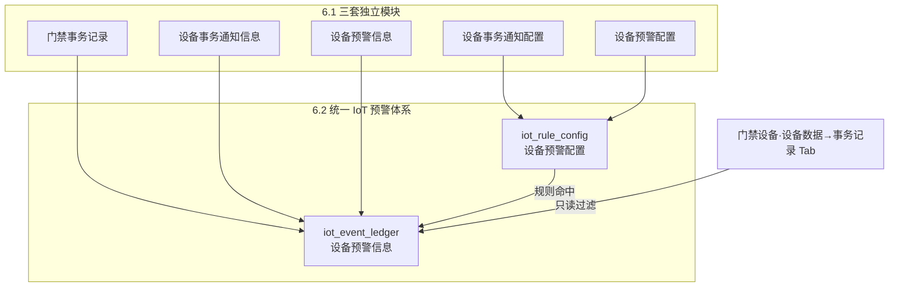

# 6.1→6.2 门禁事务与设备事务通知兼容映射

> **文档定位**：说明 6.1 基准版中【门禁事务记录】【设备事务通知信息】【设备事务通知配置】三个模块，在 6.2 迭代中的归属、菜单变化、业务规则继承、字段映射与历史数据迁移口径。供产品、研发、测试与实施团队统一理解「旧模块去哪了、能力是否保留、怎么用新菜单操作」。
>
> **版本**：V1.0 | **编制日期**：2026-08-25
>
> **上级索引**：[历史迁移总索引](../历史迁移总索引.md) · **一页速览**：[三旧模块兼容总说明](../6.1→6.2 三旧模块兼容总说明.md)
>
> **关联文档**：
> - [6.2 版本总览 README](../../README.md) 第三节「历史基准 vs 6.2 迭代对照」
> - [设备预警信息主 PRD](../../02-预警信息/01设备预警信息/设备预警信息主PRD.md) · [业务规则规格](../../02-预警信息/01设备预警信息/设备预警信息业务规则规格.md)
> - [设备预警配置主 PRD](../../03-预警配置/02设备预警配置/设备预警配置主PRD.md)
> - [03 历史数据迁移与回滚技术方案](../01设备侧规则与流水迁移/03历史数据迁移与回滚技术方案.md)
> - [00-全局契约与 RBAC 权限矩阵](../../00-全局契约与RBAC权限矩阵.md)

---

## 一、结论摘要

6.2 对三个旧模块采取 **「菜单取消 + 数据合流 + 规则统一」** 策略，不是三套系统并行运行。

| 6.1 原模块 | 6.2 新归属 | 一句话说明 |
| :--- | :--- | :--- |
| **门禁事务记录** | `02-预警信息 / 01设备预警信息` | 独立菜单取消；15 种门禁事务流水合入 `iot_event_ledger`，预警类型为 `常规通行与操作事务` |
| **设备事务通知信息** | `02-预警信息 / 01设备预警信息` | 与设备预警、门禁事务合并为同一套事件流水台账 |
| **设备事务通知配置** | `03-预警配置 / 02设备预警配置` | 与设备预警配置合并为 `iot_rule_config` 统一规则表 |

**底层两张表承接全部能力：**

- **配置层**：`iot_rule_config`（设备预警配置）
- **流水层**：`iot_event_ledger`（设备预警信息）

---

## 二、模块归属总览

### 2.1 菜单路径对照

| 6.1 菜单路径 | 6.2 菜单路径 | 变化类型 |
| :--- | :--- | :--- |
| 仓储 / 设备管理 / **门禁事务记录** | — | **取消独立菜单** |
| 风控 / 风险信息 / **设备事务通知信息** | — | **取消独立菜单** |
| 配置管理 / 风险管理 / **设备事务通知配置** | — | **取消独立菜单** |
| 风控 / 风险信息 / 设备预警信息 | 物联网 IoT / **设备预警信息** | **合并承接**（含门禁 + 事务 + 预警） |
| 配置管理 / 风险管理 / 设备预警配置 | 物联网 IoT / **设备预警配置** | **合并承接**（含事务通知规则） |

### 2.2 保留的查询入口

| 入口 | 6.2 状态 | 数据源 | 说明 |
| :--- | :--- | :--- | :--- |
| 门禁设备列表 → **设备数据 → 事务记录 Tab** | ✅ 保留 | `iot_event_ledger` | 按当前设备编码只读过滤；字段与全量列表一致 |
| 设备预警信息列表（全量筛选） | ✅ 新增统一入口 | `iot_event_ledger` | 替代原「门禁事务记录」独立菜单的全量检索 |
| 移动端独立「门禁事务记录」菜单 | ❌ 取消 | — | 改由设备预警信息移动端列表承接 |

---

## 三、【门禁事务记录】兼容说明

### 3.1 定位变化

| 维度 | 6.1 | 6.2 |
| :--- | :--- | :--- |
| 模块定位 | 独立的只读通行日志模块 | 设备预警信息中的第 6 大类流水 |
| 预警类型 | 无（独立「事务名称」枚举） | `常规通行与操作事务`（及部分归入挂锁/人脸预警大类） |
| 数据表 | 门禁事务独立表（如 `t_door_access_log`） | `iot_event_ledger` |
| 是否可配置 | 不可配置，100% 只读 | 大类不可在配置端新建；异常类可走设备预警配置 |

### 3.2 15 种事务类型映射（规则 R05）

原 6.1 的 15 种门禁事务名称**全部保留**，合流至 6.2 预警大类如下：

| 序号 | 6.1 事务名称 | 6.2 预警大类 | 事件性质 | 6.2 默认处置 |
| :---: | :--- | :--- | :---: | :--- |
| 1 | 获取密码成功 | 常规通行与操作事务 | 瞬态 | R06 已处理（有效） |
| 2 | 获取密码失败 | 人脸门禁预警 | 瞬态 | 按规则；异常可未处理 |
| 3 | 密码认证成功 | 常规通行与操作事务 | 瞬态 | R06 已处理（有效） |
| 4 | 密码认证失败 | 人脸门禁预警 | 瞬态 | 按规则 |
| 5 | 人脸认证成功 | 常规通行与操作事务 | 瞬态 | R06 已处理（有效） |
| 6 | 人脸认证失败 | 人脸门禁预警 | 瞬态 | 按规则 |
| 7 | 蓝牙开锁成功 | 智能挂锁预警 / 常规通行与操作事务 | 瞬态 | R06 已处理（有效） |
| 8 | 蓝牙关锁成功 | 常规通行与操作事务 | 瞬态 | R06 已处理（有效） |
| 9 | 远程开锁成功 | 常规通行与操作事务 | 瞬态 | R06 已处理（有效） |
| 10 | 远程关锁成功 | 常规通行与操作事务 | 瞬态 | R06 已处理（有效） |
| 11 | 门打开超时 | 人脸门禁预警 | 持续 | 未处理 → 人工/自动解除 |
| 12 | 非法开箱 | 智能挂锁预警 | 瞬态 | 未处理 → 人工解除 |
| 13 | 拆壳报警 | 智能挂锁预警 | 瞬态 | 未处理 → 人工解除 |
| 14 | 剪杆破坏 | 智能挂锁预警 | 瞬态 | 未处理 → 人工解除 |
| 15 | 撬锁报警 | 智能挂锁预警 | 瞬态 | 未处理 → 人工解除 |

### 3.3 继承的业务规则

| 规则 ID | 6.1 能力 | 6.2 兼容方式 |
| :--- | :--- | :--- |
| **R05** | 15 种事务类型枚举 | 子类型名称沿用 6.1，映射至 6 大类 |
| **R06** | — | 正常通行/开关锁等瞬态事件：防抖=0，直接 `已处理（有效）`，处理人=`系统自动处理` |
| **R07** | 挂锁开锁人员动态追溯 | 完全继承：关联最近一次及同密码「获取密码成功」操作人 |
| **R08** | 监控联动抓拍 | 完全继承；图片走 R13 时效签名 |
| **R09** | 双入口共用数据集 | 设备数据 Tab 与设备预警信息列表共用 `iot_event_ledger` |
| **R10** | 历史数据 | `t_door_access_log` 迁入时保留子类型名称与抓拍 Key |

### 3.4 字段映射（门禁事务 → 设备预警信息）

| 6.1 门禁事务字段 | 6.2 设备预警信息字段 | 映射说明 |
| :--- | :--- | :--- |
| 事务名称 | 预警内容（子类型部分） | 15 种名称作为子类型展示 |
| 说明 | 预警内容（触发内容部分） | 获取密码事由/备注等拼装逻辑保留 |
| 人员 | 预警内容（人员部分） | R07 追溯算法不变 |
| 设备抓拍图 | 预警抓拍图 | 时效签名机制 |
| 时间 | 首次预警时间 / 最近预警时间 | 瞬态事件两者相同 |
| 系统内名称、设备编码、绑定仓库等 | 设备与位置快照 | 触发时固化，设备移除后仍可见 |
| — | 预警类型 | 新增：`常规通行与操作事务` 等大类 |
| — | 预警等级 | 新增：默认 L1；异常类按规则快照 |
| — | 预警状态 | 新增：瞬态默认 `已处理（有效）` |
| — | 预警次数 | 新增：瞬态固定 Count=1 |

---

## 四、【设备事务通知信息】兼容说明

### 4.1 定位变化

| 维度 | 6.1 | 6.2 |
| :--- | :--- | :--- |
| 模块定位 | 瞬时事务消息台账（非风险预警） | 设备预警信息统一流水的一部分 |
| 事务类型 | 4 类：开锁/关锁/上线/移除 | 映射为设备预警配置附录 A 子类型 |
| 状态机 | 未处理 / 已处理 | 未处理（有效/无效）/ 已处理（有效） |
| 人工处理 | 所有未处理事务均可填写情况说明 | 仅风险类子类型展示解除入口（R14） |
| 升级通知 | 无 | 仅持续型风险告警支持（C05） |
| 频次聚合 | 不合流 | 持续型未处理事件支持 Count 聚合（C01） |

### 4.2 四类事务类型映射

| 6.1 事务类型 | 6.2 预警大类 | 6.2 子类型 | 配置入口 |
| :--- | :--- | :--- | :--- |
| **开锁通知** | 智能挂锁预警 | `正常开关锁事务` | 设备预警配置 |
| **关锁通知** | 智能挂锁预警 | `正常开关锁事务` | 设备预警配置 |
| **设备上线** | 设备图像识别预警 | `监控设备上线` | 设备预警配置（可勾选「仅针对新设备」） |
| **设备移除** | — | 附录 A 无对应子类型 | 见 §4.4 特殊说明 |

### 4.3 行为差异对照

| 场景 | 6.1 行为 | 6.2 行为 |
| :--- | :--- | :--- |
| 正常开锁/关锁 | 生成事务通知，默认未处理，可人工核查 | R06 瞬态落账，直接 `已处理（有效）`，无解除按钮 |
| 设备上线 | 即时通知 + 人工处理可选 | 瞬态落账 + 按规则推送；全局新设备规则保留（R05/R13） |
| 通知推送 | 命中事务通知配置即发 | 仍按规则快照推送；L2+ 且启用渠道时可发短信 |
| 规则删除后历史 | 历史通知保留 | 历史流水保留；未处理流水可置 `未处理（无效）` |
| 设备移除后历史 | 历史通知保留 | 历史流水保留；设备快照仍可见 |

### 4.4 「设备移除通知」特殊说明

6.2 设备预警配置附录 A **未单独定义「设备移除」子类型**。兼容策略如下：

1. **迁移期**：原「设备移除」事务通知规则若无法映射到合法子类型，写入 `migration_exception`，以 `legacy_sub_type` 保留展示快照。
2. **运行时**：设备移除的联动（规则解绑、未处理预警置无效、订单解绑等）由 **IoT 设备管理「移除设备」** 流程承担，不再单独生成「设备移除通知」流水。
3. **历史数据**：已产生的设备移除通知记录在迁移时 1:1 迁入 `iot_event_ledger`，不影响审计追溯。

### 4.5 字段映射（事务通知信息 → 设备预警信息）

| 6.1 事务通知字段 | 6.2 设备预警信息字段 | 映射说明 |
| :--- | :--- | :--- |
| 事务规则名称 | 规则名称 | 触发时规则快照 |
| 事务类型 | 预警类型 + 子类型 | 4 类映射为附录 A 子类型 |
| 事务内容 | 预警内容 | 位置+设备+触发内容格式保留 |
| 抓拍图 | 预警抓拍图 | 时效签名 |
| 创建时间 | 首次预警时间 | 业务含义=事件触发时间 |
| 处理时间 | 处理时间 | 瞬态事件=触发时间（系统自动处理） |
| 处理人 | 处理人 | 瞬态=`系统自动处理`；风险类=人工解除人 |
| 状态（未处理/已处理） | 预警状态 | 扩展为 未处理（有效/无效）/ 已处理（有效） |
| 情况说明 | 情况说明 | 仅人工解除类型展示 |
| 现场照片 | 现场照片 | 仅人工解除类型 |
| 事务处理抓拍图 | 解除预警抓拍图 | 仅人工解除提交时触发 |
| 事务通知信息唯一标识 | 事件唯一标识 (Event ID) | 主键口径统一 |
| 来源事件唯一标识 | 幂等键（系统字段） | 去重逻辑保留 |
| 通知发送结果 | 操作审计日志（部分） | 发送结果写入审计，不回滚流水 |

---

## 五、【设备事务通知配置】兼容说明

### 5.1 定位变化

| 维度 | 6.1 | 6.2 |
| :--- | :--- | :--- |
| 模块定位 | 瞬时事务通知规则（启用/停用） | 设备预警配置统一规则的一部分 |
| 数据表 | `t_dev_event_cfg` | `iot_rule_config`（与 `t_dev_warn_cfg` 合流） |
| 事务类型 | 4 类固定枚举 | 5 大类 + 附录 A 权威子类型 |
| 等级体系 | 无独立等级 | 绑定 `03-预警配置/01预警等级`（2~20 档） |
| 状态 | 启用 / 停用 | 生效中 / 停用 / 已失效 / 已删除 |
| 升级策略 | 无 | 持续型可配；瞬态（上线/开关锁）隐藏升级区（R13） |

### 5.2 配置项映射

| 6.1 配置字段/能力 | 6.2 对应项 | 说明 |
| :--- | :--- | :--- |
| 事务通知规则名称 | 规则名称 | 同一字段语义 |
| 事务类型（开锁/关锁/上线/移除） | 预警类型 + 预警子类型 | 见 §4.2 映射表 |
| 选择设备 | 关联设备 | N:M 多选；权限过滤逻辑保留 |
| 针对新设备 | 仅针对新设备 | 仅 `监控设备上线` 子类型展示 |
| 通知渠道（站内信/短信/邮件） | 通知渠道（短信/邮件） | 6.2 移除「站内信」可配置项；迁移时从 `notify_channels` 剔除「站内信」及误写入的「Webhook」；**系统小角标**在预警命中时自动更新，不可配置 |
| 通知对象 | 预警对象 | 字段语义一致 |
| 启用/停用 | 生效中/停用 | 生命周期扩展为四态 |
| — | 预警等级 | 新增：必选，来自 03/01 预警等级字典 |
| — | 防抖判定模式 | 新增：瞬态锁定「立即触发」 |
| — | 升级预警天数/对象 | 新增：仅持续型风险类可配 |

### 5.3 原「一条主规则 + 多条事务明细」模型

6.1 采用「主规则 + 事务类型明细」结构；6.2 迁移时按 `tenant_id + rule_name + device_category + sub_type` 去重合流为 `iot_rule_config` 单条规则记录，详见 [03 历史数据迁移方案 Step 1](../01设备侧规则与流水迁移/03历史数据迁移与回滚技术方案.md)。

---

## 六、权限与角色兼容

| 6.1 权限场景 | 6.2 权限归属 | 说明 |
| :--- | :--- | :--- |
| 门禁事务记录 · 查看 | 设备预警信息 · 查看 | 菜单合并；仓库数据权限 P02 不变 |
| 设备事务通知信息 · 查看/处理 | 设备预警信息 · 查看/解除 | 瞬态流水无解除；风险类需 IoT 处理权限 |
| 设备事务通知配置 · 增删改 | 设备预警配置 · 增删改 | 统一 IoT 写权限 |
| 未绑定仓库设备事务 | 具备菜单权限即可见 | 与 6.1 一致 |

角色矩阵详见 [00-全局契约与 RBAC 权限矩阵](../../00-全局契约与RBAC权限矩阵.md) 第四章。

---

## 七、历史数据迁移口径

> 完整 SQL 与批次化方案见 [03 历史数据迁移与回滚技术方案](../01设备侧规则与流水迁移/03历史数据迁移与回滚技术方案.md)。

### 7.1 源表与目标表

| 6.1 源表 | 6.2 目标表 | 迁移策略 |
| :--- | :--- | :--- |
| `t_dev_warn_cfg` | `iot_rule_config` | 与事务通知配置合流去重 |
| `t_dev_event_cfg` | `iot_rule_config` | 按附录 A 合法子类型映射 |
| `t_door_access_log` | `iot_event_ledger` | 保留子类型名称与抓拍 Key（R10） |
| 设备预警流水 + 事务通知流水 | `iot_event_ledger` | 合流落账 |

### 7.2 事件迁移分类处理

| 事件性质 | 迁移方式 | 迁移后状态 |
| :--- | :--- | :--- |
| **瞬态**（开关锁、通行、上线等） | 1:1 逐条迁移 | `已处理（有效）`，Count=1 |
| **持续型未处理** | 按 `tenant + device + sub_type` 聚合 | `未处理（有效）`，时间轴明细全保留 |
| **已处理** | 按 event_id 1:1 迁移 | 保留原处理人、时间、材料 |

### 7.3 迁移约束

1. 迁移批次标记 `migration_batch_id`，支持幂等重跑与整批回滚。
2. 历史迁移事件标记 `event_source=HISTORY_MIGRATION`，**不触发新通知、不触发订单穿透**。
3. 无法映射的子类型写入 `migration_exception`，以 `legacy_sub_type` 保留，不得伪造默认等级。
4. 图片仅保留 OSS Key，通过签名服务访问。

---

## 八、用户操作指引（6.2 新菜单怎么用）

| 我要做什么 | 6.1 操作路径 | 6.2 操作路径 |
| :--- | :--- | :--- |
| 查某门禁设备的开关锁流水 | 门禁设备 → 设备数据 → 事务记录 | **不变**（数据源已切换为 `iot_event_ledger`） |
| 全量检索门禁事务 | 设备管理 → 门禁事务记录 | 物联网 IoT → **设备预警信息**，筛选「预警类型 = 常规通行与操作事务」 |
| 查看开锁/上线通知记录 | 风控 → 设备事务通知信息 | 物联网 IoT → **设备预警信息**，按子类型筛选 |
| 配置开锁/关锁通知 | 配置管理 → 设备事务通知配置 | 物联网 IoT → **设备预警配置**，选子类型 `正常开关锁事务` |
| 配置新设备上线通知 | 同上，选「设备上线」 | **设备预警配置**，选 `监控设备上线`，可勾选「仅针对新设备」 |
| 处理物理破坏类告警 | 设备预警信息 → 解除 | **不变**（仍在设备预警信息） |
| 核查日常通行记录 | 门禁事务记录（只读） | 设备预警信息 → 详情（状态默认「已处理」，无需操作） |

---

## 九、验收检查清单

| # | 检查项 | 通过标准 |
| :---: | :--- | :--- |
| 1 | 门禁 15 种事务名称 | 迁移后子类型名称与 6.1 一致，可在详情页展示 |
| 2 | 人员追溯 | 挂锁开锁成功仍展示关联获取密码操作人（R07） |
| 3 | 抓拍联动 | 开关锁事件有关联抓拍图或「无抓拍图」状态 |
| 4 | 双入口一致性 | 设备数据 Tab 与全量列表同一 event_id 数据一致（R09） |
| 5 | 瞬态默认状态 | 正常开关锁/通行/上线迁移后为 `已处理（有效）` |
| 6 | 事务通知规则 | 原开锁/关锁/上线规则可在设备预警配置中找到对应子类型 |
| 7 | 历史不可篡改 | 设备移除后历史流水仍展示触发时设备/仓库快照 |
| 8 | 迁移无副作用 | 历史迁移不触发新短信/系统小角标更新/订单穿透 |
| 9 | 权限过滤 | 仓库数据权限、未绑定仓库可见规则与 6.1 一致 |
| 10 | 未知子类型 | 「设备移除」等无法映射项进入异常清单，不静默丢弃 |

---

## 十、相关文档索引

| 文档 | 路径 | 用途 |
| :--- | :--- | :--- |
| 6.2 版本总览 | [README.md](../../README.md) | 三大主干架构与历史对照 |
| 设备预警信息主 PRD | [设备预警信息主PRD.md](../../02-预警信息/01设备预警信息/设备预警信息主PRD.md) | 合流后的功能范围与状态机 |
| 设备预警信息业务规则 | [设备预警信息业务规则规格.md](../../02-预警信息/01设备预警信息/设备预警信息业务规则规格.md) | R05~R10 门禁合流规则唯一定义来源 |
| 设备预警配置附录 A | [设备预警配置业务规则规格.md](../../03-预警配置/02设备预警配置/设备预警配置业务规则规格.md) | 合法子类型权威枚举 |
| 历史数据迁移方案 | [03历史数据迁移与回滚技术方案.md](../01设备侧规则与流水迁移/03历史数据迁移与回滚技术方案.md) | SQL、批次、回滚 |
| 6.1 基准：门禁事务 | [门禁事务主PRD.md](../../../../🌟🌟🌟-最新基准版/B端PC/02-仓储/20-设备管理-门禁事务记录/门禁事务主PRD.md) | 原模块完整规格 |
| 6.1 基准：事务通知信息 | [设备事务通知信息主PRD.md](../../../../🌟🌟🌟-最新基准版/B端PC/05-风控/07-风险信息-设备事务通知信息/设备事务通知信息主PRD.md) | 原模块完整规格 |
| 6.1 基准：事务通知配置 | [设备事务通知配置主PRD.md](../../../../🌟🌟🌟-最新基准版/B端PC/08-配置管理/21-风险管理-设备事务通知配置/设备事务通知配置主PRD.md) | 原模块完整规格 |

---

## 修订记录

| 日期 | 版本 | 变更说明 |
| :--- | :---: | :--- |
| 2026-08-25 | **V1.0** | 初版：三模块归属、菜单、规则继承、字段映射、迁移口径与用户操作指引 |
| 2026-09-01 | **V1.1** | 通知渠道映射同步 6.2：移除「站内信」可配置项，迁移时从 `notify_channels` 剔除；系统小角标自动更新 |
| 2026-09-04 | **V1.2** | 迁移映射补充剔除误写入「Webhook」；6.2 外部渠道统一为短信/邮件两档 |
