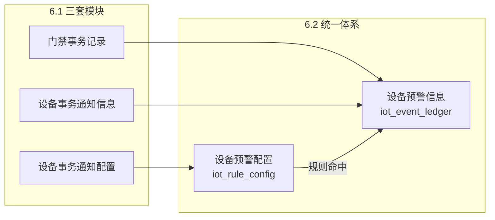

# 6.1→6.2 三旧模块兼容总说明

> **文档定位**：面向产品、实施、测试与研发的**一页式总说明**。快速回答「门禁事务记录、设备事务通知信息/配置去哪了、怎么用新菜单、哪些能力变了」。
>
> **版本**：V1.0 | **编制日期**：2026-08-25
>
> **上级索引**：[历史迁移总索引](./历史迁移总索引.md)
>
> **详细规格**（字段映射、15 种事务枚举、迁移 SQL、验收清单）见 [门禁事务与设备事务通知兼容映射](./03业务兼容映射/6.1→6.2 门禁事务与设备事务通知兼容映射.md)。

---

## 一、总体兼容策略

6.2 对以下三个 6.1 模块采取 **「菜单取消 + 数据合流 + 规则统一」**，不是三套系统并行运行。

| 6.1 原模块      | 6.2 新归属              | 一句话                               |
| ------------ | -------------------- | --------------------------------- |
| **门禁事务记录**   | `02-预警信息 / 01设备预警信息` | 独立菜单取消；通行流水合入统一台账，类型为 `常规通行与操作事务` |
| **设备事务通知信息** | `02-预警信息 / 01设备预警信息` | 与设备预警、门禁事务合并为同一套事件流水              |
| **设备事务通知配置** | `03-预警配置 / 02设备预警配置` | 与设备预警配置合并为统一规则表                   |

**底层两张表承接全部 IoT 侧能力：**

| 层级  | 6.2 模块               | 数据表                |
| --- | -------------------- | ------------------ |
| 配置  | 物联网 IoT → **设备预警配置** | `iot_rule_config`  |
| 流水  | 物联网 IoT → **设备预警信息** | `iot_event_ledger` |

---

## 二、菜单与入口变化

| 6.1 菜单              | 6.2 怎么办                                         |
| ------------------- | ----------------------------------------------- |
| 设备管理 → **门禁事务记录**   | **取消**；改到「设备预警信息」全量筛选，或从门禁设备「设备数据 → 事务记录」Tab 查看 |
| 风控 → **设备事务通知信息**   | **取消**；合并进「设备预警信息」                              |
| 配置管理 → **设备事务通知配置** | **取消**；合并进「设备预警配置」                              |
| 风控 → 设备预警信息         | 物联网 IoT → **设备预警信息**（承接全部 IoT 流水）               |
| 配置管理 → 设备预警配置       | 物联网 IoT → **设备预警配置**（承接全部 IoT 规则）               |

**保留的入口：**

- 门禁设备 → **设备数据 → 事务记录 Tab**：仍可用，数据源已切换为 `iot_event_ledger`，与全量列表一致。
- 移动端独立「门禁事务记录」菜单：**取消**，改由设备预警信息移动端承接。

---

## 三、三类旧能力怎么对应

### 3.1 门禁事务记录 → 设备预警信息

- 原 **15 种门禁事务名称全部保留**，作为子类型展示。
- 正常通行/开关锁等归入 `常规通行与操作事务`；拆壳、撬锁、门打开超时等异常归入挂锁/人脸预警大类。
- 6.1 的人员追溯、监控抓拍、只读不可删改等规则**继续生效**（R05~R10）。
- **双入口**：全量列表 + 门禁设备 Tab，共用同一 `iot_event_ledger`。

### 3.2 设备事务通知信息 → 设备预警信息

| 6.1 事务类型    | 6.2 对应                          |
| ----------- | ------------------------------- |
| 开锁通知 / 关锁通知 | 子类型 `正常开关锁事务`                   |
| 设备上线        | 子类型 `监控设备上线`（可配「仅针对新设备」）        |
| 设备移除        | 附录 A 无独立子类型；移除联动由 IoT「移除设备」流程承担 |

### 3.3 设备事务通知配置 → 设备预警配置

| 6.1 配置能力     | 6.2 对应                   |
| ------------ | ------------------------ |
| 开锁/关锁/上线通知规则 | 设备预警配置中选对应子类型            |
| 选择设备 / 针对新设备 | 关联设备 / 仅针对新设备（仅上线子类型）    |
| 通知渠道与对象      | 保留；新增绑定 **预警等级**（2~20 档） |
| 启用/停用        | 扩展为 生效中 / 停用 / 已失效 / 已删除 |

---

## 四、关键行为差异（必读）

| 场景                 | 6.1                | 6.2                                                  |
| ------------------ | ------------------ | ---------------------------------------------------- |
| 正常开关锁 / 刷脸通行       | 事务通知，默认「未处理」，可人工核查 | **瞬态落账，直接「已处理（有效）」**，无需操作                            |
| 物理破坏 / 离线 / 越界等风险  | 设备预警，需解除           | **不变**，仍在设备预警信息人工或自动解除                               |
| 事务通知的「情况说明 + 现场照片」 | 所有未处理事务可填          | **仅风险类**展示解除入口；日常通行流水无解除按钮                           |
| 升级通知               | 事务通知无              | 仅**持续型风险**支持超时升级                                     |
| 历史数据               | 各模块独立表             | 迁入 `iot_rule_config` + `iot_event_ledger`，迁移批次不触发新通知 |

**记忆口诀：**

> **日常通行 = 流水落账即结案；物理风险 = 仍在设备预警信息做解除。**

---

## 五、用户操作指引

| 我要做什么         | 6.1 路径             | 6.2 路径                              |
| ------------- | ------------------ | ----------------------------------- |
| 查某门禁设备的开关锁流水  | 门禁设备 → 设备数据 → 事务记录 | **不变**                              |
| 全量检索门禁事务      | 设备管理 → 门禁事务记录      | 物联网 IoT → **设备预警信息**，筛选「常规通行与操作事务」  |
| 查看开锁/上线通知记录   | 风控 → 设备事务通知信息      | 物联网 IoT → **设备预警信息**                |
| 配置开锁/关锁通知     | 配置管理 → 设备事务通知配置    | 物联网 IoT → **设备预警配置**，子类型选 `正常开关锁事务` |
| 配置新设备上线通知     | 同上，选「设备上线」         | **设备预警配置**，子类型 `监控设备上线`，可勾选「仅针对新设备」 |
| 处理拆壳、越界、离线等告警 | 设备预警信息 → 解除        | **不变**                              |
| 核查日常通行记录      | 门禁事务记录（只读）         | 设备预警信息 → 详情（默认已处理，**无需操作**）         |

---

## 六、与详细文档的关系

| 需要了解…                | 阅读文档                                                                                                |
| -------------------- | --------------------------------------------------------------------------------------------------- |
| 本文：谁该读什么、菜单怎么换、日常怎么用 | **本文件**                                                                                             |
| 15 种事务映射表、字段对照、验收清单  | [兼容映射（完整版）](./03业务兼容映射/6.1→6.2 门禁事务与设备事务通知兼容映射.md)                                                  |
| IoT 规则与流水 SQL 迁移     | [设备侧迁移方案](./01设备侧规则与流水迁移/03历史数据迁移与回滚技术方案.md)                                                        |
| 割接后联调验收              | [跨域用例数据推演](./04割接验收与推演/6.2跨域用例数据推演.md)                                                              |
| 6.2 目标态功能规格          | [设备预警信息主 PRD](../02-预警信息/01设备预警信息/设备预警信息主PRD.md) · [设备预警配置主 PRD](../03-预警配置/02设备预警配置/设备预警配置主PRD.md) |

---

## 修订记录

| 日期         | 版本       | 变更说明            |
| ---------- | -------- | --------------- |
| 2026-08-25 | **V1.0** | 初版：三旧模块一页式兼容总说明 |

