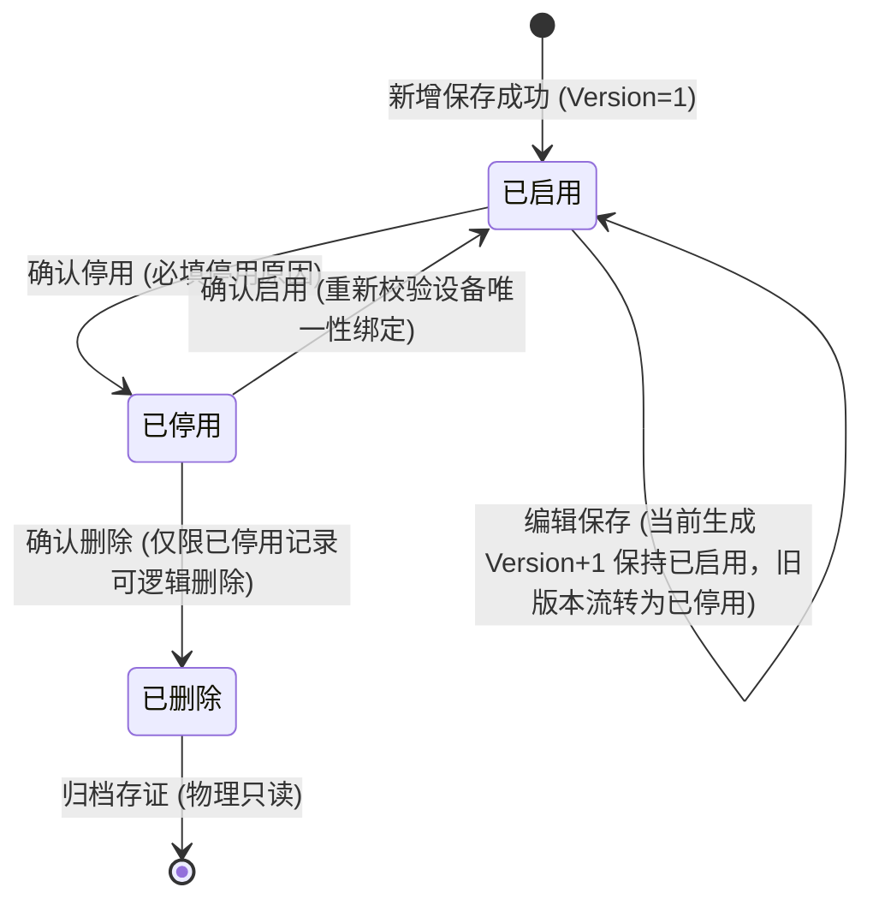
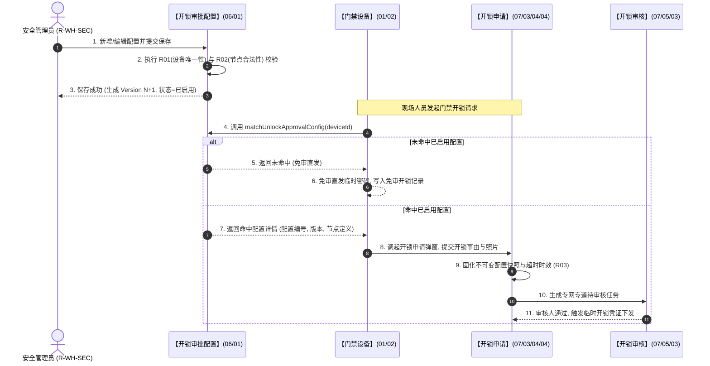

# 门禁开锁审批配置 业务规则规格

> **文档定位**：**三件套核心**——状态机、动作约束、校验规则、计算联动、权限与跨模块流程的**唯一定义来源**。配套：[主PRD](./门禁开锁审批配置主PRD.md)（业务与页面功能）、[字段清单](./门禁开锁审批配置字段清单.md)（字段）。ASCII/Demo 为衍生，只引用本文件规则 ID，不重复定义规则本体。
>
> **统一引用规范**：
> - 本策略：【开锁审批配置】策略（菜单：配置管理 → 业务流程管理 → 开锁审批，代号 06/01）
> - 上游设备：【门禁设备】台账（菜单：物联网IOT管理 → 门禁设备，代号 01/02）
> - 下游申请：【开锁申请】单据（菜单：工作中心 → 审批中心 → 业务审批 → 我的申请管理 → 开锁申请，代号 07/03/04/04）
> - 下游审核：【开锁审核】台账（菜单：工作中心 → 审批中心 → 其他审批 → 开锁审核，代号 07/05/03）
>
> **版本**：V4.0 基准版 | **更新时间**：2026-09-18 | **责任人**：产品架构组

---

## 一、单据与能力定位

| 维度 | 标准定位规格 | 业务解释与控制边界 |
| :--- | :--- | :--- |
| **模块层级** | 策略控制层（Policy Strategy Layer） | 属于系统安全控制策略，非业务流水单据层，亦非通用流程引擎层。 |
| **菜单路径** | `配置管理 → 业务流程管理 → 开锁审批` | 统一归属业务流程配置体系，系统代号为 `06/01`。 |
| **核心职责** | 门禁开锁审批准入策略维护 | 维护指定门禁设备与多级审批链的绑定关系，管控审批超时时效，驱动开锁授权前置决策。 |
| **单据/数据源头** | 管理员手动编排配置 | 由安全管理员依据仓储监管风控等级录入，上游依赖门禁设备台账主数据及系统组织架构。 |
| **上下游协同** | 驱动开锁准入与申请生成 | 下游驱动【门禁设备】台账（代号 01/02）执行 `matchUnlockApprovalConfig` 匹配，并向【开锁申请】单据（代号 07/03/04/04）注入不可变策略快照。 |
| **审核与存证机制**| 策略免审直发，变更版本递增 | 新增校验通过后直接生效（已启用）；编辑已启用策略不覆盖历史，自动生成 Version+1 保持已启用，旧版转已停用并固化为司法存证快照。 |

---

## 二、数量与计算口径隔离表

| 指标/判定项 | 严格业务口径与判定公式 | 边界条件与约束控制 | 关联规则编号 |
| :--- | :--- | :--- | :--- |
| **设备绑定唯一性集合判定** | 设当前租户下所有处于已启用（`ENABLED`）状态的配置集合为 $\mathbb{C}_{active}$，每条配置绑定的设备集合为 $D(C_i)$。对于待生效的新配置集合 $D_{new}$，必须满足：$$\forall d \in D_{new}, \quad d \notin \bigcup_{C_i \in \mathbb{C}_{active} \setminus \{C_{self}\}} D(C_i)$$ 即新绑定的任一门禁设备，不得存在于除自身外任何生效中策略的设备集合中。 | 若交集非空：$$\Delta = D_{new} \cap \left( \bigcup D(C_i) \right) \neq \emptyset$$ 系统直接阻断保存，并列出冲突设备编码与所属配置名称。 | **R01** |
| **审批超时截止时间戳** | 设开锁申请提交时间戳为 $T_{submit}$，本策略配置的审批超时时间为 $H_{timeout}$（单位：小时），则申请的审批绝对失效时间戳 $T_{expire}$ 计算公式为：$$T_{expire} = T_{submit} + H_{timeout} \times 3600$$ | 1. $H_{timeout} \in [1, 72]$ 且为正整数； 2. 超过 $T_{expire}$ 未处理时，系统定时任务自动将申请标记为已失效。 | **R02** |
| **配置版本自增规则** | 编辑「已启用」配置并保存成功时，新配置版本 $V_{new}$ 计算公式为：$$V_{new} = V_{current} + 1$$ 同时旧版本状态流转为已停用：$$S(V_{current}) \leftarrow \text{DISABLED}$$ | 1. 初始新增版本 $V_1 = 1$； 2. 版本号单调递增，禁止回退； 3. 在途业务申请严格锁定发起时刻的 $V_{current}$ 快照。 | **R03** |
| **审批链节点解析容量** | 设审批链节点总数为 $N$，每节点候选有效人员集合为 $P_k$：$$N \in [1, 5], \quad \forall k \in [1, N], \; |P_k| \ge 1$$ 综合有效审批人总集合为：$$\mathbb{P}_{total} = \bigcup_{k=1}^N P_k$$ | 1. 6.2 采用「任一人通过」模式，只要 $\exists p \in \mathbb{P}_{total}$ 通过即达成授权； 2. 提交申请时若 $\mathbb{P}_{total} \setminus \{p_{applicant}\} = \emptyset$（剔除本人后无人可审），触发自审禁止兜底阻断。 | **R04** |

---

## 三、单据状态机与生命周期流转

### 3.1 状态定义
* **已启用 (`ENABLED`)**：当前对新发起开锁行为生效的有效配置。所绑定的门禁设备处于独占占用状态。
* **已停用 (`DISABLED`)**：非生效状态。新发起的开锁不再命中此配置，设备释放绑定占用。历史关联申请单据继续保留该版本的配置快照。
* **已删除 (`DELETED`)**：逻辑软删除状态。在前端列表彻底隐蔽不可见，后台数据库保留数据行供存证追溯，不可被重新启用。

### 3.2 状态机流转图

### 3.3 全景状态流转表

| 当前状态 | 触发动作 | 适用角色 | 前置业务校验条件 | 结果状态 | 联动后置影响 | 失败阻断处理与提示 |
| :--- | :--- | :--- | :--- | :--- | :--- | :--- |
| **[草稿/无]** | 新增保存 | 安全管理员 (`R-WH-SEC`) | 1. 名称租户内唯一； 2. 适用设备数量 $\ge 1$ 且均未被占用； 3. 超时时间合法且节点配置合规。 | **已启用** | 1. 生成唯一配置编号； 2. 初始版本置为 1； 3. 锁定适用设备绑定关系； 4. 记录策略新增审计日志。 | 浮窗提示：「保存失败：所选设备【{设备编码}】已被策略【{配置名称}】绑定，请先移除」 |
| **已启用** | 编辑保存 | 安全管理员 (`R-WH-SEC`) | 1. 配置当前状态仍为已启用； 2. 携带乐观锁版本号匹配成功； 3. 节点配置合法。 | **已启用** (Version+1) | 1. 生成新版本记录（Version+1）； 2. 原版本记录自动置为「已停用」； 3. 在途申请单据继续锁定原版本快照； 4. 记录策略版本变更审计日志。 | 浮窗提示：「保存失败：当前策略已被他人修改，请刷新后重试」 |
| **已启用** | 停用 | 安全管理员 (`R-WH-SEC`) | 1. 弹出停用确认弹窗； 2. 必填 $\le 200$ 字停用原因。 | **已停用** | 1. 释放所绑定门禁设备的独占占用； 2. 门禁后续开锁不再命中此策略； 3. 记录停用原因与操作审计日志。 | 浮窗提示：「停用失败：配置状态已发生变更，请刷新列表」 |
| **已停用** | 启用 | 安全管理员 (`R-WH-SEC`) | 1. 重新执行设备唯一性冲突校验； 2. 所绑定设备未被其他已启用策略绑定。 | **已启用** | 1. 重新锁定设备独占占用关系； 2. 新发起的开锁重新开始命中本策略； 3. 记录启用操作审计日志。 | 浮窗提示：「启用失败：设备【{设备编码}】已被策略【{配置名称}】占用，无法启用」 |
| **已停用** | 逻辑删除 | 安全管理员 (`R-WH-SEC`) | 1. 配置状态必须为已停用； 2. 弹出高危二次确认弹窗。 | **已删除** | 1. 列表不再展示本策略； 2. 后台保留软删除记录以备司法存证； 3. 记录删除操作审计日志。 | 浮窗提示：「删除失败：仅允许删除已停用状态的策略」 |

---

## 四、动作能力与流转控制矩阵

| 触发动作 | 操作入口 | 适用角色 | 前置业务校验条件 | 结果状态 | 联动后置影响 | 失败阻断提示 |
| :--- | :--- | :--- | :--- | :--- | :--- | :--- |
| **【新增配置】** | PC 列表页 Header【+ 新增配置】 | 安全管理员 (`R-WH-SEC`) | 拥有策略写权限 `P-UNLOCK-CFG-WRITE` | 已启用 | 写入配置表与节点明细表，下发设备生效事件 | 浮窗提示：「新增失败：{具体校验错误}」 |
| **【编辑配置】** | PC 列表行操作【编辑】 | 安全管理员 (`R-WH-SEC`) | 目标记录为已启用；禁止修改配置名称与设备 | 已启用 (新版) | 旧版本转已停用，发布新策略版本热生效广播 | 浮窗提示：「保存失败：数据版本冲突，请重新加载」 |
| **【停用策略】** | PC 列表行操作【停用】 | 安全管理员 (`R-WH-SEC`) | 目标记录为已启用；填写有效停用原因 | 已停用 | 设备释放绑定，开锁降级为免审直发 | 浮窗提示：「停用失败：必须输入停用原因」 |
| **【启用策略】** | PC 列表行操作【启用】 | 安全管理员 (`R-WH-SEC`) | 目标记录为已停用；设备未被并发生效策略占用 | 已启用 | 独占绑定设备，开锁恢复走审批申请 | 浮窗提示：「启用失败：绑定设备冲突」 |
| **【删除策略】** | PC 列表行操作【删除】 | 安全管理员 (`R-WH-SEC`) | 目标记录为已停用；已通过二次确认 | 已删除 | 标记逻辑删除，列表不再展示 | 浮窗提示：「删除失败：已启用策略禁止删除」 |
| **【查看详情】** | PC 列表行操作【详情】 | 全体授权人员 | 拥有配置查看权限 `P-UNLOCK-CFG-READ` | 不变 | 抽屉展示基本信息、绑定设备、审批链及历史版本 | 浮窗提示：「数据加载异常，请重试」 |

---

## 五、核心业务规则清单

### 5.1 范围与基础配置规则 (R01~R03)

#### 【适用设备独占性绑定与冲突阻断】(R01)
1. **单设备单策略原则**：在同一系统租户维度下，一台门禁设备（无论是挂锁门禁还是人脸门禁）在任何时间点，最多只能被绑定至**一条**处于「已启用」状态的开锁审批配置中。
2. **阻断校验时机**：
   - 管理员在新增配置点击【保存】时执行校验；
   - 管理员在对「已停用」配置点击【启用】时执行重新校验；
3. **阻断提示规范**：若所选设备中包含已绑定的设备，系统直接终止操作，并在前端弹窗中明确告知：「保存失败：门禁设备【设备编码 / 设备名称】已被生效策略【配置名称】绑定，不可重复添加」。

#### 【审批节点编排与人员合规性】(R02)
1. **节点数量约束**：每条开锁审批配置必须包含至少 1 个审批节点，最多不超过 5 个审批节点。
2. **节点对象独立性**：每个节点必须在「指定人员」与「指定角色」中二选一，同一节点内禁止混合多选。
3. **人员与角色数据源边界**：
   - **指定人员**：必须为当前租户下的注册人员账号（系统允许选择已停用人员，以兼容特殊离岗审批交接，但前端应显著标注停用状态徽章）；
   - **指定角色**：必须为当前租户下处于「启用」状态的系统 RBAC 角色；
4. **审批方式默认锁定**：6.2 版本审批方式在系统层面固定锁定为「任一人通过」，各节点解析出的有效审批人并行产生审批任务，任何一位具有审批权的人员审核通过即代表该申请通过。

#### 【配置版本递增与不可变快照】(R03)
1. **版本自增逻辑**：对处于「已启用」状态的配置进行修改并保存时，系统不得直接覆盖当前数据库记录，必须将原记录自动流转为「已停用」，并以原配置编号生成递增版本（Version N+1）的新记录，新记录状态默认为「已启用」。
2. **在途单据强隔离**：下游【开锁申请】单据（代号 07/03/04/04）在生成时，必须严格固化当时命中的 `config_id`、`config_version`、审批节点快照及有效审批人集合。后续任何策略的编辑、停用或删除，绝不回写或变更在途申请单据的审批链路。

### 5.2 字段修改与生命周期规则 (R04~R07)

#### 【核心风控属性编辑锁定】(R04)
1. **不可变字段控制**：当管理员进入已启用配置的「编辑」界面时，【配置名称】与【适用设备】列表强制设置为只读置灰状态，严禁在编辑流程中增删设备或重命名配置。
2. **设备变更标准操作路径**：若业务上确需调整某设备的审批策略，必须执行两步规范操作：① 将原配置停用；② 新建一条新的审批配置并重新划定适用设备。以此确保版本变更的历史审计线索清晰可溯。

#### 【停用原因必填与审计留痕】(R05)
1. **必填原因校验**：点击行操作【停用】时，必须弹出停用确认弹窗，并强制输入 $\le 200$ 字符的停用原因，输入内容不能为空或纯空格。
2. **审计快照留痕**：系统写入策略状态变更审计流水，记录停用操作人姓名、账号、时间戳及停用原因。

#### 【逻辑删除前置保护约束】(R06)
1. **禁止直接删除生效策略**：处于「已启用」状态的策略禁止执行删除操作，列表行操作中不展示【删除】按钮。
2. **已停用删除保护**：仅状态为「已停用」的配置允许点击【删除】。系统弹出高危确认弹窗：「删除后本策略将不再展示，历史开锁记录中引用的快照仍将保留，是否确认删除？」。确认后执行逻辑软删除，数据库标记 `is_deleted = 1`。

#### 【乐观锁并发版本防护】(R07)
1. **版本戳校验**：在提交编辑、启用或停用请求时，前端必须携带数据当前的版本戳 `version`。
2. **冲突阻断**：若后台检测到数据库版本戳大于提交的版本戳，说明配置已被其他管理员更新，系统立即阻断操作并提示：「当前配置已被他人修改，请刷新列表后重试」，防止脏数据覆盖。

---

## 六、异常与边界控制矩阵

| 异常编号 | 异常场景 | 系统判定与控制动作 | 前端反馈与提示 |
| :--- | :--- | :--- | :--- |
| **【设备冲突重叠】(C01)** | 新增/启用时设备已被其他启用策略绑定 | 校验 $D_{new} \cap \mathbb{C}_{active} \neq \emptyset$ | 浮窗提示：「保存失败：设备【{设备编码}】已被策略【{配置名称}】占用，请先移除」 |
| **【配置名称重名】(C02)** | 新增配置名称在当前租户内已存在有效记录 | 校验 `config_name` 租户内唯一性 | 输入框红色错误高亮：「配置名称已存在，请重新输入」 |
| **【审批节点为空】(C03)** | 提交保存时未添加审批节点或清空了节点 | 校验节点数量 $N = 0$ | 浮窗提示：「请至少添加 1 个审批节点」 |
| **【审批人全部失效】(C04)** | 申请命中配置时，节点人员均停用且角色无成员 | 申请提交前执行动态人员解析校验 | 浮窗提示：「当前设备开锁审批链无可用审批人，请联系仓储安全管理员检查配置」 |
| **【并发修改冲突】(C05)** | 多人同时编辑或启停同一条配置策略 | 校验数据并发版本号 `version` 不匹配 | 浮窗提示：「数据已被他人修改，请刷新页面重新操作」 |
| **【已启用直接删除】(C06)** | 恶意调用删除接口删除生效中的策略 | 后端接口强制拦截非 `DISABLED` 状态的删除请求 | 错误代码 400：「生效中的配置禁止删除，请先停用」 |

---

## 七、跨模块业务联动与时序推演

---

## 八、规则全景速查索引表

| 规则类别 | 规则编号 | 规则名称 | 核心约束摘要 |
| :--- | :--- | :--- | :--- |
| **范围唯一** | **R01** | 适用设备独占性绑定规则 | 门禁设备在租户内仅能绑定于 1 条已启用策略，冲突强阻断。 |
| **节点合规** | **R02** | 审批节点编排与人员规则 | 节点数 1~5 个；人员与角色单选；审批方式锁定任一人通过。 |
| **版本控制** | **R03** | 配置版本递增与不可变快照 | 编辑已启用策略生成 Version+1（已启用），旧版转停用快照，在途申请不变更。 |
| **字段保护** | **R04** | 核心风控属性编辑锁定规则 | 编辑时配置名称与适用设备置灰只读，调整设备必须新建。 |
| **停用管控** | **R05** | 停用原因必填与审计留痕 | 停用必须输入 $\le 200$ 字原因，全程操作审计留痕。 |
| **删除约束** | **R06** | 逻辑删除前置保护规则 | 生效中配置禁止删除；仅已停用状态支持逻辑软删除。 |
| **并发防护** | **R07** | 乐观锁版本并发控制规则 | 携带版本戳提交，并发冲突强阻断并提示刷新重试。 |
| **匹配决策** | **C01** | 设备开锁前置匹配算法 | 依据设备编号匹配租户内唯一已启用策略，命中走审批，未命中走免审。 |
| **失效控制** | **C02** | 审批超时失效计算与扫描 | 超过提交时间+超时时长未处理，定时任务自动标记申请为已失效。 |

---
*版本说明：V4.0 基准版 | 责任人：产品架构组 | 2026年09月*
