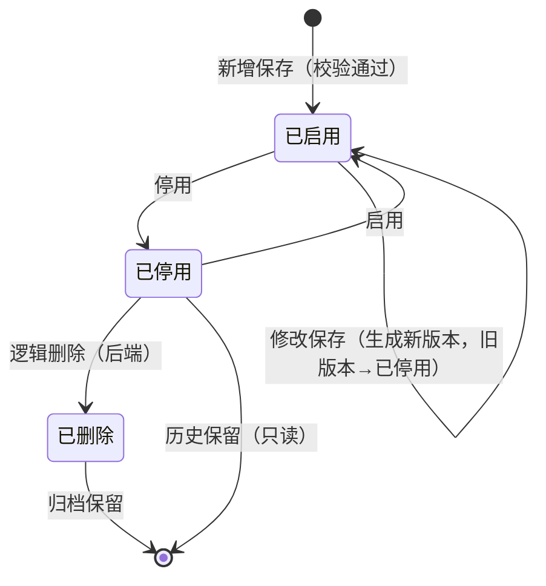
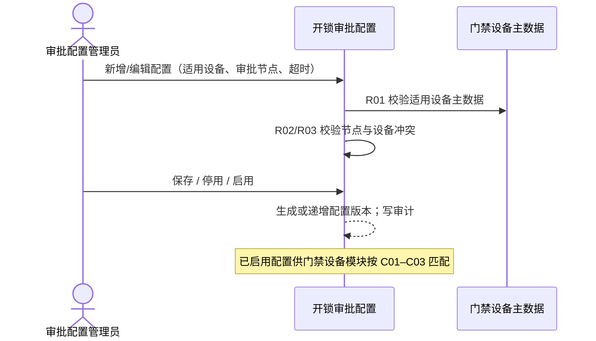

# 门禁开锁审批配置 业务规则规格

> **文档定位**：门禁开锁审批配置（菜单名「开锁审批」）状态机、动作约束、校验规则、匹配联动、权限与跨模块流程的**唯一定义来源**。主 PRD、字段清单只引用本文件规则 ID 与流程章节，不重复定义规则本体。
>
> **模块类型**：配置策略类（范式 A 裁剪版——有「已启用 / 已停用 / 已删除」生命周期与配置版本化，无审批流、无草稿态；**已停用**可逻辑删除）
>
> **参考文档**：[《门禁开锁审批配置主PRD》](./门禁开锁审批配置主PRD.md)、[《门禁开锁审批配置字段清单》](./门禁开锁审批配置字段清单.md)、[《门禁开锁审批-业务规则规格》](../门禁开锁审批-业务规则规格.md)（全链路唯一定义来源）、[《门禁开锁审批-业务流程推演》](../门禁开锁审批-业务流程推演.md)、[《门禁设备业务规则规格》](../../01-物联网IOT管理/02门禁设备/门禁设备业务规则规格.md)
>
> **职责边界**：本文件**仅**定义开锁审批配置的创建、编辑、启停用、版本化与匹配写入规则。**不包含**开锁申请、审批任务、临时凭证、门禁事务——上述对象规则见 [07-审批中心/03-业务审批/04-我的申请管理/04-开锁审批](../../07-审批中心/03-业务审批/04-我的申请管理/04-开锁审批/开锁申请业务规则规格.md) 及 [审批中心业务规则规格（基准）](../../../../🌟🌟🌟-最新基准版/B端PC/01-工作中心/01-审批中心/02-审批中心业务规则规格.md)。
>
> **版本**：V1.2 | 2026-09-01

---

## 0. 统一配置模型约束

本文件定义的配置实体是门禁开锁审批链路的**策略唯一定义来源**：

- 配置主键为 **配置编号**；同一逻辑配置修改后通过 **配置版本** 递增留痕，旧版本状态→**已停用**。
- 下游（门禁设备模块、开锁申请）匹配时只读取 **状态=已启用** 的配置；引用时固化 **配置编号 + 配置版本** 快照（C04）。
- **适用范围固定为指定设备**：每条配置绑定一组 **适用设备**；不再支持按仓库、库房、分区或未绑定位置全局配置，从根本上避免配置重叠与优先级争议。
- **审批节点**为内嵌有序结构：每节点 **审批对象类型** 二选一（指定人员 / 指定角色），同一节点不可混选；不同节点可分别配置。
- **审批方式** 6.2 固定为 **任一人通过**：各节点解析出的 eligible 人员并行待办，任一人通过即完成审批；前端不展示审批方式选项；数据模型保留 **按顺序审批** 枚举供后续扩展，保存时默认写入「任一人通过」。
- 配置保存/启用时校验审批节点有效性（R02）；**角色展开与申请人排除**在申请提交时执行（R28、R30，见全链路规格及 07-开锁申请子类型）。

---

## 一、能力定位

| 项目 | 内容 |
| :--- | :--- |
| **模块层级** | 配置策略层（非申请单据层、非审批执行层） |
| **菜单路径** | `配置管理 → 业务流程管理 → 开锁审批` |
| **核心职责** | 维护按**指定设备**的开锁审批策略：适用设备、审批节点、审批超时时间；管理配置启停用与版本 |
| **配置来源** | 审批配置管理员手动新增/编辑 |
| **上游依赖** | **门禁设备主数据**：适用设备；**人员账号 / RBAC 角色**：审批节点中的指定人员、指定角色 |
| **下游影响** | **门禁设备模块**：获取门锁密码时按 C01–C03 按设备 ID 匹配已启用配置，决定免审或进入审批申请；**开锁申请**：命中后固化配置编号、配置版本、审批方式、审批节点快照；在途申请不受后续配置变更影响（C04）。匹配执行与运行时冲突阻断在门禁设备/申请侧完成，不在本模块页面处理 |
| **审核流** | **无**——新增保存校验通过后直接 **已启用**，无草稿/待审核态 |
| **与申请侧边界** | 本模块 **状态**=配置生命周期；申请 **申请状态**=授权意图审批进度；二者语义不同 |

---

## 二、状态定义

| 状态名称 | 枚举值 | 业务含义 | 是否终态 | 进入条件 | 离开条件 |
| :--- | :--- | :--- | :---: | :--- | :--- |
| 已启用 | `ENABLED` | 对新申请生效的有效配置版本 | 否 | 新增保存成功；自「已停用」启用成功 | 停用；修改生成新版本（旧版本→已停用） |
| 已停用 | `DISABLED` | 不再匹配新申请；历史申请保留配置快照 | **是** | 停用确认；被新版本替代 | 启用成功；逻辑删除 |
| 已删除 | `DELETED` | 逻辑删除；列表不可见；历史申请保留快照 | **是** | 后端逻辑删除 | — |

**设计说明**：

- **不支持草稿态**；新增表单不展示 **状态** 字段，保存成功后直接进入 **已启用**。
- **逻辑删除（C08）**：**仅已停用**配置可在前端删除；删除后列表不可见，历史申请保留快照。
- 状态变更**禁止**通过表单 Dropdown 修改，必须通过独立动作按钮（停用、启用）或保存流转触发。
- 修改已启用配置并保存时：当前记录生成 **新版本** 且保持 **已启用**；**旧版本** 自动变为 **已停用**。

---

## 三、状态流转图

---

## 四、状态流转表

> 前置条件须**全部**满足才允许触发动作；「后置影响」列出除状态变更以外的级联影响。

| 当前状态 | 动作 | 前置条件 | 结果状态 | 二次确认 | 后置影响 | 失败处理 |
| :--- | :--- | :--- | :--- | :--- | :--- | :--- |
| — | 新增保存 | R01–R04、R27 校验通过；必填字段完整 | 已启用 | 「保存后新申请将按本配置匹配，确认保存？」 | ① 生成 **配置编号**；② **配置版本**=1；③ **审批方式**=任一人通过；④ 开始对新申请生效；⑤ 写 **操作审计日志** | 轻提示 (Toast)：「保存失败：{具体原因}」 |
| 已启用 | 停用 | P02 写权限 | 已停用 | 「停用后新申请不再命中本配置，在途申请不受影响，确认停用？」 | ① 写入 **停用原因**；② 只影响新申请匹配（C04）；③ 写审计 | 轻提示：「停用失败：配置状态已变更」 |
| 已启用 | 修改保存 | R01–R04、R27 通过；携带 **Version**；R06 不可变字段未变更 | 已启用（新版本） | 「修改将生成新版本，在途申请继续使用旧版本快照，确认保存？」 | ① 旧版本→已停用；② 新版本 **配置版本**+1；③ 写审计 | 轻提示：「保存失败：{具体原因}」或「数据已被他人修改，请刷新重试」（R07） |
| 已停用 | 启用 | R01–R04、R27 通过；P02 写权限 | 已启用 | 「启用后新申请将按本配置匹配，确认启用？」 | ① 恢复对新申请生效；② 写审计 | 轻提示：「启用失败：{具体原因}」 |
| 已停用 | 逻辑删除 | P02 写权限 | 已删除 | 「删除后列表将不再展示本配置，历史申请仍保留配置快照，确认删除？」 | ① 列表不可见；② 历史申请保留快照（C04）；③ 写审计 | 轻提示：「删除失败：配置状态已变更」 |

---

## 五、动作能力矩阵

> ✅ = 允许；❌ = 不允许（不展示入口）

| 动作 | 已启用 | 已停用 | 前端 6.2 | 后端 |
| :--- | :---: | :---: | :---: | :---: |
| 查看列表/详情 | ✅ | ✅ | ✅ | ✅ |
| 新增 | ✅ | ✅ | ✅ | ✅ |
| 编辑 | ✅（生成新版本） | ❌ | ✅ | ✅ |
| 启用 | ❌ | ✅ | ✅ | ✅ |
| 停用 | ✅ | ❌ | ✅ | ✅ |
| 逻辑删除 | ❌ | ✅ | ✅（仅已停用） | ✅ |
| 导出 | ❌ | ❌ | ❌ | ❌ |

> 「新增」与当前列表中其他配置的使用状态无关。

---

## 六、校验规则

### 6.1 适用设备与主数据校验

| 规则ID | 规则 | 校验时机 | 违反处理 |
| :--- | :--- | :--- | :--- |
| **R01** | **适用设备** 引用的门禁设备主数据须存在且有效（挂锁门禁、人脸门禁） | 新增/修改/启用 | 阻断，提示「保存/启用失败：设备{编码}不存在或已停用」 |
| **R03** | 同一设备不得同时出现在多条 **内容不一致** 的同时 **已启用** 配置中 | 新增/修改/启用 | 阻断，提示「保存/启用失败：与配置{编号}存在设备冲突」 |

**条件必填**（字段清单约束，保存时一并校验）：

| 字段 | 必填条件 |
| :--- | :--- |
| 适用设备 | 始终必填；至少选择 1 台设备 |

### 6.2 审批节点与审批方式校验

| 规则ID | 规则 | 校验时机 | 违反处理 |
| :--- | :--- | :--- | :--- |
| **R02** | **指定人员**须为启用账号；**指定角色**须为启用角色且至少 **1 个** 启用成员 | 新增/修改/启用 | 阻断，提示「保存/启用失败：审批节点{序号}无效」 |
| **R27** | **审批节点**至少 1 个；每节点 **审批对象类型** 为「指定人员」或「指定角色」，同一节点不可混选；不同节点可分别配置 | 新增/修改 | 阻断，提示节点配置不完整 |
| — | **审批方式**系统默认为「任一人通过」；前端不展示；数据模型保留「按顺序审批」枚举 | 新增/修改 | 自动写入默认值 |
| — | **审批超时时间**为正整数（单位：小时） | 新增/修改 | 阻断 |

### 6.3 表单与字段约束

| 规则ID | 规则 | 校验时机 | 违反处理 |
| :--- | :--- | :--- | :--- |
| **R04** | 操作人须具备审批配置管理权限（P02 子权限） | 写操作 | 阻断，「无操作权限」 |
| **R04a** | **配置名称**必填，租户内唯一，长度 ≤50 字符 | 新增 | 阻断，提示「配置名称已存在」或「配置名称不可为空」 |
| **R06** | 编辑时 **配置名称**、**适用设备** 不可修改（置灰）；需调整设备范围时停用旧配置并新增 | 编辑 | 服务端拒绝变更不可变字段 |
| **R07** | 编辑保存须携带 **Version**，乐观锁校验 | 编辑 | 阻断，「数据已被他人修改，请刷新重试」 |

### 6.4 停用 vs 修改新版本 vs 启用 vs 逻辑删除（易混点）

| 维度 | 停用 | 修改保存（新版本） | 启用 | 逻辑删除 |
| :--- | :--- | :--- | :--- | :--- |
| **触发方** | 人工 | 人工 | 人工 | 人工（前端/API） |
| **当前版本状态** | 已启用→已停用 | 旧版本→已停用；新版本→已启用 | 已停用→已启用 | 已停用→已删除 |
| **对新申请匹配** | 停止命中 | 仅新版本命中 | 恢复命中 | 不再命中 |
| **在途申请** | 继续使用停用前快照（C04） | 继续使用旧版本快照（C04） | 不影响在途 | 继续使用删除前快照（C04） |
| **可编辑** | — | 仅策略字段（审批节点、超时） | — | — |
| **二次确认** | 须填 **停用原因** | 「修改将生成新版本…」 | 「启用后新申请将按本配置匹配…」 | 「删除后列表将不再展示本配置，历史申请仍保留配置快照，确认删除？」 |

---

## 七、计算与联动规则

### 7.1 配置匹配规则（供下游读取）

| 规则ID | 规则 |
| :--- | :--- |
| **C01** | **按设备精确匹配**：获取密码时按设备 ID 在 **状态=已启用** 的配置中查找；设备出现在某配置的 **适用设备** 列表中即命中该配置 |
| **C02** | **未命中免审**：设备未出现在任何已启用配置的适用设备列表中，走原有免审直发密码流程；不得将「未命中配置」静默当成需审批或阻断 |
| **C03** | **设备冲突**：同一设备不得同时归属多条内容不一致的已启用配置；**配置保存/启用** 时直接阻止；运行时若历史数据已造成冲突，**门禁设备/申请侧** 阻断并提示管理员修正 |
| **C04** | **配置快照**：配置一旦被申请引用，不因后续停用、修改或逻辑删除而改变历史申请中的 **配置编号**、**配置版本**、**审批方式**、**审批节点快照** |

### 7.2 版本与生命周期联动

| 规则ID | 规则 |
| :--- | :--- |
| **C05** | **修改已启用配置**保存成功后：旧记录 **状态**→已停用，新记录 **状态**→已启用，**配置版本** 递增；**配置编号** 沿用（同一逻辑配置） |
| **C06** | **停用** 只影响 **新申请** 匹配；不修改、不回写已有开锁申请与审批任务 |
| **C07** | **审批可见性**：所有参与审批的人员（含已通过/已关闭待办的审批人）均可查看审批记录及最终审批人信息，确保操作可追溯（执行在 07-开锁审核侧） |
| **C08** | **逻辑删除**：**仅已停用** 配置可删除；**已删除** 列表不可见；历史申请保留 **C04** 快照 |

### 7.3 下游审批节点解析（只读引用，执行在申请侧）

> 以下规则由本模块写入配置；**展开与校验在申请提交时执行**，正文见 [开锁申请业务规则规格 §3.2](../../07-审批中心/03-业务审批/04-我的申请管理/04-开锁审批/开锁申请业务规则规格.md#32-审批方式规则本子类型消费)。

| 规则ID | 规则 | 执行模块 |
| :--- | :--- | :--- |
| **R28** | 指定角色节点在申请提交时展开为当时角色下所有启用账号并写入 **审批人快照**；在途不重算 | 07-开锁申请 |
| **R30** | 角色节点展开后 eligible 人员为空（含排除申请人后）则阻断申请提交 | 开锁申请 |

---

## 八、权限规则

### 8.1 数据可见范围

| 规则ID | 规则 |
| :--- | :--- |
| **P01** | 须具备 `[配置管理 · 业务流程管理 · 开锁审批 · 查看]` 方可进入列表及详情；无权限时隐藏菜单入口 |
| **P01a** | 租户隔离：仅可见本租户配置（不含已逻辑删除） |

### 8.2 操作权限

| 规则ID | 规则 |
| :--- | :--- |
| **P02** | `[新增]`、`[编辑]`、`[启用]`、`[停用]`、`[逻辑删除]` 须配置独立子权限位；无权限时按钮隐藏；**逻辑删除** 仅 **已停用** 行/详情展示 |

### 8.3 操作权限矩阵

| 操作 | 审批配置管理员（查看） | 审批配置管理员（写） |
| :--- | :---: | :---: |
| 查看列表/详情 | ✅（P01） | ✅ |
| 新增 | ❌ | ✅（P02） |
| 编辑 | ❌ | ✅（P02） |
| 启用/停用 | ❌ | ✅（P02） |
| 逻辑删除 | ❌ | ✅（P02，**仅已停用**） |

> 适用设备选择器的候选范围遵循门禁设备模块既有数据权限；写操作时服务端二次校验，不能只依赖前端列表。

---

## 九、边界与异常处理

### 9.1 并发控制

| 场景 | 处理方式 |
| :--- | :--- |
| 两人同时编辑同一已启用配置 | **R07** 乐观锁，后提交者提示「数据已被他人修改，请刷新重试」 |
| 编辑保存与停用并发 | 以数据库状态条件更新为准，失败方提示「配置状态已变更」 |

### 9.2 幂等与审计

| 规则ID | 规则 |
| :--- | :--- |
| **A01** | 配置 **新增/修改/启用/停用/逻辑删除** 须写 **操作审计日志**：操作人、时间、**配置编号**、**配置版本**、前后 **状态**、失败原因 |
| **A02** | 审计日志**严禁**记录密码明文、短信全文 |
| — | 同一 **配置编号 + 配置版本** 重复启用/停用请求，按幂等返回原结果 |

### 9.3 上下游不一致

| 场景 | 处理方式 |
| :--- | :--- |
| 配置已停用，在途申请仍引用旧版本 | 正常；C04 保证快照不变 |
| 适用设备在配置保存后被停用 | 不 retroactive 修改已保存配置；**新申请**匹配时由下游 R01 类校验处理 |
| 指定人员停用，但配置仍为已启用 | 保存时已校验 R02；运行后该节点在申请展开时可能无效，由 **R30** 在申请侧阻断 |
| 设备命中多条冲突规则 | 不在本模块处理；C03 运行时由门禁设备/申请侧阻断 |

### 9.4 本模块不处理的异常

| 场景 | 归属 |
| :--- | :--- |
| 开锁申请提交、撤回、超时 | [07-审批中心/03-业务审批/04-我的申请管理/04-开锁审批](../../07-审批中心/03-业务审批/04-我的申请管理/04-开锁审批/开锁申请业务规则规格.md) |
| 审批通过/驳回、待办分发 | 同上 §二–§三 |
| 密码生成与下发 | 同上 §四 |
| 门禁事务关联 | 同上 §五 |

---

## 十、规则索引

| 规则类型 | 代码范围 | 说明 |
| :--- | :--- | :--- |
| 校验规则 | R01 – R04a、R06 – R07、R27 | 设备、节点、表单、权限 |
| 计算联动规则 | C01 – C08 | 设备匹配、快照、版本化、生命周期、可见性 |
| 权限规则 | P01 – P02 | 菜单与子操作权限 |
| 审计规则 | A01 – A02 | 操作留痕与敏感字段 |
| 下游解析（引用） | R28、R30 | 申请侧执行，见 §7.3 |

> 全链路其他规则（R05–R09、R14–R15、R20–R26、R28、R30、R31、W00、P03/P07 等）见 [《开锁申请业务规则规格》](../../07-审批中心/03-业务审批/04-我的申请管理/04-开锁审批/开锁申请业务规则规格.md) 及 [《审批中心业务规则规格（基准）》](../../../../🌟🌟🌟-最新基准版/B端PC/01-工作中心/01-审批中心/02-审批中心业务规则规格.md)（R10–R13、R18–R19）。

---

## 附录 A：审批策略枚举

> **权威来源**：本附录为 [门禁开锁审批配置字段清单](./门禁开锁审批配置字段清单.md) 动态选项的唯一枚举。

| 字段 | 枚举值 | 说明 |
| :--- | :--- | :--- |
| **审批方式** | 任一人通过（6.2 默认且前端唯一生效）、按顺序审批（数据模型保留，前端不展示） | 决定下游待办生成方式 |
| **审批对象类型** | 指定人员、指定角色 | 每节点二选一 |
| **状态** | 已启用、已停用、已删除 | 系统维护；已删除为逻辑删除态 |

---

## 业务流程与联动

> 本模块仅覆盖推演 **阶段一：配置审批规则**；完整链路见 [《门禁开锁审批-业务流程推演》](../门禁开锁审批-业务流程推演.md)。

| 上游动作 | 触发条件 | 后置影响 |
| :--- | :--- | :--- |
| 新增/启用配置 | R01–R04、R27 通过 | 新申请可按 C01–C03 匹配 |
| 修改配置 | 同新增校验；R07 通过 | 旧版本已停用；新版本已启用 |
| 停用配置 | 填写停用原因 | 新申请不再命中；在途申请保留快照 |
| 逻辑删除配置 | 后端 API；P02 | 列表不可见；在途申请保留快照 |
| 主数据变更 | 设备停用 | 不自动改配置；新匹配由下游校验 |

---

## 修订记录

| 日期 | 版本 | 变更摘要 |
| :--- | :---: | :--- |
| 2026-08-28 | V1.1 | 申请执行规则引用改为 07 模块唯一定义来源；全链路规格降为编排索引 |
| 2026-09-01 | V1.2 | 评审调整：仅保留指定设备；审批方式固定任一人通过；补充逻辑删除；简化 C01–C03；移除 R29、仓库/分区/全局配置 |
| 2026-09-01 | V1.3 | 开放前端逻辑删除：仅已停用；二次确认文案；C08/P02 矩阵更新 |

---

## 设计自检清单

- [x] 状态机有入口（新增→已启用）、出口（已停用/已删除终态）、修改新版本路径
- [x] 职责不含开锁申请、审批处理、凭证下发
- [x] 规则 ID 与全链路规格 R01–R04、R27、C01–C08 保持一致
- [x] 字段名称与《门禁开锁审批配置字段清单》一致
- [x] 未引入推演与全链路规格未确认的新规则
