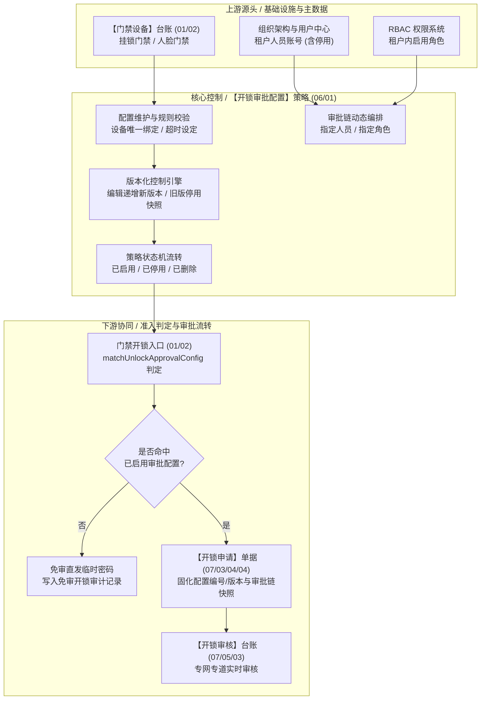
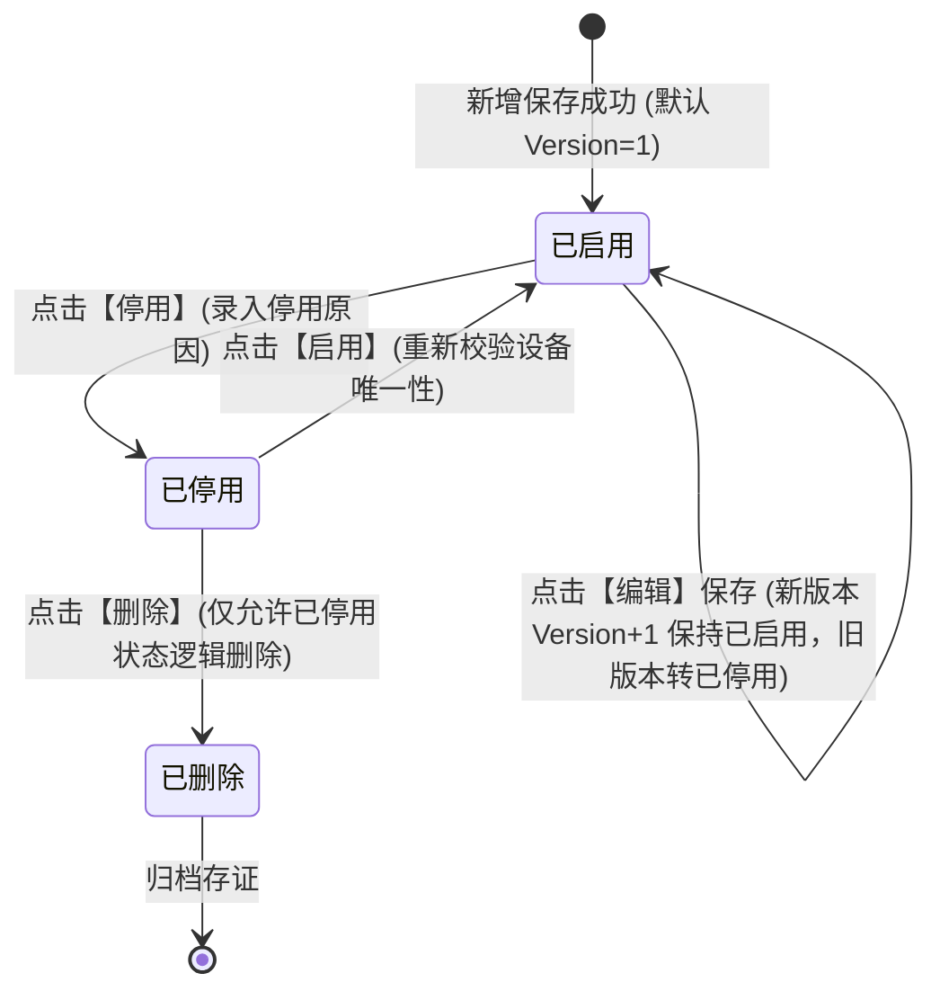

# 门禁开锁审批配置 主PRD

> **文档体系（三件套为核心）**：
>
> | 层级 | 文档 | 职责 | 真源 |
> | :--- | :--- | :--- | :---: |
> | **核心** | 本文（主 PRD） | 业务背景、痛点、功能范围、模块架构、**页面功能说明**、业务场景、状态机摘要、规则摘要、验收 | ✅ |
> | **核心** | [门禁开锁审批配置字段清单](./门禁开锁审批配置字段清单.md) | 字段定义、筛选/列表/新增编辑/详情、展示顺序、必填性与控件规格 | ✅ |
> | **核心** | [门禁开锁审批配置业务规则规格](./门禁开锁审批配置业务规则规格.md) | 状态机本体、R/C/P 规则、计算口径、动作矩阵、异常矩阵、时序图 | ✅ |
> | *衍生* | ASCII 线框 / Demo 文档 | 由三件套派生的可视化与原型输入，**非独立真源** | ❌ |
>
> **版本**：V4.0 基准版 | **更新时间**：2026-09-18 | **责任人**：产品架构组
>
> **文档定位**：门禁开锁审批配置（菜单名「开锁审批」）功能规格、信息架构、业务场景与验收标准的主文档。
>
> **统一引用规范**：
> - 本策略：【开锁审批配置】策略（菜单：配置管理 → 业务流程管理 → 开锁审批，代号 06/01）
> - 上游设备：【门禁设备】台账（菜单：物联网IOT管理 → 门禁设备，代号 01/02）
> - 下游申请：【开锁申请】单据（菜单：工作中心 → 审批中心 → 业务审批 → 我的申请管理 → 开锁申请，代号 07/03/04/04）
> - 下游审核：【开锁审核】台账（菜单：工作中心 → 审批中心 → 其他审批 → 开锁审核，代号 07/05/03）
> - 状态机与业务规则本体 → [《门禁开锁审批配置业务规则规格》](./门禁开锁审批配置业务规则规格.md)
> - 字段层级与属性 → [《门禁开锁审批配置字段清单》](./门禁开锁审批配置字段清单.md)

---

## 一、业务背景与业务痛点

### 1.1 业务背景
在 SYZC 供应链金融动产质押存货监管体系中，大宗商品质押物（如电解铜、铝锭、热轧卷板）存放在监管仓库、交割仓库或企业自管库中。门禁设备（挂锁门禁、人脸识别门禁）作为守护质押物货权物理安全的第一道防线，承载着现场人员进出库房、查验货品与提货开锁的物理管控。

原有系统中，用户在移动端或 PC 端点击【获取门禁密码】或【获取门锁密码】即可直接获取临时开锁凭证。然而在高货值、高风险等级的大宗商品质押场景下，商业银行与保理方对库房进出具有极严格的合规审计要求。为此，系统在门禁开锁环节全面引入**前置审批授权与策略管控机制**。

【开锁审批配置】策略（菜单：配置管理 → 业务流程管理 → 开锁审批，代号 06/01）作为门禁安全链路的策略控制中枢，负责为管理人员提供集中配置、精细化绑定、多级审批链编排与超时失效管理能力。

### 1.2 核心业务痛点
* **【关键防线缺乏前置受控授权】**：重要监管仓库与保税库区缺乏差异化授权，任何注册库管或现场人员均可免审直取开锁密码，存在质押货权被私自移动或非法出库的风控漏洞。
* **【层级泛化引发规则冲突死锁】**：按仓库、库房或分区粗粒度配置策略容易造成空间包含关系的规则交叉与优先级争议，导致现场开锁时无法准确匹配唯一的审批链条。
* **【策略变动破坏在途业务与司法存证】**：若配置修改直接覆盖既有申请或既有单据，会导致历史开锁单据与当时实际生效规则脱节，在司法纠纷时破坏开锁凭证与审批事实的不可变证据效力。
* **【审批链孤岛与审批人员配置死锁】**：审批人员离职、转岗、账号停用或指定角色人员空缺时，缺乏前置防抖与申请时动态解析兜底机制，导致现场紧急开锁申请长期挂起形成业务阻断。

---

## 二、功能范围

| 包含功能范围 (In Scope) | 不包含功能范围 (Out of Scope) |
| :--- | :--- |
| **【配置生命周期管理】**：支持开锁审批配置的新增、编辑、启用、停用与已停用记录的逻辑删除。 | **【开锁申请发起与交互】**：现场人员发起开锁申请、录入事由与现场照片，属于【开锁申请】单据（菜单：工作中心 → 审批中心 → 业务审批 → 我的申请管理 → 开锁申请，代号 07/03/04/04）。 |
| **【指定设备精细绑定】**：强制基于具体【门禁设备】台账（代号 01/02）进行 1:N 绑定，杜绝空间重叠。 | **【审批人审核流转与处理】**：审批人在工作中心进行通过/驳回操作，属于【开锁审核】台账（菜单：工作中心 → 审批中心 → 其他审批 → 开锁审核，代号 07/05/03）。 |
| **【审批链灵活编排】**：支持多级审批节点，每个节点独立指定人员（含启用/停用账号）或指定角色（启用角色）。 | **【密码生成与凭证分发】**：审批通过后的动态密码计算、短信发送与硬件联动，属于硬件接入层与凭证服务。 |
| **【多版本平滑演进】**：编辑已启用配置自动生成递增新版本，旧版本自动转为停用并固化为不可变快照。 | **【常规流程引擎接入】**：开锁审批专网专道运行，不接入通用工作流引擎，不进通用待办池。 |
| **【超时失效时间控制】**：支持配置 1~72 小时正整数审批超时时效，驱动后台定时任务扫描。 | **【跨租户数据共享】**：本策略严格遵循租户物理隔离，人员与角色均限定在本租户内。 |

---

## 三、模块定位与系统链路

### 3.1 模块定位
【开锁审批配置】策略（菜单：配置管理 → 业务流程管理 → 开锁审批，代号 06/01）在系统整体架构中属于**安全控制策略层（Policy Strategy Layer）**。它向上衔接门禁设备台账主数据与租户组织架构，向下驱动开锁申请判断逻辑与审批链解析，是货权物理准入防线的核心决策大脑。

### 3.2 系统链路图

---

## 四、业务场景与用户故事

| 场景编号与名称 | 触发角色 | 核心交互与风控约束 | 业务价值 |
| :--- | :--- | :--- | :--- |
| **【SC-01 关键库门策略新增】** | 仓储安全管理员 (`R-WH-SEC`) | 针对新投入使用的贵重金属监管库挂锁，在列表点击【+ 新增配置】，录入规则名称、穿梭框绑定 3 台特定挂锁门禁、设定 4 小时审批超时时间，添加 2 级审批节点（1 节点指定驻库风控岗，2 节点指定驻库主管）。系统校验设备在生效策略中无重叠后直接保存生效。 | 实现高风险区域门禁开锁的严格前置授权，消除私自提货风险。 |
| **【SC-02 审批策略版本升级】** | 质押风控主管 (`R-RISK-MGR`) | 因风控人员调整，在列表中对生效中的某配置点击【编辑】，将审批节点 1 的指定人员替换为新风控员，超时时间缩短为 2 小时。点击保存时系统弹窗提示将生成新版本，确认后生成 Version N+1（已启用），旧 Version N 自动转为已停用。 | 保证风控规则平滑演变，且不影响在途执行的开锁申请。 |
| **【SC-03 设备维护策略停用】** | 系统运营管理员 (`R-SYS-OP`) | 某监管仓库进入大修期，仓门常开且有物理围挡，管理员点击该配置行操作【停用】并强制录入停用原因。确认后状态变为已停用，对应门禁后续开锁自动降级为免审直发模式。 | 兼顾运营便利性与审计合规性，操作全程留痕。 |
| **【SC-04 失效规则逻辑清理】** | 仓储安全管理员 (`R-WH-SEC`) | 对因仓库拆迁已停用的历史配置，在列表中点击【删除】。系统二次弹窗确认后执行逻辑删除，列表不再展示，但历史开锁记录中引用的快照数据依然完备可查。 | 保持配置台账整洁清爽，同时满足司法审计不可变存证要求。 |

---

## 五、状态机与动作能力矩阵

### 5.1 状态定义
* **已启用 (`ENABLED`)**：有效策略状态。对新发起开锁行为具有判定效力，设备被独占绑定；
* **已停用 (`DISABLED`)**：非生效状态。新发起开锁行为不再命中本策略，设备释放绑定，在途业务继续按历史快照执行；
* **已删除 (`DELETED`)**：逻辑终态。列表不可见，后台软删除归档，历史关联单据快照持久保留。

### 5.2 状态流转图

### 5.3 动作能力矩阵

| 动作名称 | 已启用 (`ENABLED`) | 已停用 (`DISABLED`) | 已删除 (`DELETED`) |
| :--- | :---: | :---: | :---: |
| **查看列表 / 详情** | ✅ | ✅ | ❌ |
| **新增配置** | ✅ | ✅ | ❌ |
| **编辑保存 (升级版本)** | ✅ (生成 Version+1) | ❌ | ❌ |
| **启用策略** | ❌ (已处于该态) | ✅ (校验设备无冲突) | ❌ |
| **停用策略** | ✅ (录入停用原因) | ❌ (已处于该态) | ❌ |
| **逻辑删除** | ❌ (阻断：必须先停用) | ✅ (二次确认) | ❌ |

---

## 六、页面交互规格索引

### 6.1 PC 端列表页交互规格
* **页面路径**：`配置管理 → 业务流程管理 → 开锁审批`（`/config/business-process/unlock-approval`）
* **页面骨架**：面包屑导航 + 统计汇总指标卡 + 筛选区 Card + 动作操作区 + 数据表格 + 分页栏。
* **筛选交互**：
  - 配置名称（文本输入，支持模糊检索）；
  - 状态（下拉单选：全部、已启用、已停用）；
  - 配置编号（展开高级筛选后展示，精确匹配）；
  - 重置按钮恢复默认空条件，查询按钮支持防抖提交。
* **行操作区**：
  - 状态为「已启用」行展示：【详情】、【编辑】、【停用】；
  - 状态为「已停用」行展示：【详情】、【启用】、【删除】。

### 6.2 PC 端新增 / 编辑表单交互规格
* **基础信息区**：
  - 配置名称：单行输入框，最多 50 字符，租户内重名校验；编辑时置灰只读；
  - 适用设备：穿梭框交互。左侧为待选设备列表（仅展示挂锁门禁与人脸门禁，自动过滤已被其他已启用配置绑定的设备），右侧为已选设备列表；新增时必选 $\ge 1$ 台，编辑时置灰只读。
* **策略配置区**：
  - 审批方式：展示「任一人通过（系统默认）」，置灰只读；
  - 审批超时时间：正整数数值输入框，步长为 1，范围 1~72 小时，右侧带单位「小时」；
  - 审批节点列表：支持点击【+ 添加审批节点】（上限 5 级），每个节点支持选择「审批对象类型」（单选：指定人员 / 指定角色）：
    - 选「指定人员」时展示租户人员下拉单选框（展示姓名、账号及所属机构，允许选择停用账号，展示停用标签）；
    - 选「指定角色」时展示租户启用角色下拉单选框；
    - 支持节点上移、下移与删除操作。
* **防未保存离开拦截**：表单 Dirty 状态下点击取消或路由跳转弹出离开确认拦截弹窗。

### 6.3 PC 端详情抽屉 / 页面规格
* **展示结构**：顶部展示配置编号、配置名称与状态徽章；
* **内容分区**：
  1. 基础信息：配置名称、创建人、创建时间、最后更新时间、生效版本；
  2. 适用设备清单：展示绑定的设备编号、设备名称、设备类型（挂锁/人脸）、安装仓库与库区；
  3. 审批链配置：可视化按顺序展示审批节点流水线，标明节点序号、对象类型、指定人/角色及超时时效；
  4. 历史版本与变更记录：折叠面板展示历史停用版本列表，支持点击查看历史版本不可变快照。

---

## 七、核心业务规则索引与非功能需求

### 7.1 核心规则映射索引
| 规则类别 | 规则编号 | 规则名称 | 核心控制摘要 |
| :--- | :--- | :--- | :--- |
| **范围唯一** | R01 | 适用设备独占性校验 | 同一门禁设备在同一租户内仅能绑定于 1 条「已启用」的开锁审批配置。 |
| **节点合法** | R02 | 审批节点完整性校验 | 至少包含 1 个有效节点；各节点人员或角色必须明确且在本租户内有效。 |
| **版本控制** | R03 | 编辑递增与版本不可变 | 修改已启用配置直接生成 Version+1（已启用），旧版本转已停用并锁定快照。 |
| **字段只读** | R04 | 关键风控属性不可变 | 编辑配置时，配置名称与适用设备列表严格只读，禁止篡改。 |
| **删除保护** | R05 | 生效策略禁止直接删除 | 处于「已启用」状态的配置绝对禁止删除，必须先执行停用操作。 |
| **并发防护** | R06 | 乐观锁版本并发控制 | 保存、启用与停用携带版本戳，并发冲突时阻断并提示刷新重试。 |

### 7.2 非功能性需求
* **响应时延**：列表加载耗时 $\le 800\text{ms}$，新增/编辑保存响应耗时 $\le 1.2\text{s}$；
* **高可用与并发**：配置读缓存支撑高频开锁并发判定，配置写操作采用租户级写锁保障设备唯一性校验零脏读；
* **审计完备性**：策略的新增、编辑、启用、停用及删除操作 100% 写入操作审计日志，持久化操作人、时间、变更前数据镜像与变更后数据镜像。

---
*版本说明：V4.0 基准版 | 责任人：产品架构组 | 2026年09月*
