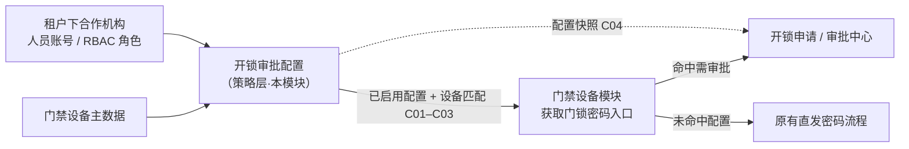
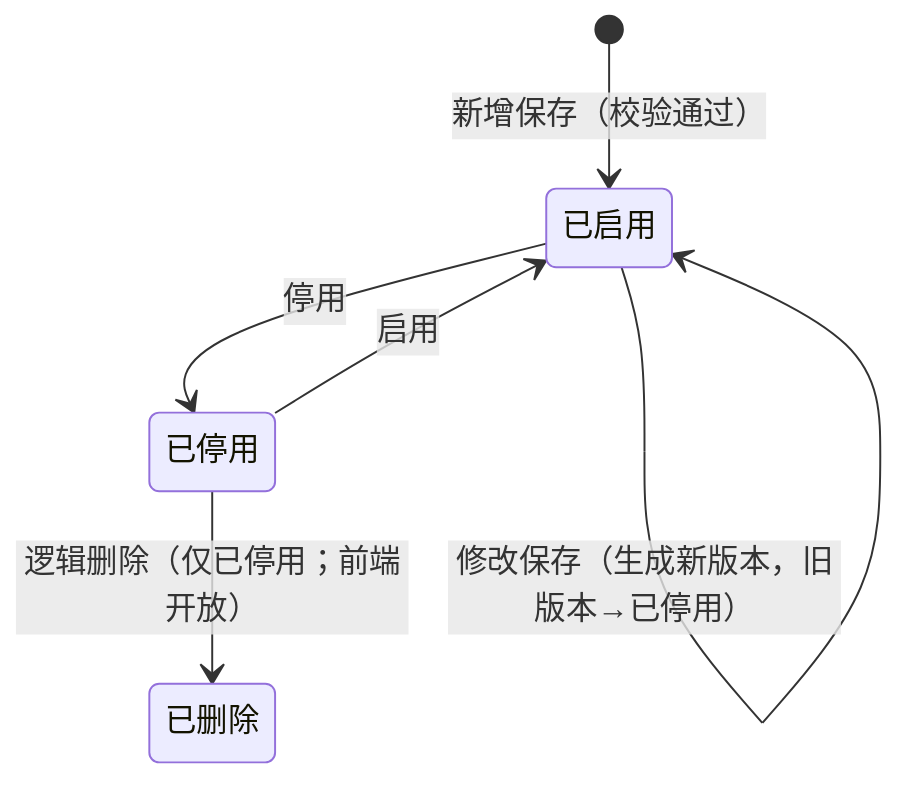

# 门禁开锁审批配置 主PRD

> **版本**：V1.4 | **更新时间**：2026-09-02 | **责任人**：产品
>
> **文档定位**：门禁开锁审批配置（菜单名「开锁审批」）功能规格、信息架构、业务场景与验收标准的主文档。
>
> **唯一定义来源 关系**：
> - 状态机与业务规则本体 → [《门禁开锁审批配置业务规则规格》](./门禁开锁审批配置业务规则规格.md)
> - 字段层级与属性 → [《门禁开锁审批配置字段清单》](./门禁开锁审批配置字段清单.md)
> - 全链路编排与索引 → [《门禁开锁审批-业务规则规格》](../门禁开锁审批-业务规则规格.md)
> - 全链路推演与决策 → [《门禁开锁审批-业务流程推演》](../门禁开锁审批-业务流程推演.md)

---

## 一、需求背景

在原有门禁管理体系中，用户在移动端或 PC 端点击「获取门锁密码」即可直接获取临时开锁凭证。为满足高风险监管仓库、关键库房及特定重要设备的风控合规要求，需要在获取密码环节引入**审批授权机制**。

开锁审批配置模块为管理人员提供集中维护开锁审批策略的能力：支持按**指定设备**灵活定义审批节点（指定人员或指定角色，候选范围限制在当前租户下合作机构）、审批超时时间，并实现策略的版本化留痕与启停用管理。

---

## 二、产品目标

1. **按设备精细化管控**：支持针对特定门禁设备（挂锁门禁、人脸门禁）配置专属审批策略；未配置设备继续沿用原有免审直发模式。
2. **多方协同与机构隔离**：审批节点支持指定人员与指定角色，候选数据严格受限于当前租户下合作机构，支持跨合作机构协同审批与风控穿透。
3. **极简高效配置**：审批方式默认采用「任一人通过」，新增保存直接生效，修改自动版本化递增，保障在途业务不受策略调整干扰。
4. **全生命周期可追溯**：支持启停用、逻辑删除与不可变字段锁定，操作全流程记录审计日志。

---

## 三、系统架构与上下游关系

> 本对象为**配置策略**，非业务单据；以下说明其在链路中的层级、职责与上下游关系。

### 3.1 在系统中的位置

| 项目 | 内容 |
| :--- | :--- |
| 模块层级 | **配置策略层**（非申请单据层、非审批执行层） |
| 核心职责 | 定义「哪些设备需要审批、审批链如何组成、超时多久失效」 |
| 配置来源 | 审批配置管理员手动新增/编辑 |
| 配置入口 | 配置管理 → 业务流程管理 → 开锁审批 |
| 上游依赖 | **门禁设备主数据**：适用设备；**机构与组织架构/合作机构**：当前租户下合作机构白名单；**人员账号 / RBAC 角色**：审批节点中的指定人员、指定角色（严格限制在当前租户下合作机构范围内） |
| 下游影响 | **门禁设备模块**：用户点击「获取门锁密码」时按 C01–C03 按设备 ID 匹配有效配置，决定走免审或进入审批申请；**开锁申请**：命中配置后固化配置编号、配置版本、审批方式、审批节点快照等字段；在途申请不受后续配置变更影响（C04） |
| 实体关系 | 一条配置对应一组适用设备（1:N 设备）；一条配置含多个审批节点（1:N）；配置与开锁申请为 **1:N**（同一配置版本可被多条申请引用） |

### 3.2 系统链路图

### 3.3 职责边界

| 模块 | 职责 |
| :--- | :--- |
| **开锁审批配置（本模块）** | 创建、编辑、启停用审批规则；维护配置版本；限定审批节点候选机构范围 |
| 门禁设备模块 | 读取配置并匹配；提供获取密码入口；未命中配置时免审直发或跳转申请 |
| 开锁申请 / 审批中心 | 申请创建、待办分发、审批动作、申请查询；**所有参与审批的人员均可查看审批记录及最终审批人信息** |
| 密码与短信服务 | 审批通过后的凭证生成与下发（本模块不参与） |

---

## 四、功能清单

| 功能编号 | 功能名称 | 适用角色 | PC 端 | 移动端 | 关键控制（规则引用） |
| :--- | :--- | :--- | :--- | :--- | :--- |
| CFG-01 | 配置列表与筛选 | 审批配置管理员（查看） | 筛选/分页 | — | P01；字段见配置名称、状态 |
| CFG-02 | 新增配置 | 审批配置管理员（新增） | 新增页 | — | R01–R04、P01b；保存后直接已启用 |
| CFG-03 | 编辑配置 | 审批配置管理员（编辑） | 编辑页 | — | 配置名称、适用设备不可改；修改生成新版本；Version 乐观锁 |
| CFG-04 | 停用配置 | 审批配置管理员（停用） | 列表/详情动作 | — | 停用原因必填；只影响新申请匹配 |
| CFG-05 | 启用配置 | 审批配置管理员（启用） | 列表/详情动作 | — | R01–R04 同新增 |
| CFG-06 | 查看详情 | 审批配置管理员（查看） | 详情页 | — | 已停用只读；展示配置版本、审批节点 |

---

## 五、业务场景

| 场景ID | 场景 | 类型 | 说明 |
| :--- | :--- | :--- | :--- |
| S01 | 新增指定设备配置并立即生效 | **主流程** | 填配置名称、勾选适用设备、从当前租户下合作机构中选择审批节点人员/角色、设审批超时时间 → 保存 → 状态=已启用，配置版本=1；审批方式系统默认为任一人通过 |
| S02 | 修改已启用配置生成新版本 | **主流程** | 已启用配置修改审批节点或审批超时时间 → 确认「修改将生成新版本」→ 旧版本已停用，新版本已启用，配置版本递增 |
| S03 | 停用后重新启用 | **支线** | 已启用 → 停用（填停用原因）→ 新申请不再命中 → 再启用 → 恢复匹配；在途申请继续使用停用前快照 |
| S04 | 审批节点混配跨机构人员与角色 | **支线** | 节点1=指定合作监管机构角色「监管主管」，节点2=指定本机构人员「张三」→ 审批方式=任一人通过 → 各节点解析出的 eligible 人员并行待办，任一人通过即完成 |
| S05 | 设备冲突阻断 | **异常** | 同一设备已存在于内容不一致的已启用配置 → 新增保存阻断，提示与配置{编号}存在设备冲突（R03） |
| S06 | 审批节点无效阻断 | **异常** | 所选人员账号停用、角色无启用成员、或机构非当前租户合作机构 → 保存阻断，提示审批节点{序号}无效（R02） |
| S07 | 并发编辑冲突 | **异常** | 两人同时编辑同一已启用配置 → 后提交者 Version 校验失败 → 提示刷新后重试 |
| S08 | 未配置设备免审 | **支线** | 设备未出现在任何已启用配置的适用设备列表中 → 门禁设备模块走原有免审直发密码流程（C02） |

---

## 六、状态机

> 完整定义见《[门禁开锁审批配置业务规则规格](./门禁开锁审批配置业务规则规格.md)》第二至五章。以下为摘要。

### 6.1 状态定义

| 状态 | 含义 | 是否终态 |
| :--- | :--- | :---: |
| 已启用 | 对新申请生效的有效配置版本 | 否 |
| 已停用 | 不再匹配新申请；历史申请保留配置快照 | **是** |

> 不支持草稿态；新增保存校验通过后直接进入**已启用**。**已停用**配置可在前端执行逻辑删除（C08）；日常废弃优先 **停用**。

### 6.2 状态流转图

### 6.3 状态流转表

| 当前状态 | 动作 | 前置条件 | 结果状态 | 二次确认 | 后置影响 | 失败处理 |
| :--- | :--- | :--- | :--- | :--- | :--- | :--- |
| — | 新增保存 | R01–R04、R27 通过；必填字段完整 | 已启用 | 「保存后新申请将按本配置匹配，确认保存？」 | 生成配置编号、配置版本=1；审批方式=任一人通过；开始对新申请生效 | Toast：「保存失败：{具体原因}」 |
| 已启用 | 停用 | P02 权限 | 已停用 | 「停用后新申请不再命中本配置，在途申请不受影响，确认停用？」 | 只影响新申请匹配；须写入停用原因 | Toast：「停用失败：配置状态已变更」 |
| 已启用 | 修改保存 | R01–R04、R27 通过 | 已启用（新版本） | 「修改将生成新版本，在途申请继续使用旧版本快照，确认保存？」 | 旧版本→已停用；新版本→已启用；配置版本递增 | Toast：「保存失败：{具体原因}」 |
| 已停用 | 启用 | R01–R04、R27 通过 | 已启用 | 「启用后新申请将按本配置匹配，确认启用？」 | 恢复对新申请生效 | Toast：「启用失败：{具体原因}」 |
| 已停用 | 逻辑删除 | P02 权限 | 已删除（逻辑） | 「删除后列表将不再展示本配置，历史申请仍保留配置快照，确认删除？」 | 列表不可见；历史申请保留配置快照（C04） | Toast：「删除失败：配置状态已变更」 |

### 6.4 动作能力矩阵

| 操作动作 | 已启用 | 已停用 | 前端 6.2 | 后端 |
| :--- | :---: | :---: | :---: | :---: |
| 查看详情 | ✅ | ✅ | ✅ | ✅ |
| 编辑 | ✅（生成新版本） | ❌ | ✅ | ✅ |
| 停用 | ✅ | ❌ | ✅ | ✅ |
| 启用 | ❌ | ✅ | ✅ | ✅ |
| 删除（逻辑） | ❌ | ✅ | ✅（仅已停用） | ✅ |

---

## 七、核心业务规则

> 规则详情以《门禁开锁审批配置业务规则规格》为准；本节仅收录摘要。

### 7.1 创建与保存规则

| 规则ID | 规则 |
| :--- | :--- |
| R01 | **适用设备** 引用的门禁设备主数据须存在且有效（挂锁门禁、人脸门禁） |
| R02 | 审批节点中：指定人员须为当前租户下合作机构中启用的账号；指定角色须为当前租户下合作机构中启用的角色且至少 1 个启用成员 |
| R03 | 同一设备不得同时出现在多条 **内容不一致** 的已启用配置中 |
| R04 | 操作人须具备审批配置管理权限 |
| R27 | 审批节点支持「指定人员」或「指定角色」；同一节点不可混选，不同节点可分别配置；至少保留 1 个节点 |
| — | **审批方式**系统默认为「任一人通过」；前端不展示选择项；数据模型保留「按顺序审批」枚举供扩展 |

### 7.2 版本与启停用规则

| 规则ID | 规则 |
| :--- | :--- |
| C04 | 配置一旦被申请引用，不因后续停用、修改或逻辑删除而改变历史申请中的配置快照 |
| C08 | 提供 **逻辑删除**；**仅已停用** 配置可在前端删除；**已删除** 列表不可见；历史申请保留快照（C04）；废弃配置也可先停用 |
| — | 新增表单不展示状态、审批方式字段；保存成功后状态=已启用、审批方式=任一人通过 |
| — | 编辑页配置名称、适用设备置灰不可修改；需调整设备范围时停用旧配置并新增 |
| — | 编辑已启用配置时，修改审批节点、审批超时时间保存后生成新版本，旧版本→已停用 |

### 7.3 配置匹配规则（写入侧 / 供下游读取）

| 规则ID | 规则 |
| :--- | :--- |
| C01 | **按设备精确匹配**：获取密码时按设备 ID 查找状态=已启用的配置；命中则进入审批流程 |
| C02 | **未命中免审**：设备未出现在任何已启用配置的适用设备列表中，走原有免审直发密码流程；不得静默阻断 |
| C03 | **设备冲突**：保存/启用时同一设备不得归属多条内容不一致的已启用配置；运行时若历史数据已造成冲突，门禁设备模块阻断申请并提示修正 |

### 7.4 审批节点解析与可见性规则（供下游申请侧使用）

| 规则ID | 规则 |
| :--- | :--- |
| R28 | 指定角色节点在申请提交时展开为当时角色下启用账号并写入快照；在途不重算 |
| R30 | 申请提交时角色节点展开后 eligible 人员为空（含排除申请人后、或机构合作失效）则阻断——**校验执行在申请侧，本模块保证配置保存时 R02 有效** |
| — | **审批可见性**：所有参与审批的人员（含已通过/已关闭待办的审批人）均可查看审批记录及最终审批人信息，确保操作可追溯 |

---

## 八、权限设计

### 8.1 数据可见范围

| 规则ID | 规则 | 说明 |
| :--- | :--- | :--- |
| P01 | 须具备 `[配置管理 · 业务流程管理 · 开锁审批 · 查看]` 权限 | 租户内全部开锁审批配置（不含已逻辑删除）；无权限时隐藏菜单 |
| P01a | 租户隔离：仅可见本租户配置 | 系统全局隔离 |
| P01b | **审批对象候选范围约束**：审批节点选择人员或角色时，候选项严格限定为**当前租户下合作机构**中启用的人员账号与角色 | 下拉候选项按合作机构范围过滤，禁止越权选择非合作机构人员/角色 |

### 8.2 操作权限矩阵

| 操作 | 审批配置管理员（查看） | 审批配置管理员（写） |
| :--- | :---: | :---: |
| 查看列表/详情 | ✅（P01） | ✅ |
| 新增配置 | ❌ | ✅（P02） |
| 编辑配置 | ❌ | ✅（P02） |
| 停用 | ❌ | ✅（P02） |
| 启用 | ❌ | ✅（P02） |
| 逻辑删除 | ❌ | ✅（P02；**仅已停用**） |

> 适用设备选择器的候选范围遵循门禁设备模块既有权限；审批节点人员与角色选择器候选范围遵循 P01b 合作机构边界。

---

## 九、边界与异常处理

### 9.1 并发控制

| 场景 | 处理方式 |
| :--- | :--- |
| 两人同时编辑同一已启用配置 | 编辑保存时校验 **Version** 乐观锁；冲突则阻断并提示刷新 |
| 一人停用、另一人同时编辑 | 以服务端状态条件更新为准；失败方提示「配置状态已变更」 |

### 9.2 配置校验边界

| 场景 | 处理方式 |
| :--- | :--- |
| 适用设备已停用或已移除 | R01 阻断保存/启用 |
| 指定人员账号停用或非当前租户合作机构 | R02 阻断，提示「保存/启用失败：审批节点{序号}无效或不属于当前租户合作机构」 |
| 指定角色无启用成员或非合作机构角色 | R02 阻断 |
| 同一设备已存在于不一致的已启用配置 | R03 阻断 |

### 9.3 配置变更对在途业务的影响

| 场景 | 处理方式 |
| :--- | :--- |
| 停用配置 | 只影响**新申请**匹配；已在途申请继续使用原配置版本快照（C04） |
| 修改配置生成新版本 | 旧版本已停用；在途申请继续引用旧版本快照 |
| 启用已停用配置 | 恢复对新申请生效；不 retroactive 影响历史申请 |
| 逻辑删除配置 | 新申请不再匹配；在途申请继续使用删除前快照 |

### 9.4 本模块不处理的异常

| 场景 | 归属模块 |
| :--- | :--- |
| 设备命中多条冲突规则、申请时阻断 | 门禁设备 / 开锁申请侧（C03 运行时） |
| 审批超时、驳回、撤回 | [07-审批中心](../../07-审批中心/03-业务审批/04-我的申请管理/我的申请管理总索引.md) / [开锁申请](../../07-审批中心/03-业务审批/04-我的申请管理/04-开锁审批/开锁申请字段清单.md) |
| 密码服务生成失败（凭证=生成失败） | 门禁设备 / 凭证模块 |
| 人脸三方下发失败（凭证仍为已下发） | 门禁设备 / 凭证模块 |

---

## 十、验收标准

| 验收编号 | 场景 | 前置条件 | 操作 | 预期结果 |
| :--- | :--- | :--- | :--- | :--- |
| V01 | 新增指定设备配置成功 | 有新增权限；设备主数据有效 | 填写配置名称、勾选适用设备、从当前租户合作机构选择至少1个审批节点、设审批超时时间 → 保存 | 生成配置编号；状态=已启用；配置版本=1；审批方式=任一人通过 |
| V02 | 新增后直接已启用 | 同 V01 | 新增保存 | 表单无状态、无审批方式选项；保存后列表状态=已启用 |
| V03 | 配置名称租户内唯一 | 已存在同名配置 | 新增同名配置保存 | 阻断；提示名称重复 |
| V04 | 审批节点指定人员 | 当前租户合作机构下有启用人员账号 | 节点选指定人员（展示「姓名（所属机构）」） | 保存成功；详情展示节点序号、审批对象类型、指定人员及机构 |
| V05 | 审批节点指定角色 | 当前租户合作机构下角色有启用成员 | 节点选指定角色 | 保存成功；详情展示指定角色 |
| V06 | 无效审批节点阻断 | 角色无启用成员或人员已停用 | 保存 | 阻断；Toast「保存/启用失败：审批节点{序号}无效或不属于当前租户合作机构」 |
| V06a | 跨机构隔离候选限制 | 存在非合作机构账号/角色 | 查看审批节点人员/角色下拉候选项 | 下拉列表仅出现当前租户下合作机构的人员与角色，非合作机构数据不可见（P01b） |
| V07 | 设备冲突阻断 | 同设备已有不一致已启用配置 | 新增保存 | 阻断；Toast「保存/启用失败：与配置{编号}存在设备冲突」 |
| V08 | 修改生成新版本 | 配置已启用 | 修改审批节点 → 保存 | 旧版本已停用；新版本已启用；配置版本+1 |
| V09 | 范围字段编辑限制 | 配置已启用 | 进入编辑页 | 配置名称、适用设备置灰 |
| V10 | 停用配置 | 配置已启用 | 停用并填停用原因 | 状态=已停用；新申请不再命中 |
| V11 | 停用不影响在途 | 已有在途申请引用该配置 | 停用配置 | 在途申请仍保留原配置版本快照 |
| V12 | 重新启用 | 配置已停用 | 启用 | 状态=已启用；新申请可再次命中 |
| V13 | 已停用不可编辑 | 配置已停用 | 查看操作列 | 无编辑入口 |
| V14 | 已停用可删除 | 配置已停用 | 列表/详情点击删除并确认 | 配置从列表消失；历史申请快照不变 |
| V14a | 已启用不可删除 | 配置已启用 | 查看操作列 | 无删除入口 |
| V15 | Version 并发冲突 | 两人打开同一编辑页 | 先后保存 | 后提交者阻断并提示刷新 |
| V16 | 无权限隐藏 | 无 P01 权限 | 访问菜单 | 菜单不可见或阻断 |
| V17 | 审计留痕 | 完成新增/修改/停用/启用 | 查操作审计日志 | 记录操作人、时间、前后状态；不含密码明文 |
| V18 | 未配置设备免审 | 设备不在任何已启用配置中 | 获取门锁密码 | 走原有免审直发流程（C02） |
| V19 | 审批可见性 | 存在已完成审批的开锁申请 | 各参与审批人查看申请详情 | 均可查看审批记录及最终审批人信息 |

---

## 修订记录

| 日期 | 版本 | 变更摘要 |
| :--- | :---: | :--- |
| 2026-08-28 | V1.0 | 初版；规则唯一定义来源 引用《门禁开锁审批配置业务规则规格》 |
| 2026-08-28 | V1.1 | 详情页不展示 Version、操作审计摘要；与字段清单 V1.2 对齐 |
| 2026-09-01 | V1.2 | 评审调整：仅保留指定设备配置；审批方式固定任一人通过（前端不展示）；补充后端逻辑删除；简化匹配规则 C01–C03 |
| 2026-09-01 | V1.3 | 开放前端逻辑删除：仅已停用可删；二次确认；历史申请保留 C04 快照 |
| 2026-09-02 | V1.4 | 审批节点选择人员/角色范围约束：限制在当前租户下合作机构范围内（P01b、R02）；补充验收用例 V06a |

---

## 自检结果

1. ✅ 未生成字段清单定稿、用例数据推演或 Demo PRD。
2. ✅ 开锁审批配置职责限定为规则创建与启停用/version 管理，未包含申请提交、审批处理、凭证下发。
3. ✅ 状态机具备入口（新增保存→已启用）、出口（已停用终态）、已启用↔已停用双向路径及修改新版本路径。
4. ✅ 主 PRD 引用的字段名均来自《门禁开锁审批配置字段清单》（如配置编号、配置名称、适用设备、审批节点、审批对象类型、指定人员、指定角色、状态、配置版本、Version、停用原因等）。
