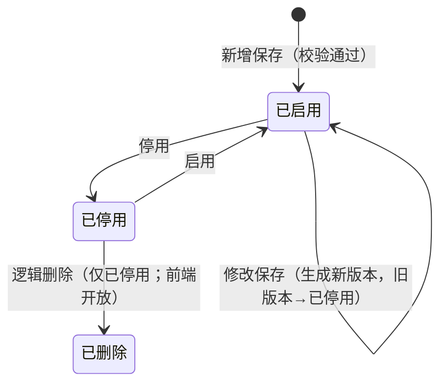

# 门禁开锁审批配置主PRD

> **版本**：V1.2 | 2026-09-01
> **读者**：研发工程师、测试工程师、产品复核
> **规则来源**：状态机、校验、匹配与权限详见《[门禁开锁审批配置业务规则规格](./门禁开锁审批配置业务规则规格.md)》——**规则 ID 以该文件为唯一定义来源，本文仅摘要引用**
> **字段基准**：《[门禁开锁审批配置字段清单](./门禁开锁审批配置字段清单.md)》为字段唯一定义来源
> **菜单路径**：`配置管理 → 业务流程管理 → 开锁审批`
> **页面线框**：[列表页](./门禁开锁审批配置_ASCII_列表页.md) · [详情页](./门禁开锁审批配置_ASCII_详情页.md) · [新增/编辑页](./门禁开锁审批配置_ASCII_新增编辑页.md)
> **原型与 Demo 导航**：
> - **ASCII 线框图**：[列表](./门禁开锁审批配置_ASCII_列表页.md) · [新增/编辑](./门禁开锁审批配置_ASCII_新增编辑页.md) · [详情](./门禁开锁审批配置_ASCII_详情页.md)
> - **Demo 交互规范**：[列表页 Demo](./门禁开锁审批配置_Demo_列表页.md) · [新增/编辑页 Demo](./门禁开锁审批配置_Demo_新增编辑页.md) · [详情页 Demo](./门禁开锁审批配置_Demo_详情页.md)
> **流程背景**：《[门禁开锁审批-业务流程推演](../门禁开锁审批-业务流程推演.md)》阶段一

---

## 一、业务背景

**开锁审批配置**是门禁开锁审批链路的**策略配置层**，解决「哪些门禁设备需要走审批、由谁审批、审批超时多久」的问题。

在现有「获取门锁密码」直接下发能力之上，监管场景要求对特定设备差异化控制：命中配置的设备需审批后才能获得临时密码；**未配置的设备走原有免审直发流程**。

没有统一的开锁审批配置：

- 审批范围、审批人、超时规则分散在口头约定或线下表格，无法与系统匹配联动
- 按仓库/分区等多维度配置时，同一设备可能同时归属多个范围，产生配置重叠与优先级争议
- 配置变更后，在途申请与新建申请的规则口径不一致，责任追溯困难
- 审批人离职或组织调整后，需逐条修改配置，维护成本高

本模块职责收敛为：**按指定设备维度创建和维护开锁审批规则**（适用设备、审批节点、超时时间、启停用与版本）。规则保存并启用后，供门禁设备模块在「获取门锁密码」时按设备 ID 精确匹配；**不包含**开锁申请提交、审批待办处理、凭证生命周期——上述能力分别归属 [07-审批中心/03-业务审批/04-我的申请管理/04-开锁审批](../../07-审批中心/03-业务审批/04-我的申请管理/04-开锁审批/开锁申请字段清单.md) 与 [07-审批中心](../../07-审批中心/03-业务审批/04-我的申请管理/我的申请管理总索引.md)。

---

## 二、功能范围

### 本期范围（In Scope）

- 开锁审批配置列表、组合筛选（配置名称、状态）、分页
- 新增配置：填写配置名称、适用设备、审批节点、审批超时时间；保存校验通过后直接**已启用**生效
- 编辑已启用配置：修改审批节点、审批超时时间；保存生成**新版本**，旧版本自动**已停用**
- 停用 / 启用：通过独立动作按钮变更状态；停用须填写**停用原因**
- 查看详情：展示配置全量字段及配置版本（操作审计完整流水走后台，详情页不展示）
- 配置版本号递增；**Version** 乐观锁防并发覆盖
- **适用范围固定为指定设备**：每条配置绑定一组门禁设备，不再支持按仓库、库房、分区或未绑定位置全局配置
- 审批方式固定为**任一人通过**（前端不展示选项；数据模型保留「按顺序审批」枚举供后续扩展）
- 审批节点支持**指定人员**或**指定角色**
- 配置保存/启用时的设备有效性、审批节点有效性、设备冲突校验（R01–R03）
- 配置匹配规则（C01–C03）由本模块写入，供门禁设备模块读取；**运行时匹配与阻断提示在门禁设备/申请侧执行，不在本模块页面处理**
- **逻辑删除**：后端提供配置逻辑删除能力；**6.2 前端仅对已停用配置开放删除入口**（二次确认；历史申请保留 C04 快照）

### 不在本期范围（Out of Scope）

| 内容                     | 原因                                                       |
| ---------------------- | -------------------------------------------------------- |
| 草稿态、已启用态删除入口           | 采用主数据启停用双态；**仅已停用**可逻辑删除（C08）；已启用须先停用                         |
| 按仓库/库房/分区/全局开关配置        | 评审确认仅保留指定设备维度，见 §8.1 设计变更说明                                    |
| 审批方式「按顺序审批」前端选项          | 6.2 固定任一人通过；枚举保留供扩展，界面不展示                                      |
| 开锁申请提交、撤回、查询 | 归属 [07/03/04/04-开锁审批](../../07-审批中心/03-业务审批/04-我的申请管理/04-开锁审批/开锁申请字段清单.md)；**我的申请管理/我的申请记录**可查 |
| 审批处理、通过/驳回操作 | 工作中心 → 审批中心 → 其他审批 → 开锁审批（PC）；业务办理 → 其他审批 → 开锁审批（H5）（**不进** 07 待处理）；动作规则引用 [审批中心业务规则规格（基准）](../../../../🌟🌟🌟-最新基准版/B端PC/01-工作中心/01-审批中心/02-审批中心业务规则规格.md) |
| 临时密码生成与下发       | 归属 [07/03/04/04-开锁审批/02临时开锁凭证字段清单](../../07-审批中心/03-业务审批/04-我的申请管理/04-开锁审批/01-字段清单/02临时开锁凭证字段清单.md)；密码服务调用入口在门禁设备 |
| 门禁事务记录与关联追溯            | 归属门禁事务模块                                                 |
| 备用审批人、自动转派             | 本期不做，见业务流程推演 §8.1                                        |
| 导出                     | 本期不提供                                                    |
| 修改配置名称及适用设备列表        | 编辑页置灰；需调整设备范围时停用旧配置并新增                                     |
| 移动端写操作                 | 6.2 本期仅 PC 端配置                                           |
| Demo PRD、用例数据推演、字段清单定稿 | 不在本步骤交付范围                                                |

---

## 三、模块定位

> 本对象为**配置策略**，非业务单据；以下说明其在链路中的层级、职责与上下游关系。

### 3.1 在系统中的位置

| 项目   | 内容                                                                                                                 |
| ---- | ------------------------------------------------------------------------------------------------------------------ |
| 模块层级 | **配置策略层**（非申请单据层、非审批执行层）                                                                                           |
| 核心职责 | 定义「哪些设备需要审批、审批链如何组成、超时多久失效」                                                                                        |
| 配置来源 | 审批配置管理员手动新增/编辑                                                                                                     |
| 配置入口 | 配置管理 → 业务流程管理 → 开锁审批                                                                                               |
| 上游依赖 | **门禁设备主数据**：适用设备；**人员账号 / RBAC 角色**：审批节点中的指定人员、指定角色                                        |
| 下游影响 | **门禁设备模块**：用户点击「获取门锁密码」时按 C01–C03 按设备 ID 匹配有效配置，决定走免审或进入审批申请；**开锁申请**：命中配置后固化配置编号、配置版本、审批方式、审批节点快照等字段；在途申请不受后续配置变更影响（C04） |
| 实体关系 | 一条配置对应一组适用设备（1:N 设备）；一条配置含多个审批节点（1:N）；配置与开锁申请为 **1:N**（同一配置版本可被多条申请引用）                                           |

### 3.2 系统链路图

### 3.3 职责边界

| 模块              | 职责                         |
| --------------- | -------------------------- |
| **开锁审批配置（本模块）** | 创建、编辑、启停用审批规则；维护配置版本       |
| 门禁设备模块          | 读取配置并匹配；提供获取密码入口；未命中配置时免审直发或跳转申请 |
| 开锁申请 / 审批中心     | 申请创建、待办分发、审批动作、申请查询；**所有参与审批的人员均可查看审批记录及最终审批人信息** |
| 密码与短信服务         | 审批通过后的凭证生成与下发（本模块不参与）      |

---

## 四、功能清单

| 功能编号   | 功能名称    | 适用角色        | PC 端    | 移动端 | 关键控制（规则引用）                  |
| ------ | ------- | ----------- | ------- | --- | --------------------------- |
| CFG-01 | 配置列表与筛选 | 审批配置管理员（查看） | 筛选/分页   | —   | P01；字段见配置名称、状态  |
| CFG-02 | 新增配置    | 审批配置管理员（新增） | 新增页     | —   | R01–R04；保存后直接已启用     |
| CFG-03 | 编辑配置    | 审批配置管理员（编辑） | 编辑页     | —   | 配置名称、适用设备不可改；修改生成新版本；Version 乐观锁 |
| CFG-04 | 停用配置    | 审批配置管理员（停用） | 列表/详情动作 | —   | 停用原因必填；只影响新申请匹配             |
| CFG-05 | 启用配置    | 审批配置管理员（启用） | 列表/详情动作 | —   | R01–R04 同新增                 |
| CFG-06 | 查看详情    | 审批配置管理员（查看） | 详情页     | —   | 已停用只读；展示配置版本、审批节点           |

---

## 五、业务场景

| 场景ID | 场景           | 类型      | 说明                                                                  |
| ---- | ------------ | ------- | ------------------------------------------------------------------- |
| S01  | 新增指定设备配置并立即生效 | **主流程** | 填配置名称、勾选适用设备、审批节点、审批超时时间 → 保存 → 状态=已启用，配置版本=1；审批方式系统默认为任一人通过       |
| S02  | 修改已启用配置生成新版本 | **主流程** | 已启用配置修改审批节点或审批超时时间 → 确认「修改将生成新版本」→ 旧版本已停用，新版本已启用，配置版本递增             |
| S03  | 停用后重新启用      | **支线**  | 已启用 → 停用（填停用原因）→ 新申请不再命中 → 再启用 → 恢复匹配；在途申请继续使用停用前快照                 |
| S04  | 审批节点混配人员与角色  | **支线**  | 节点1=指定角色「仓库主管」，节点2=指定人员「张三」→ 审批方式=任一人通过 → 各节点解析出的 eligible 人员并行待办，任一人通过即完成 |
| S05  | 设备冲突阻断     | **异常**  | 同一设备已存在于内容不一致的已启用配置 → 新增保存阻断，提示与配置{编号}存在设备冲突（R03）                    |
| S06  | 审批节点无效阻断     | **异常**  | 指定角色下无启用成员 → 保存阻断，提示审批节点{序号}无效（R02）                             |
| S07  | 并发编辑冲突       | **异常**  | 两人同时编辑同一已启用配置 → 后提交者 Version 校验失败 → 提示刷新后重试                         |
| S08  | 未配置设备免审      | **支线**  | 设备未出现在任何已启用配置的适用设备列表中 → 门禁设备模块走原有免审直发密码流程（C02）                  |

---

## 六、状态机

> 完整定义见《[门禁开锁审批配置业务规则规格](./门禁开锁审批配置业务规则规格.md)》第二至五章。以下为摘要。

### 6.1 状态定义

| 状态  | 含义                 | 是否终态  |
| --- | ------------------ | ----- |
| 已启用 | 对新申请生效的有效配置版本      | 否     |
| 已停用 | 不再匹配新申请；历史申请保留配置快照 | **是** |

> 不支持草稿态；新增保存校验通过后直接进入**已启用**。**已停用**配置可在前端执行逻辑删除（C08）；日常废弃优先 **停用**。

### 6.2 状态流转图

### 6.3 状态流转表

| 当前状态 | 动作   | 前置条件              | 结果状态     | 二次确认                           | 后置影响                   | 失败处理                 |
| ---- | ---- | ----------------- | -------- | ------------------------------ | ---------------------- | -------------------- |
| —    | 新增保存 | R01–R04 通过；必填字段完整 | 已启用      | 「保存后新申请将按本配置匹配，确认保存？」          | 生成配置编号、配置版本=1；审批方式=任一人通过；开始对新申请生效 | Toast：「保存失败：{具体原因}」  |
| 已启用  | 停用   | —                 | 已停用      | 「停用后新申请不再命中本配置，在途申请不受影响，确认停用？」 | 只影响新申请匹配；须写入停用原因       | Toast：「停用失败：配置状态已变更」 |
| 已启用  | 修改保存 | R01–R04 通过        | 已启用（新版本） | 「修改将生成新版本，在途申请继续使用旧版本快照，确认保存？」 | 旧版本→已停用；新版本→已启用；配置版本递增 | Toast：「保存失败：{具体原因}」  |
| 已停用  | 启用   | R01–R04 通过        | 已启用      | 「启用后新申请将按本配置匹配，确认启用？」          | 恢复对新申请生效               | Toast：「启用失败：{具体原因}」  |
| 已停用  | 逻辑删除 | P02 写权限 | 已删除（逻辑） | 「删除后列表将不再展示本配置，历史申请仍保留配置快照，确认删除？」 | 列表不可见；历史申请保留配置快照（C04） | Toast：「删除失败：配置状态已变更」 |

### 6.4 动作能力矩阵

| 操作动作 | 已启用      | 已停用 | 前端 6.2 | 后端 |
| ---- | -------- | --- | --- | --- |
| 查看详情 | ✅        | ✅   | ✅ | ✅ |
| 编辑   | ✅（生成新版本） | ❌   | ✅ | ✅ |
| 停用   | ✅        | ❌   | ✅ | ✅ |
| 启用   | ❌        | ✅   | ✅ | ✅ |
| 删除（逻辑） | ❌        | ✅   | ✅（仅已停用） | ✅ |

---

## 七、核心业务规则

> 规则详情以《门禁开锁审批配置业务规则规格》为准；本节仅收录摘要。

### 7.1 创建与保存规则

| 规则ID | 规则                                        |
| ---- | ----------------------------------------- |
| R01  | **适用设备** 引用的门禁设备主数据须存在且有效（挂锁门禁、人脸门禁）           |
| R02  | 审批节点中：指定人员须为启用账号；指定角色须为启用角色且至少 1 个启用成员    |
| R03  | 同一设备不得同时出现在多条 **内容不一致** 的已启用配置中                   |
| R04  | 操作人须具备审批配置管理权限                            |
| R27  | 审批节点支持「指定人员」或「指定角色」；同一节点不可混选，不同节点可分别配置    |
| —    | **审批方式**系统默认为「任一人通过」；前端不展示选择项；数据模型保留「按顺序审批」枚举供扩展 |

### 7.2 版本与启停用规则

| 规则ID | 规则                                                        |
| ---- | --------------------------------------------------------- |
| C04  | 配置一旦被申请引用，不因后续停用、修改或逻辑删除而改变历史申请中的配置快照                          |
| C08  | 提供 **逻辑删除**；**仅已停用** 配置可在前端删除；**已删除** 列表不可见；历史申请保留快照（C04）；废弃配置也可先停用 |
| —    | 新增表单不展示状态、审批方式字段；保存成功后状态=已启用、审批方式=任一人通过                                   |
| —    | 编辑页配置名称、适用设备置灰不可修改；需调整设备范围时停用旧配置并新增   |
| —    | 编辑已启用配置时，修改审批节点、审批超时时间保存后生成新版本，旧版本→已停用 |

### 7.3 配置匹配规则（写入侧 / 供下游读取）

| 规则ID | 规则                                            |
| ---- | --------------------------------------------- |
| C01  | **按设备精确匹配**：获取密码时按设备 ID 查找状态=已启用的配置；命中则进入审批流程                     |
| C02  | **未命中免审**：设备未出现在任何已启用配置的适用设备列表中，走原有免审直发密码流程；不得静默阻断                |
| C03  | **设备冲突**：保存/启用时同一设备不得归属多条内容不一致的已启用配置；运行时若历史数据已造成冲突，门禁设备模块阻断申请并提示修正 |

### 7.4 审批节点解析与可见性规则（供下游申请侧使用）

| 规则ID | 规则                                                                          |
| ---- | --------------------------------------------------------------------------- |
| R28  | 指定角色节点在申请提交时展开为当时角色下启用账号并写入快照；在途不重算                                         |
| R30  | 申请提交时角色节点展开后 eligible 人员为空（含排除申请人后）则阻断——**校验执行在申请侧，本模块仅保证配置保存时 R02 有效** |
| —    | **审批可见性**：所有参与审批的人员（含已通过/已关闭待办的审批人）均可查看审批记录及最终审批人信息，确保操作可追溯 |

---

## 八、权限设计

### 8.1 数据可见范围

| 角色      | 可见数据范围      | 说明            |
| ------- | ----------- | ------------- |
| 审批配置管理员 | 租户内全部开锁审批配置（不含已逻辑删除） | 具备菜单查看权限（P01） |
| 其他角色    | 不可见         | 无 P01 时隐藏菜单入口 |

### 8.2 操作权限矩阵

| 操作      | 审批配置管理员 | 说明  |
| ------- | ------- | --- |
| 查看列表/详情 | ✅       | P01 |
| 新增配置    | ✅（子权限）  | P02 |
| 编辑配置    | ✅（子权限）  | P02 |
| 停用      | ✅（子权限）  | P02 |
| 启用      | ✅（子权限）  | P02 |
| 逻辑删除    | ✅（子权限 P02；**仅已停用**） | 列表不可见；在途/历史申请保留快照 |

> 本模块不涉及仓库数据隔离；适用设备选择器的候选范围遵循门禁设备模块既有权限，不在此重复定义实现细节。

---

## 九、边界与异常处理

### 9.1 并发控制

| 场景            | 处理方式                               |
| ------------- | ---------------------------------- |
| 两人同时编辑同一已启用配置 | 编辑保存时校验 **Version** 乐观锁；冲突则阻断并提示刷新 |
| 一人停用、另一人同时编辑  | 以服务端状态条件更新为准；失败方提示「配置状态已变更」        |

### 9.2 配置校验边界

| 场景                  | 处理方式                |
| ------------------- | ------------------- |
| 适用设备已停用或已移除           | R01 阻断保存/启用         |
| 指定人员账号已停用           | R02 阻断，提示审批节点{序号}无效 |
| 指定角色无启用成员           | R02 阻断          |
| 同一设备已存在于不一致的已启用配置    | R03 阻断              |

### 9.3 配置变更对在途业务的影响

| 场景        | 处理方式                               |
| --------- | ---------------------------------- |
| 停用配置      | 只影响**新申请**匹配；已在途申请继续使用原配置版本快照（C04） |
| 修改配置生成新版本 | 旧版本已停用；在途申请继续引用旧版本快照               |
| 启用已停用配置   | 恢复对新申请生效；不 retroactive 影响历史申请      |
| 逻辑删除配置   | 新申请不再匹配；在途申请继续使用删除前快照               |

### 9.4 本模块不处理的异常

| 场景               | 归属模块                  |
| ---------------- | --------------------- |
| 设备命中多条冲突规则、申请时阻断 | 门禁设备 / 开锁申请侧（C03 运行时） |
| 审批超时、驳回、撤回       | [07-审批中心](../../07-审批中心/03-业务审批/04-我的申请管理/我的申请管理总索引.md) / [开锁申请](../../07-审批中心/03-业务审批/04-我的申请管理/04-开锁审批/开锁申请字段清单.md)           |
| 密码服务生成失败（凭证=生成失败） | 门禁设备 / 凭证模块 |
| 人脸三方下发失败（凭证仍为已下发） | 门禁设备 / 凭证模块 |

---

## 十、验收标准

| 验收编号 | 场景           | 前置条件             | 操作                                                   | 预期结果                            |
| ---- | ------------ | ---------------- | ---------------------------------------------------- | ------------------------------- |
| V01  | 新增指定设备配置成功    | 有新增权限；设备主数据有效      | 填写配置名称、勾选适用设备、至少1个审批节点、审批超时时间 → 保存 | 生成配置编号；状态=已启用；配置版本=1；审批方式=任一人通过            |
| V02  | 新增后直接已启用     | 同 V01            | 新增保存                                                 | 表单无状态、无审批方式选项；保存后列表状态=已启用             |
| V03  | 配置名称租户内唯一    | 已存在同名配置          | 新增同名配置保存                                             | 阻断；提示名称重复                       |
| V04  | 审批节点指定人员     | 有启用人员账号          | 节点选指定人员                                              | 保存成功；详情展示节点序号、审批对象类型、指定人员       |
| V05  | 审批节点指定角色     | 角色有启用成员          | 节点选指定角色                                              | 保存成功；详情展示指定角色                   |
| V06  | 无效审批节点阻断     | 角色无启用成员          | 保存                                                   | 阻断；Toast「保存/启用失败：审批节点{序号}无效」    |
| V07  | 设备冲突阻断       | 同设备已有不一致已启用配置    | 新增保存                                                 | 阻断；Toast「保存/启用失败：与配置{编号}存在设备冲突」 |
| V08  | 修改生成新版本      | 配置已启用            | 修改审批节点 → 保存                                          | 旧版本已停用；新版本已启用；配置版本+1            |
| V09  | 范围字段编辑限制     | 配置已启用            | 进入编辑页                                                | 配置名称、适用设备置灰     |
| V10  | 停用配置         | 配置已启用            | 停用并填停用原因                                             | 状态=已停用；新申请不再命中                  |
| V11  | 停用不影响在途      | 已有在途申请引用该配置      | 停用配置                                                 | 在途申请仍保留原配置版本快照                  |
| V12  | 重新启用         | 配置已停用            | 启用                                                   | 状态=已启用；新申请可再次命中                 |
| V13  | 已停用不可编辑      | 配置已停用            | 查看操作列                                                | 无编辑入口                           |
| V14  | 已停用可删除        | 配置已停用             | 列表/详情点击删除并确认                                      | 配置从列表消失；历史申请快照不变                  |
| V14a | 已启用不可删除       | 配置已启用             | 查看操作列                                                | 无删除入口                           |
| V15  | Version 并发冲突 | 两人打开同一编辑页        | 先后保存                                                 | 后提交者阻断并提示刷新                     |
| V16  | 无权限隐藏        | 无 P01 权限         | 访问菜单                                                 | 菜单不可见或阻断                        |
| V17  | 审计留痕         | 完成新增/修改/停用/启用    | 查操作审计日志                                              | 记录操作人、时间、前后状态；不含密码明文            |
| V18  | 未配置设备免审      | 设备不在任何已启用配置中      | 获取门锁密码                                               | 走原有免审直发流程（C02）                  |
| V19  | 审批可见性        | 存在已完成审批的开锁申请      | 各参与审批人查看申请详情                                          | 均可查看审批记录及最终审批人信息                  |

---

## 修订记录

| 日期         | 变更摘要                                        |
| ---------- | ------------------------------------------- |
| 2026-08-28 | V1.0 初版；规则唯一定义来源 引用《门禁开锁审批配置业务规则规格》 |
| 2026-08-28 | V1.1 详情页不展示 Version、操作审计摘要；与字段清单 V1.2 对齐 |
| 2026-09-01 | V1.2 评审调整：仅保留指定设备配置；审批方式固定任一人通过（前端不展示）；补充后端逻辑删除；简化匹配规则 C01–C03 |
| 2026-09-01 | V1.3 开放前端逻辑删除：仅已停用可删；二次确认；历史申请保留 C04 快照 |

---

## 自检结果

1. ✅ 未生成字段清单定稿、用例数据推演或 Demo PRD。
2. ✅ 开锁审批配置职责限定为规则创建与启停用/version 管理，未包含申请提交、审批处理、凭证下发。
3. ✅ 状态机具备入口（新增保存→已启用）、出口（已停用终态）、已启用↔已停用双向路径及修改新版本路径。
4. ✅ 主 PRD 引用的字段名均来自《门禁开锁审批配置字段清单》（如配置编号、配置名称、适用设备、审批节点、审批对象类型、指定人员、指定角色、状态、配置版本、Version、停用原因等）。
