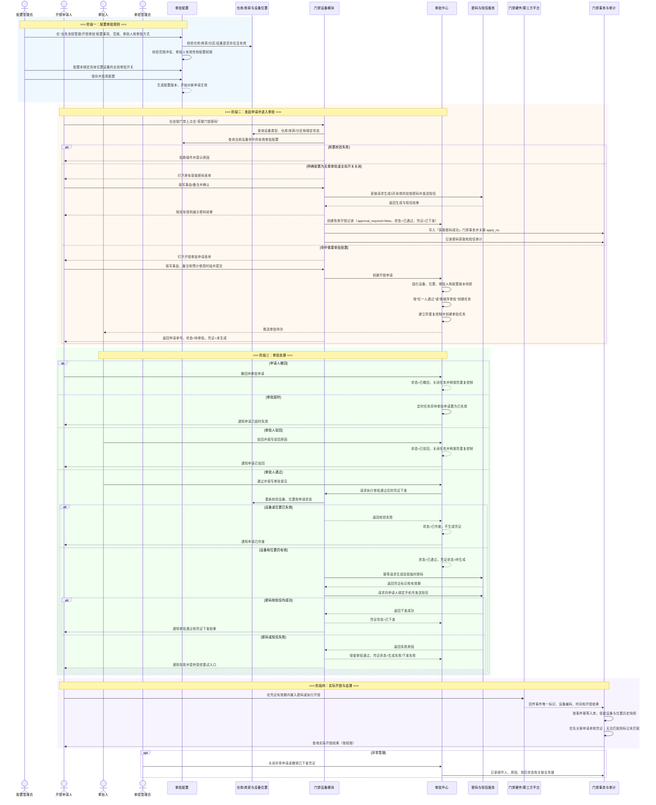

# 门禁开锁审批-业务流程推演

> **版本**：V1.3 | 2026-08-28
> **定位**：门禁开锁审批整条业务链的**流程推演与设计决策唯一定义来源**——时序图、角色、设计决策、状态汇总、异常分支与已确认口径以本文件为准。
> **不重复**：各模块状态机/校验规则正文见 06/01、07 平台、07/子类型规格；跨模块规则 ID 速查见 [业务规则规格](./门禁开锁审批-业务规则规格.md)。
> **读者**：产品经理、业务负责人、研发、测试和后续主 PRD 编写人员
> **业务性质**：在现有“获取门锁密码”直接操作基础上，新增按位置控制的开锁审批链路；未绑定具体位置的设备由全局开关决定是否审批。
> **参考文档**：[门禁开锁审批-业务规则规格](./门禁开锁审批-业务规则规格.md)（全链路编排）、[门禁开锁审批配置业务规则规格](./01-审批配置/门禁开锁审批配置业务规则规格.md)、[开锁申请业务规则规格](../07-审批中心/03-业务审批/04-我的申请管理/04-开锁审批/开锁申请业务规则规格.md)、《门禁设备主 PRD》《门禁设备业务规则规格》《门禁事务业务规则规格》《挂锁门禁开锁审批功能_简要 PRD（草稿）》

---

## 一、推演范围

### 1.1 正向链路

从审批管理员配置门禁开锁审批规则开始，到申请人实际开锁、门禁事务记录生成结束：

**审批配置 → 设备位置匹配 → 用户发起开锁申请 → 其他审批（开锁审批）→ 审批通过/驳回 → 临时密码生成与短信下发 → 实际开锁 → 门禁事务与审计追溯**

### 1.2 逆向和异常链路

覆盖以下会改变流程结果或影响安全边界的场景：

- 待审批申请撤回、审批驳回、审批超时失效；
- 审批期间审批配置变更、审批人停用或待办转派；
- 审批通过后设备解绑、移除、位置失效；
- 密码生成失败、短信发送失败、短信重发；
- 临时密码过期、撤销、使用次数耗尽；
- 实际开锁失败、非法试码、门禁事件无法关联申请。

### 1.3 不在本次推演范围

- 密码生成算法、密码服务和短信网关内部实现；
- 门禁硬件固件、设备注册和第三方设备接入；
- 永久人脸授权配置；
- 完整的统一审批平台「待处理」产品设计；开锁审批走「其他审批—开锁审批」，不进待处理；
- 具体页面视觉设计和 Vue / Element Plus 原型。

### 1.4 涉及系统模块与业务对象

**审批配置入口**：配置管理 → 业务流程管理 → 开锁审批。

**涉及系统模块**：开锁审批配置 / 工作中心·审批中心·其他审批·开锁审批（PC）/ 业务办理·其他审批·开锁审批（H5） → 仓库与库房主数据 → 门禁设备 → 密码服务与短信平台 → 门禁事务记录 / 审计 / 我的申请记录。

**涉及业务对象**：审批配置、门禁开锁申请、审批任务、临时开锁凭证、门禁实际开锁事务。

> 当前《门禁设备主 PRD》明确门禁设备模块本身“不生成独立业务单据、不建立独立审批流程”。因此，本文件推演的是新增的审批扩展链路；门禁设备主档、在线/离线状态和已有密码获取规则仍由原模块负责。审批配置引用仓库、库房、分区和设备主数据，不把审批字段复制到设备主档。

---

## 二、涉及角色

| 角色 | 职责 | 参与节点 |
| :--- | :--- | :--- |
| 审批配置管理员 | 配置门禁开锁事项的适用范围、审批方式、审批人和超时规则；启用、停用和修改配置 | 审批配置 |
| 开锁申请人 | 在门禁设备上发起一次临时开锁申请；查看申请进度和凭证下发结果 | 发起申请、接收密码、实际开锁 |
| 审批人 | 在「其他审批—开锁审批」查看申请快照；通过或驳回 | 其他审批处理 |
| 审批管理员 / 上级主管 | 处理配置冲突、异常关闭和凭证撤销；本期不提供备用审批人自动转派 | 异常处理、凭证撤销 |
| 仓库 / 库房管理员 | 维护仓库、库房、分区和门禁设备绑定关系 | 位置主数据、设备位置变更 |
| 任务中心·其他审批 | 承载「开锁审批」列表与审批处理；**不**写入 07 待处理 | 其他审批—开锁审批 |
| 密码与短信服务 | 在审批通过后生成临时凭证并向申请人绑定手机号发送密码 | 凭证生成、短信下发、重发 |
| 门禁设备 / 第三方平台 | 校验密码并执行实际开锁，回传开锁、失败或非法试码事件 | 实际开锁事件 |
| 审计 / 风控人员 | 查询申请、审批、凭证和门禁事务的完整证据链 | 追溯、异常处置 |

---

## 三、Mermaid 时序图



### 3.1 审批方式

当前系统支持两种审批方式，均由“开锁审批”配置决定：

| 审批方式 | 业务处理 | 申请结果 |
| :--- | :--- | :--- |
| 任一人通过 | 多名审批人同时收到待办，任意一名审批人通过后，申请即进入已通过；其他未处理任务关闭 | 任意一人通过即完成本审批节点 |
| 按顺序审批 | 按配置顺序逐个生成待办；前一名审批人通过后，才向下一名审批人生成待办 | 所有顺序节点均通过后，申请才进入已通过；任一节点驳回则终止 |

审批人不能审批自己发起的申请。审批动作使用申请状态和任务状态条件更新，避免多人同时处理产生两个相反结果。

### 3.2 关键里程碑

- **里程碑一：规则生效**。审批配置已启用，设备能唯一命中适用范围和审批方式。
- **里程碑二：申请入待办**。开锁申请创建成功，审批人快照已固化，审批前没有临时密码。
- **里程碑三：审批结果确定**。申请进入通过、驳回、撤回、失效或作废之一；终态不能重复处理。
- **里程碑四：凭证受控下发**。只有审批通过且设备复核有效时才生成密码；密码和短信结果单独留痕。
- **里程碑五：事实闭环**。实际开锁事件被记录并尽可能关联申请单和凭证，形成审计证据链。

---

## 四、业务对象与联动规则

| 业务对象 / 记录 | 对象职责 | 核心字段 | 上游触发条件 | 下游联动 | 数据快照 / 继承规则 |
| :--- | :--- | :--- | :--- | :--- | :--- |
| 门禁开锁审批配置 | 定义什么位置、什么设备需要审批，以及由谁审批；兜底控制未绑定具体位置的设备 | 配置编号、事项编码、适用范围、审批方式、审批人、未绑定位置全局开关、超时时间、版本、状态 | 配置管理员在“业务流程管理/开锁审批”创建或修改 | 新申请按有效版本匹配；配置停用不修改历史申请 | 全局开关与位置规则使用同一配置模型和审批人/审批方式；位置和审批人保存 ID；修改生成新版本 |
| 门禁设备与位置绑定 | 提供设备类型、仓库、库房、分区和具体位置 | 设备编码、设备类型、绑定仓库/库房/分区、设备状态 | 设备接入、仓库绑定或位置变更 | 参与审批配置匹配和实际开锁事件追溯 | 申请和事务保留发起时设备及位置快照 |
| 门禁开锁申请 | 记录一次临时开锁授权意图 | 申请单号、申请人、设备、位置、事由、备注、预计时段、申请状态、配置版本 | 申请人在命中需要审批规则的位置点击获取门锁密码并提交 | 生成审批任务；审批通过后触发凭证处理 | 固化申请时设备、位置、审批人、审批方式和配置版本 |
| 审批任务 / 审批记录 | 记录谁在什么时间对申请作出什么决定 | 任务编号、处理人、处理状态、审批结果、审批意见、处理时间 | 开锁申请创建成功 | 通过或驳回回写申请；关闭或转派任务 | 保存处理人账号和姓名快照；不因配置变化重算 |
| 临时开锁凭证 | 记录密码生成、发送和使用生命周期 | 凭证编号、申请单号、设备编码、有效期、生成状态、短信状态、撤销/过期/覆盖失效状态 | 审批通过且设备复核有效，或原有免审流程直接获取 | 调用密码服务和短信服务；同设备生成新密码时使旧凭证失效 | 不在业务库、审批记录和日志中保存密码明文；旧凭证保存被新凭证覆盖的原因和关联关系 |
| 门禁事务记录 | 记录门禁硬件实际发生的开锁、失败、非法试码等事实 | 事件唯一标识、设备编码、事件时间、事件类型、结果、人员、申请单/凭证关联状态 | 门禁设备或第三方平台上报事件 | 独立菜单和设备数据入口查询；异常进入风控/审计 | 设备移除后历史事务仍保留原设备和位置快照；申请记录用于追溯，不代替实际事务 |
| 操作审计记录 | 记录关键操作及前后关系，支持责任追溯 | 操作人、角色、机构、IP、时间、请求标识、业务键、前后状态、结果、失败原因 | 配置、申请、审批、凭证和实际开锁等关键动作 | 审计查询、风险追溯 | 严禁记录密码明文和短信全文 |

### 4.1 核心联动规则

| 上游动作 | 触发条件 | 下游对象 | 传递数据 | 后置影响 | 待确认 |
| :--- | :--- | :--- | :--- | :--- | :--- |
| 启用审批配置 | 范围、审批人、权限和冲突校验通过 | 有效配置版本 | 事项、范围、审批模式、审批人、全局开关、版本 | 新申请按该版本匹配 | 入口已确定为“配置管理/业务流程管理/开锁审批” |
| 设备发起获取密码 | 类型、权限、绑定状态、手机号和防重校验通过 | 开锁申请或原有直发密码流程 | 设备编码、位置、申请人、事由、配置命中结果 | 需审批时不得调用密码服务；未绑定具体位置时读取全局开关 | 全局开关关闭走免审，开启走全局审批 |
| 创建开锁申请 | 命中需要审批且无有效重复申请 | 审批任务 | 申请单号、审批人快照、审批方式、配置版本 | 申请=待审批，凭证=未生成；默认同一设备只保留一个在途申请 | 现有密码为最后一次获取覆盖前一次 |
| 审批通过 | 审批任务仍为待处理且申请未终态 | 凭证处理 | 申请单号、设备编码、有效期规则 | 申请=已通过；进入凭证处理 | 密码生成失败是否需要人工补偿 |
| 审批驳回 | 驳回原因填写完整且任务未处理 | 开锁申请 | 结果、原因、处理人、时间 | 申请=已驳回；不生成密码 | 是否允许驳回后原单修改再提交 |
| 密码生成与短信下发 | 申请已通过且设备复核仍有效 | 临时凭证、申请记录 | 凭证标识、有效期、短信结果 | 新凭证生效时，同设备旧凭证=已失效（被新密码覆盖）；审批结论不回退 | 本系统只记录发送结果，不另设计短信自动重试 |
| 实际开锁上报 | 事件唯一标识未入库 | 门禁事务记录 | 事件标识、设备编码、事件时间、结果 | 生成事实记录；不反向改变审批结论 | 申请记录用于判断“是否有授权意图”；实际关联按设备、时间和凭证记录匹配 |
| 配置停用或修改 | 管理员执行配置变更 | 新申请匹配 | 新版本配置 | 只影响新申请 | 历史在途申请继续使用快照 |

---

## 五、关键异常分支

| 异常场景 | 发生阶段 | 系统处理 | 是否生成密码 / 事务 |
| :--- | :--- | :--- | :--- |
| 设备未绑定具体位置 | 申请前 | 不直接阻断；读取“未绑定具体位置设备全局审批开关”。开关关闭则走原有免审流程，开关开启则走全局审批流程 | 按全局开关决定 |
| 设备绑定多个范围且规则无法唯一命中 | 配置匹配 | 按指定设备 > 分区 > 库房 > 仓库的具体性匹配；最高优先级命中多条时阻断申请并提示管理员修正绑定或配置 | 不生成密码 |
| 未命中具体位置审批配置 | 申请前 | 先判断设备是否属于“未绑定具体位置”；属于则读取全局开关，不把未命中具体配置静默当成免审 | 按全局开关决定 |
| 申请人无获取密码权限、仓库数据权限或手机号 | 申请前 | 服务端拒绝；前端提示不替代后端校验 | 不生成密码 |
| 同一申请人重复点击提交 | 申请创建 | 使用请求标识和设备/申请人维度防重复，返回原申请结果 | 不生成重复申请或凭证 |
| 同一设备存在在途审批申请 | 申请创建 | 默认阻止新增申请，并提示已有申请单号。原因是现有设备密码采用“最后一次获取覆盖前一次”，并行申请会导致前一申请获得的密码失效 | 不生成重复凭证 |
| 审批人账号停用、离职或长期未处理 | 审批中 | 本期不配置备用审批人和自动转派；配置启用时只允许选择有效账号，账号停用前应检查其是否为生效配置的唯一审批人 | 不自动生成密码 |
| 申请人撤回或审批超时 | 审批中 | 申请进入已撤回或已失效，关闭任务并释放防重复控制 | 不生成密码 |
| 审批通过前设备被解绑、移除或位置失效 | 审批通过处理 | 凭证生成前重新校验，失败则申请置为已作废 | 不生成密码 |
| 密码生成成功但短信发送失败 | 凭证下发 | 申请保留已通过，凭证标记下发失败；支持受控重发，不重复生成密码 | 不影响审批结论；需记录失败原因 |
| 密码服务生成失败 | 凭证下发 | 凭证标记生成失败，进入重试或人工处理；不把“已通过”改成“已驳回” | 不生成可用密码 |
| 凭证已下发但申请人未实际开锁 | 凭证生命周期 | 到期后标记过期；高风险场景可由授权人员主动撤销 | 不产生成功开锁事务 |
| 实际输入密码但开锁失败或非法试码 | 实际开锁 | 门禁事务记录失败原因和事件；必要时触发风险预警 | 生成失败/异常事务 |
| 设备事件无法关联申请单 | 事务入库 | 仍保存原始事务和设备历史快照，关联状态标记为未匹配，不默认判定为合法 | 生成未匹配事务 |

---

## 六、关键设计决策

### 6.1 审批对象是“一次临时开锁授权”，不是永久授权

申请的业务含义是：申请人在特定时间和特定设备上获得一次临时开锁资格。它不能替代人脸门禁的长期授权，也不应把日常已授权刷脸行为全部转成审批单。

### 6.2 审批配置、审批申请和门禁事务必须分层

- **审批配置**回答“哪些位置需要审批、谁来审批”；
- **开锁申请**回答“谁因为什么事申请打开哪一台设备”；
- **审批记录**回答“审批人作出了什么决定”；
- **临时凭证**回答“密码是否生成、是否发送、是否有效”；
- **门禁事务**回答“设备实际上有没有开锁”。

如果把这些内容合并成一个状态，会出现“审批已通过但短信失败”“审批通过但现场没有开锁”“设备事件无法匹配申请”等事实无法表达的问题。

### 6.3 业务范围配置引用位置主数据，不复制维护库房

审批配置只保存仓库、库房、分区和设备的唯一标识，并引用门禁设备的绑定关系。配置入口固定为“配置管理 → 业务流程管理 → 开锁审批”。库房主档负责空间主数据，门禁设备负责设备绑定，审批配置负责审批策略，避免同一个库房名称在多个模块重复维护。

规则具体性顺序为：**指定设备 > 分区 > 库房 > 仓库**；未绑定具体位置的设备再读取全局开关。

这里的“同级冲突”是指同一台设备在最高优先级上同时命中多个规则，或者同一个范围存在多条同时启用的规则。例如：同一库房有两条启用的开锁审批配置，或设备同时绑定两个分区且两个分区各有一条同级启用规则。此时系统不能凭创建时间、配置编号等条件随机选一条。

本期不增加“主要管控位置”字段，采用以下多绑定处理规则：

1. 按指定设备 > 分区 > 库房 > 仓库的顺序，从设备所有绑定位置中寻找最高优先级的有效规则；低优先级不再参与本次匹配。
2. 最高优先级只命中一条规则时，直接使用该规则；同时命中多条规则但规则内容完全一致（是否审批、审批方式、审批人顺序、超时时间一致）时，合并为一条有效规则，并在申请/审计中记录全部命中的位置。
3. 同一个范围存在多条同时启用的规则时，配置启用直接阻止重复生效；不同绑定范围的同级规则只有在内容不一致时才视为规则冲突，历史数据已经造成冲突时，申请时阻断并提示管理员修正绑定关系或停用重复配置。

例如：设备绑定“东库房”和“西库房”，两处都是库房级规则。如果两处都要求审批且审批链完全相同，可以正常发起；如果一处免审、另一处需要审批，或者审批人不同，则不能猜测申请人实际对应哪一处，必须阻断处理。

如果设备只绑定仓库、未绑定库房/分区，则仍可命中仓库级规则；如果完全没有具体位置可匹配，则由“未绑定具体位置设备全局审批开关”决定免审或进入全局审批。

### 6.4 审批通过不等于密码已下发，更不等于已经开锁

审批结果、密码生成、短信发送和实际开锁是四个不同里程碑：

```text
审批通过 ≠ 密码生成成功 ≠ 短信发送成功 ≠ 实际开锁成功
```

每一步都要有独立状态和审计结果。密码服务、短信服务平台和第三方门禁接口属于外部依赖，不能把它们的调用结果简单当作数据库事务回滚结果。短信发送、失败处理和重试由现有短信服务平台负责，本业务流程只接收发送结果并记录关联状态。

### 6.5 历史申请使用配置快照

审批配置修改或停用只影响新申请。已提交申请必须保留发起时的设备、位置、审批人、审批方式和配置版本，避免审批过程中修改配置后责任对象发生漂移。

### 6.6 免审分支必须显式定义

现有系统允许具备权限的人员直接获取挂锁密码。新增审批后，有具体位置配置的设备按位置配置执行；未绑定具体位置的设备按全局开锁审批开关执行。全局开关关闭时走原有免审流程，开启时进入统一审批流程，不能把“没有找到配置”静默当成免审。

### 6.7 门禁模块与其他审批的职责边界

「其他审批—开锁审批」负责审批列表、通过/驳回、审批轨迹；「我的申请记录」负责申请人查询；门禁模块负责设备类型与位置校验、密码获取入口、凭证调用、短信结果和门禁事务关联。**不**写入 07 审批中心「待处理/已处理」。

### 6.8 一致性、安全和审计要求

- 申请创建必须具备请求幂等键，重复点击不能产生多张有效申请；
- 审批动作必须使用状态条件更新，两个审批人并发操作时只能有一个动作成功；
- 凭证生成前必须再次校验申请状态、设备状态和位置绑定；
- 按现有能力允许申请人在页面查看密码明文，但密码明文不写入数据库、审批记录、运行日志和审计日志；
- 配置、申请、审批、凭证、短信和实际开锁事件都记录操作人、时间、设备编码、请求标识、前后状态和失败原因；
- 门禁事务按事件唯一标识幂等入库，不能因重复上报生成重复事实记录。

短信失败后的发送和重试由现有短信服务平台负责，门禁开锁审批业务只接收“发送成功 / 发送失败 / 重试结果”等状态，不在本期另建短信重试机制。

### 6.9 同一设备新旧密码覆盖规则

当前门禁设备存在“同一设备最后一次获取的密码覆盖之前密码”的能力约束。审批流程不能把这个技术事实隐藏掉，应明确处理为：

- 同一设备生成新密码并生效时，系统将上一条仍有效的凭证标记为“已失效（被新密码覆盖）”；
- 旧凭证关联的审批申请不改写为驳回或作废，原审批结论仍保留，只更新凭证状态；
- 申请人打开旧申请详情时，提示：**“设备密码已被更新，原密码已失效。”**；
- 新旧凭证、关联申请、生成时间和覆盖原因写入审计关系，密码明文不写入日志；
- 审批模式下默认阻止同一设备存在多个在途申请，避免审批期间产生多份相互覆盖的有效密码；已完成的旧凭证被再次获取时，按上述覆盖规则处理。

---

## 七、状态流转汇总

### 7.1 审批配置

```text
新增保存（校验通过）→ 已启用 → 已停用
                         └→ 修改保存（旧版本→已停用，新版本→已启用）
已停用 → 启用 → 已启用
```

> 不支持草稿态；新增保存校验通过后直接进入 **已启用**。配置版本一旦被申请使用，不因后续停用或修改而改变历史申请快照。

### 7.2 开锁申请

```text
待审批 → 已通过 → 凭证处理中 → 已下发
   ├→ 已驳回
   ├→ 已撤回
   ├→ 已失效
   └→ 已作废
```

> “凭证处理中、已下发”建议作为凭证状态，不要把它们直接混入审批申请主状态。申请主状态“已通过”可以与凭证“生成失败/下发失败”同时存在。

### 7.3 临时凭证

```text
未生成 → 生成中 → 已生成 → 已下发 → 已使用 / 已过期 / 已撤销
                         ├→ 发送失败 → 重发成功
                         └→ 已失效（被新密码覆盖）
```

审批通过后，申请人按当前系统能力在页面查看密码明文；本期不额外增加短信验证码、二次身份认证等复杂查看流程。密码明文仍不得落库或写入任何日志。

### 7.4 门禁事务

门禁事务不是审批申请的下游状态，而是独立的事实记录：

```text
设备/第三方上报事件 → 事件幂等校验 → 保存原始事件快照 → 尝试关联申请/凭证 → 查询与审计
```

实际开锁失败、非法试码和无法匹配申请的事件均应保留，不因审批通过而被忽略。

---

## 八、本轮确认结果

### 8.1 本轮已确认口径

| 事项 | 已确认结论 |
| :--- | :--- |
| 审批配置入口 | 配置管理 → 业务流程管理 → 开锁审批 |
| 审批范围 | 支持指定设备、分区、库房、仓库；匹配优先级为指定设备 > 分区 > 库房 > 仓库 |
| 未绑定具体位置设备 | 增加全局开锁审批开关；开关与位置规则使用同一配置模型，并复用同一套审批人和审批方式；关闭时免审，开启时进入全局审批 |
| 同级规则冲突 | 不随机选择；配置启用时阻止重复规则，运行时发现冲突则阻断申请并提示修正绑定或配置 |
| 多位置绑定 | 不增加“主要管控位置”；按最高优先级匹配，规则完全一致时合并，规则不一致时阻断 |
| 多审批人 | 支持任一人通过，也支持按配置顺序逐节点审批；每节点可指定人员或指定角色 |
| 同一设备并发申请 | 本期默认阻止同一设备存在多个在途申请；原因是当前密码为最后一次获取覆盖前一次 |
| 审批后密码展示 | 允许申请人在页面查看密码明文，沿用当前能力；本期不增加复杂的二次认证流程 |
| 密码生成和短信发送 | 由现有密码/短信服务平台处理；短信平台负责发送和重试，本业务流程记录结果 |
| 申请记录与实际事件关联 | 申请记录证明审批意图，但不等于实际开锁事实；本期不要求第三方回传申请单号，事务按设备、时间和凭证记录进行关联，无法唯一匹配时标记未匹配 |
| 审批人配置 | 支持指定人员、指定角色；角色在申请提交时展开为启用成员并快照，在途不重算 |
| 审批人停用和离职 | 指定人员停用需修正配置；指定角色随成员自然更替；本期不做备用审批人、自动转派 |
| 人脸门禁临时密码 | 复用本审批框架，设备参数和密码形态按人脸门禁既有规则扩展 |

---

## 自检结果

- ✅ 本文聚焦跨模块业务流程推演，没有展开页面视觉设计、字段清单或接口实现。
- ✅ 正向链路已覆盖配置、申请、审批、凭证、短信、实际开锁和事务审计。
- ✅ 已覆盖撤回、超时、驳回、配置变更、设备失效、凭证失败和实际开锁失败等异常分支。
- ✅ 已区分审批申请、审批任务、临时凭证和门禁事务四类状态与职责。
- ✅ 已说明设备位置、配置版本、权限、幂等、并发、安全和审计要求。
- ✅ 已将本轮确认的入口、范围、全局开关、审批方式、并发、密码展示、短信平台职责和多位置同级规则处理方式写入正文。
