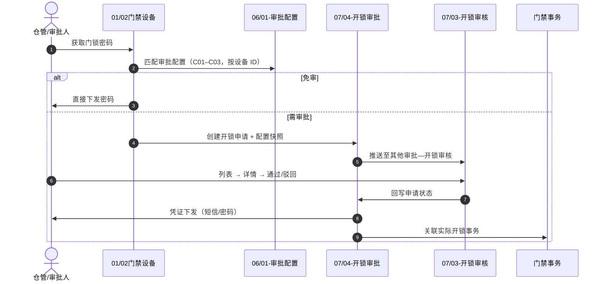

# 门禁开锁审批总索引

> **版本**：V2.1 | **更新日期**：2026-09-01
>
> **业务定位**：SYZC 6.2 **门禁开锁审批**链路配置与全链路编排入口。本目录维护：① 何时需要审批（配置）；② 跨模块流程索引与推演。**不**维护申请单据、待办 UI、凭证字段——上述归属 [07/我的申请管理](../07-审批中心/03-业务审批/04-我的申请管理/我的申请管理总索引.md) 与 [07/开锁审核](../07-审批中心/05-其他审批/03-开锁审核/开锁审核主PRD.md)。
>
> **跨域关联**：
> - 上游：[01-物联网IOT管理/02门禁设备](../01-物联网IOT管理/02门禁设备/)（设备主档、获取密码入口）
> - 申请执行：[07-审批中心/03-业务审批/04-我的申请管理/04-开锁审批](../07-审批中心/03-业务审批/04-我的申请管理/04-开锁审批/开锁申请字段清单.md)
> - 审批人 UI：[07-审批中心/05-其他审批/03-开锁审核主PRD](../07-审批中心/05-其他审批/03-开锁审核/开锁审核主PRD.md)（其他审批—开锁审批）
> - 下游：密码/短信服务、[01-物联网IOT管理/02门禁设备](../01-物联网IOT管理/02门禁设备/)的设备数据及基准版[门禁事务记录](../../../🌟🌟🌟-最新基准版/B端PC/02-仓储/20-设备管理-门禁事务记录/)（实际开锁事实）

---

## 一、本目录文档分工

| 文档 | 承接能力 | 不承接 |
| :--- | :--- | :--- |
| [01-审批配置/](./01-审批配置/) | 按指定设备的审批范围、节点、超时、启停用、C01–C03 设备匹配；PC 列表/新增编辑/详情 ASCII + Demo | 申请、待办、凭证 |
| [门禁开锁审批-业务流程推演](./门禁开锁审批-业务流程推演.md) | 时序图、设计决策、异常分支、已确认口径 | 模块规则正文 |
| [门禁开锁审批-业务规则规格](./门禁开锁审批-业务规则规格.md) | 跨模块对象分层、规则 ID 速查、联动摘要 | 状态机/校验明细（见各模块 唯一定义来源） |

---

## 二、模块目录结构

```text
06-门禁开锁审批/
├── 门禁开锁审批总索引.md                    # 本文件
├── 门禁开锁审批-业务流程推演.md          # 推演与设计决策 唯一定义来源
├── 门禁开锁审批-业务规则规格.md          # 全链路编排索引（非规则正文）
└── 01-审批配置/                     # 配置策略唯一定义来源
    ├── 门禁开锁审批配置主PRD.md
    ├── 门禁开锁审批配置业务规则规格.md
    ├── 门禁开锁审批配置字段清单.md
    ├── 门禁开锁审批配置_ASCII_列表页.md
    ├── 门禁开锁审批配置_ASCII_新增编辑页.md
    ├── 门禁开锁审批配置_ASCII_详情页.md
    ├── 门禁开锁审批配置_Demo_列表页.md
    ├── 门禁开锁审批配置_Demo_新增编辑页.md
    └── 门禁开锁审批配置_Demo_详情页.md
```

---

## 三、跨模块 唯一定义导航

| 能力 | 文档入口 |
| :--- | :--- |
| 审批配置 CRUD | [门禁开锁审批配置业务规则规格](./01-审批配置/门禁开锁审批配置业务规则规格.md) |
| 审批处理（其他审批—开锁审批） | [07-审批中心/05-其他审批/03-开锁审核业务规则规格](../07-审批中心/05-其他审批/03-开锁审核/开锁审核业务规则规格.md) |
| 开锁申请 / 凭证（不含关联事务，W00） | [开锁申请业务规则规格](../07-审批中心/03-业务审批/04-我的申请管理/04-开锁审批/开锁申请业务规则规格.md) |
| 设备入口与免审分支 | [门禁设备主PRD](../01-物联网IOT管理/02门禁设备/门禁设备主PRD.md) §3.4 |

---

## 四、跨模块分工与对象归属

| 模块 | 管什么 | 不管什么 |
| :--- | :--- | :--- |
| **06/01-审批配置** | 何时需审批、审批链怎么配 | 申请、待办 UI、凭证 |
| **07/04-开锁审批** | 申请主表、凭证；我的申请管理/我的申请记录（H5 三 Tab） | 审批人列表 UI、配置 CRUD、门禁事务强制关联 |
| **07/03-开锁审核** | 其他审批—开锁审核 列表/详情/通过/驳回 | 申请状态机正文、配置 CRUD |
| **07 审批平台（基准）** | 待办/已办/抄送（接入流程配置的子类型） | 开锁等独立其他审批 |

| 对象 | 唯一定义文档 |
| :--- | :--- |
| 审批配置 | [门禁开锁审批配置业务规则规格](./01-审批配置/门禁开锁审批配置业务规则规格.md) |
| 开锁申请主表 | [01开锁申请主表字段清单](../07-审批中心/03-业务审批/04-我的申请管理/04-开锁审批/01-字段清单/01开锁申请主表字段清单.md) |
| 临时开锁凭证 | [02临时开锁凭证字段清单](../07-审批中心/03-业务审批/04-我的申请管理/04-开锁审批/01-字段清单/02临时开锁凭证字段清单.md) |
| 审批人 UI | [开锁审核业务规则规格](../07-审批中心/05-其他审批/03-开锁审核/开锁审核业务规则规格.md) |
| 全链路推演 | [门禁开锁审批-业务流程推演](./门禁开锁审批-业务流程推演.md) |

### 端到端时序



---

## 五、阅读路径建议

| 角色 | 建议阅读顺序 |
| :--- | :--- |
| 产品 / 研发（配置页） | 01 主PRD → 01 业务规则 → 01 字段清单 → ASCII/Demo |
| 产品 / 研发（申请/审批） | [我的申请管理总索引](../07-审批中心/03-业务审批/04-我的申请管理/我的申请管理总索引.md) → [开锁审核主PRD](../07-审批中心/05-其他审批/03-开锁审核/开锁审核主PRD.md) → 业务流程推演 |
| 架构 / 联调 | 本总索引 → 业务规则规格 → 业务流程推演全文 |

---

## 修订记录

| 日期 | 版本 | 变更内容 |
| :--- | :---: | :--- |
| 2026-08-28 | V1.0 | 初版 |
| 2026-08-28 | V1.1 | 02-开锁申请 迁至 07-审批中心 |
| 2026-08-28 | V1.3 | 目录由 06-门锁配置 更名为 06-门禁开锁审批 |
| 2026-08-28 | V1.4 | 审批人 UI 唯一定义来源 迁至 07-审批中心/05-其他审批/03-开锁审核 |
| 2026-08-28 | V1.5 | 01-审批配置补充列表/新增编辑/详情 ASCII 线框 |
| 2026-08-31 | V2.0 | 合并原 00-06-07-08 联合导读；更新 07 入口链接 |
| 2026-09-01 | V2.1 | 评审调整：配置仅指定设备；审批方式固定任一人通过；补充逻辑删除说明 |
